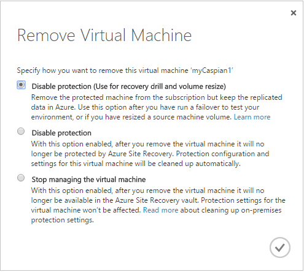

<properties
	pageTitle="Manage registration and protection" 
	description="Azure Site Recovery coordinates the replication, failover and recovery of virtual machines located on on-premises servers to Azure or a secondary datacenter. Use this article to unregister servers from a Site Recovery vault, and to disable protection for virtual machines and physical servers." 
	services="site-recovery" 
	documentationCenter="" 
	authors="rayne-wiselman" 
	manager="jwhit" 
	editor=""/>

<tags 
	ms.service="site-recovery" 
	ms.devlang="na"
	ms.topic="article"
	ms.tgt_pltfrm="na"
	ms.workload="storage-backup-recovery" 
	ms.date="08/05/2015" 
	ms.author="raynew"/>

# Manage registration and protection

This article describes how to unregister servers from the Site Recovery vault and how to disable protection for virtual machines protected by Site Recovery. If you have any questions after reading this article post them on the [Azure Recovery Services Forum](https://social.msdn.microsoft.com/forums/azure/home?forum=hypervrecovmgr).

## Unregister a VMM server

You unregister a VMM server from a vault by deleting the server on the **Servers** tab in the Azure Site Recovery portal. Note that:

-  **Connected VMM server**: We recommend you unregister the VMM server when it's connected to Azure. This ensures that settings on the on-premise VMM server, and the VMM servers associated with it (VMM servers that contain clouds that are mapped to clouds on the server you want to delete) are cleaned up properly. We recommend you only remove an unconnected server if there's a permanent issue with connectivity.
- **Unconnected VMM server**: If the VMM server isn’t connected when you delete it you’ll need to run a script manually to perform the cleanup. The script is available in the [Microsoft gallery](https://gallery.technet.microsoft.com/scriptcenter/Cleanup-Script-for-Windows-95101439). Note the VMM ID of the server in order to complete the manual cleanup process.
- **VMM server in cluster**: If you need to unregister a VMM server that’s deployed in a cluster do the following:

	- If the server's connected, delete the connected VMM server on the **Servers** tab. To uninstall the Provider on the server, log in on every cluster node and uninstall it from the Control Panel. Run the cleanup script referenced in the previous section on all passive nodes in the cluster to delete registration entries.
	- If the server isn't connected you'll need to run the cleanup script on all cluster nodes.

### Unregister an unconnected VMM server

On the VMM server you want to remove:

1. Unregister the VMM server from the Azure portal.
2. On the VMM server, download the cleanup script.
3. Open PowerShell with the Run as Administrator option to change the execution policy for the default (LocalMachine) scope.
4. Follow the instructions in the script. 

On VMM servers that have clouds that are paired with clouds on the server you're removing:

1. Run the cleanup script and follow steps 2 to 4.
2. Specify the VMM ID for the VMM server that's been unregistered. 
3. This script will remove the registration information for the VMM Server and cloud pairing information.

## Unregister a Hyper-V server in a Hyper-V site

When Azure Site Recovery is deployed to protect virtual machines located on a Hyper-V server in a Hyper-V site (with no VMM server) you can unregister a Hyper-V server from a vault as follows:

1. Disable protection for virtual machines located on the Hyper-V server.
2. On the **Servers** tab in the Azure Site Recovery portal, select the server > Delete. The server doesn’t have to be connected to Azure when you do this.
3. Run the following script to clean up settings on the server and unregister it from the vault. 

	    pushd .
	    try
	    {
		     $windowsIdentity=[System.Security.Principal.WindowsIdentity]::GetCurrent()
		     $principal=new-object System.Security.Principal.WindowsPrincipal($windowsIdentity)
		     $administrators=[System.Security.Principal.WindowsBuiltInRole]::Administrator
		     $isAdmin=$principal.IsInRole($administrators)
		     if (!$isAdmin)
		     {
		        "Please run the script as an administrator in elevated mode."
		        $choice = Read-Host
		        return;       
		     }
	
		    $error.Clear()    
			"This script will remove the old Azure Site Recovery Provider related properties. Do you want to continue (Y/N) ?"
			$choice =  Read-Host
		
			if (!($choice -eq 'Y' -or $choice -eq 'y'))
			{
			"Stopping cleanup."
			return;
			}
		
			$serviceName = "dra"
			$service = Get-Service -Name $serviceName
			if ($service.Status -eq "Running")
		    {
				"Stopping the Azure Site Recovery service..."
				net stop $serviceName
			}
		
		    $asrHivePath = "HKLM:\SOFTWARE\Microsoft\Azure Site Recovery"
			$registrationPath = $asrHivePath + '\Registration'
			$proxySettingsPath = $asrHivePath + '\ProxySettings'
		    $draIdvalue = 'DraID'
	    
		    if (Test-Path $asrHivePath)
		    {
		        if (Test-Path $registrationPath)
		        {
		            "Removing registration related registry keys."	
			        Remove-Item -Recurse -Path $registrationPath
		        }
	
		        if (Test-Path $proxySettingsPath)
	        {
			        "Removing proxy settings"
			        Remove-Item -Recurse -Path $proxySettingsPath
		        }
	
		        $regNode = Get-ItemProperty -Path $asrHivePath
		        if($regNode.DraID -ne $null)
		        {            
		            "Removing DraId"
		            Remove-ItemProperty -Path $asrHivePath -Name $draIdValue
		        }
			    "Registry keys removed."
		    }
	
		    # First retrive all the certificates to be deleted
			$ASRcerts = Get-ChildItem -Path cert:\localmachine\my | where-object {$_.friendlyname.startswith('ASR_SRSAUTH_CERT_KEY_CONTAINER') -or $_.friendlyname.startswith('ASR_HYPER_V_HOST_CERT_KEY_CONTAINER')}
			# Open a cert store object
			$store = New-Object System.Security.Cryptography.X509Certificates.X509Store("My","LocalMachine")
			$store.Open('ReadWrite')
			# Delete the certs
			"Removing all related certificates"
		    foreach ($cert in $ASRcerts)
		    {
			    $store.Remove($cert)
		    }
	    }catch
	    {	
		    [system.exception]
		    Write-Host "Error occured" -ForegroundColor "Red"
		    $error[0] 
		    Write-Host "FAILED" -ForegroundColor "Red"
	    }
	    popd

## Stop protecting a Hyper-V virtual machine

If you want to stop protecting a Hyper-V virtual machine you'll need to remove protection for it. Depending on how you remove protection you might need to clean up the protection settings manually on the machine. 

### Remove protection

1. In the **Virtual Machines** tab of the cloud properties, select the virtual machine > **Remove**.
2. On the **Confirm Removal of Virtual Machine** page you have a couple of options:

	- **Disable protection**—If you enable and save this option the virtual machine will no longer be protected by Site Recovery. Protection settings for the virtual machine will be cleaned up automatically.
	- **Remove from the vault**—If you select this option the virtual machine will be removed only from the Site Recovery vault. On-premises protection settings for the virtual machine won’t be affected. You'll need to clean up settings manually to remove protection settings and remove the virtual machine from the Azure subscription and remove protection settings you’ll need to clean them up manually using the instructions below.

If you select to delete the virtual machine and its hard disks they will be removed from the target location.

### Clean up protection settings manually (between VMM sites)

If you selected **Stop managing the virtual machine**, manually clean up settings:

1. On the primary server run this script from the VMM console to clean up the settings for the primary virtual machine. In the VMM console click the PowerShell button to open the VMM PowerShell console. Replace SQLVM1 with the name of your virtual machine.

	     $vm = get-scvirtualmachine -Name "SQLVM1"
	     Set-SCVirtualMachine -VM $vm -ClearDRProtection

2. On the secondary VMM server run this script to clean up the settings for the secondary virtual machine:

	    $vm = get-scvirtualmachine -Name "SQLVM1"
	    Remove-SCVirtualMachine -VM $vm -Force

3. On the secondary VMM server, after you run the script refresh the virtual machines on the Hyper-V host server so that the secondary virtual machine gets re-detected in the VMM console.
4. The above steps will clear the replication settings only VMM server. If you want to remove virtual machine replication for the virtual machine. You’ll need to do the below steps on both the primary and secondary virtual machines. Run the below script to remove replication and replace SQLVM1 with the name of your virtual machine.

	    Remove-VMReplication –VMName “SQLVM1”

### Clean up protection settings manually (between on-premises VMM sites and Azure)

1. On the source VMM server run this script to clean up the settings for the primary virtual machine:

	    $vm = get-scvirtualmachine -Name "SQLVM1"
	    Set-SCVirtualMachine -VM $vm -ClearDRProtection

2. The above steps will clear the replication settings only VMM server. Once you have removed the replication from VMM server ensure to remove replication for the virtual machine running on the Hyper-V host server with this script. Replace SQLVM1 with the name of your virtual machine and host01.contoso.com with the name of the Hyper-V host server.

	    $vmName = "SQLVM1"
	    $hostName  = "host01.contoso.com"
	    $vm = Get-WmiObject -Namespace "root\virtualization\v2" -Query "Select * From Msvm_ComputerSystem Where ElementName = '$vmName'" -computername $hostName
	    $replicationService = Get-WmiObject -Namespace "root\virtualization\v2"  -Query "Select * From Msvm_ReplicationService"  -computername $hostName
	    $replicationService.RemoveReplicationRelationship($vm.__PATH)

### Clean up protection settings manually (between Hyper-V sites and Azure)

1. On the source Hyper-V host server, to remove replication for the virtual machine use this script. Replace SQLVM1 with the name of your virtual machine.

	    $vmName = "SQLVM1"
	    $vm = Get-WmiObject -Namespace "root\virtualization\v2" -Query "Select * From Msvm_ComputerSystem Where ElementName = '$vmName'"
	    $replicationService = Get-WmiObject -Namespace "root\virtualization\v2"  -Query "Select * From Msvm_ReplicationService"
	    $replicationService.RemoveReplicationRelationship($vm.__PATH)

## Stop protecting a VMware virtual machine or a physical server

If you want to stop protecting a VMware virtual machine or a physical server you'll need to remove protection for it. Depending on how you remove protection you might need to clean up the protection settings manually on the machine. 

### Remove protection

1. In the **Virtual Machines** tab of the cloud properties, select the virtual machine > **Remove**.
2. On the **Remove Virtual Machine** select one of options:

	- **Disable protection (use for recovery drill and volume resize)**—You'll only see and enable this option if you've:
		- **Resized the virtual machine volume**—When you resize a volume the virtual machine goes into a critical state. If this occurs select this option. It disables protection while retaining recovery points in Azure. When you reenable protection for the machine the data for the resized volume will be transferred to Azure.
		- **Run a failover**—After you've tested your environment by running a failover from on-premises VMware virtual machines or physical servers to Azure, select this option to start protecting your on-premises virtual machines again. This option disables each virtual machine, and then you'll need to reenable protection for them. Note that:
			- Disabling the virtual machine with this setting does not affect the replica virtual machine in Azure.
			- You mustn't uninstall the Mobility service from the virtual machine.
	
	- **Disable protection**—If you enable and save this option the machine will no longer be protected by Site Recovery. Protection settings for the machine will be cleaned up automatically.
	- **Remove from the vault**—If you select this option the machine will be removed only from the Site Recovery vault. On-premises protection settings for the machine won’t be affected. To remove settings on the machine and to remove the virtual machine from the Azure subscription and you’ll need to clean the settings up by uninstalling the Mobility service.
		

