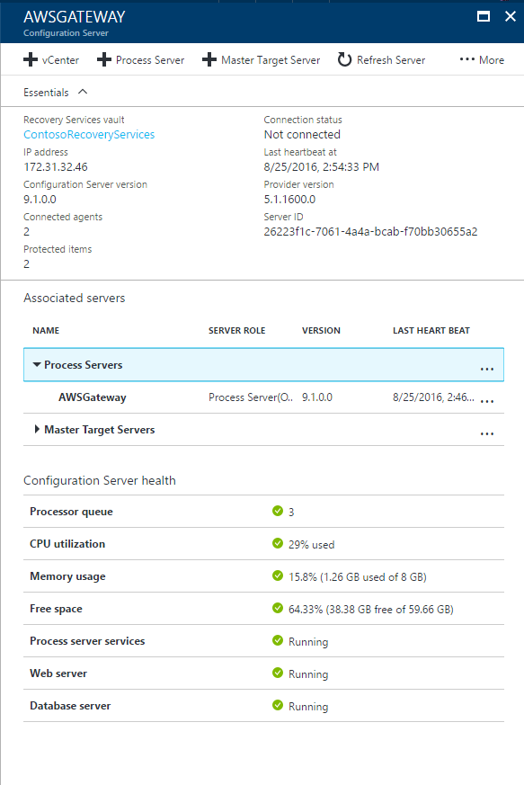
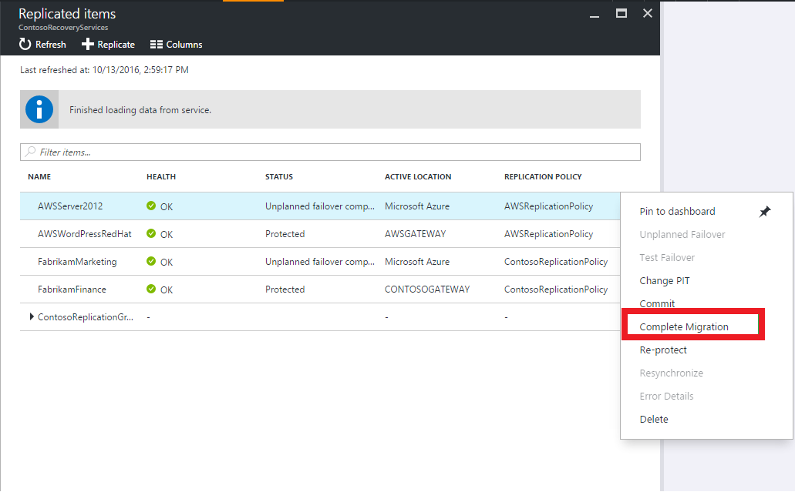

# Migrate virtual machines in Amazon Web Services (AWS) to Azure with Azure Site Recovery

This article describes how to migrate AWS Windows instances to Azure virtual machines with the [Azure Site Recovery](site-recovery-overview.md) service.

Migration is effectively a failover from AWS to Azure. You can't failback machines to AWS, and there's no ongoing replication. This article describes the steps for migration in the Azure portal, and are based on the instructions for [replicating a physical machine to Azure](site-recovery-vmware-to-azure.md).

Post any comments or questions at the bottom of this article, or on the [Azure Recovery Services Forum](https://social.msdn.microsoft.com/forums/azure/home?forum=hypervrecovmgr)

## Supported operating systems

Site Recovery can be used to migrate EC2 instances running any of the following operating systems:

- Windows(64 bit only)
    - Windows Server 2008 R2 SP1+ (Citrix PV drivers or AWS PV drivers only. **Instances running RedHat PV drivers are not supported**)
    Windows Server 2012
    Windows Server 2012 R2
- Linux (64 bit only)
    - Red Hat Enterprise Linux 6.7 (HVM virtualized instances only)

## Prerequisites

Here's what you need for this deployment

* **Configuration server**: An Amazon EC2 VM running Windows Server 2012 R2 is deployed as the configuration server. By default, the other Azure Site Recovery components (process server and master target server) are installed when you deploy the configuration server. This article describes the steps for migration in the Azure portal, and are based on the instructions for  [Learn more](site-recovery-components.md#vmware-to-azure)

* **EC2 instances**: The Amazon EC2 virtual machines instances that you want to migrate.

## Deployment steps

1. Create a Recovery Services vault

2. The Security Group of your EC2 instances should have rules configured to allow communication between the EC2 instance that you want to migrate, and the instance on which you plan to deploy the Configuration Server.

3. On the same Amazon Virtual Private Cloud as your EC2 instances, deploy an ASR configuration server. Refer the VMware / Physical to Azure prerequisites for configuration server deployment requirements

4.	Once your configuration server is deployed in AWS and registered with your Recovery Services vault, you should see the configuration server and process server under Site Recovery infrastructure as shown below:

  >[!NOTE]
  >It may take up to 15 minutes for the configuration server and process server to show up
  >

5. After you've deployed the configuration server, validate that it can communicate with the VMs that you want to migrate.

6. [Set up replication settings](site-recovery-setup-replication-settings-vmware.md)

7. Enable replication: Enable replication for the VMs you want to migrate. You can discover the EC2 instances using the private IP addresses, which you can get from the EC2 console.

8. Once the EC2 instances have been protected and the replication to Azure is complete, [run a Test Failover](site-recovery-test-failover-to-azure.md) to validate your application's performance in Azure 

9. Run a Failover from AWS to Azure for each VM. Optionally, you can create a recovery plan and run a Failover, to migrate multiple virtual machines from AWS to Azure. [Learn more](site-recovery-create-recovery-plans.md) about recovery plans.

10. For migration, you don't need to commit a failover. Instead, you select the Complete Migration option for each machine you want to migrate. The Complete Migration action finishes up the migration process, removes replication for the machine, and stops Site Recovery billing for the machine.

## Next steps

- [Prepare migrated machines to enable replication](site-recovery-azure-to-azure-after-migration.md) to another region for disaster recovery needs.
- Start protecting your workloads by [replicating Azure virtual machines.](site-recovery-azure-to-azure.md)
