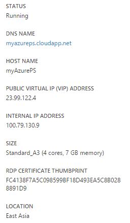
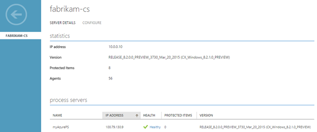
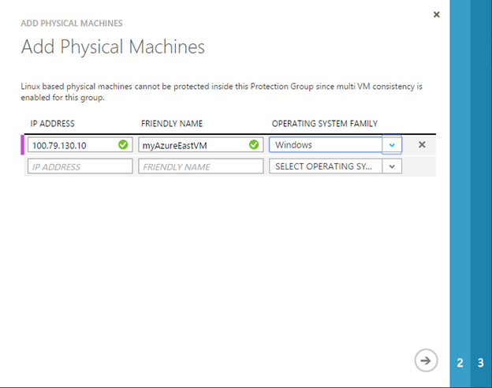

<properties
	pageTitle="Migrate Azure IaaS virtual machines from one Azure region to another"
	description="Use Azure Site Recovery to migrate Azure IaaS virtual machines from one Azure region to another."
	services="site-recovery"
	documentationCenter=""
	authors="rayne-wiselman"
	manager="jwhit"
	editor="tysonn"/>

<tags
	ms.service="site-recovery"
	ms.workload="backup-recovery"
	ms.tgt_pltfrm="na"
	ms.devlang="na"
	ms.topic="article"
	ms.date="08/26/2015"
	ms.author="raynew"/>

#  Migrate Azure IaaS virtual machines between Azure regions

## Overview

Azure Site Recovery contributes to your business continuity and disaster recovery (BCDR) strategy by orchestrating replication, failover and recovery of virtual machines in a number of deployment scenarios. For a full list of deployment scenarios see the [Azure Site Recovery overview](site-recovery-overview.md).

This article describes how to use Site Recovery to migrate Azure IaaS virtual machines from one Azure region to another. The articles uses most of the steps described in [Set up protection between on-premises VMware virtual machines or physical servers and Azure](site-recovery-vmware-to-azure.md). We suggest you read through that article for detailed instructions on each step in the deployment.

## Get started

Here's what you need before you start:

- **Configuration server**: An Azure virtual machine that acts as the configuration server. The configuration server coordinates communication between on-premises machines and Azure servers.
- **Master target server**: An Azure virtual machine that acts as the master target server. This server receives and retains replicated data from protected machines.
- **A process server**: A virtual machine running Windows Server 2012 R2. Protected virtual machines send replication data to this server.
- **IaaS virtual machines**: The VMs you want to migrate.

- Read more about these components in [What do I need?](site-recovery-vmware-to-azure.md#what-do-i-need)
- You should also read the guidelines on [capacity planning](site-recovery-vmware-to-azure.md#capacity-planning) and make sure you have all the [deployment prerequisites](site-recovery-vmware-to-azure.md#before-you-start) in place before you start.

## Deployment steps

1. [Create a vault](site-recovery-vmware-to-azure.md/#step-1-create-a-vault)
2. [Deploy a configuration server](site-recovery-vmware-to-azure.md#step-2-deploy-a-configuration-server) as an Azure VM.
3. [Deploy the master target server](site-recovery-vmware-to-azure.md#step-2-deploy-a-configuration-server) as an Azure VM.
4. [Deploy a process server](site-recovery-vmware-to-azure.md#step-4-deploy-the-on-premises-process-server). Note that:

	- You should deploy the process server on the same virtual network/subnet as the IaaS VMs you want to migrate. 
		

	- After you've deployed the process server validate that it can communicate with the virtual machines that you'll migrate.
	- Each VM you want to protect needs the Mobility service installed. This service sends data to the process server. The Mobility service can be installed manually or pushed and installed automatically by the process server when protection for the VM is enabled. Firewall rules on IaaS virtual machines that you want to migrate should be configured to allow push installation of this service. 

	- After the process server is deployed and registered with the configuration server in the Site Recovery vault it should show up under the **Configuration Servers** tab in the Site Recovery console. Note that this can take up to 15 minutes.
	
		

5. [Install the latest updates](site-recovery-vmware-to-azure.md#step-5-install-latest-updates). Make sure all the component servers you've installed are up-to-date.
6. [Create a protection group](site-recovery-vmware-to-azure.md#step-7-create-a-protection-group). In order to starting protecting migrated virtual machines using Site Recovery you need to set up a protection group. You specify replication settings for a group and they'll be applied to all machines that you add to that group. 
7. [Set up virtual machines](site-recovery-vmware-to-azure.md#step-8-set-up-machines-you-want-to-protect). You'll need to get the Mobility service installed on each VM (either automatically or manually).
8. [Step 8: Enable protection for virtual machines](site-recovery-vmware-to-azure.md#step-9-enable-protection). You enable protection for VMs by adding them to a protection group. Note that:

	- You can discover the IaaS virtual machines that you want to migrate to Azure using the private IP address of the virtual machines. Find this address on the virtual machine dashboard in Azure.
	-  On the tab for the protection group you created, click Add Machines > Physical Machines
		
	- Specify the private IP address of the virtual machine.
		- 
	- Protection will be enabled and the initial replication will run in accordance with the initial replication settings for the protection group.
9. [Step 9: Run an unplanned failover](site-recovery-failover.md#run-an-unplanned-failover). After initial replication is complete you can run an unplanned failover from one Azure region to another. Optionally, you can create a recovery plan and run an unplanned failover, to migrate multiple virtual machines between regions. [Learn more](site-recovery-create-recovery-plans.md) about recovery plans.
		
## Next steps

Post any comments or questions in the [Site Recovery forum](https://social.msdn.microsoft.com/forums/azure/home?forum=hypervrecovmgr)

