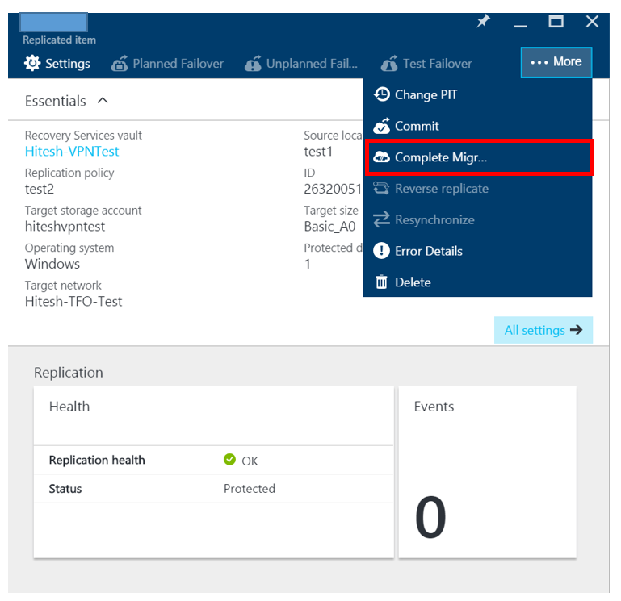

<properties
	pageTitle="Migrate VMware virtual machines to Azure using Azure Site Recovery | Microsoft Azure"
	description="Use Azure Site Recovery to migrate VMware virtual machines to Azure"
	services="site-recovery"
	documentationCenter=""
	authors="rajani-janaki-ram"
	manager="jwhit"
	editor="tysonn"/>

<tags
	ms.service="site-recovery"
	ms.workload="backup-recovery"
	ms.tgt_pltfrm="na"
	ms.devlang="na"
	ms.topic="article"
	ms.date="08/21/2016"
	ms.author="rajanaki"/>

#  Migrate VMware virtual machines to Azure using Azure Site Recovery 

## Overview

Welcome to Azure Site Recovery! Use this article to migrate VMware virtual machines to Azure. Before you start, note that:

- Azure has two different deployment models for creating and working with resources: Azure Resource Manager and classic. Azure also has two portals – the Azure classic portal that supports the classic deployment model, and the Azure portal with support for both the deployment models. The basic steps for migration are the same whether you're configuring Site Recovery in Resource Manager or in classic. However the UI instructions and screen-shots in this article are relevant for the Azure portal.

- The migration instructions in this article are based on the instructions for replicating a VMware virtual machine to Azure. It includes links to the steps in [Replicate VMware VMs or physical servers to Azure](site-recovery-vmware-to-azure.md), which describes how to replicate a VMware virtual machine in the Azure portal.

Post any comments or questions at the bottom of this article, or on the [Azure Recovery Services Forum](https://social.msdn.microsoft.com/forums/azure/home?forum=hypervrecovmgr).

## Prerequisites

Here's what you need for this deployment:

- **Configuration server**: An on-premises VM running Windows Server 2012 R2 which acts as the configuration server. You install the other Site Recovery components (including the process server and master target server) on this VM too. Read more in [scenario architecture](site-recovery-vmware-to-azure.md#scenario-architecture) and [configuration server prerequisites](site-recovery-vmware-to-azure.md#configuration-server-prerequisites).

- **Process server**: The first process server is installed by default on the configuration server. The process server receives replication data from protected machines and optimizes it with caching, compression, and encryption before sending to Azure.  [Follow these instructions](#deploy-additional-process-servers) to set up additional process servers to scale your environment.
- **VMWare virtual machines**: The VMs you want to migrate to Azure. 

## Steps to migrate:

This section describes the deployment steps in the [Azure portal](http://portal.azure.com)

1. [Create a vault](site-recovery-vmware-to-azure.md#create-a-recovery-services-vault).

2. [Deploy a configuration server](site-recovery-vmware-to-azure.md#step-2-set-up-the-source-environment).

3. After you've deployed the configuration server, check that it can communicate with the VMs that you want to migrate.

4. [Set up replication settings](site-recovery-vmware-to-azure.md#step-4-set-up-replication-settings). Create a replication policy and assign to the configuration server.

5. [Install the Mobility service](site-recovery-vmware-to-azure.md#step-6-replication-application). Each VM you want to protect needs the Mobility service installed. This service sends data to the process server. The Mobility service can be installed manually or pushed and installed automatically by the process server when protection for the VM is enabled. Firewall rules on the VMs that you want to migrate should be configured to allow push installation of this service.

6. [Enable replication](site-recovery-vmware-to-azure.md#enable-replication). Enable replication for the VMs you want to migrate. You can discover the virtual machines that you want to migrate to Azure from the VMware environment, using the registered vCenter server/vSphere host.

7. Test the deployment: Before you perform the migration, test your deployment by running a test failover for a single virtual machine, or a recovery plan that contains one or more virtual machines.
To run a test failover we recommend that you create a new Azure network that’s isolated from your  production environment. [Learn more](site-recovery-failover.md#run-a-test-failover) about running test failovers.

8. [ Run an unplanned failover](site-recovery-failover.md#run-an-unplanned-failover). After initial replication is complete, you can run an unplanned failover from the VMware source to Azure. Optionally, you can create a recovery plan and run an unplanned failover, to migrate multiple virtual machines to Azure. [Learn more](site-recovery-create-recovery-plans.md) about recovery plans.

8. Navigate to the VM, click on More->Complete Migration. This removes the machine from the vault, and it will no longer be protected by Azure Site Recovery. Protection configuration and settings for this machine will be cleaned up automatically. Azure Site Recovery billing for the machine will also be stopped. 

     

## Next steps

Learn more about other replication scenarios in [What is Azure Site Recovery?](site-recovery-overview.md)
