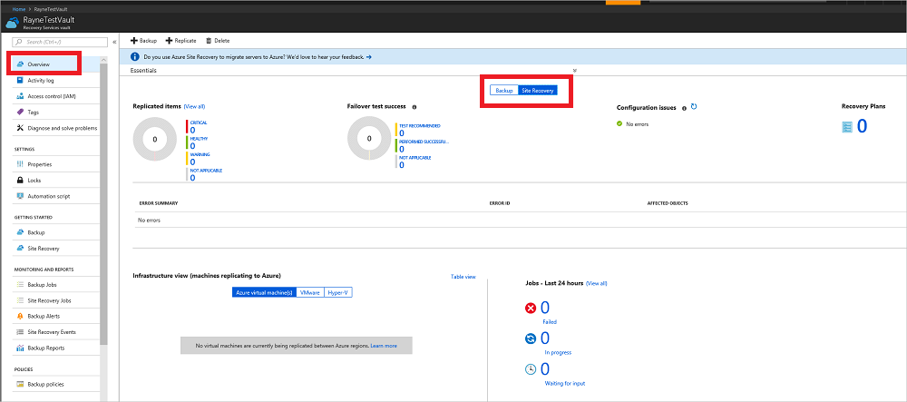
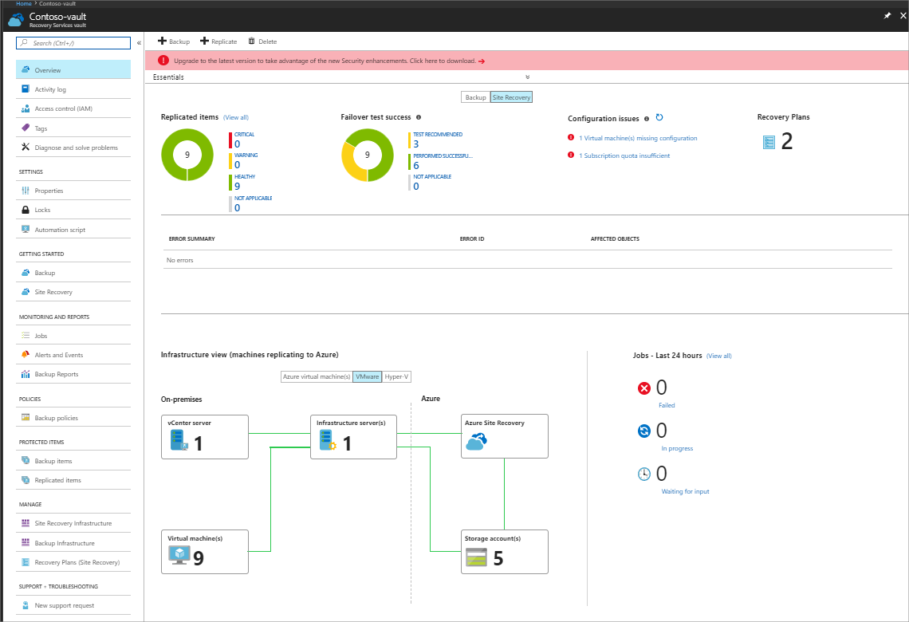
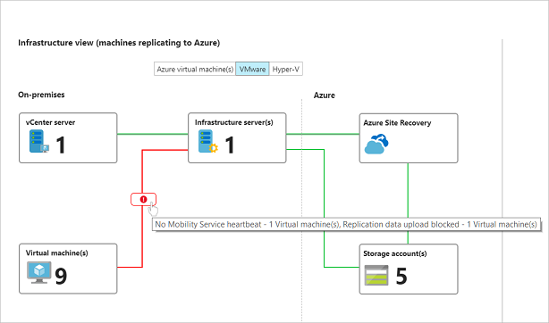
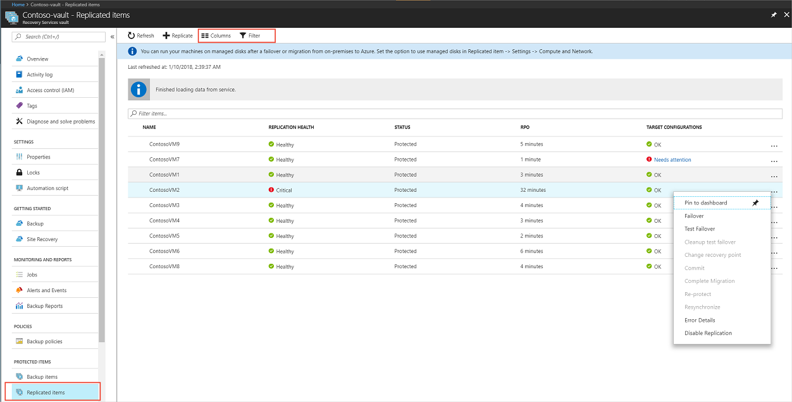
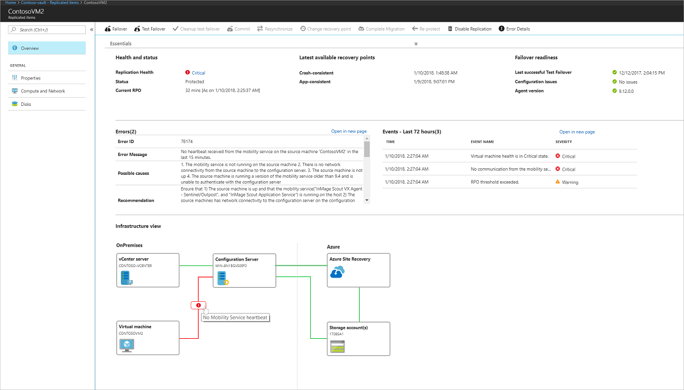
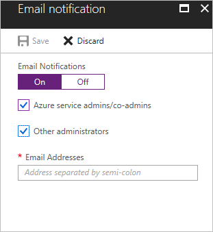

# Monitor and troubleshoot Site Recovery

In this article, you learn how to use Azure Site Recovery's in built monitoring features for monitoring and troubleshooting. 

## Use the dashboard

1. In the vault, click **Overview** to open the Site Recovery dashboard. There are dashboard pages for both Site Recovery and Backup, and you can switch between them.

    

2.  The dashboard consolidates all monitoring information for the vault in a single location. From the dashboard, you can drill down into different areas. 

    .

3. On **Replicated items**, click **View All** to see all the servers in the vault.
4. Drill down by clicking the status details in each section. In **Infrastructure view**, you can sort monitoring information by the type of machines you're replicating.

## Monitor replicated items

The replicated items section shows the health of all machines that have replication enabled in the vault.

**State** | **Details**
--- | ---
Healthy | Replication is progressing normally. No error or warning symptoms are detected.
Warning | One or more warning symptoms that might impact replication are detected.
Critical | One or more critical replication error symptoms have been detected.   These error symptoms are typically indicators that replication stuck, or not progressing as fast as the data change rate.
Not applicable | Servers that aren't currently expected to be replicating. This might include machines that have been failed over.

## Monitor test failovers

You can view the test failover status for machines in the vault.

- We recommend that you run a test failover on replicated machines at least once every six months. It's a way to check that failover is working as expected without disrupting your production environment. 
- A test failover is considered successful only after the failover and post-failover cleanup have completed successfully.

**State** | **Details**
--- | ---
Test recommended | Machines that haven't had a test failover since protection was enabled.
Performed successfully | Machines with or more successful test failovers.
Not applicable | Machines that aren't currently eligible for a test failover. For example, machines that are failed over, have initial replication/test failover/failover in progress.

## Monitor configuration issues

The **Configuration issues** section shows a list of issues that may impact your ability to successfully fail over.

- Configuration issues (except for software update availability), are detected by a periodic validator operation that runs every 12 hours by default. You can force the validator operation to run immediately by clicking the refresh icon next to the **Configuration issues** section heading.
- Click the links to get more details. For issues impacting specific machines, click the **needs attention** in the **Target configurations** column. The details include remediation recommendations.

**State** | **Details**
--- | ---
Missing configurations | A necessary setting is missing, such as a recovery network or a resource group.
Missing resources | A specified resource can't be found or isn't available in the subscription. For example, the resource was deleted or migrated. Monitored resources included the target resource group, target VNet/subnet, log/target storage account, target availability set, target IP address.
Subscription quota |  The available subscription resource quota balance is compared against the balance needed to fail over all of the machines in the vault.   If there aren't enough resources, an insufficient quota balance is reported.   Quotas are monitoring for VM core count, VM family core count, network interface card (NIC) count.
Software updates | The availability of new software updates, and information about expiring software versions.

## Monitoring errors 
The **Error summary** section shows currently active error symptoms that may impact replication of servers in the vault, and the number of impacted machines.

- At the beginning of the section, errors impacting on-premises infrastructure components are shown. For example, non-receipt of a heartbeat from the Azure Site Recovery Provider running on the on-premises configuration server, VMM server, or Hyper-V host.
- Next, replication error symptoms impacting replicated servers are shown.
- The table entries are sorted by decreasing order of the error severity, and then by decreasing count order of the impacted machines.
- The impacted server count is a useful way to understand whether a single underlying issue may be impacting multiple machines. For example, a network glitch could potentially impact all machines replicating to Azure. 
- Multiple replication errors can occur on a single server. In this case, each error symptom counts that server in the list of its impacted servers. After the issue is fixed, replication parameters improve, and the error is cleared from the machine.

## Monitor the infrastructure.

The **Infrastructure view** shows the infrastructure components involved in replication, and connectivity health between servers and the Azure services.

- A green line indicates that connection is healthy.
- A red line with the verlaid error icon indicates the existence of one or more error symptoms that impact connectivity.
-  Hover the mouse pointer over the error icon to show the error and the number of impacted entities. Click the icon for a filtered list of impacted entities.

    

## Tips for monitoring the infrastructure

- Make sure that the on-premises infrastructure components (configuration server, process servers, VMM servers, Hyper-V hosts, VMware machines) are running the latest versions of the Site Recovery Provider and/or agents.
- To use all the features in the infrastructure view, you should be running [Update rollup 22](https://support.microsoft.com/help/4072852) for these components.
- To use the infrastructure view, select the appropriate replication scenario in your environment. You can drill down in the view for more details. The following table shows which scenarios are represented.

    **Scenario** | **State**  | **View available?**
    --- |--- | ---
    **Replication between on-premises sites** | All states | No 
    **Azure VM replication between Azure regions**  | Replication enabled/initial replication in progress | Yes
    **Azure VM replication between Azure regions** | Failed over/fail back | No   
    **VMware replication to Azure** | Replication enabled/initial replication in progress | Yes     
    **VMware replication to Azure** | Failed over/failed back | No      
    **Hyper-V replication to Azure** | Failed over/failed back | No

- To see the infrastructure view for a single replicating machine, in the vault menu, click **Replicated items**, and select a server.  

### Common questions

**Why is the count of virtual machines in the vault infrastructure view different from the total count shown in the replicated items?**

The vault infrastructure view is scoped by replication scenarios. Only machines in currently selected replication scenario are included in the count for the view. In addition, we only count VMs that are configured to replicate to Azure. Failed over machines, or machines replicating back to an on-premises site aren't counted in the view.

**Why is the count of replicated items shown in the Essentials drawer different from the total count of replicated items on the dashboard?**

Only machines for which initial replication has completed are included in the count shown in the Essentials drawer. On the replicated items the total includes all the machines in the vault, including those for which initial replication is currently in progress.

## Monitor recovery plans

In the **Recovery plans section** you can review the number of plans, create new plans, and modify existing ones.  

## Monitor jobs

The **Jobs** section reflects the status of Site Recovery operations.

- Most operations in Azure Site Recovery are executed asynchronously, with a tracking job being created and used to track progress of the operation. 
- The job object has all the information you need to track the state and the progress of the operation. 

Monitor jobs as follows:

1. In the dashboard > **Jobs** section, you can see a summary of jobs that have completed, are in progress, or waiting for input, in the last 24 hours. You can click on any state to get more information about the relevant jobs.
2. Click **View all** to see all jobs in the last 24 hours.

    > [!NOTE]
    > You can also access job information from the vault menu > **Site Recovery Jobs**. 

2. In the **Site Recovery Jobs** list, a list of jobs is displayed. On the top menu you can get error details for a specific jobs, filter the jobs list based on specific criteria, and export selected job details to Excel.
3. You can drill into a job by clicking it. 

## Monitor virtual machines

In addition dashboard, you can monitor machines in the virtual machines page. 

1. In the vault, click **Replicated items** to get a list of replicated machines.  Alternately, you can get to a filtered list of the protected items by clicking any of the scoped shortcuts on the dashboard page.

    

2. On the **Replicated items** page,  you can view and filter information. On the action menu at the top, you can perform actions for a particular machine, including running a test failover, or viewing specific errors.
3.  Click **Columns** to show additional colums,  For example to show RPO, target configuration issues, and replication errors.
4. Click **Filter** to view information based on specific parameters such as replication health, or a particular replication policy.
5. Right-click a machine to initiate operations such as test failover for it, or to view specific error details associated with it.
6. Click a machine to drill into more details for it. Details include:
      - **Replication information**: Current status and health of the machine.
      - **RPO** (recovery point objective): Current RPO for the virtual machine and the time at which the RPO was last computed.
      - **Recovery points**: Latest available recovery points for the machine.
      - **Failover readiness**: Indicates whether a test failover was run for the machine, the agent version running on the machine (for machines running the Mobility service), and any configuration issues.
      - **Errors**: List of replication error symptoms currently observed on the machine, and possible causes/actions.
      - **Events**: A chronological list of recent events impacting the machine. Error details shows the currently observable error symptoms, while events is a historical record of issues that have impacted the machine.
      - **Infrastructure view**: Shows state of infrastructure for the scenario when machines are replicating to Azure.

    

### Common questions

**How is RPO different from the latest available recovery point?**

- Site Recovery uses a multi-step asynchronous process to replicate machines to Azure.
- In the penultimate step of replication, recent changes on the machine, along with metadata, are copied into a log/cache storage account.
- These changes, along with the tag to identify a recoverable point, are written to the storage account in the target region.
-  Site Recovery can now generate a recoverable point for the virtual machine.
- At this point, the RPO has been met for the changes uploaded to the storage account thus far. In other words, the machine RPO at this point is equal to amount of time elapsed from the timestamp corresponding to the recoverable point.
- Now, Site Recovery picks the uploaded data from the storage account, and applies it to the replica disks created for the machine.
- Site Recovery then generates a recovery point, and makes this point available for recovery at failover. Thus the latest available recovery point indicates the timestamp corresponding to the latest recovery point that has already been processed and applied to the replica disks.

> [!NOTE]
> An incorrect system time on the replicating source machine, or on on-premises infrastructure servers will skew the computed RPO value. For accurate RPO reporting, make sure that the system clock is accurate on all servers and machines. 

## Subscribe to email notifications

You can subscribe to receive email notifications for these critical events:
 
- Critical state for replicated machine.
- No connectivity between the on-premises infrastructure components and Site Recovery service. Connectivity between Site Recovery and on-premises servers registered in a vault is detected using a heartbeat mechanism.
- Failover failures.

Subscribe as follows:

In the vault > **Monitoring and Reports** section, click **Site Recovery Events**.
2. Click **Email notifications**.
3. In **Email notification**, turn on notifications and specify who to send to. You can send to all subscription admins be sent notifications, and optionally specific email addresses.

    
