<properties
	pageTitle="Monitor and troubleshoot protection for virtual machines and physical servers | Microsoft Auzre" 
	description="Azure Site Recovery coordinates the replication, failover and recovery of virtual machines located on on-premises servers to Azure or a secondary datacenter. Use this article to monitor and troubleshoot  VMM or Hyper-V Site protection." 
	services="site-recovery" 
	documentationCenter="" 
	authors="anbacker" 
	manager="mkjain" 
	editor=""/>

<tags 
	ms.service="site-recovery" 
	ms.devlang="na"
	ms.topic="article"
	ms.tgt_pltfrm="na"
	ms.workload="storage-backup-recovery" 
	ms.date="07/06/2016" 
	ms.author="anbacker"/>
	
# Monitor and troubleshoot protection for virtual machines and physical servers

This Monitoring and Troubleshooting Guide enables you to learn tracking the replication health and troubleshooting techniques for Azure Site Recovery.

## Understanding the components

### VMware/Physical Site Deployment for replication between on-premises and Azure.
To setup DR between on-premises VMware/Physical machine; Configuration Server, Master Target and Process Server needs to configured. While enabling protection for the source server Azure Site Recovery will install Mobility service. Post on-premises outage once the source server fails-over to Azure, customers needs to setup a Process Server in Azure and a Master Target server on-premises to protect the source server back to rebuilt on-premises. 

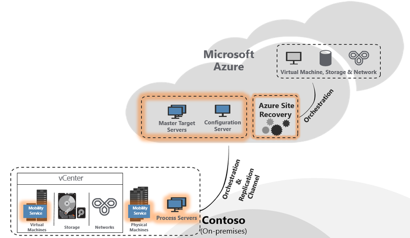

### VMM Site Deployment for replication between on-premises site.

As part of setting up DR between two on-premises location; Azure Site Recovery Provider needs to be downloaded and installed on the VMM server. Provider needs internet connectivity to ensure that all the operations triggered from Azure Portal gets translated to on-premises operations like enable protection, shutdown primary side virtual machines as part of failovers etc.

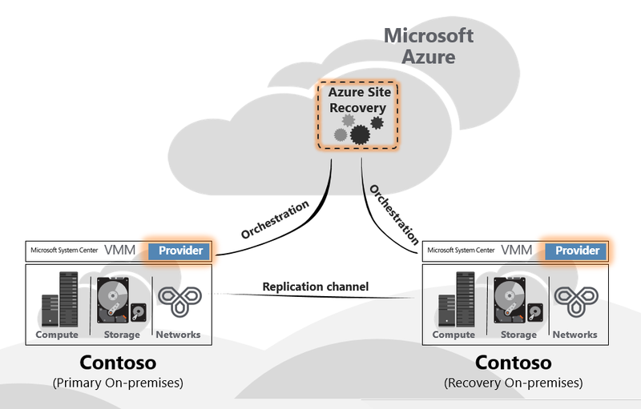

### VMM Site Deployment for replication between on-premises & Azure.

As part of setting up DR between on-premises & Azure; Azure Site Recovery Provider needs to be downloaded and installed on the VMM server along with Azure Recovery Services Agent which needs to be installed on each Hyper-V host. Refer [Understanding Site to Azure Protection](./site-recovery-understanding-site-to-azure-protection.md) for more information.

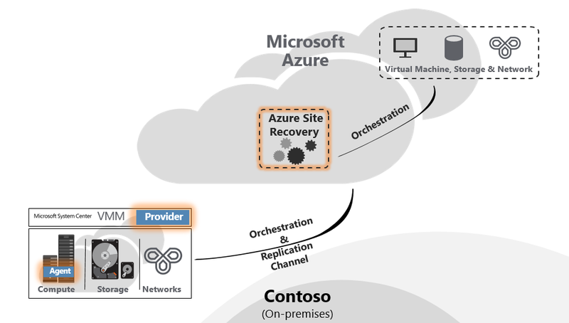

### Hyper-V Site Deployment for replication between on-premises & Azure

This is same as that of VMM Deployment – only difference being Provider & Agent gets installed on the Hyper-V host itself. Refer [Understanding Site to Azure Protection](./site-recovery-understanding-site-to-azure-protection.md) for more information.

## Monitor configuration, protection and recovery operations

Every operation in ASR gets audited and is tracked under the “JOBS” tab. In case of any configuration, protection or recovery error navigate to the JOBS tab and see if there are any failures.

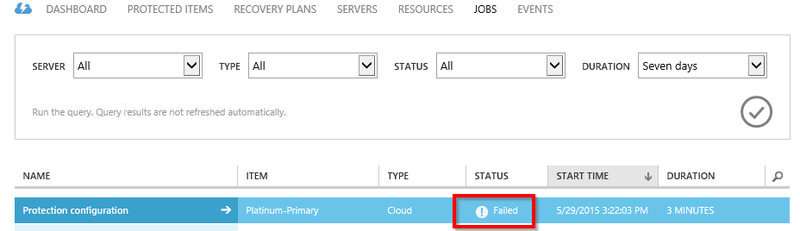

Once you find failures under the JOBS view, select the JOB and click ERROR DETAILS for that job.

The error details will help you identify possible cause and recommendation for the issue.

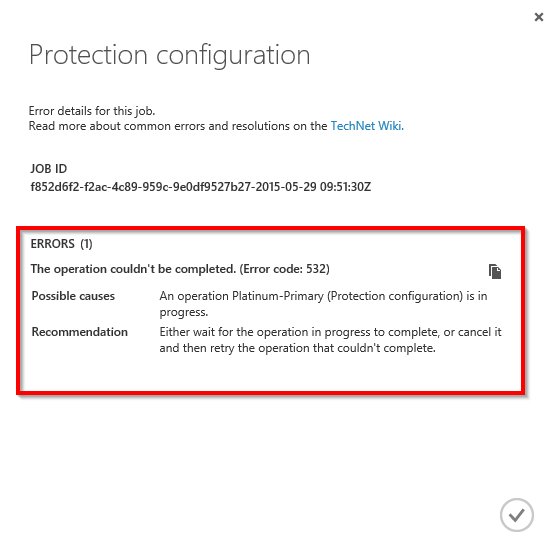

In the above case there seems to be another operation which is in progress because of which Protection configuration is failing. Ensure that you resolve the issue as per the recommendation – there-after click RESART to re-initiate the operation.

Option to RESTART is not available for all operations – for those which doesn’t have the RESTART option navigate back to the object and redo the operation once again. Every JOB can be cancelled at any point of time while in-progress using the CANCEL button.

## Monitor replication health for virtual machine

ASR provider central & remote monitoring through the Azure Portal for each of the protected entities. Navigate to the PROTECTED ITEMS there-after select VMM CLOUDS or PROTECTION GROUPS. VMM CLOUDS tab is only for VMM based deployments and all other scenarios have the protected entities under PROTECTION GROUPS tab.

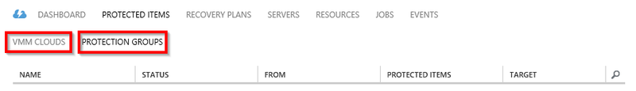

There-after select the protected entity under the respective cloud or the protection group. Once you select the protected entity all allowed operations are shown in the bottom pane.

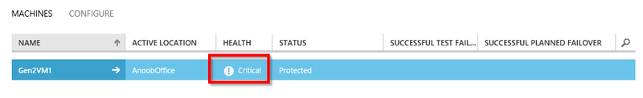

As shown above in-case the virtual machine HEALTH is critical – you can click the ERROR DETAILS button on the bottom to see the error. Based on the “Possible causes” and “Recommendation” mentioned resolve the issue.

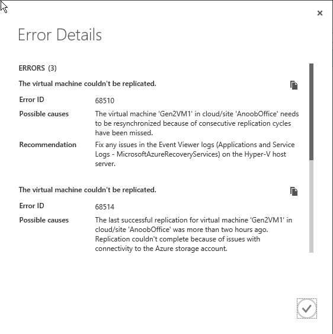

Note: If there are any active operations which are in-progress or failed then navigate to the JOBS view as mentioned earlier to view the JOB specific error.

## Troubleshoot on-premises Hyper-V issues

Connect to the on-premises Hyper-V manager console, select the virtual
machine and see the replication health.

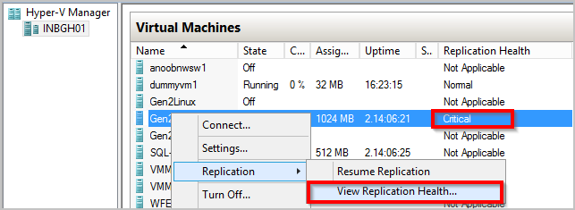

In this case *Replication Health* is being indicated as Critical – *View
Replication Health* to see the details.

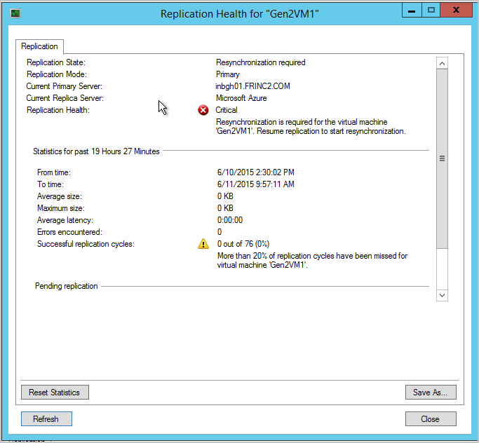

For cases where replication is paused for the virtual machine, right-click Select *Replication*->*Resume replication*
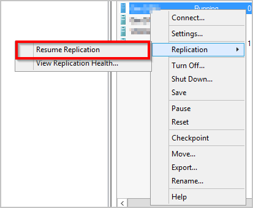

In case virtual machine migrates a new Hyper-V host (within the cluster or a standalone machine), which has been configured through ASR, replication for the virtual machine wouldn't be impacted. Ensure that the new Hyper-V host meets all the per-requisites and is configured using ASR.

### Event Log

| Event  Sources               	| Details                                                                                                                                                                                        	|
|-------------------------	|:------------------------------------------------------------------------------------------------------------------------------------------------------------------------------------------------------	|
| **Applications and Service Logs/Microsoft/VirtualMachineManager/Server/Admin** (VMM Server)	|  This provides useful logging for troubleshooting many different VMM issues. |
| **Applications and Service Logs/MicrosoftAzureRecoveryServices/Replication** (Hyper-V Host)	| This provides useful logging for troubleshooting many Microsoft Azure Recovery Services Agent issues.   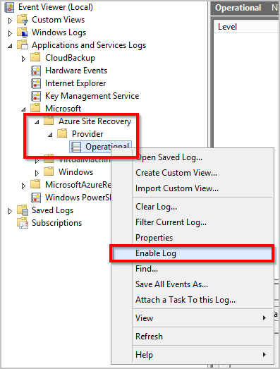 |
| **Applications and Service Logs/Microsoft/Azure Site Recovery/Provider/Operational** (Hyper-V Host)	| This provides useful logging for troubleshooting many Microsoft Azure Site Recovery Service issues.   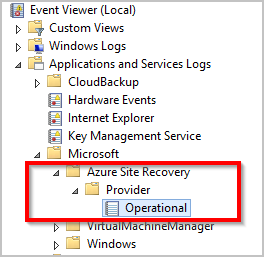 |
| **Applications and Service Logs/Microsoft/Windows/Hyper-V-VMMS/Admin** (Hyper-V Host)	| This provides useful logging for troubleshooting many Hyper-V virtual machine management issues.    |

### Hyper-V Replication Logging Options

All events pertaining to Hyper-V Replica are logged in the Hyper-V-VMMS\\Admin log located under **Applications and Services Logs\\Microsoft\\Windows**. In addition, an Analytic log can be enabled for Hyper-V-VMMS. To enable this log, first make the Analytic and Debug logs viewable in the Event Viewer. Open Event Viewer, then in the **View menu**, click **Show Analytic and Debug logs**.

An Analytic log is visible under Hyper-V-VMMS

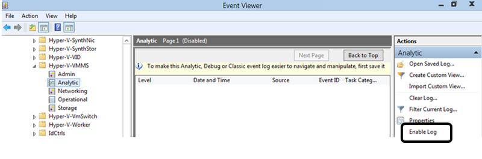

In the **Actions** pane, click on **Enable Log**. Once enabled, it
appears in **Performance Monitor** as an Event Trace Session located
under **Data Collector Sets.**

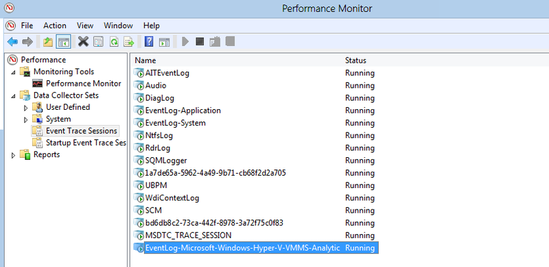

To view the information collected, first stop the tracing session by disabling the log, and then save the log and re-open it in Event Viewer or use other tools to convert it as desired.

## Reaching out for Microsoft Support

### Log collection

For VMM Site protection, refer [ASR Log Collection using Support
Diagnostics Platform (SDP)
Tool](http://social.technet.microsoft.com/wiki/contents/articles/28198.asr-data-collection-and-analysis-using-the-vmm-support-diagnostics-platform-sdp-tool.aspx)
to collect the required logs.

For Hyper-V Site protection, download the
[tool](https://dcupload.microsoft.com/tools/win7files/DIAG_ASRHyperV_global.DiagCab)
& execute it on the Hyper-V host to collect the logs.

For VMware/Physical scenarios, refer [Azure Site Recovery Log Collection
for VMware and Physical site
protection](http://social.technet.microsoft.com/wiki/contents/articles/30677.azure-site-recovery-log-collection-for-vmware-and-physical-site-protection.aspx)
to collect the required logs.

Tool collects the logs locally under a randomly named sub-folder under **%LocalAppData%\ElevatedDiagnostics**

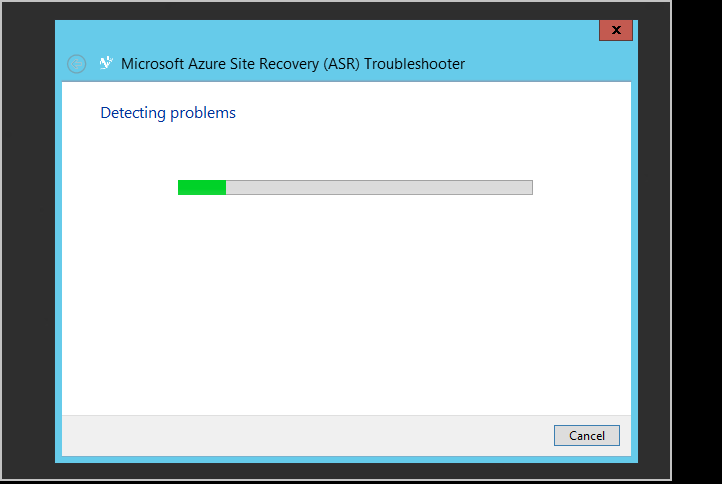

### Opening a support ticket

To raise support ticket for ASR, reach out to Azure Support using the
URL at <http://aka.ms/getazuresupport>

## KB Articles

-   [How to preserve the drive letter for protected virtual machines that are failed over or migrated to Azure](http://support.microsoft.com/kb/3031135)
-   [How to manage on-premises to Azure protection network bandwidth usage](https://support.microsoft.com/kb/3056159)
-   [ASR: "The cluster resource could not be found" error when you try to enable protection for a virtual  machine](http://support.microsoft.com/kb/3010979)
-   [Understand & Troubleshoot Hyper-V Replica Guide](http://www.microsoft.com/en-in/download/details.aspx?id=29016) 

## Common ASR errors and their resolutions

Below are the common errors that you may hit and their resolutions. Each of the error is documented in a separate WIKI page.

### General
-   NEW [Jobs failing with error "An operation is in progress." Error 505, 514, 532](http://social.technet.microsoft.com/wiki/contents/articles/32190.azure-site-recovery-jobs-failing-with-error-an-operation-is-in-progress-error-505-514-532.aspx)
-   NEW [Jobs failing with error "Server isn't connected to the Internet". Error 25018](http://social.technet.microsoft.com/wiki/contents/articles/32192.azure-site-recovery-jobs-failing-with-error-server-isn-t-connected-to-the-internet-error-25018.aspx)

### Setup
-   [The VMM server cannot be registered due to an internal error. Please refer to the jobs view in the Site Recovery Portal for more details on the error. Run Setup again to register the server.](http://social.technet.microsoft.com/wiki/contents/articles/25570.the-vmm-server-cannot-be-registered-due-to-an-internal-error-please-refer-to-the-jobs-view-in-the-site-recovery-portal-for-more-details-on-the-error-run-setup-again-to-register-the-server.aspx)
-   [A connection can’t be established to the Hyper-V Recovery Manager vault. Verify the proxy settings or try again later.](http://social.technet.microsoft.com/wiki/contents/articles/25571.a-connection-cant-be-established-to-the-hyper-v-recovery-manager-vault-verify-the-proxy-settings-or-try-again-later.aspx)

### Configuration
-   [Unable to create Protection Group: An error occurred while retrieving the list of servers.](http://blogs.technet.com/b/somaning/archive/2015/08/12/unable-to-create-the-protection-group-in-azure-site-recovery-portal.aspx)
-   [Hyper-V host cluster contains at least one static network adapter, or no connected adapters are configured to use DHCP.](http://social.technet.microsoft.com/wiki/contents/articles/25498.hyper-v-host-cluster-contains-at-least-one-static-network-adapter-or-no-connected-adapters-are-configured-to-use-dhcp.aspx)
-   [VMM does not have permissions to complete an action](http://social.technet.microsoft.com/wiki/contents/articles/31110.vmm-does-not-have-permissions-to-complete-an-action.aspx)
-   [Can't select the storage account within the subscription while configuring protection](http://social.technet.microsoft.com/wiki/contents/articles/32027.can-t-select-the-storage-account-within-the-subscription-while-configuring-protection.aspx)

### Protection
- NEW [Enable Protection failing with error "Protection couldn't be configured for the virtual machine". Error 60007, 40003](http://social.technet.microsoft.com/wiki/contents/articles/32194.azure-site-recovery-enable-protection-failing-with-error-protection-couldn-t-be-configured-for-the-virtual-machine-error-60007-40003.aspx)
- NEW [Enable Protection failing with error "Protection couldn't be enabled for the virtual machine." Error 70094](http://social.technet.microsoft.com/wiki/contents/articles/32195.azure-site-recovery-enable-protection-failing-with-error-protection-couldn-t-be-enabled-for-the-virtual-machine-error-70094.aspx)
- NEW [Live migration error 23848 - The virtual machine is going to be moved using type Live. This could break the recovery protection status of the virtual machine.](http://social.technet.microsoft.com/wiki/contents/articles/32021.live-migration-error-23848-the-virtual-machine-is-going-to-be-moved-using-type-live-this-could-break-the-recovery-protection-status-of-the-virtual-machine.aspx) 
- [Enable protection failed since Agent not installed on host machine](http://social.technet.microsoft.com/wiki/contents/articles/31105.enable-protection-failed-since-agent-not-installed-on-host-machine.aspx)
- [A suitable host for the replica virtual machine can't be found - Due to low compute resources](http://social.technet.microsoft.com/wiki/contents/articles/25501.a-suitable-host-for-the-replica-virtual-machine-can-t-be-found-due-to-low-compute-resources.aspx)
- [A suitable host for the replica virtual machine can't be found - Due to no logical network attached](http://social.technet.microsoft.com/wiki/contents/articles/25502.a-suitable-host-for-the-replica-virtual-machine-can-t-be-found-due-to-no-logical-network-attached.aspx)
- [Cannot connect to the replica host machine - connection could not be established](http://social.technet.microsoft.com/wiki/contents/articles/31106.cannot-connect-to-the-replica-host-machine-connection-could-not-be-established.aspx)

### Recovery
- VMM cannot complete the host operation -
    -   [Fail over to the selected recovery point for virtual machine: General access denied error.](http://social.technet.microsoft.com/wiki/contents/articles/25504.fail-over-to-the-selected-recovery-point-for-virtual-machine-general-access-denied-error.aspx)
    -   [Hyper-V failed to fail over to the selected recovery point for virtual machine: Operation aborted Try a more recent recovery point. (0x80004004)](http://social.technet.microsoft.com/wiki/contents/articles/25503.hyper-v-failed-to-fail-over-to-the-selected-recovery-point-for-virtual-machine-operation-aborted-try-a-more-recent-recovery-point-0x80004004.aspx)
    -   A connection with the server could not be established (0x00002EFD)
        -   [Hyper-V failed to enable reverse replication for virtual machine](http://social.technet.microsoft.com/wiki/contents/articles/25505.a-connection-with-the-server-could-not-be-established-0x00002efd-hyper-v-failed-to-enable-reverse-replication-for-virtual-machine.aspx)
        -   [Hyper-V failed to enable replication for virtual machine virtual machine](http://social.technet.microsoft.com/wiki/contents/articles/25506.a-connection-with-the-server-could-not-be-established-0x00002efd-hyper-v-failed-to-enable-replication-for-virtual-machine-virtual-machine.aspx)
    -   [Could not commit failover for virtual machine](http://social.technet.microsoft.com/wiki/contents/articles/25508.could-not-commit-failover-for-virtual-machine.aspx)
-   [The recovery plan contains virtual machines which are not ready for planned failover](http://social.technet.microsoft.com/wiki/contents/articles/25509.the-recovery-plan-contains-virtual-machines-which-are-not-ready-for-planned-failover.aspx)
-   [The virtual machine isn't ready for planned failover](http://social.technet.microsoft.com/wiki/contents/articles/25507.the-virtual-machine-isn-t-ready-for-planned-failover.aspx)
-   [Virtual machine is not running and is not powered off](http://social.technet.microsoft.com/wiki/contents/articles/25510.virtual-machine-is-not-running-and-is-not-powered-off.aspx)
-   [Out of band operation happened on a virtual machine and commit failover failed](http://social.technet.microsoft.com/wiki/contents/articles/25507.the-virtual-machine-isn-t-ready-for-planned-failover.aspx)
-   Test Failover
    -   [Failover could not be initiated since test failover is in progress](http://social.technet.microsoft.com/wiki/contents/articles/31111.failover-could-not-be-initiated-since-test-failover-is-in-progress.aspx)
-   NEW  Failover times out with 'PreFailoverWorkflow task WaitForScriptExecutionTaskTimeout' due to the configuration settings on the Network Security Group associated with the Virtual Machine or the subnet to which the machine belongs to. Refer to ['PreFailoverWorkflow task WaitForScriptExecutionTaskTimeout'](https://aka.ms/troubleshoot-nsg-issue-azure-site-recovery) for details.

### Configuration Server, Process Server, Master Target
Configuration Server (CS), Process Server (PS), Master Targer (MT)
-   [The ESXi host on which the PS/CS is hosted as a VM fails with a purple screen of death.](http://social.technet.microsoft.com/wiki/contents/articles/31107.vmware-esxi-host-experiences-a-purple-screen-of-death.aspx)

### Remote desktop troubleshooting after failover
-   Many customers have faced issues to connect to the failed over VM in Azure. [Use the troubleshooting document to RDP into the VM](http://social.technet.microsoft.com/wiki/contents/articles/31666.troubleshooting-remote-desktop-connection-after-failover-using-asr.aspx)
