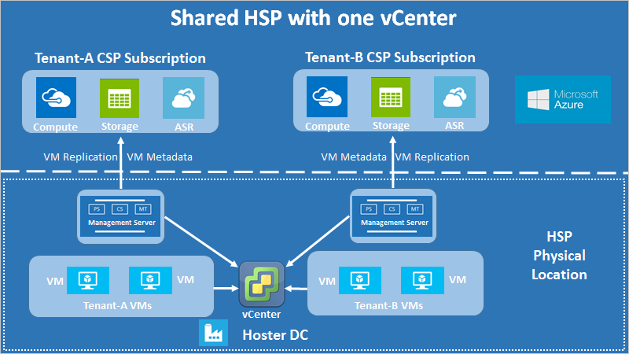
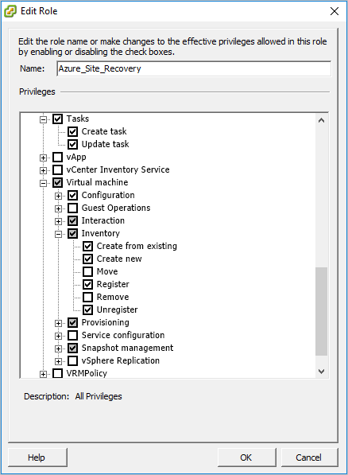
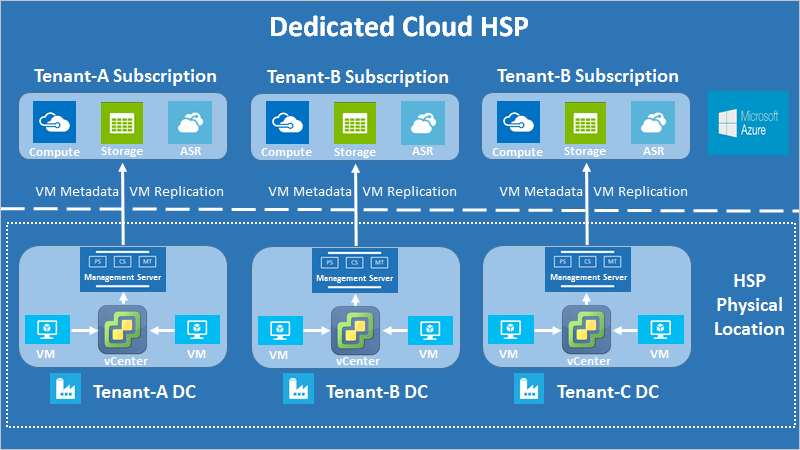
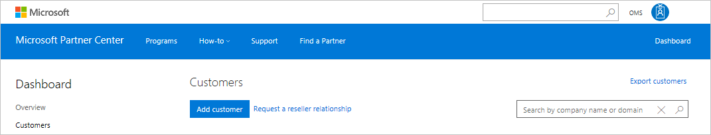
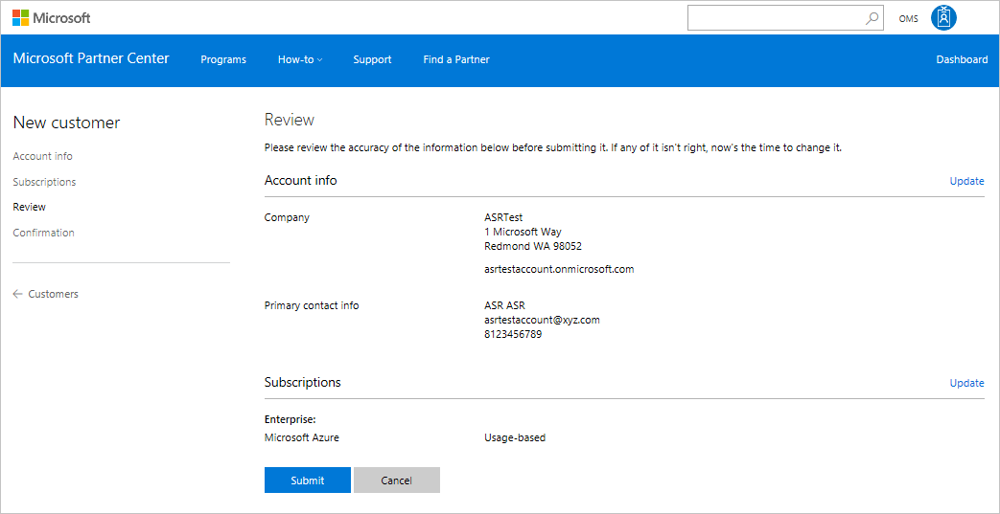
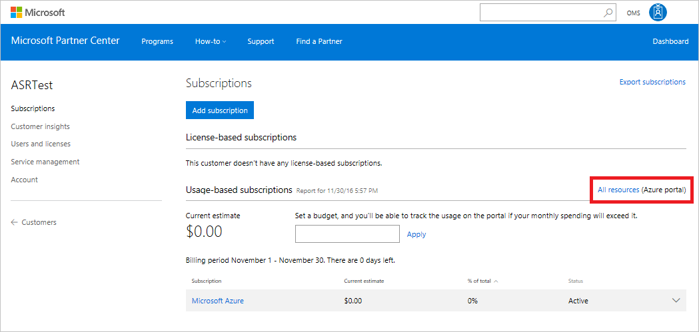

# Multi-tenant support in Azure Site Recovery for replicating VMware virtual machines to Azure through the CSP program

Azure Site Recovery supports multi-tenant environments for tenant subscriptions. Multi-tenancy is also supported for tenant subscriptions that are created and managed through the Cloud Solution Provider (CSP) program. This article details the guidance for implementing and managing multi-tenant VMware-to-Azure scenarios. Creating and managing tenant subscriptions through CSP is also detailed.

Note that this guidance draws heavily from the existing documentation for replicating VMware virtual machines to Azure. For more information, see [Replicate VMware virtual machines to Azure with Site Recovery](site-recovery-vmware-to-azure.md).

## Multi-tenant environments
There are three major multi-tenant models:

* **Shared Hosting Services Provider (HSP)**: The partner owns the physical infrastructure and uses shared resources (vCenter, datacenters, physical storage, and so on) to host multiple tenants’ VMs on the same infrastructure. Disaster-recovery management can be provided by the partner as a managed service or be owned by the tenant as a self-service solution.

* **Dedicated Hosting Services Provider**: The partner owns the physical infrastructure but uses dedicated resources (multiple vCenters, physical datastores, and so on) to host each tenant’s VMs on a separate infrastructure. Disaster-recovery management can be provided by the partner or owned by the tenant as a self-service solution.

* **Managed Services Provider (MSP)**: The customer owns the physical infrastructure that hosts the VMs, and the partner provides disaster-recovery enablement and management.

## Shared-hosting multi-tenant guidance
This section covers the shared-hosting scenario in detail. The other two scenarios are subsets of the shared-hosting scenario, and they use the same principles. The differences are described at the end of the shared-hosting guidance.

The basic requirement in a multi-tenant scenario is to isolate the various tenants. One tenant should not be able to observe what another tenant has hosted. In a completely partner-managed environment, this requirement is not as important as it is in a self-service environment, where it can be critical. This guidance assumes that tenant isolation is required.

The architecture is presented in the following diagram:

**Figure 1: Shared-hosting scenario with one vCenter**

As seen in the preceding diagram, each customer has a separate management server. This configuration limits tenant access to tenant-specific VMs and enables tenant isolation. A VMware virtual-machine replication scenario uses the configuration server to manage accounts to discover VMs and install agents. We follow the same principles for multi-tenant environments, with the addition of restricting VM discovery through vCenter access control.

The data-isolation requirement necessitates that all sensitive infrastructure information (such as access credentials) remain disclosed from tenants. For this reason, we recommend that all the components of the management server (configuration server [CS], process server [PS], and master target server [MT]) remain under the exclusive control of the partner. This arrangement includes a scale-out PS.

### Every CS in the multi-tenant scenario uses two accounts

- **vCenter access account**: This account is used to discover tenant VMs, and it has vCenter access permissions assigned to it (as described in the next section). To help avoid accidental access leaks, we recommend that the partner enter these credentials him or herself on the config tool.

- **Virtual machine access account**: This account is used to install the mobility agent on the tenant VMs through an automatic push. It is usually a domain account that a tenant might provide to a partner or that, alternatively, the partner might manage directly. If the tenant doesn’t want to share the details to the partner directly, the tenant can be allowed to enter the credentials through a limited-time access to the CS or, alternatively, the tenant can install mobility agents manually with the partner’s assistance.

### Requirements for a vCenter access account

As mentioned in the preceding section, the CS must be configured with an account that has a special role assigned to it. This role assignment must be applied to the vCenter access account for each vCenter object and not propagated to the child objects. This configuration ensures tenant isolation, because access propagation can result in accidental access to other objects.

The alternative is to assign the user account and role at the datacenter object and propagate them to the child objects. Then the account has to be given a *No access* role for every object (such as other tenants’ VMs) that should be inaccessible to a particular tenant. This configuration is cumbersome, and it exposes accidental access controls, because every new child object is also automatically granted access that's inherited from the parent. Therefore, we recommend that you use the first approach.

The vCenter account-access procedure is as follows:

1.	Create a new role by cloning the pre-defined ‘Read-only’ role and give it a convenient name (such as Azure_Site_Recovery used in this example).

2.	Assign the following permissions to this role:

    * Datastore > Allocate space, Browse datastore, Low-level file operations, Remove file, Update virtual machine files
    * Network > Network assign
    * Resource > Assign VM to resource pool, Migrate powered off VM, Migrate powered on VM
    * Tasks > Create task, Update task
    * Virtual machine > Configuration
    * Virtual machine > Interaction > Answer question, Device connection, Configure CD media, Configure floppy media, Power off, Power on, VMware tools install
    * Virtual machine > Inventory > Create, Register, Unregister
    * Virtual machine > Provisioning > Allow virtual machine download, Allow virtual machine files upload
    * Virtual machine > Snapshots > Remove snapshots

	

3. Assign access levels to the vCenter account (used in the tenant CS) for various objects, as follows:

| Object | Role | Remarks |
| --- | --- | --- |
| vCenter | Read-Only | Needed only to allow vCenter access for managing different objects. This permission can be removed if the account is never going to be provided to a tenant or used for any management operations on the vCenter. |
| Datacenter | Azure_Site_Recovery |  |
| Host and Host Cluster | Azure_Site_Recovery | Re-ensures that access is at the object level, so that only accessible hosts have tenant VMs before failover and after failback. |
| Datastore and Datastore Cluster | Azure_Site_Recovery | Same as preceding. |
| Network | Azure_Site_Recovery |  |
| Management Server | Azure_Site_Recovery | Includes access to all components (CS, PS, and MT) if any are outside the CS machine. |
| Tenant VMs | Azure_Site_Recovery | Ensures that any new tenant VMs of a particular tenant also get this access, or they will not be discoverable through the Azure portal. |

The vCenter account access is now complete. This fulfills the minimum permissions requirement to complete failback operations. These access permissions can also be used with your existing policies. Just modify your existing permissions set to include role permissions from point 2 detailed above.

To restrict disaster-recovery operations till the failover state that is, without failback capabilities, follow the above procedure but instead of assigning 'Azure_Site_Recovery' role to the vCenter access account, assign just a 'Read-Only' role to that account. This permission-set allows VM replication and failover and does not allow failback. Everything else in the above process remains as-is. Every permission is still assigned at the object level only and not propagated to child objects, to ensure tenant-isolation and restrict VM discovery.

## Other multi-tenant environments

The above guidance described in detail how to set up a multi-tenant environment for a shared hosting solution. The other two major solutions are dedicated hosting and managed service. The architecture for these is as below:

### Dedicated hosting solution

**Figure 2: Dedicated hosting scenario with multiple vCenters**

The architectural difference here is that each tenant’s infrastructure is provisioned for that tenant only. The hosting provider still needs to follow the CSP steps detailed for shared hosting but does not need to worry about tenant isolation since tenants are isolated through separate vCenters. CSP provisioning remains unchanged.

### Managed service solution

**Figure 3: Managed service scenario with multiple vCenters**

The architectural difference here is that each tenant’s infrastructure is also physically separate from other tenants. This scenario usually exists when the tenant owns the infrastructure and just wants a solution provider to manage disaster recovery. The partner again needs to follow the CSP steps detailed for shared hosting but does not need to worry about tenant isolation since tenants are physically isolated through different infrastructures. CSP provisioning remains unchanged.

## CSP program overview
Microsoft’s Cloud Solution Provider (CSP) [program](https://partner.microsoft.com/en-US/cloud-solution-provider) fosters better-together stories with partners for offering all Microsoft cloud services including O365, EMS, and Microsoft Azure. It enables our partners to own the end-to-end relationship with customers and become the primary relationship contact point. Through CSP, a partner can deploy Azure subscriptions for customers, and combine these subscriptions with their own value-added customized offerings.

With Azure Site Recovery, partners can manage the complete Disaster Recovery solution for customers directly through CSP or use CSP to set up the Azure Site Recovery environments and let customers manage their own disaster-recovery needs in a self-service manner. In both scenarios, the partner is the liaison between Azure Site Recovery and final customers, and the partner services the customer relationship and bills customers for Azure Site Recovery usage.

## Creating and managing tenant accounts

### Step 0: Prerequisite check

The VM prerequisites are the same as described in the Azure Site Recovery [documentation](site-recovery-vmware-to-azure.md). In addition to those prerequisites, the above access controls should be in place before proceeding with tenant management through CSP. Create a separate Management Server for each tenant that can communicate with the tenant VMs and partner’s vCenter. Only the partner has access rights to this server.

### Step 1: Create tenant account

1.	Through [partner center](https://partnercenter.microsoft.com/) login to your CSP account. From the Dashboard menu on the left, select the ‘Customers’ option.

	

2.	On the page that opens click on the ‘Add customer’ button.

	

3.	On the New Customer page, fill in all the account information details for the tenant and click on ‘Next: Subscriptions’.

	

4.	On the subscriptions selection page, scroll down to add the ‘Microsoft Azure’ subscription. Other subscriptions can be added now or at any other time in the future.

	

5.	Continue forward and on the next page review all the details entered for the tenant and click on the Submit button.

	

6.	After the customer is created, you get a confirmation page with the details of the default account and password for that subscription. Save the information and change the password later as necessary through the Azure portal login. This information can be shared as-is with the tenant or a separate account can be also created and shared if necessary.

### Step 2: Access tenant account

1.	You can access the tenant’s subscription from the ‘Customers’ page through your Dashboard as described in step 1. Navigate here and click on the name of the created tenant account.
2.	This opens the Subscriptions section of the tenant account and from here you can monitor the existing subscriptions for the account and add more subscriptions as required. To manage the tenant’s disaster-recovery operations, select the ‘All resources (Azure portal) option on the right side of the page.

	

3.	Clicking the ‘All resources’ button grants you access to the tenant’s Azure subscriptions and you can verify the same by checking the AAD displayed on the top right corner of the Azure portal.

	

You can now perform all Site Recovery operations for the tenant through the Azure portal and manage the disaster-recovery operations. The process detailed above must be followed every time to access the tenant subscription through CSP for managed disaster recovery.

### Step 3: Deploy resources to tenant subscription
1.	On the Azure portal, create a Resource Group and deploy a Recovery Services vault per the usual process. Download the vault registration key.
2.	Register the CS for the tenant using the vault registration key.
3.	Enter the credentials for the two access accounts – vCenter access account and VM access account.

	

### Step 4: Register Site Recovery infrastructure to Recovery Services vault
1.	Open the Azure portal and on the vault created earlier register the vCenter server to CS registered in the previous step. Use the vCenter access account for this purpose.
2.	Finish the ‘Prepare infrastructure’ process for Site Recovery per the usual process.
3.	The VMs are now ready to be replicated. Verify that only the tenant’s VMs are visible on the VM selection blade under the Replicate option.

	

### Step 5: Assign tenant access to subscription

For self-service disaster recovery, the account details as mentioned in item 6 of Step 1 must be provided to the tenant. This should be done after the partner sets up the disaster-recovery infrastructure. Irrespective of disaster-recovery type (managed or self-service), the partner is required to access tenant subscriptions through the CSP portal only and set up the vault and register infrastructure owned by the partner to the tenant subscriptions.

A partner can also add a new user to the tenant subscription through the CSP portal as follows:

1.	Go to the particular tenant’s CSP subscription page and select the ‘Users and licenses’ option.

	

	You can now create a new user by entering the relevant details and selecting permissions, or alternatively uploading the list of users though a CSV file.
2.	Once the users are created, go back to the Azure portal and under the Subscription blade select the relevant subscription.
3.	On the new blade that opens select Access Control (IAM) and click on +Add to add a user with the relevant access level. The users created through CSP portal will automatically be displayed on the blade that opens after clicking an access level.

	

	For most management operations, the Contributor role is sufficient. A user with this access level can do everything on a subscription except change access levels (for which an Owner level access is required). You can also fine-tune the access levels as required.
