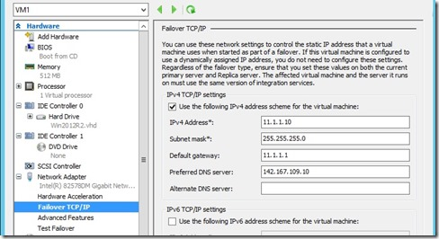
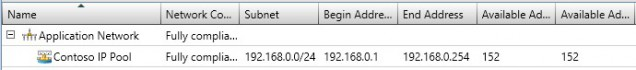
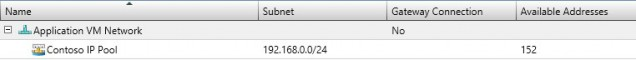
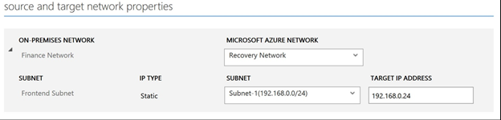
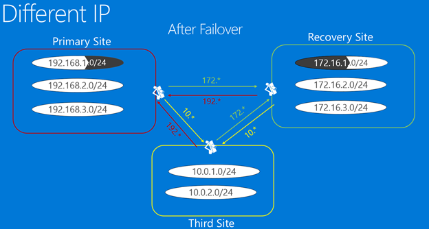

<properties
	pageTitle="Network infrastructure considerations for Site Recovery" 
	description="This article discusses practical network design considerations for failover with Site Recovery" 
	services="site-recovery" 
	documentationCenter="" 
	authors="rayne-wiselman" 
	manager="jwhit" 
	editor=""/>

<tags 
	ms.service="site-recovery" 
	ms.devlang="na"
	ms.topic="get-started-article"
	ms.tgt_pltfrm="na"
	ms.workload="storage-backup-recovery" 
	ms.date="08/10/2015" 
	ms.author="raynew"/>

#  Network infrastructure considerations for Site Recovery

The Azure Site Recovery service contributes to a robust business continuity and disaster recovery (BCDR) solution by protecting and recovering your on-premises physical servers and virtual machines with orchestration and automation of replication and failover to Azure, or to a secondary on-premises datacenter. 

This article is aimed at the virtualization team responsible for architecting, implementing, and supporting a BCDR solution and infrastructure that includes System Center VMM and Azure Site Recovery.

## Overview

The purpose of your BCDR strategy is to keep your business applications running, and to  restore failed workloads and services so the organization can quickly resume normal operations. Developing disaster recovery strategies is challenging, due inherent difficulty of predicting unforeseen events, and the high cost of implementing adequate protection against far-reaching failures. Azure Site Recovery helps you implement protection and failover from your primary data center to a secondary data center (or to Azure) by initially copying (replicating) your primary data, and then periodically refreshing the replicas.

As a crucial part of your BCDR planning you need to define your Recovery Time Objective (RTO) and Recovery Point Objective (RPO) so that can you get your organization data back online as quickly as possible (with a low RTO) and with minimum data loss (low RPO). The network design in your organization is a potential bottleneck to your RTO and RPO objectives and solid design planning can help avoid this bottleneck. 

If you've decided to use the Azure Site Recovery service to help implement protection and failover there are a couple of key issues in network design for BCDR:

- **VMM design**: I'm using System Center VMM. How should I handle the network design to integrate VMM and Site Recover?
- **Connectivity after failover**: I'm using Site Recovery to run a failover. How can I make sure my applications and workloads are available and reachable after failover completes?

## VMM design

You can layer Site Recovery on top of your existing VMM design, regardless of whether that design uses a single or multiple VMM servers. 

### Standalone VMM server

In this topology, you'll deploy a VMM server on a virtual machine in the primary site, and then replicate this virtual machine to a secondary site with Site Recovery and Hyper-V Replica. You might consider installing the VMM sever and its supporting SQL Server on the same virtual machine can reduce downtime, because only one VM has to be instantiated. When the VMM service is using a remote SQL Server you'll need to recover the SQL Server instance before recovering the VMM server. 

To deploy a single VMM on a VM with Hyper-V Replica:

1. Set up the VMM on a VM with SQL Server installed.
2. Add the hosts to be managed to clouds on this VMM server.
3. Log in to the Azure portal and then configure clouds for protection.
4. Enable replication for all the VMs that need to be protected by the VMM server.
5. Go to the Hyper-V Manager console, choose Hyper-V Replica, and then enable replication on the VMM VM.
6. Ensure that the VMM VM is not added to the clouds that are protected by ASR service so that the Hyper-V Replication settings are not overridden by ASR.

In the event of a disaster, workloads can be recovered as follows:

1. Fail over the replica VMM VM to the recovery site, using Hyper-V Manager.
2. After the VMM VM has been recovered, the user can login to the Hyper-V Recovery Manager from the secondary site.
3. After the unplanned failover is complete, the user can access all the resources at the primary site.
4. Note that the VMM VM will need to be failed over manually to the secondary site before workloads can be failed over. 

### Clustered VMM server

[Deploying VMM in a cluster](https://technet.microsoft.com/en-us/library/gg610675.aspx) provides high availability and protection against hardware failover. If you're deploying your VMM cluster with Site Recovery note that:

The VMM server should be deployed in a stretched cluster across geographically separate sites.
The SQL Server database used by VMM should be protected with SQL Server AlwaysOn availability groups with a replica on the secondary site.
If disaster occurs the VMM server and its corresponding SQL Server will automatically fail over to the recovery site. You can then fail over workloads using Site Recovery.

## Connectivity after failover

Modern applications are almost always dependent on networking to some degree, so physically moving a service from one site to another represents a networking challenge to make sure applications and workloads are reachable after failover. There are two main solutions to this issue:

- **Fixed IP addresses**: The first approach is to maintain fixed IP addresses. Despite the services moving and the hosting servers being in different physical locations, applications take the IP address configuration with them to the new location.
- **Modified IP addresses**: The second approach requires changing the IP address during the transition into the recovered site. 

### Option 1: Fixed IP addresses

From a disaster recovery perspective, using fixed IP addresses appears to be the easiest method to implement. However there are a number of potential challenges which in practice make it the least popular approach. Azure Site Recovery provides the capability to retain the IP addresses in all scenarios. Before you decide to take this approach let's look at the considerations for the main scenarios (stretched subnet and subnet failover). 

#### Stretched subnet

In a stretched subnet the subnet is available simultaneously in both the primary and target locations. In simple terms this means you can move a server and its IP (Layer 3) configuration to the secondary site, and the network will route traffic to the new location automatically. This is trivial to deal with from a server perspective but it has a number of challenges:

- From a Layer 2 (data link layer) perspective it requires networking equipment that can manage a stretched VLAN, although this type of equipment is now widely available.
- The second and more difficult problem is that by stretching the VLAN the potential fault domain extends to both sites, essentially becoming a single point of failure. Although unlikely it could happen that a broadcast storm starts and cannot be isolated. We've seen mixed opinions about this issue, that range from successful implementation to “never”.
- A stretched subnet isn't possible if you're failing over to Azure as your DR site.

#### Subnet Failover

It's possible to implement subnet failover in order to obtain the benefits of a stretched subnet without actually stretching it. In this configuration any given subnet is present at Site 1 or Site 2, but never at both sites simultaneously. To maintain the IP address space in the event of a failover, you can programmatically arrange for the router infrastructure to move the subnets from one site to another. In a failover scenario the subnets move with their associated protected VMs.  The main drawback to this approach is that in the event of a failure you have to move the whole subnet, which might be a reasonable solution, but could affect failover granularity considerations. 

Let’s take a look at how a fictional enterprise (Contoso) is able to replicate its VMs to a recovery location, while failing over the entire subnet. We'll look at how Contoso is able to manages its subnets while replicating VMs between two on-premises locations, and discuss how subnet failover works when Azure is used as the disaster recovery site.

##### Example - Subnet failover in an enterprise
 
- The primary site has applications running in subnet 192.168.1.0/24.
- The entire subnet will fail over, and all the virtual machines in the subnet will be failed over to the recovery site and retain their IP addresses
- As shown in the diagram below the routes between primary site and recovery site, third site and primary site, and third site and recovery site will have to be appropriately modified to reflect the fact that all the virtual machines belonging to subnet 192.168.1.0/24 have been moved to the recovery site.
- This diagram assumes that:
	-  Each data center is serviced by its own instance of VMM. There will be no replication of the System Center VMM databases between datacenters.
	-  Each data center uses static IP addresses for the virtual machines.
	-  Connectivity between the data centers is via a dedicated circuit and not via VPN connectivity over the internet.

**Before failover**

**After failover**

When enabling protection for a specific virtual machine, Site Recovery allocates networking resources as follows:

1. Site Recovery allocates an IP address for each network interface on the virtual machine from the static IP address pool defined on the relevant network for each VMM instance.
2. If the administrator defines the same IP address pool that's used on the primary site for the network on the recovery site Site Recovery will allocate the same IP address that's allocated to the primary virtual machine to the replica virtual machine  The IP address is reserved in VMM but isn't set as the failover IP address. The failover IP address is set just before the failover. This screenshot shows the failover TCP/IP settings for the replica virtual machine (on the Hyper-V console). These settings are replicated just between failover starts for the virtual machine.

	

3. If the same IP address isn't available Site Recovery will allocate a different address from the pool.
4. After the virtual machine is enabled for protection you can use following sample script to verify the IP address that has been allocated to the virtual machine. The same IP address would be set as failover IP address and assigned to the VM at the time of failover.

    $vm = Get-SCVirtualMachine -Name 
    $na = $vm[0].VirtualNetworkAdapters
    $ip = Get-SCIPAddress -GrantToObjectID $na[0].id 
    $ip.address

Note that if virtual machines use DHCP,  IP address management isn't handled by Site Recovery. You'll need to ensure that the DHCP server allocating IP addresses on the recovery site can allocate addresses from the same range as that of the primary site.

##### Example - Subnet failover to Azure

If you're failing over to Azure there are a couple more constraints. Let's look at a fictional company (Woodgrove Bank) that has on-premises infrastructure hosting their line of business applications, and Azure hosting their mobile applications. 

- Connectivity between Woodgrove Bank VMs in Azure and on-premises servers is over site-to-site VPN which shows the virtual network in Azure asn a extension of Woodgrove Bank’s on-premises network. 
- Woodgrove wants to use Site Recovery to replicate its on-premises workloads to Azure. 
- Woodgrove has to deal with applications and configurations which depend on hard-coded IP addresses, so they need to retain IP addresses for their applications after failover to Azure.
- Woodgrove’s on-premises infrastructure is managed by a VMM 2012 R2 server.
- There's a VLAN-based logical network (Application Network) has been created on the VMM server. 
	
- A VM network (Application VM Network) was created using the logical network.
	
- All the virtual machines in the application use static IP addresses, so a static IP pool is also defined for the logical network. 
- Woodgrove is assigning IP addresses from IP address range (172.16.1.0/24, 172.16.2.0/24) to its resources running in Azure.

For Woodgrove to deploy replication and maintain IP addresses the following is required:

- An Azure virtual machine that's an extension of the on-premises network so that applications can fail over seamlessly.
- Note that when you set up your site-to-site connection in Azure, an Azure network allows you to route traffic to the on-premises location (Azure calls it local-network) only if the IP address range is different from the on-premises IP address range, because Azure doesn’t support stretching subnets. This means that if you have a subnet 192.168.1.0/24 on-premises, you can’t add a local-network 192.168.1.0/24 in the Azure network. This is expected because Azure doesn’t know that there are no active VMs in the subnet and that the subnet is being created only for DR purposes. To be able to correctly route network traffic out of an Azure network the subnets in the network and the local-network must not conflict. 
- We'll need to created an additional network in Azure (Recovery Network) where the failed over VMs will be created.

	

- To ensure that the IP address for the VM is retained, in the VM properties in Site Recovery we'll specify that the same IP address should be used. Then nafter failover Site Recover will assign the specified IP address to the VM.
	

- When failover is triggered and the VMs are created in the Recovery Network with the required IP address, connectivity to the VM can be established using a. This action can be scripted. As we discussed in the previous section about subnet failover, also in the case of failover to Azure routes would have to be appropriately modified to reflect that 192.168.1.0/24 has now moved to Azure.
	

### Option 2: Modified IP addresses

This approach seems to be the most common and means that the IP address of every VM that fails over will change.  The main disadvantage of this approach is that your network infrastructure needs to be aware that IP addresses have changed and that DNS entries will typically have to be changed or flushed throughout the network, as will cached entries in network tables. This could incur downtime depending upon how the DNS infrastructure is setup. These issues can be mitigated by using low TTL values in the case of intranet applications and using [Azure Traffic Manager with Site Recovery](http://azure.microsoft.com/blog/2015/03/03/reduce-rto-by-using-azure-traffic-manager-with-azure-site-recovery/) for internet-based applications.

#### Example - Modified IP addresses

Let's look at this scenario with an example that has a third site from which the applications hosted on primary or recovery site can be accessed.

- Some applications are hosted in subnet 192.168.1.0/24 subnet on the primary site, and they have been configured to come up on the recovery site in subnet 172.16.1.0/24 after a failover.
- VPN connections/network routes have been configured appropriately so that all three sites can access each other. 
- After failing over one or more applications, they'll be restored in the recovery subnet. In this case we don't need to fail over the entire subnet at the same time and no changes are required to reconfigure VPN or network routes.
- A failover and some DNS updates will keep the applications accessible. If the DNS server is configured to allow dynamic updates then the virtual machines would register themselves using the new IP address once they start after a failover.

	

- After failover the replica virtual machine might have an IP address that isn’t the same as the IP address of the primary virtual machine.
- Virtual machines will update the DNS server that they are using after they start. DNS entries typically have to be changed or flushed throughout the network, and cached entries in network tables have to be updated or flushed, so it is not uncommon to be faced with downtime while these state changes take place. This can be mitigated by:

	- Using low TTL values for intranet applications.
	- Using [Azure Traffic Manger with Site Recovery](http://azure.microsoft.com/blog/2015/03/03/reduce-rto-by-using-azure-traffic-manager-with-azure-site-recovery/ for internet based applications).
	- Using the following script within your recovery plan to update the DNS Server to ensure a timely update (The script is not required if the Dynamic DNS registration is configured)

    [string]$Zone,
    [string]$name,
    [string]$IP
    )
    $Record = Get-DnsServerResourceRecord -ZoneName $zone -Name $name
    $newrecord = $record.clone()
    $newrecord.RecordData[0].IPv4Address  =  $IP
    Set-DnsServerResourceRecord -zonename $zone -OldInputObject $record -NewInputObject $Newrecord

#### Example - Failover to Azure

The Networking infrastructure setup for Azure as a Disaster Recovery Site [blog post](http://azure.microsoft.com/blog/2014/09/04/networking-infrastructure-setup-for-microsoft-azure-as-a-disaster-recovery-site/) explains how to setup the required Azure networking infrastructure when retaining IP addresses isn’t a requirement. It starts with describing the application and then looks at how to set up networking on-premises and in Azure. It concludes with instructions for running a test failover and a planned failover.

## Next Steps

[Learn](site-recovery-network-mapping.md) how Site Recovery maps source and target networks.
