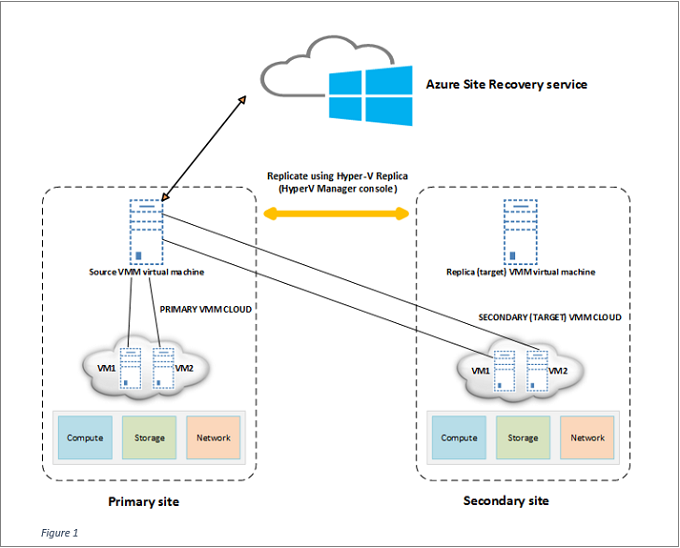
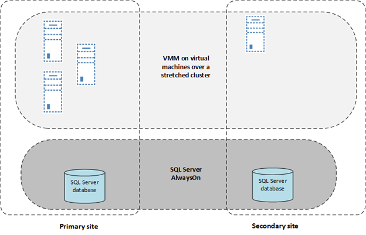

<properties
	pageTitle="Designing your network infrastructure for disaster recovery | Microsoft Azure"
	description="This article discusses network design considerations for Azure Site Recovery"
	services="site-recovery"
	documentationCenter=""
	authors="prateek9us"
	manager="jwhit"
	editor=""/>

<tags
	ms.service="site-recovery"
	ms.devlang="na"
	ms.topic="article"
	ms.tgt_pltfrm="na"
	ms.workload="storage-backup-recovery"
	ms.date="02/22/2016"
	ms.author="pratshar"/>

#  Designing your network infrastructure for disaster recovery

This article is directed to IT professionals who are responsible for architecting, implementing, and supporting business continuity and disaster recovery (BCDR) infrastructure, and who want to leverage Microsoft Azure Site Recovery (ASR) to support and enhance their BCDR services. This paper discusses practical considerations for System Center Virtual Machine Manager server deployment, the pros and cons of stretched subnets vs. subnet failover, and how to structure disaster recovery to virtual sites in Microsoft Azure.

## Overview

[Azure Site Recovery (ASR)](https://azure.microsoft.com/services/site-recovery/) is a Microsoft Azure service that orchestrates the protection and recovery of your virtualized applications for business continuity disaster recovery (BCDR) purposes. This document is intended to guide the reader through the process of designing the networks, focusing on architecting IP ranges and subnets on the disaster recovery site, when replicating virtual machines (VMs) using Site Recovery.

Furthermore, this article demonstrates how Site Recovery enables architecting and implementing a multisite virtual datacenter to support BCDR services at time of test or disaster.

In a world where everyone expects 24/7 connectivity, it is more important than ever to keep your infrastructure and applications up and running. The purpose of Business Continuity and Disaster Recovery (BCDR) is to restore failed components so the organization can quickly resume normal operations. Developing disaster recovery strategies to deal with unlikely, devastating events is very challenging. This is due to the inherent difficulty of predicting the future, particularly as it relates to improbable events, and the high cost to provide adequate measures of protection against far-reaching catastrophes. 

Crucial for BCDR planning, Recovery Time Objective (RTO) and Recovery Point Objective (RPO) must be defined as part of a disaster recovery plan. When a disaster strikes the customer’s data center, using Azure Site Recovery, customers can quickly (low RTO) bring online their replicated virtual machines located in either the secondary data center or Microsoft Azure with minimum data loss (low RPO). 

Failover is made possible by ASR which initially copies designated virtual machines from the primary data center to the secondary data center or to Azure (depending on the scenario), and then periodically refreshes the replicas. During infrastructure planning, network design should be considered as potential bottleneck that can prevent you from meeting company RTO and RPO objectives.  

When administrators are planning to deploy a disaster recovery solution, one of the key questions in their minds is how the virtual machine would be reachable after the failover is completed. Using Network Mapping in ASR, the administrator can choose which network the virtual machine would be attached to after failover. For more information about Network Mapping, see [Prepare for network mapping](site-recovery-network-mapping.md).

While designing the network for the recovery site, the administrator has two choices:

- Use a different IP address range for the network at recovery site. In this scenario the virtual machine after failover will get a new IP address and the administrator would have to do a DNS update. Read more about how to do the DNS update here
- Use same IP address range for the network at the recovery site. In certain scenarios administrators prefer to retain the IP addresses that they have on the primary site even after the failover. In a normal scenario an administrator would have to update the routes to indicate the new location of the IP addresses. But in the scenario where a stretched VLAN is deployed between the primary and the recovery sites, retaining the IP addresses for the virtual machines becomes an attractive option. Keeping the same IP addresses simplifies the recovery process by taking away any network related post-failover steps.

This document discusses two key technical considerations for designing your network address space for disaster recovery: 

- Designing the fabric manager (System Center Virtual Machine Manager) deployment topology to protect workloads through Azure Site Recovery (ASR).
- IP Address Management in a disaster recovery environment.

## Designing System Center VMM deployment for Azure Site Recovery

Business requirements dictate topology decisions. Based on these business requirements an organization might choose to have multiple data centers managed by a single management head, or multiple management heads managing different data centers. This section describes how an organization designs a System Center Virtual Machine Manager (SCVMM) deployment topology to protect workloads with ASR.

Azure Site Recovery contributes to your business continuity and disaster recovery (BCDR) strategy by orchestrating replication, failover, and recovery of virtual machines in a number of deployment scenarios. Based on the design principle of simplicity, ASR is modeled in a manner to allow administrators to build a disaster recovery solution on top of their existing data center topologies. ASR thus enables organizations to choose a topology that best satisfies their business needs.

For a full list of deployment scenarios see [What is Site Recovery?](site-recovery-overview.md)

Customers can protect workloads on a VMM server at the primary site with a VMM Server managing the secondary site. In the event of a disaster, all the workloads will seamlessly fail over from the primary site to the secondary site that is being managed by the secondary VMM server. However, some organizations might want to use a single VMM server to manage all of their data centers in order to avoid management overhead. For a customer with this topology it is imperative to be able to recover the VMM server before the workloads can be recovered. As a result, a customer must cautiously design their VMM topologies in order to make their workloads “disaster proof.”

If you only have a single VMM server in your infrastructure you can deploy Azure Site Recovery to replicate virtual machines in VMM clouds to Azure, or you can replicate between clouds on a single VMM server. For recovery you'll need to manually fail over the VMM server from outside the Azure Site Recovery console using Hyper-V Replica in the Hyper-V Manager console.
It is recommended to deploy the VMM Server in one of the following topologies to be able to recover the workloads with the best possible RTO (Recovery Time Objective) and RPO (Recovery Point Objective). 

### Standalone deployment

In this topology, you will deploy a standalone VMM server on a virtual machine in the primary site, and then replicate this virtual machine to a secondary site with Azure Site Recovery and Hyper-V Replica. In some instances, installing the VMM sever and its supporting SQL Server on the same virtual machine can reduce downtime, because only one VM has to be instantiated. When the VMM service is using a remote SQL Server you'll need to recover the SQL Server instance before recovering the VMM server.

The steps to deploy a single VMM on a VM with Hyper-V Replica enabled are:

1. Set up the VMM on a VM with SQL Server installed.
2. Add the hosts to be managed to clouds on this VMM server.
3. Log in to the Azure portal and then configure clouds for protection.
4. Enable replication for all the VMs that need to be protected by the VMM server.
5. Go to the Hyper-V Manager console, choose Hyper-V Replica, and then enable replication on the VMM VM. Ensure that the VMM VM is not added to the clouds that are protected by ASR service so that the Hyper-V Replication settings are not overridden by ASR.

In the event of a disaster, workloads can be recovered using the following steps:

1. Failover the replica VMM VM to the recovery site, using Hyper-V Manager.
2. After the VMM VM has been recovered, the user can login to the Hyper-V Recovery Manager from the secondary site.
3. After the unplanned failover is complete, the user can access all the resources at the primary site.

This topology will require the user to manually failover their VMM VM to the secondary site before they can failover their workloads.

### Cluster deployment

Deploying a highly available VMM server is a method of making the VMM service itself cluster aware. This is useful if critical workloads are being managed by VMM because it ensures workload availability and protects against a VMM server failure. It is extremely important to have the VMM server available at all times. Making the service cluster-aware helps to protect the VMM server against hardware failover of the host that the VMM Server is running on, as well as protecting against problems that may occur in the VM on which VMM is running. Deploying a highly available VMM server requires the VMM server to be present on a Windows Server Failover Cluster. For more information about how to deploy a highly available VMM server, see the System Center blog post available here .

When protecting workloads using ASR, the VMM server should be deployed over a stretched cluster across geographically separate sites, as shown in Figure 2. The SQL Server database used by VMM should be protected with SQL Server AlwaysOn availability groups with a replica on the secondary site. If disaster occurs the VMM server and its corresponding SQL Server database will automatically fail over to the recovery site, after which all the workloads can be failed over using ASR.

Figure 2

## Designing the network address space in a disaster recovery environment

When administrators are planning to deploy a disaster recovery solution, one of the key questions in their mind is how the applications will be reachable after the failover is completed. Modern applications are almost always dependent on networking to some degree, so physically moving a service from one site to another represents a networking challenge. There are two main ways that this problem is dealt with in disaster recovery solutions. The first approach is to maintain fixed IP addresses. Despite the services moving and the hosting servers being in different physical locations, applications take the IP address configuration with them to the new location. The second approach involves completely changing the IP address during the transition into the recovered site. Each approach has several implementation variations which are summarized below.

While designing the network for the recovery site, the administrator has two choices:

### Option 1: Retain IP addresses 

From a disaster recovery process perspective, using fixed IP addresses appears to be the easiest method to implement, but it has a number of potential challenges which in practice make it the least popular approach. Azure Site Recovery provides the capability to retain the IP addresses in all scenarios. Before one decides to retain IP, appropriate thought should be given to the constraints it imposes on the failover capabilities. Let us look at the factors that can help you to make a decision to retain IP addresses, or not. In this category there are two main sub-types: the stretched subnet, and subnet failover. We will separately discuss scenarios when there is a subnet failover or a stretched subnet across two locations. 

#### Stretched Subnet

Here the subnet is made available simultaneously in both primary and DR locations. In simple terms this means you can move a server and its IP (Layer 3) configuration to the second site and the network will route the traffic to the new location automatically. This is trivial to deal with from a server perspective but it has a number of challenges:

- From a Layer 2 (data link layer) perspective, it will require networking equipment that can manage a so-called stretched VLAN, but this has become less of a problem as it is now widely available. The second and more difficult problem is that by stretching the VLAN the potential fault domain is extended to both sites, essentially becoming a single point of failure. While this is an unlikely occurrence, it has happened that a broadcast storm started but could not be isolated. We have found mixed opinions about this last issue and have seen many successful implementations as well as “we will never implement this technology here”.
- Stretched subnet is not possible if you are using Microsoft Azure as the DR site.

#### Subnet Failover

It is possible to implement subnet failover to obtain the benefits of the stretched subnet solution described above without stretching the subnet across multiple sites. Here any given subnet would be present at Site 1 or Site 2, but never at both sites simultaneously. In order to maintain the IP address space in the event of a failover, it is possible to programmatically arrange for the router infrastructure to move the subnets from one site to another. In a failover scenario the subnets would move with the associated protected VMs. The main drawback to this approach is in the event of a failure you have to move the whole subnet, which may be OK but it may affect the failover granularity considerations. 

Let’s examine how a fictional enterprise named Contoso is able to replicate its VMs to a recovery location while failing over the entire subnet. We will first look at how Contoso is able to manage their subnets while replicating VMs between two on-premises locations, and then we will discuss how subnet failover works when Azure is used as the disaster recovery site.

##### Subnet Failover – Enterprise Grade DR

Let us look at a scenario where we want retain the IP of each of the VMs and fail-over the complete subnet together. The primary site has applications running in subnet 192.168.1.0/24. When the failover happens, all the virtual machines that are part of this subnet will be failed over to the recovery site and retain their IP addresses. Routes will have to be appropriately modified to reflect the fact that all the virtual machines belonging to subnet 192.168.1.0/24 have now moved to the recovery site. 

In the following illustration the routes between primary site and recovery site, third site and primary site, and third site and recovery site will have to be appropriately modified. The following assumptions were made for the initial version of this paper:

- Each datacenter is serviced by its own instance of System Center VMM. There will be no replication of the System Center VMM databases between datacenters.
- Each datacenter will make use of static IP addresses for the virtual machines.
- Connectivity between the datacenters is via a dedicated circuit and not via VPN connectivity over the Internet.

	

	Figure 3

	
	
	Figure 4

When enabling protection for a specific virtual machine, ASR will allocate networking resources according to the following workflow:

- ASR allocates an IP address for each network interface on the virtual machine from the static IP address pool defined on the relevant network for each System Center VMM instance.
- If the administrator defines the same IP address pool for the network on the recovery site as that of the IP address pool of the network on the primary site, while allocating the IP address to the replica virtual machine ASR would allocate the same IP address as that of the primary virtual machine.  The IP is reserved in VMM but not set as failover IP. Failover IP is set just before the failover.

	
	
	Figure 5

Figure 5 shows the Failover TCP/IP settings for the replica virtual machine (on the Hyper-V console). These settings would be populated just before the virtual machine is started after a failover

If the same IP is not available, ASR would allocate some other available IP address from the defined IP address pool. 

After the VM is enabled for protection you can use following sample script to verify the IP that has been allocated to the virtual machine. The same IP would be set as Failover IP and assigned to the VM at the time of failover:

>[AZURE.NOTE] In the scenario where virtual machines use DHCP, the management of IP addresses is completely outside the control of ASR. An administrator has to ensure that the DHCP server serving the IP addresses on the recovery site can serve from the same range as that of the primary site.

##### On-Premises Subnet Failover – DR to Azure

Azure Site Recovery (ASR) allows Microsoft Azure to be used as a disaster recovery site for your virtual machines. In this case, you will need to deal with more constraint. 

Let’s examine a scenario where a fictional company named Woodgrove Bank has on-premises infrastructure hosting their line of business applications, and they are hosting their mobile applications on Azure. Connectivity between Woodgrove Bank VMs in Azure and on-premises servers is provided by a site-to-site (S2S) Virtual Private Network (VPN). S2S VPN allows Woodgrove Bank’s virtual network in Azure to be seen as an extension of Woodgrove Bank’s on-premises network. This communication is enabled by S2S VPN between Woodgrove Bank edge and Azure virtual network. Now Woodgrove wants to use ASR to replicate its workloads running in its datacenter to Azure. This option meets the needs of Woodgrove, which wants an economical DR option and is able to store data in public cloud environments. Woodgrove has to deal with applications and configurations which depend on hard-coded IP addresses, hence they have a requirement to retain IP addresses for their applications after failing over to Azure.

Woodgrove’s on-premises infrastructure is managed by a VMM 2012 R2 server. A VLAN-based logical network named Application Network has been created on the System Center VMM server. A VM network named Application VM Network is created using the logical network. All the virtual machines in the application use static IP addresses, therefore a static IP pool is also defined for the logical network. 

**Logical network**

Figure 6

**VM network**

Figure 7

Woodgrove has decided to assign IP addresses from IP address range (172.16.1.0/24, 172.16.2.0/24) to its resources running in Azure.

For Woodgrove to be able to replicate its virtual machines to Azure while retaining the IP addresses, an Azure Virtual Network needs to be created. It should be an extension of the on-premises network so that applications can failover from the on-premises site to Azure seamlessly. Azure allows you to add site-to-site as well as point-to-site VPN connectivity to the virtual networks created in Azure. When setting up your site-to-site connection, Azure network allows you to route traffic to the on-premises location (Azure calls it local-network) only if the IP address range is different from the on-premises IP address range, because Azure doesn’t support stretching subnets.  This means that if you have a subnet 192.168.1.0/24 on-premises, you can’t add a local-network 192.168.1.0/24 in the Azure network. This is expected because Azure doesn’t know that there are no active VMs in the subnet and that the subnet is being created only for DR purposes. To be able to correctly route network traffic out of an Azure network the subnets in the network and the local-network must not conflict. 

Figure 8

To help Woodgrove fulfill their business requirements, we need to implement the following workflows:

- Create an additional network, let us call it Recovery Network, where the failed-over virtual machines would be created.
- To ensure that the IP for a VM is retained after a failover, go to the Configure tab under VM properties, specify the same IP that the VM has on-premises, and then click Save. When the VM is failed over, Azure Site Recovery will assign the provided IP to the virtual machine. 

	

	Figure 9

Once the failover is triggered and the virtual machines are created in the Recovery Network with the desired IP, connectivity to this network can be established using a Vnet to Vnet Connection . If required this action can be scripted.  As we discussed in the previous section about subnet failover, even in the case of failover to Azure, routes would have to be appropriately modified to reflect that 192.168.1.0/24 has now moved to Azure. 

Figure 10

### Option 2: changing IP addresses

This approach seems to be the most prevalent based on what the authors have seen. It takes the form of changing the IP address of every VM that is involved in the failover. A drawback of this approach requires the incoming network to ‘learn’ that the application that was at IPx is now at IPy. Even if IPx and IPy are logical names, DNS entries typically have to be changed or flushed throughout the network, and cached entries in network tables have to be updated or flushed, therefore a downtime could be seen depending upon how the DNS infrastructure has been setup. These issues can be mitigated by using low TTL values in the case of intranet applications and using [Azure Traffic Manger with ASR](http://azure.microsoft.com/blog/2015/03/03/reduce-rto-by-using-azure-traffic-manager-with-azure-site-recovery/) for internet based applications

#### Changing the IP addresses - Enterprise Grade DR

Let us look at the scenario where you are planning to use different IPs across the primary and the recovery sites. In the following example we also have a third site from where the applications hosted on primary or recovery site can be accessed.

Figure 11

In Figure 11 there are some applications hosted in subnet 192.168.1.0/24 subnet on the primary site, and they have been configured to come up on the recovery site in subnet 172.16.1.0/24 after a failover. VPN connections/network routes have been configured appropriately so that all three sites can access each other.
 
As figure 12 shows, after failing over one or more applications, they will be restored in the recovery subnet. In this case we are not constrained to failover the entire subnet at the same time. No changes are required to reconfigure VPN or network routes. A failover and some DNS updates will make sure that applications remain accessible. If the DNS is configured to allow dynamic updates then the virtual machines would register themselves using the new IP once they start after a failover. 

Figure 12

After failing-over the replica virtual machine might have an IP address that isn’t the same as the IP address of the primary virtual machine. Virtual machines will update the DNS server that they are using after they start. DNS entries typically have to be changed or flushed throughout the network, and cached entries in network tables have to be updated or flushed, so it is not uncommon to be faced with downtime while these state changes take place. This issue can be mitigated by:

- Using low TTL values for intranet applications.
- Using Azure Traffic Manger with ASR  for internet based applications.
- Using the following script within your recovery plan to update the DNS Server to ensure a timely update (The script is not required if the Dynamic DNS registration is configured)

#### Changing the IP addresses – DR to Azure

The [Networking Infrastructure Setup for Microsoft Azure as a Disaster Recovery Site](http://azure.microsoft.com/blog/2014/09/04/networking-infrastructure-setup-for-microsoft-azure-as-a-disaster-recovery-site/) blog post explains how to setup the required Azure networking infrastructure when retaining IP addresses isn’t a requirement. It starts with describing the application and then look at how to setup networking on-premises and on Azure and then concluding with how to do a test failover and a planned failover.

## Next Steps

[Learn](site-recovery-network-mapping.md) how Site Recovery maps source and target networks.
