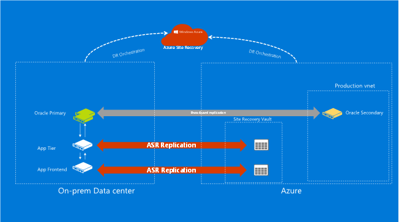
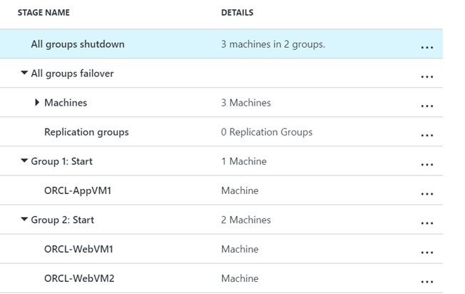
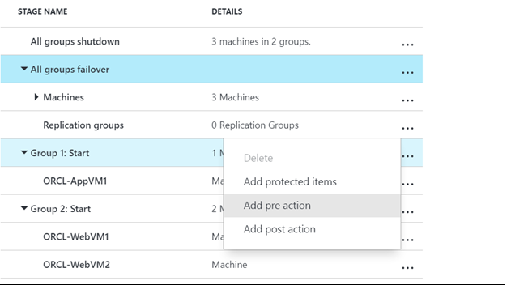
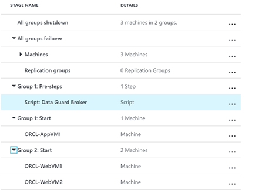

# Protected Oracle<sup>&copy;</sup> databases using Azure Site Recovery and Oracle Data Guard<sup>&copy;</sup>
This document describes the steps required to protect your Oracle<sup>&copy;</sup> database backed applications through Azure Site Recovery(ASR) and Oracle's BCDR technologies. This article assumes that the reader is aware of ASR's features and Oracle's Disaster Recovery technologies such as Redo logs, Real Application Clusters<sup>&copy;</sup> and Data Guard<sup>&copy;</sup> based Switchover and Failovers.


## Oracle Server Deployments

A variety of applications use Oracle database as a data store. You can deploy the database in a number of different ways:

**Standalone Oracle instance**:  This is an Oracle database server hosted on either a virtual machine or a physical machine.

**Oracle Real Application Clusters<sup>&copy;</sup>**: Oracle Real Application Clusters<sup>&copy;</sup> is a cluster of Oracle servers that appear as a single system to the connected applications. RAC provides combined processing power and resilience in case of a local hardware failure.

**Oracle Data Guard<sup>&copy;</sup>**: Data Guard is one of Oracle's cross data center High availability solution for enterprise databases.  Data guard has comprehensive set of features to maintain transaction consistent standby databases and switch to standby databases in case of outages.

**Oracle GoldenGate<sup>&copy;</sup>**: GoldenGate is another of Oracle's cross data center high availability solution for enterprise databases.

Oracle enterprise editions provide Oracle Data Guard broker(DGMGRL), a management feature to create and manage Data Guard configurations. We leverage Data Guard broker and ASR's recovery plan feature to create a seamless business continuity and disaster recovery experience.


## Site Recovery Support
Azure site recovery(ASR)'s recovery plans can be integrated with all the versions of data guard brokers.  We have tested the Data Guard broker with configuration that manages Oracle 12c instances.

## Deployment prerequisites
Below are the list of pre-requisites for the integration to work
*  An on-premises Oracle server deployment running one of the recommended versions.
*  An Azure Oracle server configured to run as a standby database. This database needs to be deployed in your post failover production network.
*  Data Guard broker configured as per the guidelines at [Configuring Oracle Data Guard for Azure] (https://azure.microsoft.com/en-us/documentation/articles/virtual-machines-windows-classic-configure-oracle-data-guard/)
* Azure Site recovery's scenario specific pre-requisites found [Site Recovery overview](https://azure.microsoft.com/en-us/documentation/articles/site-recovery-overview/).


## Configuration prerequisites
* Oracle Data Guard broker scripts are invoked from Azure Site recovery's Recovery plans. To facilitate this remote script invocations without supplying plan passwords, you need to configure auto logins through Oracle wallet as described at [Using Oracle Wallet Manager](https://docs.oracle.com/cd/B28359_01/network.111/b28530/asowalet.htm#i1009041)
* For a glitch-free disaster recovery experience, Application clients need to be configured to seamlessly connect to the new primary databases. This can achieved by following Oracle's [Maximum availability architecture guidelines](http://www.oracle.com/technetwork/database/availability/client-failover-2280805.pdf) for client configurations.
If you have followed all the steps , your Application architecture will look similar to the below diagram.

    

## Create Data Guard Failover runbook
Create an Azure runbook that triggers Data Guard failover on the Oracle standby server, deployed on Azure. Use the below sample script to do this.

```
workflow OraFailover
{
    param (
        [Object]$RecoveryPlanContext
    )

    $Cred = Get-AutomationPSCredential -name 'ORCL@MSFT'

    #Connect to Azure
    $AzureAccount = Add-AzureAccount -Credential $Cred
    $AzureSubscriptionName = Get-AutomationVariable –Name 'AzureSubscriptionName'
    Select-AzureSubscription -SubscriptionName $AzureSubscriptionName

    $stor = Get-AutomationVariable -Name 'StorageAccountName'
    $serviceName = Get-AutomationVariable -Name 'AzureServiceName'
    $vmName = Get-AutomationVariable -Name 'AzureVMName'
    $storageAccountKey = Get-AutomationVariable -Name 'AzureStorageAccountKey'

    $cseTimeStamp = InLineScript
    {
    #Update the script with name of your storage account, key and blob name
    $context = New-AzureStorageContext -StorageAccountName $Using:stor -StorageAccountKey $Using:storageAccountKey;
    $sasuri = New-AzureStorageBlobSASToken -Container "script-container" -Blob "DAGFailover.ps1" -Permission r -FullUri -Context $context;
    $runFile = "DAGSwitchover.ps1";
    Write-output "failovertype " + $Using:RecoveryPlanContext.FailoverType;

    if ($Using:RecoveryPlanContext.FailoverType -eq "Test")
        {
        #Skipping TFO in this version.
        #We will update the script in a follow-up post with TFO support
        Write-output "tfo: Skipping ORacle DAG Failover";
        }
    else
        {
        Write-output "pfo/ufo";
        if($Using:RecoveryPlanContext.FailoverType -eq "PFO"){
            Write-output "pfo";
            $sasuri = New-AzureStorageBlobSASToken -Container "script-container" -Blob "DAGSwitchover.ps1" -Permission r -FullUri -Context $context;
            $runFile = "DAGSwitchover.ps1";
        }
        else{
            Write-output "ufo";
            $sasuri = New-AzureStorageBlobSASToken -Container "script-container" -Blob "DAGFailover.ps1" -Permission r -FullUri -Context $context;
            $runFile = "DAGFailover.ps1";
        }

        #Get the SQL Azure Replica VM.
        #Update the script to use the name of your VM and Cloud Service
        $VM = Get-AzureVM -Name "orcl12creplica" -ServiceName "oracledgvm";     

        Write-Output "Installing custom script extension"
        #Install the Custom Script Extension on teh SQL Replica VM
        Set-AzureVMExtension -ExtensionName CustomScriptExtension -VM $VM -Publisher Microsoft.Compute -Version 1.8| Update-AzureVM;

        Write-output "Starting DAG Failover";
        #Execute the SQL Failover script
        #Pass the SQL AG path as the argument.

        $AGArgs="";

        Set-AzureVMCustomScriptExtension -VM $VM -FileUri $sasuri -Run $runFile | Update-AzureVM | Write-Verbose;

        Write-output $cseTimeStamp;
        Write-output "Completed DAG Failover";

        }

    }
}
```

## Integrate protection with Azure Site Recovery
Recovery plans not only orchestrate replication, recovery and failover of applications but also empower us to trigger a variety of actions through the pre and post actions. To achieve seamless Data Guard broker based transitions we'll invoke the Data Guard scripts through a script hook in recovery plan.  Please follow the below steps to integrate Oracle Data Guard broker with ASR.
1. Create a recovery plan using your application and web tier VMs

    

2. Add a pre-step to the recovery plan and select a script action to invoke the Data Guard broker runbook. In this example, our environment has one application tier VM and two web tier VMs. You can customize your recovery plan to have multiple failover groups to sequence the failover order.

    

3. Your recovery plan should look similar to this once the Pre-Action has been added

    

Now your environment is ready for one-click Disaster recovery. You can trigger planned/unplanned failover of your application by going to your recovery plan.
