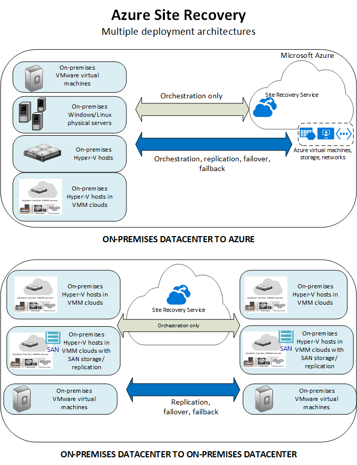

<properties
	pageTitle="What is Site Recovery? | Microsoft Azure" 
	description="Provides an overview of the Azure Site Recovery service and explains how the service can be deployed." 
	services="site-recovery" 
	documentationCenter="" 
	authors="rayne-wiselman" 
	manager="jwhit" 
	editor=""/>

<tags 
	ms.service="site-recovery" 
	ms.devlang="na"
	ms.topic="get-started-article"
	ms.tgt_pltfrm="na"
	ms.workload="storage-backup-recovery" 
	ms.date="02/22/2016" 
	ms.author="raynew"/>

#  What is Site Recovery?

Welcome to the Azure Site Recovery! Start with this article to get a quick overview of the Site Recovery service and how can contribute to your business continuity and disaster recovery (BCDR) strategy.

## Overview

Organizations need a BCDR strategy that determines how apps, workloads, and data stay running and available during planned and unplanned downtime, and recover to normal working conditions as soon as possible. Your BCDR strategy should keep business data safe and recoverable, and ensure that workloads remain continuously available when disaster occurs. 

Site Recovery is an Azure service that contributes to your BCDR strategy by orchestrating replication of on-premises physical servers and virtual machines to the cloud (Azure) or to a secondary datacenter. When outages occur in your primary location, you fail over to the secondary location to keep apps and workloads available. You fail back to your primary location when it returns to normal operations. Learn more in [What is Site Recovery?](site-recovery-overview.md)

## Site Recovery in the Azure portal

Azure has two different [deployment models](../resource-manager-deployment-model.md) for creating and working with resources: the Azure Resource Manager model and the classic services management model. Azure also has two portals – the [Azure classic portal](https://manage.windowsazure.com/) that supports the classic deployment model, and the [Azure portal](https://portal.azure.com) with support for both deployment models.

Site Recovery is available in both the classic portal and the Azure portal. In the Azure classic portal you can support Site Recovery with the classic services management model. In the Azure portal you can support the classic model or Resource Manager deployments. [Read more](site-recovery-overview.md#site-recovery-in-the-azure-portal) about deploying with the Azure portal.

The information in this article applies to both classic and Azure portal deployments. Differences are noted where applicable.

## Why use Site Recovery? 

Here's what Site Recovery can do for your business:

- **Simplify your BCDR strategy**—Site Recovery makes it easy to handle replication, failover and recovery of multiple business workloads and apps from a single location. Site recovery orchestrates replication and failover but doesn't intercept your application data or have any information about it.
- **Provide flexible replication**—Using Site Recovery you can replicate workloads running on Hyper-V virtual machines, VMware virtual machines, and Windows/Linux physical servers. 
- **Easy failover and recovery**—Site Recovery provides test failovers to support disaster recovery drills without affecting production environments. You can also run planned failovers with a zero-data loss for expected outages, or unplanned failovers with minimal data loss (depending on replication frequency) for unexpected disasters. After failover you can failback to your primary sites. Site Recovery provides recovery plans that can include scripts and Azure automation workbooks so that you can customize failover and recovery of multi-tier applications. 
- **Eliminate secondary datacenter**—You can replicate to a secondary on-premises site, or to Azure. Using Azure as a destination for disaster recovery eliminates the cost and complexity maintaining a secondary site, and replicated data is stored in Azure Storage, with all the resilience that provides.
- **Integrate with existing BCDR technologies**—Site Recovery partners with other application BCDR features. For example you can use Site Recovery to protect the SQL Server back end of corporate workloads, including native support for SQL Server AlwaysOn to manage the failover of availability groups. 

## What can I replicate?

Here's a summary of what you can replicate using Site Recovery.

**REPLICATE** | **REPLICATE FROM (ON-PREMISES)** | **REPLICATE TO** | **ARTICLE**
---|---|---|---
VMware VMs | VMware server | Azure | [Learn more](site-recovery-vmware-to-azure-classic.md)
VMware VMs | VMware server | Secondary VMware site | [Learn more](site-recovery-vmware-to-vmware.md) 
Hyper-V VMs | Hyper-V host in VMM cloud | Azure | [Learn more](site-recovery-vmm-to-azure.md) 
Hyper-V VMs | Hyper-V host in VMM cloud | Secondary VMM site | [Learn more](site-recovery-vmm-to-vmm.md)
Hyper-V VMs | Hyper-V host in VMM cloud with SAN storage| Secondary VMM site with SAN storage | [Learn more](site-recovery-vmm-san.md)
Hyper-V VMs | Hyper-V host (no VMM) | Azure | [Learn more](site-recovery-hyper-v-site-to-azure.md)
Physical Windows/Linux servers | Physical server | Azure | [Learn more](site-recovery-vmware-to-azure-classic.md)
Workloads running on physical Windows/Linux servers | Physical server | Secondary datacenter | [Learn more](site-recovery-vmware-to-vmware.md) 

## What workloads can I protect?

Site Recovery can help with application-aware BCDR so that workloads and apps continue to run in a consistent way when outages occur. Site Recovery provides: 

- **Application-consistent snapshots**—Replication using application-consistent snapshots for single or N-tier apps.
- **Near-synchronous replication**—Replication frequency as low as 30 seconds for Hyper-V, and continuous replication for VMware.
- **Integration with SQL Server AlwaysOn**—You can manage the failover of availability groups in Site Recovery recovery plans. 
- **Flexible recovery plans**— You can create and customize recovery plans with external scripts, manual actions, and Azure Automation runbooks that enable you to recover an entire application stack with a single click.
- **Automation library**—A rich Azure Automation library provides production-ready, application-specific scripts that can be downloaded and integrated with Site Recovery.
- **Simple network management**—Advanced network management in Site Recovery and Azure simplifies application network requirements, including reserving IP addresses, configuring load-balancers, and integrating Azure Traffic Manager for efficient network switch overs.

## Next steps

- Read more in [What workloads can Site Recovery protect?](site-recovery-workload.md)
- Learn more about Site Recovery architecture in [How does Site Recovery work?](site-recovery-components.md)
 
