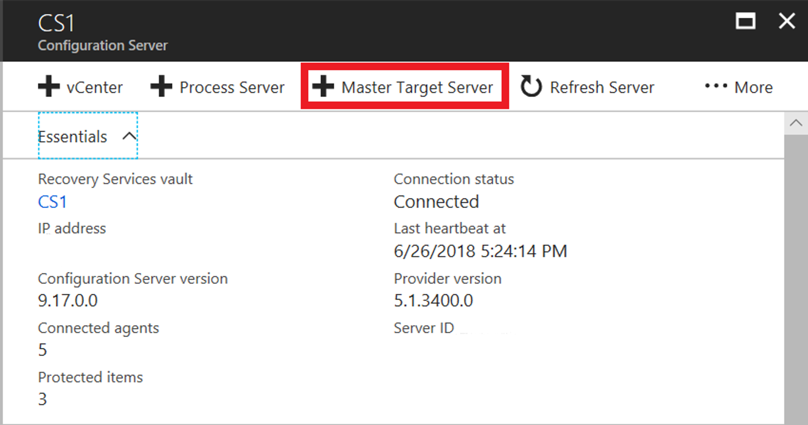
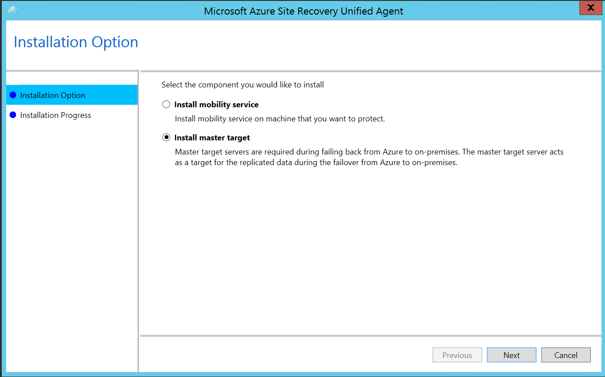
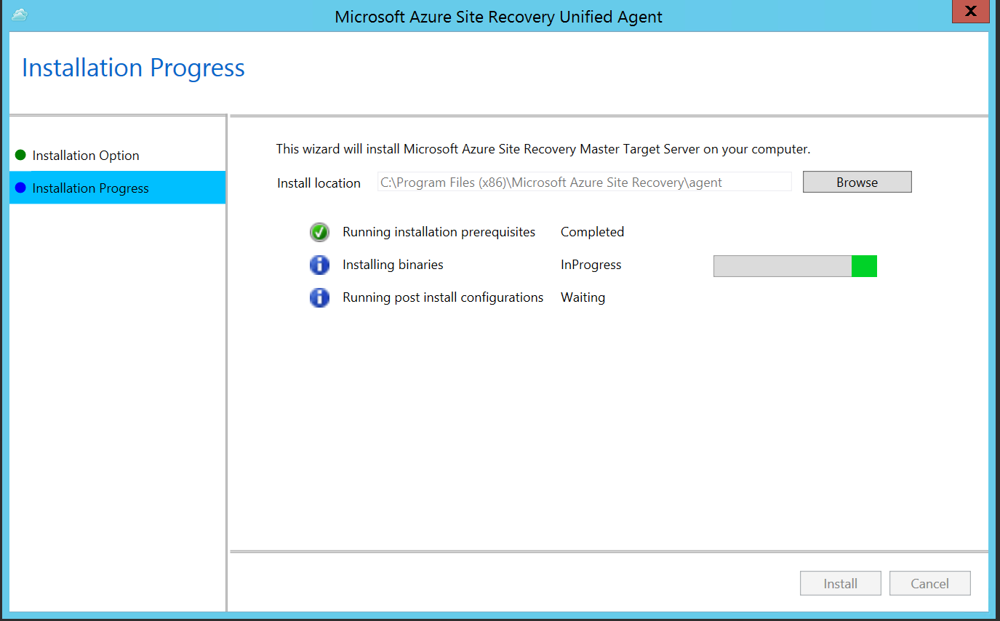
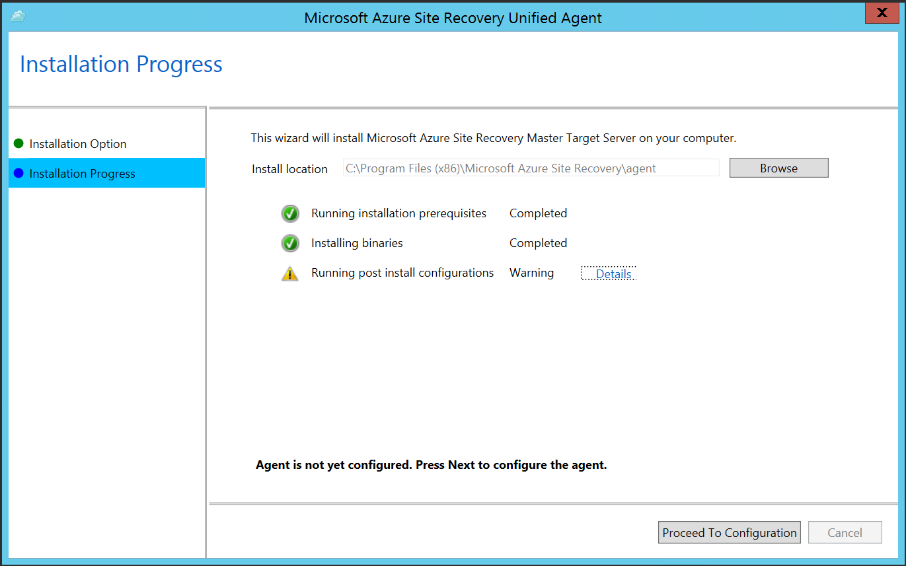
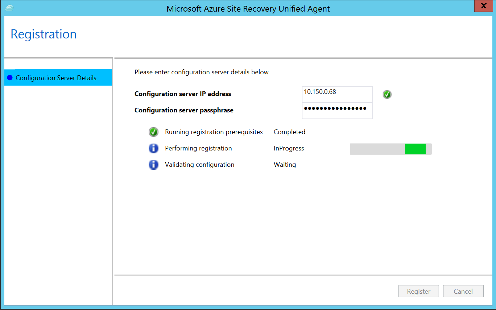

# Plan capacity and scaling for VMware disaster recovery to Azure

Use this article to plan for capacity and scaling when you replicate on-premises VMware VMs and physical servers to Azure by using [Azure Site Recovery](site-recovery-overview.md) - Classic.

In modernized, you need to [create and use Azure Site Recovery replication appliance/multiple appliances](deploy-vmware-azure-replication-appliance-modernized.md) to plan capacity.

## How do I start capacity planning?

To learn about Azure Site Recovery infrastructure requirements, gather information about your replication environment by running [Azure Site Recovery Deployment Planner](./site-recovery-deployment-planner.md) for VMware replication. For more information, see [About Site Recovery Deployment Planner for VMware to Azure](site-recovery-deployment-planner.md).

Site Recovery Deployment Planner provides a report that has complete information about compatible and incompatible VMs, disks per VM, and data churn per disk. The tool also summarizes network bandwidth requirements to meet target RPO and the Azure infrastructure that's required for successful replication and test failover.

## Capacity considerations

Component | Details
--- | ---
**Replication** | **Maximum daily change rate**: A protected machine can use only one process server. A single process server can handle a daily change rate up to 2 TB. So, 2 TB is the maximum daily data change rate that’s supported for a protected machine.<br /><br /> **Maximum throughput**: A replicated machine can belong to one storage account in Azure. A standard Azure Storage account can handle a maximum of 20,000 requests per second. We recommend that you limit the number of input/output operations per second (IOPS) across a source machine to 20,000. For example, if you have a source machine that has five disks and each disk generates 120 IOPS (8 K in size) on the source machine, the source machine is within the Azure per-disk IOPS limit of 500. (The number of storage accounts required is equal to the total source machine IOPS divided by 20,000.)
**Configuration server** | The configuration server must be able to handle the daily change rate capacity across all workloads running on protected machines. The configuration machine must have sufficient bandwidth to continuously replicate data to Azure Storage.<br /><br /> A best practice is to place the configuration server on the same network and LAN segment as the machines that you want to protect. You can place the configuration server on a different network, but machines that you want to protect should have layer 3 network visibility.<br /><br /> Size recommendations for the configuration server are summarized in the table in the following section.
**Process server** | The first process server is installed by default on the configuration server. You can deploy additional process servers to scale your environment. <br /><br /> The process server receives replication data from protected machines. The process server optimizes data by using caching, compression, and encryption. Then, the process server sends the data to Azure. The process server machine must have sufficient resources to perform these tasks.<br /><br /> The process server uses a disk-based cache. Use a separate cache disk of 600 GB or more to handle data changes that are stored if a network bottleneck or outage occurs.

## Size recommendations for the configuration server and inbuilt process server

A configuration server that uses an inbuilt process server to protect the workload can handle up to 200 virtual machines based on the following configurations:

CPU | Memory | Cache disk size | Data change rate | Protected machines
--- | --- | --- | --- | ---
8 vCPUs (2 sockets * 4 cores \@ 2.5 GHz) | 16 GB | 300 GB | 500 GB or less | Use to replicate fewer than 100 machines.
12 vCPUs (2 sockets * 6 cores \@ 2.5 GHz) | 18 GB | 600 GB | 501 GB to 1 TB | Use to replicate 100 to 150 machines.
16 vCPUs (2 sockets * 8 cores \@ 2.5 GHz) | 32 GB | 1 TB | >1 TB to 2 TB | Use to replicate 151 to 200 machines.
Deploy another configuration server by using an [OVF template](vmware-azure-deploy-configuration-server.md#deploy-a-configuration-server-through-an-ova-template). | | | | Deploy a new configuration server if you're replicating more than 200 machines.
Deploy another [process server](vmware-azure-set-up-process-server-scale.md#download-installation-file). | | | >2 TB| Deploy a new scale-out process server if the overall daily data change rate is greater than 2 TB.

In these configurations:

* Each source machine has three disks of 100 GB each.
* We used benchmarking storage of eight shared access signature drives of 10 K RPM with RAID 10 for cache disk measurements.

## Size recommendations for the process server

The process server is the component that handles data replication in Azure Site Recovery. If the daily change rate is greater than 2 TB, you must add scale-out process servers to handle the replication load. To scale out, you can:

* Increase the number of configuration servers by deploying by using an [OVF template](vmware-azure-deploy-configuration-server.md#deploy-a-configuration-server-through-an-ova-template). For example, you can protect up to 400 machines by using two configuration servers.
* Add [scale-out process servers](vmware-azure-set-up-process-server-scale.md#download-installation-file). Use the scale-out process servers to handle replication traffic instead of (or in addition to) the configuration server.

The following table describes this scenario:

* You set up a scale-out process server.
* You configured protected virtual machines to use the scale-out process server.
* Each protected source machine has three disks of 100 GB each.

Additional process server | Cache disk size | Data change rate | Protected machines
--- | --- | --- | ---
4 vCPUs (2 sockets * 2 cores \@ 2.5 GHz), 8 GB of memory | 300 GB | 250 GB or less | Use to replicate 85 or fewer machines.
8 vCPUs (2 sockets * 4 cores \@ 2.5 GHz), 12 GB of memory | 600 GB | 251 GB to 1 TB | Use to replicate 86 to 150 machines.
12 vCPUs (2 sockets * 6 cores \@ 2.5 GHz) 24 GB of memory | 1 TB | >1 TB to 2 TB | Use to replicate 151 to 225 machines.

How you scale your servers depends on your preference for a scale-up or scale-out model. To scale up, deploy a few high-end configuration servers and process servers. To scale out, deploy more servers that have fewer resources. For example, if you want to protect 200 machines with an overall daily data change rate of 1.5 TB, you could take one of the following actions:

* Set up a single process server (16 vCPU, 24 GB of RAM).
* Set up two process servers (2 x 8 vCPU, 2* 12 GB of RAM).

## Control network bandwidth

After you use [Site Recovery Deployment Planner](site-recovery-deployment-planner.md) to calculate the bandwidth you need for replication (initial replication and then the delta), you have a couple of options for controlling the amount of bandwidth that's used for replication:

* **Throttle bandwidth**: VMware traffic that replicates to Azure goes through a specific process server. You can throttle bandwidth on the machines that are running as process servers.
* **Influence bandwidth**: You can influence the bandwidth that's used for replication by using a couple of registry keys:
  * The **HKEY_LOCAL_MACHINE\SOFTWARE\Microsoft\Windows Azure Backup\Replication\UploadThreadsPerVM** registry value specifies the number of threads that are used for data transfer (initial or delta replication) of a disk. A higher value increases the network bandwidth that's used for replication.
  * The **HKEY_LOCAL_MACHINE\SOFTWARE\Microsoft\Windows Azure Backup\Replication\DownloadThreadsPerVM** registry value specifies the number of threads that are used for data transfer during failback.

### Throttle bandwidth

1. Open the Azure Backup MMC snap-in on the machine you use as the process server. By default, a shortcut for Backup is available on the desktop or in the following folder: C:\Program Files\Microsoft Azure Recovery Services Agent\bin.
2. In the snap-in, select **Change Properties**.

    
3. On the **Throttling** tab, select **Enable internet bandwidth usage throttling for backup operations**. Set the limits for work and non-work hours. Valid ranges are from 512 Kbps to 1,023 Mbps.

    

You can also use the [Set-OBMachineSetting](/previous-versions/windows/powershell-scripting/hh770409(v=wps.640)) cmdlet to set throttling. Here's an example:

```azurepowershell-interactive
$mon = [System.DayOfWeek]::Monday
$tue = [System.DayOfWeek]::Tuesday
Set-OBMachineSetting -WorkDay $mon, $tue -StartWorkHour "9:00:00" -EndWorkHour "18:00:00" -WorkHourBandwidth  (512*1024) -NonWorkHourBandwidth (2048*1024)
```

**Set-OBMachineSetting -NoThrottle** indicates that no throttling is required.

### Alter the network bandwidth for a VM

1. In the VM's registry, go to **HKEY_LOCAL_MACHINE\SOFTWARE\Microsoft\Windows Azure Backup\Replication**.
   * To alter the bandwidth traffic on a replicating disk, modify the value of **UploadThreadsPerVM**. Create the key if it doesn't exist.
   * To alter the bandwidth for failback traffic from Azure, modify the value of **DownloadThreadsPerVM**.
2. The default value for each key is **4**. In an “overprovisioned” network, these registry keys should be changed from the default values. The maximum value you can use is **32**. Monitor traffic to optimize the value.

## Set up the Site Recovery infrastructure to protect more than 500 VMs

Before you set up the Site Recovery infrastructure, access the environment to measure the following factors: compatible virtual machines, the daily data change rate, the required network bandwidth for the RPO you want to achieve, the number of Site Recovery components that are required, and the time it takes to complete the initial replication. Complete the following steps to gather the required information:

1. To measure these parameters, run Site Recovery Deployment Planner on your environment. For helpful guidelines, see [About Site Recovery Deployment Planner for VMware to Azure](site-recovery-deployment-planner.md).
2. Deploy a configuration server that meets the [size recommendations for the configuration server](site-recovery-plan-capacity-vmware.md#size-recommendations-for-the-configuration-server-and-inbuilt-process-server). If your production workload exceeds 650 virtual machines, deploy another configuration server.
3. Based on the measured daily data change rate, deploy [scale-out process servers](vmware-azure-set-up-process-server-scale.md#download-installation-file) with the help of [size guidelines](site-recovery-plan-capacity-vmware.md#size-recommendations-for-the-process-server).
4. If you expect the data change rate for a disk virtual machine to exceed 2 MBps, ensure that you use premium managed disks. Site Recovery Deployment Planner runs for a specific time period. Peaks in the data change rate at other times might not be captured in the report.
5. [Set the network bandwidth](site-recovery-plan-capacity-vmware.md#control-network-bandwidth) based on the RPO you want to achieve.
6. When the infrastructure is set up, enable disaster recovery for your workload. To learn how, see [Set up the source environment for VMware to Azure replication](vmware-azure-set-up-source.md).

## Deploy additional process servers

If you scale out your deployment beyond 200 source machines or if you have a total daily churn rate of more than 2 TB, you must add process servers to handle the traffic volume. We have enhanced the product in 9.24 version to provide [process server alerts](vmware-physical-azure-monitor-process-server.md#process-server-alerts) on when to set up a scale-out process server. [Set up the process server](vmware-azure-set-up-process-server-scale.md) to protect new source machines or [balance the load](vmware-azure-manage-process-server.md#move-vms-to-balance-the-process-server-load).

### Migrate machines to use the new process server

1. Select **Settings** > **Site Recovery servers**. Select the configuration server, and then expand **Process servers**.

    
2. Right-click the process server currently in use, and then select **Switch**.

    
3. In **Select target process server**, select the new process server you want to use. Then, select the virtual machines that the server will handle. To get information about the server, select the information icon. To help you make load decisions, the average space that's required to replicate each selected virtual machine to the new process server is shown. Select the check mark to begin replicating to the new process server.

## Deploy additional master target servers

In the following scenarios, more than one master target server is required:

*   You want to protect a Linux-based virtual machine.
*   The master target server available on the configuration server doesn't have access to the datastore of the VM.
*   The total number of disks on the master target server (the number of local disks on server plus the number of disks to be protected) is greater than 60 disks.

To learn how to add a master target server for a Linux-based virtual machine, see [Install a Linux master target server for failback](vmware-azure-install-linux-master-target.md).

To add a master target server for a Windows-based virtual machine:

1. Go to **Recovery Services Vault** > **Site Recovery Infrastructure** > **Configuration servers**.
2. Select the required configuration server, and then select **Master Target Server**.

    
3. Download the unified setup file, and then run the file on the VM to set up the master target server.
4. Select **Install master target** > **Next**.

    
5. Select the default installation location, and then select **Install**.

     
6. To register the master target with the configuration server, select **Proceed To Configuration**.

    
7. Enter the IP address of the configuration server, and then enter the passphrase. To learn how to generate a passphrase, see [Generate a configuration server passphrase](vmware-azure-manage-configuration-server.md#generate-configuration-server-passphrase).

    
8. Select **Register**. When registration is finished, select **Finish**.

When registration finishes successfully, the server is listed in the Azure portal at **Recovery Services Vault** > **Site Recovery Infrastructure** > **Configuration servers**, in the master target servers of the configuration server.

 > [!NOTE]
 > Download the latest version of the [master target server unified setup file for Windows](https://aka.ms/latestmobsvc).

## Next steps

Download and run [Site Recovery Deployment Planner](https://aka.ms/asr-deployment-planner).
