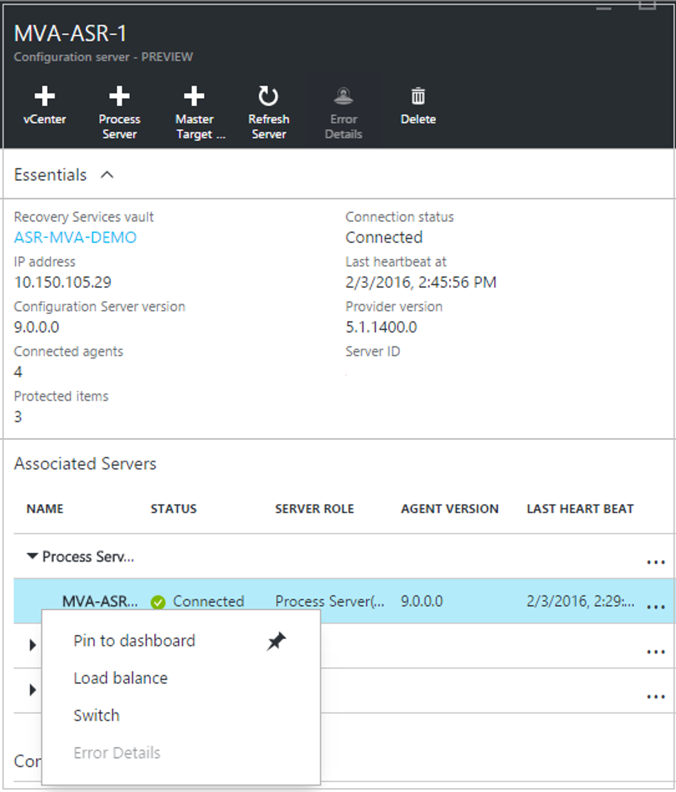

# Plan capacity and scaling for VMware replication with Azure Site Recovery

Use this article to figure out how to plan capacity and scaling when replicating on-premises VMware VMs and physical servers to Azure, with [Azure Site Recovery](site-recovery-overview.md).

## How do I start capacity planning?

Gather information about your replication environment using the [Azure Site Recovery Deployment Planner](https://aka.ms/asr-deployment-planner-doc). This includes information about number of virtual machines that are compatible and incompatible, disks per VM, data churn per disk, network bandwidth requirement and required Azure infrasturcutre for successful replication and test failover/failover.

## Capacity considerations

**Component** | **Details** |
--- | --- | ---
**Replication** | **Maximum daily change rate**—A protected machine can only use one process server, and a single process server can handle a daily change rate up to 2 TB. Thus 2 TB is the maximum daily data change rate that’s supported for a protected machine.   **Maximum throughput**—A replicated machine can belong to one storage account in Azure. A standard storage account can handle a maximum of 20,000 requests per second, and we recommend that you keep the number of IOPS across a source machine to 20,000. For example, if you have a source machine with 5 disks and each disk generates 120 IOPS (8K size) on the source, then it will be within the Azure per disk IOPS limit of 500. The number of storage accounts required = total source IOPs/20000.
**Configuration server** | The configuration server should be able to handle the daily change rate capacity across all workloads running on protected machines, and needs sufficient bandwidth to continuously replicate data to Azure storage.   As a best practice, we recommend that the configuration server be located on the same network and LAN segment as the machines you want to protect. It can be located on a different network but machines you want to protect should have L3 network visibility to it.   Size recommendations for the configuration server are summarized in the table below.
**Process server** | The first process server is installed by default on the configuration server. You can deploy additional process servers to scale your environment. Note that:   The process server receives replication data from protected machines and optimizes it with caching, compression, and encryption before sending to Azure. The process server machine should have sufficient resources to perform these tasks.   The process server uses disk-based cache. We recommend a separate cache disk of 600 GB or more to handle data changes stored in the event of network bottleneck or outage.

## Size recommendations for the configuration server

**CPU** | **Memory** | **Cache disk size** | **Data change rate** | **Protected machines**
--- | --- | --- | --- | ---
8 vCPUs (2 sockets * 4 cores @ 2.5GHz) | 16 GB | 300 GB | 500 GB or less | Replicate less than 100 machines.
12 vCPUs (2 sockets * 6 cores @ 2.5GHz) | 18 GB | 600 GB | 500 GB to 1 TB | Replicate between 100-150 machines.
16 vCPUs (2 sockets * 8 cores @ 2.5GHz) | 32 GB | 1 TB | 1 TB to 2 TB | Replicate between 150-200 machines.
Deploy another process server | | | > 2 TB | Deploy additional process servers if you're replicating more than 200 machines, or if the daily data change rate exceeds 2 TB.

Where:

* Each source machine is configured with 3 disks of 100 GB each.
* We used benchmarking storage of 8 SAS drives of 10 K RPM with RAID 10 for cache disk measurements.

## Size recommendations for the process server

If you need to protect more than 200 machines, or daily change rate is greater than 2 TB, you can add additional process servers to handle the replication load. To scale out, you can:

* Increase the number of configuration servers. For example, you can protect up to 400 machines with two configuration servers.
* Add additional process servers, and use these to handle traffic instead of (or in addition to) the configuration server.

This table describes a scenario in which:

* You're not planning to use the configuration server as a process server.
* You've set up an additional process server.
* You've configured protected virtual machines to use the additional process server.
* Each protected source machine is configured with three disks of 100 GB each.

**Configuration server** | **Additional process server** | **Cache disk size** | **Data change rate** | **Protected machines**
--- | --- | --- | --- | ---
8 vCPUs (2 sockets * 4 cores @ 2.5GHz), 16 GB memory | 4 vCPUs (2 sockets * 2 cores @ 2.5GHz), 8 GB memory | 300 GB | 250 GB or less | Replicate 85 or less machines.
8 vCPUs (2 sockets * 4 cores @ 2.5GHz), 16 GB memory | 8 vCPUs (2 sockets * 4 cores @ 2.5GHz), 12 GB memory | 600 GB | 250 GB to 1 TB | Replicate between 85-150 machines.
12 vCPUs (2 sockets * 6 cores @ 2.5GHz), 18 GB memory | 12 vCPUs (2 sockets * 6 cores @ 2.5GHz) 24 GB memory | 1 TB | 1 TB to 2 TB | Replicate between 150-225 machines.

The way in which you scale your servers depends on your preference for a scale up or scale out model.  You scale up by deploying a few high-end configuration and process servers, or scale out by deploying more servers with less resources. For example, if you need to protect 220 machines, you could do either of the following:

* Set up the configuration server with 12vCPU, 18 GB of memory, an additional process server with 12vCPU, 24 GB of memory, and configure protected machines to use the additional process server only.
* Alternatively, you could configure two configuration servers (2 x 8vCPU, 16 GB RAM) and two additional process servers (1 x 8vCPU and 4vCPU x 1 to handle 135 + 85 (220) machines), and configure protected machines to use the additional process servers only.

## Control network bandwidth

You can use [the deployment planner tool](https://aka.ms/asr-deployment-planner-doc) to calculate the bandwidth you need for replication (initial replication and then delta). To control the amount of bandwidth used for replication, you have a few options:

* **Throttle bandwidth**: VMware traffic that replicates to Azure goes through a specific process server. You can throttle bandwidth on the machines running as process servers.
* **Influence bandwidth**: You can influence the bandwidth used for replication using a couple of registry keys:
  * The **HKEY_LOCAL_MACHINE\SOFTWARE\Microsoft\Windows Azure Backup\UploadThreadsPerVM** registry value specifies the number of threads that are used for data transfer (initial or delta replication) of a disk. A higher value increases the network bandwidth used for replication.
  * The **HKEY_LOCAL_MACHINE\SOFTWARE\Microsoft\Windows Azure Backup\DownloadThreadsPerVM** specifies the number of threads used for data transfer during failback.

### Throttle bandwidth
1. Open the Microsoft Azure Backup MMC snap-in on the machine acting as the process server. By default, a shortcut for Microsoft Azure Backup is available on the desktop or in C:\Program Files\Microsoft Azure Recovery Services Agent\bin\wabadmin.
2. In the snap-in click **Change Properties**.

    
3. On the **Throttling** tab, select **Enable internet bandwidth usage throttling for backup operations**, and set the limits for work and non-work hours. Valid ranges are from 512 Kbps to 102 Mbps per second.

    

You can also use the [Set-OBMachineSetting](https://technet.microsoft.com/library/hh770409.aspx) cmdlet to set throttling. Here's a sample:

    $mon = [System.DayOfWeek]::Monday
    $tue = [System.DayOfWeek]::Tuesday
    Set-OBMachineSetting -WorkDay $mon, $tue -StartWorkHour "9:00:00" -EndWorkHour "18:00:00" -WorkHourBandwidth  (512*1024) -NonWorkHourBandwidth (2048*1024)

**Set-OBMachineSetting -NoThrottle** indicates that no throttling is required.

#### Influence network bandwidth for a VM

1. In the VM's registry, navigate to **HKEY_LOCAL_MACHINE\SOFTWARE\Microsoft\Windows Azure Backup\Replication**.
   * To influence the bandwidth traffic on a replicating disk, modify the value the **UploadThreadsPerVM**, or create the key if it doesn't exist.
   * To influence the bandwidth for failback traffic from Azure, modify the value **DownloadThreadsPerVM**.
2. The default value is 4. In an “overprovisioned” network, these registry keys should be changed from the default values. The maximum is 32. Monitor traffic to optimize the value.

## Deploy additional process servers

If you have to scale out your deployment beyond 200 source machines, or a total daily churn rate of more than 2 TB, you’ll need additional process servers to handle the traffic volume. Gollow these instructions to set up the process server. After setting up the server, you migrate source machines to use it.

1. In **Site Recovery servers**, click the configuration server > **Process server**.

    
2. In **Server Type**, click **Process server (on-premises)**.

    
3. Download the Site Recovery Unified Setup file, and run it to install the process server and register it in the vault.
4. In **Before you begin**, select **Add additional process servers to scale out deployment**.
5. Complete the wizard in the same way you did when you [set up](#step-2-set-up-the-source-environment) the configuration server.

    
6. In **Configuration Server Details**, specify the IP address of the configuration server, and the passphrase. To obtain the passphrase, run **<SiteRecoveryInstallationFolder>\home\sysystems\bin\genpassphrase.exe –n** on the configuration server.

    

### Migrate machines to use the new process server
1. In **Settings** > **Site Recovery servers**, click the configuration server, and then expand **Process servers**.

    
2. Right-click the process server currently in use, and click **Switch**.

    
3. In **Select target process server**, select the new process server you want to use, and then select the virtual machines that the new process server will handle. Click the information icon to get information about the server. To help you make load decisions, the average space that's needed to replicate each selected virtual machine to the new process server is displayed. Click the check mark to start replicating to the new process server.

