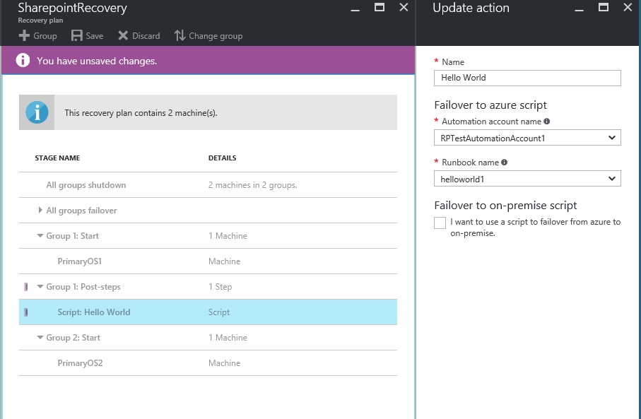

---
title: Add Azure Automation runbooks to Site Recovery recovery plans | Microsoft Docs
description: Learn how to extend recovery plans with Azure Automation for disaster recovery with Azure Site Recovery.
author: rajani-janaki-ram
manager: gauravd
ms.service: site-recovery
ms.topic: conceptual
ms.date: 11/27/2018
ms.author: rajanaki
---

# Add Azure Automation runbooks to recovery plans
In this article, we describe how Azure Site Recovery integrates with Azure Automation to help you extend your recovery plans. Recovery plans can orchestrate recovery of VMs that are protected with Site Recovery. Recovery plans work both for replication to a secondary cloud, and for replication to Azure. Recovery plans also help make the recovery **consistently accurate**, **repeatable**, and **automated**. If you fail over your VMs to Azure, integration with Azure Automation extends your recovery plans. You can use it to execute runbooks, which offer powerful automation tasks.

If you are new to Azure Automation, you can [sign up](https://azure.microsoft.com/services/automation/) and [download sample scripts](https://azure.microsoft.com/documentation/scripts/). For more information, and to learn how to orchestrate recovery to Azure by using [recovery plans](./site-recovery-create-recovery-plans.md), see [Azure Site Recovery](https://azure.microsoft.com/services/site-recovery/).

In this article, we describe how you can integrate Azure Automation runbooks into your recovery plans. We use examples to automate basic tasks that previously required manual intervention. We also describe how to convert a multi-step recovery to a single-click recovery action.

## Customize the recovery plan
1. Go to the **Site Recovery** recovery plan resource blade. For this example, the recovery plan has two VMs added to it, for recovery. To begin adding a runbook, click the **Customize** tab.

    


2. Right-click **Group 1: Start**, and then select **Add post action**.

    

3. Click **Choose a script**.

4. On the **Update action** blade, name the script **Hello World**.

    

5. Enter an Automation account name.
	>[!NOTE]
	> The Automation account can be in any Azure region. The Automation account must be in the same subscription as the Azure Site Recovery vault.

6. In your Automation account, select a runbook. This runbook is the script that runs during the execution of the recovery plan, after the recovery of the first group.

7. To save the script, click **OK**. The script is added to **Group 1: Post-steps**.

    


## Considerations for adding a script

* For options to **delete a step** or **update the script**, right-click the script.
* A script can run on Azure during failover from an on-premises machine to Azure. It also can run on Azure as a primary-site script before shutdown, during failback from Azure to an on-premises machine.
* When a script runs, it injects a recovery plan context. The following example shows a context variable:

	```
			{"RecoveryPlanName":"hrweb-recovery",

			"FailoverType":"Test",

			"FailoverDirection":"PrimaryToSecondary",

			"GroupId":"1",

			"VmMap":{"7a1069c6-c1d6-49c5-8c5d-33bfce8dd183":

					{ "SubscriptionId":"7a1111111-c1d6-49c5-8c5d-111ce8dd183",

					"ResourceGroupName":"ContosoRG",

					"CloudServiceName":"pod02hrweb-Chicago-test",

					"RoleName":"Fabrikam-Hrweb-frontend-test",

					"RecoveryPointId":"TimeStamp"}

					}

			}
	```

	The following table lists the name and description of each variable in the context.

	| **Variable name** | **Description** |
	| --- | --- |
	| RecoveryPlanName |The name of the plan being run. This variable helps you take different actions based on the recovery plan name. You also can reuse the script. |
	| FailoverType |Specifies whether the failover is a test, planned, or unplanned. |
	| FailoverDirection |Specifies whether recovery is to a primary or secondary site. |
	| GroupID |Identifies the group number in the recovery plan when the plan is running. |
	| VmMap |An array of all VMs in the group. |
	| VMMap key |A unique key (GUID) for each VM. It's the same as the Azure Virtual Machine Manager (VMM) ID of the VM, where applicable. |
	| SubscriptionId |The Azure subscription ID in which the VM was created. |
	| RoleName |The name of the Azure VM that's being recovered. |
	| CloudServiceName |The Azure cloud service name under which the VM was created. |
	| ResourceGroupName|The Azure resource group name under which the VM was created. |
	| RecoveryPointId|The timestamp for when the VM is recovered. |

* Ensure that the Automation account has the following modules:
	* AzureRM.profile
	* AzureRM.Resources
	* AzureRM.Automation
	* AzureRM.Network
	* AzureRM.Compute

All modules should be of compatible versions. An easy way to ensure that all modules are compatible is to use the latest versions of all the modules.

### Access all VMs of the VMMap in a loop
Use the following code to loop across all VMs of the Microsoft VMMap:

```
$VMinfo = $RecoveryPlanContext.VmMap | Get-Member | Where-Object MemberType -EQ NoteProperty | select -ExpandProperty Name
$vmMap = $RecoveryPlanContext.VmMap
 foreach($VMID in $VMinfo)
 {
     $VM = $vmMap.$VMID                
             if( !(($VM -eq $Null) -Or ($VM.ResourceGroupName -eq $Null) -Or ($VM.RoleName -eq $Null))) {
         #this check is to ensure that we skip when some data is not available else it will fail
 Write-output "Resource group name ", $VM.ResourceGroupName
 Write-output "Rolename " = $VM.RoleName
     }
 }

```

> [!NOTE]
> The resource group name and role name values are empty when the script is a pre-action to a boot group. The values are populated only if the VM of that group succeeds in failover. The script is a post-action of the boot group.

## Use the same Automation runbook in multiple recovery plans

You can use a single script in multiple recovery plans by using external variables. You can use [Azure Automation variables](../automation/automation-variables.md) to store parameters that you can pass for a recovery plan execution. By adding the recovery plan name as a prefix to the variable, you can create individual variables for each recovery plan. Then, use the variables as parameters. You can change a parameter without changing the script, but still change the way the script works.

### Use a simple string variable in a runbook script

In this example, a script takes the input of a Network Security Group (NSG) and applies it to the VMs of a recovery plan.

For the script to detect which recovery plan is running, use the recovery plan context:

```
workflow AddPublicIPAndNSG {
    param (
          [parameter(Mandatory=$false)]
          [Object]$RecoveryPlanContext
    )

    $RPName = $RecoveryPlanContext.RecoveryPlanName
```

To apply an existing NSG, you must know the NSG name and the NSG resource group name. Use these variables as inputs for recovery plan scripts. To do this, create two variables in the Automation account assets. Add the name of the recovery plan that you are creating the parameters for as a prefix to the variable name.

1. Create a variable to store the NSG name. Add a prefix to the variable name by using the name of the recovery plan.

	

2. Create a variable to store the NSG's resource group name. Add a prefix to the variable name by using the name of the recovery plan.

	


3.	In the script, use the following reference code to get the variable values:

	```
	$NSGValue = $RecoveryPlanContext.RecoveryPlanName + "-NSG"
	$NSGRGValue = $RecoveryPlanContext.RecoveryPlanName + "-NSGRG"

	$NSGnameVar = Get-AutomationVariable -Name $NSGValue
	$RGnameVar = Get-AutomationVariable -Name $NSGRGValue
	```

4.	Use the variables in the runbook to apply the NSG to the network interface of the failed-over VM:

	```
 	InlineScript {
 	if (($Using:NSGname -ne $Null) -And ($Using:NSGRGname -ne $Null)) {
			$NSG = Get-AzureRmNetworkSecurityGroup -Name $Using:NSGname -ResourceGroupName $Using:NSGRGname
			Write-output $NSG.Id
			#Apply the NSG to a network interface
			#$vnet = Get-AzureRmVirtualNetwork -ResourceGroupName TestRG -Name TestVNet
			#Set-AzureRmVirtualNetworkSubnetConfig -VirtualNetwork $vnet -Name FrontEnd `
			#  -AddressPrefix 192.168.1.0/24 -NetworkSecurityGroup $NSG
		}
	}
	```

For each recovery plan, create independent variables so that you can reuse the script. Add a prefix by using the recovery plan name. For a complete, end-to-end script for this scenario, see [Add a public IP and NSG to VMs during test failover of a Site Recovery recovery plan](https://gallery.technet.microsoft.com/Add-Public-IP-and-NSG-to-a6bb8fee).


### Use a complex variable to store more information

Consider a scenario in which you want a single script to turn on a public IP on specific VMs. In another scenario, you might want to apply different NSGs on different VMs (not on all VMs). You can make a script that is reusable for any recovery plan. Each recovery plan can have a variable number of VMs. For example, a SharePoint recovery has two front ends. A basic line-of-business (LOB) application has only one front end. You cannot create separate variables for each recovery plan.

In the following example, we use a new technique and create a [complex variable](https://docs.microsoft.com/powershell/module/servicemanagement/azure/set-azureautomationvariable) in the Azure Automation account assets. You do this by specifying multiple values. You must use Azure PowerShell to complete the following steps:

1. In PowerShell, sign in to your Azure subscription:

	```
	Connect-AzureRmAccount
	$sub = Get-AzureRmSubscription -Name <SubscriptionName>
	$sub | Select-AzureRmSubscription
	```

2. To store the parameters, create the complex variable by using the name of the recovery plan:

	```
	$VMDetails = @{"VMGUID"=@{"ResourceGroupName"="RGNameOfNSG";"NSGName"="NameOfNSG"};"VMGUID2"=@{"ResourceGroupName"="RGNameOfNSG";"NSGName"="NameOfNSG"}}
		New-AzureRmAutomationVariable -ResourceGroupName <RG of Automation Account> -AutomationAccountName <AA Name> -Name <RecoveryPlanName> -Value $VMDetails -Encrypted $false
	```

3. In this complex variable, **VMDetails** is the VM ID for the protected VM. To get the VM ID, in the Azure portal, view the VM properties. The following screenshot shows a variable that stores the details of two VMs:

	

4. Use this variable in your runbook. If the indicated VM GUID is found in the recovery plan context, apply the NSG on the VM:

	```
	$VMDetailsObj = (Get-AutomationVariable -Name $RecoveryPlanContext.RecoveryPlanName).ToObject([hashtable])
	```

4. In your runbook, loop through the VMs of the recovery plan context. Check whether the VM exists in **$VMDetailsObj**. If it exists, access the properties of the variable to apply the NSG:

	```
		$VMinfo = $RecoveryPlanContext.VmMap | Get-Member | Where-Object MemberType -EQ NoteProperty | select -ExpandProperty Name
		$vmMap = $RecoveryPlanContext.VmMap

		foreach($VMID in $VMinfo) {
			$VMDetails = $VMDetailsObj[$VMID].ToObject([hashtable]);
			Write-output $VMDetails
			if ($VMDetails -ne $Null) { #If the VM exists in the context, this will not be Null
				$VM = $vmMap.$VMID
				# Access the properties of the variable
				$NSGname = $VMDetails.NSGName
				$NSGRGname = $VMDetails.NSGResourceGroupName

				# Add code to apply the NSG properties to the VM
			}
		}
	```

You can use the same script for different recovery plans. Enter different parameters by storing the value that corresponds to a recovery plan in different variables.

## Sample scripts

To deploy sample scripts to your Automation account, click the **Deploy to Azure** button.

[](https://aka.ms/asr-automationrunbooks-deploy)

For another example, see the following video. It demonstrates how to recover a two-tier WordPress application to Azure:


> [!VIDEO https://channel9.msdn.com/Series/Azure-Site-Recovery/One-click-failover-of-a-2-tier-WordPress-application-using-Azure-Site-Recovery/player]


## Additional resources
* [Azure Automation service Run As account](../automation/automation-create-runas-account.md)
* [Azure Automation overview](https://msdn.microsoft.com/library/azure/dn643629.aspx "Azure Automation overview")
* [Azure Automation sample scripts](https://gallery.technet.microsoft.com/scriptcenter/site/search?f\[0\].Type=User&f\[0\].Value=SC%20Automation%20Product%20Team&f\[0\].Text=SC%20Automation%20Product%20Team "Azure Automation sample scripts")

## Next steps
[Learn more](site-recovery-failover.md) about running failovers.
