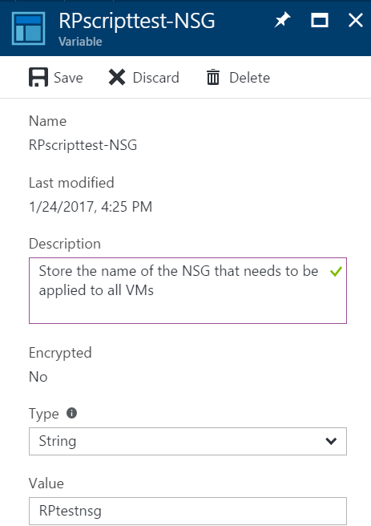
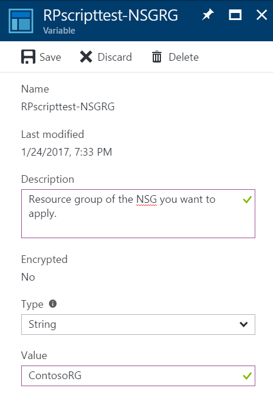
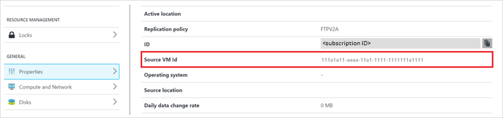

---
title: Add Azure Automation runbooks to Site Recovery recovery plans
description: Learn how to extend recovery plans with Azure Automation for disaster recovery using Azure Site Recovery.
author: rajani-janaki-ram
manager: gauravd
ms.service: site-recovery
ms.topic: conceptual
ms.date: 09/18/2019
ms.author: rajanaki
---

# Add Azure Automation runbooks to recovery plans

This article describes how to integrate Azure Automation runbooks, to extend [Azure Site Recovery](site-recovery-overview.md) recovery plans. We show you how to automate basic tasks that would otherwise need manual intervention, and how to convert a multi-step recovery into a single-click action.

## Recovery plans 

You can use recovery plans when you fail over on-premises machines, or Azure VMs. Recovery plans help you to define a systematic recovery process that defines how machines fail over, and how they start and recover after failover. 

Recovery large apps can be complex. Recovery plans help impose order so that recovery is consistently accurate, repeatable, and automated. You can automate tasks within a recovery plan using scripts, as well as Azure Automation runbooks. Typical examples might be configuring settings on an Azure VM after failover, or reconfiguring an app that's running on the VM.

- [Learn more](recovery-plan-overview.md) about recovery plans.
- [Learn more](../automation/automation-runbook-types.md) about Azure Automation runbooks.


## Runbooks in recovery plans

You add an Azure Automation account and runbooks to a recovery plan. The runbook is invoked when the recovery plan runs.

- The Automation account can be in any Azure region, and must be in the same subscription as the Site Recovery vault. 
- A runbook can run in a recovery plan during failover from a primary location to secondary, or during failback from the secondary location to the primary.
- Runbooks in a recovery plan run serially, one after another, in the set order.
- If runbooks in a recovery plan configure VMs to start in different groups, the recovery plan will continue only when Azure reports all VMs as running.
- Recovery plans continue to run, even if a script fails.

### Recovery plan context

When a script runs, it injects a recovery plan context to the runbook. The context contains the variables summarized in the table.

| **Variable name** | **Description** |
| --- | --- |
| RecoveryPlanName |Recovery plan name. Used in actions based on the name. |
| FailoverType |Specifies whether it's a test or production failover. 
| FailoverDirection | Specifies whether recovery is to a primary or secondary location. |
| GroupID |Identifies the group number in the recovery plan when the plan is running. |
| VmMap |An array of all VMs in the group. |
| VMMap key |A unique key (GUID) for each VM. |
| SubscriptionId |The Azure subscription ID in which the VM was created. |
| ResourceGroupName | Name of the resource group in which the VM is located.
| CloudServiceName |The Azure cloud service name under which the VM was created. |
| RoleName |The name of the Azure VM. |
| RecoveryPointId|The timestamp for the VM recovery. |

>[!Note]
>The value for variable 'FailoverDirection' will be 'PrimaryToSecondary' in case of failover and 'SecondaryToPrimary' in case of failback.

The following example shows a context variable:

```
{"RecoveryPlanName":"hrweb-recovery",
"FailoverType":"Test",
"FailoverDirection":"PrimaryToSecondary",
"GroupId":"1",
"VmMap":{"7a1069c6-c1d6-49c5-8c5d-33bfce8dd183":
	{ "SubscriptionId":"7a1111111-c1d6-49c5-8c5d-111ce8dd183",
	"ResourceGroupName":"ContosoRG",
	"CloudServiceName":"pod02hrweb-Chicago-test",
	"RoleName":"Fabrikam-Hrweb-frontend-test",
	"RecoveryPointId":"TimeStamp"}
	}
}
```

If you want to access all VMs in VMMap in a loop, you can use the following code:

```
$VMinfo = $RecoveryPlanContext.VmMap | Get-Member | Where-Object MemberType -EQ NoteProperty | select -ExpandProperty Name
$vmMap = $RecoveryPlanContext.VmMap
    foreach($VMID in $VMinfo)
    {
        $VM = $vmMap.$VMID                
            if( !(($VM -eq $Null) -Or ($VM.ResourceGroupName -eq $Null) -Or ($VM.RoleName -eq $Null))) {
            #this check is to ensure that we skip when some data is not available else it will fail
    Write-output "Resource group name ", $VM.ResourceGroupName
    Write-output "Rolename " = $VM.RoleName
            }
        }
```


Aman Sharma's blog over at [Harvesting Clouds](http://harvestingclouds.com) has a useful example of a [recovery plan context script](http://harvestingclouds.com/post/script-sample-azure-automation-runbook-for-asr-recovery-plan/).


## Before you start

- If you're new to Azure Automation, you can [sign up](https://azure.microsoft.com/services/automation/) and [download sample scripts](https://azure.microsoft.com/documentation/scripts/).
- Ensure that the Automation account has the following modules:
    - AzureRM.profile
    - AzureRM.Resources
    - AzureRM.Automation
    - AzureRM.Network
    - AzureRM.Compute

    All modules should be of compatible versions. The simplest way is to always use the latest versions of all modules.


## Customize the recovery plan

1. In the vault, select **Recovery Plans (Site Recovery)**
2. To create a recovery plan, click **+Recovery Plan**. [Learn more](site-recovery-create-recovery-plans.md). If you already have a recovery plan, then select to open it.
3. In the recovery plan page, click **Customize**.

    

2. Click the ellipses (...) next to **Group 1: Start** > **Add post action**.
3. In **Insert action**, verify that **Script** is selected, and specify a name for the script (**Hello World**).
4. Specify an automation account and select a runbook. To save the script, click **OK**. The script is added to **Group 1: Post-steps**.


## Reuse a runbook script

You can use a single runbook script in multiple recovery plans, by using external variables. 

- You use [Azure Automation variables](../automation/automation-variables.md) to store parameters for running a recovery plan.
- By adding the recovery plan name as a prefix to the variable, you can create individual variables for each recovery plan. Then, use the variables as parameters.
- You can change a parameter without changing the script, but still change the way the script works.

### Use a simple string variable in a runbook script

In this example, a script takes the input of a Network Security Group (NSG) and applies it to the VMs in a recovery plan. 

1. So that the script can detect which recovery plan is running, use this recovery plan context:

    ```
    workflow AddPublicIPAndNSG {
        param (
              [parameter(Mandatory=$false)]
              [Object]$RecoveryPlanContext
        )

        $RPName = $RecoveryPlanContext.RecoveryPlanName
    ```

2. Note the NSG name and resource group. You use these variables as inputs for recovery plan scripts. 
1. In the Automation account assets. create a variable to store the NSG name. Add a prefix to the variable name with the name of the recovery plan.

	

2. Create a variable to store the resource group name for the NSG resource. Add a prefix to the variable name with the name of the recovery plan.

	


3.	In the script, use this reference code to get the variable values:

	```
	$NSGValue = $RecoveryPlanContext.RecoveryPlanName + "-NSG"
	$NSGRGValue = $RecoveryPlanContext.RecoveryPlanName + "-NSGRG"

	$NSGnameVar = Get-AutomationVariable -Name $NSGValue
	$RGnameVar = Get-AutomationVariable -Name $NSGRGValue
	```

4.	Use the variables in the runbook to apply the NSG to the network interface of the failed-over VM:

	```
 	InlineScript {
 	if (($Using:NSGname -ne $Null) -And ($Using:NSGRGname -ne $Null)) {
			$NSG = Get-AzureRmNetworkSecurityGroup -Name $Using:NSGname -ResourceGroupName $Using:NSGRGname
			Write-output $NSG.Id
			#Apply the NSG to a network interface
			#$vnet = Get-AzureRmVirtualNetwork -ResourceGroupName TestRG -Name TestVNet
			#Set-AzureRmVirtualNetworkSubnetConfig -VirtualNetwork $vnet -Name FrontEnd `
			#  -AddressPrefix 192.168.1.0/24 -NetworkSecurityGroup $NSG
		}
	}
	```


For each recovery plan, create independent variables so that you can reuse the script. Add a prefix by using the recovery plan name. 

For a complete, end-to-end script for this scenario, review [this script](https://gallery.technet.microsoft.com/Add-Public-IP-and-NSG-to-a6bb8fee).


### Use a complex variable to store more information

In some scenarios you might not be able to create separate variables for each recovery plan. Consider a scenario in which you want a single script to assign a public IP address on specific VMs. In another scenario, you might want to apply different NSGs on different VMs (not on all VMs). Note that:

- You can make a script that's reusable for any recovery plan.
- Each recovery plan can have a variable number of VMs.
- For example, a SharePoint recovery has two front ends. A basic line-of-business (LOB) application has only one front end.
- In this scenario you can't create separate variables for each recovery plan.

In the following example, we create a [complex variable](https://docs.microsoft.com/powershell/module/servicemanagement/azure/set-azureautomationvariable) in the Azure Automation account.

We do this by specifying multiple values, using Azure PowerShell.

1. In PowerShell, sign in to your Azure subscription:

	```
	Connect-AzureRmAccount
	$sub = Get-AzureRmSubscription -Name <SubscriptionName>
	$sub | Select-AzureRmSubscription
	```

2. To store the parameters, create the complex variable using the name of the recovery plan:

	```
	$VMDetails = @{"VMGUID"=@{"ResourceGroupName"="RGNameOfNSG";"NSGName"="NameOfNSG"};"VMGUID2"=@{"ResourceGroupName"="RGNameOfNSG";"NSGName"="NameOfNSG"}}
		New-AzureRmAutomationVariable -ResourceGroupName <RG of Automation Account> -AutomationAccountName <AA Name> -Name <RecoveryPlanName> -Value $VMDetails -Encrypted $false
	```

3. In this complex variable, **VMDetails** is the VM ID for the protected VM. To get the VM ID, in the Azure portal, view the VM properties. The following screenshot shows a variable that stores the details of two VMs:

	

4. Use this variable in your runbook. If the indicated VM GUID is found in the recovery plan context, apply the NSG on the VM:

	```
	$VMDetailsObj = (Get-AutomationVariable -Name $RecoveryPlanContext.RecoveryPlanName).ToObject([hashtable])
	```

4. In your runbook, loop through the VMs of the recovery plan context. Check whether the VM exists in **$VMDetailsObj**. If it exists, access the properties of the variable to apply the NSG:

	```
		$VMinfo = $RecoveryPlanContext.VmMap | Get-Member | Where-Object MemberType -EQ NoteProperty | select -ExpandProperty Name
		$vmMap = $RecoveryPlanContext.VmMap

		foreach($VMID in $VMinfo) {
			$VMDetails = $VMDetailsObj[$VMID].ToObject([hashtable]);
			Write-output $VMDetails
			if ($VMDetails -ne $Null) { #If the VM exists in the context, this will not be Null
				$VM = $vmMap.$VMID
				# Access the properties of the variable
				$NSGname = $VMDetails.NSGName
				$NSGRGname = $VMDetails.NSGResourceGroupName

				# Add code to apply the NSG properties to the VM
			}
		}
	```

You can use the same script for different recovery plans. Enter different parameters by storing the value that corresponds to a recovery plan in different variables.

## Sample scripts

To deploy sample scripts to your Automation account, click the **Deploy to Azure** button.

[](https://aka.ms/asr-automationrunbooks-deploy)

This video provides another example. It demonstrates how to recover a two-tier WordPress application to Azure:


> [!VIDEO https://channel9.msdn.com/Series/Azure-Site-Recovery/One-click-failover-of-a-2-tier-WordPress-application-using-Azure-Site-Recovery/player]


## Next steps

- Learn about an [Azure Automation Run As account](../automation/automation-create-runas-account.md)
- Review [Azure Automation sample scripts](https://gallery.technet.microsoft.com/scriptcenter/site/search?f%5B0%5D.Type=User&f%5B0%5D.Value=SC%20Automation%20Product%20Team&f%5B0%5D.Text=SC%20Automation%20Product%20Team).
- [Learn more](site-recovery-failover.md) about running failovers.


