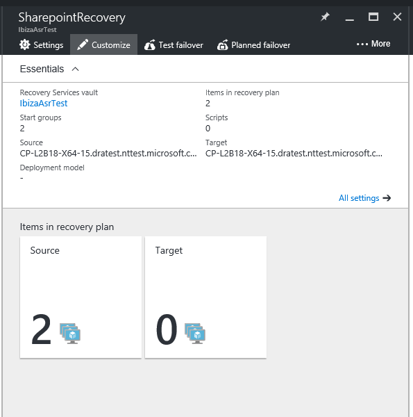
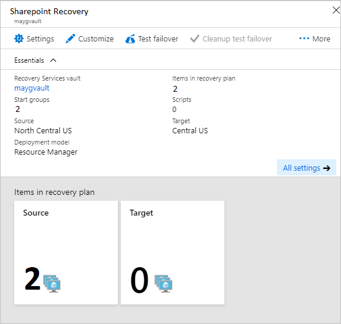
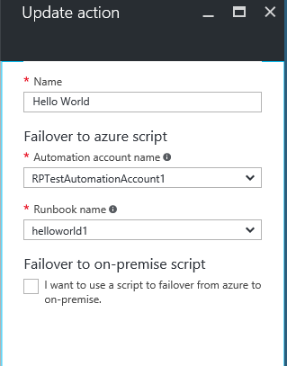

# Add Azure automation runbooks to recovery plans
This tutorial describes how Azure Site Recovery integrates with Azure
Automation to provide extensibility to recovery plans. Recovery plans
can orchestrate recovery of your virtual machines protected using Azure Site Recovery for both replication to secondary cloud and replication to Azure scenarios. They also help in making the recovery **consistently accurate**, **repeatable**, and **automated**. If you are failing over your virtual machines to Azure, integration with Azure Automation extends the
recovery plans and gives you capability to execute runbooks, thus allowing powerful automation tasks.

If you have not heard about Azure Automation yet, sign up
[here](https://azure.microsoft.com/services/automation/) and
download their sample scripts
[here](https://azure.microsoft.com/documentation/scripts/). Read
more about [Azure Site
Recovery](https://azure.microsoft.com/services/site-recovery/) and
how to orchestrate recovery to Azure using recovery plans
[here](https://azure.microsoft.com/blog/?p=166264).

In this tutorial, we look at how you can integrate Azure Automation
runbooks into recovery plans. We automate simple tasks that earlier
required manual intervention and see how to convert a multi-step
recovery into a single-click recovery action.

## Customize the recovery plan
1. Let us begin by operning the resource blade of the recovery plan. You can see the recovery plan has two virtual machines added to it for recovery.

    
- - -
1. Click the customize button to begin adding a runbook.

    


1. Right-click on the start group 1 and select to add a 'Add post action'.
2. Select to choose a script in the new blade.
3. Name the script 'Hello World'.
4. Choose an Automation Account name.
	>[!NOTE]
	> Automation account can be in any Azure geography but has to be in the same subscription as the Site Recovery vault.

5. Select a runbook from the Automation Account. This runbook is the script that will run during the execution of the recovery plan after the recovery of first group.

    
6. Select OK to save the script. Script is added to the post action group of Group 1: Start.

    


## Salient points of adding a script
1. You can right click the script and choose to 'delete step' or 'update script'.
2. A script can run on the Azure while failover from On-premises to Azure, and can run on Azure as a primary side script before shutdown, during failback from Azure to on-premises.
3. When a script runs, it injects a recovery plan context.

Following is an example of how the context variable looks.

        {"RecoveryPlanName":"hrweb-recovery",

        "FailoverType":"Test",

        "FailoverDirection":"PrimaryToSecondary",

        "GroupId":"1",

        "VmMap":{"7a1069c6-c1d6-49c5-8c5d-33bfce8dd183":

                { "SubscriptionId":"7a1111111-c1d6-49c5-8c5d-111ce8dd183",

				"ResourceGroupName":"ContosoRG",

				"CloudServiceName":"pod02hrweb-Chicago-test",

                "RoleName":"Fabrikam-Hrweb-frontend-test",

				"RecoveryPointId":"TimeStamp"}

                }

        }


The following table contains name and description for each variable in the context.

| **Variable name** | **Description** |
| --- | --- |
| RecoveryPlanName |Name of plan being run. This variable helps you to take different actions based on name and by reusing the script |
| FailoverType |Specifies whether the failover is test, planned, or unplanned. |
| FailoverDirection |Specify whether recovery is to primary or secondary |
| GroupID |Identify the group number within the recovery plan when the plan is running |
| VmMap |Array of all the virtual machines in the group |
| VMMap key |Unique key (GUID) for each VM. It's the same as the VMM ID of the virtual machine where applicable. |
| SubscriptionId |Azure Subscription ID in which the VM is created. |
| RoleName |Name of the Azure VM that's being recovered |
| CloudServiceName |Azure Cloud Service name under which the virtual machine is created. |
| ResourceGroupName|Azure Resource Group name under which the virtual machine is created. |
| RecoveryPointId|Timestamp to which the VM is recovered. |

You also need to ensure that the Automation Account has the following modules added. All the modules should be of compatible versions. An easy way is to make sure all modules are at the latest version available.
* AzureRM.profile
* AzureRM.Resources
* AzureRM.Automation
* AzureRM.Network
* AzureRM.Compute


### Accessing all VMs of the VmMap in a loop
Use the following snippet to loop across all VMs of the VmMap.

```
	$VMinfo = $RecoveryPlanContext.VmMap | Get-Member | Where-Object MemberType -EQ NoteProperty | select -ExpandProperty Name
	$vmMap = $RecoveryPlanContext.VmMap
	 foreach($VMID in $VMinfo)
	 {
	     $VM = $vmMap.$VMID                
             if( !(($VM -eq $Null) -Or ($VM.ResourceGroupName -eq $Null) -Or ($VM.RoleName -eq $Null))) {
	         #this check is to ensure that we skip when some data is not available else it will fail
		 Write-output "Resource group name ", $VM.ResourceGroupName
		 Write-output "Rolename " = $VM.RoleName
	     }
	 }

```

> [!NOTE]
> The Resource Group name and the Role name values are empty when the script is a pre-action to a boot group. The values are populated only if the VM of that group succeeds in failover and the script is a post-action of the boot group.

## Using the same Automation runbook with multiple recovery plans

A single script can be used across multiple recovery plans by using external variables. You can use the [Azure Automation variables](../automation/automation-variables.md) to store parameters that you can pass for a recovery plan execution. By pre-fixing the variable with the name of the recovery plan, you can create individual variables for every recovery plan and use them as a parameter. You can change the parameter without changing the script and make the script work differently.

### Using simple string variables in runbook script

Consider script that takes the input of an NSG and applies it to the VMs of a recovery plan.

For the script to understand which recovery plan is executing, you can use the Recovery Plan Context.

```
	workflow AddPublicIPAndNSG {
	    param (
	          [parameter(Mandatory=$false)]
	          [Object]$RecoveryPlanContext
	    )

	    $RPName = $RecoveryPlanContext.RecoveryPlanName
```

To apply an existing NSG, you need the NSG name and the NSG resource group. We provide these variables as an input for the recovery plan scripts. To do this, create two variables in the Automation accounts assets and prefix it with the name of the recovery plan for which you are creating the parameters.

1. Create a variable to store the NSG name. Prefix it with the name of the recovery plan.
	

2. Create a variable to store the NSG's RG name. Prefix it with the name of the recovery plan.
	


In the script, acquire the variables' values by using the following reference code:

```
	$NSGValue = $RecoveryPlanContext.RecoveryPlanName + "-NSG"
	$NSGRGValue = $RecoveryPlanContext.RecoveryPlanName + "-NSGRG"

	$NSGnameVar = Get-AutomationVariable -Name $NSGValue
	$RGnameVar = Get-AutomationVariable -Name $NSGRGValue
```

Next you can use the variables in the runbook and apply the NSG to the Network Interface of the failed over virtual machine.

```
	 InlineScript {
	 	if (($Using:NSGname -ne $Null) -And ($Using:NSGRGname -ne $Null)) {
			$NSG = Get-AzureRmNetworkSecurityGroup -Name $Using:NSGname -ResourceGroupName $Using:NSGRGname
			Write-output $NSG.Id
			#Apply the NSG to a network interface
			#$vnet = Get-AzureRmVirtualNetwork -ResourceGroupName TestRG -Name TestVNet
			#Set-AzureRmVirtualNetworkSubnetConfig -VirtualNetwork $vnet -Name FrontEnd `
			#  -AddressPrefix 192.168.1.0/24 -NetworkSecurityGroup $NSG
		}
	}
```

For each recovery plan, create independent variables so that you can reuse the script and prefix it wih the recovery plan name. A complete end to end script for this example is [given here](https://gallery.technet.microsoft.com/Add-Public-IP-and-NSG-to-a6bb8fee).


### Using complex variable to store more information

Consider a scenario where you want just one script to turn on a public IP on specific VMs Another example would be to apply different NSGs on different virtual machines (not all). This script should be reusable for any other recovery plan. Each recovery plan can have variable number of virtual machines (example, a sharepoint recovery has two front ends, a simple LOB application has only one front end). To achieve this result, it is impossible to create separate variables per recovery plan. Here we use a new technique and create a [complex variable](https://msdn.microsoft.com/library/dn913767.aspx?f=255&MSPPError=-2147217396) in the Azure Automation account assets, by specifying multiple values. You need the Azure powershell to execute the following steps.

1. On the Azure powershell login to your subscription.

	```
		login-azurermaccount
		$sub = Get-AzureRmSubscription -Name <SubscriptionName>
		$sub | Select-AzureRmSubscription
	```

2. To store the parameters, create the complex variable with the same name as the recovery plan.

	```
		$VMDetails = @{"VMGUID"=@{"ResourceGroupName"="RGNameOfNSG";"NSGName"="NameOfNSG"};"VMGUID2"=@{"ResourceGroupName"="RGNameOfNSG";"NSGName"="NameOfNSG"}}
	    New-AzureRmAutomationVariable -ResourceGroupName <RG of Automation Account> -AutomationAccountName <AA Name> -Name <RecoveryPlanName> -Value $VMDetails -Encrypted $false
	```

	In this complex variable, **VMDetails* is the VM ID for the protected virtual machine. You can find this in the properties of the virtual machine on the portal. Here we have created a variable to store the details of two virtual machines.

	

3. Use this variable in your runbook and apply the NSG on the virtual machine if any of the given VMGUID is found in the recovery plan context.

	```
		$VMDetailsObj = Get-AutomationVariable -Name $RecoveryPlanContext.RecoveryPlanName
	```

4. In your runbook, loop through the VMs of the recovery plan context and check if the VM also exists in **$VMDetailsObj**. If it exists, apply the NSG by accessing the properties of the variable.
	```
		$VMinfo = $RecoveryPlanContext.VmMap | Get-Member | Where-Object MemberType -EQ NoteProperty | select -ExpandProperty Name
		$vmMap = $RecoveryPlanContext.VmMap

		foreach($VMID in $VMinfo) {
			Write-output $VMDetailsObj.value.$VMID

			if ($VMDetailsObj.value.$VMID -ne $Null) { #If the VM exists in the context, this will not b Null
				$VM = $vmMap.$VMID
				# Access the properties of the variable
				$NSGname = $VMDetailsObj.value.$VMID.'NSGName'
				$NSGRGname = $VMDetailsObj.value.$VMID.'NSGResourceGroupName'

				# Add code to apply the NSG properties to the VM
			}
		}
	```

You can use the same script with different recovery plans and provide different parameters by storing the value corresponding to different recovery plans in different variable.

## Sample scripts
Deploy sample scripts into your Automation account using the Deploy to Azure button below.

[](https://aka.ms/asr-automationrunbooks-deploy)

Also view a quick video about recovering a two tier WordPress application to Azure.

> [!VIDEO https://channel9.msdn.com/Series/Azure-Site-Recovery/One-click-failover-of-a-2-tier-WordPress-application-using-Azure-Site-Recovery/player]


## Additional Resources
[Azure Automation Service Run as Account](../automation/automation-sec-configure-azure-runas-account.md)

[Azure Automation Overview](http://msdn.microsoft.com/library/azure/dn643629.aspx "Azure Automation Overview")

[Sample Azure Automation Scripts](http://gallery.technet.microsoft.com/scriptcenter/site/search?f\[0\].Type=User&f\[0\].Value=SC%20Automation%20Product%20Team&f\[0\].Text=SC%20Automation%20Product%20Team "Sample Azure Automation Scripts")
