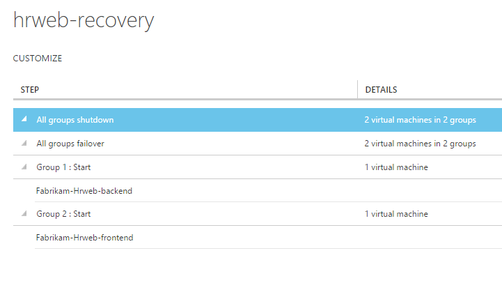
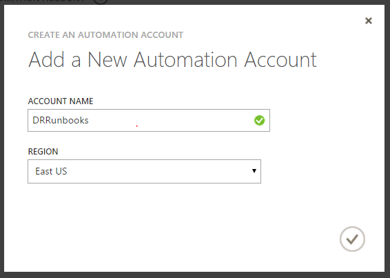
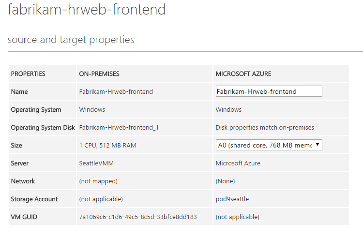
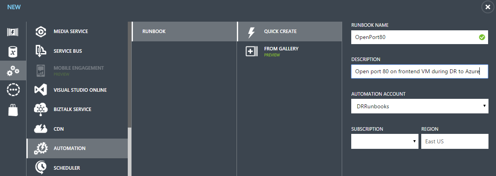
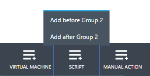
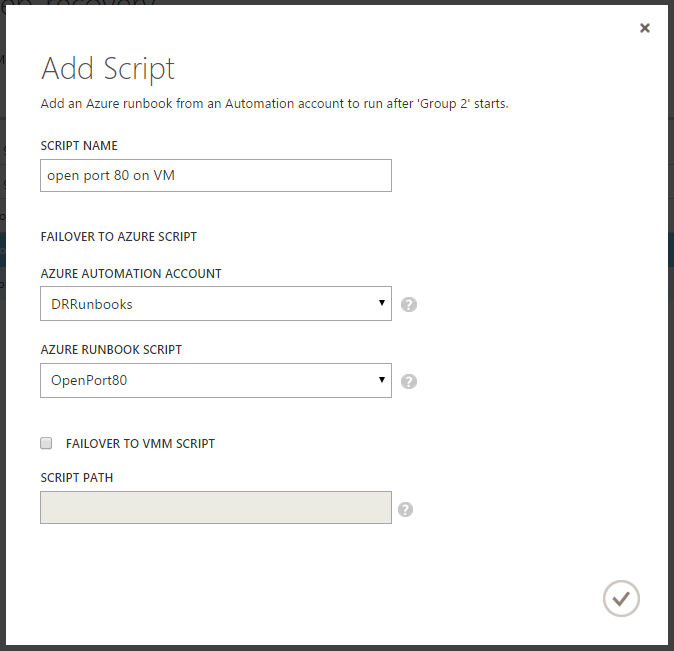
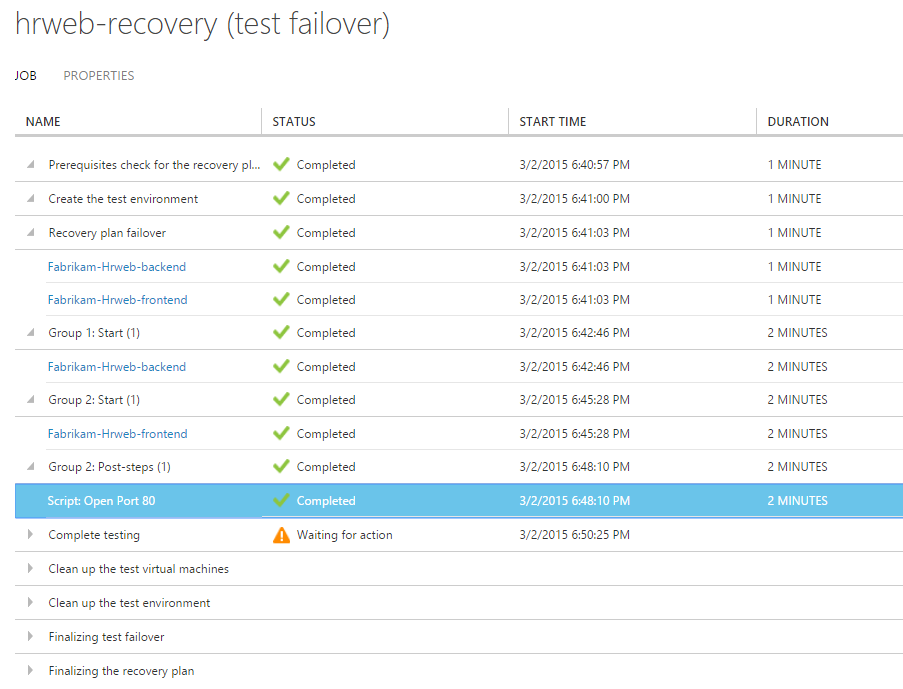
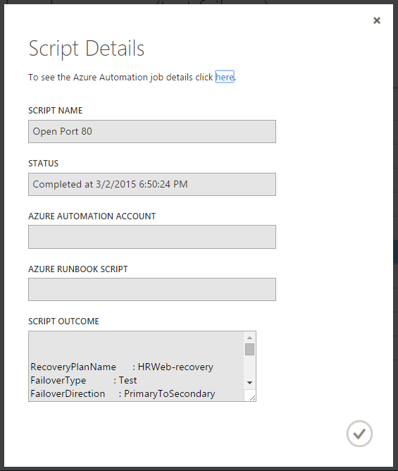

<properties 
   pageTitle="Add Azure automation runbooks to recovery plans" 
   description="This article describes how Azure Site Recovery now enables you to extend recovery plans using Azure Automation to complete complex tasks during recovery to Azure" 
   services="site-recovery" 
   documentationCenter="" 
   authors="ruturaj" 
   manager="mkjain" 
   editor=""/>

<tags
   ms.service="site-recovery"
   ms.devlang="powershell"
   ms.tgt_pltfrm="na"
   ms.topic="article"
   ms.workload="required" 
   ms.date="08/05/2015"
   ms.author="ruturajd@microsoft.com"/>

  
   

# Add Azure automation runbooks to recovery plans


This tutorial describes how Azure Site Recovery integrates with Azure
Automation to provide extensibility to recovery plans. Recovery plans
can orchestrate recovery of your virtual machines protected using Azure Site Recovery for both replication to secondary cloud and replication to Azure scenarios. They also help in making the recovery **consistently accurate**, **repeatable**, and **automated**. If you are failing over your virtual machines to Azure, integration with Azure Automation extends the
recovery plans and gives you capability to execute runbooks, thus allowing powerful automation tasks.

If you have not heard about Azure Automation yet, sign up
[here](http://azure.microsoft.com/services/automation/) and
download their sample scripts
[here](http://azure.microsoft.com/documentation/scripts/). Read
more about [Azure Site
Recovery](http://azure.microsoft.com/services/site-recovery/) and
how to orchestrate recovery to Azure using recovery plans
[here](http://azure.microsoft.com/blog/?p=166264).

In this tutorial, we will look at how you can integrate Azure Automation
runbooks into recovery plans. We will automate simple tasks that earlier
required manual intervention and see how to convert a multi-step
recovery into a single-click recovery action. We will also look at how you
can troubleshoot a simple script if it goes wrong.

## Protect the application to Azure

Let us begin with a simple application consisting of two virtual machines. Here, we have a HRweb application of Fabrikam. Fabrikam-HRweb-frontend and Fabrikam-Hrweb-backend are the two virtual machines protected to Azure using Azure Site Recovery. To protect the virtual machines using Azure Site Recovery, follow the steps below. 

1.  Enable protection for your virtual machines.

2.  Ensure that the virtual machines have completed initial replication
    and are replicating. 

3.  Wait till the initial replication completes and the Replication status says Protected.


---------------------

In this tutorial, we will create a recovery plan for the Fabrikam HRweb application to failover the application to Azure. Then we will integrate it with a runbook that will create an endpoint on the failed over Azure virtual machine to serve web pages at port 80.

First, let's create a recovery plan for our application.

## Create the recovery plan

To recover the application to Azure, you need to create a recovery plan.
Using a recovery plan you can specify the order of recovery of the
virtual machines. The virtual machine placed in group 1 will recover and
start first, and then the virtual machine in group 2 will follow.

Create a Recovery Plan that looks like below.



To read more about recovery plans, read documentation [here](https://msdn.microsoft.com/library/azure/dn788799.aspx "here"). 

Next, let's create the necessary artifacts in Azure Automation.

## Create the automation account and its assets

You need an Azure Automation account to create runbooks. If you do not
already have an account, navigate to Azure Automation tab denoted by
and create a new account.

1.  Give the account a name to identify with.

2.  Specify a geographical region where you want to place the account.

It is recommended to place the account in the same region as the ASR vault.



Next, create the following assets in the Account.

### Add a subscription name as asset

1.  Add a new setting  in the Azure Automation Assets and select to 

2.  Select the variable type as **String**

3.  Specify variable name as **AzureSubscriptionName**

    

4.  Specify your actual Azure Subscription name as the variable value.

	

You can identify the name of your subscription from the settings page of
your account on the Azure portal. 

### Add an Azure login credential as asset

Azure Automation uses Azure PowerShell to connect to the
subscription and operates on the artifacts there. For this, you need to
authenticate using your Microsoft account or a work or school account.
You can store the account credentials in an asset to be used securely by
the runbook.

1.  Add a new setting  in the Azure Automation Assets and select 

2.  Select the Credential type as **Windows PowerShell Credential**

3.  Specify the name as **AzureCredential**

    

4.  Specify the username and password to sign-in with.

Now both these settings are available in your assets.


More information about how to connect to your subscription via
powershell is given
[here](../install-configure-powershell.md).

Next, you will create a runbook in Azure Automation that can add an
endpoint for the front-end virtual machine after failover.

## Azure automation context

ASR passes a context variable to the runbook to help you write
deterministic scripts. One could argue that the names of the Cloud Service and the Virtual Machine are predictable, but happens that it is not always the case owing to certain scenarios such as the one where the name of the virtual machine name might have changed due to unsupported characters in Azure. Hence this information is passed to the ASR recovery plan as part of the *context*.

Below is an example of how the context variable looks. 

        {"RecoveryPlanName":"hrweb-recovery",

        "FailoverType":"Test",

        "FailoverDirection":"PrimaryToSecondary",

        "GroupId":"1",

        "VmMap":{"7a1069c6-c1d6-49c5-8c5d-33bfce8dd183":

                {"CloudServiceName":"pod02hrweb-Chicago-test",

                "RoleName":"Fabrikam-Hrweb-frontend-test"}

                }

        }


The table below contains name and description for each variable in the context.

**Variable name** | **Description**
---|---
RecoveryPlanName | Name of plan being run. Helps you take action based on name using the same script
FailoverType | Specifies whether the failover is test, planned, or unplanned. 
FailoverDirection | Specify whether recovery is to primary or secondary
GroupID | Identify the group number within the recovery plan when the plan is running
VmMap | Array of all the virtual machines in the group
VMMap key | Unique key (GUID) for each VM. It's the same as the VMM ID of the virtual machine where applicable. 
RoleName | Name of the Azure VM that's being recovered
CloudServiceName | Azure Cloud Service name under which the virtual machine is created.


To identify the VmMap Key in the context you could also go to the VM properties page in ASR and look at the VM GUID property.



## Author an Automation runbook

Now create the runbook to open port 80 on the front-end virtual machine.

1.  Create a new runbook in the Azure Automation account with the name
    **OpenPort80**



2.  Navigate to the Author view of the runbook and enter the draft mode.

3.  First specify the variable to use as the recovery plan context

```
	param (
		[Object]$RecoveryPlanContext
	)

```
  

4.  Next connect to the subscription using the credential and
    subscription name

```
	$Cred = Get-AutomationPSCredential -Name 'AzureCredential'
	
	# Connect to Azure
	$AzureAccount = Add-AzureAccount -Credential $Cred
	$AzureSubscriptionName = Get-AutomationVariable –Name ‘AzureSubscriptionName’
	Select-AzureSubscription -SubscriptionName $AzureSubscriptionName
```

> Note that you use the Azure assets – **AzureCredential** and **AzureSubscriptionName** here.

5.  Now specify the endpoint details and the GUID of the virtual machine for which you want to expose the endpoint, in this case the front-end virtual machine.

```
	# Specify the parameters to be used by the script
	$AEProtocol = "TCP"
	$AELocalPort = 80
	$AEPublicPort = 80
	$AEName = "Port 80 for HTTP"
	$VMGUID = "7a1069c6-c1d6-49c5-8c5d-33bfce8dd183"
```

This specifies the Azure endpoint protocol, local port on the VM and its mapped public port. These variables are parameters required by the Azure commands that add endpoints to VMs. The VMGUID holds the GUID of the virtual machine you need to operate on. 

6.  The script will now extract the context for the given VM GUID and
    create an endpoint on the virtual machine referenced by it.

```
	#Read the VM GUID from the context
	$VM = $RecoveryPlanContext.VmMap.$VMGUID

	if ($VM -ne $null)
	{
		# Invoke pipeline commands within an InlineScript

		$EndpointStatus = InlineScript {
			# Invoke the necessary pipeline commands to add a Azure Endpoint to a specified Virtual Machine
			# This set of commands includes: Get-AzureVM | Add-AzureEndpoint | Update-AzureVM (including necessary parameters)

			$Status = Get-AzureVM -ServiceName $Using:VM.CloudServiceName -Name $Using:VM.RoleName | `
				Add-AzureEndpoint -Name $Using:AEName -Protocol $Using:AEProtocol -PublicPort $Using:AEPublicPort -LocalPort $Using:AELocalPort | `
				Update-AzureVM
			Write-Output $Status
		}
	}
```

7. Once this is complete, hit Publish  to allow your script to be available for execution. 

The complete script is given below for your reference

```
  workflow OpenPort80
  {
	param (
		[Object]$RecoveryPlanContext
	)

	$Cred = Get-AutomationPSCredential -Name 'AzureCredential'
	
	# Connect to Azure
	$AzureAccount = Add-AzureAccount -Credential $Cred
	$AzureSubscriptionName = Get-AutomationVariable –Name ‘AzureSubscriptionName’
	Select-AzureSubscription -SubscriptionName $AzureSubscriptionName

	# Specify the parameters to be used by the script
	$AEProtocol = "TCP"
	$AELocalPort = 80
	$AEPublicPort = 80
	$AEName = "Port 80 for HTTP"
	$VMGUID = "7a1069c6-c1d6-49c5-8c5d-33bfce8dd183"
	
	#Read the VM GUID from the context
	$VM = $RecoveryPlanContext.VmMap.$VMGUID

	if ($VM -ne $null)
	{
		# Invoke pipeline commands within an InlineScript

		$EndpointStatus = InlineScript {
			# Invoke the necessary pipeline commands to add an Azure Endpoint to a specified Virtual Machine
			# This set of commands includes: Get-AzureVM | Add-AzureEndpoint | Update-AzureVM (including necessary parameters)

			$Status = Get-AzureVM -ServiceName $Using:VM.CloudServiceName -Name $Using:VM.RoleName | `
				Add-AzureEndpoint -Name $Using:AEName -Protocol $Using:AEProtocol -PublicPort $Using:AEPublicPort -LocalPort $Using:AELocalPort | `
				Update-AzureVM
			Write-Output $Status
		}
	}
  }
```

## Add the script to the recovery plan

Once the script is ready, you can add it to the recovery plan that you created earlier.

1.  In the recovery plan you created, choose to add a script after the
    group 2. 

2.  Specify a script name. This is just a friendly name for this script for showing within the Recovery plan.

3.  In the failover to Azure script – Select the Azure Automation
    Account name.

4.  In the Azure Runbooks, select the runbook you authored.



## Primary side scripts

When you are executing a failover to Azure, you can also choose to execute primary side scripts. These scripts will run on the VMM server during failover. 
Primary side scripts are only available only for pre-shutdown and post shutdown stages. This is because we expect the primary site to be typically unavailable when a disaster strikes.
During an unplanned failover, only if you opt in for primary site operations, it will attempt to run the primary side scripts. If they are not reachable or timeout, the failover will continue to recover the virtual machines.
Primary side scripts are un-available for VMware/Physical/Hyper-v Sites without VMM protected to Azure - while you failover to Azure.
However, when you failback from Azure to on-premises, priamry side scripts (Runbooks) can be used for all targets except VMware.

## Test the recovery plan

Once you have added the runbook to the plan you can initiate a test
failover and see it in action. It is always recommended to run a test
failover to test your application and the recovery plan to ensure that
there are no errors.

1.  Select the recovery plan and initiate a test failover.

2.  During the plan execution, you can see whether the runbook has
    executed or not via its status.

    

3.  You can also see the detailed runbook execution status on
    the Azure Automation jobs page for the runbook.

    

4.  After the failover completes, apart from the runbook execution result, you can see whether the execution is successful or not by visiting the Azure virtual machine page and looking at the endpoints. 


## Sample scripts

While we walked through automating one commonly used task of adding an endpoint to an Azure virtual machine in this tutorial, you could do a number of other powerful automation tasks using Azure automation. Microsoft and the Azure Automation community provide sample runbooks which can help you get started creating your own solutions, and utility runbooks, which you can use as building blocks for larger automation tasks. Start using them from the gallery and build  powerful one-click recovery plans for your applications using Azure Site Recovery.

## Additional Resources

[Azure Automation Overview](http://msdn.microsoft.com/library/azure/dn643629.aspx "Azure Automation Overview")

[Sample Azure Automation Scripts](http://gallery.technet.microsoft.com/scriptcenter/site/search?f[0].Type=User&f[0].Value=SC%20Automation%20Product%20Team&f[0].Text=SC%20Automation%20Product%20Team "Sample Azure Automation Scripts")

 
