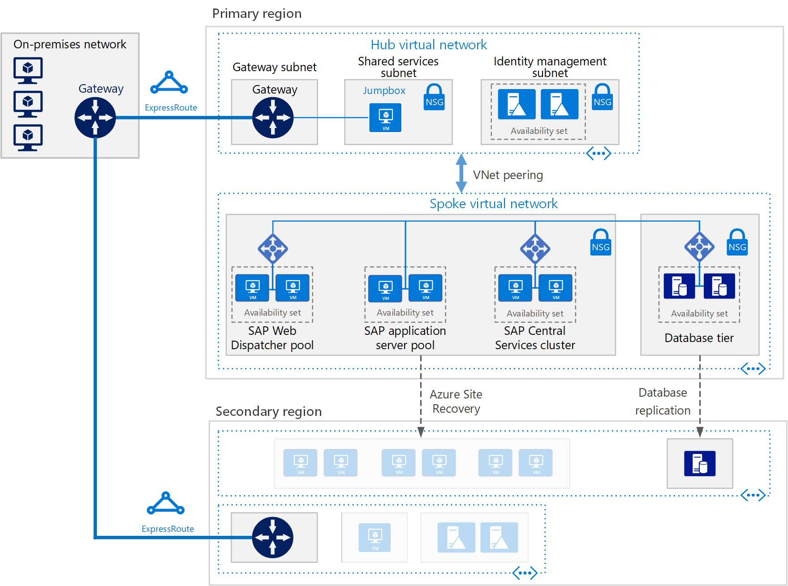
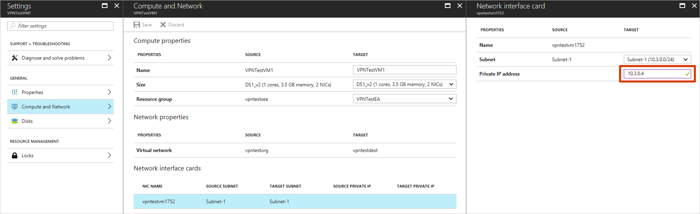

# Set up disaster recovery for a multi-tier SAP NetWeaver app deployment

Most large-size and medium-size SAP deployments use some form of disaster recovery solution. The importance of robust and testable disaster recovery solutions has increased as more core business processes are moved to applications like SAP. Azure Site Recovery has been tested and integrated with SAP applications. Site Recovery exceeds the capabilities of most on-premises disaster recovery solutions, and at a lower total cost of ownership than competing solutions.

With Site Recovery, you can:
* Enable protection of SAP NetWeaver and non-NetWeaver production applications that run on-premises by replicating components to Azure.
* Enable protection of SAP NetWeaver and non-NetWeaver production applications that run on Azure by replicating components to another Azure datacenter.
* Simplify cloud migration by using Site Recovery to migrate your SAP deployment to Azure.
* Simplify SAP project upgrades, testing, and prototyping by creating a production clone on-demand for testing SAP applications.

You can protect SAP NetWeaver application deployments by using [Azure Site Recovery](site-recovery-overview.md). This article covers best practices for protecting a three-tier SAP NetWeaver deployment on Azure when you replicate to another Azure datacenter by using Site Recovery. The article describes supported scenarios and configurations, and how to do test failovers (disaster recovery drills) and actual failovers.

## Prerequisites

Before you begin, ensure that you know how to do the following tasks:

* [Replicate a virtual machine to Azure](./azure-to-azure-tutorial-enable-replication.md)
* [Design a recovery network](./azure-to-azure-about-networking.md)
* [Do a test failover to Azure](./azure-to-azure-tutorial-dr-drill.md)
* [Do a failover to Azure](site-recovery-failover.md)
* [Replicate a domain controller](site-recovery-active-directory.md)
* [Replicate a SQL Server instance](site-recovery-sql.md)

## Supported scenarios

You can use Site Recovery to implement a disaster recovery solution in the following scenarios:
* You have SAP systems running in one Azure datacenter, and you're replicating them to another Azure datacenter (Azure-to-Azure disaster recovery). 
   For more information, see [Azure-to-Azure replication architecture](./azure-to-azure-architecture.md).
* You have SAP systems running on VMware (or physical) servers on-premises. You're also replicating the SAP systems to a disaster recovery site in an Azure datacenter (VMware-to-Azure disaster recovery). 
   This scenario requires some additional components. For more information, see [VMware-to-Azure replication architecture](./vmware-azure-architecture.md).
* You have SAP systems running on Hyper-V on-premises. You're also replicating the SAP systems to a disaster recovery site in an Azure datacenter (Hyper-V-to-Azure disaster recovery).
   This scenario requires some additional components. For more information, see [Hyper-V-to-Azure replication architecture](./hyper-v-azure-architecture.md).

In this article, we use an **Azure-to-Azure** disaster recovery scenario. The scenario shows you the SAP disaster recovery capabilities of Site Recovery. Because Site Recovery replication isn't application-specific, the process that's described is expected to also apply to other scenarios.

### Required foundation services
In the scenario we discuss in this article, the following foundation services are deployed:
* Azure ExpressRoute or Azure VPN Gateway
* At least one Microsoft Entra domain controller and DNS server, running in Azure

We recommend that you establish this infrastructure before you deploy Site Recovery.

## Reference SAP application deployment

This reference architecture is running SAP NetWeaver in a Windows environment on Azure with high availability. This architecture is deployed with specific virtual machine (VM) sizes that you can change to accommodate your organization’s needs.

## Disaster recovery considerations

For disaster recovery, you must be able to fail over to a secondary region. Each tier uses a different strategy to provide disaster recovery protection.

#### VMs running SAP Web Dispatcher pools

The Web Dispatcher component works as a load balancer for SAP traffic among the SAP application servers. To achieve high availability for the Web Dispatcher component, Azure Load Balancer implements the parallel Web Dispatcher setup. Web Dispatcher uses a round-robin configuration for HTTP(S) traffic distribution among the available Web Dispatchers in the balancers pool.

#### VMs running application servers pools
The SMLG transaction manages login groups for ABAP application servers. It uses the load-balancing function within the message server of the Central Services to distribute workload among SAP application server pools for SAPGUIs and RFC traffic. You can replicate this management by using Site Recovery.

#### VMs running SAP Central Services clusters
This reference architecture runs Central Services on VMs in the application tier. Central Services is a potential single point of failure when in a single VM. Typical deployment and high availability aren't requirements.

To implement a high availability solution, you can use either a shared disk cluster or a file share cluster. To configure VMs for a shared disk cluster, use Windows Server Failover Cluster. We recommend that you use the cloud witness as a quorum witness.

 > [!NOTE]
 > Because Site Recovery does not replicate the cloud witness, we recommend that you deploy the cloud witness in the disaster recovery region.

To support the failover cluster environment, [SIOS DataKeeper Cluster Edition](https://azuremarketplace.microsoft.com/marketplace/apps/sios_datakeeper.sios-datakeeper-8) does the cluster shared volume function. In the function, SIOS DataKeeper Cluster replicates independent disks owned by the cluster nodes. 

You can also handle clustering by implementing a file share cluster. [SAP](https://blogs.sap.com/2018/03/19/migration-from-a-shared-disk-cluster-to-a-file-share-cluster) recently modified the Central Services deployment pattern to access the /sapmnt global directories via a UNC path. We still recommend you ensure that the /sapmnt UNC share is highly available. You can check your Central Services instance. Use Windows Server Failover Cluster with Scale Out File Server (SOFS) and the Storage Spaces Direct (S2D) feature in Windows Server 2016.

 > [!NOTE]
 > Site Recovery currently supports only crash-consistent point replication of virtual machines that use storage spaces direct and the passive node of SIOS Datakeeper.

## More disaster recovery considerations

You can use Site Recovery to orchestrate the failover of full SAP deployment across Azure regions.
Following are the steps for setting up the disaster recovery:

1. Replicate virtual machines
1. Design a recovery network
1. Replicate a domain controller
1. Replicate data base tier
1. Do a test failover
1. Do a failover

Following is the recommendation for disaster recovery of each tier used in this example.

 **SAP tiers** | **Recommendation**
 --- | ---
**SAP Web Dispatcher pool** |  Replicate by using Site Recovery 
**SAP Application server pool** |  Replicate by using Site Recovery 
**SAP Central Services cluster** |  Replicate by using Site Recovery 
**Active directory virtual machines** |  Use Active directory replication 
**SQL Database servers** |  Use SQL Server Always On replication

## Replicate virtual machines

To start replicating all the SAP application virtual machines to the Azure disaster recovery datacenter, follow the guidance in [Replicate a virtual machine to Azure](./azure-to-azure-tutorial-enable-replication.md).

* For guidance on protecting Active Directory and DNS, learn [how to protect Active Directory and DNS](site-recovery-active-directory.md).

* For guidance on protecting database tier running on SQL Server, learn [how to protect SQL Server](site-recovery-sql.md).

## Networking configuration

If you use a static IP address, you can specify the IP address that you want the virtual machine to take. To set the IP address, go to  **Network settings** > **Network interface card**.

## Create a recovery plan

A recovery plan supports the sequencing of various tiers in a multi-tier application during a failover. Sequencing helps maintain application consistency. When you create a recovery plan for a multi-tier web application, complete the steps described in [Create a recovery plan by using Site Recovery](site-recovery-create-recovery-plans.md).

### Add virtual machines to failover groups

1. Create a recovery plan by adding the application server, web dispatcher, and SAP Central services VMs.
1. Select **Customize** to group the VMs. By default, all VMs are part of Group 1.

### Add scripts to the recovery plan
For your applications to function correctly, you might need to do some operations on the Azure virtual machines. Do these operations after the failover or during a test failover. You can also automate some post-failover operations. For example, update the DNS entry, and change bindings and connections by adding corresponding scripts to the recovery plan.

You can deploy the most used Site Recovery scripts into your Azure Automation account by selecting **Deploy to Azure**. When you use any published script, follow the guidance in the script.

1. Add a pre-action script to Group 1 to fail over the SQL Server availability group. Use the ASR-SQL-FailoverAG script published in the sample scripts. Follow the guidance in the script and make the required changes in the script appropriately.
1. Add a post-action script to attach a load balancer onto the failed-over virtual machines of the Web tier (Group 1). Use the ASR-AddSingleLoadBalancer script published in the sample scripts. Follow the guidance in the script and make the required changes in the script as needed.

## Run a test failover

1. In the Azure portal, select your Recovery Services vault.
1. Select the recovery plan that you created for SAP applications.
1. Select **Test Failover**.
1. To start the test failover process, select the recovery point and the Azure virtual network.
1. When the secondary environment is up, perform validations.
1. When validations are complete, clean the failover environment by selecting **Cleanup test failover**.

For more information, see [Test failover to Azure in Site Recovery](site-recovery-test-failover-to-azure.md).

## Run a failover

1. In the Azure portal, select your Recovery Services vault.
1. Select the recovery plan that you created for SAP applications.
1. Select **Failover**.
1. To start the failover process, select the recovery point.

For more information, see [Failover in Site Recovery](site-recovery-failover.md).

## Next steps
* Learn more about building a disaster recovery solution for SAP NetWeaver deployments by using Site Recovery. See the downloadable white paper [SAP NetWeaver: Building a Disaster Recovery Solution with Site Recovery](/samples/browse/?redirectedfrom=TechNet-Gallery). The white paper discusses recommendations for various SAP architectures. You can see supported applications and VM types for SAP on Azure. There are also plan options for testing your disaster recovery solution.
* Learn more about [replicating other workloads](site-recovery-workload.md) by using Site Recovery.
