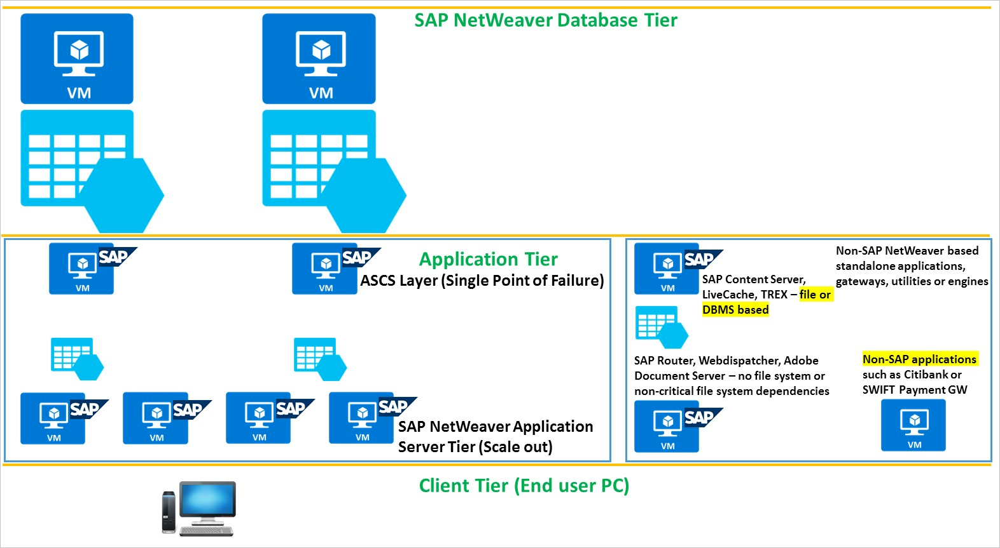
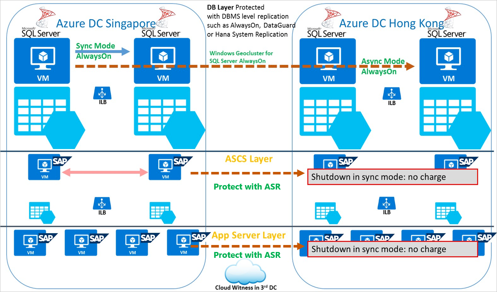

# Protect a multi-tier SAP NetWeaver application deployment using Azure Site Recovery

Most large and medium-sized SAP deployments have some form of Disaster Recovery solution.  The importance of robust and testable Disaster Recovery solutions has increased as more core business processes are moved to applications such as SAP.  Azure Site Recovery has been tested and integrated with SAP applications, and exceeds the capabilities of most on-premises Disaster Recovery solutions, at a lower total cost of ownership (TCO) than competing solutions.
With Azure Site Recovery you can:
* Enable protection of SAP NetWeaver and non-NetWeaver Production applications running on-premises, by replicating components to Azure.
* Enable protection of SAP NetWeaver and non-NetWeaver Production applications running Azure, by replicating components to another Azure datacenter.
* Simplify cloud migration, by using Site Recovery to migrate your SAP deployment to Azure.
* Simplify SAP project upgrades, testing, and prototyping, by creating a production clone on-demand for testing SAP applications.

This article describes how to protect SAP NetWeaver application deployments using [Azure Site Recovery](site-recovery-overview.md). This article covers the best practices for protecting a three-tier SAP NetWeaver deployment on Azure by replicating to another Azure datacenter using Azure Site Recovery, the supported scenarios and configurations, and how to perform failovers, both test failovers (disaster recovery drills) and actual failovers.

## Prerequisites
Before you start, make sure you understand the following:

1. [Replicating a virtual machine to Azure](azure-to-azure-walkthrough-enable-replication.md)
2. How to [design a recovery network](site-recovery-azure-to-azure-networking-guidance.md)
3. [Doing a test failover to Azure](azure-to-azure-walkthrough-test-failover.md)
4. [Doing a failover to Azure](site-recovery-failover.md)
5. How to [replicate a domain controller](site-recovery-active-directory.md)
6. How to [replicate SQL Server](site-recovery-sql.md)

## Supported scenarios
With Azure Site Recovery you can implement a disaster recovery solution for the following scenarios:
* SAP systems running in one Azure datacenter replicating to another Azure datacenter (Azure-to-Azure DR), as architected [here](https://aka.ms/asr-a2a-architecture).
* SAP systems running on VMWare (or Physical) servers on-premises replicating to a DR site in an Azure datacenter (VMware-to-Azure DR), which requires some additional components as architected [here](https://aka.ms/asr-v2a-architecture).
* SAP systems running on Hyper-V on-premises replicating to a DR site in an Azure datacenter (Hyper-V-to-Azure DR), which requires some additional components as architected [here](https://aka.ms/asr-h2a-architecture).

This document uses the first case - Azure-to-Azure DR - to demonstrate Azure Site Recovery's SAP disaster recovery capabilities. As Azure Site Recovery replication is application agnostic, the process described is expected to hold for other scenarios as well.

### Required foundation services
This documentation scenario all been deployed with the following foundation services deployed:
* ExpressRoute or Site-to-Site Virtual Private Network (VPN)
* At least one Active Directory Domain Controller and DNS server running in Azure

It is recommended that the infrastructure above is established prior to deploying Azure Site Recovery.

## Typical SAP application deployment
Large SAP customers usually deploy between 6 to 20 individual SAP applications.  Most of these applications are based on the SAP NetWeaver ABAP or Java engines.  Supporting these core NetWeaver applications are many smaller specific non-NetWeaver SAP standalone engines and typically some non-SAP applications.  

It is critical to inventory all the SAP applications running in a landscape and to determine the deployment mode (either 2-tier or 3-tier), versions, patches, sizes, churn rates, and disk persistence requirements.

The SAP Database persistence layer should be protected via the native DBMS tools such as SQL Server AlwaysOn, Oracle DataGuard, or HANA System Replication. The client layer is also not protected by Azure Site Recovery, but it is important to consider topics that impact this layer such as DNS Propagation delay, security and remote access to the DR datacenter.

Azure Site Recovery is the recommended solution for the application layer, including (A)SCS. Other applications such as non-NetWeaver SAP applications and non-SAP applications form part of the overall SAP deployment environment and should also be protected with Azure Site Recovery.

## Replicate virtual machines
Follow [this guidance](azure-to-azure-walkthrough-enable-replication.md) to start replicating all the SAP application virtual machines to the Azure DR datacenter.

If you are using a static IP, you can specify the IP that you want the virtual machine to take in the Network interface cards section in Compute and Network settings.

## Creating a recovery plan
A recovery plan allows sequencing the failover of various tiers in a multi-tier application, hence, maintaining application consistency. Follow the steps described [here](site-recovery-create-recovery-plans.md) while creating a recovery plan for a multi-tier web application.

### Adding scripts to the recovery plan
You may need to do some operations on the Azure virtual machines post failover/test failover for your applications to function correctly. You can automate the post failover operation such as updating DNS entry, and changing bindings and connections, by adding corresponding scripts in the recovery plan as described in [this article](site-recovery-create-recovery-plans.md#add-scripts).

### DNS update
If the DNS is configured for dynamic DNS update, then virtual machines usually update the DNS with the new IP once they start. If you want to add an explicit step to update DNS with the new IPs of the virtual machines then add this [script to update IP in DNS](https://aka.ms/asr-dns-update) as a post action on recovery plan groups.  

## Example Azure-to-Azure deployment
In the diagram below the Azure Site Recovery Azure-to-Azure DR scenario is depicted:
* The Primary Datacenter is in Singapore (Azure South-East Asia) and the DR datacenter is Hong Kong (Azure East Asia).  In this scenario, local High Availability is provided by having two VMs running SQL Server AlwaysOn in Synchronous mode in Singapore.
* The File Share ASCS can be used to provide HA for the SAP single points of failure. File Share ASCS does not require a cluster shared disk, and applications such as SIOS are not required.
* DR protection for the DBMS layer is achieved using Asynchronous replication.
* This scenario shows “symmetrical DR” – a term used to describe a DR solution that is an exact replica of production, therefore the DR SQL Server solution has local High Availability. The use of symmetrical DR is not mandatory for the Database layer, and many customers leverage the flexibility of cloud deployments to build a local High Availability Node quickly after a DR event.
* The diagram depicts the SAP NetWeaver ASCS and Application server layer replicated by Azure Site Recovery.

## Doing a test failover
Follow [this guidance](azure-to-azure-walkthrough-test-failover.md) to do a test failover.

1.	Go to Azure portal and select your Recovery Services vault.
2.	Click on the recovery plan created for SAP applications(s).
3.	Click on 'Test Failover'.
4.	Select recovery point and Azure virtual network to start the test failover process.
5.	Once the secondary environment is up, you can perform your validations.
6.	Once the validations are complete, click on ‘Cleanup test failover’ and to clean the failover environment.

## Doing a failover
Follow [this guidance](site-recovery-failover.md) when you are doing a failover.

1.	Go to Azure portal and select your Recovery Services vault.
2.	Click on the recovery plan created for SAP application(s).
3.	Click on 'Failover'.
4.	Select recovery point to start the failover process.

## Next steps
Learn more about building a disaster recovery solution for SAP NetWeaver deployments using Azure Site Recovery in [this whitepaper](http://aka.ms/asr-sap). The whitepaper also discusses recommendations for different SAP architectures, lists supported applications and VM types for SAP on Azure, and describes possible testing plans for your disaster recovery solution.

Learn more about [replicating other workloads](site-recovery-workload.md) using Site Recovery.
