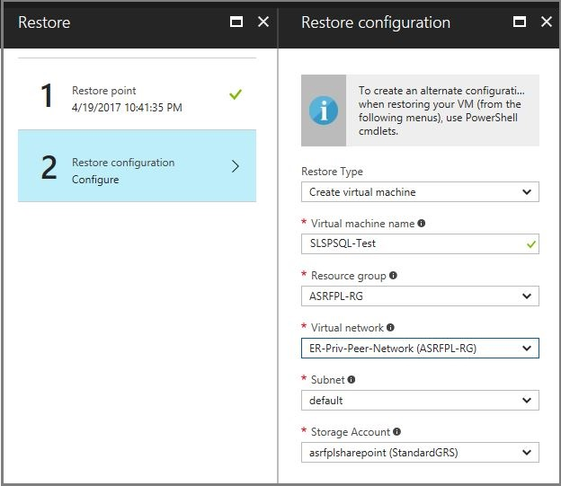
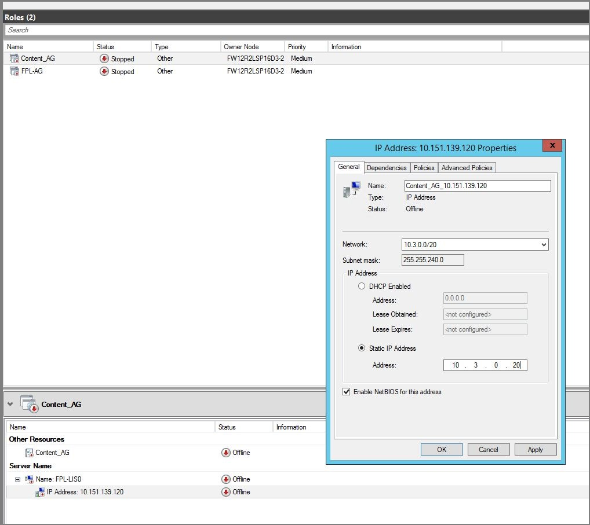
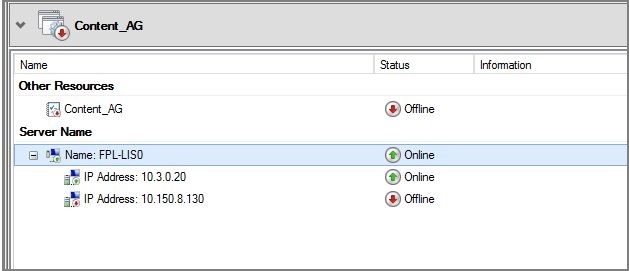
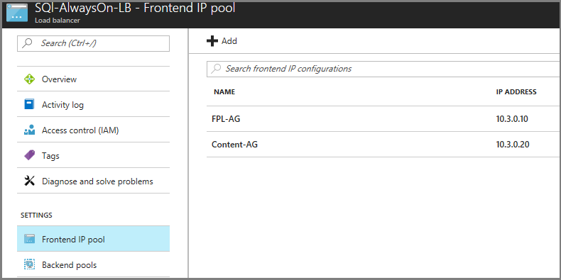
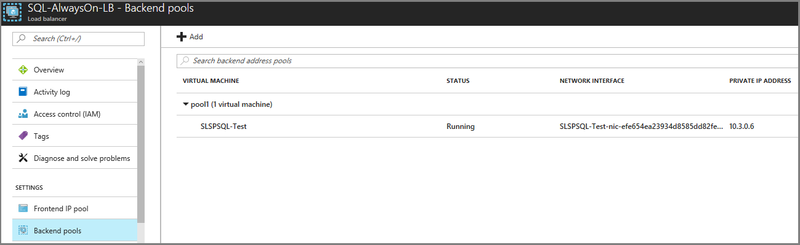

# Set up disaster recovery for SQL Server

This article describes how to help protect the SQL Server back end of an application. You do so by using a combination of SQL Server business continuity and disaster recovery (BCDR) technologies and [Azure Site Recovery](site-recovery-overview.md).

Before you start, make sure you understand SQL Server disaster recovery capabilities. These capabilities include:

* Failover clustering
* Always On availability groups
* Database mirroring
* Log shipping
* Active geo-replication
* Auto-failover groups

## Combining BCDR technologies with Site Recovery

Your choice of a BCDR technology to recover SQL Server instances should be based on your recovery time objective (RTO) and recovery point objective (RPO) needs as described in the following table. Combine Site Recovery with the failover operation of your chosen technology to orchestrate recovery of your entire application.

Deployment type | BCDR technology | Expected RTO for SQL Server | Expected RPO for SQL Server |
--- | --- | --- | ---
SQL Server on an Azure infrastructure as a service (IaaS) virtual machine (VM) or at on-premises.| [Always On availability group](/sql/database-engine/availability-groups/windows/overview-of-always-on-availability-groups-sql-server) | The time taken to make the secondary replica as primary. | Because replication to the secondary replica is asynchronous, there's some data loss.
SQL Server on an Azure IaaS VM or at on-premises.| [Failover clustering (Always On FCI)](/sql/sql-server/failover-clusters/windows/windows-server-failover-clustering-wsfc-with-sql-server) | The time taken to fail over between the nodes. | Because Always On FCI uses shared storage, the same view of the storage instance is available on failover.
SQL Server on an Azure IaaS VM or at on-premises.| [Database mirroring (high-performance mode)](/sql/database-engine/database-mirroring/database-mirroring-sql-server) | The time taken to force the service, which uses the mirror server as a warm standby server. | Replication is asynchronous. The mirror database might lag somewhat behind the principal database. The lag is typically small. But it can become large if the principal or mirror server's system is under a heavy load.  Log shipping can be a supplement to database mirroring. It's a favorable alternative to asynchronous database mirroring.
SQL as platform as a service (PaaS) on Azure.  This deployment type includes single databases and elastic pools. | Active geo-replication | 30 seconds after failover is triggered.  When failover is activated for one of the secondary databases, all other secondaries are automatically linked to the new primary. | RPO of five seconds.  Active geo-replication uses the Always On technology of SQL Server. It asynchronously replicates committed transactions on the primary database to a secondary database by using snapshot isolation.  The secondary data is guaranteed to never have partial transactions.
SQL as PaaS configured with active geo-replication on Azure.  This deployment type includes a managed instances, elastic pools, and single databases. | Auto-failover groups | RTO of one hour. | RPO of five seconds.  Auto-failover groups provide the group semantics on top of active geo-replication. But the same asynchronous replication mechanism is used.
SQL Server on an Azure IaaS VM or at on-premises.| Replication with Azure Site Recovery | RTO is typically less than 15 minutes. To learn more, read the [RTO SLA provided by Site Recovery](https://azure.microsoft.com/support/legal/sla/site-recovery/v1_2/). | One hour for application consistency and five minutes for crash consistency. If you are looking for lower RPO, use other BCDR technologies.

> [!NOTE]
> A few important considerations when you're helping to protect SQL workloads with Site Recovery:
> * Site Recovery is application agnostic. Site Recovery can help protect any version of SQL Server that is deployed on a supported operating system. To learn more, see the [support matrix for recovery](vmware-physical-azure-support-matrix.md#replicated-machines) of replicated machines.
> * You can choose to use Site Recovery for any deployment at Azure, Hyper-V, VMware, or physical infrastructure. Please follow the guidance at the end of this article on [how to help protect a SQL Server cluster](#how-to-help-protect-a-sql-server-cluster) with Site Recovery.
> * Ensure that the data change rate observed on the machine is within [Site Recovery limits](vmware-physical-azure-support-matrix.md#churn-limits). The change rate is measured in write bytes per second. For machines running Windows, you can view this change rate by selecting the **Performance** tab in Task Manager. Observe the write speed for each disk.
> * Site Recovery supports replication of Failover Cluster Instances on Storage Spaces Direct. To learn more, see [how to enable Storage Spaces Direct replication](azure-to-azure-how-to-enable-replication-s2d-vms.md).
> 
> When you migrate your SQL Workload to Azure, it is recommended to apply the [Performance guidelines for SQL Server on Azure Virtual Machines](/azure/azure-sql/virtual-machines/windows/performance-guidelines-best-practices-checklist).

## Disaster recovery of an application

Site Recovery orchestrates the test failover and the failover of your entire application with the help of recovery plans.

There are some prerequisites to ensure your recovery plan is fully customized according to your need. Any SQL Server deployment typically needs an Active Directory deployment. It also needs connectivity for your application tier.

### Step 1: Set up Active Directory

Set up Active Directory in the secondary recovery site for SQL Server to run properly.

* **Small enterprise**: You have a few applications and a single domain controller for the on-premises site. If you want to fail over the entire site, use Site Recovery replication. This service replicates the domain controller to the secondary datacenter or to Azure.
* **Medium to large enterprise**: You might need to set up additional domain controllers.
  - If you have a large number of applications, have an Active Directory forest, and want to fail over by application or workload, set up another domain controller in the secondary datacenter or in Azure.
  -  If you're using Always On availability groups to recover to a remote site, set up another domain controller on the secondary site or in Azure. This domain controller is used for the recovered SQL Server instance.

The instructions in this article assume that a domain controller is available in the secondary location. To learn more, see the procedures for [helping to protect Active Directory with Site Recovery](site-recovery-active-directory.md).

### Step 2: Ensure connectivity with other tiers

After the database tier is running in the target Azure region, ensure that you have connectivity with the application and web tiers. Take the necessary steps in advance to validate connectivity with test failover.

To understand how you can design applications for connectivity considerations, see these examples:

* [Design an application for cloud disaster recovery](/azure/azure-sql/database/designing-cloud-solutions-for-disaster-recovery)
* [Elastic pool Disaster Recovery strategies](/azure/azure-sql/database/disaster-recovery-strategies-for-applications-with-elastic-pool)

### Step 3: Interoperate with Always On, active geo-replication, and auto-failover groups

BCDR technologies Always On, active geo-replication, and auto-failover groups have secondary replicas of SQL Server running in the target Azure region. The first step for your application failover is to specify this replica as primary. This step assumes you already have a domain controller in the secondary. The step may not be necessary if you choose to do an auto-failover. Fail over your web and application tiers only after the database failover is completed.

> [!NOTE]
> If you have helped to protect the SQL machines with Site Recovery, you just need to create a recovery group of these machines and add their failover in the recovery plan.

[Create a recovery plan](site-recovery-create-recovery-plans.md) with application and web tier virtual machines. The following steps show how to add failover of the database tier:

1. Import the scripts to fail over SQL Availability Group in both a [Resource Manager virtual machine](https://raw.githubusercontent.com/Azure/azure-quickstart-templates/master/demos/asr-automation-recovery/scripts/ASR-SQL-FailoverAG.ps1) and a [classic virtual machine](https://raw.githubusercontent.com/Azure/azure-quickstart-templates/master/demos/asr-automation-recovery/scripts/ASR-SQL-FailoverAGClassic.ps1). Import the scripts into your Azure Automation account.

    

1. Add the ASR-SQL-FailoverAG script as a pre-action of the first group of the recovery plan.

1. Follow the instructions available in the script to create an automation variable. This variable provides the name of the availability groups.

### Step 4: Conduct a test failover

Some BCDR technologies such as SQL Always On don't natively support test failover. We recommend the following approach *only when using such technologies*.

1. Set up [Azure Backup](../backup/backup-azure-vms-first-look-arm.md) on the VM that hosts the availability group replica in Azure.

1. Before triggering test failover of the recovery plan, recover the VM from the backup taken in the previous step.

    

1. [Force a quorum](/sql/sql-server/failover-clusters/windows/force-a-wsfc-cluster-to-start-without-a-quorum#PowerShellProcedure) in the VM that was restored from backup.

1. Update the IP address of the listener to be an address available in the test failover network.

    

1. Bring the listener online.

    

1. Ensure that the load balancer in the failover network has one IP address, from the front-end IP address pool that corresponding to each availability group listener, and with the SQL Server VM in the back-end pool.

     

    

1. In later recovery groups, add failover of your application tier followed by your web tier for this recovery plan.

1. Do a test failover of the recovery plan to test end-to-end failover of your application.

## Steps to do a failover

After you add the script in Step 3 and validate it in Step 4, you can do a failover of the recovery plan created in Step 3.

The failover steps for application and web tiers should be the same in both test failover and failover recovery plans.

## How to help protect a SQL Server cluster

For a cluster running SQL Server Standard edition or SQL Server 2008 R2, we recommend you use Site Recovery replication to help protect SQL Server.

### Azure to Azure and On-premises to Azure

Site Recovery doesn't provide guest cluster support when replicating to an Azure region. SQL Server Standard edition also doesn't provide a low-cost disaster recovery solution. In this scenario, we recommend you protect the SQL Server cluster to a standalone SQL Server instance in the primary location and recover it in the secondary.

1. Configure another standalone SQL Server instance on the primary Azure region or at on-premises site.

1. Configure the instance to serve as a mirror for the databases you want to help protect. Configure mirroring in high-safety mode.

1. Configure Site Recovery on the primary site for [Azure](azure-to-azure-tutorial-enable-replication.md), [Hyper-V](./hyper-v-azure-tutorial.md), or [VMware VMs and physical servers](./vmware-azure-tutorial.md).

1. Use Site Recovery replication to replicate the new SQL Server instance to the secondary site. As it's a high-safety mirror copy, it is synchronized with the primary cluster but replicated using Site Recovery replication.

   

### Failback considerations

For SQL Server Standard clusters, failback after an unplanned failover requires a SQL Server backup and restore. This operation is done from the mirror instance to the original cluster with re-establishment of the mirror.

## Frequently asked questions

### How does SQL Server get licensed when used with Site Recovery?

Site Recovery replication for SQL Server is covered under the Software Assurance disaster recovery benefit. This coverage applies to all Site Recovery scenarios: on-premises to Azure disaster recovery and cross-region Azure IaaS disaster recovery. See [Azure Site Recovery pricing](https://azure.microsoft.com/pricing/details/site-recovery/) for more.

### Will Site Recovery support my SQL Server version?

Site Recovery is application agnostic. Site Recovery can help protect any version of SQL Server that is deployed on a supported operating system. For more, see the [support matrix for recovery](vmware-physical-azure-support-matrix.md#replicated-machines) of replicated machines.

### Does ASR Work with SQL Transactional Replication?

Due to ASR using file-level copy, SQL cannot guarantee that the servers in an associated SQL replication topology are in sync at the time of ASR failover. This may cause the logreader and/or distribution agents to fail due to LSN mismatch, which can break replication. If you failover the publisher, distributor, or subscriber in a replication topology, you need to rebuild replication. It is recommended to [reinitialize the subscription to SQL Server](https://learn.microsoft.com/sql/relational-databases/replication/reinitialize-a-subscription?view=sql-server-ver16).

## Next steps

- Learn more about [Site Recovery architecture](./azure-to-azure-architecture.md).
- For SQL Server in Azure, learn more about [high availability solutions](/azure/azure-sql/virtual-machines/windows/business-continuity-high-availability-disaster-recovery-hadr-overview#azure-only-high-availability-solutions) for recovery in a secondary Azure region.
- For SQL Database, learn more about the [business continuity](/azure/azure-sql/database/business-continuity-high-availability-disaster-recover-hadr-overview) and [high availability](/azure/azure-sql/database/high-availability-sla) options for recovery in a secondary Azure region.
- For SQL Server machines at on-premises, learn more about the [high availability options](/azure/azure-sql/virtual-machines/windows/business-continuity-high-availability-disaster-recovery-hadr-overview#hybrid-it-disaster-recovery-solutions) for recovery in Azure Virtual Machines.
