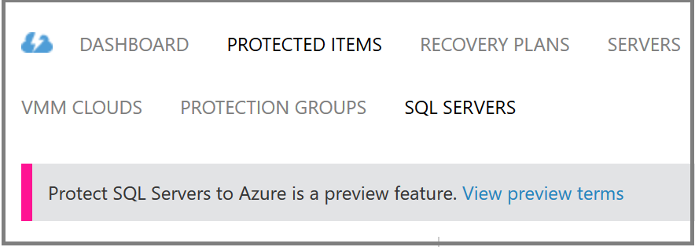

<properties 
	pageTitle="Disaster recovery with SQL Server and Azure Site Recovery | Microsoft Azure" 
	description="Azure Site Recovery coordinates the replication, failover and recovery of SQL Server to a secondary on-premises site or Azure." 
	services="site-recovery" 
	documentationCenter="" 
	authors="rayne-wiselman" 
	manager="jwhit" 
	editor="tysonn"/>

<tags 
	ms.service="site-recovery" 
	ms.workload="backup-recovery" 
	ms.tgt_pltfrm="na" 
	ms.devlang="na" 
	ms.topic="article" 
	ms.date="11/18/2015" 
	ms.author="raynew"/>

# Disaster recovery with SQL Server and Azure Site Recovery 

Site Recovery is an Azure service that contributes to your business continuity and disaster recovery (BCDR) strategy by orchestrating replication, failover and recovery of virtual machines and physical servers. Site Recovery supports a number of replication mechanisms to consistently protection, replicate and fail over of machines to Azure, or to a secondary datacenter. Get an overview of all the deployment scenarios in the [Azure Site Recovery overview](site-recovery-overview.md).

 This article describes how to protect the SQL Server backend of an application using a combination of SQL Server BCDR technologies and Site Recovery. You should have a good understanding of SQL Server BCDR features (failover clustering, AlwaysOn availability groups, database mirroring, log shipping) and Site Recovery before you deploy the scenarios described in this article.

## Overview

Many workloads use SQL Server as a foundation. Applications such as SharePoint, Dynamics, and SAP use SQL Server to implement data services. SQL Server high availability and disaster recovery features such as SQL Server availability groups are used to protect and recover SQL Server databases. Applications deploy SQL Server in following configurations

1. Stand-alone SQL Server: The SQL Server and all databases are hosted on a single machine (physical or a virtual machine). When virtualized, host clustering is used for local high availability (HA), there is no guest level HA implemented. 
2.	SQL Server Failover Clustering Instances (aka Always ON FCI): In this setup, 2 or more nodes of SQL server instances with shared disks are configured in a Windows Failover cluster. If any of the SQL Failover cluster instances is down, the cluster can failover the SQL to another instance. This setup is typically used for HA on the primary site. This does not protect against failure or outage in the shared storage layer. Shared disk can be implemented using ISCSI, Fiber Channel or Shared VHDx.
3.	SQL Always ON Availability Groups: In this setup, 2 nodes are setup in a shared nothing cluster with SQL databases configured in an availability group with synchronous replication and automatic failover.

SQL Server also provides native disaster recovery technologies in Enterprise editions for recovering databases to a remote site. Where applicable, we will leverage and integrate with the following native SQL disaster recovery technologies for building Azure Site Recovery based Disaster Recovery Plan

1. SQL Always On Availability Group from Disaster Recovery for SQL 2012 or 2014 Enterprise editions 
2.	SQL Database Mirroring in high safety mode for SQL server standard (any version) or SQL server 2008 R2

Site Recovery can protect SQL Server running on a Hyper-V virtual machine, a VMware virtual machine, or a physical server.

 |**On-premises to on-premises** | **On-premises to Azure** 
---|---|---
**Hyper-V** | Yes | Yes
**VMware** | Yes | Yes 
**Physical server** | Yes | Yes

## Support and integration

Following are the versions and editions of SQL Server that are applicable to this article:

- SQL Server 2014 Enterprise and Standard
- SQL Server 2012 Enterprise and Standard
- SQL Server 2008 R2 Enterprise and Standard

Site Recovery can be integrated with native SQL Server BCDR technologies summarized in the table below to provide a disaster recovery solution.

**Feature** |**Details** | **SQL Server version** 
---|---|---
**AlwaysOn availability group** | 
Multiple standalone instances of SQL Server each run in a failover cluster that has multiple nodes.
 
Databases can be grouped into failover groups that can be copied (mirrored) on SQL Server instances so that no shared storage is needed.
 
Provides disaster recovery between a primary site and one or more secondary sites. Two nodes can be set up in a shared nothing cluster with SQL Server databases configured in an availability group with synchronous replication and automatic failover.
 | SQL Server 2014/2012 Enterprise edition
**Failover clustering (AlwaysOn FCI)** | 
SQL Server leverages Windows failover clustering for high availability of on-premises SQL Server workloads.

Nodes running instances of SQL Server with shared disks are configured in a failover cluster. If an instance is down the cluster fails over to different one.
 
The cluster doesn't protect against failure or outages in shared storage. The shared disk can be implemented with iSCSI, fiber channel, or shared VHDXs.
 | SQL Server Enterprise editions
 
SQL Server Standard edition (limited to two nodes only)
**Database mirroring (high safety mode)** | Protects a single database to a single secondary copy. Available in both high safety (synchronous) and high performance (asynchronous) replication modes. Doesn’t require a failover cluster. | 
SQL Server 2008 R2

SQL Server Enterprise all editions

**Standalone SQL Server** | The SQL Server and database are hosted on a single server (physical or virtual). Host clustering is used for high availability if the server is virtual. No guest-level high availability. | Enterprise or Standard edition

The following table summarizes our recommendations for integrating SQL Server BCDR technologies into Site Recovery deployment.

**Version** |**Edition** | **Deployment** | **On-prem to on-prem** | **On-prem to Azure** 
---|---|---|---|---
SQL Server 2014 or 2012 | Enterprise | Failover cluster instance | AlwaysOn availability groups | AlwaysOn availability groups
 | Enterprise | AlwaysOn availability groups for high availability | AlwaysOn availability groups | AlwaysOn availability groups
 | Standard | Failover cluster instance (FCI) | Site Recovery replication with local mirror | Site Recovery replication with local mirror
 | Enterprise or Standard | Standalone | Site Recovery replication | Site Recovery replication 
SQL Server 2008 R2 | Enterprise or Standard | Failover cluster instance (FCI) | Site Recovery replication with local mirror | Site Recovery replication with local mirror
 | Enterprise or Standard | Standalone | Site Recovery replication | Site Recovery replication
SQL Server (Any version) | Enterprise or Standard | Failover cluster instance - DTC applicaiton | Site Recovery replication | Not Supported

## Deployment prerequisites

Here's what you need before you start:

- An on-premises SQL Server deployment running a supported SQL Server version. Typically you'll also need an Active Directory for your SQL server.
- The prerequisites for the scenario you want to deploy. Prerequisites can be found in each deployment article. These and listed and linked in the [Site Recovery Overview](site-recovery-overview.md).
- If you want to set up recovery in Azure, you'll need to run the [Azure Virtual Machine Readiness Assessment](http://www.microsoft.com/download/details.aspx?id=40898) tool on your SQL Server virtual machines to make sure they're compatible with Azure and Site Recovery.

## Set up protection of AD

You'll need Active Directory on the secondary recovery site for SQL Server to run properly. there are a couple of options:

- **Small enterprise**—If you have a small number of applications and a single domain controller for the on-premises site, and you want to fail over the entire site, we recommend that you use Site Recovery repication to replicate the domain controller to the secondary datacenter or to Azure.

- **Medium to large enterprise**—If you have a large number of application, you're running an Active Directory forest, and you want to fail over by application or workload, we recommend you set up an additional domain controller in the secondary datacenter or in Azure. Note that if you're using AlwaysOn availability groups to recover to a remote site we recommend you set up another additional domain controller on the secondary site or Azure, to use for the recovered SQL Server instance.

The instructions in this document presume that a domain controller is available in the secondary location.  You can refer to the AD DR solution guidance [here](http://aka.ms/asr-ad).

## Integration with SQL AlwaysOn to Azure

### On-premises to Azure

Azure Site Recovery (ASR) natively supports SQL AlwaysOn. If you have created a SQL Availability Group with an Azure virtual machine being setup as ‘Secondary’ then you can use ASR to manage the failover of the Availability Groups. 

This capability is currently in preview and available when the primary datacenter is managed by System Center Virtual Machine Manager (VMM). 

#### Environments managed by a VMM Server
If you go inside an ASR vault you should see a tab for SQL Servers under the tab Protected Items. 

Below are the steps to integrate SQL AlwaysOn with ASR.

##### Prerequisites
- An on-premises SQL Server on standalone server or a failover cluster 
- One or more Azure virtual machines with SQL Server installed
- SQL Availability Group setup between on-premises SQL Server and SQL Server running in Azure
- PowerShell remoting should be enabled on on-premises SQL Server. VMM Server should be able to make remote PowerShell calls to SQL Server
- On on-premises SQL Server a user account should be added in SQL user groups with at least following permissions
	- ALTER AVAILABILITY GROUP  - [reference 1](https://msdn.microsoft.com/en-us/library/hh231018.aspx), [reference 2](https://msdn.microsoft.com/en-us/library/ff878601.aspx#Anchor_3)
	- ALTER DATABASE - [reference 1](https://msdn.microsoft.com/en-us/library/ff877956.aspx#Security)
- A run as account should be created on VMM Server for the account in the previous step
- SQL PS module should be installed on SQL Servers running on-premises and on Azure virtual machines
- VM Agent should be installed virtual machines running on Azure
- NTAUTHORITY\System should have following permissions on SQL Server running on virtual machines in Azure
	- ALTER AVAILABILITY GROUP  - [reference 1](https://msdn.microsoft.com/en-us/library/hh231018.aspx), [reference 2](https://msdn.microsoft.com/en-us/library/ff878601.aspx#Anchor_3)
	- ALTER DATABASE - [reference 1](https://msdn.microsoft.com/en-us/library/ff877956.aspx#Security)

##### 1. Adding a SQL Server

Click on Add SQL to add a new SQL Server. 

Provide the details of the SQL Server, VMM and credentials to be used for managing the SQL Server.

###### Parameters
 - Name: Friendly name that you want to provide to refer to this SQL Server
 - SQL Server (FQDN): Fully qualified domain name (FQDN) of the source SQL Server that you want to add. In case the SQL Server is installed on a Failover Cluster, then provide FQDN of the cluster and not of any of the cluster nodes. 
 - SQL Server Instance: Choose Default SQL instance or provide name of the custom SQL instance.
 - VMM Server: Select one of the VMM Servers that has already been registered with Azure Site Recovery (ASR). ASR would use this VMM server to communicate with the SQL Server
 - RUN AS ACCOUNT: Provide name of one of the Run As Account that has been created on the VMM Server selected above. This Run As account would be used to access the SQL Server and should have Read and Failover Permissions on Availability Groups on the SQL Server. 

Once you add SQL Server it would show up under the SQL Servers tab. 

##### 2. Adding a SQL Availability Group

Once the SQL Server is added the next step is to add the Availability Groups to ASR. To do that, drill down inside the SQL Server added in previous step and click on Add SQL Availability Group. 

SQL Availability Group can be replicating to one or more virtual machines in Azure. When adding the sql availability group you are required to provide the name and subscription of the Azure virtual machine where you want the availability group to be failed over to by ASR.

In the above example Availability Group DB1-AG would become Primary on virtual machine SQLAGVM2 running inside subscription DevTesting2 on a failover. 

>[AZURE.NOTE] Only the Availability Groups that are Primary on the SQL Server added in step above are available to be added to ASR. If you have made an Availability Group Primary on the SQL Server or if you have added more Availability Groups on the SQL Server after it was added, refresh it using the Refresh option available on the SQL Server.

#### 3. Creating a Recovery Plan

The next step is to create a recovery plan using both virtual machines and the availability groups. 
Select the same VMM Server that you used in Step-1 as source and Microsoft Azure as target.

In the example the Sharepoint application consists of 3 virtual machines which use a SQL Availability Group as its backend. In this recovery plan we could select both the availability group as well the virtual machine that constitute the application. 

You can further customize the recovery plan by moving virtual machines to different failover groups to sequence the order of failover. Availability group is always failed over first as it would be used as a backend of any application. 

#### 4. Failover

Different failover options are available once an Availability Group has been added to a Recovery Plan.

##### Planned Failover

Planned Failover implies a no data loss failover. To achieve that SQL Availability Group’s Availability Mode is first set to Synchronous and then a failover is triggered to make the availability group Primary on to the virtual machine provided while adding the availability group to ASR. Once the failover is complete, Availability Mode is set to the same value as it was before the planned failover was triggered. 

##### Unplanned Failover

Unplanned Failover can result into data loss. While triggering unplanned failover the Availability mode of the Availability Group is not changed and the it is made primary on to the virtual machine provided while adding the availability group to ASR. Once unplanned failover is complete and the on-premises server running SQL Server is available again, Reverse Replication has to be triggered on the Availability Group. Note that this action is not available on the recovery plan and can be taken on SQL Availability Group under SQL Servers tab

##### Test Failover
Test failover for SQL Availability group is not supported. If you trigger Test Failover of a Recovery Plan containing SQL Availability Group, failover would be skipped for Availability Group.

Consider these options as an alternative:

###### Option 1

1. Perform a test failover of the application and front-end tiers.

2. Update the application tier to access the replica copy in read-only mode, and perform a read-only test of the application.

###### Option 2

1.	Create a copy of the replica SQL Server virtual machine instance (using VMM clone for site-to-site or Azure Backup) and bring it up in a test network
2.	Perform the test failover using the recovery plan.

#### Failback

If you want to make the Availability Group again Primary on the on-premises SQL Server then you can do so by triggering Planned Failover on the Recovery Plan and choosing the direction from Microsoft Azure to on-premises VMM Server

#### Reverse Replication

After an unplanned failover reverse replication has to be triggered on the Availability Group to resume the replication. Till this is done the replication remains suspended.

### Environments not managed by a VMM server

For the environments that are not managed by a VMM Server, Azure Automation Runbooks can be used to configure a scripted failover of SQL Availability Groups. Below are the steps to configure that:

1.	Create a local file for the script to fail over an availability group. This sample script specifies a path to the availability group on the Azure replica and fails it over to that replica instance. This script will be run on the SQL Server replica virtual machine by passing is with the custom script extension.

    	Param(
    	[string]$SQLAvailabilityGroupPath
    	)
    	import-module sqlps
    	Switch-SqlAvailabilityGroup -Path $SQLAvailabilityGroupPath -AllowDataLoss -force

2.	Upload the script to a blob in an Azure storage account. Use this example:

    	$context = New-AzureStorageContext -StorageAccountName "Account" -StorageAccountKey "Key"
    	Set-AzureStorageBlobContent -Blob "AGFailover.ps1" -Container "script-container" -File "ScriptLocalFilePath" -context $context

3.	Create an Azure automation runbook to invoke the scripts on the SQL Server replica virtual machine in Azure. Use this sample script to do this. [Learn more](site-recovery-runbook-automation.md) about using automation runbooks in recovery plans. 

    	workflow SQLAvailabilityGroupFailover
    	{
    		param (
        		[Object]$RecoveryPlanContext
    		)

    		$Cred = Get-AutomationPSCredential -name 'AzureCredential'
	
    		#Connect to Azure
    		$AzureAccount = Add-AzureAccount -Credential $Cred
    		$AzureSubscriptionName = Get-AutomationVariable –Name ‘AzureSubscriptionName’
    		Select-AzureSubscription -SubscriptionName $AzureSubscriptionName
    
    		InLineScript
    		{
     		#Update the script with name of your storage account, key and blob name
     		$context = New-AzureStorageContext -StorageAccountName "Account" -StorageAccountKey "Key";
     		$sasuri = New-AzureStorageBlobSASToken -Container "script-container"- Blob "AGFailover.ps1" -Permission r -FullUri -Context $context;
     
     		Write-output "failovertype " + $Using:RecoveryPlanContext.FailoverType;
               
     		if ($Using:RecoveryPlanContext.FailoverType -eq "Test")
       			{
           		#Skipping TFO in this version.
           		#We will update the script in a follow-up post with TFO support
           		Write-output "tfo: Skipping SQL Failover";
       			}
     		else
       			{
           		Write-output "pfo/ufo";
           		#Get the SQL Azure Replica VM.
           		#Update the script to use the name of your VM and Cloud Service
           		$VM = Get-AzureVM -Name "SQLAzureVM" -ServiceName "SQLAzureReplica";     
       
           		Write-Output "Installing custom script extension"
           		#Install the Custom Script Extension on teh SQL Replica VM
           		Set-AzureVMExtension -ExtensionName CustomScriptExtension -VM $VM -Publisher Microsoft.Compute -Version 1.3| Update-AzureVM; 
                    
           		Write-output "Starting AG Failover";
           		#Execute the SQL Failover script
           		#Pass the SQL AG path as the argument.
       
           		$AGArgs="-SQLAvailabilityGroupPath sqlserver:\sql\sqlazureVM\default\availabilitygroups\testag";
       
           		Set-AzureVMCustomScriptExtension -VM $VM -FileUri $sasuri -Run "AGFailover.ps1" -Argument $AGArgs | Update-AzureVM;
       
           		Write-output "Completed AG Failover";

       			}
        
    		}
    	}

4.	When you create a recovery plan for the application add a "pre-Group 1 boot" scripted step that invokes the automation runbook to fail over availability groups.

###On-premises to On-premises
If the SQL Server is using availability groups for high availability, or a failover cluster instance, we recommend using availability groups on the recovery site as well. Note that this guidance is for applications that don't use distributed transactions.

1. [Configure databases](https://msdn.microsoft.com/library/hh213078.aspx) into availability groups.
2. Create a new virtual network on secondary site.
3. Set up a site-to-site VPN between the new virtual network and the primary site.
4. Create a virtual machine on the recovery site and install SQL Server on it.
5. Extend the existing AlwaysOn availability groups to the new SQL Server virtual machine. Configure this SQL Server instance as an asynchronous replica copy.
6. Create an availability group listener, or update the existing listener to include the asynchronous replica virtual machine.
7. Make sure that the application farm is setup using the listener. If It's setup up using the database server name, please update it to use the listener so you don't need to reconfigure it after the failover.

For applications that use distributed transactions we recommendation you use [Site Recovery with SAN replication](site-recovery-vmm-san.md) or [VMWare site-to-site replication](site-recovery-vmware-to-vmware.md).

#### Recovery Plan Considerations

1. Add this sample script to the VMM library on the primary and secondary sites.

    	Param(
    	[string]$SQLAvailabilityGroupPath
    	)
    	import-module sqlps
    	Switch-SqlAvailabilityGroup -Path $SQLAvailabilityGroupPath -AllowDataLoss -force

2. When you create a recovery plan for the application add a "pre-Group 1 boot" scripted step that invokes the script to fail over availability groups.

## Setup Protection of a Standalone SQL Server

In this configuration we recommend you use Site Recovery replication to protect the SQL Server machine. The exact steps will depend whether SQL Server is set up as a virtual machine or physical server, and whether you want to replicate to Azure or a secondary on-premises site. Get instructions for all deployment scenarios in the [Site Recovery Overview](site-recovery-overview.md).

## Setup Protection of SQL Server Cluster (Standard or 2008 R2)

For a cluster running SQL Server Standard edition or SQL Server 2008 R2 we recommend you use Site Recovery replication to protect SQL Server.

#### On-premises to On-premises

- If the application's uses distributed transactions we recommend you deploy [Site Recovery with SAN replication](site-recovery-vmm-san.md) for a Hyper-V environment and [VMware to VMware](site-recovery-vmware-to-vmware.md) for VMware environment.

- For non-DTC applications, leverage the above approach to recover the cluster as a stand-alone server by leveraging a local high safety DB mirror.

#### On-premises to Azure

Site recovery doesn't support guest cluster support when replicating to Azure. SQL Server also doesn't provide a low-cost disaster recovery solution for Standard edition. We recommend you protect the on-premises SQL Server cluster to a standalone SQL Server and recover it in Azure.

1. Configure an additional standalone SQL Server instance on the on-premises site.
2. Configure this instance to serve as a mirror for the databases that need protection. Configure the mirroring in high safety mode.
3.	Configure Site Recovery on the on-premises site based on the environment ([Hyper-V](site-recovery-hyper-v-site-to-azure.md) or [VMware](site-recovery-vmware-to-azure.md).
4.	Use Site Recovery replication to replicate the new SQL Server instance to Azure. It's a high safety mirror copy and so it'll be synchronized with the primary cluster, but it'll be replicated to Azure using Site Recovery replication.

The following graphic illustrates this setup.

### Failback Considerations

For SQL standard clusters, failback after an unplanned failover will require a SQL backup and restore from the Mirror instance to the original cluster and re-establishing the mirror.

 