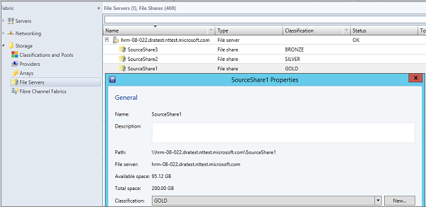

<properties
	pageTitle="Map storage in Azure Site Recovery for Hyper-V virtual machine replication between on-premises datacenters | Microsoft Azure"
	description="Prepare storage mapping for Hyper-V virtual machine replication between two on-premises datacenters with Azure Site Recovery."
	services="site-recovery"
	documentationCenter=""
	authors="rayne-wiselman"
	manager="jwhit"
	editor=""/>

<tags
	ms.service="site-recovery"
	ms.devlang="na"
	ms.topic="article"
	ms.tgt_pltfrm="na"
	ms.workload="storage-backup-recovery"
	ms.date="07/06/2016"
	ms.author="raynew"/>

# Prepare storage mapping for Hyper-V virtual machine replication between two on-premises datacenters with Azure Site Recovery

Azure Site Recovery contributes to your business continuity and disaster recovery (BCDR) strategy by orchestrating replication, failover, and recovery of virtual machines and physical servers. This article describes storage mapping, which helps you make optimal use of storage when you're using Site Recovery to replicate Hyper-V virtual machines between two on-premises VMM datacenters.

Post any comments or questions at the bottom of this article, or on the [Azure Recovery Services Forum](https://social.msdn.microsoft.com/forums/azure/home?forum=hypervrecovmgr).

## Overview

Storage mapping is only relevant when you're replicating Hyper-V virtual machines that are located in VMM clouds from a primary datacenter to a secondary datacenter using Hyper-V Replica or SAN replication, as follows:

- **On-premises to on-premises replication with Hyper-V Replica)**—You set up storage mapping by mapping storage classifications on a source and target VMM servers to do the following:

	- **Identify target storage for replica virtual machines**—Virtual machines will be replicated to a storage target (SMB share or cluster shared volumes (CSVs)) that you choose.
	- **Replica virtual machine placement**—Storage mapping is used to optimally place replica virtual machines on Hyper-V host servers. Replica virtual machines will be placed on hosts that can access the mapped storage classification.
	- **No storage mapping**—If you don’t configure storage mapping, virtual machines will be replicated to the default storage location specified on the Hyper-V host server associated with the replica virtual machine.

- **On-premises to on-premises replication with SAN**—You set up storage mapping by mapping storage arrays pools on a source and target VMM servers.
	- **Specify pool**—Specifies which secondary storage pool receives replication data from the primary pool.
	- **Identify target storage pools**—Ensures that LUNs in a source replication group are replicated to mapped target storage pool of your choice.

## Set up storage classifications for Hyper-V replication

When you're using Hyper-V Replica to replicate with Site Recovery,  you map between storage classifications on source and target VMM servers, or on a single VMM server if two sites are managed by the same VMM server. Note that:

- When mapping is configured correctly and replication is enabled, a virtual machine’s virtual hard disk at the primary location will be replicated to storage in the mapped target location.
- Storage classifications must be available to the host groups located in source and target clouds.
- Classifications don’t need to have the same type of storage. For example, you can map a source classification that contains SMB shares to a target classification that contains CSVs.
- Read more in [How to create storage classifications in VMM](https://technet.microsoft.com/library/gg610685.aspx).

## Example

If classifications are configured correctly in VMM when you select the source and target VMM server during storage mapping, the source and target classifications will be displayed. Here’s an example of storage files shares and classifications for an organization with two locations in New York and Chicago.

**Location** | **VMM server** | **File share (source)** | **Classification (source)** | **Mapped to** | **File share (target)**
---|---|--- |---|---|---
New York | VMM_Source| SourceShare1 | GOLD | GOLD_TARGET | TargetShare1
 |  | SourceShare2 | SILVER | SILVER_TARGET | TargetShare2
 | | SourceShare3 | BRONZE | BRONZE_TARGET | TargetShare3
Chicago | VMM_Target |  | GOLD_TARGET | Not mapped |
| | | SILVER_TARGET | Not mapped |
 | | | BRONZE_TARGET | Not mapped

You'd configure these on the **Server Storage** tab in the **Resources** page of the Site Recovery portal.

With this example:
- When a a replica virtual machine is created for any virtual machine on GOLD storage (SourceShare1), it will be replicated to a GOLD_TARGET storage (TargetShare1).
- When a replica virtual machine is created for any virtual machine on SILVER storage (SourceShare2), it will be replicated to a SILVER_TARGET (TargetShare2) storage, and so on.

The actual file shares and their assigned classifications in VMM appear in the next screen shot.

## Multiple storage locations

If the target classification is assigned to multiple SMB shares or CSVs, the optimal storage location will be selected automatically when the virtual machine is protected. If no suitable target storage is available with the specified classification, the default storage location specified on the Hyper-V host is used to place the replica virtual hard disks.

The following table show how storage classification and cluster shared volumes are set up in our example.

**Location** | **Classification** | **Associated storage**
---|---|---
New York | GOLD | 
C:\ClusterStorage\SourceVolume1

\\FileServer\SourceShare1

 | SILVER | 
C:\ClusterStorage\SourceVolume2

\\FileServer\SourceShare2

Chicago | GOLD_TARGET | 
C:\ClusterStorage\TargetVolume1

\\FileServer\TargetShare1

 | SILVER_TARGET| 
C:\ClusterStorage\TargetVolume2

\\FileServer\TargetShare2

This table summarizes the behavior when you enable protection for virtual machines (VM1 - VM5) in this example environment.

**Virtual machine** | **Source storage** | **Source classification** | **Mapped target storage**
---|---|---|---
VM1 | C:\ClusterStorage\SourceVolume1 | GOLD | 
C:\ClusterStorage\SourceVolume1

\\\FileServer\SourceShare1

Both GOLD_TARGET

VM2 | \\FileServer\SourceShare1 | GOLD | 
C:\ClusterStorage\SourceVolume1

\\FileServer\SourceShare1
 
Both GOLD_TARGET

VM3 | C:\ClusterStorage\SourceVolume2 | SILVER | 
C:\ClusterStorage\SourceVolume2

\FileServer\SourceShare2

VM4 | \FileServer\SourceShare2 | SILVER |
C:\ClusterStorage\SourceVolume2

\\FileServer\SourceShare2

Both SILVER_TARGET

VM5 | C:\ClusterStorage\SourceVolume3 | N/A | No mapping, so the default storage location of the Hyper-V host is used

## Next steps

Now that you have a better understanding of storage mapping, [get ready to deploy Azure Site Recovery](site-recovery-best-practices.md).
