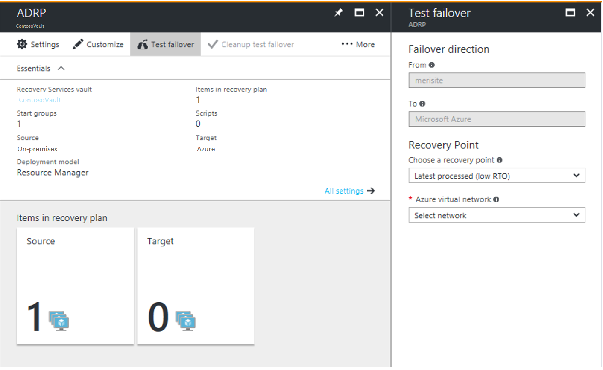
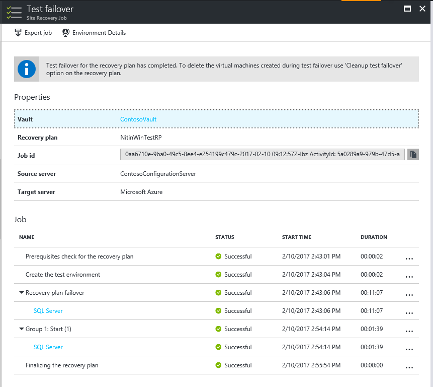

# Test failover to Azure in Site Recovery

This article describes how to run a disaster recovery drill to Azure, using a Site Recovery test failover.  

You run a test failover to validate your replication and disaster recovery strategy, without any data loss or downtime. A test failover doesn't impact ongoing replication, or your production environment. You can run a test failover on a specific virtual machine (VM), or on a [recovery plan](site-recovery-create-recovery-plans.md) containing multiple VMs.

## Run a test failover
This procedure describes how to run a test failover for a recovery plan. If you want to run a test failover for a single VM, follow the steps described [here](tutorial-dr-drill-azure.md#run-a-test-failover-for-a-single-vm)

1. In Site Recovery in the Azure portal, click **Recovery Plans** > *recoveryplan_name* > **Test Failover**.
2. Select a **Recovery Point** to which to fail over. You can use one of the following options:
	- **Latest processed**: This option fails over all VMs in the plan to the latest recovery point processed by Site Recovery. To see the latest recovery point for a specific VM, check **Latest Recovery Points** in the VM settings. This option provides a low RTO (Recovery Time Objective), because no time is spent processing unprocessed data.
	- **Latest app-consistent**: This option fails over all the VMs in the plan to the latest application-consistent recovery point processed by Site Recovery. To see the latest recovery point for a specific VM, check **Latest Recovery Points** in the VM settings.
	- **Latest**: This option first processes all the data that has been sent to Site Recovery service, to create a recovery point for each VM before failing over to it. This option provides the lowest RPO (Recovery Point Objective), because the VM created after failover will have all the data replicated to Site Recovery when the failover was triggered.
	- **Latest multi-VM processed**: This option is available for recovery plans with one or more VMs that have multi-VM consistency enabled. VMs with the setting enabled fail over to the latest common multi-VM consistent recovery point. Other VMs fail over to the latest processed recovery point.  
	- **Latest multi-VM app-consistent**: This option is available for recovery plans with one or more VMs that have multi-VM consistency enabled. VMs that are part of a replication group fail over to the latest common multi-VM application-consistent recovery point. Other VMs fail over to their latest application-consistent recovery point.
	- **Custom**: Use this option to fail over a specific VM to a particular recovery point.
3. Select an Azure virtual network in which test VMs will be created.

	- Site Recovery attempts to create test VMs in a subnet with the same name and same IP address as that provided in the **Compute and Network** settings of the VM.
	- If a subnet with the same name isn't available in the Azure virtual network used for test failover, then the test VM is created in the first subnet alphabetically.
	- If same IP address isn't available in the subnet, then the VM receives another available IP address in the subnet. [Learn more](#create-a-network-for-test-failover).
4. If you're failing over to Azure and data encryption is enabled, in **Encryption Key**, select the certificate that was issued when you enabled encryption during Provider installation. You can ignore this step encryption isn't enabled.
5. Track failover progress on the **Jobs** tab. You should be able to see the test replica machine in the Azure portal.
6. To initiate an RDP connection to the Azure VM, you need to [add a public IP address](https://aka.ms/addpublicip) on the network interface of the failed over VM.
7. When everything is working as expected, click **Cleanup test failover**. This deletes the VMs that were created during test failover.
8. In **Notes**, record and save any observations associated with the test failover.

When a test failover is triggered, the following occurs:

1. **Prerequisites**: A prerequisites check runs to make sure that all conditions required for failover are met.
2. **Failover**: The failover processes and prepared the data, so that an Azure VM can be created from it.
3. **Latest**: If you have chosen the latest recovery point, a recovery point is created from the data that's been sent to the service.
4. **Start**: This step creates an Azure virtual machine using the data processed in the previous step.

### Failover timing

In the following scenarios, failover  requires an extra intermediate step that usually takes around 8 to 10 minutes to complete:

* VMware VMs running a version of the Mobility service older than 9.8
* Physical servers
* VMware Linux VMs
* Hyper-V VM protected as physical servers
* VMware VM where the following drivers aren't boot drivers:
	* storvsc
	* vmbus
	* storflt
	* intelide
	* atapi
* VMware VM that don't have DHCP enabled , irrespective of whether they are using DHCP or static IP addresses.

In all the other cases, no intermediate step is not required, and failover takes significantly less time.

## Create a network for test failover

We recommended that for test failover, you choose a network that's isolated from the production recovery site network specific in the  **Compute and Network** settings for each VM. By default, when you create an Azure virtual network, it is isolated from other networks. The test network should mimic your production network:

- The test network should have same number of subnets as your production network. Subnets should have the same names.
- The test network should use the same IP address range.
- Update the DNS of the test network with the IP address specified for the DNS VM in **Compute and Network** settings. Read [test failover considerations for Active Directory](site-recovery-active-directory.md#test-failover-considerations) for more details.

## Test failover to a production network in the recovery site

Although we recommended that you use a test network separate from your production network, if you do want to test a disaster recovery drill into your production network, note the following:

- Make sure that the primary VM is shut down when you run the test failover. Otherwise there will be two VMs with the same identity,  running in the same network at the same time. This can lead to unexpected consequences.
- Any changes to VMs created for test failover are lost when you clean up the failover. These changes are not replicated back to the primary VM.
- Testing in your production environment leads to a downtime of your production application. Users shouldn't use apps running on VMs when the test failover is in progress.  

## Prepare Active Directory and DNS

To run a test failover for application testing, you need a copy of your production Active Directory environment in your test environment. Read [test failover considerations for Active Directory](site-recovery-active-directory.md#test-failover-considerations) to learn more.

## Prepare to connect to Azure VMs after failover

If you want to connect to Azure VMs using RDP/SSH after failover, follow the requirements summarized in the table.

**Failover** | **Location** | **Actions**
--- | --- | ---
**Azure VM running Windows** | On-premises machine before failover | To access the Azure VM over the internet, enable RDP, and make sure that TCP and UDP rules are added for **Public**, and that RDP is allowed for all profiles in **Windows Firewall** > **Allowed Apps**.   To access the Azure VM over a site-to-site connection, enable RDP on the machine, and ensure that RDP is allowed in the **Windows Firewall** -> **Allowed apps and features**, for **Domain and Private** networks.    Make sure the operating system SAN policy is set to **OnlineAll**. [Learn more](https://support.microsoft.com/kb/3031135).   Make sure there are no Windows updates pending on the VM when you trigger a failover. Windows update might start when you fail over, and you won't be able to log onto the VM until the update completes.
**Azure VM running Windows** | Azure VM after failover |  [Add a public IP address](https://aka.ms/addpublicip) for the VM.   The network security group rules on the failed over VM (and the Azure subnet to which it is connected) need to allow incoming connections to the RDP port.   Check **Boot diagnostics** to verify a screenshot of the VM.   If you can't connect, check that the VM is running, and review these [troubleshooting tips](http://social.technet.microsoft.com/wiki/contents/articles/31666.troubleshooting-remote-desktop-connection-after-failover-using-asr.aspx).
**Azure VM running Linux** | On-premises machine before failover | Ensure that the Secure Shell service on the VM is set to start automatically on system boot.   Check that firewall rules allow an SSH connection to it.
**Azure VM running Linux** | Azure VM after failover | The network security group rules on the failed over VM (and the Azure subnet to which it is connected) need to allow incoming connections to the SSH port.   [Add a public IP address](https://aka.ms/addpublicip) for the VM.   Check **Boot diagnostics** for a screenshot of the VM.  

Follow the steps described [here](site-recovery-failover-to-azure-troubleshoot.md) to troubleshoot any connectivity issues post failover.

## Next steps
After you've completed a disaster recovery drill, learn more about other types of [failover](site-recovery-failover.md).
