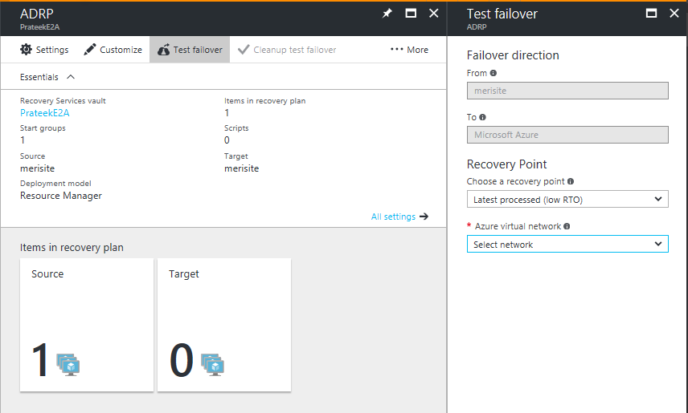

# Test failover (VMM to VMM) in Site Recovery

This article provides information and instructions for doing a test failover or a disaster recovery (DR) drill of virtual machines (VMs) and physical servers that are protected with Azure Site Recovery. You'll use a System Center Virtual Machine Manager (VMM)-managed on-premises site as the recovery site.

You run a test failover to validate your replication strategy or perform a DR drill without any data loss or downtime. A test failover doesn't have any impact on the ongoing replication or on your production environment. You can run it on either a virtual machine or a [recovery plan](site-recovery-create-recovery-plans.md). When you're triggering a test failover, you need to specify the network that the test virtual machines will connect to. You can track the progress of the test failover on the **Jobs** page.  

If you have any comments or questions, post them at the bottom of this article or on the [Azure Recovery Services Forum](https://social.msdn.microsoft.com/forums/azure/home?forum=hypervrecovmgr).

## Prepare the infrastructure for test failover
If you want to run a test failover by using an existing network, prepare Active Directory, DHCP, and DNS in that network.

If you want to run a test failover by using the option to create VM networks automatically, add a manual step before Group-1 in the recovery plan that you’re going to use for the test failover. Then, add the infrastructure resources to the automatically created network before you run the test failover.

### Things to note
When you're replicating to a secondary site, the type of network that the replica machine uses doesn’t need to match the type of logical network used for test failover, but some combinations might not work. If the replica uses DHCP and VLAN-based isolation, the VM network for the replica doesn't need a static IP address pool. So using Windows Network Virtualization for the test failover won't work because no address pools are available. 

In addition, the test failover won't work if the replica network uses no isolation and the test network uses Windows Network Virtualization. This is because the no-isolation network doesn't have the subnets required to create a Windows Network Virtualization network.

How replica virtual machines are connected to mapped VM networks after failover depends on how the VM network is configured in the VMM console.

#### VM network configured with no isolation or VLAN isolation
If DHCP is defined for the VM network, the replica virtual machine is connected to the VLAN ID through the settings that are specified for the network site in the associated logical network. The virtual machine receives its IP address from the available DHCP server. 

You don't need to define a static IP address pool for the target VM network. If a static IP address pool is used for the VM network, the replica virtual machine is connected to the VLAN ID through the settings that are specified for the network site in the associated logical network.

The virtual machine receives its IP address from the pool that's defined for the VM network. If a static IP address pool isn't defined on the target VM network, IP address allocation will fail. Create the IP address pool on both the source and target VMM servers that you will use for protection and recovery.

#### VM network with Windows Network Virtualization
If a VM network is configured with Windows Network Virtualization, you should define a static pool for the target VM network, regardless of whether the source VM network is configured to use DHCP or a static IP address pool. 

If you define DHCP, the target VMM server acts as a DHCP server and provides an IP address from the pool that's defined for the target VM network. If use of a static IP address pool is defined for the source server, the target VMM server allocates an IP address from the pool. In both cases, IP address allocation will fail if a static IP address pool is not defined.

### Prepare DHCP
If the virtual machines involved in test failover use DHCP, create a test DHCP server within the isolated network for the purpose of test failover.

### Prepare Active Directory
To run a test failover for application testing, you need a copy of the production Active Directory environment in your test environment. For more information, review the [test failover considerations for Active Directory](site-recovery-active-directory.md#test-failover-considerations).

### Prepare DNS
Prepare a DNS server for the test failover as follows:

* **DHCP**: If virtual machines use DHCP, the IP address of the test DNS should be updated on the test DHCP server. If you’re using a network type of Windows Network Virtualization, the VMM server acts as the DHCP server. Therefore, the IP address of DNS should be updated in the test failover network. In this case, the virtual machines register themselves to the relevant DNS server.
* **Static address**: If virtual machines use a static IP address, the IP address of the test DNS server should be updated in test failover network. You might need to update DNS with the IP address of the test virtual machines. You can use the following sample script for this purpose:

        Param(
        [string]$Zone,
        [string]$name,
        [string]$IP
        )
        $Record = Get-DnsServerResourceRecord -ZoneName $zone -Name $name
        $newrecord = $record.clone()
        $newrecord.RecordData[0].IPv4Address  =  $IP
        Set-DnsServerResourceRecord -zonename $zone -OldInputObject $record -NewInputObject $Newrecord

## Run a test failover
This procedure describes how to run a test failover for a recovery plan. Alternatively, you can run the failover for a single virtual machine on the **Virtual Machines** tab.

1. Select **Recovery Plans** > *recoveryplan_name*. Click **Failover** > **Test Failover**.
1. On the **Test Failover** blade, specify how virtual machines should be connected to networks after the test failover. For more information, see the [network options](#network-options-in-site-recovery).
1. Track failover progress on the **Jobs** tab.
1. After failover is complete, verify that the virtual machines start successfully.
1. When you're done, click **Cleanup test failover** on the recovery plan. In **Notes**, record and save any observations associated with the test failover. This step deletes the virtual machines and networks that were created during test failover.

## Network options in Site Recovery

When you run a test failover, you're asked to select network settings for test replica machines. You have multiple options.  

| **Test failover option** | **Description** | **Failover check** | **Details** |
| --- | --- | --- | --- |
| **Fail over to a secondary VMM site--without network** |Don't select a VM network. |Failover checks that test machines are created.  The test virtual machine is created on the host where the replica virtual machine exists. It isn’t added to the cloud where the replica virtual machine is located. |
The failed-over machine isn’t connected to any network.  The machine can be connected to a VM network after it has been created. |
| **Fail over to a secondary VMM site--with network** |Select an existing VM network. |Failover checks that virtual machines are created. |The test virtual machine is created on the host where the replica virtual machine exists. It isn’t added to the cloud where the replica virtual machine is located.  Create a VM network that's isolated from your production network.  If you're using a VLAN-based network, we recommend that you create a separate logical network (not used in production) in VMM for this purpose. This logical network is used to create VM networks for test failovers.  The logical network should be associated with at least one of the network adapters of all the Hyper-V servers that are hosting virtual machines.  For VLAN logical networks, the network sites that you add to the logical network should be isolated.  If you’re using a Windows Network Virtualization–based logical network, Azure Site Recovery automatically creates isolated VM networks. |
| **Fail over to a secondary VMM site--create a network** |A temporary test network is created automatically based on the setting that you specify in **Logical Network** and its related network sites. |Failover checks that virtual machines are created. |Use this option if the recovery plan uses more than one VM network. If you're using Windows Network Virtualization networks, this option can automatically create VM networks with the same settings (subnets and IP address pools) in the network of the replica virtual machine. These VM networks are cleaned up automatically after the test failover is complete.

The test virtual machine is created on the host where the replica virtual machine exists. It isn’t added to the cloud where the replica virtual machine is located. |

> [!TIP]
> The IP address given to a virtual machine during test failover is the same IP address that the virtual machine would receive for a planned or unplanned failover (presuming that the IP address is available in the test failover network). If the same IP address isn't available in the test failover network, the virtual machine receives another IP address that's available in the test failover network.
>
>

## Test failover to a production network on a recovery site
We recommend that when you're doing a test failover, you choose a network that is different from your production recovery site network that you provided in [network mapping](https://docs.microsoft.com/azure/site-recovery/site-recovery-network-mapping). But if you really want to validate end-to-end network connectivity in a failed-over virtual machine, note the following points:

* Make sure that the primary virtual machine is shut down when you're doing the test failover. If you don't, two virtual machines with the same identity will be running in the same network at the same time. That situation can lead to undesired consequences.
* Any changes that you make to the test failover virtual machines are lost when you clean up the test failover virtual machines. These changes are not replicated back to the primary virtual machine.
* This way of doing testing leads to downtime for your production application. Ask users of the application not to use the application when the DR drill is in progress.  

## Next steps
After you have successfully run a test failover, you can try a [failover](site-recovery-failover.md).
