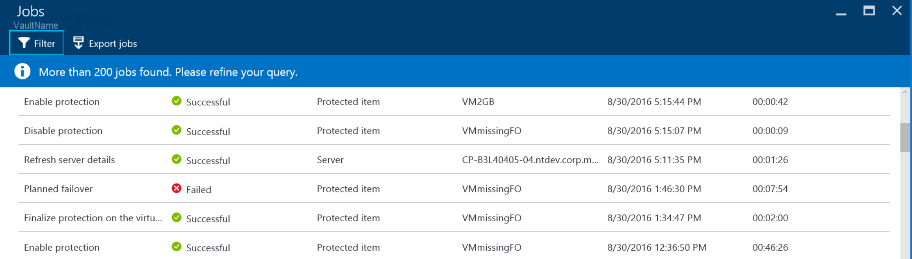
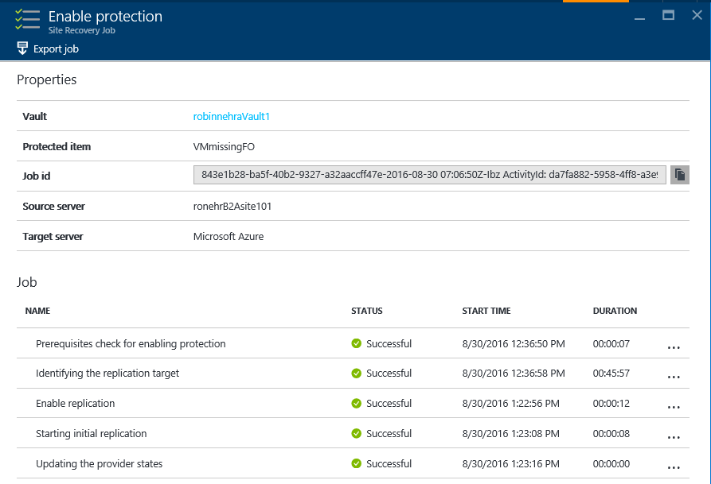

<properties
	pageTitle="Hyper-V replication with Azure Site Recovery | Microsoft Azure"
	description="Use this article to understand the technical concepts that help you successfully install, configure, and manage Azure Site Recovery."
	services="site-recovery"
	documentationCenter=""
	authors="Rajani-Janaki-Ram"
	manager="mkjain"
	editor=""/>

<tags
	ms.service="site-recovery"
	ms.devlang="na"
	ms.topic="article"
	ms.tgt_pltfrm="na"
	ms.workload="storage-backup-recovery"
	ms.date="09/12/2016"
	ms.author="rajanaki"/>  

# Hyper-V replication with Azure Site Recovery

This article describes the technical concepts that can help you successfully configure and manage a Hyper-V site or a System Center Virtual Machine Manager (VMM) site to Azure protection by using Azure Site Recovery.

## Setting up the source environment for replication between on-premises and Azure

As part of setting up disaster recovery between on-premises and Azure, be sure to download and install Azure Site Recovery Provider on the VMM server. Install Azure Recovery Services Agent on each Hyper-V host.

Setting up the source environment in a Hyper-V managed infrastructure is similar to setting up the source environment in a VMM managed infrastructure. The only difference is that the provider and agent are installed on the Hyper-V host itself. In the VMM environment, the provider is installed on the VMM server, and the agent is installed on the Hyper-V hosts (in case of replication to Azure).

## Workflows

### Enable protection
After you protect a virtual machine from the Azure portal or on-premises, a Site Recovery job named **Enable protection** starts. You can monitor it under the **Jobs** tab.

The **Enable protection** job checks for the prerequisites before invoking the [CreateReplicationRelationship](https://msdn.microsoft.com/library/hh850036.aspx) method. This method creates replication to Azure by using inputs that are configured during protection.

The **Enable protection** job starts the initial replication from on-premises by invoking the [StartReplication](https://msdn.microsoft.com/library/hh850303.aspx) method. This method sends the virtual machine's virtual disks to Azure.

### Finalize protection on the virtual machine
A [Hyper-V VM snapshot](https://technet.microsoft.com/library/dd560637.aspx) is taken when initial replication is triggered. Virtual hard disks are processed one by one until all the disks are uploaded to Azure. This normally takes a while to finish, based on the disk size and the bandwidth. To optimize your network usage, see [How to manage on-premises to Azure protection network bandwidth usage](https://support.microsoft.com/kb/3056159).

After the initial replication finishes, the **Finalize protection on the virtual machine** job configures the network and post-replication settings. While initial replication is in progress:

- All changes to the disks are tracked. 
- Additional disk storage is consumed for the snapshot and Hyper-V Replica Log (HRL) files.

On completion of initial replication, the Hyper-V VM snapshot is deleted. This deletion results in merging data changes after initial replication to the parent disk.

### Delta replication
Hyper-V Replica Replication Tracker, which is part of the Hyper-V Replica Replication Engine, tracks the changes to a virtual hard disk as Hyper-V Replica Log (*.hrl) files. HRL files are in the same directory as the associated disks.

Each disk that's configured for replication has an associated HRL file. This log is sent to the customer's storage account after initial replication is complete. When a log is in transit to Azure, the changes in the primary are tracked in another log file in the same directory.

During initial replication or delta replication, you can monitor VM replication health in the VM view, as mentioned in [Monitor replication health for virtual machine](./site-recovery-monitoring-and-troubleshooting.md#monitor-replication-health-for-virtual-machine).  

### Resynchronization
A virtual machine is marked for resynchronization when both delta replication fails and full initial replication is costly in terms of network bandwidth or time. For example, when HRL file size piles up to 50 percent of the total disk size, the virtual machine is marked for resynchronization. Resynchronization minimizes the amount of data sent over the network by computing checksums of the source and target virtual machine disks and sending only the differential.

After resynchronization finishes, normal delta replication should resume. You can resume resynchronization if a network outage or another outage occurs.

By default, automatically scheduled resynchronization is configured to happen outside work hours. If the virtual machine needs to be resynchronized manually, select the virtual machine from the portal and click **Resynchronize**.

Resynchronization uses a fixed-block chunking algorithm where source and target files are divided into fixed chunks. Checksums for each chunk are generated and then compared to determine which blocks from the source need to be applied to the target.

### Retry logic
There is built-in retry logic for replication errors. This logic can be classified into two categories:

| Category              	| Scenarios                                    |
|---------------------------|----------------------------------------------|
| Non-recoverable error 	| No retry is attempted. Virtual machine replication status is **Critical**, and administrator intervention is required. Examples include: <ul><li>Broken VHD chain</li><li>Invalid state for the replica virtual machine</li><li>Network authentication error</li><li>Authorization error</li><li>Virtual machine that isn't found, in the case of a standalone Hyper-V server</li></ul>|
| Recoverable error     	| Retries occur every replication interval, using an exponential back-off that increases the retry interval from the start of the first attempt (1, 2, 4, 8, 10 minutes). If an error persists, retry every 30 minutes. Examples include: <ul><li>Network error</li><li>Low disk space</li><li>Low memory condition</li></ul>|

## Hyper-V virtual machine protection and recovery life cycle

## Other references

- [Monitor and troubleshoot protection for VMware, VMM, Hyper-V, and physical sites](./site-recovery-monitoring-and-troubleshooting.md)
- [Reaching out for Microsoft Support](./site-recovery-monitoring-and-troubleshooting.md#reaching-out-for-microsoft-support)
- [Common Azure Site Recovery errors and their resolutions](./site-recovery-monitoring-and-troubleshooting.md#common-asr-errors-and-their-resolutions)
