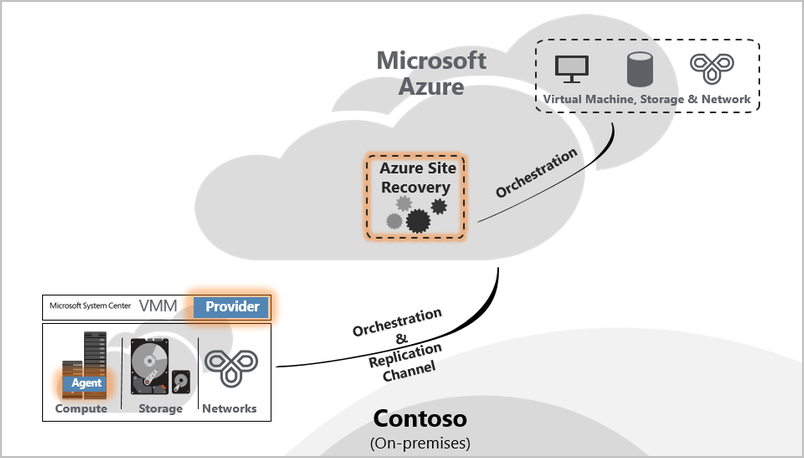
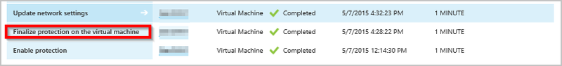
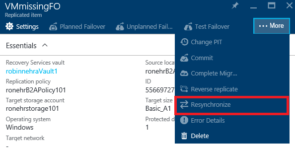

<properties
	pageTitle="Understanding Site to Azure Protection" 
	description="Use this article to understand the technical concepts which helps you successfully install, configure, and manage Azure Site Recovery." 
	services="site-recovery" 
	documentationCenter="" 
	authors="anbacker" 
	manager="mkjain" 
	editor=""/>

<tags 
	ms.service="site-recovery" 
	ms.devlang="na"
	ms.topic="article"
	ms.tgt_pltfrm="na"
	ms.workload="storage-backup-recovery" 
	ms.date="09/01/2015" 
	ms.author="anbacker"/>

# Understanding Hyper-V or VMM site to Azure protection

This article describes the technical concepts which helps you successfully configure and manage Hyper-V site or VMM site to Azure protection using Azure Site Recovery.

## Understanding the components

### Hyper-V Site or VMM Site Deployment for replication between on-premises & Azure.

As part of setting up DR between on-premises & Azure; Azure Site Recovery Provider needs to be downloaded and installed on the VMM server along with Azure Recovery Services Agent which needs to be installed on each Hyper-V host.

Hyper-V Site deployment is same as that of VMM Deployment – only difference being Provider & Agent gets installed on the Hyper-V host itself.

## Understanding the workflows

### Enable Protection
Once you protect a virtual machine from portal or on-premises, an ASR job named *Enable Protection* will be initiated and can be monitored under the JOBS tab. 

*Enable Protection* job checks for the prerequisites before invoking [CreateReplicationRelationship](https://msdn.microsoft.com/library/hh850036.aspx) which creates replication to Azure using inputs configured during protection. *Enable Protection* job starts the initial replication from on-premises by invoking [StartReplication](https://msdn.microsoft.com/library/hh850303.aspx) which sends the virtual machine's virtual disks to Azure.

### Finalize Protection
A [Hyper-V VM snapshot](https://technet.microsoft.com/library/dd560637.aspx) is taken when Initial Replication is triggered. Virtual hard disks are processed one by one till all the disks are uploaded to Azure. This normally takes a while to complete based on the disk size and the bandwidth. Refer [How to manage on-premises to Azure protection network bandwidth usage](https://support.microsoft.com/kb/3056159) for optimizing your network usage. Once initial replication completes *Finalize protection on the virtual machine* job configures the network and post-replication settings. While Initial Replication is in-progress all the changes to the disks gets tracked as mentioned in Delta Replication section below. Additional disk storage will be consumed for the snapshot and HRL files while Initial Replication is in-progress. On completion of an Initial Replication, Hyper-V VM snapshot will be deleted which results in merging data changes post Initial Replication to the parent disk.

### Delta Replication
Hyper-V Replica Replication Tracker, which is part of the Hyper-V Replica Replication Engine, tracks the changes to a virtual hard disk as Hyper-V Replication Logs (*.hrl). HRL files will be located in the same directory as of the associated disks. Each disk configured for replication will have an associated HRL file. This log(s) is (are) sent to the customer's storage account after initial replication is complete. When a log is in transit to the Azure, the changes in the primary are tracked in another log file in the same directory.

VM replication health during Initial Replication or Delta Replication can be monitored in the VM view as mentioned under [Monitor replication health for virtual machine](./site-recovery-monitoring-and-troubleshooting.md#monitor-replication-health-for-virtual-machine).  

### Re-synchronization 
A virtual machine is marked for re-synchronization when both Delta Replication fails and Full Initial Replication is costly in terms of network bandwidth or the time it would take to complete a Full Initial Replication. For example when HRL file-size piles up to 50% of the total disk size then the virtual machine is marked for re-synchronization. Re-synchronization minimizes the amount of data sent over the network by computing check-sums of the Source and Target virtual machine disks and sending only the differential. 

After re-synchronization completes, normal Delta Replication should resume. Re-synchronization can be resumed in the event of an outage (e.g. network outage, VMMS crash, etc.). 

By default *Automatically scheduled re-synchronization* is configured during the non-office work hours. If the virtual machine needs to be re-synchronized manually, select the virtual machine from the portal and click RESYNCHRONIZE.

Re-synchronization uses a fixed-block chunking algorithm where Source and Target files are divided into fixed chunks; check-sum for each chunk are generated and then compared to determine which block(s) from the Source need to be applied to the Target. 

### Retry logic
There is built-in retry logic when replication errors occur. This can be classified into two categories as below.

| Category              	| Scenarios                                    |
|---------------------------|----------------------------------------------|
| Non-Recoverable Error 	| No retry will be attempted. Virtual machine replication status will be shown as Critical and an administrator intervention is required. Examples would include <ul><li>A broken VHD chain</li><li>Replica virtual machine is in an invalid state</li><li>Network authentication error</li><li>Authorization Error</li><li>If a virtual machine isn't found in the case of a standalone Hyper-V server</li></ul>|
| Recoverable Error     	| Retries occur every replication interval using exponentially backoff which increases the retry interval from the start of first attempt (1, 2, 4, 8, 10 minutes). If an error persists, retry every 30 minutes. Examples would include <ul><li>Network Error</li><li>Low disk space</li><li>Low memory condition</li></ul>|

## Understanding Hyper-V virtual machine protection and recovery life cycle

## Other references

- [Monitor and troubleshoot protection for VMware, VMM, Hyper-V and Physical sites](./site-recovery-monitoring-and-troubleshooting.md)
- [Reaching out for Microsoft Support](./site-recovery-monitoring-and-troubleshooting.md#reaching-out-for-microsoft-support)
- [Common ASR errors and their resolutions](./site-recovery-monitoring-and-troubleshooting.md#common-asr-errors-and-their-resolutions)