<properties
	pageTitle="Replicate Hyper-V VMs in a VMM cloud to a secondary site with Azure Site Recovery using SAN | Microsoft Azure"
	description="This article describes how to replicate Hyper-V virtual machines between two sites with Azure Site Recovery using SAN replication."
	services="site-recovery"
	documentationCenter=""
	authors="rayne-wiselman"
	manager="jwhit"
	editor=""/>

<tags
	ms.service="site-recovery"
	ms.workload="backup-recovery"
	ms.tgt_pltfrm="na"
	ms.devlang="na"
	ms.topic="article"
	ms.date="07/06/2016"
	ms.author="raynew"/>

# Replicate Hyper-V VMs in a VMM cloud to a secondary site with Azure Site Recovery using SAN

In this article you'll learn how to deploy Site Recovery to orchestrate and automate SAN replication and failover for Hyper-V virtual machines located in System Center VMM clouds to a secondary VMM site.

After reading this article post any comments or questions at the bottom of this article, or on the [Azure Recovery Services Forum](https://social.msdn.microsoft.com/forums/azure/home?forum=hypervrecovmgr). 

## Overview

Organizations need a business continuity and disaster recovery (BCDR) strategy that a determines how apps, workloads, and data stay running and available during planned and unplanned downtime, and recover to normal working conditions as soon as possible. Your BCDR strategy center's around solutions that keep business data safe and recoverable, and workloads continuously available, when disaster occurs.

Site Recovery is an Azure service that contributes to your BCDR strategy by orchestrating replication of on-premises physical servers and virtual machines to the cloud (Azure) or to a secondary datacenter. When outages occur in your primary location, you fail over to the secondary site to keep apps and workloads available. You fail back to your primary location when it returns to normal operations. Site Recovery can be used in a number of scenarios and can protect a number of workloads. Learn more in [What is Azure Site Recovery?](site-recovery-overview.md)

This article includes instructions for setting up replication of Hyper-V VMs from one VMM site to another using SAN relication. It includes an architectural overview, and deployment prerequisites and instructions. You'll discover and classify SAN storage in VMM, provision LUNs, and allocate storage to Hyper-V clusters. It finishes up by testing failover to make sure everything's working as expected.

## Why replicate with SAN?

Here's what this scenario provides:

- Provides an enterprise scalable replication solution automated by Site Recovery.
- Takes advantage of SAN replication capabilities provided by enterprise storage partners across both fibre channel and iSCSI storage. See our [SAN storage partners](http://social.technet.microsoft.com/wiki/contents/articles/28317.deploying-azure-site-recovery-with-vmm-and-san-supported-storage-arrays.aspx).
- Leverages your existing SAN infrastructure to protect mission-critical applications deployed in Hyper-V clusters.
- Provides support for guest clusters.
- Ensures replication consistency across different tiers of an application with synchronized replication for low RTO and RPO, and asynchronized replication for high flexibility, depending on storage array capabilities.  
- Integrates with VMM provides SAN management within the VMM console and SMI-S in VMM discovers existing storage.  

## Architecture

This scenario protects your workloads by backing up Hyper-V virtual machines from one on-premises VMM site to another using SAN replication.

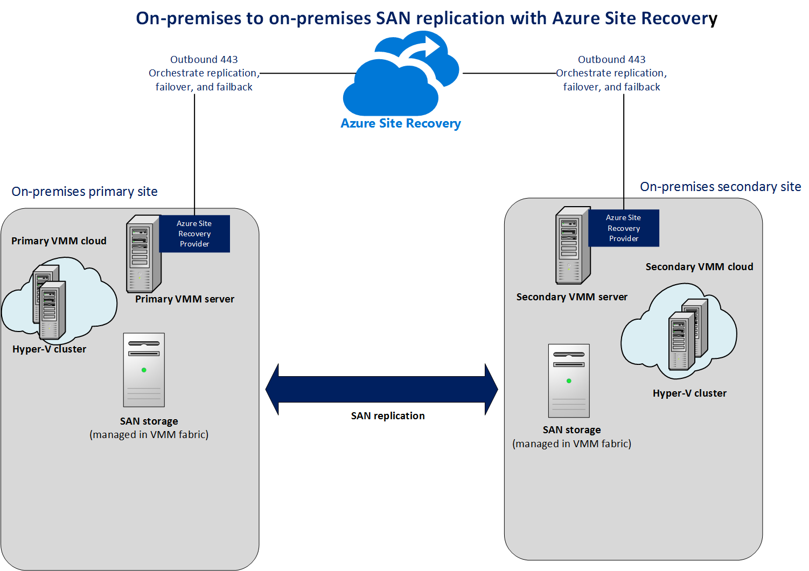

Components in this scenario include:

- **On-premises virtual machines**—Your on-premises Hyper-V servers that are managed in VMM private clouds contain virtual machines you want to protect.
- **On-premises VMM servers**—You can one or more VMM servers running on the primary site you want to protect, and on the secondary site.
- **SAN storage**—A SAN array on the primary site and one in the secondary site
-  **Azure Site Recovery vault**—The vault coordinates and orchestrates data replica, failover, and recovery between your on-premises sites.
- **Azure Site Recovery Provider**—Provider is installed on each VMM server.

## Before you start

Make sure you have these prerequisites in place:

**Prerequisites** | **Details** 
--- | ---
**Azure**| You'll need a [Microsoft Azure](https://azure.microsoft.com/) account. You can start with a [free trial](https://azure.microsoft.com/pricing/free-trial/). [Learn more](https://azure.microsoft.com/pricing/details/site-recovery/) about Site Recovery pricing. 
**VMM** | You'll need at least one VMM server deployed as a physical or virtual standalone server, or as a virtual cluster.   The VMM server should be running System Center 2012 R2 with the latest cumulative updates.  You'll need at least one cloud configured on the primary VMM server you want to protect and one cloud configured on the secondary VMM server you want to use for protection and recovery  The source cloud that you want to protect must contain one or more VMM host groups.  All VMM clouds must have the Hyper-V Capacity profile set.  Learn more about setting up VMM clouds in [Configuring the VMM cloud fabric](https://msdn.microsoft.com/library/azure/dn469075.aspx#BKMK_Fabric), and [Walkthrough: Creating private clouds with System Center 2012 SP1 VMM](http://blogs.technet.com/b/keithmayer/archive/2013/04/18/walkthrough-creating-private-clouds-with-system-center-2012-sp1-virtual-machine-manager-build-your-private-cloud-in-a-month.aspx).
**Hyper-V** | You'll need one or more Hyper-V clusters in the primary and secondary sites, and one or more VMs on the source Hyper-V cluster. VMM host groups in the primary and secondary locations should have one or more Hyper-V clusters in each group.  The host and target Hyper-V servers must be running at least Windows Server 2012 with the Hyper-V role and have the latest updates installed.  Any Hyper-V server containing VMs you want to protect must be located in a VMM cloud.  If you're running Hyper-V in a cluster note that cluster broker isn't created automatically if you have a static IP address-based cluster. You'll need to configure the cluster broker manually. [Learn more](https://www.petri.com/use-hyper-v-replica-broker-prepare-host-clusters) in Aidan Finn's blog entry.
**SAN storage** | Using SAN replication you can replicate guest-clustered virtual machines with iSCSI or fibre channel storage, or using shared virtual hard disks (vhdx).  You’ll need two SAN arrays set up, one in the primary site and one in the secondary.  Network infrastructure should be set up between the arrays. Peering and replication should be configured. Replication licenses should be set up in accordance with the storage array requirements.  Networking should be set up between the Hyper-V host servers and the storage array so that hosts can communicate with storage LUNs using ISCSI or Fibre Channel.   Check the list [supported storage arrays](http://social.technet.microsoft.com/wiki/contents/articles/28317.deploying-azure-site-recovery-with-vmm-and-san-supported-storage-arrays.aspx).  SMI-S Providers, provided by the storage array manufacturers should be installed and the SAN arrays should be managed by the Provider. Set up the Provider in accordance with their documentation.  Ensure that the SMI-S provider for the array is on a server that the VMM server can access over the network by IP address or FQDN.  Each SAN array should have one or more storage pools available to use in this deployment.The VMM server at the primary site will need to manage the primary array and the secondary VMM server will manage the secondary array.  The VMM server at the primary site should manage the primary array and the secondary VMM server should manage the secondary array.
**Network mapping** | You can configure network mapping to make sure that replicated virtual machines are optimally placed on secondary Hyper-V host servers after failover, and that they can connect to appropriate VM networks. If you don't configure network mapping replica VMs won't be connected to any network after failover.  To set up network mapping during deployment make sure that the virtual machines on the source Hyper-V host server are connected to a VMM VM network. That network should be linked to a logical network that is associated with the cloud.<br/ The target cloud on the secondary VMM server that you use for recovery should have a corresponding VM network configured, and it in turn should be linked to a corresponding logical network that is associated with the target cloud.  [Learn more](site-recovery-network-mapping.md) about network mapping.

## Step 1: Prepare the VMM infrastructure

To prepare your VMM infrastructure you need to:

1. Ensure VMM clouds are set up
2. Integrate and classify SAN storage in VMM
3. Create LUNs and allocate storage
4. Create replication groups
5. Set up VM networks

### Ensure VMM clouds are set up

Site Recovery orchestrates protection for virtual machines located on Hyper-V host servers in VMM clouds. You'll need to ensure that those clouds are set up properly before you begin Site Recovery deployment. Learn more in [Creating private clouds](http://blogs.technet.com/b/keithmayer/archive/2013/04/18/walkthrough-creating-private-clouds-with-system-center-2012-sp1-virtual-machine-manager-build-your-private-cloud-in-a-month.aspx) on Keith Mayer's blog.

### Integrate and classify SAN storage in VMM

Add an classify SANs in the VMM console:

1. In the **Fabric** workspace click **Storage**. Click **Home** > **Add Resources** > **Storage Devices** to start the Add Storage Devices Wizard.
2. In **Select a storage provider type** page, select **SAN and NAS devices discovered and managed by an SMI-S provider**.

	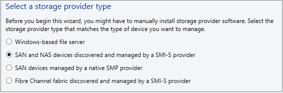

3. On the **Specify Protocol and Address of the Storage SMI-S Provider** page select **SMI-S CIMXML** and specify the settings for connecting to the provider.
4. In **Provider IP address or FQDN** and **TCP/IP port**, specify the settings for connecting to the provider. You can use an SSL connection for SMI-S CIMXML only.

	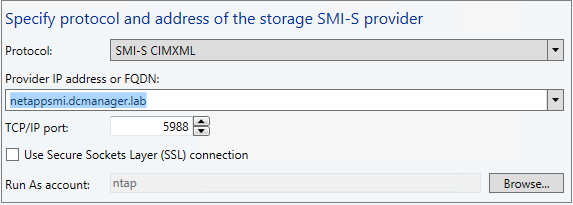

5. In **Run as account** specify a VMM Run As account that can access the provider, or create a new account.
6. On the **Gather Information** page, VMM automatically tries to discover and import the storage device information. To retry discovery, click **Scan Provider**. If the discovery process succeeds, the discovered storage arrays, storage pools, manufacturer, model, and capacity are listed on the page.

	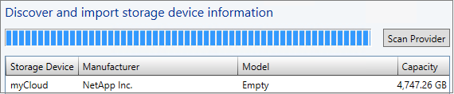

7. In **Select storage pools to place under management and assign a classification**, select the storage pools that VMM will manage and assign them a classification. LUN information will be imported from the storage pools. Create LUNs based on the applications you need to protect, their capacity requirements and your requirement for what needs to replicate together.

	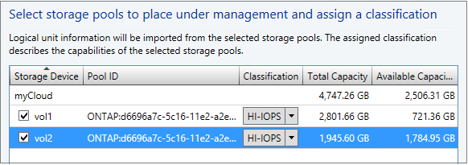

### Create LUNs and allocate storage

1. After SAN storage is integrated into VMM you create (provision) logical units (LUNs):

	- [How to select a method for creating logical units in VMM](https://technet.microsoft.com/library/gg610624.aspx)
	- [How to provision storage logical units in VMM](https://technet.microsoft.com/library/gg696973.aspx)

	>[AZURE.NOTE] After you've enable replication for a machine you shouldn't add VHDs for it to LUNs that aren't located in a Site Recovery replication group. If you do they won't be detected by Site Recovery.

2. Then allocate storage capacity to the Hyper-V host cluster so that VMM can deploy virtual machine data to the provisioned storage:

	- Before allocating storage to the cluster you'll need to allocate it to the VMM host group on which the cluster resides. See [How to allocate storage logical units to a host group](https://technet.microsoft.com/library/gg610686.aspx) and [How to allocate storage pools to a host group](https://technet.microsoft.com/library/gg610635.aspx).</a>.
	- Then allocate storage capacity to the cluster as described in [How to configure storage on a Hyper-V host cluster in VMM](https://technet.microsoft.com/library/gg610692.aspx).</a>.

### Create replication groups

Create a replication group which includes all the LUNs that will need to replicate together.

1. In the VMM console open the **Replication Groups** tab of the storage array properties, and click **New**.
2. Then create the replication group.

	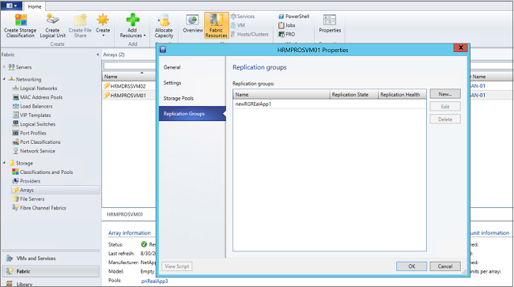

### Set up networks

If you want to configure network mapping do the following:

1. [Read about](site-recovery-network-mapping.md) network mapping.
2. Prepare VM networks in VMM:

	- [Set up logical networks](https://technet.microsoft.com/library/jj721568.aspx).
	- [Set up VM networks](https://technet.microsoft.com/library/jj721575.aspx).

## Step 2: Create a vault

1. Sign in to the [Management Portal](https://portal.azure.com) from the VMM server you want to register.

2. Expand **Data Services** > **Recovery Services** and click **Site Recovery Vault**.

3. Click **Create New** > **Quick Create**.

4. In **Name**, enter a friendly name to identify the vault.

5. In **Region** select the geographic region for the vault. To check supported regions see Geographic Availability in [Azure Site Recovery Pricing Details](https://azure.microsoft.com/pricing/details/site-recovery/).

6. Click **Create vault**.

	

Check the status bar to confirm that the vault was successfully created. The vault will be listed as **Active** on the main **Recovery Services** page.

### Register the VMM servers

1. Open the Quick Start page from the **Recovery Services** page. Quick Start can also be opened at any time using the icon.

	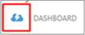

2. In the dropdown list, select **Between Hyper-V on-premises site using array replication**.

	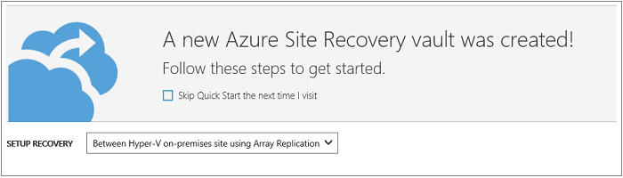

3. In **Prepare VMM servers**, download the latest version of the Azure Site Recovery Provider installation file.
4. Run this file on the source VMM server. If VMM is deployed in a cluster and you're installing the Provider for the first time install it on an active node and finish the installation to register the VMM server in the vault. Then install the Provider on the other nodes. Note that if you're upgrading the Provider you'll need to upgrade on all nodes because they should all be running the same Provider version.
5. The Installer does a few **Pre-requirements Check** and requests permission to stop the VMM service to begin Provider setup. The VMM Service will be restarted automatically when setup finishes. If you're installing on a VMM cluster you'll be prompted to stop the Cluster role.
6. In **Microsoft Update** you can opt in for updates. With this setting enabled Provider updates will be installed according to your Microsoft Update policy.

	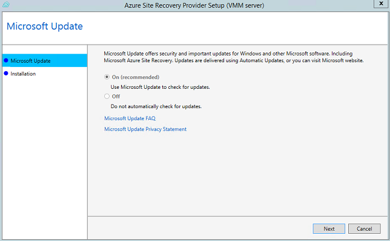

7. The install location is set to **<SystemDrive>\Program Files\Microsoft System Center 2012 R2\Virtual Machine Manager\bin**. Click on the Install button to start installing the Provider.

	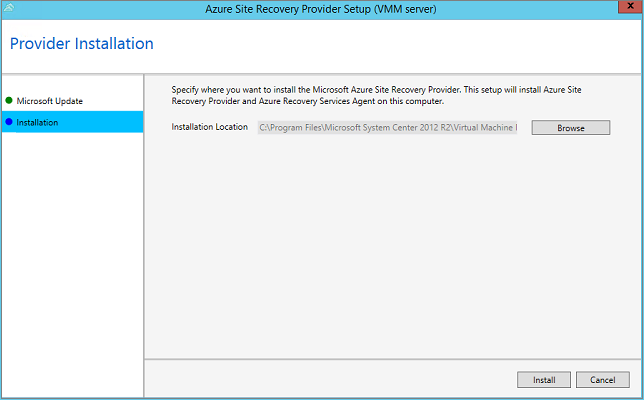

8. After the Provider is installed click 'Register' button to register the server in the vault.

	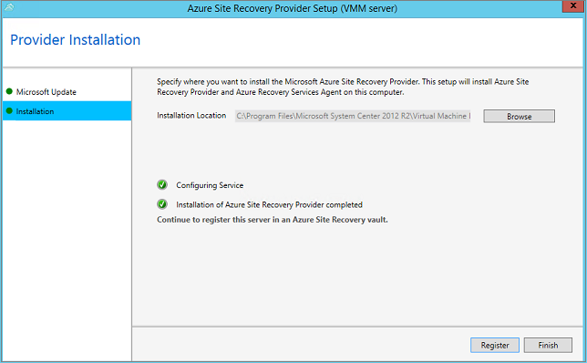

9. In **Internet Connection** specify how the Provider running on the VMM server connects to the Internet. Select **Use default system proxy settings** to use the default Internet connection settings configured on the server.

	

	- If you want to use a custom proxy you should set it up before you install the Provider. When you configure custom proxy settings a test will run to check the proxy connection.
	- If you do use a custom proxy, or your default proxy requires authentication you'll need to enter the proxy details, including the proxy address and port.
	- Following urls should be accessible from the VMM Server and the Hyper-v hosts
		- *.hypervrecoverymanager.windowsazure.com
		- *.accesscontrol.windows.net
		- *.backup.windowsazure.com
		- *.blob.core.windows.net
		- *.store.core.windows.net
	- Allow the IP addresses described in [Azure Datacenter IP Ranges](https://www.microsoft.com/download/confirmation.aspx?id=41653) and HTTPS (443) protocol. You would have to white-list IP ranges of the Azure region that you plan to use and that of West US.
	- If you use a custom proxy a VMM RunAs account (DRAProxyAccount) will be created automatically using the specified proxy credentials. Configure the proxy server so that this account can authenticate successfully. The VMM RunAs account settings can be modified in the VMM console. To do this, open the Settings workspace, expand Security, click Run As Accounts, and then modify the password for DRAProxyAccount. You’ll need to restart the VMM service so that this setting takes effect.

10. In **Registration Key**, select that you downloaded from Azure Site Recovery and copied to the VMM server.
11. In **Vault name**, verify the name of the vault in which the server will be registered. 

	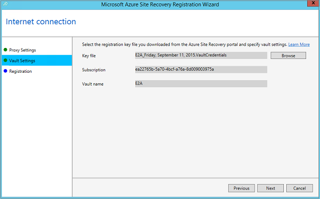

12. The encryption setting is used only for VMM to Azure Scenario, if you are a VMM to VMM only user then you can ignore this screen.

	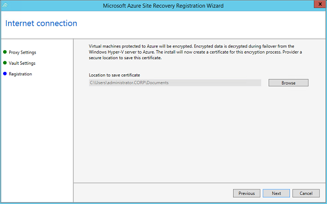

13. In **Server name**, specify a friendly name to identify the VMM server in the vault. In a cluster configuration specify the VMM cluster role name.
14. In **Initial cloud metadata sync** specify a friendly name for the server that will appear in the vault, and select whether you want to synchronize metadata for all clouds on the VMM server with the vault. This action only needs to happen once on each server. If you don't want to synchronize all clouds, you can leave this setting unchecked and synchronize each cloud individually in the cloud properties in the VMM console.

	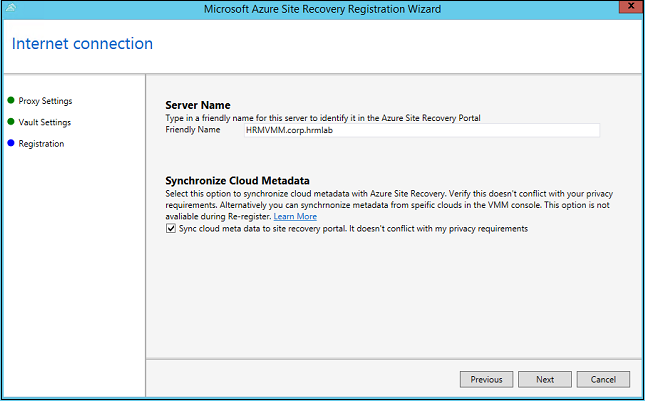

15. Click **Next** to complete the process. After registration, metadata from the VMM server is retrieved by Azure Site Recovery. The server is displayed on the  *VMM Servers* tab on the **Servers** page in the vault.

### Command line installation

The Azure Site Recovery Provider can also be installed using the following command line. This method can be used to install the provider on a Server CORE for Windows Server 2012 R2.

1. Download the Provider installation file and registration key to a folder say C:\ASR
2. Stop the System Center Virtual Machine Manager Service
3. Extract the Provider installer by running the following from a command prompt with **Administrator** privileges:

    	C:\Windows\System32> CD C:\ASR
    	C:\ASR> AzureSiteRecoveryProvider.exe /x:. /q

4. Install the provider by running the following:

		C:\ASR> setupdr.exe /i

5. Register the provider by running the following:

    	CD C:\Program Files\Microsoft System Center 2012 R2\Virtual Machine Manager\bin
    	C:\Program Files\Microsoft System Center 2012 R2\Virtual Machine Manager\bin\> DRConfigurator.exe /r  /Friendlyname <friendly name of the server> /Credentials <path of the credentials file> /EncryptionEnabled <full file name to save the encryption certificate>         

Where the parameters are:

 - **/Credentials** : Mandatory parameter that specifies the location in which the registration key file is located  
 - **/FriendlyName** : Mandatory parameter for the name of the Hyper-V host server that appears in the Azure Site Recovery portal.
 - **/EncryptionEnabled** : Optional Parameter that you need to use only in the VMM to Azure Scenario if you need encryption of your virtual machines at at rest in Azure. Please ensure that the name of the file you provide has a **.pfx** extension.
 - **/proxyAddress** : Optional parameter that specifies the address of the proxy server.
 - **/proxyport** : Optional parameter that specifies the port of the proxy server.
 - **/proxyUsername** : Optional parameter that specifies the Proxy user name (if proxy requires authentication).
 - **/proxyPassword** :Optional parameter that specifies the Password for authenticating with the proxy server (if proxy requires authentication).

## Step 3: Map storage arrays and pools

Map arrays to specify which secondary storage pool receives replication data from the primary pool. You should map storage before you configure cloud protection because the mapping information is used when you enable protection for replication groups.

Before you start check that clouds appear in the vault. Clouds are detected either by selecting to synchronize all clouds when you install the Provider, or by selecting to synchronize a specific cloud on the **General** tab of the cloud properties in the VMM console. Then map storage arrays as follows:

1. Click **Resources** > **Server Storage** > **Map Source and Target Arrays**.
	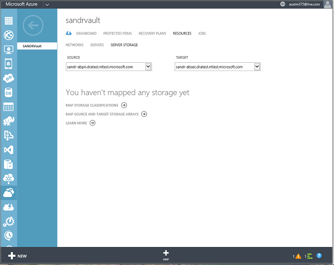
2. Select the storage arrays on the primary site and map them to storage arrays on the secondary site.
3.  Map source and target storage pools within the arrays. To do this, in **Storage Pools** select a source and target storage pool to map.

	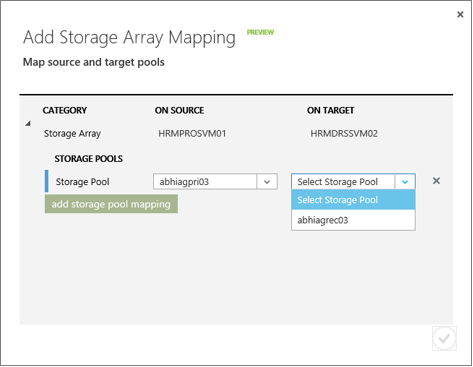

## Step 4: Configure cloud protection settings

After VMM servers are registered, you can configure cloud protection settings. You enabled the option **Synchronize cloud data with the vault** when you installed the Provider so all clouds on the VMM server will appear in the <b>Protected Items</b> tab in the vault.

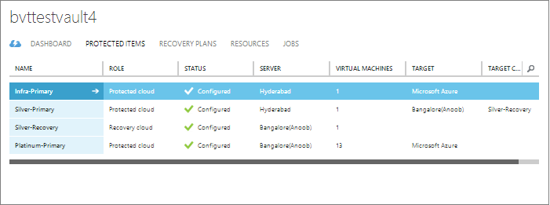

1. On the Quick Start page, click **Set up protection for VMM clouds**.
2. On the **Protected Items** tab, select the cloud that you want to configure and go to the **Configuration** tab. Note that:
3. In **Target**, select **VMM**.
4. In **Target location**, select the on-site VMM server that manages the cloud you want to use for recovery.
5. In **Target cloud**, select the target cloud you want to use for failover of virtual machines in the source cloud. Note that:
	- We recommend that you select a target cloud that meets recovery requirements for the virtual machines you'll protect.
	- A cloud can only belong to a single cloud pair — either as a primary or a target cloud.
6. Azure Site Recovery verifies that clouds have access to SAN replication capable storage, and that the storage arrays are peered. Participating array peers are displayed.
7. If verification is successful, in **Replication type**, select **SAN**.

After you save the settings a job will be created and can be monitored on the **Jobs** tab. Cloud settings can be modified on the **Configure** tab. If you want to modify the target location or target cloud you must remove the cloud configuration, and then reconfigure the cloud.

## Step 5: Enable network mapping

1. On the Quick Start page, click **Map networks**.
2. Select the source VMM server from which you want to map networks, and then the target VMM server to which the networks will be mapped. The list of source networks and their associated target networks are displayed. A blank value is shown for networks that are not currently mapped. Click the information icon next to the source and target network names to view the subnets for each network.
3. Select a network in **Network on source**, and then click **Map**. The service detects the VM networks on the target server and displays them.

	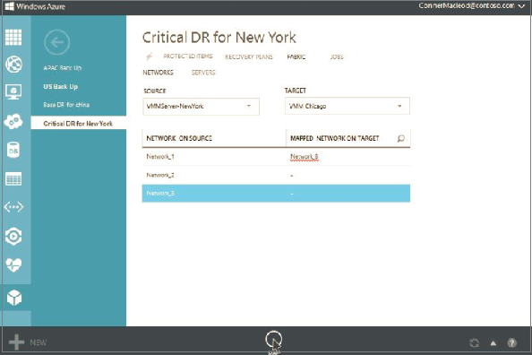

4. In the dialog box that is displayed, select one of the VM networks from the target VMM server.

	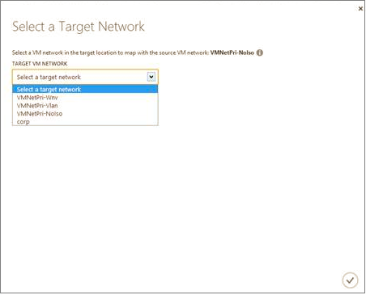

5. When you select a target network, the protected clouds that use the source network are displayed. Available target networks that are associated with the clouds used for protection are also displayed. We recommend that you select a target network that is available to all the clouds you are using for protection.
6.  Click the check mark to complete the mapping process. A job starts to track the mapping progress. You can view it on the **Jobs** tab.

## Step 6: Enable replication for replication groups

Before you can enable protection for virtual machines you’ll need to enable replication for storage replication groups.

1. In the Azure Site Recovery portal, in the properties page of the primary cloud open the **Virtual Machines** tab. Click **Add Replication Group**.
2. Select one or more VMM replication groups that are associated with the cloud, verify the source and target arrays, and specify the replication frequency.

When this operation is complete, Azure Site Recovery, together with VMM and the SMI-S providers provision the target site storage LUNs and enable storage replication. If the replication group is already replicated, Azure Site Recovery reuses the existing replication relationship and updates the information in Azure Site Recovery.

## Step 7: Enable protection for virtual machines

After a storage group is replicating, enable protection for virtual machines in the VMM console using either of the following methods:

- **New virtual machine**—In the VMM console when you create a new virtual machine you enable Azure Site Recovery protection and associate the virtual machine with the replication group.
With this option VMM uses intelligent placement to optimally place the virtual machine storage on the LUNs of the replication group. Azure Site Recovery orchestrates the creation of a shadow virtual machine on the secondary site, and allocates capacity so that replica virtual machines can be started after failover.
- **Existing virtual machine**—If a virtual machine is already deployed in VMM, you can enable Azure Site Recovery protection, and do a storage migration to a replication group. After completion, VMM and Azure Site Recovery detect the new virtual machine and start managing it in Azure Site Recovery for protection. A shadow virtual machine is created on the secondary site, and allocated capacity so that the replica virtual machine can be started after failover.

	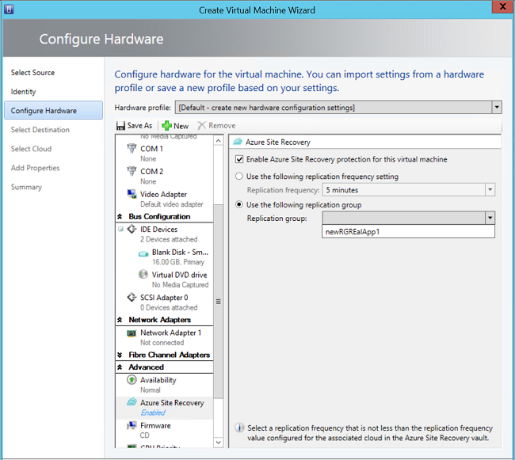

After virtual machines are enabled for protection they appear in the Azure Site Recovery console. You can view virtual machine properties, track status, and fail over replication groups that contain multiple virtual machines. Note that in SAN replication all virtual machines associated with a replication group must fail over together. This is because failover occurs at the storage layer first. It’s important to group your replication groups properly and place only associated virtual machines together.

>[AZURE.NOTE] After you've enable replication for a machine you shouldn't add VHDs for it to LUNs that aren't located in a Site Recovery replication group. If you do they won't be detected by Site Recovery.

You can track progress of the Enable Protection action in the **Jobs** tab, including the initial replication. After the Finalize Protection job runs the virtual machine is ready for failover.

## Step 8: Test the deployment

Test your deployment to make sure virtual machines and data fail over as expected. To do this you'll create a recovery plan by selecting replication groups.Then run a test failover on the plan.

1. On the **Recovery Plans** tab, click **Create Recovery Plan**.
2. Specify a name for the recovery plan, and source and target VMM servers. The source server must have virtual machines that are enabled for failover and recovery. Select **SAN** to view only clouds that are configured for SAN replication.
3.
	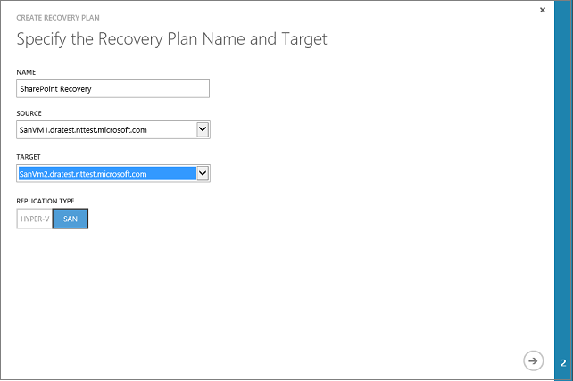

4. In **Select Virtual Machine**, select replication groups. All virtual machines associated with the replication group will be selected and added to the recovery plan. These virtual machines are added to the recovery plan default group—Group 1. you can add more groups if required. Note that after replication virtual machines will start in accordance with the order of the recovery plan groups.

	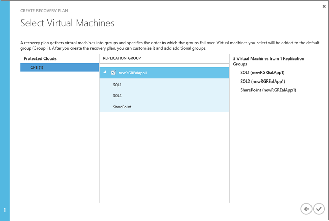
5. After a recovery plan has been created, it appears in the list on the **Recovery Plans** tab.
6. On the **Recovery Plans** tab, select the plan and click **Test Failover**.
7. On the **Confirm Test Failover** page, select **None**. Note that with this option enabled the failed over replica virtual machines won't be connected to any network. This will test that the virtual machine fails over as expected but does not test your replication network environment. Look at how to [run a test failover](site-recovery-failover.md#run-a-test-failover) for more details about how to use different networking options.

	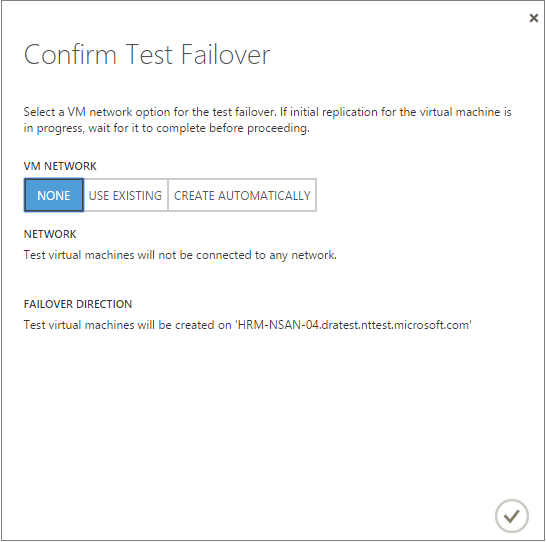

8. The test virtual machine will be created on the same host as the host on which the replica virtual machine exists. It isn’t added to the cloud in which the replica virtual machine is located.
9. After replication the replica virtual machine will have an IP address that isn’t the same as the IP address of the primary virtual machine. If you're issuing addresses from DHCP then will be updated automatically. If you're  not using DHCP and you want to make sure the addresses are the same you'll need to run a couple of scripts.
10. Run this sample script to retrieve the IP address.

    	$vm = Get-SCVirtualMachine -Name <VM_NAME>
		$na = $vm[0].VirtualNetworkAdapters>
		$ip = Get-SCIPAddress -GrantToObjectID $na[0].id
		$ip.address  

11. Run this sample script to update DNS, specifying the IP address you retrieved using the previous sample script.

		[string]$Zone,
		[string]$name,
		[string]$IP
		)
		$Record = Get-DnsServerResourceRecord -ZoneName $zone -Name $name
		$newrecord = $record.clone()
		$newrecord.RecordData[0].IPv4Address  =  $IP
		Set-DnsServerResourceRecord -zonename $zone -OldInputObject $record -NewInputObject $Newrecord

## Next steps

After you've run a test failover to check your environment is working as expected, [learn about](site-recovery-failover.md) different types of failovers.
