<properties
	pageTitle="Replicate Hyper-V virtual machines in VMM clouds to Azure | Microsoft Azure"
	description="This article describes how to replicate Hyper-V virtual machines on Hyper-V hosts located in System Center VMM clouds to Azure."
	services="site-recovery"
	documentationCenter=""
	authors="rayne-wiselman"
	manager="jwhit"
	editor=""/>

<tags
	ms.service="site-recovery"
	ms.workload="backup-recovery"
	ms.tgt_pltfrm="na"
	ms.devlang="na"
	ms.topic="hero-article"
	ms.date="05/06/2016"
	ms.author="raynew"/>

#  Replicate Hyper-V virtual machines in VMM clouds to Azure

> [AZURE.SELECTOR]
- [Azure Portal](site-recovery-vmm-to-azure.md)
- [PowerShell - ARM](site-recovery-vmm-to-azure-powershell-resource-manager.md)
- [Classic Portal](site-recovery-vmm-to-azure-classic.md)
- [PowerShell - Classic](site-recovery-deploy-with-powershell.md)

The Azure Site Recovery service contributes to your business continuity and disaster recovery (BCDR) strategy by orchestrating replication, failover and recovery of virtual machines and physical servers. Machines can be replicated to Azure, or to a secondary on-premises data center. For a quick overview read [What is Azure Site Recovery?](site-recovery-overview.md).

## Overview

This article describes how to deploy Site Recovery to replicate Hyper-V virtual machines on Hyper-V host servers that are located in VMM private clouds to Azure.

The article includes prerequisites for the scenario and shows you how to set up a Site Recovery vault, get the Azure Site Recovery Provider installed on the source VMM server, register the server in the vault, add an Azure storage account, install the Azure Recovery Services agent on Hyper-V host servers, configure protection settings for VMM clouds that will be applied to all protected virtual machines, and then enable protection for those virtual machines. Finish up by testing the failover to make sure everything's working as expected.

Post any comments or questions at the bottom of this article, or on the [Azure Recovery Services Forum](https://social.msdn.microsoft.com/forums/azure/home?forum=hypervrecovmgr).

## Architecture

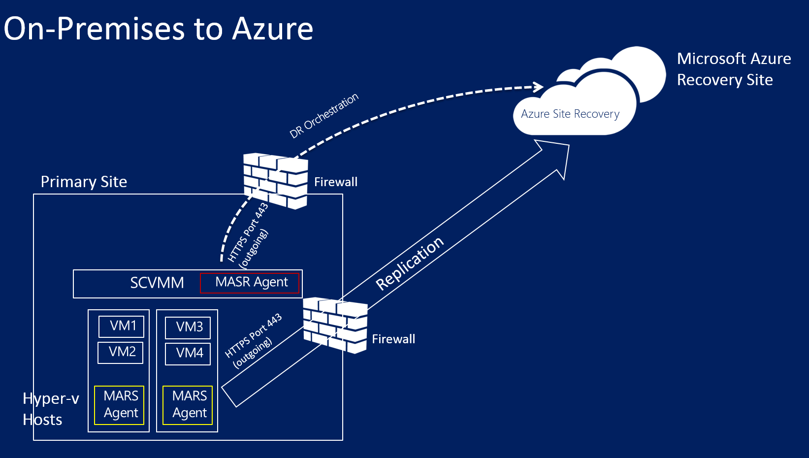

- The Azure Site Recovery Provider is installed on the VMM during Site Recovery deployment and the VMM server is registered in the Site Recovery vault. The Provider communicates with Site Recovery to handle replication orchestration.
- The Azure Recovery Services agent is installed on Hyper-V host servers during Site Recovery deployment. It handles data replication to Azure storage.

## Azure prerequisites

Here's what you'll need in Azure.

**Prerequisite** | **Details**
--- | ---
**Azure account**| You'll need a [Microsoft Azure](https://azure.microsoft.com/) account. You can start with a [free trial](https://azure.microsoft.com/pricing/free-trial/). [Learn more](https://azure.microsoft.com/pricing/details/site-recovery/) about Site Recovery pricing.
**Azure storage** | You'll need an Azure storage account to store replicated data. Replicated data is stored in Azure storage and Azure VMs are spun up when failover occurs.   You need a [standard geo-redundant storage account](../storage/storage-redundancy.md#geo-redundant-storage). The account must in the same region as the Site Recovery service, and be associated with the same subscription. Note that replication to premium storage accounts isn't currently supported and shouldn't be used.  [Read about](../storage/storage-introduction.md) Azure storage.
**Azure network** | You'll need an Azure virtual network that Azure VMs will connect to when failover occurs. The Azure virtual network must be in the same region as the Site Recovery vault.

## On-premises prerequisites

Here's what you'll need on-premises.

**Prerequisite** | **Details**
--- | ---
**VMM** | You'll need at least one VMM server deployed as a physical or virtual standalone server, or as a virtual cluster.   The VMM server should be running System Center 2012 R2 with the latest cumulative updates.  You'll need at least one cloud configured on the VMM server.  The source cloud that you want to protect must contain one or more VMM host groups.  Learn more about setting up VMM clouds in [Walkthrough: Creating private clouds with System Center 2012 SP1 VMM](http://blogs.technet.com/b/keithmayer/archive/2013/04/18/walkthrough-creating-private-clouds-with-system-center-2012-sp1-virtual-machine-manager-build-your-private-cloud-in-a-month.aspx) on Keith Mayer's blog.
**Hyper-V** | You'll need one or more Hyper-V host servers or clusters in the VMM cloud. The host server should have and one or more VMs.   The Hyper-V server must be running on at least Windows Server 2012 R2 with the Hyper-V role and have the latest updates installed.  Any Hyper-V server containing VMs you want to protect must be located in a VMM cloud.  If you're running Hyper-V in a cluster note that cluster broker isn't created automatically if you have a static IP address-based cluster. You'll need to configure the cluster broker manually. [Learn more](https://www.petri.com/use-hyper-v-replica-broker-prepare-host-clusters) in Aidan Finn's blog entry.
**Protected machines** | VMs you want to protect should comply with [Azure requirements](site-recovery-best-practices.md#azure-virtual-machine-requirements).

## Network mapping prerequisites
When you protect virtual machines in Azure network mapping maps between VM networks on the source VMM server and target Azure networks to enable the following:

- All machines which failover on the same network can connect to each other, irrespective of which recovery plan they are in.
- If a network gateway is setup on the target Azure network, virtual machines can connect to other on-premises virtual machines.
- If you don’t configure network mapping only virtual machines that fail over in the same recovery plan will be able to connect to each other after failover to Azure.

If you want to deploy network mapping you'll need the following:

- The virtual machines you want to protect on the source VMM server should be connected to a VM network. That network should be linked to a logical network that is associated with the cloud.
- An Azure network to which replicated virtual machines can connect after failover. You'll select this network at the time of failover. The network should be in the same region as your Azure Site Recovery subscription.

Prepare for network mapping as follows:

1. [Read about](site-recovery-network-mapping.md) network mapping requirements.
2. Prepare VM networks in VMM:

	- [Set up logical networks](https://technet.microsoft.com/library/jj721568.aspx).
	- [Set up VM networks](https://technet.microsoft.com/library/jj721575.aspx).

## Step 1: Create a Site Recovery vault

1. Sign in to the [Management Portal](https://portal.azure.com) from the VMM server you want to register.
2. Click **Data Services** > **Recovery Services** > **Site Recovery Vault**.
3. Click **Create New** > **Quick Create**.
4. In **Name**, enter a friendly name to identify the vault.
5. In **Region**, select the geographic region for the vault. To check supported regions see Geographic Availability in [Azure Site Recovery Pricing Details](https://azure.microsoft.com/pricing/details/site-recovery/).
6. Click **Create vault**.

	

Check the status bar to confirm that the vault was successfully created. The vault will be listed as **Active** on the main Recovery Services page.

## Step 2: Generate a vault registration key

Generate a registration key in the vault. After you download the Azure Site Recovery Provider and install it on the VMM server, you'll use this key to register the VMM server in the vault.

1. In the **Recovery Services** page, click the vault to open the Quick Start page. Quick Start can also be opened at any time using the icon.

	

2. In the dropdown list, select **Between an on-premises VMM site and Microsoft Azure**.
3. In **Prepare VMM Servers**, click **Generate registration key** file. The key file is generated automatically and is valid for 5 days after it's generated. If you're not accessing the Azure portal from the VMM server you'll need to copy this file to the server.

	

## Step 3: Install the Azure Site Recovery Provider

1. In **Quick Start** > **Prepare VMM servers**, click **Download Microsoft Azure Site Recovery Provider for installation on VMM servers** to obtain the latest version of the Provider installation file.
2. Run this file on the source VMM server.

	>[AZURE.NOTE] If VMM is deployed in a cluster and you're installing the Provider for the first time install it on an active node and finish the installation to register the VMM server in the vault. Then install the Provider on the other nodes. Note that if you're upgrading the Provider you'll need to upgrade on all nodes because they should all be running the same Provider version.
	
3. The Installer does a prerequirements check and requests permission to stop the VMM service to begin Provider setup. The VMM Service will be restarted automatically when setup finishes. If you're installing on a VMM cluster you'll be prompted to stop the Cluster role.

4. In **Microsoft Update** you can opt in for updates. With this setting enabled Provider updates will be installed according to your Microsoft Update policy.

	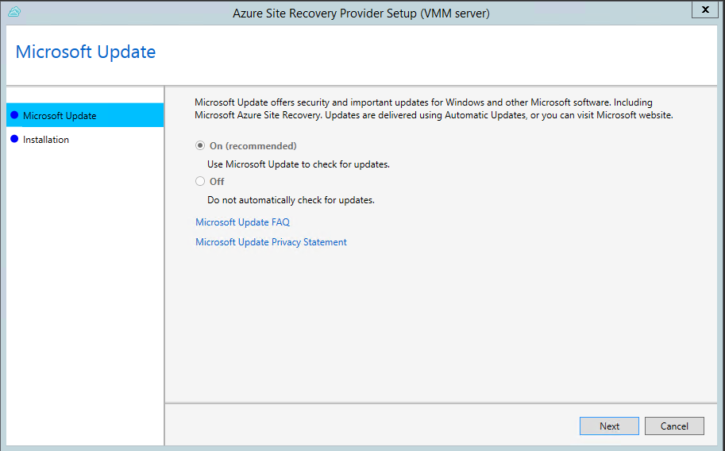

5.  The install location for the Provider is set to **<SystemDrive>\Program Files\Microsoft System Center 2012 R2\Virtual Machine Manager\bin**. Click **Install**.

	

6. After the Provider is installed click **Register** to register the server in the vault.

	

9. In **Vault name**, verify the name of the vault in which the server will be registered. Click *Next*.

	

7. In **Internet Connection** specify how the Provider running on the VMM server connects to the Internet. Select **Connect with existing proxy settings** to use the default Internet connection settings configured on the server.

	

	- If you want to use a custom proxy you should set it up before you install the Provider. When you configure custom proxy settings a test will run to check the proxy connection.
	- If you do use a custom proxy, or your default proxy requires authentication you'll need to enter the proxy details, including the proxy address and port.
	- Following urls should be accessible from the VMM Server and the Hyper-v hosts
		- *.hypervrecoverymanager.windowsazure.com
		- *.accesscontrol.windows.net
		- *.backup.windowsazure.com
		- *.blob.core.windows.net
		- *.store.core.windows.net
	- Allow the IP addresses described in [Azure Datacenter IP Ranges](https://www.microsoft.com/download/confirmation.aspx?id=41653) and HTTPS (443) protocol. You would have to white-list IP ranges of the Azure region that you plan to use and that of West US.
	- If you use a custom proxy a VMM RunAs account (DRAProxyAccount) will be created automatically using the specified proxy credentials. Configure the proxy server so that this account can authenticate successfully. The VMM RunAs account settings can be modified in the VMM console. To do this, open the **Settings** workspace, expand **Security**, click **Run As Accounts**, and then modify the password for DRAProxyAccount. You’ll need to restart the VMM service so that this setting takes effect.

8. In **Registration Key**, select the key that you downloaded from Azure Site Recovery and copied to the VMM server.

10.  The encryption setting is only used when you're replicating Hyper-V VMs in VMM clouds to Azure. If you're replicating to a secondary site it's not used.

11.  In **Server name**, specify a friendly name to identify the VMM server in the vault. In a cluster configuration specify the VMM cluster role name.
12.  In **Synchronize cloud metadata** select whether you want to synchronize metadata for all clouds on the VMM server with the vault. This action only needs to happen once on each server. If you don't want to synchronize all clouds, you can leave this setting unchecked and synchronize each cloud individually in the cloud properties in the VMM console.

13.  Click **Next** to complete the process. After registration, metadata from the VMM server is retrieved by Azure Site Recovery. The server is displayed on the  **VMM Servers** tab on the **Servers** page in the vault.
 	
	

After registration, metadata from the VMM server is retrieved by Azure Site Recovery. The server is displayed on the **VMM Servers** tab on the **Servers** page in the vault.

### Command line installation

The Azure Site Recovery Provider can also be installed using the following command line. This method can be used to install the provider on a Server Core for Windows Server 2012 R2.

1. Download the Provider installation file and registration key to a folder. For example: C:\ASR.
2. Stop the System Center Virtual Machine Manager service
3. From an elevated command prompt, extract the Provider installer with these commands:

    	C:\Windows\System32> CD C:\ASR
    	C:\ASR> AzureSiteRecoveryProvider.exe /x:. /q

4. Install the provider as follows:

		C:\ASR> setupdr.exe /i

5. Register the Provider as follows:

    	CD C:\Program Files\Microsoft System Center 2012 R2\Virtual Machine Manager\bin
    	C:\Program Files\Microsoft System Center 2012 R2\Virtual Machine Manager\bin\> DRConfigurator.exe /r  /Friendlyname <friendly name of the server> /Credentials <path of the credentials file> /EncryptionEnabled <full file name to save the encryption certificate>       

Where parameters are as follows:

 - **/Credentials** : Mandatory parameter that specifies the location in which the registration key file is located  
 - **/FriendlyName** : Mandatory parameter for the name of the Hyper-V host server that appears in the Azure Site Recovery portal.
 - **/EncryptionEnabled** : Optional parameter to specify if you want to encryption your virtual machines in Azure (at rest encryption). The file name should have a **.pfx** extension.
 - **/proxyAddress** : Optional parameter that specifies the address of the proxy server.
 - **/proxyport** : Optional parameter that specifies the port of the proxy server.
 - **/proxyUsername** : Optional parameter that specifies the proxy user name.
 - **/proxyPassword** :Optional parameter that specifies the proxy password.  

## Step 4: Create an Azure storage account

1. If you don't have an Azure storage account click **Add an Azure Storage Account** to create an account.
2. Create an account with geo-replication enabled. It must in the same region as the Azure Site Recovery service, and be associated with the same subscription.

	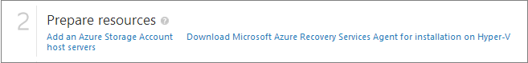

## Step 5: Install the Azure Recovery Services Agent

Install the Azure Recovery Services agent on each Hyper-V host server in the VMM cloud.

1. Click **Quick Start** > **Download Azure Site Recovery Services Agent and install on hosts** to obtain the latest version of the agent installation file.

	

2. Run the installation file on each Hyper-V host server.
3. On the **Prerequisites Check** page click **Next**. Any missing prerequisites will be automatically installed.

	

4. On the **Installation Settings** page, specify where you want to install the agent and select the cache location in which backup metadata will be installed. Then click **Install**.
5. After installation finishes click **Close** to complete the wizard.

	

### Command line installation

You can also install the Microsoft Azure Recovery Services Agent from the command line using this command:

    marsagentinstaller.exe /q /nu

## Step 6: Configure cloud protection settings

After the VMM server is registered, you can configure cloud protection settings. You enabled the option **Synchronize cloud data with the vault** when you installed the Provider so all clouds on the VMM server will appear in the <b>Protected Items</b> tab in the vault.

1. On the Quick Start page, click **Set up protection for VMM clouds**.
2. On the **Protected Items** tab, click on the cloud you want to configure and go to the **Configuration** tab.
3. In **Target** select **Azure**.
4. In **Storage Account** select the Azure storage account you use for replication.
5. Set **Encrypt stored data** to **Off**. This setting specifies that data should be encrypted replicated between the on-premises site and Azure.
6. In **Copy frequency** leave the default setting. This value specifies how frequently data should be synchronized between source and target locations.
7. In **Retain recovery points for**, leave the default setting. With a default value of zero, only the latest recovery point for a primary virtual machine is stored on a replica host server.
8. In **Frequency of application-consistent snapshots**, leave the default setting. This value specifies how often to create snapshots. Snapshots use Volume Shadow Copy Service (VSS) to ensure that applications are in a consistent state when the snapshot is taken.  If you do set a value, make sure it's less than the number of additional recovery points you configure.
9. In **Replication start time**, specify when initial replication of data to Azure should start. The timezone on the Hyper-V host server will be used. We recommend that you schedule the initial replication during off-peak hours.

	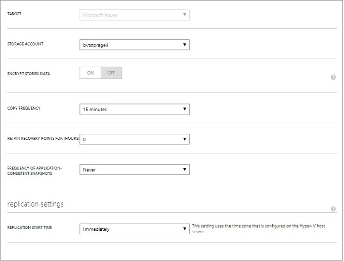

After you save the settings a job will be created and can be monitored on the **Jobs** tab. All Hyper-V host servers in the VMM source cloud will be configured for replication.

After saving, cloud settings can be modified on the **Configure** tab. To modify the target location or target storage account you'll need to remove the cloud configuration, and then reconfigure the cloud. Note that if you change the storage account the change is only applied for virtual machines that are enabled for protection after the storage account has been modified. Existing virtual machines are not migrated to the new storage account.

## Step 7: Configure network mapping
Before you begin network mapping verify that virtual machines on the source VMM server are connected to a VM network. In addition create one or more Azure virtual networks. Note that multiple VM networks can be mapped to a single Azure network.

1. On the Quick Start page, click **Map networks**.
2. On the **Networks** tab, in **Source location**, select the source VMM server. In **Target location** select Azure.
3. In **Source** networks a list of VM networks associated with the VMM server are displayed. In **Target** networks the Azure networks associated with the subscription are displayed.
4. Select the source VM network and click **Map**.
5. On the **Select a Target Network** page, select the target Azure network you want to use.
6. Click the check mark to complete the mapping process.

	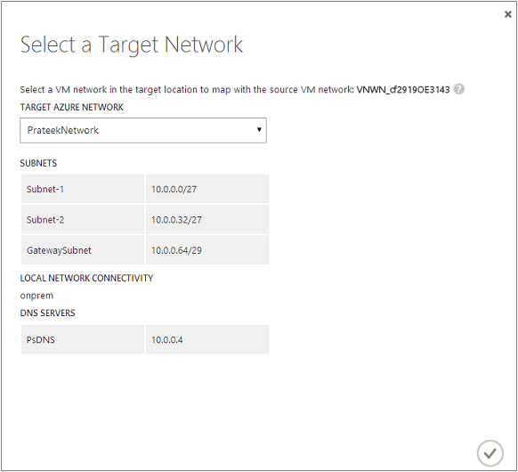

After you save the settings a job starts to track the mapping progress and it can be monitored on the Jobs tab. Any existing replica virtual machines that correspond to the source VM network will be connected to the target Azure networks. New virtual machines that are connected to the source VM network will be connected to the mapped Azure network after replication. If you modify an existing mapping with a new network, replica virtual machines will be connected using the new settings.

Note that if the target network has multiple subnets and one of those subnets has the same name as subnet on which the source virtual machine is located, then the replica virtual machine will be connected to that target subnet after failover. If there’s no target subnet with a matching name, the virtual machine will be connected to the first subnet in the network.

## Step 8: Enable protection for virtual machines

After servers, clouds, and networks are configured correctly, you can enable protection for virtual machines in the cloud. Note the following:

- Virtual machines must meet [Azure requirements](site-recovery-best-practices.md#azure-virtual-machine-requirements).
- To enable protection the operating system and operating system disk properties must be set for the virtual machine. When you create a virtual machine in VMM using a virtual machine template you can set the property. You can also set these properties for existing virtual machines on the **General** and **Hardware Configuration** tabs of the virtual machine properties. If you don't set these properties in VMM you'll be able to configure them in the Azure Site Recovery portal.

	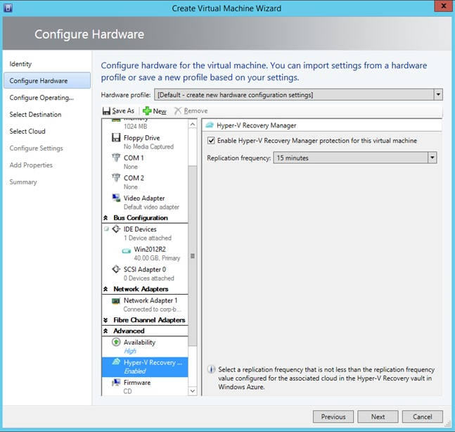

	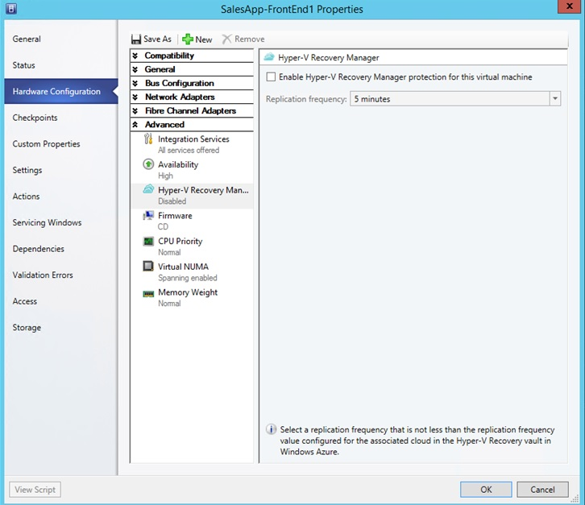

1. To enable protection, on the **Virtual Machines** tab in the cloud in which the virtual machine is located, click **Enable protection** > **Add virtual machines**.
2. From the list of virtual machines in the cloud, select the one you want to protect.

	

	Track progress of the **Enable Protection** action in the **Jobs** tab, including the initial replication. After the **Finalize Protection** job runs the virtual machine is ready for failover. After protection is enabled and virtual machines are replicated, you’ll be able to view them in Azure.

	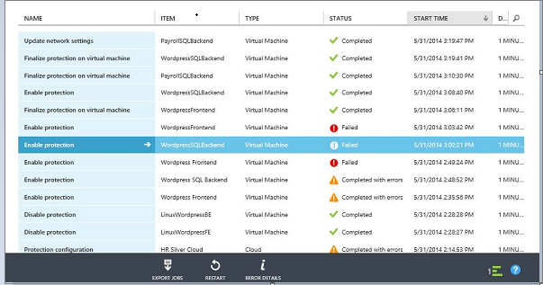

3. Verify the virtual machine properties and modify as required.

	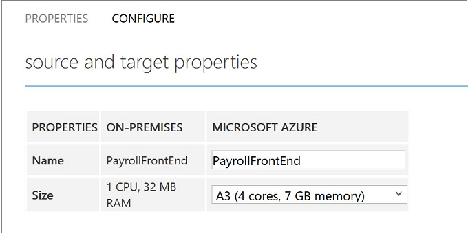

4. On the **Configure** tab of the virtual machine properties following network properties can be modified.

- **Number of network adapters on the target virtual machine** - The number of network adapters is dictated by the size you specify for the target virtual machine. Check [virtual machine size specs](../virtual-machines/virtual-machines-linux-sizes.md#size-tables) for the number of adapters supported by the virtual machine size. When you modify the size for a virtual machine and save the settings, the number of network adapter will change when you open **Configure** page the next time. The number of network adapters of target virtual machines is the minimum number of network adapters on source virtual machine and the maximum number of network adapters supported by the size of the virtual machine chosen, as follows:

	- If the number of network adapters on the source machine is less than or equal to the number of adapters allowed for the target machine size, then the target will have the same number of adapters as the source.
	- If the number of adapters for the source virtual machine exceeds the number allowed for the target size then the target size maximum will be used.
	- For example, if a source machine has two network adapters and the target machine size supports four, the target machine will have two adapters. If the source machine has two adapters but the supported target size only supports one then the target machine will have only one adapter. 	

- **Network of the target virtual machine** - The network to which the virtual machine connects to is determined by network mapping of the network of source virtual machine. If the source virtual machine has more than one network adapter and source networks are mapped to different networks on target, then you'll need to choose between one of the target networks.
- **Subnet of each network adapter** - For each network adapter you can select the subnet to which the failed over virtual machine would connect to.
- **Target IP address** - If the network adapter of source virtual machine is configured to use a static IP address then you can provide the IP address for the target virtual machine. Use this feature retain the IP address of a source virtual machine after a failover. If no IP address is provided then any available IP address is given to the network adapter at the time of failover. If the target IP address is specified but is already used by another virtual machine running in Azure then failover will fail.  

	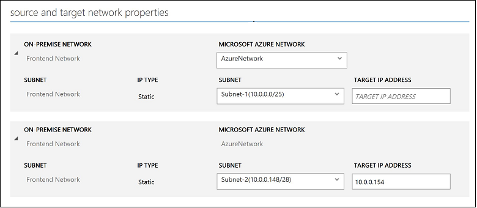

>[AZURE.NOTE] Linux virtual machines with static IP address aren't supported.

## Test the deployment

To test your deployment you can run a test failover for a single virtual machine, or create a recovery plan consisting of multiple virtual machines, and run a test failover for the plan.  

Test failover simulates your failover and recovery mechanism in an isolated network. Note that:

- If you want to connect to the virtual machine in Azure using Remote Desktop after the failover, enable Remote Desktop Connection on the virtual machine before you run the test failover.
- After failover you'll use a public IP address to connect to the virtual machine in Azure using Remote Desktop. If you want to do this, ensure you don't have any domain policies that prevent you from connecting to a virtual machine using a public address.

>[AZURE.NOTE] To get the best performance when you do a failover to Azure, ensure that you have installed the Azure Agent in the protected machine. This helps in booting faster and also helps in diagnosis in case of issues. Linux agent can be found [here](https://github.com/Azure/WALinuxAgent) - and Windows agent can be found [here](http://go.microsoft.com/fwlink/?LinkID=394789)

### Create a recovery plan

1. On the **Recovery Plans** tab, add a new plan. Specify a name, **VMM** in **Source type**, and the source VMM server in **Source**, The target will be Azure.

	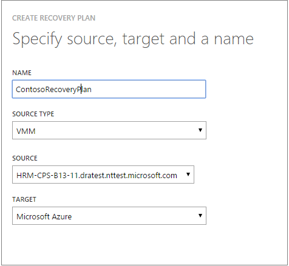

2. In the **Select Virtual Machines** page, select virtual machines to add to the recovery plan. These virtual machines are added to the recovery plan default group—Group 1. A maximum of 100 virtual machines in a single recovery plan have been tested.

	- If you want to verify the virtual machine properties before adding them to the plan, click the virtual machine on the properties page of the cloud in which it’s located. You can also configure the virtual machine properties in the VMM console.
	- All of the virtual machines that are displayed have been enabled for protection. The list includes both virtual machines that are enabled for protection and initial replication has completed, and those that are enabled for protection with initial replication pending. Only virtual machines with initial replication completed can fail over as part of a recovery plan.

	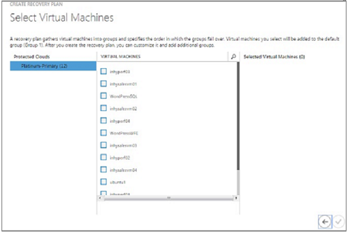

After a recovery plan has been created it appears in the **Recovery Plans** tab. You can also add [Azure automation runbooks](site-recovery-runbook-automation.md) to the recovery plan to automate actions during failover.

### Run a test failover

There are two ways to run a test failover to Azure.

- **Test failover without an Azure network**—This type of test failover checks that the virtual machine comes up correctly in Azure. The virtual machine won’t be connected to any Azure network after failover.
- **Test failover with an Azure network**—This type of failover checks that the entire replication environment comes up as expected and that failed over the virtual machines will be connected to the specified target Azure network. For subnet handling, for test failover the subnet of the test virtual machine will be figured out based on the subnet of the replica virtual machine. This is different to regular replication when the subnet of a replica virtual machine is based on the subnet of the source virtual machine.

If you want to run a test failover for a virtual machine enabled for protection to Azure without specifying an Azure target network you don’t need to prepare anything. To run a test failover with a target Azure network you’ll need to create a new Azure network that’s isolated from your Azure production network (default behavior when you create a new network in Azure). Look at how to [run a test failover](site-recovery-failover.md#run-a-test-failover) for more details.

You'll also need to set up the infrastructure for the replicated virtual machine to work as expected. For example, a virtual machine with Domain Controller and DNS can be replicated to Azure using Azure Site Recovery and can be created in the test network using Test Failover. Look at [test failover considerations for active directory](site-recovery-active-directory.md#considerations-for-test-failover) section for more details.

To run a test failover do the following:

1. On the **Recovery Plans** tab, select the plan and click **Test Failover**.
2. On the **Confirm Test Failover** page select **None** or a specific Azure network.  Note that if you select None the test failover will check that the virtual machine replicated correctly to Azure but doesn't check your replication network configuration.

	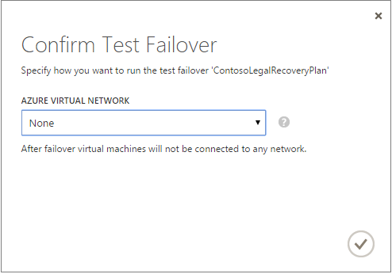

3. If data encryption is enabled for the cloud, in **Encryption Key** select the certificate that was issued during installation of the Provider on the VMM server, when you turned on the option to enable data encryption for a cloud.
4. On the **Jobs** tab you can track failover progress. You should also be able to see the virtual machine test replica in the Azure portal. If you’re set up to access virtual machines from your on-premises network you can initiate a Remote Desktop connection to the virtual machine.
5. When the failover reaches the **Complete testing** phase , click **Complete Test** to finish up the test failover. You can drill down to the **Job** tab to track failover progress and status, and to perform any actions that are needed.
6. After  failover you'll be able to see the virtual machine test replica in the Azure portal. If you’re set up to access virtual machines from your on-premises network you can initiate a Remote Desktop connection to the virtual machine. Do the following:

    1. Verify that the virtual machines start successfully.
    2. If you want to connect to the virtual machine in Azure using Remote Desktop after the failover, enable Remote Desktop Connection on the virtual machine before you run the test failover. You'll  also need to add an RDP endpoint on the virtual machine. You can leverage an [Azure Automation Runbooks](site-recovery-runbook-automation.md) to do that.
    3. After failover if you use a public IP address to connect to the virtual machine in Azure using Remote Desktop, ensure you don't have any domain policies that prevent you from connecting to a virtual machine using a public address.

7.  After the testing is complete do the following:
	- Click **The test failover is complete**. Clean up the test environment to automatically power off and delete the test virtual machines.
	- Click **Notes** to record and save any observations associated with the test failover.

>

## Next steps

Learn about [setting up recovery plans](site-recovery-create-recovery-plans.md) and [failover](site-recovery-failover.md).
