<properties
	pageTitle="Replicate Hyper-V virtual machines in VMM clouds to Azure using Azure Site Recovery with the Azure portal | Microsoft Azure"
	description="Describes how to deploy Azure Site Recovery to orchestrate replication, failover and recovery of Hyper-V VMs in VMM clouds to Azure using the Azure portal"
	services="site-recovery"
	documentationCenter=""
	authors="rayne-wiselman"
	manager="jwhit"
	editor="tysonn"/>

<tags
	ms.service="site-recovery"
	ms.workload="backup-recovery"
	ms.tgt_pltfrm="na"
	ms.devlang="na"
	ms.topic="hero-article"
	ms.date="05/10/2016"
	ms.author="raynew"/>

# Replicate Hyper-V virtual machines in VMM clouds to Azure using Azure Site Recovery with the Azure portal | Microsoft Azure

> [AZURE.SELECTOR]
- [Azure Portal](site-recovery-vmm-to-azure.md)
- [Azure Classic](site-recovery-vmm-to-azure-classic.md)
- [PowerShell ARM](site-recovery-vmm-to-azure-powershell-resource-manager.md)
- [PowerShell Classic](site-recovery-deploy-with-powershell.md)

Welcome to Azure Site Recovery! Use this article if you want to replicate on-premises Hyper-V  virtual machines managed in System Center Virtual Machine Manager (VMM) clouds to Azure using Azure Site Recovery in the Azure portal.

> [AZURE.NOTE] Azure has two different [deployment models](../resource-manager-deployment-model
> ) for creating and working with resources: Azure Resource Manager (ARM) and classic. Azure also has two portals – the Azure classic portal that supports the classic deployment model, and the Azure portal with support for both deployment models. 

Azure Site Recovery in the Azure portal provides a number of new features:

- In the Azure portal the Azure Backup and Azure Site Recovery services are combined into a single Recovery Services vault so that you can set up and manage business continuity and disaster recovery (BCDR) from a single location. A unified dashboard allows you monitor and manage operations across your on-premises sites and the Azure public cloud.
- Users with Azure subscriptions provisioned with the Cloud Solution Provider (CSP) program can now manage Site Recovery operations in the Azure portal.
- Site Recovery in the Azure portal can replicate machines to ARM storage accounts. At failover, Site Recovery creates ARM-based VMs in Azure.
- Site Recovery  continues to support replication to classic storage accounts. At failover, Site Recovery creates VMs using the classic model.

After reading this article post any comments at the bottom in the Disqus comments. Ask technical questions on the [Azure Recovery Services Forum](https://social.msdn.microsoft.com/forums/azure/home?forum=hypervrecovmgr).

## Overview

Organizations need a BCDR strategy that determines how apps, workloads, and data stay running and available during planned and unplanned downtime, and recover to normal working conditions as soon as possible. Your BCDR strategy should keep business data safe and recoverable, and ensure that workloads remain continuously available when disaster occurs.

Site Recovery is an Azure service that contributes to your BCDR strategy by orchestrating replication of on-premises physical servers and virtual machines to the cloud (Azure) or to a secondary datacenter. When outages occur in your primary location, you fail over to the secondary location to keep apps and workloads available. You fail back to your primary location when it returns to normal operations. Learn more in [What is Azure Site Recovery?](site-recovery-overview.md)

This article provides all the information you need to replicate on-premises Hyper-V VMs in VMM clouds to Azure. It includes an architectural overview, planning information, and deployment steps for configuring Azure, on-premises servers, replication settings, and capacity planning. After you've set up the infrastructure you can enable replication on machines you want to protect, and check that failover works.

## Business advantages

- Site Recovery provides off-site protection for business workloads and applications running on Hyper-V VMs. 
- The Recovery Services portal provides a single location to set up, manage, and monitor replication, failover, and recovery. 
- You can run easily run failovers from your on-premises infrastructure to Azure, and failback (restore) from Azure to Hyper-V host servers in your on-premises site. 
- You can configure recovery plans with multiple machines so that tiered application workloads fail over together. 

## Scenario architecture

These are the scenario components: 

- **VMM server**: An on-premises VMM server with one or more clouds.
- **Hyper-V host or cluster**: Hyper-V host servers or clusters managed in VMM clouds.
- **Azure Site Recovery Provider and Recovery services agent**: During deployment you install the Azure Site Recovery Provider on the VMM server, and the Microsoft Azure Recovery Services agent on Hyper-V host servers. The Provider on the VMM server communicates with Site Recovery over HTTPS 443 to replicate orchestration. The agent on the Hyper-V host server replicates data to Azure storage over HTTPS 443 by default.
- **Azure**: You need an Azure subscription, an Azure storage account to store replicated data, and an Azure virtual network so that Azure VMs are connected to a network after failover.

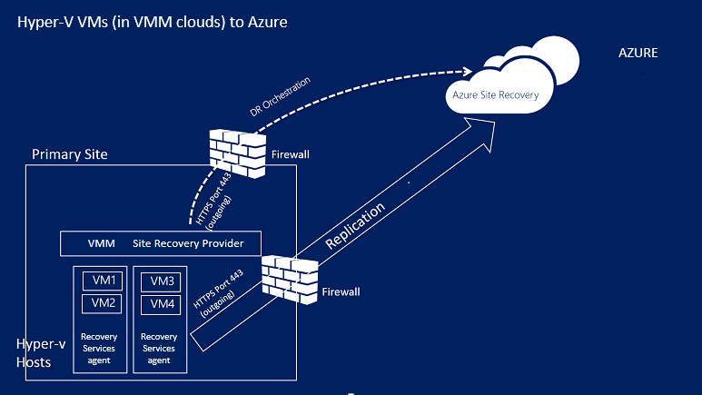

## Azure prerequisites

Here's what you'll need in Azure to deploy this scenario.

**Prerequisite** | **Details**
--- | ---
**Azure account**| You'll need a [Microsoft Azure](http://azure.microsoft.com/) account. You can start with a [free trial](https://azure.microsoft.com/pricing/free-trial/). [Learn more](https://azure.microsoft.com/pricing/details/site-recovery/) about Site Recovery pricing. 
**Azure storage** | You'll need a standard Azure storage account to store replicated data. You can use an LRS or GRS storage account. We recommend GRS so that data is resilient if a regional outage occurs, or if the primary region can't be recovered. [Learn more](../storage/storage-redundancy.md). The account must be in the same region as the Recovery Services vault.  Premium storage isn't supported.   Replicated data is stored in Azure storage and Azure VMs are created when failover occurs.    [Read about](../storage/storage-introduction.md) Azure storage.
**Azure network** | You'll need an Azure virtual network that Azure VMs will connect to when failover occurs. The network must be in the same region as the Recovery Services vault.

## On-premises prerequisites

Here's what you need on-premises

**Prerequisite** | **Details**
--- | ---
**VMM**| One or more VMM servers running on System Center 2012 R2. Each VMM server should have one or more clouds configured. A cloud should contain:   One or more VMM host groups.   One or more Hyper-V host servers or clusters in each host group.  [Learn more](http://www.server-log.com/blog/2011/8/26/vmm-2012-and-the-clouds.html) about setting up VMM clouds.
**Hyper-V** | Hyper-V host servers must be running at least Windows Server 2012 R2 with Hyper-V role and have the latest updates installed.   A Hyper-V server should contain one or more VMs.   A Hyper-V host server or cluster that includes VMs you want to replicate must be managed in a VMM cloud.  Hyper-V servers should be connected to the Internet, either directly or via a proxy.  Hyper-V servers should have fixes mentioned in article [2961977](https://support.microsoft.com/kb/2961977) installed.  Hyper-V host servers need internet access for data replication to Azure. 
**Provider and agent** | During Azure Site Recovery deployment you’ll install the Azure Site Recovery Provider on the VMM server and the Recovery Services agent on Hyper-V hosts. The Provider and agent will need to connect to Azure over the internet directly or through a proxy. Note that an HTTPS-based proxy isn't supported. The proxy server on the VMM server and Hyper-V hosts should allow access to:    *.hypervrecoverymanager.windowsazure.com    *.accesscontrol.windows.net    *.backup.windowsazure.com    *.blob.core.windows.net    *.store.core.windows.net  If you have IP address-based firewall rules on the VMM server, check that the rules allow communication to Azure. You'll need to allow the [Azure Datacenter IP Ranges](https://www.microsoft.com/download/confirmation.aspx?id=41653) and the HTTPS (433) protocol.  Allow IP address ranges for the Azure region of your subscription, and for West US.  In addition the proxy server on the VMM server will need  access to https://www.msftncsi.com/ncsi.txt

## Protected machine prerequisites

**Prerequisite** | **Details**
--- | ---
**Protected VMs** | Before you fail over a VM you'll need to make sure that the name that will be assigned to the Azure VM complies with [Azure prerequisites](site-recovery-best-practices.md#azure-virtual-machine-requirements). You can modify the name after you've enabled replication for the VM.    Individual disk capacity on protected machines shouldn’t be more than 1023 GB. A VM can have up to 64 disks (thus up to 64 TB).   Shared disk guest clusters aren't supported.   Unified Extensible Firmware Interface (UEFI)/Extensible Firmware Interface(EFI) boot isn't supported.   If the source VM has NIC teaming it’s converted to a single NIC after failover to Azure.  Protecting VMs running Linux with a static IP address isn't supported.

## Prepare for deployment

To prepare for deployment you'll need to:

1. [Set up an Azure network](#set-up-an-azure-network) in which Azure 
2. VMs will be located after failover. 
2. [Set up an Azure storage account](#set-up-an-azure-storage-account) for replicated data.
4. [Prepare the VMM server](#prepare-the-vmm-server) for Site Recovery deployment. 
5. [Prepare for network mapping](#prepare-for-network-mapping). Set up networks so that you can configure network mapping during Site Recovery deployment.

### Set up an Azure network

You need an Azure network so that the Azure VMs created after failover will be connected to it.

- The network should be in the same region as the one in which you'll deploy the Recovery Services vault.
- Depending on the resource model you want to use for failed over Azure VMs, you’ll set up the Azure network in [ARM mode](../virtual-network/virtual-networks-create-vnet-arm-pportal.md) or [classic mode](../virtual-network/virtual-networks-create-vnet-classic-pportal.md).
- We recommend you set up a network before you begin. If you don't you'll need to do it during Site Recovery deployment.

### Set up an Azure storage account

- You’ll need a standard Azure storage account to hold data replicated to Azure. The account must be in the same region as the Recovery Services vault.
- Depending on the resource model you want to use for failed over Azure VMs, you'll set up an account in [ARM mode](../storage/storage-create-storage-account.md) or [classic mode](../storage/storage-create-storage-account-classic-portal.md).
- We recommend that you set up an account before you begin. If you don't you'll need to do it during Site Recovery deployment.

### Prepare the VMM server

- Make sure that the VMM server complies with the [prerequisites](#on-premises-prerequisites).
- During Site Recovery deployment you can specify that all clouds on a VMM server should be available in the Azure portal. If you only want specific clouds to appear in the portal you can enable that setting on the cloud in the VMM admin console. 

### Prepare for network mapping

You'll need to set up network mapping during Site Recovery deployment. Network mapping maps between source VMM VM networks and target Azure networks to enable the following:

- Machines that fail over on the same network can connect to each other, even if they're not failed over in the same way or in the same recovery plan.
- If a network gateway is set up on the target Azure network, Azure virtual machines can connect to on-premises virtual machines.
- To set up network mapping here's what you'll need to prepare:

	- Make sure that VMs on the source Hyper-V host server are connected to a VMM VM network. That network should be linked to a logical network that is associated with the cloud.
	- An Azure network as described [above](#set-up-an-azure-network)

- [Learn more](site-recovery-network-mapping.md) about how network mapping works.

## Create a Recovery Services vault

1. Sign in to the [Azure portal](https://portal.azure.com).
2. Click **New** > **Management** > **Recovery Services**. Alternatively you can click **Browse** > **Recovery Services** vaults > **Add**.

	

3. In **Name** specify a friendly name to identify the vault. If you have more than one subscription, select one of them.
4. [Create a new resource group](../resource-group-template-deploy-portal.md) or select an existing one. Specify an Azure region. Machines will be replicated to this region. To check supported regions see Geographic Availability in [Azure Site Recovery Pricing Details](https://azure.microsoft.com/pricing/details/site-recovery/)
4. If you want to quickly access the vault from the Dashboard click **Pin to dashboard** and then click **Create vault**.

	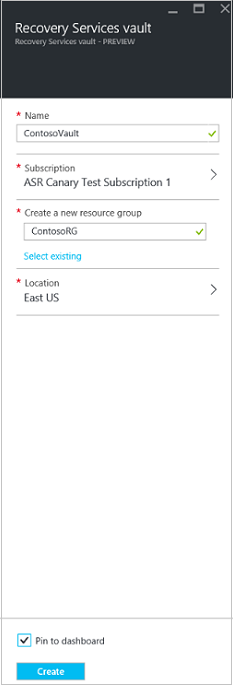

The new vault will appear on the **Dashboard** > **All resources**, and on the main **Recovery Services vaults** blade.

## Getting started

Site Recovery provides a Getting Started experience that helps you deploy as quickly as possible. Getting Started checks prerequisites and walks you through Site Recovery deployment steps in the right order.

In Getting Started you select the type of machines you want to replicate, and where you want to replicate to. You set up on-premises servers, Azure storage accounts, and networks. You create replication policies, and perform capacity planning. After you've set up your infrastructure you enable replication for VMs. You can run failovers for specific machines, or create recovery plans to fail over multiple machines.

Begin Getting Started by choosing how you want to deploy Site Recovery. The Getting Started flow changes slightly depending on your replication requirements.

## Step 1: Choose your protection goals

Select what you want to replicate and where you want to replicate to.

1. In the **Recovery Services vaults** blade select your vault and click **Settings**.
2. In **Getting Started** click **Site Recovery** > **Step 1: Prepare Infrastructure** > **Protection goal**.

	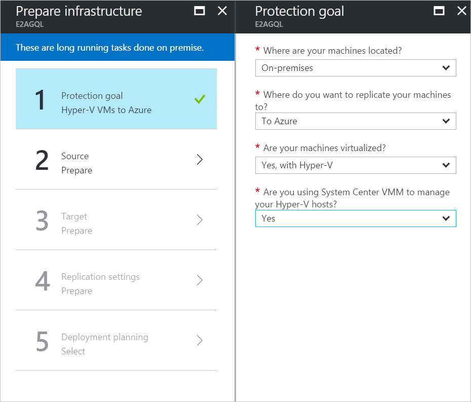

3. In **Protection goal** select **To Azure**, and select **Yes, with Hyper-V**. Select **Yes** to confirm you're using VMM to manage Hyper-V hosts and the recovery site. Then click **OK**.

	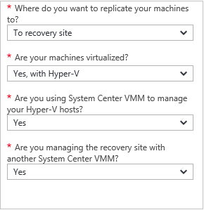

## Step 2: Set up the source environment

Install the Azure Site Recovery Provider on the VMM server, and register the server in the vault. Install the Azure Recovery Services agent on Hyper-V hosts.

1. Click **Step 2: Prepare Infrastructure** > **Source**. 

	

2. In **Prepare source** click **+ VMM** to add a VMM server.

	

3. In the **Add Server** blade check that **System Center VMM server** appears in **Server type** and that the VMM server meets the [prerequisites and URL requirements](#on-premises-prerequisites). 
4. Download the Azure Site Recovery Provider installation file.
5. Download the registration key. You'll need this when you run setup. The key is valid for 5 days after you generate it. 

	

6. Install the Azure Site Recovery Provider on the VMM server.

### Set up the Azure Site Recovery Provider

1.	Run the Provider setup file.
2. In **Microsoft Update** you can opt in for updates so that Provider updates are installed in accordance with your Microsoft Update policy.
3. In **Installation** accept or modify the default Provider installation location and click **Install**.

	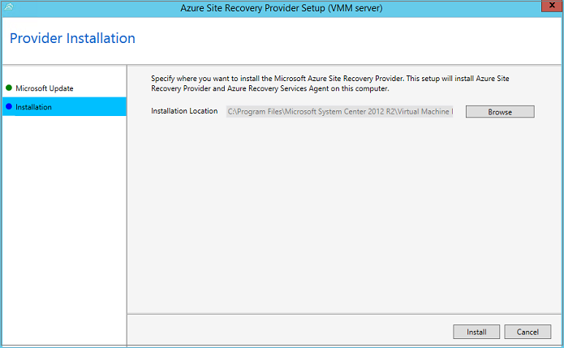

4. When installation finishes click  **Register** to register the VMM server in the vault.
5. In **Vault Settings** page, click **Browse** to select the vault key file. Specify the Azure Site Recovery subscription and the vault name.

	

6. In **Internet Connection** specify how the Provider running on the VMM server will connect to Site Recovery over the internet.

	- If you want the Provider to connect directly select **Connect directly to Azure Site Recovery without a proxy**.
	- If your existing proxy requires authentication, or you want to use a custom proxy select **Connect to Azure Site Recovery using a proxy server**.
	- If you  use a custom proxy you'll need to specify the address, port, and credentials
	- If you're using a proxy you should have already allowed the URLs described in [prerequisites](#on-premises-prerequisites).
	- If you use a custom proxy a VMM RunAs account (DRAProxyAccount) will be created automatically using the specified proxy credentials. Configure the proxy server so that this account can authenticate successfully. The VMM RunAs account settings can be modified in the VMM console. In **Settings**, expand **Security** > **Run As Accounts**, and then modify the password for DRAProxyAccount. You’ll need to restart the VMM service so that this setting takes effect.

	

7. Accept or modify the location of an SSL certificate that’s automatically generated for data encryption. This certificate is used if you enable data encryption for a cloud protected by Azure in the Azure Site Recovery portal. Keep this certificate safe. When you run a failover to Azure you’ll need it to decrypt if data encryption is enabled.

8. In **Server name**, specify a friendly name to identify the VMM server in the vault. In a cluster configuration specify the VMM cluster role name.
9. Enable **Sync cloud metadata** if you want to synchronize metadata for all clouds on the VMM server with the vault. This action only needs to happen once on each server. If you don't want to synchronize all clouds, you can leave this setting unchecked and synchronize each cloud individually in the cloud properties in the VMM console. Click **Register** to complete the process.

	

10. Registration starts. After registration finishes the server is displayed on the **Settings** > **Servers** blade in the vault.

#### Command line installation for the Azure Site Recovery Provider

The Azure Site Recovery Provider can be installed from the command line. This method can be used to install the Provider on Server Core for Windows Server 2012 R2.

1. Download the Provider installation file and registration key to a folder. For example C:\ASR.
2. From an elevated command prompt, run these commands to extract the Provider installer:

	    	C:\Windows\System32> CD C:\ASR
	    	C:\ASR> AzureSiteRecoveryProvider.exe /x:. /q
3. Run this command to install the components:

			C:\ASR> setupdr.exe /i

4. Then run these commands to register the server in the vault:

    	CD C:\Program Files\Microsoft System Center 2012 R2\Virtual Machine Manager\bin
    	C:\Program Files\Microsoft System Center 2012 R2\Virtual Machine Manager\bin\> DRConfigurator.exe /r  /Friendlyname <friendly name of the server> /Credentials <path of the credentials file> /EncryptionEnabled <full file name to save the encryption certificate>       

Where:

- **/Credentials** : Mandatory parameter that specifies where the registration key file is located.  
- **/FriendlyName** : Mandatory parameter for the name of the Hyper-V host server that appears in the Azure Site Recovery portal.
- - **/EncryptionEnabled** : Optional parameter when you're replicating Hyper-V VMs in VMM clouds to Azure. Specify if you want to encrypt virtual machines in Azure (at rest encryption). Ensure that the name of the file has a **.pfx** extension. Encryption is off by default.
- **/proxyAddress** : Optional parameter that specifies the address of the proxy server.
- **/proxyport** : Optional parameter that specifies the port of the proxy server.
- **/proxyUsername** : Optional parameter that specifies the proxy user name (if proxy requires authentication).
- **/proxyPassword** :Optional parameter that specifies the password to authenticate with proxy server (if proxy requires authentication).

### Install the Azure Recovery Services agent on Hyper-V hosts

1. After you've set up the Provider you need to download the installation file for the Azure Recovery Services agent. Run setup on each Hyper-V server in the VMM cloud. 

	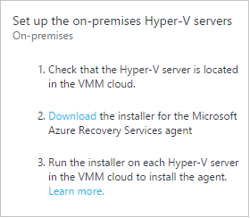

2. On the **Prerequisites Check** page click **Next**. Any missing prerequisites will be automatically installed.

	

3. On the **Installation Settings** page, accept or modify the installation location, and the cache location. You can configure the cache on a drive that has at least 5 GB of storage available but we recommend a cache drive with 600 GB or more of free space. Then click **Install**.
4. After installation is complete click **Close** button to finish.
	
	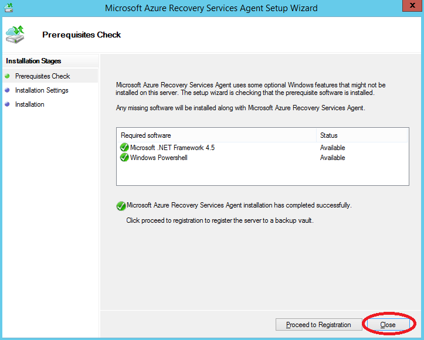

#### Command line installation for Azure Site Recovery Services agent

You can install the Microsoft Azure Recovery Services Agent from command line using the following command: 

     marsagentinstaller.exe /q /nu

#### Set up internet proxy access to Site Recovery from Hyper-V hosts

The Recovery Services agent running on Hyper-V hosts needs internet access to Azure for VM replication. If you're accessing the internet through a proxy set it up as follows:

1. Open the Microsoft Azure Backup MMC snap-in on the Hyper-V host. By default a shortcut for Microsoft Azure Backup is available on the desktop or in C:\Program Files\Microsoft Azure Recovery Services Agent\bin\wabadmin.
2. In the snap-in click **Change Properties**.
3. On the **Proxy Configuration** tab specify proxy server information.

	

4. Ensure that the agent can reach the URLs described in the [prerequisites](#on-premises-prerequisites).

## Step 3: Set up the target environment

Specify the Azure storage account to be used for replication, and the Azure network to which Azure VMs will connect after failover.

1.	Click **Prepare infrastructure** > **Target** and select the Azure subscription you want to use.
2.	Specify the deployment model you want to use for VMs after failover.
3.	Site Recovery checks that you have one or more compatible Azure storage accounts and networks.

		

4.	If you haven't created a storage account and you want to create one using ARM click **+Storage account** to do that inline.  On the **Create storage account** blade specify an account name, type, subscription, and location. The account should be in the same location as the Recovery Services vault.

	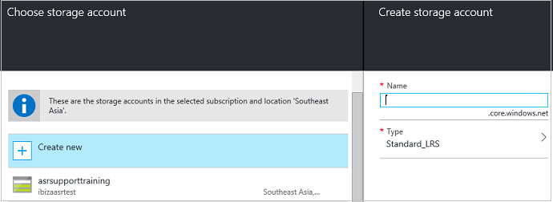	

	Note that:

	- If you want to create a storage account using the classic model you'll do that in the Azure portal. [Learn more](../storage/storage-create-storage-account-classic-portal.md)
	- If you’re using a premium storage account for replicated data you'll need to set up an additional standard storage account to store replication logs that capture ongoing changes to on-premises data.

4.	If you haven't created an Azure network and you want to create one using ARM click **+Network** to do that inline. On the **Create virtual network** blade specify a network name, address range, subnet details, subscription, and location. The network should be in the same location as the Recovery Services vault.

	

	If you want to create a network using the classic model you’ll do that in the Azure portal. [Learn more](../virtual-network/virtual-networks-create-vnet-classic-pportal.md).

### Configure network mapping

- [Read](#prepare-for-network-mapping) a quick overview of what network mapping does. [Read this](site-recovery-network-mapping.md) ) for an more in-depth explanation.
- Verify that virtual machines on the VMM server are connected to a VM network and that you've created at least one Azure virtual network. Note that multiple VM networks can be mapped to a single Azure network.

Configure mapping as follows:

1. In **Settings** > **Site Recovery Infrastructure** > **Network mappings** > **Network Mapping** click the **+Network Mapping** icon.

	

2. On the **Add network mapping** select the source VMM server, and **Azure** as the target.
3. Verify the subscription and the deployment model after failover.
4. In **Source network**, select the source on-premises VM network you want to map from the list associated with the VMM server. 
5. In **Target network** select the Azure network in which replica Azure VMs will be located when they're spun up. Then click **OK**.

	

Here's what happens when network mapping begins:

- Existing VMs on the source VM network will be connected to the target network when mapping  begins.New VMs connected to the source VM network will be connected to the mapped Azure network when replication occurs. 
- If you modify an existing network mapping, replica virtual machines will be connected using the new settings.
- If the target network has multiple subnets and one of those subnets has the same name as subnet on which the source virtual machine is located, then the replica virtual machine will be connected to that target subnet after failover.
- If there’s no target subnet with a matching name, the virtual machine will be connected to the first subnet in the network.

## Step 4: Set up replication settings

1. To create a new replication policy click **Prepare infrastructure** > **Replication Settings** > **+Create and associate**.

	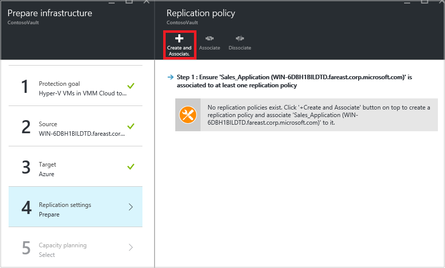

2. In **Create and associate policy** specify a policy name.
3. In **Copy frequency** specify how often you want to replicate delta data after the initial replication (every 30 seconds, 5 or 15 minutes).
4. In **Recovery point retention**, specify in hours how long the retention window will be for each recovery point. Protected machines can be recovered to any point within a window.
6. In **App-consistent snapshot frequency** specify how frequently (1-12 hours) recovery points containing application-consistent snapshots will be created. Hyper-V uses two types of snapshots — a standard snapshot that provides an incremental snapshot of the entire virtual machine, and an application-consistent snapshot that takes a point-in-time snapshot of the application data inside the virtual machine. Application-consistent snapshots use Volume Shadow Copy Service (VSS) to ensure that applications are in a consistent state when the snapshot is taken. Note that if you enable application-consistent snapshots, it will affect the performance of applications running on source virtual machines. Ensure that the value you set is less than the number of additional recovery points you configure.
3. In **Initial replication start time** specify when to start the initial replication. The replication occurs over your internet bandwidth so you might want to schedule it outside your busy hours.
5. In **Encrypt data stored on Azure** specify whether to encrypt at rest data in Azure storage. Then click **OK**.

	

6. When you create a new policy it's automatically associated with the VMM cloud. Click **OK**. You can associate additional VMM Clouds (and the VMs in them) with this replication policy in **Settings** > **Replication** > policy name > **Associate VMM Cloud**. 

	

## Step 5: Capacity planning

Now that you have your basic infrastructure set up you can think about capacity planning and figure out whether you need additional resources.

Site Recovery provides a capacity planner to help you allocate the right resources for your source environment, the site recovery components, networking and storage. You can run the planner in quick mode for estimations based on an average number of VMs, disks, and storage, or in detailed mode in which you’ll input figures at the workload level. Before you start you’ll need to:

- Gather information about your replication environment, including VMs, disks per VMs, and storage per disk.
- Estimate the daily change (churn) rate you’ll have for replicated data. You can use the [Capacity planner for Hyper-V Replica](https://www.microsoft.com/download/details.aspx?id=39057) to help you do this.

1.	Click **Download** to download the tool and then run it. [Read the article](site-recovery-capacity-planner.md) that accompanies the tool.
2.	When you’re done select **Yes** in **Have you run the Capacity Planner**?

	

### Network bandwidth considerations

You can use the capacity planner tool to calculate the bandwidth you need for replication (initial replication and then delta). To control the amount of bandwidth use for replication you have a few options:

- **Throttle bandwidth**: Hyper-V traffic that replicates to a secondary site goes through a specific Hyper-V  host. You can throttle bandwidth on the host server.
- **Tweak bandwidth**: You can influence the bandwidth used for replication using a couple of registry keys.

#### Throttle bandwidth

1. Open the Microsoft Azure Backup MMC snap-in on the Hyper-V host server. By default a shortcut for Microsoft Azure Backup is available on the desktop or in C:\Program Files\Microsoft Azure Recovery Services Agent\bin\wabadmin.
2. In the snap-in click **Change Properties**.
3. On the **Throttling** tab select **Enable internet bandwidth usage throttling for backup operations**, and set the limits for work and non-work hours. Valid ranges are from 512 Kbps to 102 Mbps per second.

	

You can also use the [Set-OBMachineSetting](https://technet.microsoft.com/library/hh770409.aspx) cmdlet to set throttling. Here's a sample:

    $mon = [System.DayOfWeek]::Monday 
    $tue = [System.DayOfWeek]::Tuesday
    Set-OBMachineSetting -WorkDay $mon, $tue -StartWorkHour "9:00:00" -EndWorkHour "18:00:00" -WorkHourBandwidth  (512*1024) -NonWorkHourBandwidth (2048*1024)

**Set-OBMachineSetting -NoThrottle** indicates that no throttling is required.

#### Influence network bandwidth

The **UploadThreadsPerVM** registry value controls the number of threads that are used for data transfer (initial or delta replication) of a disk. A higher value increases the network bandwidth used for replication. The **DownloadThreadsPerVM** registry value specifies the number of threads used for data transfer during failback.

1. In the registry navigate to **HKEY_LOCAL_MACHINE\SOFTWARE\Microsoft\Windows Azure Backup\Replication**.
	
	- Modify the value **UploadThreadsPerVM** (or create the key if it doesn't exist) to control threads used for disk replication. 
	- Modify the value **DownloadThreadsPerVM** (or create the key if it doesn't exist) to control threads used for failback traffic from Azure. 
2. The default value is 4. In an “overprovisioned” network, these registry keys should be changed from the default values. The maximum is 32. Monitor traffic to optimize the value. 

## Step 6: Enable replication

Now enable replication as follows:

1. Click **Step 2: Replicate application** > **Source**. After you've enabled replication for the first time you'll click **+Replicate** in the vault to enable replication for additional machines.

	

2. In the **Source** blade > select the VMM server and the cloud in which the Hyper-V hosts are located. Then click **OK**.

	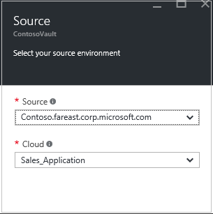

3. In **Target** select the subscription, post-failover deployment model, and the storage account you're using for replicated data.

	

4. Select the storage account you want to use. If you want to use a different storage account than those you have you can [create one](#set-up-an-azure-storage-account). To create a storage account using the ARM model click **Create new**. If you want to create a storage account using the classic model you'll do that [in the Azure portal](../storage/storage-create-storage-account-classic-portal.md). Then click **OK**.
5. Select the Azure network and subnet to which Azure VMs will connect when they're spun up after failover. Select **Configure now for selected machines** to apply the network setting to all machines you select for protection. Select **Configure later** to select the Azure network per machine. If you want to use a different network from those you have you can [create one](#set-up-an-azure-network). To create a network using the ARM model click **Create new**.If you want to create a network using the classic model you’ll do that [in the Azure portal](../virtual-network/virtual-networks-create-vnet-classic-pportal.md). Select a subnet if applicable. Then click **OK**.
6. In **Virtual Machines** > **Select virtual machines** click and select each machine you want to replicate. You can only select machines for which replication can be enabled. Then click **OK**.

	

5. In **Properties** > **Configure properties**, select the operating system for the selected VMs, and the OS disk. Then click **OK**. You can set additional properties later. 

	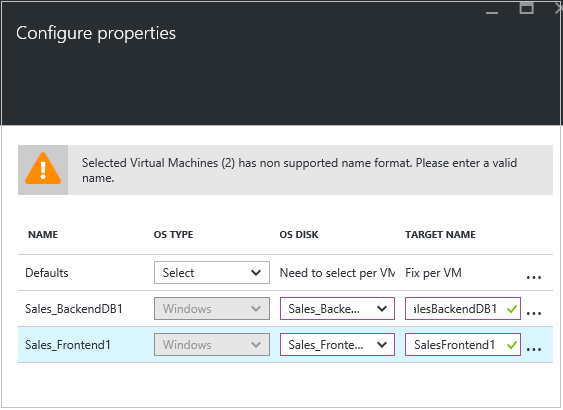

	
12. In **Replication settings** > **Configure replication settings**, select the replication policy you want to apply for the protected VMs. Then click **OK**. You can modify the replication policy in **Settings** > **Replication policies** > policy name > **Edit Settings**. Changes you apply will be used for machines that are already replicating, and new machines.

	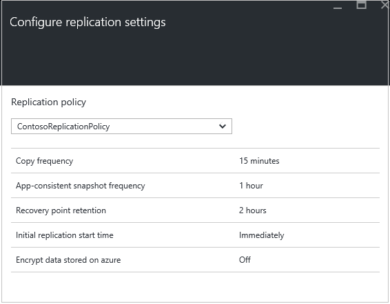

You can track progress of the **Enable Protection** job in **Settings** > **Jobs** > **Site Recovery jobs**. After the **Finalize Protection** job runs the machine is ready for failover.

### View and manage VM properties

We recommend that you verify the properties of the source machine. Remember that the Azure VM name should conform with [Azure virtual machine requirements](site-recovery-best-practices.md#azure-virtual-machine-requirements).

1. Click **Settings** > **Protected Items** > **Replicated Items** > and select the machine to see its details.

	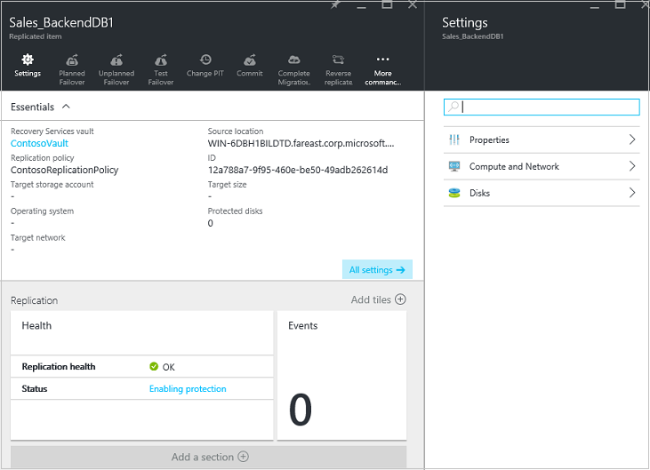

2. In **Properties** you can view replication and failover information for the VM.

	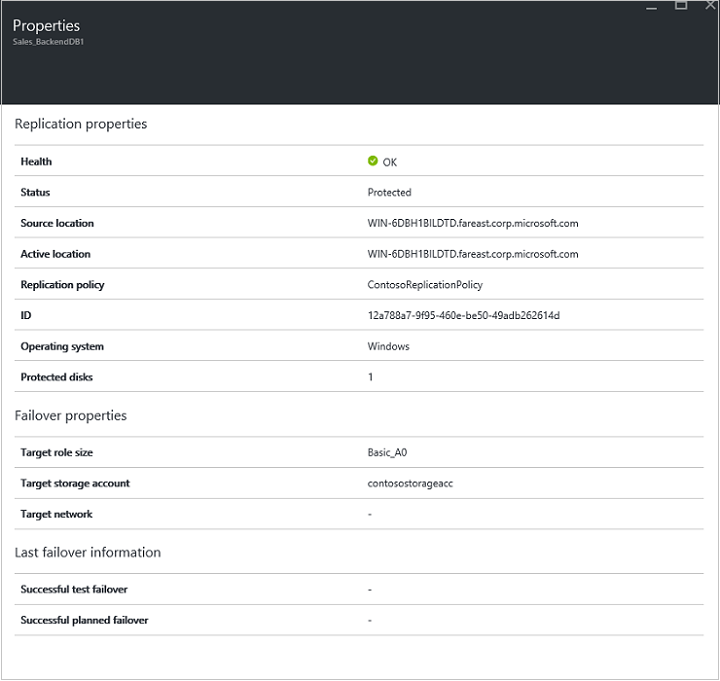

3. In **Compute and Network** > **Compute properties** you can specify the Azure VM name and target size. Modify the name to comply with [Azure requirements](site-recovery-best-practices.md#azure-virtual-machine-requirements) if you need to. You can also view and modify information about the target network, subnet, and IP address that will be assigned to the Azure VM. Note the following:

	- You can set the target IP address. If you don't provide an address, the failed over machine will use DHCP. If you set an address that isn't available at failover, the failover will fail. The same target IP address can be used for test failover if the address is available in the test failover network.
	- The number of network adapters is dictated by the size you specify for the target virtual machine, as follows:

		- If the number of network adapters on the source machine is less than or equal to the number of adapters allowed for the target machine size, then the target will have the same number of adapters as the source.
		- If the number of adapters for the source virtual machine exceeds the number allowed for the target size then the target size maximum will be used.
		- For example if a source machine has two network adapters and the target machine size supports four, the target machine will have two adapters. If the source machine has two adapters but the supported target size only supports one then the target machine will have only one adapter. 	
		- If the VM has multiple network adapters they will all connect to the same network.

	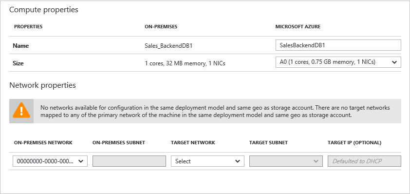

5.	In **Disks** you can see the operating system and data disks on the VM that will be replicated. 

## Step 7: Test your deployment

To test the deployment you can run a test failover for a single virtual machine or a recovery plan that contains one or more virtual machines.

### Prepare for failover

- To run a test failover we recommend that you create a new Azure network that’s isolated from your Azure production network (this is default behavior when you create a new network in Azure). [Learn more](site-recovery-failover.md#run-a-test-failover) about running test failovers.
- To get the best performance when you fail over to Azure, install the Azure Agent on the protected machine. It makes booting faster and helps with troubleshooting. Install the [Linux](https://github.com/Azure/WALinuxAgent) or [Windows](http://go.microsoft.com/fwlink/?LinkID=394789) agent. 
- To fully test your deployment you'll need an infrastructure for the replicated machine to work as expected. If you want to test Active Directory and DNS you can create a virtual machine as a domain controller with DNS and replicate this to Azure using Azure Site Recovery. Read more in [test failover considerations for Active Directory](site-recovery-active-directory.md#considerations-for-test-failover).
- If you want to run an unplanned failover instead of a test failover note the following:

	- If possible you should shut down primary machines before you run an unplanned failover. This ensures that you don't have both the source and replica machines running at the same time. 
	- When you run an unplanned failover it stops data replication from primary machines so any data delta won't be transferred after an unplanned failover begins. In addition if you run an unplanned failover on a recovery plan it will run until complete, even if an error occurs.

### Prepare to connect to Azure VMs after failover

If you want to connect to Azure VMs using RDP after failover, make sure you do the following:

**On the on-premises machine before failover**:

- For access over the internet enable RDP, ensure that TCP and UDP rules are added for the **Public**, and ensure that RDP is allowed in the **Windows Firewall** -> **Allowed apps and features** for all profiles.
- For access over a site-to-site connection enable RDP on the machine, and ensure that RDP is allowed in the **Windows Firewall** -> **Allowed apps and features** for **Domain** and **Private** networks.
- Install the [Azure VM agent](http://go.microsoft.com/fwlink/?LinkID=394789&clcid=0x409) on the on-premises machine.
- Ensure that the operating system's SAN policy is set to OnlineAll. [Learn more]( https://support.microsoft.com/kb/3031135)
- Turn off the IPSec service before you run the failover.

**On the Azure VM after failover**:

- Add a public endpoint for the RDP protocol (port 3389) and specify credentials for login.
- Ensure you don't have any domain policies that prevent you from connecting to a virtual machine using a public address.
- Try to connect. If you can't connect verify that the VM is running. For more troubleshooting tips read this [article](http://social.technet.microsoft.com/wiki/contents/articles/31666.troubleshooting-remote-desktop-connection-after-failover-using-asr.aspx).

If you want to access an Azure VM running Linux after failover using a Secure Shell client (ssh), do the following:

**On the on-premises machine before failover**:

- Ensure that the Secure Shell service on the Azure VM is set to start automatically on system boot.
- Check that firewall rules allow an SSH connection to it.

**On the Azure VM after failover**:

- The network security group rules on the failed over VM and the Azure subnet to which it is connected need to allow incoming connections to the SSH port.
- A public endpoint should be created to allow incoming connections on the SSH port (TCP port 22 by default).
- If the VM is accessed over a VPN connection (Express Route or site to site VPN) then the client can be used to directly connect to the VM over SSH.

### Run a test failover

To run the test failover do the following:

1. To fail over a single VM in **Settings** > **Replicated Items**, click the VM > **+Test Failover**.
2. To fail over a recovery plan, in **Settings** > **Recovery Plans**, right-click the plan > **Test Failover**. To create a recovery plan [follow these instructions](site-recovery-create-recovery-plans.md).

3. In **Test Failover** select the Azure network to which Azure VMs will be connected after failover occurs.
4. Click **OK** to begin the failover. You can track progress by clicking on the VM to open its properties, or on the **Test Failover** job in **Settings** > **Site Recovery jobs**.
5. When the failover reaches the **Complete testing** phase , do the following:

	1. View the replica virtual machine in the Azure portal. Verify that the virtual machine starts successfully.
	2. If you’re set up to access virtual machines from your on-premises network you can initiate a Remote Desktop connection to the virtual machine.
	3. Click **Complete the test** to finish it.
	4. Click **Notes** to record and save any observations associated with the test failover.
	5. Click **The test failover is complete**. Clean up the test environment to automatically power off and delete the test virtual machine.
	6. At this stage any elements or VMs created automatically by Site Recovery during the test failover are deleted. Any additional elements you've created for test failover aren't deleted.
	
	> [AZURE.NOTE] If a test failover continues longer than two weeks it’s completed by force.

6. After the failover completes you should also be able to see the replica Azure machine appear in the Azure portal > **Virtual Machines**. You should make sure that the VM is the appropriate size, that it's connected to the appropriate network, and that it's running.
7. If you [prepared for connections after failover](#prepare-to-connect-to-Azure-VMs-after-failover) you should be able to connect to the Azure VM.

## Monitor your deployment

Here's how you can monitor the configuration settings, status, and health for your Site Recovery deployment:

1. Click on the vault name to access the **Essentials** dashboard. In this dashboard you can Site Recovery jobs, replication status, recovery plans, server health, and events.  You can customize Essentials to show the tiles and layouts that are most useful to you, including the status of other Site Recovery and Backup vaults.

	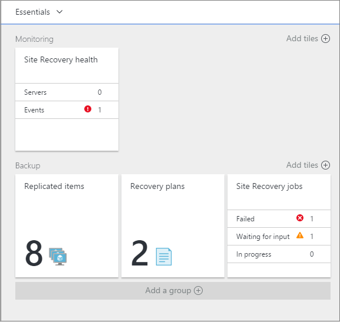

2. In the **Health** tile you can monitor site servers (VMM or configuration servers) that are experiencing issue, and the events raised by Site Recovery in the last 24 hours.
3. You can manage and monitor replication in the **Replicated Items**, **Recovery Plans**, and **Site Recovery Jobs** tiles. You can drill into jobs in **Settings** -> **Jobs** -> **Site Recovery Jobs**.

## Next steps

After your deployment is set up and running, [learn more](site-recovery-failover.md) about different types of failover.
