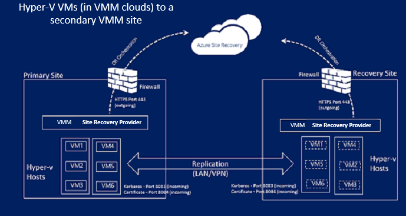
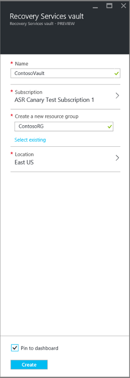
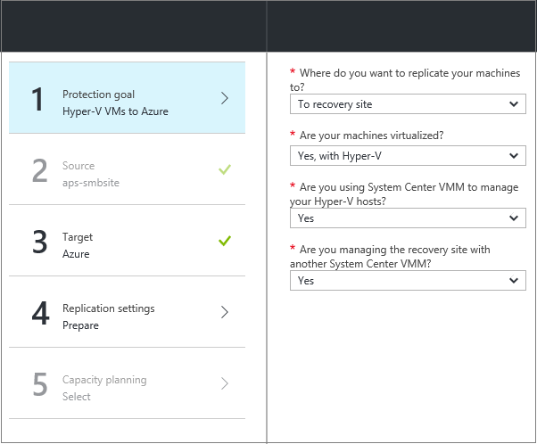
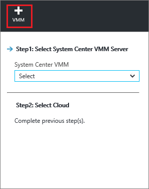
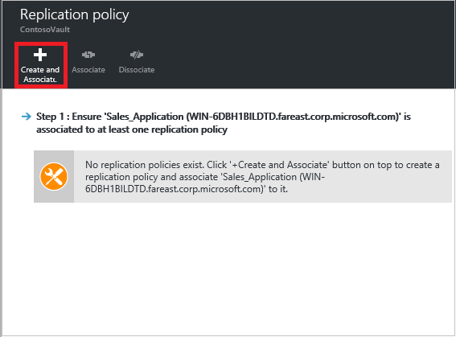
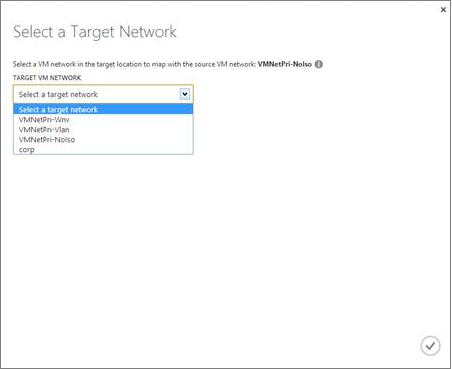
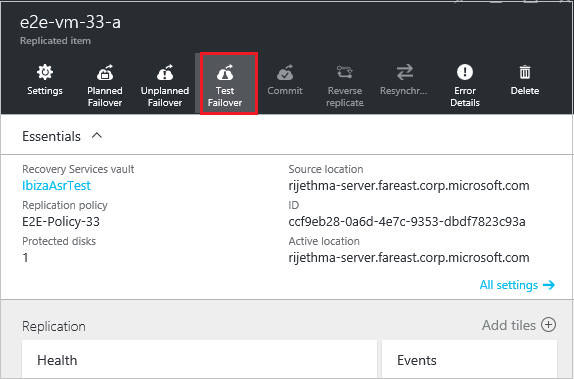
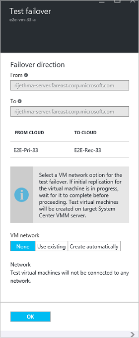

<properties
	pageTitle="Replicate Hyper-V virtual machines in VMM clouds to a secondary VMM site with the Azure portal | Microsoft Azure"
	description="Describes how to deploy Azure Site Recovery to orchestrate replication, failover and recovery of Hyper-V VMs in VMM clouds to a secondary VMM site using the Azure portal."
	services="site-recovery"
	documentationCenter=""
	authors="rayne-wiselman"
	manager="jwhit"
	editor=""/>

<tags
	ms.service="site-recovery"
	ms.workload="backup-recovery"
	ms.tgt_pltfrm="na"
	ms.devlang="na"
	ms.topic="article"
	ms.date="05/26/2016"
	ms.author="raynew"/>

# Replicate Hyper-V virtual machines in VMM clouds to a secondary VMM site using the Azure portal

> [AZURE.SELECTOR]
- [Azure Portal](site-recovery-vmm-to-vmm.md)
- [Classic Portal](site-recovery-vmm-to-vmm-classic.md)
- [PowerShell - Resource Manager](site-recovery-vmm-to-vmm-powershell-resource-manager.md)

Welcome to Azure Site Recovery! Use this article if you want to replicate on-premises Hyper-V  virtual machines managed in System Center Virtual Machine Manager (VMM) clouds to a secondary site. This article describes how to set up replication using Azure Site Recovery in the Azure portal.

> [AZURE.NOTE] Azure has two different [deployment models](../resource-manager-deployment-model.md) for creating and working with resources: Azure Resource Manager and classic. Azure also has two portals – the Azure classic portal that supports the classic deployment model, and the Azure portal with support for both deployment models. 

Azure Site Recovery in the Azure portal provides a number of new features:

- In the Azure portal the Azure Backup and Azure Site Recovery services are combined into a single Recovery Services vault so that you can set up and manage business continuity and disaster recovery (BCDR) from a single location. A unified dashboard allows you monitor and manage operations across your on-premises sites and the Azure public cloud.
- Users with Azure subscriptions provisioned with the Cloud Solution Provider (CSP) program can now manage Site Recovery operations in the Azure portal.

After reading this article post any comments at the bottom in the Disqus comments. Ask technical questions on the [Azure Recovery Services Forum](https://social.msdn.microsoft.com/forums/azure/home?forum=hypervrecovmgr).

## Overview

Organizations need a BCDR strategy that determines how apps, workloads, and data stay running and available during planned and unplanned downtime, and recover to normal working conditions as soon as possible. Your BCDR strategy should keep business data safe and recoverable, and ensure that workloads remain continuously available when disaster occurs.

Site Recovery is an Azure service that contributes to your BCDR strategy by orchestrating replication of on-premises physical servers and virtual machines to the cloud (Azure) or to a secondary datacenter. When outages occur in your primary location, you fail over to the secondary location to keep apps and workloads available. You fail back to your primary location when it returns to normal operations. Learn more in [What is Azure Site Recovery?](site-recovery-overview.md)

This article provides all the information you need to replicate on-premises Hyper-V VMs in VMM clouds to a secondary VMM site. It includes an architectural overview, planning information, and deployment steps for configuring on-premises servers, replication settings, and capacity planning. After you've set up the infrastructure you can enable replication on machines you want to protect, and check that failover works.

## Business advantages

- Site Recovery provides protection for business workloads and applications running on Hyper-V VMs by replicating them to a secondary Hyper-V server.
- The Recovery Services portal provides a single location to set up, manage, and monitor replication, failover, and recovery.
- You can run easily run failovers from your primary on-premises infrastructure to the secondary site, and failback (restore) from the secondary site to the primary.
- You can configure recovery plans with multiple machines so that tiered application workloads fail over together. 

## Scenario architecture

These are the scenario components: 

- **Primary site**: In the primary site there are one or more Hyper-V host servers running source VMs you want to replicate. These primary host servers are located in a VMM private cloud.
- **Secondary site**: In the secondary site there are one or more Hyper-V host servers running target VMs to which you'll replicate the primary VMs. These host servers are located in a VMM private cloud. The cloud can be on the primary server (if you only have a single VMM server) or on a secondary VMM server.
- **Provider**: During Site Recovery deployment you install the Azure Site Recovery Provider on the VMM servers, and register those servers in a Recovery Services vault. The Provider running on the VMM server communicates with Site Recovery over HTTPS 443 to replicate orchestration. Data replication occurs between primary and secondary Hyper-V host servers. Replicated data remains within on-premises sites and networks and is not sent to Azure. Read more about [privacy](#privacy-information-for-site-recovery).

### Data privacy overview

This table summarizes how data is stored in this scenario:
****
Action | **Details** | **Collected data** | **Use** | **Required** 
--- | --- | --- | --- | ---
**Registration** | You register a VMM server in a Recovery Services vault. If you later want to unregister a server, you can do so by deleting the server information from the Azure portal. | After a VMM server is registered Site Recovery collects, processes, and transfers metadata about the VMM server and the names of the VMM clouds detected by Site Recovery. | The data is used to identify and communicate with the appropriate VMM server and configure settings for appropriate VMM clouds. | This feature is required. If you don't want to send this information to Site Recovery you shouldn't use the Site Recovery service. 
**Enable replication** | The Azure Site Recovery Provider is installed on the VMM server and is the conduit for communication with the Site Recovery service. The Provider is a dynamic-link library (DLL) hosted in the VMM process. After the Provider is installed, the "Datacenter Recovery" feature gets enabled in the VMM administrator console. New and existing VMs can enable this feature to enable protection for a VM. | With this property set, the Provider sends the name and ID of the VM to Site Recovery.  Replication is enabled by Windows Server 2012 or Windows Server 2012 R2 Hyper-V Replica. The virtual machine data gets replicated from one Hyper-V host to another (typically located in a different “recovery” data center). | Site Recovery uses the metadata to populate the VM information in the Azure portal. | This feature is an essential part of the service and can't be turned off. If you don't want to send this information, don't enable Site Recovery protection for VMs. Note that all data sent by the Provider to Site Recovery is sent over HTTPS.
**Recovery plan** | Recovery plans help you build an orchestration plan for the recovery data center. You can define the order in which VMs or a group of virtual machines should be started at the recovery site. You can also specify any automated scripts to be run, or any manual action to be taken, at the time of recovery for each VM. Failover  is typically triggered at the recovery plan level for coordinated recovery. | Site Recovery collects, processes, and transmits metadata for the recovery plan, including virtual machine metadata, and metadata of any automation scripts and manual action notes. | The metadata is used to build the recovery plan in the Azure portal. | This feature is an essential part of the service and can't be turned off. If you don't want to send this information to Site Recovery, don't create recovery plans.
**Network mapping** | Maps network information from the primary data center to the recovery data center. When VMs are recovered on the recovery site, network mapping helps in establishing network connectivity. | Site Recovery collects, processes, and transmits the metadata of the logical networks for each site (primary and datacenter). | The metadata is used to populate network settings so that you can map the network information. | This feature is an essential part of the service and can't be turned off. If you don't want to send this information to Site Recovery, don't use network mapping.
**Failover (planned/unplanned/test)** | Failover fails over VMs from one VMM-managed data center to another. The failover action is triggered manually in the Azure portal. | The Provider on the VMM server is notified of the failover event by Site Recovery and runs a failover action on the Hyper-V host through VMM interfaces. Actual failover of a VM is from one Hyper-V host to another and handled by Windows Server 2012 or Windows Server 2012 R2 Hyper-V Replica. After failover is complete, the Provider on the VMM server in the recovery data center sends success information to Site Recovery. | Site Recovery uses the information sent to populate the status of the failover action information in the Azure portal. | This feature is an essential part of the service and can't be turned off. If you don't want to send this information to Site Recovery, don't use failover.

## Azure prerequisites

Here's what you'll need in Azure to deploy this scenario:

**Prerequisites** | **Details** 
--- | ---
**Azure**| You'll need a [Microsoft Azure](http://azure.microsoft.com/) account. You can start with a [free trial](https://azure.microsoft.com/pricing/free-trial/). [Learn more](https://azure.microsoft.com/pricing/details/site-recovery/) about Site Recovery pricing. 

## On-premises prerequisites

Here's what you'll need in the primary and secondary on-premises sites to deploy this scenario:

**Prerequisites** | **Details** 
--- | ---
**VMM** | We recommend you deploy a VMM server in the primary site and a VMM server in the secondary site.   You can also [replicate between clouds on a single VMM server](site-recovery-single-vmm.md). To do this you'll need at least two clouds configured on the VMM server.   VMM servers should be running at least System Center 2012 SP1 with the latest updates.   Each VMM server must have at one or more clouds configured and all clouds must have the Hyper-V Capacity profile set.   Clouds must contain one or more VMM host groups.  Learn more about setting up VMM clouds in [Configuring the VMM cloud fabric](https://msdn.microsoft.com/library/azure/dn469075.aspx#BKMK_Fabric), and [Walkthrough: Creating private clouds with System Center 2012 SP1 VMM](http://blogs.technet.com/b/keithmayer/archive/2013/04/18/walkthrough-creating-private-clouds-with-system-center-2012-sp1-virtual-machine-manager-build-your-private-cloud-in-a-month.aspx).   VMM servers need internet access. 
**Hyper-V** | Hyper-V servers must be running at least Windows Server 2012 with the Hyper-V role and have the latest updates installed.   A Hyper-V server should contain one or more VMs.    Hyper-V host servers should be located in host groups in the primary and secondary VMM clouds.   If you're running Hyper-V in a cluster on Windows Server 2012 R2 you should install [update 2961977](https://support.microsoft.com/kb/2961977)   If you're running Hyper-V in a cluster on Windows Server 2012 note that cluster broker isn't created automatically if you have a static IP address-based cluster. You'll need to configure the cluster broker manually. [Read more](http://social.technet.microsoft.com/wiki/contents/articles/18792.configure-replica-broker-role-cluster-to-cluster-replication.aspx).
**Provider** | During Site Recovery deployment you install the Azure Site Recovery Provider on VMM servers. The Provider communicates with Site Recovery over HTTPS 443 to orchestrate replication. Data replication occurs between the primary and secondary Hyper-V servers over the LAN or a VPN connection.   The Provider running on the VMM server needs access to these URLs: *.hypervrecoverymanager.windowsazure.com; *.accesscontrol.windows.net; *.backup.windowsazure.com; *.blob.core.windows.net; *.store.core.windows.net.   In addition allow firewall communication from the VMM servers to the [Azure datacenter IP ranges](https://www.microsoft.com/download/confirmation.aspx?id=41653) and allow the HTTPS (443) protocol.

## Prepare for deployment

To prepare for deployment you'll need to:

1. [Prepare the VMM server](#prepare-the-vmm-server) for Site Recovery deployment. 
2. [Prepare for network mapping](#prepare-for-network-mapping). Set up networks so that you can configure network mapping.

### Prepare the VMM server

Make sure that the VMM server complies with the [prerequisites](#on-premises-prerequisites) and can access the listed URLs.

### Prepare for network mapping

Network mapping maps between VMM VM networks on the primary and secondary VMM servers to:

- Optimally place replica VMs on secondary Hyper-V hosts after failover.
- Connect replica VMs to appropriate VM networks.
- If you don't configure network mapping replica VMs won't be connected to any network after failover.
- If you want to set up network mapping during Site Recovery deployment here's what you'll need:

	- Make sure that VMs on the source Hyper-V host server are connected to a VMM VM network. That network should be linked to a logical network that is associated with the cloud.
	- Verify that the secondary cloud that you'll use for recovery has a corresponding VM network configured. That VM network should be linked to a logical network that's associated with the secondary cloud.

- [Learn more](site-recovery-network-mapping.md) about how network mapping works.

## Prepare for deployment with a single VMM server

If you only have a single VMM server you can replicate VMs in Hyper-V hosts in the VMM cloud to [Azure](site-recovery-vmm-to-azure.md) or to a secondary VMM cloud. We recommend the first option because replicating between clouds isn't seamless, but if you need to do this here's what you'll need to do:

1. **Set up VMM on a Hyper-V VM**. When we do this we suggest you colocate the SQL Server instance used by VMM on the same VM. This saves time as only one VM has to be created. If you want to use remote instance of SQL Server and an outage occurs, you'll need to recover that instance before you can recover VMM.
2. **Ensure the VMM server has at least two clouds configured**. One cloud will contain the VMs you want to replicate and the other cloud will serve as the secondary location. The cloud that contains the VMs you want to protect should comply with [prequisites](#on-premises-prerequisites).
3. Set up Site Recovery as described in this article. Create and register the VMM server in the vault, set up a replication policy, and enable replication. You should specify that initial replication takes place over the network.
4. When you set up network mapping you'll map the VM network for the primary cloud to the VM network for the secondary cloud.
5. In the Hyper-V Manager console, enable Hyper-V Replica on the Hyper-V host that contains the VMM VM, and enable replication on the VM. Make sure you don't add the VMM virtual machine to clouds that are protected by Site Recovery, to ensure that Hyper-V Replica settings aren't overridden by Site Recovery.
6. If you create recovery plans for failover you'll use the same VMM server for source and target.
7. You'll fail over and recover as follows:

	- Manually fail over the VMM VM to the secondary site using Hyper-V Manager with a planned failover.
	- Fail over the VMs.
	- After the primary VMM VM has been recovered, log into the Azure portal -> Recovery Services vault and run an unplanned failover of the VMs from the secondary site to the primary site.
	- After the unplanned failover is complete, all resources can be accessed from the primary site again.

### Create a Recovery Services vault

1. Sign in to the [Azure portal](https://portal.azure.com).
2. Click **New** > **Management** > **Recovery Services**. Alternatively you can click **Browse** > **Recovery Services** vaults > **Add**.

	

3. In **Name** specify a friendly name to identify the vault. If you have more than one subscription, select one of them.
4. [Create a new resource group](../resource-group-template-deploy-portal.md) or select an existing one, and specify an Azure region. Machines will be replicated to this region. To check supported regions see Geographic Availability in [Azure Site Recovery Pricing Details](https://azure.microsoft.com/pricing/details/site-recovery/)
4. If you want to quickly access the vault from the Dashboard click **Pin to dashboard** > **Create vault**.

	

The new vault will appear on the **Dashboard** > **All resources**, and on the main **Recovery Services vaults** blade.

## Getting started

Site Recovery provides a Getting Started experience that helps you deploy as quickly as possible. Getting Started checks prerequisites and walks you through Site Recovery deployment steps in the right order.

In Getting Started you select the type of machines you want to replicate, and where you want to replicate to. You set up on-premises servers, create replication policies, and perform capacity planning. After you've set up your infrastructure you enable replication for VMs. You can run failovers for specific machines, or create recovery plans to fail over multiple machines.

Begin Getting Started by choosing how you want to deploy Site Recovery. The Getting Started flow changes slightly depending on your replication requirements.

## Step 1: Choose your protection goal

Select what you want to replicate and where you want to replicate to.

1. In the **Recovery Services vaults** blade select your vault and click **Settings**.
2. In **Settings** > **Getting Started** click **Site Recovery** > **Step 1: Prepare Infrastructure** > **Protection goal**.
3. In **Protection goal** select **To recovery site**, and select **Yes, with Hyper-V**. 
4. Select **Yes** to indicate you're using VMM to manage the Hyper-V hosts, and select **Yes** if you have a secondary VMM server. If you're deploying replication between clouds on a single VMM server you'll click **No**. Then click **OK**. 

	

## Step 2: Set up the source environment

Install the Azure Site Recovery Provider on VMM servers, and register servers in the vault. 

1. Click **Step 2: Prepare Infrastructure** > **Source**. 

	

2. In **Prepare source** click **+ VMM** to add a VMM server.

	

2. In the **Add Server** blade check that **System Center VMM server** appears in **Server type** and that the VMM server meets the [prerequisites and URL requirements](#on-premises-prerequisites).
4. Download the Azure Site Recovery Provider installation file.
5. Download the registration key. You'll need this when you run setup. The key is valid for 5 days after you generate it. 

	

6. Install the Azure Site Recovery Provider on the VMM server.

> [AZURE.NOTE] You don't need to explicitly install anything on Hyper-V host servers.

### Set up the Azure Site Recovery Provider

1. Run the Provider setup file on each VMM server. If VMM is deployed in a cluster and you're installing the Provider for the first time install it on an active node and finish the installation to register the VMM server in the vault. Then install the Provider on the other nodes. Cluster nodes should all run the same version of the Provider.
2. Setup runs a few prerequirement checks and requests permission to stop the VMM service. The VMM Service will be restarted automatically when setup finishes. If you're installing on a VMM cluster you'll be prompted to stop the Cluster role.

2.  In **Microsoft Update** you can opt in for updates so that Provider updates are installed in accordance with your Microsoft Update policy.
3. In **Installation** accept or modify the default Provider installation location and click **Install**.

	

3. After installation is complete click **Register** to register the server in the vault.

	

9. In **Vault name**, verify the name of the vault in which the server will be registered. Click *Next*.

	

7. In **Internet Connection** specify how the Provider running on the VMM server connects to the Internet. Select **Connect with existing proxy settings** to use the default Internet connection settings configured on the server.

	

	- If you want to use a custom proxy you should set it up before you install the Provider. When you configure custom proxy settings a test will run to check the proxy connection.
	- If you do use a custom proxy, or your default proxy requires authentication you'll need to enter the proxy details, including the proxy address and port.
	- Following urls should be accessible from the VMM Server and the Hyper-v hosts
		- *.hypervrecoverymanager.windowsazure.com
		- *.accesscontrol.windows.net
		- *.backup.windowsazure.com
		- *.blob.core.windows.net
		- *.store.core.windows.net
	- Allow the IP addresses described in [Azure Datacenter IP Ranges](https://www.microsoft.com/download/confirmation.aspx?id=41653) and HTTPS (443) protocol. You would have to white-list IP ranges of the Azure region that you plan to use and that of West US.
	- If you use a custom proxy a VMM RunAs account (DRAProxyAccount) will be created automatically using the specified proxy credentials. Configure the proxy server so that this account can authenticate successfully. The VMM RunAs account settings can be modified in the VMM console. To do this, open the **Settings** workspace, expand **Security**, click **Run As Accounts**, and then modify the password for DRAProxyAccount. You’ll need to restart the VMM service so that this setting takes effect.

8. In **Registration Key**, select the key that you downloaded from Azure Site Recovery and copied to the VMM server.

10.  The encryption setting is only used when you're replicating Hyper-V VMs in VMM clouds to Azure. If you're replicating to a secondary site it's not used.

11.  In **Server name**, specify a friendly name to identify the VMM server in the vault. In a cluster configuration specify the VMM cluster role name.
12.  In **Synchronize cloud metadata** select whether you want to synchronize metadata for all clouds on the VMM server with the vault. This action only needs to happen once on each server. If you don't want to synchronize all clouds, you can leave this setting unchecked and synchronize each cloud individually in the cloud properties in the VMM console.

13.  Click **Next** to complete the process. After registration, metadata from the VMM server is retrieved by Azure Site Recovery. The server is displayed on the  **VMM Servers** tab on the **Servers** page in the vault.
 	
	

11. After the server is available in the Site Recovery console, in **Source** > **Prepare source** select the VMM server, and select the cloud in which the Hyper-V host is located. Then click **OK**.

#### Command line installation

The Azure Site Recovery Provider can be installed from the command line. This method can be used to install the Provider on Server Core for Windows Server 2012 R2.

1. Download the Provider installation file and registration key to a folder. For example C:\ASR.
2. Stop the System Center Virtual Machine Manager Service.
3. From an elevated command prompt, run these commands to extract the Provider installer:

    	C:\Windows\System32> CD C:\ASR
    	C:\ASR> AzureSiteRecoveryProvider.exe /x:. /q

4. Run this command to install the Provider:

    	C:\ASR> setupdr.exe /i

5. Then run these commands to register the server in the vault:

    	CD C:\Program Files\Microsoft System Center 2012 R2\Virtual Machine Manager\bin
    	C:\Program Files\Microsoft System Center 2012 R2\Virtual Machine Manager\bin\> DRConfigurator.exe /r  /Friendlyname <friendly name of the server> /Credentials <path of the credentials file> /EncryptionEnabled <full file name to save the encryption certificate>     

Where the parameters are: 

 - **/Credentials** : Mandatory parameter that specifies the location in which the registration key file is located  
 - **/FriendlyName** : Mandatory parameter for the name of the Hyper-V host server that appears in the Azure Site Recovery portal.
 - **/EncryptionEnabled** : Optional Parameter that you only use when replicating from VMM to Azure.
 - **/proxyAddress** : Optional parameter that specifies the address of the proxy server.
 - **/proxyport** : Optional parameter that specifies the port of the proxy server.
 - **/proxyUsername** : Optional parameter that specifies the Proxy user name (if proxy requires authentication).
 - **/proxyPassword** :Optional parameter that specifies the Password for authenticating with the proxy server (if proxy requires authentication).  

## Step 3: Set up the target environment

Select the target VMM server and cloud.

1. Click **Prepare infrastructure** > **Target** and select the target VMM server you want to use. 
2.	Clouds on the server that are synchronized with Site Recovery will be displayed. Select the target cloud.

	

## Step 4: Set up replication settings

1. To create a new replication policy click **Prepare infrastructure** > **Replication Settings** > **+Create and associate**.

	

2. In **Create and associate policy** specify a policy name. The source and target type should be **Hyper-V**.
3. In **Hyper-V host version** select which operating system is running on the host.

	> [AZURE.NOTE] The VMM cloud can contain Hyper-V hosts running different (supported)versions of Windows Server, but a replication policy is applied hosts running the same operating system. If you have hosts running more than one operating system version then create separate replication policies.

4. In **Authentication type** and **Authentication port** specify how traffic is authenticated between the primary and recovery Hyper-V host servers. Select **Certificate** unless you have a working Kerberos environment. Azure Site Recovery will automatically configure certificates for HTTPS authentication. You don't need to do anything manually. By default, port 8083 and 8084 (for certificates) will be opened in the Windows Firewall on the Hyper-V host servers. If you do select **Kerberos**, a Kerberos ticket will be used for mutual authentication of the host servers. Note that this setting is only relevant for Hyper-V host servers running on Windows Server 2012 R2. 
3. In **Copy frequency** specify how often you want to replicate delta data after the initial replication (every 30 seconds, 5 or 15 minutes).
4. In **Recovery point retention**, specify in hours how long the retention window will be for each recovery point. Protected machines can be recovered to any point within a window.
6. In **App-consistent snapshot frequency** specify how frequently (1-12 hours) recovery points containing application-consistent snapshots will be created. Hyper-V uses two types of snapshots — a standard snapshot that provides an incremental snapshot of the entire virtual machine, and an application-consistent snapshot that takes a point-in-time snapshot of the application data inside the virtual machine. Application-consistent snapshots use Volume Shadow Copy Service (VSS) to ensure that applications are in a consistent state when the snapshot is taken. Note that if you enable application-consistent snapshots, it will affect the performance of applications running on source virtual machines. Ensure that the value you set is less than the number of additional recovery points you configure.
7. In **Data transfer compression** specify whether replicated data that is transferred should be compressed.
8. Select **Delete replica VM** to specify that the replica virtual machine should be deleted if you disable protection for the source VM. If you enable this setting, when you disable protection for the source VM it's removed from the Site Recovery console, Site Recovery settings for the VMM are removed from the VMM console, and the replica is deleted.
3. In **Initial replication method** If you're replicating over the network specify whether to start the initial replication or schedule it. To save network bandwidth you might want to schedule it outside your busy hours. Then click **OK**.

	

6. When you create a new policy it's automatically associated with the VMM cloud. In **Replication policy** click **OK**. You can associate additional VMM Clouds (and the VMs in them) with this replication policy in **Settings** > **Replication** > policy name > **Associate VMM Cloud**. 

	

### Prepare for offline initial replication

You can do offline replication for the initial data copy. You can prepare this as follows:

- On the source server, you’ll specify a path location from which the data export will take place. Assign Full Control for NTFS and Share permissions to the VMM service on the export path. On the target server, you’ll specify a path location from which the data import will occur. Assign the same permissions on this import path.
- If the import or export path is shared, assign Administrator, Power User, Print Operator, or Server Operator group membership for the VMM service account on the remote computer on which the shared is located.
- If you are using any Run As accounts to add hosts, on the import and export paths, assign read and write permissions to the Run As accounts in VMM.
- The import and export shares should not be located on any computer used as a Hyper-V host server, because loopback configuration is not supported by Hyper-V.
- In Active Directory, on each Hyper-V host server that contains virtual machines you want to protect, enable and configure constrained delegation to trust the remote computers on which the import and export paths are located, as follows:
	1. On the domain controller, open **Active Directory Users and Computers**.
	2. In the console tree click **DomainName** > **Computers**.
	3. Right-click the Hyper-V host server name > **Properties**.
	4. On the **Delegation** tab click **Trust this computer for delegation to specified services only**.
	5. Click **Use any authentication protocol**.
	6. Click **Add** > **Users and Computers**.
	7. Type the name of the computer that hosts the export path > **OK**.From the list of available services, hold down the CTRL key and click **cifs** > **OK**. Repeat for the name of the computer that hosts the import path. Repeat as necessary for additional Hyper-V host servers.

### Configure network mapping

Set up network mapping between source and target networks.

- [Read](#prepare-for-network-mapping) for a quick overview of what network mapping does. In addition [read](site-recovery-network-mapping.md) for an more in-depth explanation.
- Verify that virtual machines on VMM servers are connected to a VM network.

Configure mapping as follows:

1. **Settings** > **Site Recovery Infrastructure** > **Network Mapping** > **Network mappings** click **+Network Mapping**.

	

2. In **Add network mapping** tab select the source and target VMM servers. The VM networks associated with the VMM servers are retrieved.
3. In **Source network**, select the network you want to use from the list of VM networks associated with the primary VMM server. 
6. In **Target network** select the network you want to use on the secondary VMM server. Then click **OK**.

	

Here's what happens when network mapping begins:

- Any existing replica virtual machines that correspond to the source VM network will be connected to the target VM network.
- New virtual machines that are connected to the source VM network will be connected to the target mapped network after replication.
- If you modify an existing mapping with a new network, replica virtual machines will be connected using the new settings.
- If the target network has multiple subnets and one of those subnets has the same name as subnet on which the source virtual machine is located, then the replica virtual machine will be connected to that target subnet after failover. If there’s no target subnet with a matching name, the virtual machine will be connected to the first subnet in the network.

## Step 5: Capacity planning

Now that you have your basic infrastructure set up you can think about capacity planning and figure out whether you need additional resources.

Site Recovery provides a Excel-based capacity planner to help you allocate the right resources for your source environment, the site recovery components, networking and storage. You can run the planner in quick mode for estimations based on an average number of VMs, disks, and storage, or in detailed mode in which you’ll input figures at the workload level. Before you start you’ll need to:

- Gather information about your replication environment, including VMs, disks per VMs, and storage per disk.
- Estimate the daily change (churn) rate you’ll have for replicated delta data. You can use the [Capacity planner for Hyper-V Replica](https://www.microsoft.com/download/details.aspx?id=39057) to help you do this.

1.	Click **Download** to download the tool and then run it. [Read the article](site-recovery-capacity-planner.md) that accompanies the tool.
2.	When you’re done select **Yes** in **Have you run the Capacity Planner**?

	

### Control bandwidth

After you've collected real-time delta replication information using the Capacity Planner  Hyper-V Replica, the Excel-based capacity planner tool helps you to calculate the bandwidth you need for replication (initial and delta). To control the amount of bandwidth used for replication yon can configure  the NetQos Policy using Group Policy or Windows PowerShell. There are a few ways you can do this:

**PowerShell** | **Details**
--- | ---
**New -NetQosPolicy "QoS to destination subnet"** | Throttle traffic from a Hyper-V host running Windows Server 2012 R2 to a secondary subnet. Use if your primary and secondary subnets are different.
**New -NetQosPolicy "QoS to destination port"** | Throttle traffic from a Hyper-V host running Windows Server 2012 R2 to a destination port.
**New -NetQosPolicy "Throttle traffic from VMM"** | Throttle traffic from vmms.exe. This will throttle Hyper-V traffic and Live Migration Traffic. You can match IP protocols and ports to refine.

You can use bandwidth weight settings or limit traffic by bits per secondary. If you're using a cluster you'll need to do this on all cluster node. For more information see:

- Thomas Maurer's blog on [Throttling Hyper-V Replica Traffic](http://www.thomasmaurer.ch/2013/12/throttling-hyper-v-replica-traffic/)
- Additional information about the [New-NetQosPolicy cmdlet](https://technet.microsoft.com/library/hh967468.aspx).

## Step 6: Enable replication 

Now enable replication as follows:

1. Click **Step 2: Replicate application** > **Source**. After you've enabled replication for the first time you'll click **+Replicate** in the vault to enable replication for additional machines.

	

2. In the **Source** blade > select VMM server and the cloud in which the Hyper-V hosts you want to replicate are located. Then click **OK**.

	

3. In the **Target** blade verify the secondary VMM server and cloud.
4. In **Virtual machines** select the VMs you want to protect from the list. 

	

You can track progress of the **Enable Protection** action in Settings > **Jobs** > **Site Recovery jobs**. After the **Finalize Protection** job runs the virtual machine is ready for failover. 

>[AZURE.NOTE] You can also enable protection for virtual machines in the VMM console. Click **Enable Protection** on the toolbar in the in the virtual machine properties > **Azure Site Recovery** tab.

After you've enabled replication you can view properties for the VM in **Settings** > **Replicated Items** > vm-name. On the **Essentials** dashboard you can see information about the replication policy for the VM and its status. Click **Properties** for more details.

### Onboard existing virtual machines

If you have existing virtual machines in VMM that are replicating with Hyper-V Replica you can onboard them for Azure Site Recovery protection as follows:

1. Ensure that the Hyper-V server hosting the existing VM is located in the primary cloud and that the Hyper-V server hosting the replica virtual machine is located in the secondary cloud.
2. Make sure a replication policy is configured for the primary VMM cloud.
2. Enable replication for the primary virtual machine. Azure Site Recovery and VMM will ensure that the same replica host and virtual machine is detected, and Azure Site Recovery will reuse and reestablish replication using the specified settings.

## Step 7: Test your deployment

To test your deployment you can run a test failover for a single virtual machine, or create a recovery plan that contains one or more virtual machines.

### Prepare for failover

- To fully test your deployment you'll need an infrastructure for the replicated machine to work as expected. If you want to test Active Directory and DNS you can create a virtual machine as a domain controller with DNS and replicate this to Azure using Azure Site Recovery. Read more in [test failover considerations for Active Directory](site-recovery-active-directory.md#considerations-for-test-failover).
- The instructions in this article describe how to run a test failover with no network. This option will test that the VM fails over but won't test network settings for the VM. [Learn more](site-recovery-failover.md#run-a-test-failover) about other options.
- If you want to run an unplanned failover instead of a test failover note the following:

	- If possible you should shut down primary machines before you run an unplanned failover. This ensures that you don't have both the source and replica machines running at the same time. 
	- When you run an unplanned failover it stops data replication from primary machines so any data delta won't be transferred after an unplanned failover begins. In addition if you run an unplanned failover on a recovery plan it will run until complete, even if an error occurs.

### Run a test failover

1. To fail over a single VM in **Settings** > **Replicated Items**, click the VM > **+Test Failover**.

	

2. To fail over a recovery plan, in **Settings** > **Recovery Plans**, right-click the plan > **Test Failover**. To create a recovery plan [follow these instructions](site-recovery-create-recovery-plans.md).
2. In **Test Failover** , select **None**. With this option you'll test that the VM fails over as expected but the replicated VM won't be connected to any network.

	

3. Click **OK** to begin the failover. You can track progress by clicking on the VM to open its properties, or on the **Test Failover** job in **Settings** > **Jobs** > **Site Recovery jobs**. 
4. When the failover job reaches the **Complete testing** phase, do the following:

	-  View the replica VM in the secondary VMM cloud.
	-  Click **Complete the test** to finish up the test failover.
	-  Click **Notes** to record and save any observations associated with the test failover.

5. The test virtual machine will be created on the same host as the host on which the replica virtual machine exists. It is added to the same cloud in which the replica virtual machine is located.
6. After verifying that VMs start successfully click **The test failover is complete**. At this stage any elements created automatically by Site Recovery during the test failover are deleted.  

	> [AZURE.NOTE] If a test failover continues longer than two weeks it’s completed by force.

### Update DNS with the replica VM IP address

After failover the replica VM might not have the same IP address as the primary virtual machine. 

- Virtual machines will update the DNS server that they are using after they start.
- You can also manually update DNS as follows:

#### Retrieve the IP address

Run this sample script to retrieve the IP address.

    	$vm = Get-SCVirtualMachine -Name <VM_NAME>
		$na = $vm[0].VirtualNetworkAdapters>
		$ip = Get-SCIPAddress -GrantToObjectID $na[0].id
		$ip.address  

#### Update DNS

Run this sample script to update DNS, specifying the IP address you retrieved using the previous sample script.

		string]$Zone,
		[string]$name,
		[string]$IP
		)
		$Record = Get-DnsServerResourceRecord -ZoneName $zone -Name $name
		$newrecord = $record.clone()
		$newrecord.RecordData[0].IPv4Address  =  $IP
		Set-DnsServerResourceRecord -zonename $zone -OldInputObject $record -NewInputObject $Newrecord

## Next steps

After your deployment is set up and running, [learn more](site-recovery-failover.md) about different types of failovers.
