# Analyze the Deployment Planner report for VMware disaster recovery to Azure

The generated Microsoft Excel report contains the following sheets:
## On-premises summary
The On-premises summary worksheet provides an overview of the profiled VMware environment.

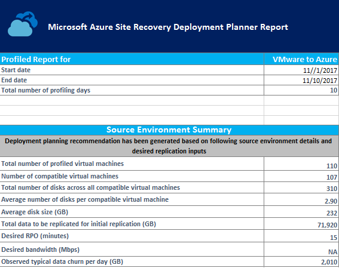

**Start Date** and **End Date**: The start and end dates of the profiling data considered for report generation. By default, the start date is the date when profiling starts, and the end date is the date when profiling stops. This can be the ‘StartDate’ and ‘EndDate’ values if the report is generated with these parameters.

**Total number of profiling days**: The total number of days of profiling between the start and end dates for which the report is generated.

**Number of compatible virtual machines**: The total number of compatible VMs for which the required network bandwidth, required number of storage accounts, Microsoft Azure cores, configuration servers and additional process servers are calculated.

**Total number of disks across all compatible virtual machines**: The number that's used as one of the inputs to decide the number of configuration servers and additional process servers to be used in the deployment.

**Average number of disks per compatible virtual machine**: The average number of disks calculated across all compatible VMs.

**Average disk size (GB)**: The average disk size calculated across all compatible VMs.

**Desired RPO (minutes)**: Either the default recovery point objective or the value passed for the ‘DesiredRPO’ parameter at the time of report generation to estimate required bandwidth.

**Desired bandwidth (Mbps)**: The value that you have passed for the ‘Bandwidth’ parameter at the time of report generation to estimate achievable RPO.

**Observed typical data churn per day (GB)**: The average data churn observed across all profiling days. This number is used as one of the inputs to decide the number of configuration servers and additional process servers to be used in the deployment.

## Recommendations

The recommendations sheet of the VMware to Azure report has the following details as per the selected desired RPO:

### Profiled data
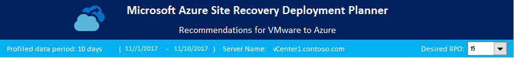

**Profiled data period**: The period during which the profiling was run. By default, the tool includes all profiled data in the calculation, unless it generates the report for a specific period by using StartDate and EndDate options during report generation.

**Server Name**: The name or IP address of the VMware vCenter or ESXi host whose VMs’ report is generated.

**Desired RPO**: The recovery point objective for your deployment. By default, the required network bandwidth is calculated for RPO values of 15, 30, and 60 minutes. Based on the selection, the affected values are updated on the sheet. If you have used the *DesiredRPOinMin* parameter while generating the report, that value is shown in the Desired RPO result.

### Profiling overview

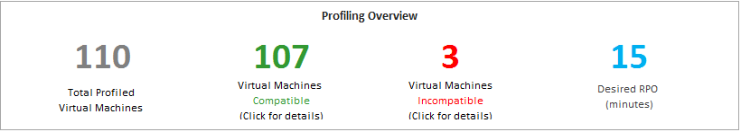

**Total Profiled Virtual Machines**: The total number of VMs whose profiled data is available. If the VMListFile has names of any VMs which were not profiled, those VMs are not considered in the report generation and are excluded from the total profiled VMs count.

**Compatible Virtual Machines**: The number of VMs that can be protected to Azure by using Site Recovery. It is the total number of compatible VMs for which the required network bandwidth, number of storage accounts, number of Azure cores, and number of configuration servers and additional process servers are calculated. The details of every compatible VM are available in the "Compatible VMs" section.

**Incompatible Virtual Machines**: The number of profiled VMs that are incompatible for protection with Site Recovery. The reasons for incompatibility are noted in the "Incompatible VMs" section. If the VMListFile has names of any VMs that were not profiled, those VMs are excluded from the incompatible VMs count. These VMs are listed as "Data not found" at the end of the "Incompatible VMs" section.

**Desired RPO**: Your desired recovery point objective, in minutes. The report is generated for three RPO values: 15 (default), 30, and 60 minutes. The bandwidth recommendation in the report is changed based on your selection in the Desired RPO drop-down list at the top right of the sheet. If you have generated the report by using the *-DesiredRPO* parameter with a custom value, this custom value will show as the default in the Desired RPO drop-down list.

### Required network bandwidth (Mbps)

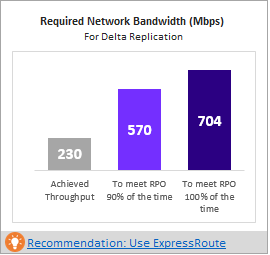

**To meet RPO 100 percent of the time:** The recommended bandwidth in Mbps to be allocated to meet your desired RPO 100 percent of the time. This amount of bandwidth must be dedicated for steady-state delta replication of all your compatible VMs to avoid any RPO violations.

**To meet RPO 90 percent of the time**: Because of broadband pricing or for any other reason, if you cannot set the bandwidth needed to meet your desired RPO 100 percent of the time, you can choose to go with a lower bandwidth setting that can meet your desired RPO 90 percent of the time. To understand the implications of setting this lower bandwidth, the report provides a what-if analysis on the number and duration of RPO violations to expect.

**Achieved Throughput:** The throughput from the server on which you have run the GetThroughput command to the Microsoft Azure region where the storage account is located. This throughput number indicates the estimated level that you can achieve when you protect the compatible VMs by using Site Recovery, provided that your configuration server or process server storage and network characteristics remain the same as that of the server from which you have run the tool.

For replication, you should set the recommended bandwidth to meet the RPO 100 percent of the time. After you set the bandwidth, if you don’t see any increase in the achieved throughput, as reported by the tool, do the following:

1. Check to see whether there is any network Quality of Service (QoS) that is limiting Site Recovery throughput.

2. Check to see whether your Site Recovery vault is in the nearest physically supported Microsoft Azure region to minimize network latency.

3. Check your local storage characteristics to determine whether you can improve the hardware (for example, HDD to SSD).

4. Change the Site Recovery settings in the process server to [increase the amount network bandwidth used for replication](./site-recovery-plan-capacity-vmware.md#control-network-bandwidth).

If you are running the tool on a configuration server or process server that already has protected VMs, run the tool a few times. The achieved throughput number changes depending on the amount of churn being processed at that point in time.

For all enterprise Site Recovery deployments, we recommend that you use [ExpressRoute](https://aka.ms/expressroute).

### Required storage accounts
The following chart shows the total number of storage accounts (standard and premium) that are required to protect all the compatible VMs. To learn which storage account to use for each VM, see the "VM-storage placement" section. If you are using v2.5 of Deployment Planner, this recommendation only shows the number of standard cache storage accounts which are needed for replication since the data is being directly written to Managed Disks.

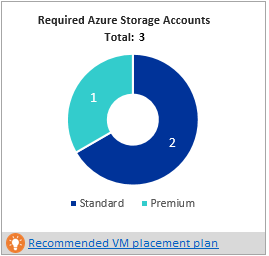

### Required number of Azure cores
This result is the total number of cores to be set up before failover or test failover of all the compatible VMs. If too few cores are available in the subscription, Site Recovery fails to create VMs at the time of test failover or failover.

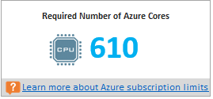

### Required on-premises infrastructure
This figure is the total number of configuration servers and additional process servers to be configured that would suffice to protect all the compatible VMs. Depending on the supported [size recommendations for the configuration server](/en-in/azure/site-recovery/site-recovery-plan-capacity-vmware#size-recommendations-for-the-configuration-server), the tool might recommend additional servers. The recommendation is based on the larger of either the per-day churn or the maximum number of protected VMs (assuming an average of three disks per VM), whichever is hit first on the configuration server or the additional process server. You'll find the details of total churn per day and total number of protected disks in the "On-premises summary" section.

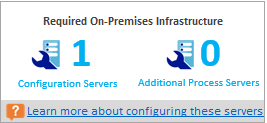

### What-if analysis
This analysis outlines how many violations could occur during the profiling period when you set a lower bandwidth for the desired RPO to be met only 90 percent of the time. One or more RPO violations can occur on any given day. The graph shows the peak RPO of the day.
Based on this analysis, you can decide if the number of RPO violations across all days and peak RPO hit per day is acceptable with the specified lower bandwidth. If it is acceptable, you can allocate the lower bandwidth for replication, else allocate the higher bandwidth as suggested to meet the desired RPO 100 percent of the time.

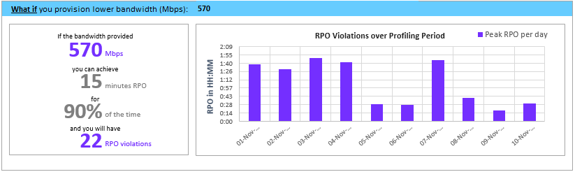

### Recommended VM batch size for initial replication
In this section, we recommend the number of VMs that can be protected in parallel to complete the initial replication within 72 hours with the suggested bandwidth to meet desired RPO 100 percent of the time being set. This value is configurable value. To change it at report-generation time, use the *GoalToCompleteIR* parameter.

The graph here shows a range of bandwidth values and a calculated VM batch size count to complete initial replication in 72 hours, based on the average detected VM size across all the compatible VMs.

In the public preview, the report does not specify which VMs should be included in a batch. You can use the disk size shown in the "Compatible VMs" section to find each VM’s size and select them for a batch, or you can select the VMs based on known workload characteristics. The completion time of the initial replication changes proportionally, based on the actual VM disk size, used disk space, and available network throughput.

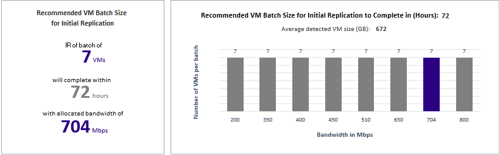

### Cost estimation
The graph shows the summary view of the estimated total disaster recovery (DR) cost to Azure of your chosen target region and the currency that you have specified for report generation.

The summary helps you to understand the cost that you need to pay for storage, compute, network, and license when you protect all your compatible VMs to Azure using Azure Site Recovery. The cost is calculated on for compatible VMs and not on all the profiled VMs.  

You can view the cost either monthly or yearly. Learn more about [supported target regions](./site-recovery-vmware-deployment-planner-cost-estimation.md#supported-target-regions) and [supported currencies](./site-recovery-vmware-deployment-planner-cost-estimation.md#supported-currencies).

**Cost by components**
The total DR cost is divided into four components: Compute, Storage, Network, and Azure Site Recovery license cost. The cost is calculated based on the consumption that will be incurred during replication and at DR drill time for compute, storage (premium and standard), ExpressRoute/VPN that is configured between the on-premises site and Azure, and Azure Site Recovery license.

**Cost by states**
The total disaster recovery (DR) cost is categories based on two different states - Replication and DR drill.

**Replication cost**:  The cost that will be incurred during replication. It covers the cost of storage, network, and Azure Site Recovery license.

**DR-Drill cost**: The cost that will be incurred during test failovers. Azure Site Recovery spins up VMs during test failover. The DR drill cost covers the running VMs’ compute and storage cost.

**Azure storage cost per Month/Year**
It shows the total storage cost that will be incurred for premium and standard storage for replication and DR drill.
You can view detailed cost analysis per VM in the [Cost Estimation](site-recovery-vmware-deployment-planner-cost-estimation.md) sheet.

### Growth factor and percentile values used
This section at the bottom of the sheet shows the percentile value used for all the performance counters of the profiled VMs (default is 95th percentile), and the growth factor (default is 30 percent) that's used in all the calculations.

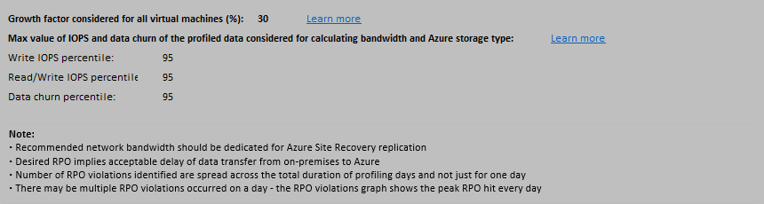

## Recommendations with available bandwidth as input

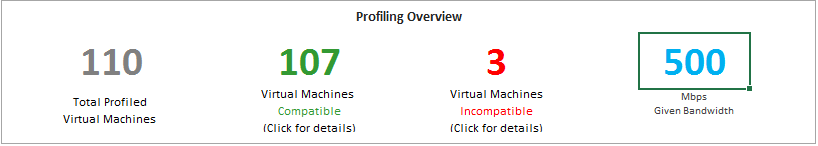

You might have a situation where you know that you cannot set a bandwidth of more than x Mbps for Site Recovery replication. The tool allows you to input available bandwidth (using the -Bandwidth parameter during report generation) and get the achievable RPO in minutes. With this achievable RPO value, you can decide whether you need to set up additional bandwidth or you are OK with having a disaster recovery solution with this RPO.

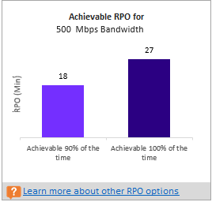

## VM-storage placement

>[!Note]
>Deployment Planner v2.5 onwards recommends the storage placement for machines which will replicate directly to managed disks.

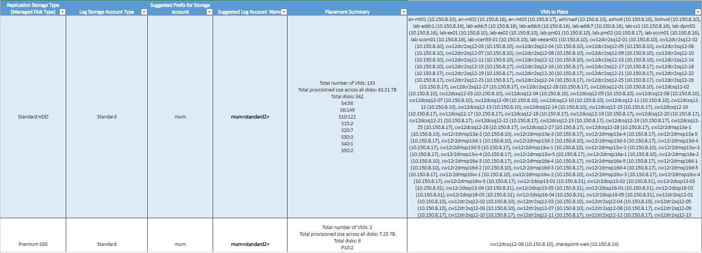

**Replication Storage Type**: Either a standard or premium managed disk, which is used to replicate all the corresponding VMs mentioned in the **VMs to Place** column.

**Log Storage Account Type**: All the replication logs are stored in a standard storage account.

**Suggested Prefix for Storage Account**: The suggested three-character prefix that can be used for naming the cache storage account. You can use your own prefix, but the tool's suggestion follows the [partition naming convention for storage accounts](/en-in/azure/storage/blobs/storage-performance-checklist).

**Suggested Log Account Name**: The storage-account name after you include the suggested prefix. Replace the name within the angle brackets (< and >) with your custom input.

**Placement Summary**: A summary of the disks needed to protected VMs by storage type. It includes the total number of VMs, total provisioned size across all disks, and total number of disks.

**Virtual Machines to Place**: A list of all the VMs that should be placed on the given storage account for optimal performance and use.

## Compatible VMs
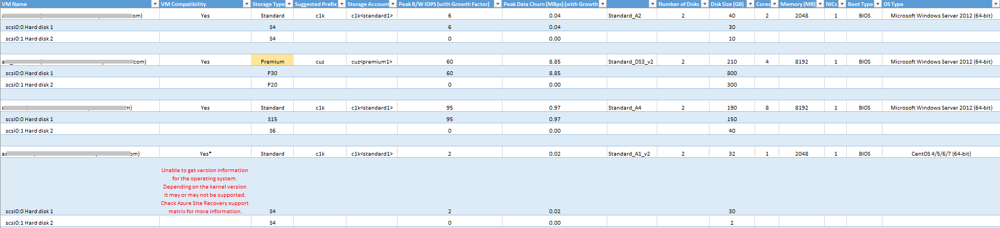

**VM Name**: The VM name or IP address that's used in the VMListFile when a report is generated. This column also lists the disks (VMDKs) that are attached to the VMs. To distinguish vCenter VMs with duplicate names or IP addresses, the names include the ESXi host name. The listed ESXi host is the one where the VM was placed when the tool discovered during the profiling period.

**VM Compatibility**: Values are **Yes** and **Yes\***. **Yes**\* is for instances in which the VM is a fit for [premium SSDs](../virtual-machines/disks-types.md). Here, the profiled high-churn or IOPS disk fits in the P20 or P30 category, but the size of the disk causes it to be mapped down to a P10 or P20. The storage account decides which premium storage disk type to map a disk to, based on its size. For example:
* <128 GB is a P10.
* 128 GB to 256 GB is a P15
* 256 GB to 512 GB is a P20.
* 512 GB to 1024 GB is a P30.
* 1025 GB to 2048 GB is a P40.
* 2049 GB to 4095 GB is a P50.

For example, if the workload characteristics of a disk put it in the P20 or P30 category, but the size maps it down to a lower premium storage disk type, the tool marks that VM as **Yes**\*. The tool also recommends that you either change the source disk size to fit into the recommended premium storage disk type or change the target disk type post-failover.

**Storage Type**: Standard or premium.

**Asrseeddisk (Managed Disk) created for replication**: The name of the disk that is created when you enable replication. It stores the data and its snapshots in Azure.

**Peak R/W IOPS (with Growth Factor)**: The peak workload read/write IOPS on the disk (default is 95th percentile), including the future growth factor (default is 30 percent). Note that the total read/write IOPS of a VM is not always the sum of the VM’s individual disks’ read/write IOPS, because the peak read/write IOPS of the VM is the peak of the sum of its individual disks' read/write IOPS during every minute of the profiling period.

**Peak Data Churn in Mbps (with Growth Factor)**: The peak churn rate on the disk (default is 95th percentile), including the future growth factor (default is 30 percent). Note that the total data churn of the VM is not always the sum of the VM’s individual disks’ data churn, because the peak data churn of the VM is the peak of the sum of its individual disks' churn during every minute of the profiling period.

**Azure VM Size**: The ideal mapped Azure Cloud Services virtual-machine size for this on-premises VM. The mapping is based on the on-premises VM’s memory, number of disks/cores/NICs, and read/write IOPS. The recommendation is always the lowest Azure VM size that matches all of the on-premises VM characteristics.

**Number of Disks**: The total number of virtual machine disks (VMDKs) on the VM.

**Disk size (GB)**: The total setup size of all disks of the VM. The tool also shows the disk size for the individual disks in the VM.

**Cores**: The number of CPU cores on the VM.

**Memory (MB)**: The RAM on the VM.

**NICs**: The number of NICs on the VM.

**Boot Type**: Boot type of the VM. It can be either BIOS or EFI.  Currently Azure Site Recovery supports Windows Server EFI VMs (Windows Server 2012, 2012 R2 and 2016) provided the number of partitions in the boot disk is less than 4 and boot sector size is 512 bytes. To protect EFI VMs, Azure Site Recovery mobility service version must be 9.13 or above. Only failover is supported for EFI VMs. Failback is not supported.  

**OS Type**: It is OS type of the VM. It can be either Windows or Linux or other based on the chosen template from VMware vSphere while creating the VM.  

## Incompatible VMs

**VM Name**: The VM name or IP address that's used in the VMListFile when a report is generated. This column also lists the VMDKs that are attached to the VMs. To distinguish vCenter VMs with duplicate names or IP addresses, the names include the ESXi host name. The listed ESXi host is the one where the VM was placed when the tool discovered during the profiling period.

**VM Compatibility**: Indicates why the given VM is incompatible for use with Site Recovery. The reasons are described for each incompatible disk of the VM and, based on published [storage limits](/en-in/azure/storage/common/scalability-targets-standard-account), can be any of the following:

* Wrong data disk size or wrong OS disk size. [Review](vmware-physical-azure-support-matrix.md#azure-vm-requirements) the support limits. 
* Total VM size (replication + TFO) exceeds the supported storage-account size limit (35 TB). This incompatibility usually occurs when a single disk in the VM has a performance characteristic that exceeds the maximum supported Azure or Site Recovery limits for standard storage. Such an instance pushes the VM into the premium storage zone. However, the maximum supported size of a premium storage account is 35 TB, and a single protected VM cannot be protected across multiple storage accounts. Also note that when a test failover is executed on a protected VM, it runs in the same storage account where replication is progressing. In this instance, set up 2x the size of the disk for replication to progress and test failover to succeed in parallel.

* Source IOPS exceeds supported storage IOPS limit of 7500 per disk.

* Source IOPS exceeds supported storage IOPS limit of 80,000 per VM.

* Average data churn exceeds supported Site Recovery data churn limit of 20 MB/s for average I/O size for the disk.

* Peak data churn across all disks on the VM exceeds the maximum supported Site Recovery peak data churn limit of 54 MB/s per VM.

* Average effective write IOPS exceeds the supported Site Recovery IOPS limit of 840 for disk.

* Calculated snapshot storage exceeds the supported snapshot storage limit of 10 TB.

* Total data churn per day exceeds supported churn per day limit of 2 TB by a Process Server.

**Peak R/W IOPS (with Growth Factor)**: The peak workload IOPS on the disk (default is 95th percentile), including the future growth factor (default is 30 percent). Note that the total read/write IOPS of the VM is not always the sum of the VM’s individual disks’ read/write IOPS, because the peak read/write IOPS of the VM is the peak of the sum of its individual disks' read/write IOPS during every minute of the profiling period.

**Peak Data Churn in Mbps (with Growth Factor)**: The peak churn rate on the disk (default 95th percentile) including the future growth factor (default 30 percent). Note that the total data churn of the VM is not always the sum of the VM’s individual disks’ data churn, because the peak data churn of the VM is the peak of the sum of its individual disks' churn during every minute of the profiling period.

**Number of Disks**: The total number of VMDKs on the VM.

**Disk size (GB)**: The total setup size of all disks of the VM. The tool also shows the disk size for the individual disks in the VM.

**Cores**: The number of CPU cores on the VM.

**Memory (MB)**: The amount of RAM on the VM.

**NICs**: The number of NICs on the VM.

**Boot Type**: Boot type of the VM. It can be either BIOS or EFI.  Currently Azure Site Recovery supports Windows Server EFI VMs (Windows Server 2012, 2012 R2 and 2016) provided the number of partitions in the boot disk is less than 4 and boot sector size is 512 bytes. To protect EFI VMs, Azure Site Recovery mobility service version must be 9.13 or above. Only failover is supported for EFI VMs. Failback is not supported.

**OS Type**:  It is OS type of the VM. It can be either Windows or Linux or other based on the chosen template from VMware vSphere while creating the VM.

## Azure Site Recovery limits
The following table provides the Azure Site Recovery limits. These limits are based on our tests, but they cannot cover all possible application I/O combinations. Actual results can vary based on your application I/O mix. For best results, even after deployment planning, we always recommend that you perform extensive application testing by issuing a test failover to get the true performance picture of the application.

**Replication storage target** | **Average source disk I/O size** |**Average source disk data churn** | **Total source disk data churn per day**
---|---|---|---
Standard storage | 8 KB	| 2 MB/s | 168 GB per disk
Premium P10 or P15 disk | 8 KB	| 2 MB/s | 168 GB per disk
Premium P10 or P15 disk | 16 KB | 4 MB/s |	336 GB per disk
Premium P10 or P15 disk | 32 KB or greater | 8 MB/s | 672 GB per disk
Premium P20 or P30 or P40 or P50 disk | 8 KB	| 5 MB/s | 421 GB per disk
Premium P20 or P30 or P40 or P50 disk | 16 KB or greater | 20 MB/s | 1684 GB per disk

**Source data churn** | **Maximum Limit**
---|---
Peak data churn across all disks on a VM | 54 MB/s
Maximum data churn per day supported by a Process Server | 2 TB

These are average numbers assuming a 30 percent I/O overlap. Site Recovery is capable of handling higher throughput based on overlap ratio, larger write sizes, and actual workload I/O behavior. The preceding numbers assume a typical backlog of approximately five minutes. That is, after data is uploaded, it is processed and a recovery point is created within five minutes.

## Cost estimation
Learn more about [cost estimation](site-recovery-vmware-deployment-planner-cost-estimation.md).

## Next steps
Learn more about [cost estimation](site-recovery-vmware-deployment-planner-cost-estimation.md).