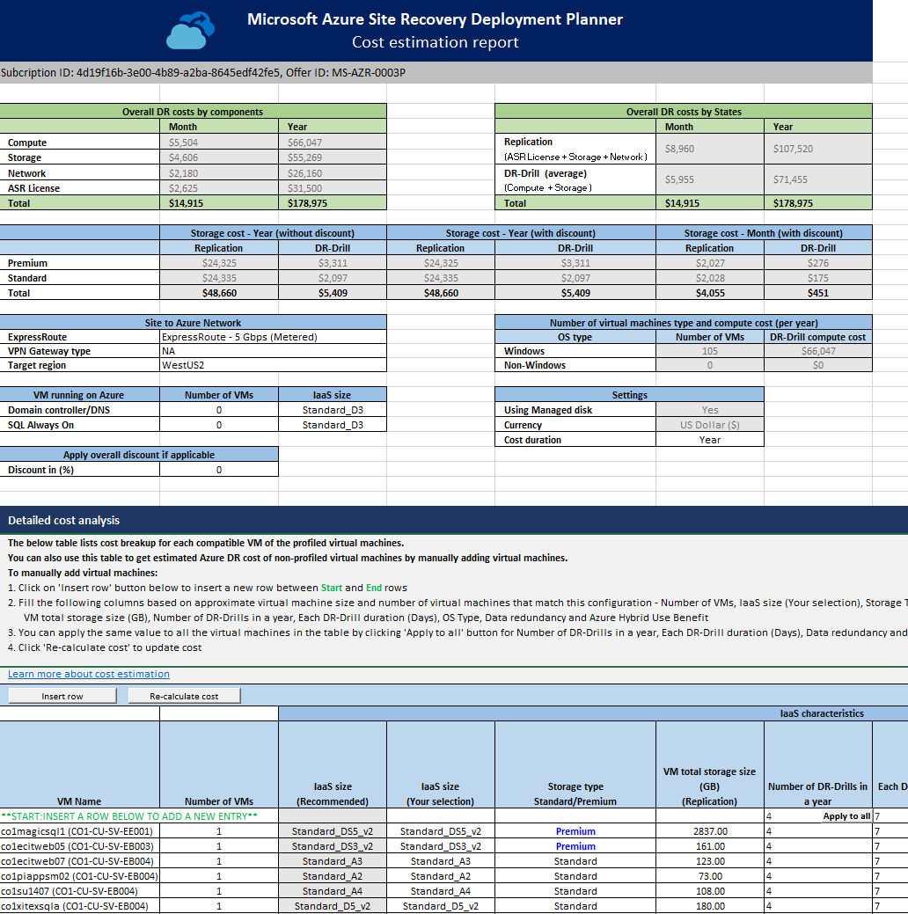

# Review cost estimations in the VMware Deployment Planner 

The deployment planner report provides the cost estimation summary in [Recommendations](site-recovery-vmware-deployment-planner-analyze-report.md#recommendations) sheets and detailed cost analysis in Cost Estimation sheet. It has the detailed cost analysis per virtual machine. 

>[!Note]
>The current version of Deployment planner tool v2.5 provides cost estimation for virtual machines replicating to Managed Disks.

### Cost estimation summary 
The graph shows the summary view of the estimated total disaster recovery (DR) cost to Azure of your chosen target region and the currency that you have specified for report generation.
Cost estimation summary

The summary helps you to understand the cost that you need to pay for storage, compute, network, and license when you protect all your compatible virtual machines to Azure using Azure Site Recovery. The cost is calculated on for compatible virtual machines and not on all the profiled virtual machines.  
 
You can view the cost either monthly or yearly. Learn more about [supported target regions](./site-recovery-vmware-deployment-planner-cost-estimation.md#supported-target-regions) and [supported currencies](./site-recovery-vmware-deployment-planner-cost-estimation.md#supported-currencies).

**Cost by components**
The total DR cost is divided into four components: Compute, Storage, Network, and Azure Site Recovery license cost. The cost is calculated based on the consumption that is incurred during replication and at DR drill time for compute, storage (premium and standard), ExpressRoute/VPN that is configured between the on-premises site and Azure, and Azure Site Recovery license.

**Cost by states**
The total disaster recovery (DR) cost is categories based on two different states - Replication and DR drill. 

**Replication cost**:  The cost that is incurred during replication. It covers the cost of storage, network, and Azure Site Recovery license. 

**DR-Drill cost**: The cost that is incurred during test failovers. Azure Site Recovery spins up virtual machines during test failover. The DR drill cost covers the running virtual machines’ compute and storage cost. 

**Azure storage cost per Month/Year**
It shows the total storage cost that is incurred for premium and standard storage for replication and DR drill.

## Detailed cost analysis
Azure prices for compute, storage, network, etc. varies across Azure regions. You can generate a cost estimation report with the latest Azure prices based on your subscription, the offer that is associated with your subscription and for the specified target Azure region in the specified currency. By default, the tool uses West US 2 Azure region and US dollar (USD) currency. If you have used any other region and currency, the next time when you generate a report without subscription ID, offer ID, target region, and currency, it'll use prices of the last used target region and last used currency for cost estimation.
This section shows the subscription ID and offer ID that you have used for report generation.  If not used, it's blank.

In the whole report, the cells marked in gray are read only. Cells in white can be modified per your requirements.

### Overall DR cost by components
The first section shows the overall DR cost by components and DR cost by states. 

**Compute**: Cost of IaaS virtual machines that run on Azure for DR needs. It includes virtual machines that are created by Azure Site Recovery during DR-drills (test failovers) and virtual machines running on Azure like SQL Server with Always On Availability Groups and domain controllers / Domain Name Servers.

**Storage**: Cost of Azure storage consumption for DR needs. It includes storage consumption for replication and during DR drills.
Network: ExpressRoute and Site to Site VPN cost for DR needs. 

**ASR license**: Azure Site Recovery license cost for all compatible virtual machines. If you have manually entered a virtual machine in the detailed cost analysis table, Azure Site Recovery license cost is also included for that virtual machine.

### Overall DR cost by states
The total DR cost is categorized based on two different states - replication and DR-Drill.

**Replication cost**: The cost incurs at the time of replication. It covers the cost of storage, network, and Azure Site Recovery license. 

**DR-Drill cost**: The cost incurs at the time of  DR drills. Azure Site Recovery spins up virtual machines during DR drills. The DR drill cost covers compute and storage cost of the running virtual machines.

1.	Total DR drill duration in a year = Number of DR drills x Each DR drill duration (days)

2.	Average DR drill cost (per month) = Total DR drill cost / 12

### Storage cost table:
This table shows premium and standard storage cost incur for replication and DR drills with and without discount.

### Site to Azure network
Select the appropriate setting as per your requirements. 

**ExpressRoute**: By default, the tool selects the nearest ExpressRoute plan that matches with the required network bandwidth for delta replication. You can change the plan as per your requirements.

**VPN Gateway**: Select the VPN Gateway if you have any in your environment. By default, it's NA.

**Target Region**: Specified Azure region for DR. The price used in the report for compute, storage, network, and license is based on the Azure pricing for that region. 

### Virtual machine running on Azure
If you have any domain controller or DNS virtual machine or SQL Server virtual machine with Always On Availability Groups  running on Azure for DR, you can provide the number of virtual machines and the size to consider their computing cost in the total DR cost. 

### Apply overall discount if applicable
If you are an Azure partner or a customer and are entitled to any discount on overall Azure pricing, you can use this field. The tool applies the discount (in %) on all components.

### Number of virtual machines type and compute cost (per year)
This table shows the number of Windows and non-Windows virtual machines and DR drill compute cost for them.

### Settings 

**Currency**: The currency in which the report is generated. 
Cost duration:  You can view all costs either for the month or for the whole year. 

## Detailed cost analysis table

The table lists the cost breakup for each compatible virtual machine. 
You can also use this table to get estimated Azure DR cost of nonprofiled virtual machines by manually adding virtual machines. It's useful in cases where you need to estimate Azure costs for a new disaster recovery deployment without detailed profiling being done.
To manually add virtual machines: 
1.	Click on the 'Insert row' button to insert a new row between the Start and End rows.

2.	Fill the following columns based on approximate virtual machine size and number of virtual machines that match this configuration: 

* Number of virtual machines, IaaS size (Your selection)
* Storage Type (Standard/Premium)
* virtual machine total storage size (GB) of the source machine
* Number of DR drills in a year 
* Each DR drill duration (Days) 
* OS Type
* Data redundancy 
* Azure Hybrid Benefit

1. You can apply the same value to all virtual machines in the table by clicking the **Apply to all** button for Number of DR-Drills in a year, Each DR-Drill duration (Days), Data redundancy, and Azure Hybrid Use Benefit.

1. Click **Recalculate cost** to update cost.

**virtual machine Name**: The name of the virtual machine.

**Number of virtual machines**: The number of virtual machines that match the configuration. You can update the number of the existing virtual machines if similar configuration virtual machines are not profiled but are protected.

**IaaS size (Recommendation)**: It's the virtual machine role size of the compatible virtual machine that the tool recommends. 

**IaaS size (Your selection)**: By default, it's the same as recommended virtual machine role size. You can change the role based on your requirement. Compute cost is based on your selected virtual machine role size.

**Storage type**: The type of the storage that is used by the virtual machine. It's either standard or premium storage.

**virtual machine total storage size (GB)**: The total storage of the source virtual machine.

**Number of DR-Drills in a year**: The number of times you perform DR-Drills in a year. By default, it's 4 times in a year. You can modify the period for specific virtual machines or apply the new value to all virtual machines by entering the new value on the top row and clicking the **Apply to all** button. Based on number of DR-Drills in a year and each DR-Drill duration period, the total DR-Drill cost is calculated.  

**Each DR-Drill duration (Days)**: The duration of each DR-Drill. By default, it's 7 days every 90 days as per the [Disaster Recovery Software Assurance benefit](https://azure.microsoft.com/pricing/details/site-recovery). You can modify the period for specific virtual machines or you can apply a new value to all virtual machines by entering new value on the top row and clicking the **Apply to all** button. The total DR-Drill cost is calculated based on number of DR-Drills in a year and each DR-Drill duration period.
  
**OS Type**: The OS type of the virtual machine. It's either Windows or Linux. If the OS type is Windows, then Azure Hybrid Use Benefit can be applied to that virtual machine. 

**Data redundancy**: It can be one of the following - Locally redundant storage (LRS), Geo-redundant storage (GRS) or Read-access geo-redundant storage (RA-GRS). Default is LRS. You can change the type based on your storage account for specific virtual machines or you can apply the new type to all virtual machines by changing the type of the top row and clicking **Apply to all** button.  The cost of storage for replication is calculated based on the price of data redundancy that you have selected. 

**Azure Hybrid Benefit**: You can apply Azure Hybrid Benefit to Windows virtual machines if applicable.  Default is Yes. You can change the setting for specific virtual machines or update all virtual machines by clicking the **Apply to all** button.

**Total Azure consumption**: It includes compute, storage, and Azure Site Recovery license cost for your DR. Based on your selection, it shows the cost either monthly or yearly.

**Steady state replication cost**: It includes storage cost for replication.

**Total DR-Drill cost (average)**: It includes compute and storage cost for DR-Drill.

**ASR license cost**: Azure Site Recovery license cost.

## Supported target regions
The Azure Site Recovery deployment planner provides cost estimation for the following Azure regions. If your region is not listed below, you can use any of the following regions whose pricing is nearest to your region.

eastus, eastus2, westus, centralus, northcentralus, southcentralus, northeurope, westeurope, eastasia, southeastasia, japaneast, japanwest, australiaeast, australiasoutheast, brazilsouth, southindia, centralindia, westindia, canadacentral, canadaeast, westus2, westcentralus, uksouth, ukwest, koreacentral, koreasouth 

## Supported currencies
The Azure Site Recovery Deployment Planner can generate the cost report with any of the following currencies.

|Currency|Name|Currency|Name|Currency|Name|
|---|---|---|---|---|---|---|---|
|ARS|Argentine Peso ($)|AUD|Australian Dollar ($)|BRL|Brazilian Real (R$)|
|CAD|Canadian Dollar ($)|CHF|Swiss Franc. (chf)|DKK|Danish Krone (kr)|
|EUR|Euro (€)|GBP|British Pound (£)|HKD|Hong Kong Dollar (HK$)|
|IDR|Indonesia rupiah (Rp)|INR|Indian Rupee (₹)|JPY|Japanese Yen (¥)|
|KRW|Korean Won (₩)|MXN|Mexican Peso (MX$)|MYR|Malaysian Ringgit (RM$)|
|NOK|Norwegian Krone (kr)|NZD|New Zealand Dollar ($)|RUB|Russian Ruble (руб)|
|SAR|Saudi Riyal (SR)|SEK|Swedish Krona (kr)|TWD|Taiwanese Dollar (NT$)|
|TRY|Turkish Lira (TL)|USD| US Dollar ($)|ZAR|South African Rand (R)|

## Next steps
Learn more about protecting [VMware virtual machines to Azure using Azure Site Recovery](./vmware-azure-tutorial.md).
