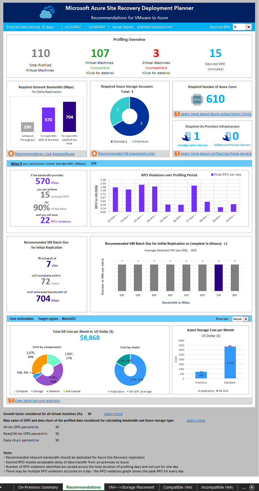

# Run the Deployment Planner for VMware disaster recovery
This article is the Azure Site Recovery Deployment Planner user guide for VMware-to-Azure production deployments.


## Modes of running deployment planner
You can run the command-line tool (ASRDeploymentPlanner.exe) in any of the following three modes:

1.	[Profiling](#profile-vmware-vms)
2.	[Report generation](#generate-report)
3.	[Get throughput](#get-throughput)

First, run the tool in profiling mode to gather VM data churn and IOPS. Next, run the tool to generate the report to find the network bandwidth, storage requirements and DR cost.

## Profile VMware VMs
In profiling mode, the deployment planner tool connects to the vCenter server/vSphere ESXi host to collect performance data about the VM.

* Profiling does not affect the performance of the production VMs, because no direct connection is made to them. All performance data is collected from the vCenter server/vSphere ESXi host.
* To ensure that there is a negligible impact on the server because of profiling, the tool queries the vCenter server/vSphere ESXi host once every 15 minutes. This query interval does not compromise profiling accuracy, because the tool stores every minute’s performance counter data.

### Create a list of VMs to profile
First, you need a list of the VMs to be profiled. You can get all the names of VMs on a vCenter server/vSphere ESXi host by using the VMware vSphere PowerCLI commands in the following procedure. Alternatively, you can list in a file the friendly names or IP addresses of the VMs that you want to profile manually.

1. Sign in to the VM that VMware vSphere PowerCLI is installed in.
2. Open the VMware vSphere PowerCLI console.
3. Ensure that the execution policy is enabled for the script. If it is disabled, launch the VMware vSphere PowerCLI console in administrator mode, and then enable it by running the following command:

			Set-ExecutionPolicy –ExecutionPolicy AllSigned

4. You may optionally need to run the following command if Connect-VIServer is not recognized as the name of cmdlet.

			Add-PSSnapin VMware.VimAutomation.Core

5. To get all the names of VMs on a vCenter server/vSphere ESXi host and store the list in a .txt file, run the two commands listed here.
Replace &lsaquo;server name&rsaquo;, &lsaquo;user name&rsaquo;, &lsaquo;password&rsaquo;, &lsaquo;outputfile.txt&rsaquo;; with your inputs.

			Connect-VIServer -Server <server name> -User <user name> -Password <password>

			Get-VM |  Select Name | Sort-Object -Property Name >  <outputfile.txt>

6. Open the output file in Notepad, and then copy the names of all VMs that you want to profile to another file (for example, ProfileVMList.txt), one VM name per line. This file is used as input to the *-VMListFile* parameter of the command-line tool.

	

### Start profiling
After you have the list of VMs to be profiled, you can run the tool in profiling mode. Here is the list of mandatory and optional parameters of the tool to run in profiling mode.

```
ASRDeploymentPlanner.exe -Operation StartProfiling /?
```

| Parameter name | Description |
|---|---|
| -Operation | StartProfiling |
| -Server | The fully qualified domain name or IP address of the vCenter server/vSphere ESXi host whose VMs are to be profiled.|
| -User | The user name to connect to the vCenter server/vSphere ESXi host. The user needs to have read-only access, at minimum.|
| -VMListFile |	The file that contains the list of VMs to be profiled. The file path can be absolute or relative. The file should contain one VM name/IP address per line. Virtual machine name specified in the file should be the same as the VM name on the vCenter server/vSphere ESXi host.<br>For example, the file VMList.txt contains the following VMs:<ul><li>virtual_machine_A</li><li>10.150.29.110</li><li>virtual_machine_B</li><ul> |
|-NoOfMinutesToProfile|The number of minutes for which profiling is to be run. Minimum is 30 minutes.|
|-NoOfHoursToProfile|The number of hours for which profiling is to be run.|
| -NoOfDaysToProfile | The number of days for which profiling is to be run. We recommend that you run profiling for more than 7 days to ensure that the workload pattern in your environment over the specified period is observed and used to provide an accurate recommendation. |
|-Virtualization|Specify the virtualization type (VMware or Hyper-V).|
| -Directory | (Optional) The universal naming convention (UNC) or local directory path to store profiling data generated during profiling. If a directory name is not given, the directory named ‘ProfiledData’ under the current path will be used as the default directory. |
| -Password | (Optional) The password to use to connect to the vCenter server/vSphere ESXi host. If you do not specify one now, you will be prompted for it when the command is executed.|
|-Port|(Optional) Port number to connect to vCenter/ESXi host. Default port is 443.|
|-Protocol| (Optional) Specified the protocol either ‘http’ or ‘https’ to connect to vCenter. Default protocol is https.|
| -StorageAccountName | (Optional) The storage-account name that's used to find the throughput achievable for replication of data from on-premises to Azure. The tool uploads test data to this storage account to calculate throughput. The storage account must be General-purpose v1 (GPv1) type. |
| -StorageAccountKey | (Optional) The storage-account key that's used to access the storage account. Go to the Azure portal > Storage accounts > <*Storage account name*> > Settings > Access Keys > Key1. |
| -Environment | (optional) This is your target Azure Storage account environment. This can be one of three values - AzureCloud,AzureUSGovernment, AzureChinaCloud. Default is AzureCloud. Use the parameter when your target Azure region is either Azure US Government or Azure China 21Vianet. |


We recommend that you profile your VMs for more than 7 days. If churn pattern varies in a month, we recommend to profile during the week when you see the maximum churn. The best way is to profile for 31 days to get better recommendation. During the profiling period, ASRDeploymentPlanner.exe keeps running. The tool takes profiling time input in days. For a quick test of the tool or for proof of concept you can profile for few hours or minutes. The minimum allowed profiling time is 30 minutes.

During profiling, you can optionally pass a storage-account name and key to find the throughput that Site Recovery can achieve at the time of replication from the configuration server or process server to Azure. If the storage-account name and key are not passed during profiling, the tool does not calculate achievable throughput.

You can run multiple instances of the tool for various sets of VMs. Ensure that the VM names are not repeated in any of the profiling sets. For example, if you have profiled ten VMs (VM1 through VM10) and after few days you want to profile another five VMs (VM11 through VM15), you can run the tool from another command-line console for the second set of VMs (VM11 through VM15). Ensure that the second set of VMs do not have any VM names from the first profiling instance or you use a different output directory for the second run. If two instances of the tool are used for profiling the same VMs and use the same output directory, the generated report will be incorrect.

By default, the tool is configured to profile and generate report up to 1000 VMs. You can change limit by changing MaxVMsSupported key value in *ASRDeploymentPlanner.exe.config* file.
```
<!-- Maximum number of vms supported-->
<add key="MaxVmsSupported" value="1000"/>
```
With the default settings, to profile say 1500 VMs, create two VMList.txt files. One with 1000 VMs and other with 500 VM list. Run the two instances of Azure Site Recovery Deployment Planner, one with VMList1.txt and other with VMList2.txt. You can use the same directory path to store the profiled data of both the VMList VMs.

We have seen that based on the hardware configuration especially RAM size of the server from where the tool is run to generate the report, the operation may fail with insufficient memory. If you have good hardware, you can change the  MaxVMsSupported any higher value.  

If you have multiple vCenter servers, you need to run one instance of ASRDeploymentPlanner for each vCenter server for profiling.

VM configurations are captured once at the beginning of the profiling operation and stored in a file called VMDetailList.xml. This information is used when the report is generated. Any change in VM configuration (for example, an increased number of cores, disks, or NICs) from the beginning to the end of profiling is not captured. If a profiled VM configuration has changed during the course of profiling, in the public preview, here is the workaround to get latest VM details when generating the report:

* Back up VMdetailList.xml, and delete the file from its current location.
* Pass -User and -Password arguments at the time of report generation.

The profiling command generates several files in the profiling directory. Do not delete any of the files, because doing so affects report generation.

#### Example 1: Profile VMs for 30 days, and find the throughput from on-premises to Azure
```
ASRDeploymentPlanner.exe -Operation StartProfiling -Virtualization VMware -Directory “E:\vCenter1_ProfiledData” -Server vCenter1.contoso.com -VMListFile “E:\vCenter1_ProfiledData\ProfileVMList1.txt”  -NoOfDaysToProfile  30  -User vCenterUser1 -StorageAccountName  asrspfarm1 -StorageAccountKey Eby8vdM02xNOcqFlqUwJPLlmEtlCDXJ1OUzFT50uSRZ6IFsuFq2UVErCz4I6tq/K1SZFPTOtr/KBHBeksoGMGw==
```

#### Example 2: Profile VMs for 15 days

```
ASRDeploymentPlanner.exe -Operation StartProfiling -Virtualization VMware -Directory “E:\vCenter1_ProfiledData” -Server vCenter1.contoso.com -VMListFile “E:\vCenter1_ProfiledData\ProfileVMList1.txt” -NoOfDaysToProfile  15  -User vCenterUser1
```

#### Example 3: Profile VMs for 60 minutes for a quick test of the tool
```
ASRDeploymentPlanner.exe -Operation StartProfiling -Virtualization VMware -Directory “E:\vCenter1_ProfiledData” -Server vCenter1.contoso.com -VMListFile “E:\vCenter1_ProfiledData\ProfileVMList1.txt”  -NoOfMinutesToProfile 60  -User vCenterUser1
```

#### Example 4: Profile VMs for 2 hours for a proof of concept
```
ASRDeploymentPlanner.exe -Operation StartProfiling -Virtualization VMware -Directory “E:\vCenter1_ProfiledData” -Server vCenter1.contoso.com -VMListFile “E:\vCenter1_ProfiledData\ProfileVMList1.txt” -NoOfHoursToProfile 2 -User vCenterUser1
```

>[!NOTE]
>
>* If the server that the tool is running on is rebooted or has crashed, or if you close the tool by using Ctrl + C, the profiled data is preserved. However, there is a chance of missing the last 15 minutes of profiled data. In such an instance, rerun the tool in profiling mode after the server restarts.
>* When the storage-account name and key are passed, the tool measures the throughput at the last step of profiling. If the tool is closed before profiling is completed, the throughput is not calculated. To find the throughput before generating the report, you can run the GetThroughput operation from the command-line console. Otherwise, the generated report will not contain the throughput information.


## Generate report
The tool generates a macro-enabled Microsoft Excel file (XLSM file) as the report output, which summarizes all the deployment recommendations. The report is named `DeploymentPlannerReport_<unique numeric identifier>.xlsm` and placed in the specified directory.

>[!NOTE]
>The report generation requires a Windows PC or Windows Server with Excel 2013 or later. The decimal symbol on this machine should be configured as "." to produce the cost estimates. In case you have setup "," as decimal symbol, please go to "Change date, time or number formats" in Control Panel and go to "Additional Settings" to change the decimal symbol to ".".

After profiling is complete, you can run the tool in report-generation mode. The following table contains a list of mandatory and optional tool parameters to run in report-generation mode.

`ASRDeploymentPlanner.exe -Operation GenerateReport /?`

|Parameter name | Description |
|-|-|
| -Operation | GenerateReport |
| -Server |  The vCenter/vSphere server fully qualified domain name or IP address (use the same name or IP address that you used at the time of profiling) where the profiled VMs whose report is to be generated are located. Note that if you used a vCenter server at the time of profiling, you cannot use a vSphere server for report generation, and vice-versa.|
| -VMListFile | The file that contains the list of profiled VMs that the report is to be generated for. The file path can be absolute or relative. The file should contain one VM name or IP address per line. The VM names that are specified in the file should be the same as the VM names on the vCenter server/vSphere ESXi host, and match what was used during profiling.|
|-Virtualization|Specify the virtualization type (VMware or Hyper-V).|
| -Directory | (Optional) The UNC or local directory path where the profiled data (files generated during profiling) is stored. This data is required for generating the report. If a name isn't specified, ‘ProfiledData’ directory will be used. |
| -GoalToCompleteIR | (Optional) The number of hours in which the initial replication of the profiled VMs needs to be completed. The generated report provides the number of VMs for which initial replication can be completed in the specified time. The default is 72 hours. |
| -User | (Optional) The user name to use to connect to the vCenter/vSphere server. The name is used to fetch the latest configuration information of the VMs, such as the number of disks, number of cores, and number of NICs, to use in the report. If the name isn't provided, the configuration information collected at the beginning of the profiling kickoff is used. |
| -Password | (Optional) The password to use to connect to the vCenter server/vSphere ESXi host. If the password isn't specified as a parameter, you will be prompted for it later when the command is executed. |
|-Port|(Optional) Port number to connect to vCenter/ESXi host. Default port is 443.|
|-Protocol|(Optional) Specified the protocol either ‘http’ or ‘https’ to connect to vCenter. Default protocol is https.|
| -DesiredRPO | (Optional) The desired recovery point objective, in minutes. The default is 15 minutes.|
| -Bandwidth | Bandwidth in Mbps. The parameter to use to calculate the RPO that can be achieved for the specified bandwidth. |
| -StartDate | (Optional) The start date and time in MM-DD-YYYY:HH:MM (24-hour format). *StartDate* must be specified along with *EndDate*. When StartDate is specified, the report is generated for the profiled data that's collected between StartDate and EndDate. |
| -EndDate | (Optional) The end date and time in MM-DD-YYYY:HH:MM (24-hour format). *EndDate* must be specified along with *StartDate*. When EndDate is specified, the report is generated for the profiled data that's collected between StartDate and EndDate. |
| -GrowthFactor | (Optional) The growth factor, expressed as a percentage. The default is 30 percent. |
| -UseManagedDisks | (Optional) UseManagedDisks - Yes/No. Default is Yes. The number of virtual machines that can be placed into a single storage account is calculated considering whether Failover/Test failover of virtual machines is done on managed disk instead of unmanaged disk. |
|-SubscriptionId |(Optional) The subscription GUID. Note that this parameter is required when you need to generate the cost estimation report with the latest price based on your subscription, the offer that is associated with your subscription and for your specific target Azure region in the **specified currency**.|
|-TargetRegion|(Optional) The Azure region where replication is targeted. Since Azure has different costs per region, to generate report with specific target Azure region use this parameter.<br>Default is WestUS2 or the last used target region.<br>Refer to the list of [supported target regions](site-recovery-vmware-deployment-planner-cost-estimation.md#supported-target-regions).|
|-OfferId|(Optional) The offer associated with the give subscription. Default is MS-AZR-0003P (Pay-As-You-Go).|
|-Currency|(Optional) The currency in which cost is shown in the generated report. Default is US Dollar ($) or the last used currency.<br>Refer to the list of [supported currencies](site-recovery-vmware-deployment-planner-cost-estimation.md#supported-currencies).|

By default, the tool is configured to profile and generate report up to 1000 VMs. You can change limit by changing MaxVMsSupported key value in *ASRDeploymentPlanner.exe.config* file.
```xml
<!-- Maximum number of vms supported-->
<add key="MaxVmsSupported" value="1000"/>
```

#### Example 1: Generate a report with default values when the profiled data is on the local drive
```
ASRDeploymentPlanner.exe -Operation GenerateReport -Virtualization VMware -Server vCenter1.contoso.com -Directory “E:\vCenter1_ProfiledData” -VMListFile “E:\vCenter1_ProfiledData\ProfileVMList1.txt”
```

#### Example 2: Generate a report when the profiled data is on a remote server
You should have read/write access on the remote directory.
```
ASRDeploymentPlanner.exe -Operation GenerateReport -Virtualization VMware -Server vCenter1.contoso.com -Directory “\\PS1-W2K12R2\vCenter1_ProfiledData” -VMListFile “\\PS1-W2K12R2\vCenter1_ProfiledData\ProfileVMList1.txt”
```

#### Example 3: Generate a report with a specific bandwidth and goal to complete IR within specified time
```
ASRDeploymentPlanner.exe -Operation GenerateReport -Virtualization VMware -Server vCenter1.contoso.com -Directory “E:\vCenter1_ProfiledData” -VMListFile “E:\vCenter1_ProfiledData\ProfileVMList1.txt” -Bandwidth 100 -GoalToCompleteIR 24
```

#### Example 4: Generate a report with a 5 percent growth factor instead of the default 30 percent
```
ASRDeploymentPlanner.exe -Operation GenerateReport -Virtualization VMware -Server vCenter1.contoso.com -Directory “E:\vCenter1_ProfiledData” -VMListFile “E:\vCenter1_ProfiledData\ProfileVMList1.txt” -GrowthFactor 5
```

#### Example 5: Generate a report with a subset of profiled data
For example, you have 30 days of profiled data and want to generate a report for only 20 days.
```
ASRDeploymentPlanner.exe -Operation GenerateReport -Virtualization VMware -Server vCenter1.contoso.com -Directory “E:\vCenter1_ProfiledData” -VMListFile “E:\vCenter1_ProfiledData\ProfileVMList1.txt” -StartDate  01-10-2017:12:30 -EndDate 01-19-2017:12:30
```

#### Example 6: Generate a report for 5-minute RPO
```
ASRDeploymentPlanner.exe -Operation GenerateReport -Virtualization VMware -Server vCenter1.contoso.com -Directory “E:\vCenter1_ProfiledData” -VMListFile “E:\vCenter1_ProfiledData\ProfileVMList1.txt”  -DesiredRPO 5
```

#### Example 7: Generate a report for South India Azure region with Indian Rupee and specific offer ID

Note that the subscription ID is required to generate cost report in a specific currency.
```
ASRDeploymentPlanner.exe -Operation GenerateReport -Virtualization VMware  -Directory “E:\vCenter1_ProfiledData” -VMListFile “E:\vCenter1_ProfiledData\ProfileVMList1.txt”  -SubscriptionID 4d19f16b-3e00-4b89-a2ba-8645edf42fe5 -OfferID MS-AZR-0148P -TargetRegion southindia -Currency INR
```

## Percentile value used for the calculation
**What default percentile value of the performance metrics collected during profiling does the tool use when it generates a report?**

The tool defaults to the 95th percentile values of read/write IOPS, write IOPS, and data churn that are collected during profiling of all the VMs. This metric ensures that the 100th percentile spike your VMs might see because of temporary events is not used to determine your target storage-account and source-bandwidth requirements. For example, a temporary event might be a backup job running once a day, a periodic database indexing or analytics report-generation activity, or other similar short-lived, point-in-time events.

Using 95th percentile values gives a true picture of real workload characteristics, and it gives you the best performance when the workloads are running on Azure. We do not anticipate that you would need to change this number. If you do change the value (to the 90th percentile, for example), you can update the configuration file *ASRDeploymentPlanner.exe.config* in the default folder and save it to generate a new report on the existing profiled data.
```xml
<add key="WriteIOPSPercentile" value="95" />      
<add key="ReadWriteIOPSPercentile" value="95" />      
<add key="DataChurnPercentile" value="95" />
```

## Growth-factor considerations
**Why should I consider growth factor when I plan deployments?**

It is critical to account for growth in your workload characteristics, assuming a potential increase in usage over time. After protection is in place, if your workload characteristics change, you cannot switch to a different storage account for protection without disabling and re-enabling the protection.

For example, let's say that today your VM fits in a standard storage replication account. Over the next three months, several changes are likely to occur:

* The number of users of the application that runs on the VM will increase.
* The resulting increased churn on the VM will require the VM to go to premium storage so that Site Recovery replication can keep pace.
* Consequently, you will have to disable and re-enable protection to a premium storage account.

We strongly recommend that you plan for growth during deployment planning and while the default value is 30 percent. You are the expert on your application usage pattern and growth projections, and you can change this number accordingly while generating a report. Moreover, you can  generate multiple reports with various growth factors with the same profiled data and determine what target storage and source bandwidth recommendations work best for you.

The generated Microsoft Excel report contains the following information:

* [On-premises Summary](site-recovery-vmware-deployment-planner-analyze-report.md#on-premises-summary)
* [Recommendations](site-recovery-vmware-deployment-planner-analyze-report.md#recommendations)
* [VM<->Storage Placement](site-recovery-vmware-deployment-planner-analyze-report.md#vm-storage-placement)
* [Compatible VMs](site-recovery-vmware-deployment-planner-analyze-report.md#compatible-vms)
* [Incompatible VMs](site-recovery-vmware-deployment-planner-analyze-report.md#incompatible-vms)
* [Cost Estimation](site-recovery-vmware-deployment-planner-cost-estimation.md)



## Get throughput

To estimate the throughput that Site Recovery can achieve from on-premises to Azure during replication, run the tool in GetThroughput mode. The tool calculates the throughput from the server that the tool is running on. Ideally, this server is based on the configuration server sizing guide. If you have already deployed Site Recovery infrastructure components on-premises, run the tool on the configuration server.

Open a command-line console, and go to the Site Recovery deployment planning tool folder. Run ASRDeploymentPlanner.exe with following parameters.

`ASRDeploymentPlanner.exe -Operation GetThroughput /?`

|Parameter name | Description |
|-|-|
| -Operation | GetThroughput |
|-Virtualization|Specify the virtualization type (VMware or Hyper-V).|
| -Directory | (Optional) The UNC or local directory path where the profiled data (files generated during profiling) is stored. This data is required for generating the report. If a directory name is not specified, ‘ProfiledData’ directory is used. |
| -StorageAccountName | The storage-account name that's used to find the bandwidth consumed for replication of data from on-premises to Azure. The tool uploads test data to this storage account to find the bandwidth consumed. The storage account must be either  General-purpose v1 (GPv1) type.|
| -StorageAccountKey | The storage-account key that's used to access the storage account. Go to the Azure portal > Storage accounts > <*Storage account name*> > Settings > Access Keys > Key1 (or a primary access key for a classic storage account). |
| -VMListFile | The file that contains the list of VMs to be profiled for calculating the bandwidth consumed. The file path can be absolute or relative. The file should contain one VM name/IP address per line. The VM names specified in the file should be the same as the VM names on the vCenter server/vSphere ESXi host.<br>For example, the file VMList.txt contains the following VMs:<ul><li>VM_A</li><li>10.150.29.110</li><li>VM_B</li></ul>|
| -Environment | (optional) This is your target Azure Storage account environment. This can be one of three values - AzureCloud,AzureUSGovernment, AzureChinaCloud. Default is AzureCloud. Use the parameter when your target Azure region is either Azure US Government or Azure China 21Vianet. |

The tool creates several 64-MB asrvhdfile<#>.vhd files (where "#" is the number of files) on the specified directory. The tool uploads the files to the storage account to find the throughput. After the throughput is measured, the tool deletes all the files from the storage account and from the local server. If the tool is terminated for any reason while it is calculating throughput, it doesn't delete the files from the storage or from the local server. You will have to delete them manually.

The throughput is measured at a specified point in time, and it is the maximum throughput that Site Recovery can achieve during replication, provided that all other factors remain the same. For example, if any application starts consuming more bandwidth on the same network, the actual throughput varies during replication. If you are running the GetThroughput command from a configuration server, the tool is unaware of any protected VMs and ongoing replication. The result of the measured throughput is different if the GetThroughput operation is run when the protected VMs have high data churn. We recommend that you run the tool at various points in time during profiling to understand what throughput levels can be achieved at various times. In the report, the tool shows the last measured throughput.

### Example
```
ASRDeploymentPlanner.exe -Operation GetThroughput -Directory  E:\vCenter1_ProfiledData -Virtualization VMware -VMListFile E:\vCenter1_ProfiledData\ProfileVMList1.txt  -StorageAccountName  asrspfarm1 -StorageAccountKey by8vdM02xNOcqFlqUwJPLlmEtlCDXJ1OUzFT50uSRZ6IFsuFq2UVErCz4I6tq/K1SZFPTOtr/KBHBeksoGMGw==
```

>[!NOTE]
>
> Run the tool on a server that has the same storage and CPU characteristics as the configuration server.
>
> For replication, set the recommended bandwidth to meet the RPO 100 percent of the time. After you set the right bandwidth, if you don’t see an increase in the achieved throughput reported by the tool, do the following:
>
>  1. Check to determine whether there is any network Quality of Service (QoS) that is limiting Site Recovery throughput.
>
>  2. Check to determine whether your Site Recovery vault is in the nearest physically supported Microsoft Azure region to minimize network latency.
>
>  3. Check your local storage characteristics to determine whether you can improve the hardware (for example, HDD to SSD).
>
>  4. Change the Site Recovery settings in the process server to [increase the amount of network bandwidth used for replication](./site-recovery-plan-capacity-vmware.md#control-network-bandwidth).

## Next steps
* [Analyze the generated report](site-recovery-vmware-deployment-planner-analyze-report.md).
