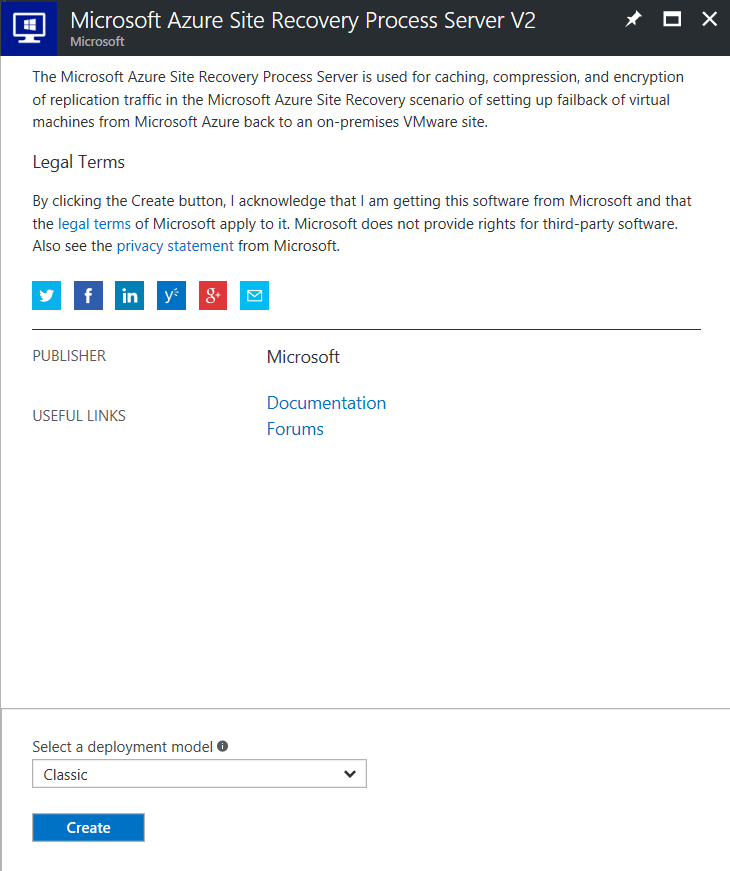
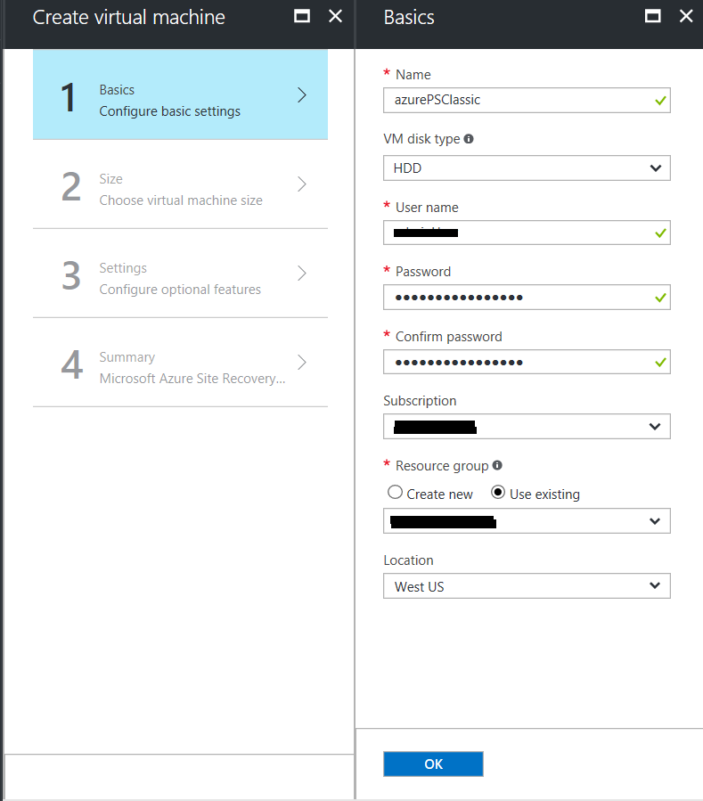
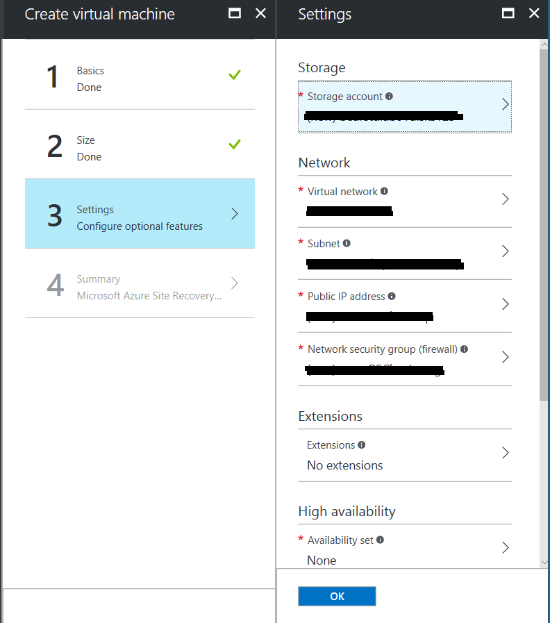

# Manage a Process Server running in Azure (Classic)
> [!div class="op_single_selector"]
> * [Azure Classic ](./site-recovery-vmware-setup-azure-ps-classic.md)
> * [Resource Manager](./site-recovery-vmware-setup-azure-ps-resource-manager.md)

During failback, it is recommended to deploy Process Server in Azure if there is high latency between the Azure Virtual Network and your on-premises network. This article describes how you can set up, configure, and manage the process servers running in Azure.

> [!NOTE]
> This article is to be used if you used Classic as the deployment model for the virtual machines during failover. If you used Resource Manager as the deployment model follow the steps in [How to set up & configure a Failback Process Server (Resource Manager)](./site-recovery-vmware-setup-azure-ps-resource-manager.md)

## Prerequisites

[!INCLUDE [site-recovery-vmware-process-server-prereq](../../includes/site-recovery-vmware-azure-process-server-prereq.md)]

## Deploy a Process Server on Azure

1. In Azure Marketplace, create a virtual machine using the **Microsoft Azure Site Recovery Process Server V2**  
    
2. Ensure that you select the deployment model as **Classic**  
  
3. In the Create virtual machine wizard > Basic Settings, ensure you select the Subscription and Location to where you failed over the virtual machines. 
  
4. Ensure that the virtual machine is connected to the Azure Virtual Network to which the failed over virtual machine is connected. 
  
5. Once the Process Server virtual machine is provisioned, you need to log in and register it with the Configuration Server.

> [!NOTE]
> To be able to use this Process Server for failback, you need to register it with the on-premises configuration server.

## Registering the Process Server (running in Azure) to a Configuration Server (running on-premises)

[!INCLUDE [site-recovery-vmware-register-process-server](../../includes/site-recovery-vmware-register-process-server.md)]

## Upgrading the Process Server to latest version.

[!INCLUDE [site-recovery-vmware-upgrade-process-server](../../includes/site-recovery-vmware-upgrade-process-server.md)]

## Unregistering the Process Server (running in Azure) from a Configuration Server (running on-premises)

[!INCLUDE [site-recovery-vmware-upgrade-process-server](../../includes/site-recovery-vmware-unregister-process-server.md)]
