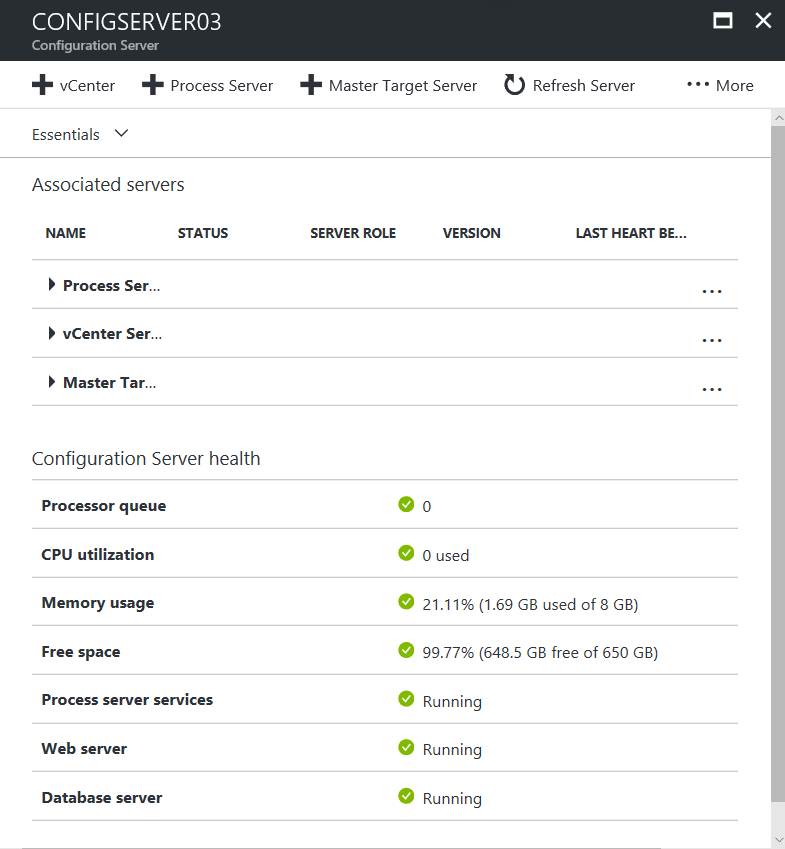
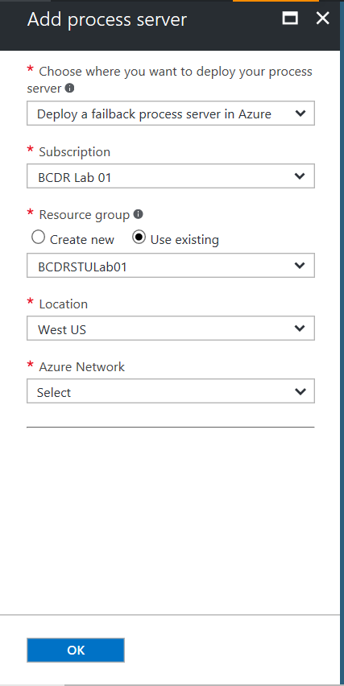
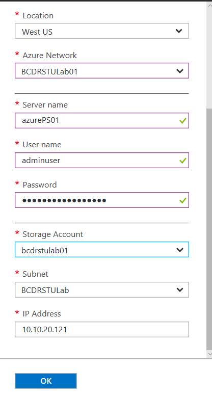

# Manage a process server running in Azure (Resource Manager)
> [!div class="op_single_selector"]
> * [Resource Manager](./site-recovery-vmware-setup-azure-ps-resource-manager.md)
> * [Classic ](./site-recovery-vmware-setup-azure-ps-classic.md)

During failback, it is recommended to deploy process server in Azure if there is high latency between the Azure Virtual Network and your on-premises network. This article describes how you can set up, configure, and manage the process servers running in Azure.

> [!NOTE]
> This article is to be used if you used **Resource Manager** as the deployment model for the virtual machines during failover. If you used **Classic** as the deployment model, follow the steps in [How to set up & configure a Failback process server (Classic)](./site-recovery-vmware-setup-azure-ps-classic.md)

## Prerequisites

[!INCLUDE [site-recovery-vmware-process-server-prerequ](../../includes/site-recovery-vmware-azure-process-server-prereq.md)]

## Deploy a process server on Azure
1. In the Vault > **Site Recovery Infrastructure** (under the "Manage" heading) > **Configuration Servers** (under "For VMware and Physical Machines" heading), select the configuration server.
2. In the Configuration Server details page that opens click "+ Process server"

  

3.  On the **Add process server** page, select the following values

  
|**Field Name**|**Value**|
|-|-|
|Choose where you want to deploy your process server|Select the value **Deploy a failback process server in Azure** |
|Subscription|Select the Azure Subscription where you failed over the virtual machines|
|Resource Group|You can create a Resource Group to deploy this process server or choose to deploy the process server in an existing Resource Group|
|Location|Select the Azure Data Center into which the virtual machines where failed over into|
|Azure Network|Select the Azure Virtual Network(VNet) that the virtual machines where failed over into. If you failed over virtual machines into multiple Azure VNets, then you need a process server deployed per VNet|

4. Fill in the rest of the properties for the process server

  
|**Field Name**|**Value**|
|-|-|
|Server Name|Display name & Host name for your process server virtual machine|
| User Name|A user name that becomes an Administrator on that virtual machine|
|Storage Account|Name of the Storage Account where the virtual machine's virtual disk's are placed|
|Subnet|The subnet of the Azure VNet to which the virtual machine is connected|
| IP Address|IP Address that you would like the process server to assume once it boots up|
5. Click the OK button to start deploying the process server virtual machine.

> [!NOTE]
> To be able to use this process server for failback, you need to register it with the on-premises configuration server.

## Registering the process server (running in Azure) to a Configuration Server (running on-premises)

[!INCLUDE [site-recovery-vmware-register-process-server](../../includes/site-recovery-vmware-register-process-server.md)]

## Upgrading the process server to latest version.

[!INCLUDE [site-recovery-vmware-upgrade-process-server](../../includes/site-recovery-vmware-upgrade-process-server.md)]

## Unregistering the process server (running in Azure) from a Configuration Server (running on-premises)

[!INCLUDE [site-recovery-vmware-unregister-process-server](../../includes/site-recovery-vmware-unregister-process-server.md)]
