<properties
	pageTitle="Replicate VMware virtual machines and physical servers to Azure with Azure Site Recovery (legacy) | Microsoft Azure" 
	description="Describes how to replicate on-premises VMs and Windows/Linux physical servers to Azure using Azure Site Recovery in a legacy deployment in the classic portal." 
	services="site-recovery"
	documentationCenter=""
	authors="rayne-wiselman"
	manager="jwhit"
	editor=""/>

<tags
	ms.service="site-recovery"
	ms.workload="backup-recovery"
	ms.tgt_pltfrm="na"
	ms.devlang="na"
	ms.topic="article"
	ms.date="05/22/2016"
	ms.author="raynew"/>

# Replicate VMware virtual machines and physical servers to Azure with Azure Site Recovery using the classic portal (legacy)

> [AZURE.SELECTOR]
- [Azure Portal](site-recovery-vmware-to-azure.md)
- [Classic Portal](site-recovery-vmware-to-azure-classic.md)
- [Classic Portal (legacy)](site-recovery-vmware-to-azure-classic-legacy.md)

Welcome to Azure Site Recovery! This article describes a legacy deployment for replicating on-premises VMware virtual machines or Windows/Linux physical servers to Azure using Azure Site Recovery in the classic portal.

## Overview

Organizations need a BCDR strategy that determines how apps, workloads, and data stay running and available during planned and unplanned downtime, and recover to normal working conditions as soon as possible. Your BCDR strategy should keep business data safe and recoverable, and ensure that workloads remain continuously available when disaster occurs.

Site Recovery is an Azure service that contributes to your BCDR strategy by orchestrating replication of on-premises physical servers and virtual machines to the cloud (Azure) or to a secondary datacenter. When outages occur in your primary location, you fail over to the secondary location to keep apps and workloads available. You fail back to your primary location when it returns to normal operations. Learn more in [What is Azure Site Recovery?](site-recovery-overview.md)

>[AZURE.WARNING] This article contains **legacy instructions**. Don't use it for new deployments. Instead, [follow these instructions](site-recovery-vmware-to-azure.md) to deploy Site Recovery in the Azure portal, or [use these instructions](site-recovery-vmware-to-azure-classic.md) to configure the enhanced deployment in the classic portal. If you've already deployed using the method described in this article, we recommend that you migrate to the enhanced deployment in the classic portal.

## Migrate to the enhanced deployment

This section is only relevant if you've already deployed Site Recovery using the instructions in this article.

To migrate your existing deployment you'll need to:

1. Deploy new Site Recovery components in your on-premises site.
2. Configure credentials for automatic discovery of VMware VMs on the new configuration server.
3. Discover the VMware servers with the new configuration server.
3. Create a new protection group with the new configuration server.

Before you start:

- We recommend that you set up a maintenance window for migration.
- The **Migrate Machines** option is available only if you have existing protection groups that were created during a legacy deployment.
- After you've completed the migration steps it can take 15 minutes or longer to refresh the credentials, and to discover and refresh virtual machines so that you can add them to a protection group. You can refresh manually instead of waiting. 

Migrate as follows:

1. Read about [enhanced deployment in the classic portal](site-recovery-vmware-to-azure-classic.md#enhanced-deployment). Review the enhanced [architecture](site-recovery-vmware-to-azure-classic.md#scenario-architecture), and [prerequisites](site-recovery-vmware-to-azure-classic.md#before-you-start-deployment).
2. Uninstall the Mobility service from machines you're currently replicating. A new version of the service will be installed on the machines when you add them to the new protection group.
3. Download a [vault registration key](site-recovery-vmware-to-azure-classic.md#step-4-download-a-vault-registration-key) and [run the unified setup wizard](site-recovery-vmware-to-azure-classic.md#step-5-install-the-management-server) to install the configuration server, process server, and master target server components. Read more about [capacity planning](site-recovery-vmware-to-azure-classic.md#capacity-planning).
4. [Set up credentials](site-recovery-vmware-to-azure-classic.md#step-6-set-up-credentials-for-the-vcenter-server) that Site Recovery can use to access VMware server to automatically discover VMware VMs. Learn about [required permissions](site-recovery-vmware-to-azure-classic.md#vmware-permissions-for-vcenter-access).
5. Add [vCenter servers or vSphere hosts](site-recovery-vmware-to-azure-classic.md#step-7-add-vcenter-servers-and-esxi-hosts). It can take 15 minutes for more for servers to appear in the Site Recovery portal.
6. Create a [new protection group](site-recovery-vmware-to-azure-classic.md#step-8-create-a-protection-group). It can take up to 15 minutes for the portal to refresh so that the virtual machines are discovered and appear. If you don't want to wait you can highlight the management server name (don't click it) > **Refresh**.
7. Under the new protection group click **Migrate Machines**.

	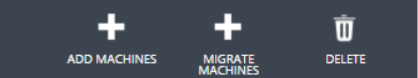

8. In **Select Machines** select the protection group you want to migrate from, and the machines you want to migrate.

	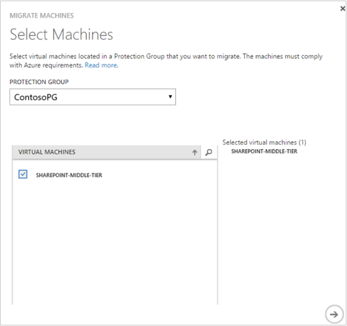

9. In **Configure Target Settings** specify whether you want to use the same settings for all machines and select the process server and Azure storage account. If you don't have a separate process server this will be the the IP address of the configuration server server.

	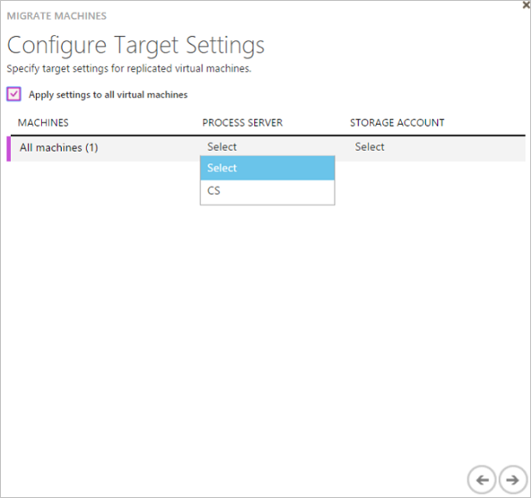

10. In **Specify Accounts**, select the account you created for the process server to access the machine to push the new version of the Mobility service.

	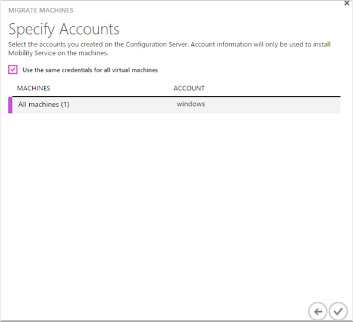

11. Site Recovery will migrate your replicated data to the Azure storage account that you provided. Optionally you can reuse the storage account you used in the legacy deployment.
12. After the job finishes virtual machines will automatically synchronize. After synchronization completes you can delete the virtual machines from the legacy protection group.
13. After all machines have migrated you can delete the legacy protection group.
14. Remember to specify the failover properties for machines, and the Azure network settings after synchronization is complete.
15. If you have existing recovery plans, you can migrate them to the enhanced deployment with the **Migrate Recovery Plan** option. You should only do this after all protected machines have been migrated. 

	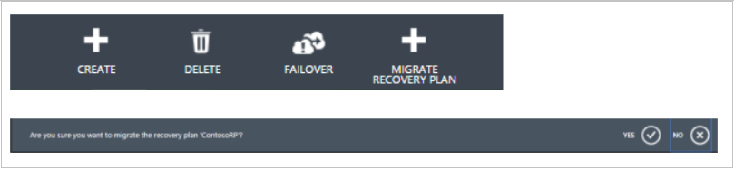

>[AZURE.NOTE] After you've finished migration continue with the [enhanced article](site-recovery-vmware-to-azure-classic.md). The rest of this legacy article will no longer be relevant and you don't need to follow any more of the steps described in it**.

## What do I need?

This diagram shows the deployment components.

Here's what you'll need:

**Component** | **Deployment** | **Details**
--- | --- | ---
**Configuration server** | An Azure standard A3 virtual machine in the same subscription as Site Recovery. | The configuration server coordinates communication between protected machines, the process server, and master target servers in Azure. It sets up replication and coordinates recovery in Azure when failover occurs.
**Master target server** | An Azure virtual machine — Either a Windows server based on a Windows Server 2012 R2 gallery image (to protect Windows machines) or as a Linux server based on a OpenLogic CentOS 6.6 gallery image (to protect Linux machines).   Three sizing options are available – Standard A4, Standard D14 and Standard DS4.   The server is connected to the same Azure network as the configuration server.   You set up in the Site Recovery portal | It receives and retains replicated data from your protected machines using attached VHDs created on blob storage in your Azure storage account.   Select Standard DS4 specifically for configuring protection for workloads requiring consistent high performance and low latency using Premium Storage Account.
**Process server** | An on-premises virtual or physical server running Windows Server 2012 R2   We recommend it's placed on the same network and LAN segment as the machines that you want to protect, but it can run on a different network as long as protected machines have L3 network visibility to it.   You set it up and register it to the configuration server in the Site Recovery portal. | Protected machines send replication data to the on-premises process server. It has a disk-based cache to cache replication data that it receives. It performs a number of actions on that data.   It optimizes data by caching, compressing, and encrypting it before sending it on to the master target server.   It handles push installation of the Mobility Service.   It performs automatic discovery of VMware virtual machines.
**On-premises machines** | On-premises VMware virtual machines, or physical servers running Windows or Linux. | You configure replication settings that apply one or more machines. You can fail over an individual machine or more commonly, multiple machines that you gather together into a recovery plan. 
**Mobility service** | Installed on each virtual machine or physical server you want to protect   Can be installed manually or pushed and installed automatically by the process server when you enable replication for a machine. | The Mobility service sends data to the process server during initial replication (resync). After the machine is in a protected state (after resync finishes) the Mobility service captures writes to disk in-memory and sends them to the process server. Applicationconsistency for Windows servers is achieved using VSS.
**Azure Site Recovery vault** | You create a Site Recovery  vault with an Azure subscription and register servers in the vault. | The vault coordinates and orchestrates data replication, failover, and recovery between your on-premises site and Azure.
**Replication mechanism** | **Over the Internet**—Communicates and replicates data from protected on-premises servers to Azure using secure SSL/TLS channel over the internet. This is the default option.   **VPN/ExpressRoute**—Communicates and replicates data between on-premises servers and Azure over a VPN connection. You'll need to set up a site-to-site VPN or an ExpressRoute connection between your on-premises site and Azure network.   You'll select how you want to replicate during Site Recovery deployment. You can't change the mechanism after it's configured without impacting replication of existing machines. | Neither option requires you to open any inbound network ports on protected machines. All network communication is initiated from the on-premises site. 

## Capacity planning

The main areas you'll need to consider:

- **Source environment**—The VMware infrastructure, source machine settings and requirements.
- **Component servers**—The process server, configuration server, and master target server 

### Considerations for the source environment

- **Maximum disk size**—The current maximum size of the disk that can be attached to a virtual machine is 1 TB. Thus the maximum size of a source disk that can be replicated is also limited to 1 TB.
- **Maximum size per source**—The maximum size of a single source machine is 31 TB (with 31 disks) and with a D14 instance provisioned for the master target server. 
- **Number of sources per master target server**—Multiple source machines can be protected with a single master target server. However, a single source machine can’t be protected across multiple master target servers, because as disks replicate, a VHD that mirrors the size of the disk is created on Azure blob storage and attached as a data disk to the master target server.  
- **Maximum daily change rate per source**—There are three factors that need to be considered when considering the recommended change rate per source. For the target based considerations two IOPS are required on the target disk for each operation on the source. This is because a read of old data and a write of the new data will happen on the target disk. 
	- **Daily change rate supported by the process server**—A source machine can't span multiple process servers. A single process server can support up to 1 TB of daily change rate. Hence 1 TB is the maximum daily data change rate supported for a source machine. 
	- **Maximum throughput supported by the target disk**—Maximum churn per source disk can't be more than 144 GB/day (with 8K write size). See the table in the master target section for the throughput and IOPs of the target for various write sizes. This number must be divided by two because each source IOP generates 2 IOPS on the target disk. Read about [Azure scalability and performance targets](../storage/storage-scalability-targets.md#scalability-targets-for-premium-storage-accounts) when configuring the target for premium storage accounts.
	- **Maximum throughput supported by the storage account**—A source can't span multiple storage accounts. Given that a storage account takes a maximum of 20,000 requests per second and that each source IOP generates 2 IOPS at the master target server, we recommend you keep the number of IOPS across the source to 10,000. Read about [Azure scalability and performance targets](../storage/storage-scalability-targets.md#scalability-targets-for-premium-storage-accounts) when configuring the source for premium storage accounts.

### Considerations for component servers

Table 1 summarizes the virtual machine sizes for the configuration and master target servers.

**Component** | **Deployed Azure instances** | **Cores** | **Memory** | **Max disks** | **Disk size**
--- | --- | --- | --- | --- | ---
Configuration server | Standard A3 | 4 | 7 GB | 8 | 1023 GB
Master target server | Standard A4 | 8 | 14 GB | 16 | 1023 GB
 | Standard D14 | 16 | 112 GB | 32 | 1023 GB
 | Standard DS4 | 8 | 28 GB | 16 | 1023 GB

**Table 1**

#### Process server considerations

Generally process server sizing depends on the daily change rate across all protected workloads.

- You need sufficient compute to perform tasks such as inline compression and encryption.
- The process server uses disk based cache. Make sure the recommended cache space and disk throughput is available to facilitate the data changes stored in the event of network bottleneck or outage. 
- Ensure sufficient bandwidth  so that the process server can upload the data to the master target server to provide continuous data protection. 

Table 2 provides a summary of the process server guidelines.

**Data change rate** | **CPU** | **Memory** | **Cache disk size**| **Cache disk throughput** | **Bandwidth ingress/egress**
--- | --- | --- | --- | --- | ---
< 300 GB | 4 vCPUs (2 sockets * 2 cores @ 2.5GHz) | 4 GB | 600 GB | 7 to 10 MB per second | 30 Mbps/21 Mbps
300 to 600 GB | 8 vCPUs (2 sockets * 4 cores @ 2.5GHz) | 6 GB | 600 GB | 11 to 15 MB per second | 60 Mbps/42 Mbps
600 GB to 1 TB | 12 vCPUs (2 sockets * 6 cores @ 2.5GHz) | 8 GB | 600 GB | 16 to 20 MB per second | 100 Mbps/70 Mbps
> 1 TB | Deploy another process server | | | | 

**Table 2**

Where: 

- Ingress is download bandwidth (intranet between the source and process server).
- Egress is upload bandwidth (internet between the process server and master target server). Egress numbers presume average 30% process server compression.
- For cache disk a separate OS disk of minimum 128 GB is recommended for all process servers.
- For cache disk throughput the following storage was used for benchmarking: 8 SAS drives of 10 K RPM with RAID 10 configuration.

#### Configuration server considerations

Each configuration server can support up to 100 source machines with 3-4 volumes. If your deployment is larger we recommend you deploy another configuration server. See Table 1 for the default virtual machine properties of the configuration server. 

#### Master target server and storage account considerations

The storage for each master target server includes an OS disk, a retention volume, and data disks. The retention drive maintains the journal of disk changes for the duration of the retention window defined in the Site Recovery portal.  Refer to Table 1 for the virtual machine properties of the master target server. Table 3 shows how the disks of A4 are used.

**Instance** | **OS disk** | **Retention** | **Data disks**
--- | --- | --- | ---
 | | **Retention** | **Data disks**
Standard A4 | 1 disk (1 * 1023 GB) | 1 disk ( 1 * 1023 GB) | 15 disks (15 * 1023 GB)
Standard D14 |  1 disk (1 * 1023 GB) | 1 disk ( 1 * 1023 GB) | 31 disks (15 * 1023 GB)
Standard DS4 |  1 disk (1 * 1023 GB) | 1 disk ( 1 * 1023 GB) | 15 disks (15 * 1023 GB)

**Table 3**

Capacity planning for the master target server depends on:

- Azure storage performance and limitations
	- The maximum number of highly utilized disks for a Standard Tier VM, is about 40 (20,000/500 IOPS per disk) in a single storage account. Read about [scalability targets for standard storage sccounts](../storage/storage-scalability-targets.md#scalability-targets-for-standard-storage-accounts) and for [premium storage sccounts](../storage/storage-scalability-targets.md#scalability-targets-for-premium-storage-accounts).
-	Daily change rate 
-	Retention volume storage.

Note that:

- One source can't span multiple storage accounts. This applies to the data disk that go to the storage accounts selected when you configure protection. The OS and the retention disks usually go to the automatically deployed storage account.
- The retention storage volume required depends on the daily change rate and the number of retention days. The retention storage required per master target server = total churn from source per day * number of retention days. 
- Each master target server has only one retention volume. The retention volume is shared across the disks attached to the master target server. For example:
	- If there's a source machine with 5 disks and each disk generates 120 IOPS (8K size) on the source, this translates to 240 IOPS per disk (2 operations on the target disk per source IO). 240 IOPS is within the Azure per disk IOPS limit of 500.
	- On the retention volume, this becomes 120 * 5 = 600 IOPS and this can become a bottle neck. In this scenario, a good strategy would be to add more disks to the retention volume and span it across, as a RAID stripe configuration. This will improve performance because the IOPS are distributed across multiple drives. The number of drives to be added to the retention volume will be as follows:
		- Total IOPS from source environment / 500
		- Total churn per day from source environment (uncompressed) / 287 GB. 287 GB is the maximum throughput supported by a target disk per day. This metric will vary based on the write size with a factor of 8K, because in this case 8K is thee assumed write size. For example, if the write size is 4K then throughput will be 287/2. And if the write size is 16K then throughput will be 287*2.
- The number of storage accounts required = total source IOPs/10000.

## Before you start

**Component** | **Requirements** | **Details**
--- | --- | --- 
**Azure account** | You'll need a [Microsoft Azure](https://azure.microsoft.com/) account. You can start with a [free trial](https://azure.microsoft.com/pricing/free-trial/).
**Azure storage** | You'll need an Azure storage account to store replicated data   Either the account should be a [Standard Geo-redundant Storage Account](../storage/storage-redundancy.md#geo-redundant-storage) or [Premium Storage Account](../storage/storage-premium-storage.md).   It must in the same region as the Azure Site Recovery service, and be associated with the same subscription. We do not support the move of Storage accounts created using the [new Azure portal](../storage/storage-create-storage-account.md) across resource groups.   To learn more read [Introduction to Microsoft Azure Storage](../storage/storage-introduction.md)
**Azure virtual network** | You'll need an Azure virtual network on which the configuration server and master target server will be deployed. It should be in the same subscription and region as the Azure Site Recovery vault. If you wish to replicate data over an ExpressRoute or VPN connection the Azure virtual network must be connected to your on-premises network over an ExpressRoute connection or a Site-to-Site VPN.
**Azure resources** | Make sure you have enough Azure resources to deploy all components. Read more in [Azure Subscription Limits](../azure-subscription-service-limits.md).
**Azure virtual machines** | Virtual machines you want to protect should conform with [Azure prerequisites](site-recovery-best-practices.md).   **Disk count**—A maximum of 31 disks can be supported on a single protected server   **Disk sizes**—Individual disk capacity shouldn't be more than 1023 GB   **Clustering**—Clustered servers aren't supported   **Boot**—Unified Extensible Firmware Interface(UEFI)/Extensible Firmware Interface(EFI) boot isn't supported   **Volumes**—Bitlocker encrypted volumes aren't supported   **Server names**—Names should contain between 1 and 63 characters (letters, numbers and hyphens). The name must start with a letter or number and end with a letter or number. After a machine is protected you can modify the Azure name.
**Configuration server** | Standard A3 virtual machine based on an Azure Site Recovery Windows Server 2012 R2 gallery image will be created in your subscription for the configuration server. It's created as the first instance in a new cloud service. If you select Public Internet as the connectivity type for the configuration server the cloud service will be created with a reserved public IP address.   The installation path should be in English characters only.
**Master target server** | Azure virtual machine, standard A4, D14 or DS4.   The installation path  should be in English characters only. For example the path should be **/usr/local/ASR** for a master target server running Linux.
**Process server** | You can deploy the process server on physical or virtual machine running Windows Server 2012 R2 with the latest updates. Install on C:/.   We recommend you place the server on the same network and subnet as the machines you want to protect.   Install VMware vSphere CLI 5.5.0 on the process server. The VMware vSphere CLI component is required on the process server in order to discover virtual machines managed by a vCenter server or virtual machines running on an ESXi host.   The installation path should be in English characters only.   ReFS File System is not supported.
**VMware** | A VMware vCenter server managing your VMware vSphere hypervisors. It should be running vCenter version 5.1 or 5.5 with the latest updates.   One or more vSphere hypervisors containing VMware virtual machines you want to protect. The hypervisor should be running ESX/ESXi version 5.1 or 5.5 with the latest updates.   VMware virtual machines should have VMware tools installed and running. 
**Windows machines** | Protected physical servers or VMware virtual machines running Windows have a number of requirements.   A supported 64-bit operating system: **Windows Server 2012 R2**, **Windows Server 2012**, or **Windows Server 2008 R2 with at least SP1**.   The host name, mount points, device names, Windows system path (eg: C:\Windows) should be in English only.   The operating system should be installed on C:\ drive.   Only basic disks are supported. Dynamic disks aren't supported.   Firewall rules on protected machines should allow them to reach the configuration and master target servers in Azure.p>
You'll need to provide an administrator account (must be a local administrator on the Windows machine) to push install the Mobility Service on Windows servers. If the provided account is a non-domain account you'll need to disable Remote User Access control on the local machine. To do this add the LocalAccountTokenFilterPolicy DWORD registry entry with a value of 1 under HKEY_LOCAL_MACHINE\SOFTWARE\Microsoft\Windows\CurrentVersion\Policies\System. To add the registry entry from a CLI open cmd or powershell and enter **`REG ADD HKEY_LOCAL_MACHINE\SOFTWARE\Microsoft\Windows\CurrentVersion\Policies\System /v LocalAccountTokenFilterPolicy /t REG_DWORD /d 1`**. [Learn more](https://msdn.microsoft.com/library/aa826699.aspx) about access control.   After failover, if you want connect to Windows virtual machines in Azure with Remote Desktop make sure that Remote Desktop is enabled for the on-premises machine. If you're not connecting over VPN, firewall rules should allow Remote Desktop connections over the internet.
**Linux machines** | A supported 64 bit operating system: **Centos 6.4, 6.5, 6.6**; **Oracle Enterprise Linux 6.4, 6.5 running either the Red Hat compatible kernel or Unbreakable Enterprise Kernel Release 3 (UEK3)**, **SUSE Linux Enterprise Server 11 SP3**.   Firewall rules on protected machines should allow them to reach the configuration and master target servers in Azure.   /etc/hosts files on protected machines should  contain entries that map the local host name to IP addresses associated with all NICs    If you want to connect to an Azure virtual machine running Linux after failover using a Secure Shell client (ssh), ensure that the Secure Shell service on the protected machine is set to start automatically on system boot, and that firewall rules allow an ssh connection to it.   The host name, mount points, device names, and Linux system paths and file names (eg /etc/; /usr) should be in English only.   Protection can be enabled for on-premises machines with the following storage:- File system: EXT3, ETX4, ReiserFS, XFS Multipath software-Device Mapper (multipath) Volume manager: LVM2 Physical servers with HP CCISS controller storage are not supported.
**Third-party** | Some deployment components in this scenario depend on third-party software to function properly. For a complete list see [Third-party software notices and information](#third-party)

### Network connectivity

You have two options when configuring network connectivity between your on-premises site and the Azure virtual network on which the infrastructure components (configuration server, master target servers) are deployed. You'll need to decide which network connectivity option to use before you can deploy your configuration server. You'll need to choose this setting at the time of deployment. It can't be changed later.

**Internet :** Communication and replication of data between the on-premises servers (process server, protected machines) and the Azure infrastructure component servers (configuration server, master target server) happens over a secure SSL/TLS connection from on-premises to the public endpoints on the configuration and master target servers. (The only exception is the connection between the process server and the master target server on TCP port 9080 which is unencrypted. Only control information related to the replication protocol for replication setup is exchanged on this connection.)

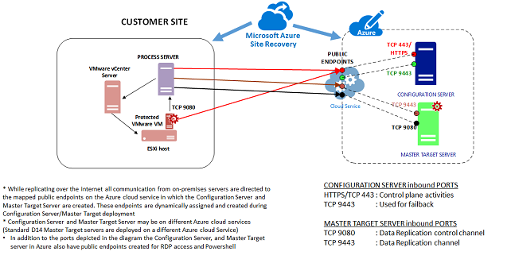

**VPN**: Communication and replication of data between the on-premises servers (process server, protected machines) and the Azure infrastructure component servers (configuration server, master target server) happens over a VPN connection between your on-premises network and the Azure virtual network on which the configuration server and master target servers are deployed. Ensure that your on-premises network is connected to the Azure virtual network by an ExpressRoute connection or a site-to-site VPN connection.

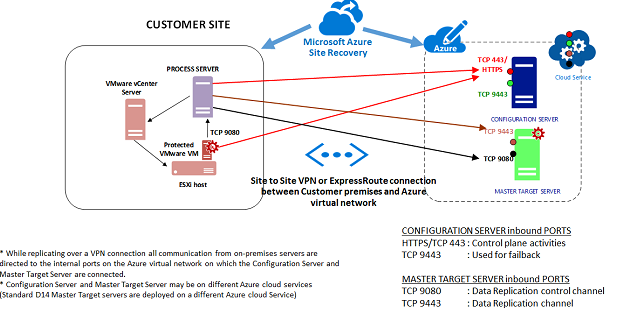

## Step 1: Create a vault

1. Sign in to the [Management Portal](https://portal.azure.com).

2. Expand **Data Services** > **Recovery Services** and click **Site Recovery Vault**.

3. Click **Create New** > **Quick Create**.

4. In **Name**, enter a friendly name to identify the vault.

5. In **Region**, select the geographic region for the vault. To check supported regions see Geographic Availability in [Azure Site Recovery Pricing Details](https://azure.microsoft.com/pricing/details/site-recovery/)

6. Click **Create vault**.

	

Check the status bar to confirm that the vault was successfully created. The vault will be listed as **Active** on the main **Recovery Services** page.

## Step 2: Deploy a configuration server

### Configure server settings

1. In the **Recovery Services** page, click the vault to open the Quick Start page. Quick Start can also be opened at any time using the icon.

	

2. In the dropdown list, select **Between an on-premises site with VMware/physical servers and Azure**.
3. In **Prepare Target(Azure) Resources** click **Deploy Configuration Server**.

	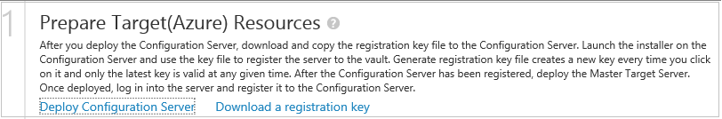

4. In **New Configuration Server Details** specify:

	- A name for the configuration server and credentials to connect to it.
	- In the network connectivity type drop down select **Public Internet** or **VPN**. Note that you can't modify this setting after it's applied.
	- Select the Azure network on which the server should be located. If you're using VPN make sure the Azure network is connected to your on-premises network as expected. 
	- Specify the internal IP address and subnet that will be assigned to the server. Note that the first four IP addresses in any subnet are reserved for internal Azure usage. Use any other available IP address.
	
	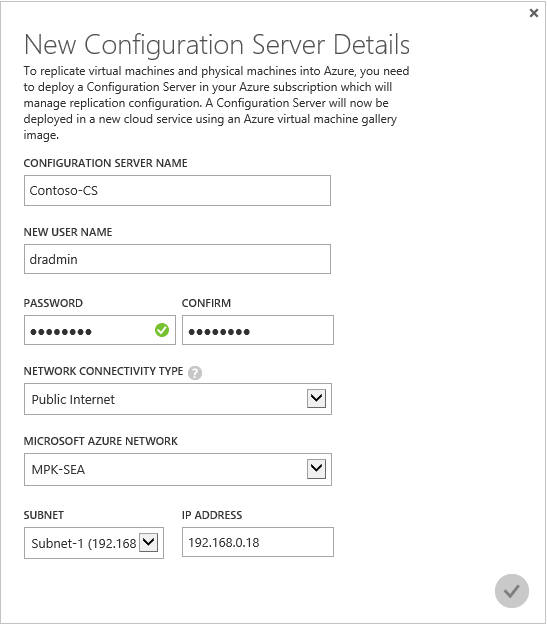

5. When you click **OK** a standard A3 virtual machine based on an Azure Site Recovery Windows Server 2012 R2 gallery image will be created in your subscription for the configuration server. It's created as the first instance in a new cloud service. If you selected to connect over the internet the cloud service is created with a reserved public IP address. You can monitor progress in the **Jobs** tab.

	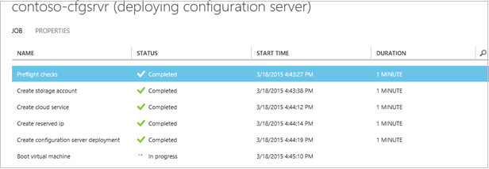

6.  If you're connecting over the internet, after the configuration server is deployed note the public IP address assigned to it on the **Virtual Machines** page in the Azure portal. Then on the **Endpoints** tab note the public HTTPS port mapped to private port 443. You'll need this information later when you register the master target and process servers with the configuration server. The configuration server is deployed with these endpoints:

	- HTTPS: A public port is used to coordinate communication between component servers and Azure over the internet. Private port 443 is used to coordinate communication between component servers and Azure over VPN.
	- Custom: A public port is used for failback tool communication over the internet. Private port 9443 is used for failback tool communication over VPN.
	- PowerShell: Private port 5986
	- Remote desktop: Private port 3389
	
	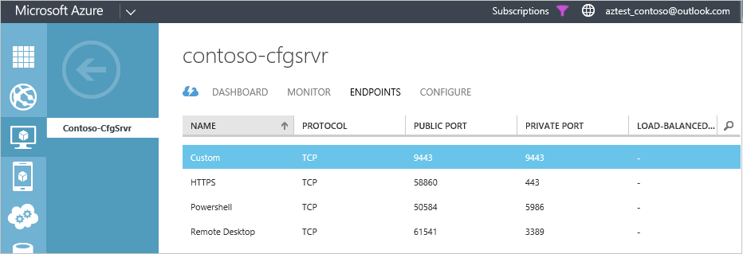

    >[AZURE.WARNING] Don't delete or change the public or private port number of any endpoints created during configuration server deployment.

The configuration server is deployed in an automatically created Azure cloud service with a reserved IP address. The reserved address is needed to ensure that the configuration server cloud service IP address remains the same across reboots of the virtual machines (including the configuration server) on the cloud service. The reserved public IP address will need to be manually unreserved when the configuration server is decommissioned or it'll remain reserved. There's a default limit of 20 reserved public IP addresses per subscription. [Learn more](../virtual-network/virtual-networks-reserved-private-ip.md) about reserved IP addresses. 

### Register the configuration server in the vault

1. In the **Quick Start** page click **Prepare Target Resources** > **Download a registration key**. The key file is generated automatically. It's valid for 5 days after it's generated. Copy it to the configuration server.
2. In **Virtual Machines** select the configuration server from the virtual machines list. Open the **Dashboard** tab and click **Connect**. **Open** the downloaded RDP file to log onto the configuration server using Remote Desktop. If you're using VPN, use the internal IP address (the address you specified when you deployed the configuration server) for a Remote Desktop connection from the on-premises site. The Azure Site Recovery Configuration Server Setup Wizard runs automatically when you log on for the first time.

	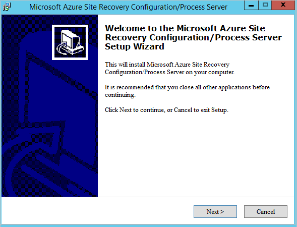

3. In **Third-Party Software Installation** click **I Accept** to download and install MySQL.

	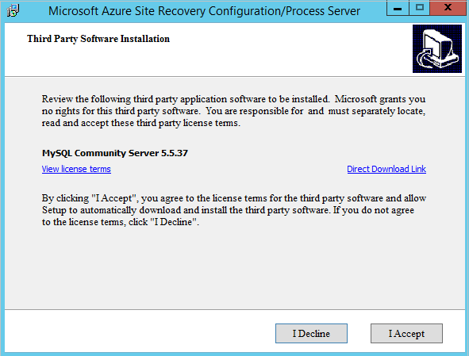

4. In **MySQL Server Details** create credentials to log onto the MySQL server instance.

	

5. In **Internet Settings** specify how the configuration server will connect to the internet. Note that:

	- If you want to use a custom proxy you should set it up before you install the Provider.
	- When you click **Next** a test will run to check the proxy connection.
	- If you do use a custom proxy, or your default proxy requires authentication you'll need to enter the proxy details, including the address, port, and credentials.
	- The following URLs should be accessible via the proxy:
		- *.hypervrecoverymanager.windowsazure.com
		- *.accesscontrol.windows.net
		- *.backup.windowsazure.com
		- *.blob.core.windows.net
		- *.store.core.windows.net
	- If you have IP address-based firewall rules ensure that the rules are set to allow communication from the configuration server to the IP addresses described in [Azure Datacenter IP Ranges](https://msdn.microsoft.com/library/azure/dn175718.aspx) and HTTPS (443) protocol. You would have to white-list IP ranges of the Azure region that you plan to use, and that of West US.

	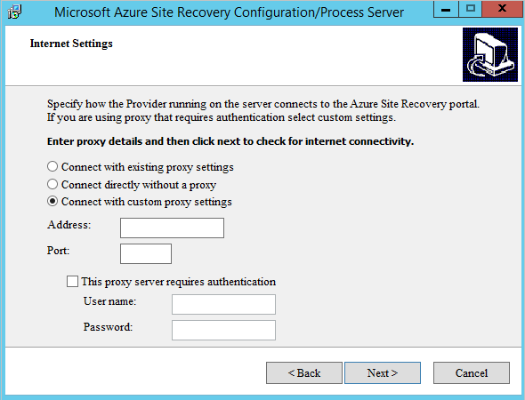

6. In **Provider Error Message Localization Settings** specify in which language you want error messages to appear.

	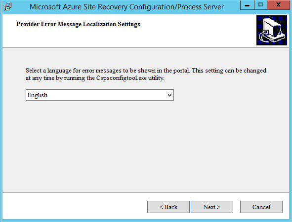

7. In **Azure Site Recovery Registration** browse and select the key file you copied to the server.

	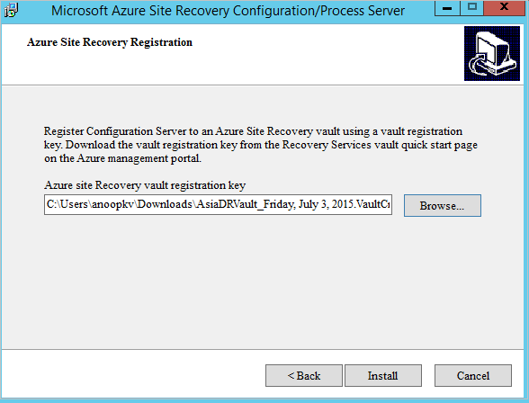

8. On the completion page of the wizard select these options:

	- Select **Launch Account Management Dialog** to specify that the Manage Accounts dialog should open after you finish the wizard.
	- Select **Create a desktop icon for Cspsconfigtool** to add a desktop shortcut on the  configuration server so that you can open the **Manage Accounts** dialog at any time without needing to rerun the wizard.

	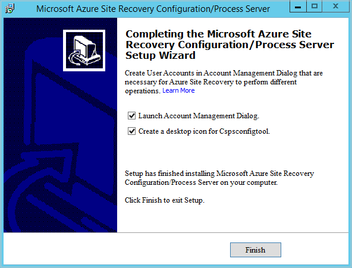

9. Click **Finish** to complete the wizard. A passphrase is generated. Copy it to a secure location. You'll need it to authenticate and register the process and master target servers with the configuration server. It's also used to ensure channel integrity in configuration server communications. You can regenerate the passphrase but then you'll need to re-register the master target and process servers using the new passphrase.

	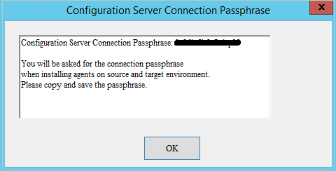

After registration the configuration server will be listed on the **Configuration Servers** page in the vault.

### Set up and manage accounts

During deployment Site Recovery requests credentials for the following actions:

- A VMware account so thatSite Recovery can automatically discovery VMs on vCenter servers or vSphere hosts. 
- When you add machines for protection, so that Site Recovery can install the Mobility service on them.

After you've registered the configuration server you can open the **Manage Accounts** dialog to add and manage accounts that should be used for these actions. There are a couple of ways to do this:

- Open the shortcut you opted to created for the dialog on the last page of setup for the configuration server (cspsconfigtool).
- Open the dialog on finish of configuration server setup.

1. In **Manage Accounts** click **Add Account**. You can also modify and delete existing accounts.

	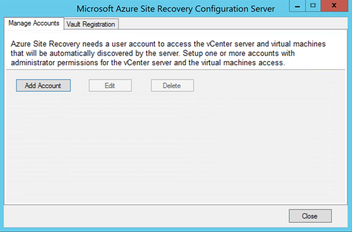

2. In **Account Details** specify an account name to use in Azure and credentials (Domain/user name). 

	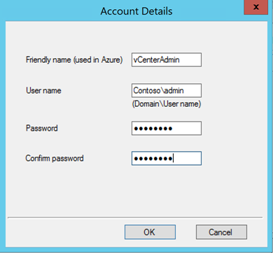

### Connect to the configuration server 

There are two ways to connect to the configuration server:

- Over a VPN site-to-site or ExpressRoute connection
- Over the internet 

Note that:

- An internet connection uses the endpoints of the virtual machine in conjunction with the public virtual IP address of the server.
- A VPN connection uses the internal IP address of the server together with the endpoint private ports.
- It's a one-time decision to decide whether to connect (control and replication data) from your on-premises servers to the various component servers (configuration server, master target server) running in Azure over a VPN connection or the internet. You can't change this setting afterwards. If you do you'll need to redeploy the scenario and reprotect your machines.  

## Step 3: Deploy the master target server

1. Click **Prepare Target(Azure) Resources** > **Deploy master target server**.
2. Specify the master target server details and credentials. The server will be deployed in the same Azure network as the configuration server. When you click to complete an Azure virtual machine will be created with a Windows or Linux gallery image.

	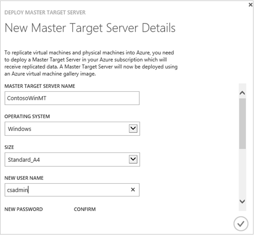

Note that the first four IP addresses in any subnet are reserved for internal Azure usage. Specify any other available IP address.

>[AZURE.NOTE] Select Standard DS4 when configuring protection for workloads which require consistent high I/O performance and low latency in order to host I/O intensive workloads using [Premium Storage Account](../storage/storage-premium-storage.md).

3. A Windows master target server VM is created with these endpoints. Note that public endpoints are created only if your connecting over the internet.

	- Custom: Public port used by the process server to send replication data over the internet. Private port 9443 is used by the process server to send replication data to the master target server over VPN.
	- Custom1: Public port used by the process server to send metadata over the internet. Private port 9080 is used by the process server to send metadata to the master target server over VPN.
	- PowerShell: Private port 5986
	- Remote desktop: Private port 3389

4. A Linux master target server VM is created with these endpoints. Note that public endpoints are created only if you're connecting over the internet.

	- Custom: Public port used by process server to send replication data over the internet. Private port 9443 is used by the process server to send replication data to the master target server over VPN.
	- Custom1: Public port is used by the process server to send metadata over the internet. Private port 9080 is used by the process server to send metadata to the master target server over VPN
	- SSH: Private port 22

    >[AZURE.WARNING] Don't delete or change the public or private port number of any of the endpoints created during the master target server deployment.

5. In **Virtual Machines** wait for the virtual machine to start.

	- If it's a Windows server note down the remote desktop details.
	- If it's a Linux server and you're connecting over VPN note the internal IP address of the virtual machine. If you're connecting over the internet note the public IP address.

6.  Log onto the server to complete installation and register it with the configuration server. 
7.  If you're running Windows:

	1. Initiate a remote desktop connection to the virtual machine. The first time you log on a script will run in a PowerShell window. Don't close it. When it finishes the Host Agent Config tool opens automatically to register the server.
	2. In **Host Agent Config** specify the internal IP address of the configuration server and port 443. You can use the internal address and private port 443 even if you're not connecting over VPN because the virtual machine is attached to the same Azure network as the configuration server. Leave **Use HTTPS** enabled. Enter the passphrase for the configuration server that you noted earlier. Click **OK** to register the server. You can ignore the NAT options. They're not used.
	3. If your estimated retention drive requirement is more than 1 TB you can configure the retention volume (R:) using a virtual disk and [storage spaces](http://blogs.technet.com/b/askpfeplat/archive/2013/10/21/storage-spaces-how-to-configure-storage-tiers-with-windows-server-2012-r2.aspx)
	
	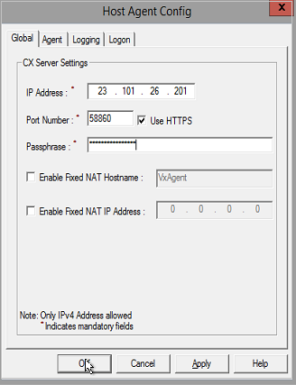

8. If you're running Linux:
	1. Make sure you've installed the latest Linux Integration Services (LIS) installed before you install the master target server. You can find the latest version of LIS along with instructions on how to install [here](https://www.microsoft.com/download/details.aspx?id=46842). Restart the machine after the LIS install.
	2. In **Prepare Target (Azure) Resources** click **Download and Install additional software (only for Linux Master Target Server)**. Copy the downloaded tar file to the virtual machine using an sftp client. Alternatively you can log on to the deployed linux master target server and use *wget http://go.microsoft.com/fwlink/?LinkID=529757&clcid=0x409* to download the the file.
	2. Log on to the server using a Secure Shell client. If you're connected to the Azure network over VPN use the internal IP address. Otherwise use the external IP address and the SSH public endpoint.
	3. Extract the files from the gzipped installer by running: **tar –xvzf Microsoft-ASR_UA_8.4.0.0_RHEL6-64***
	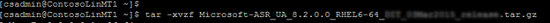
	4. Make sure you're in the directory to which you extracted the contents of the tar file.
	5. Copy the configuration server passphrase to a local file using the command **echo *`<passphrase>`* >passphrase.txt**
	6. Run the command “**sudo ./install -t both -a host -R MasterTarget -d /usr/local/ASR -i *`<Configuration server internal IP address>`* -p 443 -s y -c https -P passphrase.txt**”.

	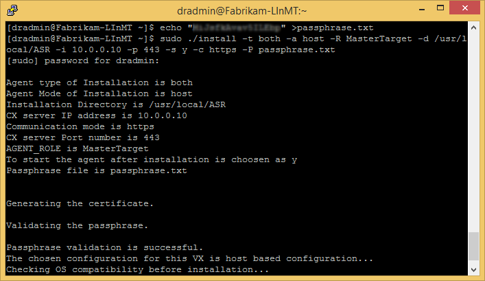

9. Wait for a few minutes (10-15) and on the  page check that the master target server is listed as registered in **Servers** > **Configuration Servers** **Server Details** tab. If you're running Linux and  it didn't register run the host config tool again from /usr/local/ASR/Vx/bin/hostconfigcli. You'll need to set access permissions by running chmod as root.

	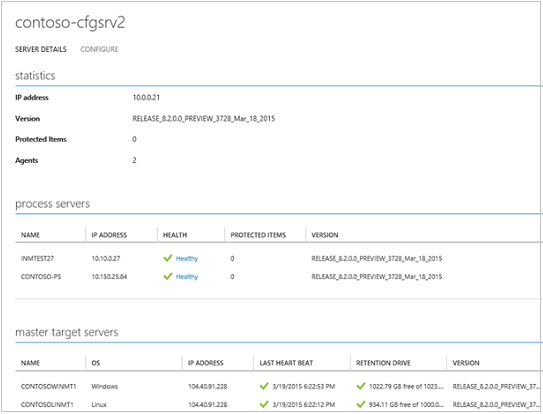

>[AZURE.NOTE] It can take up to 15 minutes after registration is complete for the master target server to be listed in the portal. To update immediately, click **Refresh** on the **Configuration Servers** page.

## Step 4: Deploy the on-premises process server

Before you start we recommend that you configure a static IP address on the process server so that it's guaranteed to be persistent across reboots.

1. Click Quick Start > **Install Process Server on-premises** > **Download and install the process server**.

	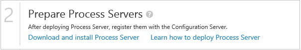

2.  Copy the downloaded zip file to the server on which you're going to install the process server. The zip file contains two installation files:

	- Microsoft-ASR_CX_TP_8.4.0.0_Windows*
	- Microsoft-ASR_CX_8.4.0.0_Windows*

3. Unzip the archive and copy the installation files to a location on the server.
4. Run the **Microsoft-ASR_CX_TP_8.4.0.0_Windows*** installation file and follow the instructions. This installs third-party components needed for the deployment.
5. Then run **Microsoft-ASR_CX_8.4.0.0_Windows***.
6. On the **Server Mode** page select **Process Server**.
7. On the **Environment Details** page do the following:

	- If you want to protect VMware virtual machines click **Yes**
	- If  you only want to protect physical servers and thus don't need VMware vCLI installed on the process server. Click **No** and continue.

8. Note the following when installing VMware vCLI:

	- **Only VMware vSphere CLI 5.5.0 is supported**. The process server doesn't work with other versions or updates of vSphere CLI.
	- Download vSphere CLI 5.5.0 from [here.](https://my.vmware.com/web/vmware/details?downloadGroup=VCLI550&productId=352)
	- If you installed vSphere CLI just before you started installing the process server, and setup doesn't detect it, wait up to five minutes before you try setup again. This ensures that all the environment variables needed for vSphere CLI detection have been initialized correctly.

9.	In **NIC Selection for Process Server** select the network adapter that the process server should use.

	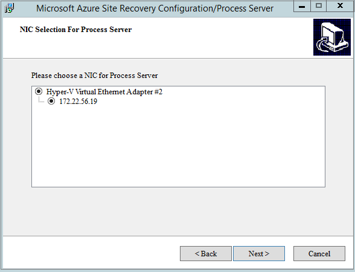

10.	In **Configuration Server Details**:

	- For the IP address and port, if you're connecting over VPN specify the internal IP address of the configuration server and 443 for the port. Otherwise specify the public virtual IP address and mapped public HTTP endpoint.
	- Type in the passphrase of the configuration server.
	- Clear **Verify Mobility service software signature** if you want to disable verification when you use automatic push to install the service. Signature verification needs internet connectivity from the process server.
	- Click **Next**.

	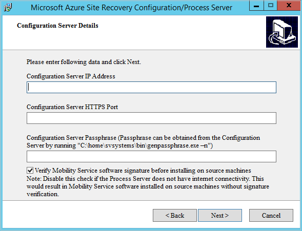

11. In **Select Installation Drive** select a cache drive. The process server needs a cache drive with at least 600 GB of free space. Then click **Install**. 

	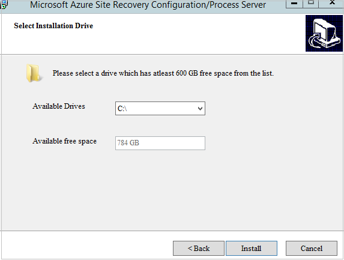

12. Note that you might need to restart the server to complete the installation. In **Configuration Server** > **Server Details** check that the process server appears and is registered successfully in the vault.

>[AZURE.NOTE]It can take up to 15 minutes after registration is complete for the process server to appear as listed under the configuration server. To update immediately, refresh the configuration server by clicking on the refresh button at the bottom of the configuration server page
 
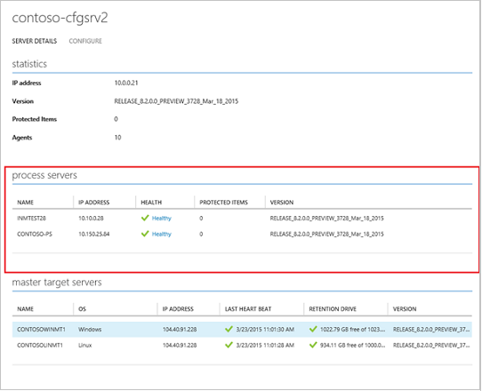

If you didn't disable signature verification for the Mobility service when you registered the process server you can do it later as follows:

1. Log onto the process server as an administrator and open the file C:\pushinstallsvc\pushinstaller.conf for editing. Under the section **[PushInstaller.transport]** add this line: **SignatureVerificationChecks=”0”**. Save and close the file.
2. Restart the InMage PushInstall service.

## Step 5: Update Site Recovery components

Site Recovery components are updated from time to time. When new updates are available you should install them in the following order:

1. Configuration server
2. Process server
3. Master target server
4. Failback tool (vContinuum)

### Obtain and install the updates

1. You can obtain updates for the configuration, process, and master target servers from the Site Recovery **Dashboard**. For Linux installation extract the files from the gzipped installer and run the command “sudo ./install” to install the update.
2. [Download](http://go.microsoft.com/fwlink/?LinkID=533813) the latest update for the Failback tool(vContinuum).
3. If you are running virtual machines or physical servers that already have the Mobility service installed, you can get updates for the service as follows:

	- **Option 1**: Download updates:
		- [Windows Server (64 bit only)](http://download.microsoft.com/download/8/4/8/8487F25A-E7D9-4810-99E4-6C18DF13A6D3/Microsoft-ASR_UA_8.4.0.0_Windows_GA_28Jul2015_release.exe)
		- [CentOS 6.4,6.5,6.6 (64 bit only)](http://download.microsoft.com/download/7/E/D/7ED50614-1FE1-41F8-B4D2-25D73F623E9B/Microsoft-ASR_UA_8.4.0.0_RHEL6-64_GA_28Jul2015_release.tar.gz)
		- [Oracle Enterprise Linux 6.4,6.5 (64 bit only)](http://download.microsoft.com/download/5/2/6/526AFE4B-7280-4DC6-B10B-BA3FD18B8091/Microsoft-ASR_UA_8.4.0.0_OL6-64_GA_28Jul2015_release.tar.gz)
		- [SUSE Linux Enterprise Server SP3 (64 bit only)](http://download.microsoft.com/download/B/4/2/B4229162-C25C-4DB2-AD40-D0AE90F92305/Microsoft-ASR_UA_8.4.0.0_SLES11-SP3-64_GA_28Jul2015_release.tar.gz)
		- After updating the process server the updated version of the Mobility service will be available in the C:\pushinstallsvc\repository folder on the process server.
	- **Option 2**: If you have a machine with an older version of the Mobility service installed, you can automatically upgrade the Mobility service on the machine from the management portal.

		1. Ensure that the process server is updated.
		2. Make sure that the protected machine complies with the [prerequisites](#install-the-mobility-service-automatically) for automatically pushing the Mobility service, so that the update works as expected.
		2. Select the protection group, highlight the protected machine and click **Update Mobility service**. This button is only available if there's a newer version of the Mobility service. 

			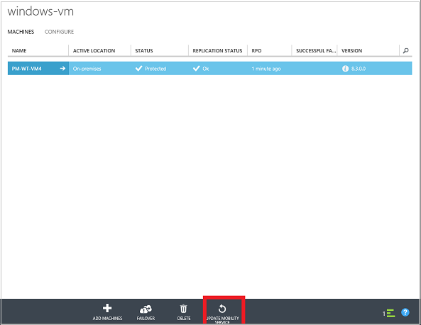

In Select accounts specify the administrator account to be used to update the mobility service on the protected server. Click OK and wait for the triggered job to complete.

## Step 6: Add vCenter servers or vSphere hosts

1. Click **Servers** > **Configuration Servers** > configuration server >**Add vCenter Server** to add a vCenter server or vSphere host.

	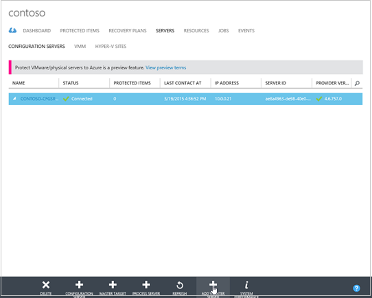

2. Specify details for the server or host and select the process server that will be used to discover it.

	- If the vCenter server isn't running on the default 443 port specify the port number on which the vCenter server is running.
	- The process server must be on the same network as the vCenter server/vSphere host and should have VMware vSphere CLI 5.5.0 installed.

	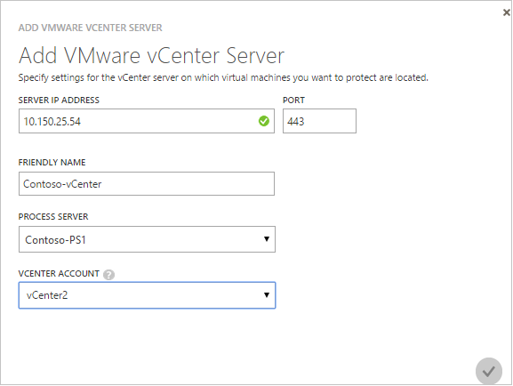

3. After discovery finishes the vCenter server will be listed under the configuration server details.

	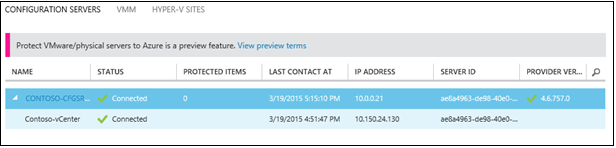

4. If you're using a non-administrator account to add the server or host, make sure the account has the following privileges:

	- vCenter accounts should have Datacenter, Datastore, Folder, Host, Network, Resource, Storage views, Virtual machine and vSphere Distributed Switch privileges enabled.
	- vSphere host accounts should have the Datacenter, Datastore, Folder, Host, Network, Resource, Virtual machine and vSphere Distributed Switch privileges enabled

## Step 7: Create a protection group

1. Open **Protected Items** > **Protection Group** > **Create protection group**.

	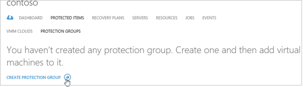

2. On the **Specify Protection Group Settings** page specify a name for the group and select the configuration server on which you want to create the group.

	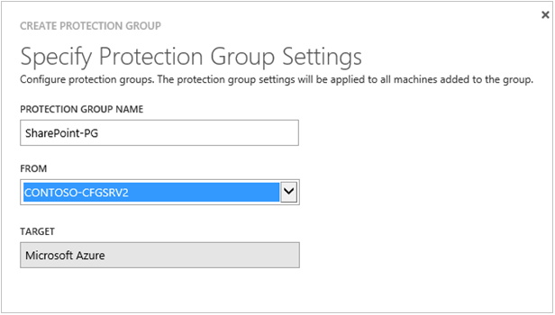

3. On the **Specify Replication Settings** page configure the replication settings that will be used for all the machines in the group.

	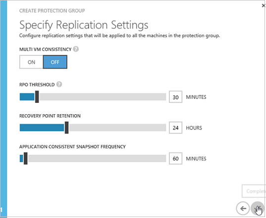

4. Settings:
	- **Multi VM consistency**: If you turn this on it creates shared application-consistent recovery points across the machines in the protection group. This setting is most relevant when all of the machines in the protection group are running the same workload. All machines will be recovered to the same data point. Only available for Windows servers.
	- **RPO threshold**: Alerts will be generated when the continuous data protection replication RPO exceeds the configured RPO threshold value.
	- **Recovery point retention**: Specifies the retention window. Protected machines can be recovered to any point within this window.
	- **Application-consistent snapshot frequency**: Specifies how frequently recovery points containing application-consistent snapshots will be created.

You can monitor the protection group as they're created on the **Protected Items** page.

## Step 8: Set up machines you want to protect

You'll need to install the Mobility service on virtual machines and physical servers you want to protect. You can do this in two ways:

- Automatically push and install the service on each machine from the process server.
- Manually install the service. 

### Install the Mobility service automatically

When you add machines to a protection group the Mobility service is automatically pushed and installed on each machine by the process server. 

**Automatically push install the mobility service on Windows servers:** 

1. Install the latest updates for the process server as described in [Step 5: Install latest updates](#step-5-install-latest-updates), and make sure that the process server is available. 
2. Ensure there's network connectivity between the source machine and the process server, and that the source machine is accessible from the process server.  
3. Configure the Windows firewall to allow **File and Printer Sharing** and **Windows Management Instrumentation**. Under Windows Firewall settings, select the option “Allow an app or feature through Firewall” and select the applications as shown in the picture below. For machines that belong to a domain you can configure the firewall policy with a GPO.

	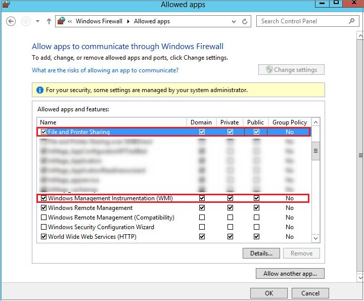

4. The account used to perform the push installation must be in the Administrators group on the machine you want to protect. These credentials are only used for push installation of the Mobility service and you'll provide them when you add a machine to a protection group.
5. If the provided account isn't a domain account you'll need to disable Remote User Access control on the local machine. To do this add the LocalAccountTokenFilterPolicy DWORD registry entry with a value of 1 under HKEY_LOCAL_MACHINE\SOFTWARE\Microsoft\Windows\CurrentVersion\Policies\System. To add the registry entry from a CLI open cmd or powershell and enter **`REG ADD HKEY_LOCAL_MACHINE\SOFTWARE\Microsoft\Windows\CurrentVersion\Policies\System /v LocalAccountTokenFilterPolicy /t REG_DWORD /d 1`**. 

**Automatically push install the mobility service on Linux servers:**

1. Install the latest updates for the process server as described in [Step 5: Install latest updates](#step-5-install-latest-updates), and make sure that the process server is available.
2. Ensure there's network connectivity between the source machine and the process server, and that the source machine is accessible from the process server.  
3. Make sure the account is a root user on the source Linux server.
4. Ensure that the /etc/hosts file on the source Linux server contains entries that map the local host name to IP addresses associated with all NICs.
5. Install the latest openssh, openssh-server, openssl packages on the machine you want to protect.
6. Ensure SSH is enabled and running on port 22. 
7. Enable SFTP subsystem and password authentication in the sshd_config file as follows: 

	- a) Log in as root.
	- b) In the file /etc/ssh/sshd_config file, find the line that begins with **PasswordAuthentication**.
	- c) Uncomment the line and change the value from “no” to “yes”.

		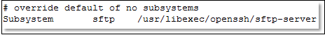

	- d) Find the line that begins with Subsystem and uncomment the line.
	
		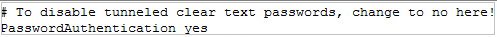	

8. Ensure the source machine Linux variant is supported. 
 
### Install the Mobility service manually

The software packages used to install the Mobility service are on the process server in C:\pushinstallsvc\repository. Log onto the process server and copy the appropriate installation package to the source machine based on the table below:-

| Source operating system                           	| Mobility service package on process server                                                           	|
|---------------------------------------------------	|------------------------------------------------------------------------------------------------------	|
| Windows Server (64 bit only)                      	| `C:\pushinstallsvc\repository\Microsoft-ASR_UA_8.4.0.0_Windows_GA_28Jul2015_release.exe`         |
| CentOS 6.4, 6.5, 6.6 (64 bit only)                	| `C:\pushinstallsvc\repository\Microsoft-ASR_UA_8.4.0.0_RHEL6-64_GA_28Jul2015_release.tar.gz`     |
| SUSE Linux Enterprise Server 11 SP3 (64 bit only) 	| `C:\pushinstallsvc\repository\Microsoft-ASR_UA_8.4.0.0_SLES11-SP3-64_GA_28Jul2015_release.tar.gz`|
| Oracle Enterprise Linux 6.4, 6.5 (64 bit only)    	| `C:\pushinstallsvc\repository\Microsoft-ASR_UA_8.4.0.0_OL6-64_GA_28Jul2015_release.tar.gz`       |

**To install the Mobility service manually on a Windows server**, do the following:

1. Copy the **Microsoft-ASR_UA_8.4.0.0_Windows_GA_28Jul2015_release.exe** package from the process server directory path listed in the table above to the source machine.
2. Install the Mobility service by running the executable on the source machine.
3. Follow the installer instructions.
4. Select **Mobility service** as the role and click **Next**.
	
	

5. Leave the installation directory as the default installation path and click **Install**.
6. In **Host Agent Config** specify the IP address and HTTPS port of the configuration server.

	- If you're connecting over the internet specify the public virtual IP address and public HTTPS endpoint as the port.
	- If you're connecting over VPN specify the internal IP address and 443 for the port. Leave **Use HTTPS** checked.

	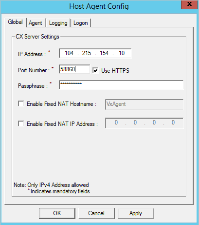

7. Specify the configuration server passphrase and click **OK** to register the Mobility service with the configuration server.

**To run from the command line:**

1. Copy the passphrase from the CX to the file "C:\connection.passphrase" on the server and run this command. In our example CX i 104.40.75.37 and the HTTPS port is 62519:

    `C:\Microsoft-ASR_UA_8.2.0.0_Windows_PREVIEW_20Mar2015_Release.exe" -ip 104.40.75.37 -port 62519 -mode UA /LOG="C:\stdout.txt" /DIR="C:\Program Files (x86)\Microsoft Azure Site Recovery" /VERYSILENT  /SUPPRESSMSGBOXES /norestart  -usesysvolumes  /CommunicationMode https /PassphrasePath "C:\connection.passphrase"`

**Install the Mobility service manually on a Linux server**:

1. Copy the appropriate tar archive based on the table above, from the process server to the source machine.
2. Open a shell program and extract the zipped tar archive to a local path by executing `tar -xvzf Microsoft-ASR_UA_8.2.0.0*`
3. Create a passphrase.txt file in the local directory to which you extracted the contents of the tar archive by entering *`echo <passphrase> >passphrase.txt`* from shell.
4. Install the Mobility service by entering *`sudo ./install -t both -a host -R Agent -d /usr/local/ASR -i <IP address> -p <port> -s y -c https -P passphrase.txt`*.
5. Specify the IP address and port:

	- If you are connecting to the configuration server over the internet specify the configuration server virtual public IP address and public HTTPS endpoint in `<IP address>` and `<port>`.
	- If you're connecting over a VPN connection specify the internal IP address and 443.

**To run from the command line**:

1. Copy the passphrase from the CX to the file "passphrase.txt" on the server and run this commands. In our example CX i 104.40.75.37 and the HTTPS port is 62519:

To install on a production server:

    ./install -t both -a host -R Agent -d /usr/local/ASR -i 104.40.75.37 -p 62519 -s y -c https -P passphrase.txt
 
To install on the target server:

    ./install -t both -a host -R MasterTarget -d /usr/local/ASR -i 104.40.75.37 -p 62519 -s y -c https -P passphrase.txt

>[AZURE.NOTE] When you add machines to a protection group that are already running an appropriate version of the Mobility service then the push installation is skipped.

## Step 9: Enable protection

To enable protection you add virtual machines and physical servers to a protection group. Before you start,note that:

- Virtual machines are discovered every 15 minutes and it can take up to 15 minutes for them to appear in Azure Site Recovery after discovery.
- Environment changes on the virtual machine (such as VMware tools installation) can also take up to 15 minutes to be updated in Site Recovery.
- You can check the last discovered time in the **LAST CONTACT AT** field for the vCenter server/ESXi host on the **Configuration Servers** page.
- If you have a protection group already created and add a vCenter Server or ESXi host after that, it takes fifteen minutes for the Azure Site Recovery portal to refresh and for virtual machines to be listed in the **Add machines to a protection group** dialog.
- If you would like to proceed immediately with adding machines to protection group without waiting for the scheduled discovery, highlight the configuration server (don’t click it) and click the **Refresh** button.
- When you add virtual machines or physical machines to a protection group, the process server automatically pushes and installs the Mobility service on the source server if the it isn't already installed.
- For the automatic push mechanism to work make sure you've set up your protected machines as described in the previous step.

Add machines as follows:

1. Click **Protected Items** > **Protection Group** > **Machines** > **Add Machines**. As a best practice we recommend that protection groups should mirror your workloads so that you add machines running a specific application to the same group.
2. In **Select Virtual Machines** if you're protecting physical servers, in the **Add Physical Machines** wizard provide the IP address and friendly name. Then select the operating system family.

	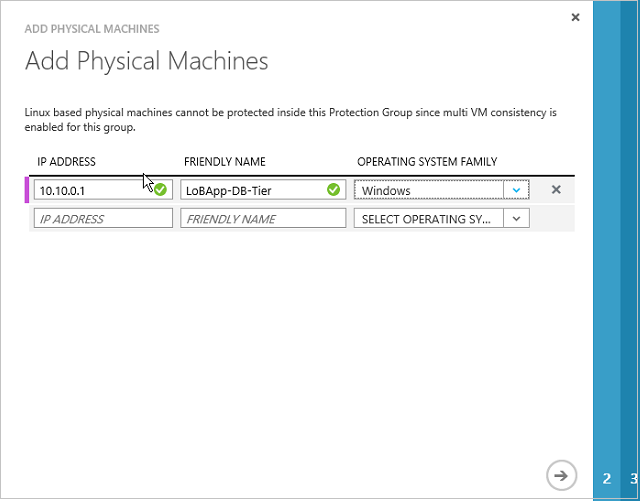

3. In **Select Virtual Machines** if you're protecting VMware virtual machines, select a vCenter server that's managing your virtual machines (or the EXSi host on which they're running), and then select the machines.

	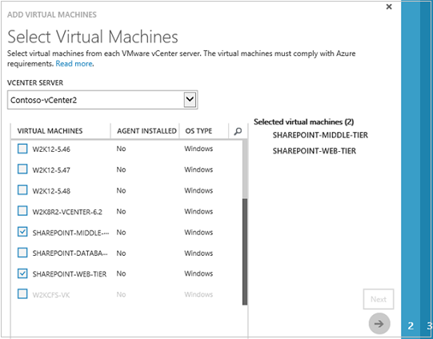	
4. In **Specify Target Resources** select the master target servers and storage to use for replication and select whether the settings should be used for all workloads. Select [Premium Storage Account](../storage/storage-premium-storage.md) while configuring protection for workloads which require consistent high IO performance and low latency in order to host IO intensive workloads. If you want to use a Premium Storage account for your workload disks, you need to use the Master Target of DS-series. You cannot use Premium Storage disks with Master Target of non-DS-series.

	>[AZURE.NOTE] We do not support the move of Storage accounts created using the [new Azure portal](../storage/storage-create-storage-account.md) across resource groups.

	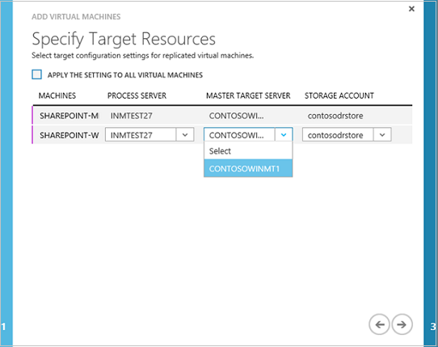

5. In **Specify Accounts** select the account you want to use for installing the Mobility service on protected machines. The account credentials are needed for automatic installation of the Mobility service. If you can't select an account make sure you set one up as described in Step 2. Note that this account can't be accessed by Azure. For Windows server the account should have administrator privileges on the source server. For Linux the account must be root.

	

6. Click the check mark to finish adding machines to the protection group and to start initial replication for each machine. You can monitor status on the **Jobs** page.

	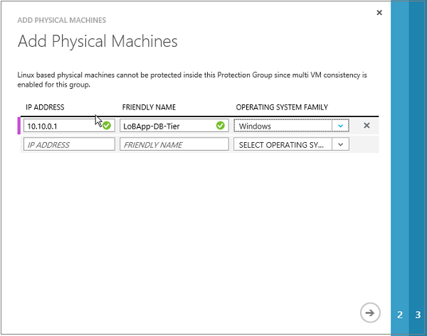

7. In addition you can monitor protection status by clicking **Protected Items** > protection group name > **Virtual Machines** . After initial replication completes and the machines are synchronizing data they will show **Protected** status.

	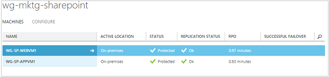

### Set protected machine properties

1. After a machine has a **Protected** status you can configure its failover properties. In the protection group details select the machine and open the **Configure** tab.
2. You can modify the name that will be given to the machine in Azure after failover and the Azure virtual machine size. You can also select the Azure network to which the machine will be connected after failover.

	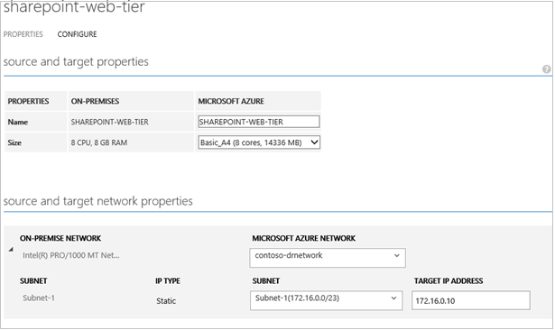

Note that:

- The name of the Azure machine must comply with Azure requirements.
- By default replicated virtual machines in Azure aren't connected to an Azure network. If you want replicated virtual machines to communicate make sure to set the same Azure network for them.
- If you resize a volume on a VMware virtual machine or physical server it goes into a critical state. If you do need to modify the size, do the following:

	- a) Change the size setting.
	- b) In the **Virtual Machines** tab, select the virtual machine and click **Remove**.
	- c) In **Remove Virtual Machine** select the option **Disable protection (use for recovery drill and volume resize)**. This option disables protection but retains the recovery points in Azure.

		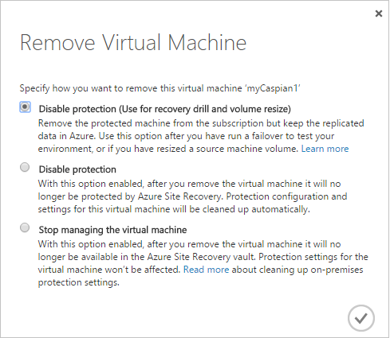

	- d) Reenable protection for the virtual machine. When you reenable protection the data for the resized volume will be transferred to Azure.

	

## Step 10: Run a failover

Currently you can only run unplanned failovers for protected VMware virtual machines and physical servers. Note the following:

- Before you initiate a failover, ensure that the configuration and master target servers are running and healthy. Otherwise failover will fail.
- Source machines aren't shut down as part of an unplanned failover. Performing an unplanned failover stops data replication for the protected servers. You'll need to delete the machines from the protection group and add them again in order to start protecting machines again after the unplanned failover completes.
- If you want to fail over without losing any data, make sure that the primary site virtual machines are turned off before you initiate the failover.

1. On the **Recovery Plans** page and add a recovery plan. Specify details for the plan and select **Azure** as the target.

	

2. In **Select Virtual Machine** select a protection group and then select machines in the group to add to the recovery plan. [Read more](site-recovery-create-recovery-plans.md) about recovery plans.

	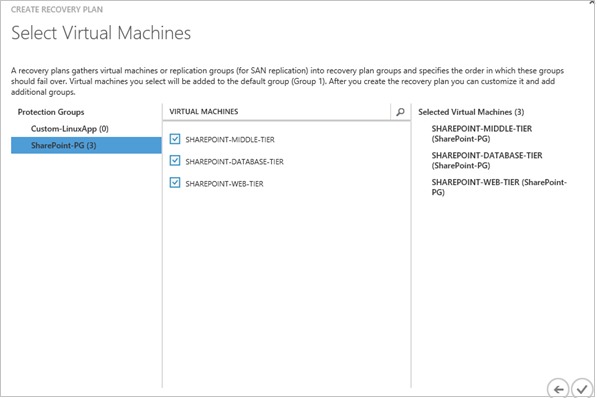

3. If needed you can customize the plan to create groups and sequence the order in which machines in the recovery plan are failed over. You can also add prompts for manual actions and scripts. The scripts when recovering to Azure can be added by using [Azure Automation Runbooks](site-recovery-runbook-automation.md).

4. In the **Recovery Plans** page select the plan and click **Unplanned Failover**.
5. In **Confirm Failover** verify the failover direction (To Azure) and select the recovery point to fail over to.
6. Wait for the failover job to complete and then verify that the failover worked as expected and that the replicated virtual machines start successfully in Azure.

## Step 11: Fail back failed over machines from Azure

[Learn more](site-recovery-failback-azure-to-vmware-classic-legacy.md) about how to bring your failed over machines running in Azure back to your on-premises environment.

## Manage your process servers

The process server sends replication data to the master target server in Azure, and discovers new VMware virtual machines added to a vCenter server. In the following circumstances you might want to change the process server in your deployment:

- If the current process server goes down
- If your recovery point objective (RPO) rises to an unacceptable level for your organization.

If required you can move the replication of some or all of your on-premises VMware virtual machines and physical servers to a different process server. For example:

- **Failure**—If a process server fails or isn't available you can move protected machine replication to another process server. Metadata of the source machine and replica machine will be moved to the new process server and data is resynchronized. The new process server will automatically connect to the vCenter server to perform automatic discovery. You can monitor the state of process servers on the Site Recovery dashboard.
- **Load balancing to adjust RPO**—For improved load balancing you can select a different process server in the Site Recovery portal, and move replication of one or more machines to it for manual load balancing. In this case metadata of the selected source and replica machines is moved to the new process server. The original process server remains connected to the vCenter server. 

### Monitor the process server

If a process server is in a critical state a status warning will be displayed on the Site Recovery Dashboard. You can click on the status to open the Events tab and then drill down to specific jobs on the Jobs tab. 

### Modify the process server used for replication

1. Open **Servers** > **Configuration Servers** > configuration server > **Server Details**.
2. Click **Process Servers** > **Change Process Server** next to the server you want to modify.

	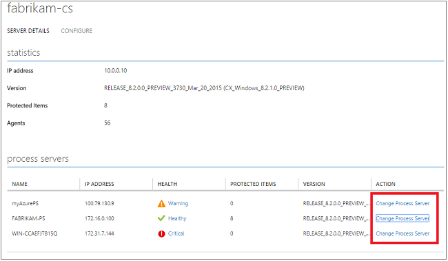

3. In **Change Process Server** > **Target Process Server** select the new server you want to use and then select the virtual machines that you want to replicate to the new server. Click the information icon next to the server name for details of free space and used memory. The average space that will be required to replicate each selected virtual machine to the new process server is displayed to help you make load decisions.

	

4. Click the check mark to begin replicating to the new process server. Note that if you remove all virtual machines from a process server that was critical it should no longer display a critical warning in the dashboard.

## Third-party software notices and information

Do Not Translate or Localize

The software and firmware running in the Microsoft product or service is based on or incorporates material from the projects listed below (collectively, “Third Party Code”).  Microsoft is the not original author of the Third Party Code.  The original copyright notice and license, under which Microsoft received such Third Party Code, are set forth below.

The information in Section A is regarding Third Party Code components from the projects listed below. Such licenses and information are provided for informational purposes only.  This Third Party Code is being relicensed to you by Microsoft under Microsoft's software licensing terms for the Microsoft product or service.  

The information in Section B is regarding Third Party Code components that are being made available to you by Microsoft under the original licensing terms.

The complete file may be found on the [Microsoft Download Center](http://go.microsoft.com/fwlink/?LinkId=529428). Microsoft reserves all rights not expressly granted herein, whether by implication, estoppel or otherwise.
