<properties
	pageTitle="Replicate VMware virtual machines and physical servers to Azure with Azure Site Recovery | Microsoft Azure"
	description="This article describes how to deploy Azure Site Recovery to orchestrate replication, failover and recovery of on-premises VMware virtual machines and Windows/Linux physical servers to Azure."
	services="site-recovery"
	documentationCenter=""
	authors="rayne-wiselman"
	manager="jwhit"
	editor=""/>

<tags
	ms.service="site-recovery"
	ms.workload="backup-recovery"
	ms.tgt_pltfrm="na"
	ms.devlang="na"
	ms.topic="article"
	ms.date="08/12/2016"
	ms.author="raynew"/>

# Replicate VMware virtual machines and physical servers to Azure with Azure Site Recovery

> [AZURE.SELECTOR]
- [Azure Portal](site-recovery-vmware-to-azure.md)
- [Classic Portal](site-recovery-vmware-to-azure-classic.md)
- [Classic Portal (legacy)](site-recovery-vmware-to-azure-classic-legacy.md)

The Azure Site Recovery service contributes to your business continuity and disaster recovery (BCDR) strategy by orchestrating replication, failover and recovery of virtual machines and physical servers. Machines can be replicated to Azure, or to a secondary on-premises data center. For a quick overview read [What is Azure Site Recovery?](site-recovery-overview.md).

## Overview

This article describes how to:

- **Replicate VMware virtual machines to Azure**—Deploy Site Recovery to coordinate replication, failover, and recovery of on-premises VMware virtual machines to Azure storage.
- **Replicate physical servers to Azure**—Deploy Azure Site Recovery to coordinate replication, failover, and recovery of on-premises physical Windows and Linux servers to Azure.

>[AZURE.NOTE] This article describes how to replicate to Azure. If you want to replicate VMware VMs or Windows/Linux physical servers to a secondary datacenter, follow the instructions in [this article](site-recovery-vmware-to-vmware.md).

Post any comments or questions at the bottom of this article, or on the [Azure Recovery Services Forum](https://social.msdn.microsoft.com/forums/azure/home?forum=hypervrecovmgr).

## Enhanced deployment

This article includes contains instructions for an enhanced deployment in the classic Azure portal. We recommend you use this version for all new deployments. If you've already deployed using the earlier legacy version we recommend that you migrate to the new version. Read [more](site-recovery-vmware-to-azure-classic-legacy.md##migrate-to-the-enhanced-deployment) about migration.

The enhanced deployment is a major update. Here's a summary of the improvements we've made:

- **No infrastructure VMs in Azure**: Data replicates directly to an Azure storage account. In addition for replication and failover there's no need to set up any infrastructure VMs (configuration server, master target server) as we needed in the legacy deployment.  
- **Unified installation**: A single installation provides simple setup and scalability for on-premises components.
- **Secure deployment**: All traffic is encrypted and replication management communications are sent over HTTPS 443.
- **Recovery points**: Support for crash and application-consistent recovery points for Windows and Linux environments, and supports both single VM and multi-VM consistent configurations.
- **Test failover**: Support for non-disruptive test failover to Azure, without impacting production or pausing replication.
- **Unplanned failover**: Support for unplanned failover to Azure with an enhanced option to shut down VMs automatically before failover.
- **Failback**: Integrated failback that replicates only delta changes back to the on-premises site.
- **vSphere 6.0**: Limited support for VMware Vsphere 6.0 deployments.

## How does Site Recovery help protect virtual machines and physical servers?

- VMware administrators can configure off-site protection to Azure of business workloads and applications running on VMware virtual machines. Server managers can replicate physical on-premises Windows and Linux servers to Azure.
- The Azure Site Recovery console provides a single location for simple setup and management of replication, failover, and recovery processes.
- If you replicate VMware virtual machines that are managed by a vCenter server, Site Recovery can discover those VMs automatically. If machines are on a ESXi host Site Recovery discovers VMs on the host.
- Run easy failovers from your on-premises infrastructure to Azure, and failback (restore) from Azure to VMware VM servers in the on-premises site.
- Configure recovery plans that group together application workloads that are tiered across multiple machines. You can fail over those plans, and Site Recovery provides multi-VM consistency so that machines running the same workloads can be recovered together to a consistent data point.

## Supported Operating Systems

### Windows(64 bit only)
- Windows Server 2008 R2 SP1+
- Windows Server 2012
- Windows Server 2012 R2

### Linux (64 bit only)
- Red Hat Enterprise Linux 6.7, 7.1, 7.2
- CentOS 6.5, 6.6, 6.7, 7.0, 7.1, 7.2
- Oracle Enterprise Linux 6.4, 6.5 running either the Red Hat compatible kernel or Unbreakable Enterprise Kernel Release 3 (UEK3)
- SUSE Linux Enterprise Server 11 SP3

## Scenario architecture

Scenario components:

- **An on-premises management server**: The management server runs Site Recovery components:
	- **Configuration server**:  Coordinates communication and manages data replication and recovery processes.
	- **Process server**:  Acts as a replication gateway. It receives data from protected source machines, optimizes it with caching, compression, and encryption, and sends replication data to Azure storage. It also handles push installation of Mobility service to protected machines and performs automatic discovery of VMware VMs.
	- **Master target server**: Handles replication data during failback from Azure.
	You can also deploy a management server that acts as a process server only, in order to scale your deployment.
- **The Mobility service**: This component is deployed on each machine (VMware VM or physical server) that you want to replicate to Azure. It captures data writes on the machine and forwards them to the process server.
- **Azure**: You don't need to create any Azure VMs to handle replication and failover. The Site Recovery service handles data management, and data replicates directly to Azure storage. Replicated Azure VMs are spun up automatically only when failover to Azure occurs. However, if you want to fail back from Azure to the on-premises site you will need to set up an Azure VM to act as a process server.

The graphic shows how these components interact.

**Figure 1: VMware/physical to Azure** (created by Henry Robalino)

## Capacity planning

When you’re planning capacity, here's what you need to think about:

- **The source environment**—Capacity planning or the VMware infrastructure and source machine requirements.
- **The management server**—Planning for the on-premises management servers that run Site Recovery components.
- **Network bandwidth from source to target**-Planning for network bandwidth required for replication between source and Azure

### Source environment considerations

- **Maximum daily change rate**—A protected machine can only use one process server, and a single process server can handle up to 2 TB of data change per day. Thus 2 TB is the maximum daily data change rate that’s supported for a protected machine.
- **Maximum throughput**—A replicated machine can belong to one storage account in Azure. A standard storage account can handle a maximum of 20,000 requests per second, and we recommend that you keep the number of IOPS across a source machine to 20,000. For example if you have a source machine with 5 disks and each disk generates 120 IOPS (8K size) on the source then it will be within the Azure per disk IOPS limit of 500. The number of storage accounts required = total source IOPs/20000.

### Management server considerations

The management server runs Site Recovery components that handle data optimization, replication and management. It should be able to handle the daily change rate capacity across all workloads running on protected machines, and has sufficient bandwidth to continuously replicate data to Azure storage. Specifically:

- The process server receives replication data from protected machines and optimizes it with caching, compression, and encryption before sending to Azure. The management server should have sufficient resources to perform these tasks.
- The process server uses disk based cache. We recommend a separate cache disk of 600 GB or more to handle data changes stored in the event of network bottleneck or outage. During deployment you can configure the cache on any drive that has at least 5 GB of storage available but 600 GB is the minimum recommendation.
- As a best practice we recommend that the management server be located on the same network and LAN segment as the machines you want to protect. It can be located on a different network but machines you want to protect should have L3 network visibility to it.

Size recommendations for the management server are summarized in the following table.

**Management server CPU** | **Memory** | **Cache disk size** | **Data change rate** | **Protected machines**
--- | --- | --- | --- | ---
8 vCPUs (2 sockets * 4 cores @ 2.5GHz) | 16 GB | 300 GB | 500 GB or less | Deploy a management server with these settings to replicate less than 100 machines.
12 vCPUs (2 sockets * 6 cores @ 2.5GHz) | 18 GB | 600 GB | 500 GB to 1 TB | Deploy a management server with these settings to replicate between 100-150 machines.
16 vCPUs (2 sockets * 8 cores @ 2.5GHz) | 32 GB | 1 TB | 1 TB to 2 TB | Deploy a management server with these settings to replicate between 150-200 machines.
Deploy another process server | | | > 2 TB | Deploy additional process servers if you're replicating more than 200 machines, or if the daily data change rate exceeds 2 TB.

Where:

- Each source machine is configured with 3 disks of 100 GB each.
- We used benchmarking storage of 8 SAS drives of 10 K RPM with RAID 10 for cache disk measurements.

### Network bandwidth from source to target
Make sure you calculate the bandwidth that would be required for initial replication and delta replication using the [capacity planner tool](site-recovery-capacity-planner.md)

#### Throttling bandwidth used for replication

VMware traffic replicated to Azure goes through a specific process server. You can throttle the bandwidth that's available for Site Recovery replication on that server as follows:

1. Open the Microsoft Azure Backup MMC snap-in on the main management server or on a management server running additional provisioned process servers. By default a shortcut for Microsoft Azure Backup is created on desktop, or you can find it in: C:\Program Files\Microsoft Azure Recovery Services Agent\bin\wabadmin.
2. In the snap-in click **Change Properties**.

	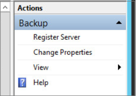

3. On the **Throttling** tab specify the bandwidth that can be used for Site Recovery replication and the applicable scheduling.

	

Optionally you can also set throttling using PowerShell. Here's an example:

    Set-OBMachineSetting -WorkDay $mon, $tue -StartWorkHour "9:00:00" -EndWorkHour "18:00:00" -WorkHourBandwidth (512*1024) -NonWorkHourBandwidth (2048*1024)

#### Maximizing bandwidth usage
To increase the bandwidth utilized for replication by Azure Site Recovery you would need to change a registry key.

The following key controls the number of threads per replicating disk that are used when replicating

    HKEY_LOCAL_MACHINE\SOFTWARE\Microsoft\Windows Azure Backup\Replication\UploadThreadsPerVM

 In an “overprovisioned” network, this registry key needs to be changed from it’s default values. We support a maximum of 32.  

[Learn more](site-recovery-capacity-planner.md) about detailed capacity planning.

### Additional process servers

If you need to protect more than 200 machines or daily change rate is greater that 2 TB you can add additional servers to handle the load. To scale out you can:

- Increase the number of management servers. For example you can protect up to 400 machines with two management servers.
- Add additional process servers and use these to handle traffic instead of (or in addition to) the management server.

This table describes a scenario in which:

- You set up the original management server to use it as a configuration server only.
- You set up an additional process server.
- You configure protected virtual machines to use the additional process server.
- Each protected source machine is configured with three disks of 100 GB each.

**Original management server**  (configuration server) | **Additional process server**| **Cache disk size** | **Data change rate** | **Protected machines**
--- | --- | --- | --- | ---
8 vCPUs (2 sockets * 4 cores @ 2.5GHz), 16 GB memory | 4 vCPUs (2 sockets * 2 cores @ 2.5GHz), 8 GB memory | 300 GB | 250 GB or less | You can replicate 85 or less machines.
8 vCPUs (2 sockets * 4 cores @ 2.5GHz), 16 GB memory | 8 vCPUs (2 sockets * 4 cores @ 2.5GHz), 12 GB memory | 600 GB | 250 GB to 1 TB | You can replicate between 85-150 machines.
12 vCPUs (2 sockets * 6 cores @ 2.5GHz), 18 GB memory | 12 vCPUs (2 sockets * 6 cores @ 2.5GHz) 24 GB memory | 1 TB | 1 TB to 2 TB | You can replicate between 150-225 machines.

The way in which you scale your servers will depend on your preference for a scale up or scale out model.  You scale up by deploying a few high-end management and process servers, or scale out by deploying more servers with less resources. For example: if you need to protect 220 machines you could do either of the following:

- Configure the original management server with 12vCPU, 18 GB of memory, an additional process server with 12vCPU, 24 GB of memory, and configure protected machines to use the additional process server only.
- Or alternatively you could configure two management servers (2 x 8vCPU, 16 GB RAM) and two additional process servers (1 x 8vCPU and 4vCPU x 1 to handle 135 + 85 (220) machines), and configure protected machines to use the additional process servers only.

[Follow these instructions](#deploy-additional-process-servers) to set up an additional process server.

## Before you start deployment

The tables summarize the prerequisites for deploying this scenario.

### Azure prerequisites

**Prerequisite** | **Details**
--- | ---
**Azure account**| You'll need a [Microsoft Azure](https://azure.microsoft.com/) account. You can start with a [free trial](https://azure.microsoft.com/pricing/free-trial/). [Learn more](https://azure.microsoft.com/pricing/details/site-recovery/) about Site Recovery pricing.
**Azure storage** | You'll need an Azure storage account to store replicated data. Replicated data is stored in Azure storage and Azure VMs are spun up when failover occurs.   You need a [standard geo-redundant storage account](../storage/storage-redundancy.md#geo-redundant-storage). The account must be in the same region as the Site Recovery service, and be associated with the same subscription. Note that replication to premium storage accounts isn't currently supported and shouldn't be used.  We do not support the move of Storage accounts created using the [new Azure portal](../storage/storage-create-storage-account.md) across resource groups.[Read about](../storage/storage-introduction.md) Azure storage.  
**Azure network** | You'll need an Azure virtual network that Azure VMs will connect to when failover occurs. The Azure virtual network must be in the same region as the Site Recovery vault.  Note that to fail back after failover to Azure you’ll need a VPN connection (or Azure ExpressRoute) set up from the Azure network to the on-premises site.

### On-premises prerequisites

**Prerequisite** | **Details**
--- | ---
**Management server** | You need an on-premises Windows 2012 R2 server running on a virtual machine or physical server. All of the on-premises Site Recovery components are installed on this management server   We recommend you deploy the server as a highly available VMware VM. Failback to the on-premises site from Azure is always be to VMware VMs regardless of whether you failed over VMs or physical servers. If you don't configure the Management server as a VMware VM you'll need to set up a separate master target server as a VMware VM to receive failback traffic.  The server should not be a Domain Controller.  The server should have a static IP address.  The host name of the server should be 15 characters or less.  The operating system locale should be English only.  The management server requires internet access.  You need outbound access from the server as follows: Temporary access on HTTP 80 during setup of the Site Recovery components (to download MySQL); Ongoing outbound access on HTTPS 443 for replication management; Ongoing outbound access on HTTPS 9443 for replication traffic (this port can be modified)   Make sure these URLs are accessible from the management server:  - \*.hypervrecoverymanager.windowsazure.com - \*.accesscontrol.windows.net - \*.backup.windowsazure.com - \*.blob.core.windows.net - \*.store.core.windows.net -https://www.msftncsi.com/ncsi.txt - [ https://dev.mysql.com/get/archives/mysql-5.5/mysql-5.5.37-win32.msi]( https://dev.mysql.com/get/archives/mysql-5.5/mysql-5.5.37-win32.msi " https://dev.mysql.com/get/archives/mysql-5.5/mysql-5.5.37-win32.msi")  If you have IP address-based firewall rules on the server, check that the rules allow communication to Azure. You'll need to allow the [Azure Datacenter IP Ranges](https://www.microsoft.com/download/details.aspx?id=41653) and the HTTPS (433) protocol. You'll also need to white list IP address ranges for the Azure region of your subscription, and for West US. The URL [https://dev.mysql.com/get/archives/mysql-5.5/mysql-5.5.37-win32.msi](https://dev.mysql.com/get/archives/mysql-5.5/mysql-5.5.37-win32.msi " https://dev.mysql.com/get/archives/mysql-5.5/mysql-5.5.37-win32.msi") is for downloading MySQL.
**VMware vCenter/ESXi host**: | You need one or more vMware vSphere ESX/ESXi hypervisors managing your VMware virtual machines, running ESX/ESXi version 6.0, 5.5 or 5.1 with the latest updates.   We recommend you deploy a VMware vCenter server to manage your ESXi hosts. It should be running vCenter version 6.0 or 5.5 with the latest updates.  Note that Site Recovery doesn't support new vCenter and vSphere 6.0 features such as cross vCenter vMotion, virtual volumes, and storage DRS. Site Recovery support is limited to features that were also available in version 5.5.
**Protected machines**: | **AZURE**  Machines you want to protect should conform with [Azure prerequisites](site-recovery-best-practices.md#azure-virtual-machine-requirements) for creating Azure VMs.  If you want to connect to the Azure VMs after failover then you’ll need to enable Remote Desktop connections on the local firewall.  Individual disk capacity on protected machines shouldn’t be more than 1023 GB. A VM can have up to 64 disks (thus up to 64 TB). If you have disks larger than 1 TB consider using database replication such as SQL Server Always On or Oracle Data Guard  Shared disk guest clusters aren't supported. If you have a clustered deployment consider using database replication such as SQL Server Always On or Oracle Data Guard.  Unified Extensible Firmware Interface(UEFI)/Extensible Firmware Interface(EFI) boot isn't supported.  Machine names should contain between 1 and 63 characters (letters, numbers and hyphens). The name must start with a letter or number and end with a letter or number. After a machine is protected you can modify the Azure name.  **VMware VMs**  You’ll need to install VMware vSphere PowerCLI  6.0. on the management server (configuration server).  VMware VMs you want to protect should have VMware tools installed and running.  If the source VM has NIC teaming it’s converted to a single NIC after failover to Azure.  If protected VMs have an iSCSI disk then Site Recovery converts the protected VM iSCSI disk into a VHD file when the VM fails over to Azure. If iSCSI target can be reached by the Azure VM then it will connect to iSCSI target and essentially see two disks – the VHD disk on the Azure VM and the source iSCSI disk. In this case you’ll need to disconnect the iSCSI target that appears on the failed over Azure VM.  [Learn more](#vmware-permissions-for-vcenter-access) about the VMware user permissions that are needed by Site Recovery.   **WINDOWS SERVER MACHINES (on VMware VM or physical server)**  The server should be running a supported 64-bit operating system: Windows Server 2012 R2, Windows Server 2012, or Windows Server 2008 R2 with at least SP1.  The operating system should be installed on C:\ drive and the OS disk should be a Windows basic disk (OS shouldn’t be installed on a Windows dynamic disk.)  For Windows Server 2008 R2 machines you will need to have .NET Framework 3.5.1 installed.  You'll need to provide an administrator account (must be a local administrator on the Windows machine) for the push installation the Mobility Service on Windows servers. If the provided account is a non-domain account you'll need to disable Remote User Access control on the local machine. [Learn more](#install-the-mobility-service-with-push-installation).  Site Recovery supports VMs with RDM disk.  During failback Site Recovery will reuse the RDM disk if the original source VM and RDM disk is available. If they aren’t available, during failback Site Recovery will create a new VMDK file for each disk.  **LINUX MACHINES**  You’ll need a supported 64 bit operating system: Red Hat Enterprise Linux 6.7; Centos 6.5, 6.6,6.7; Oracle Enterprise Linux 6.4, 6.5 running either the Red Hat compatible kernel or Unbreakable Enterprise Kernel Release 3 (UEK3), SUSE Linux Enterprise Server 11 SP3.  /etc/hosts files on protected machines should contain entries that map the local host name to IP addresses associated with all network adapters.   If you want to connect to an Azure virtual machine running Linux after failover using a Secure Shell client (ssh), ensure that the Secure Shell service on the protected machine is set to start automatically on system boot, and that firewall rules allow an ssh connection to it.  Protection can only be enabled for Linux machines with the following storage: File system (EXT3, ETX4, ReiserFS, XFS); Multipath software-Device Mapper (multipath)); Volume manager: (LVM2). Physical servers with HP CCISS controller storage are not supported. The ReiserFS filesystem is supported only on SUSE Linux Enterprise Server 11 SP3.  Site Recovery supports VMs with RDM disk.  During failback for Linux, Site Recovery doesn’t reuse the RDM disk. Instead it creates a new VMDK file for each corresponding RDM disk.

Only for Linux VM - ensure that you set the disk.enableUUID=true setting in Configuration Parameters of the VM in VMware. If this row does not exist, add it. This is required to provide a consistent UUID to the VMDK so that it mounts correctly. Also note that without this setting, failback will cause a full download even if the VM is available on-prem. Adding this setting will ensure that only delta changes are transferred back during failback.

## Step 1: Create a vault

1. Sign in to the [Management Portal](https://manage.windowsazure.com/).
2. Expand **Data Services** > **Recovery Services** and click **Site Recovery Vault**.
3. Click **Create New** > **Quick Create**.
4. In **Name**, enter a friendly name to identify the vault.
5. In **Region**, select the geographic region for the vault. To check supported regions see Geographic Availability in [Azure Site Recovery Pricing Details](https://azure.microsoft.com/pricing/details/site-recovery/)
6. Click **Create vault**.
	

Check the status bar to confirm that the vault was successfully created. The vault will be listed as **Active** on the main **Recovery Services** page.

## Step 2: Set up an Azure network

Set up an Azure network so that Azure VMs will be connected to a network after failover, and so that failback to the on-premises site can work as expected.

1. In the Azure portal > **Create virtual network** specify the network name. IP address range and subnet name.
2. You would need to add VPN/ExpressRoute to the network if you need to do failback. VPN/ExpressRoute can be added to the network even after failover.

[Read more](../virtual-network/virtual-networks-overview.md) about Azure networks.

## Step 3: Install the VMware components

If you want to replicate VMware virtual machines install the following VMware components on the management server:

1. [Download](https://developercenter.vmware.com/tool/vsphere_powercli/6.0) and install VMware vSphere PowerCLI 6.0.
2. Restart the server.

## Step 4: Download a vault registration key

1. From the management server open the Site Recovery console in Azure. In the **Recovery Services** page click the vault to open the Quick Start page. Quick Start can also be opened at any time using the icon.

	

2. On the **Quick Start** page click **Prepare Target Resources** > **Download a registration key**. The registration file is generated automatically. It's valid for 5 days after it's generated.

## Step 5: Install the management server
> [AZURE.TIP] Make sure these URLs are accessible from the management server:
>
- *.hypervrecoverymanager.windowsazure.com
- *.accesscontrol.windows.net
- *.backup.windowsazure.com
- *.blob.core.windows.net
- *.store.core.windows.net
- https://dev.mysql.com/get/archives/mysql-5.5/mysql-5.5.37-win32.msi
- https://www.msftncsi.com/ncsi.txt

[AZURE.VIDEO enhanced-vmware-to-azure-setup-registration]

1. On the **Quick Start** page download the unified installation file to the server.

2. Run the installation file to start setup in the Site Recovery Unified Setup wizard.

3.	In **Before you begin** select **Install the configuration server and process server**.

	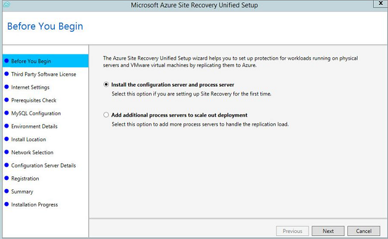
4. In **Third-Party Software License** click **I Accept** to download and install MySQL. 

	

5. In **Registration** browse and select the registration key you downloaded from the vault.

	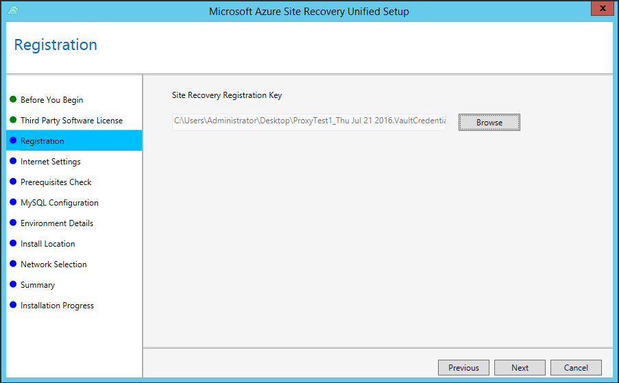

6. In **Internet Settings** specify how the Provider running on the configuration server will connect to Azure Site Recovery over the internet.

	- If you want to connect with the proxy that's currently set up on the machine select **Connect with existing proxy settings**.
	- If you want the Provider to connect directly select **Connect directly without a proxy**.
	- If the existing proxy requires authentication, or you want to use a custom proxy for the Provider connection, select **Connect with custom proxy settings**.
		- If you use a custom proxy you'll need to specify the address, port, and credentials
		- If you're using a proxy you should have already allowed the following URLs:
			- *.hypervrecoverymanager.windowsazure.com;    
			- *.accesscontrol.windows.net; 
			- *.backup.windowsazure.com; 
			- *.blob.core.windows.net; 
			- *.store.core.windows.net
			

	

7. In **Prerequisites Check** setup runs a check to make sure that installation can run. 

	
	

	 If a warning appears about the **Global time sync check** verify that the time on the system clock (**Date and Time** settings) is the same as the time zone.

 	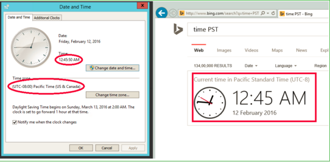

8. In **MySQL Configuration** create credentials for logging onto the MySQL server instance that will be installed.

	

9. In **Environment Details** select whether you're going to replicate VMware VMs. If you are, then setup checks that PowerCLI 6.0 is installed.

	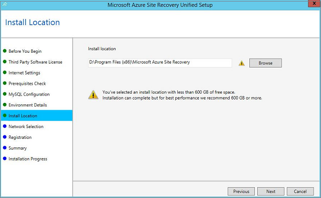

10. In **Install Location** select where you want to install the binaries and store the cache. You can select a drive that has at least 5 GB of storage available but we recommend a cache drive with at least 600 GB of free space.

	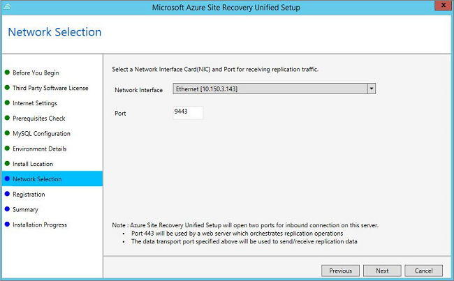

11. In **Network Selection** specify the listener (network adapter and SSL port) on which the configuration server will send and receive replication data. You can modify the default port (9443). In addition to this port, port 443 will be used by a web server which orchestrates replication operations. 443 shouldn't be used for receiving replication traffic.

	

12.  In **Summary** review the information and click **Install**. When installation finishes a passphrase is generated. You'll need it when you enable replication so copy it and keep it in a secure location.

	

13.  In **Summary** review the information.

	

>[AZURE.WARNING] Microsoft Azure Recovery Service Agent's proxy needs to be setup.
>Once the installation is complete launch an application named "Microsoft Azure Recovery Services Shell" from the Windows Start menu. In the command window that opens up run the following set of commands to setup the proxy server settings.
>
	$pwd = ConvertTo-SecureString -String ProxyUserPassword
	Set-OBMachineSetting -ProxyServer http://myproxyserver.domain.com -ProxyPort PortNumb – ProxyUserName domain\username -ProxyPassword $pwd
	net stop obengine
	net start obengine

### Run setup from the command line

You can also run the unified wizard from the command line, as follows:

    UnifiedSetup.exe [/ServerMode <CS/PS>] [/InstallDrive <DriveLetter>] [/MySQLCredsFilePath <MySQL credentials file path>] [/VaultCredsFilePath <Vault credentials file path>] [/EnvType <VMWare/NonVMWare>] [/PSIP <IP address to be used for data transfer] [/CSIP <IP address of CS to be registered with>] [/PassphraseFilePath <Passphrase file path>]

Where:

- /ServerMode: Mandatory. Specifies whether the install should install the configuration and process servers or the process server only (used to install additional process servers). Input values: CS, PS.
- InstallDrive: Mandatory. Specifies the folder where the components are installed.
- /MySQLCredFilePath. Mandatory. Specifies the path to a file where the MySQL server credentials are story. Get the template to create the file.
- /VaultCredFilePath. Mandatory. Location of the vault credentials file
- /EnvType. Mandatory. Type of installation. Values: VMware, NonVMware
- /PSIP and /CSIP. Mandatory. IP address of the process server and configuration server.
- /PassphraseFilePath. Mandatory. Location of the passphrase file.
- /ByPassProxy. Optional. Specifies the management server connects to Azure without a proxy.
- /ProxySettingsFilePath. Optional. Specifies settings for a custom proxy (either default proxy on the server that requires authentication, or custom proxy)

## Step 6: Set up credentials for the vCenter server

> [AZURE.VIDEO enhanced-vmware-to-azure-discovery]

The process server can automatically discover VMware VMs that are managed by a vCenter server. For automatic discovery Site Recovery needs an account and credentials that can access the vCenter server. This isn't relevant if you're replicating physical servers only.

Do this as follows:

1. On the vCenter server create a role (**Azure_Site_Recovery**) at the vCenter level with the [required permissions](#vmware-permissions-for-vcenter-access).
2. Assign the **Azure_Site_Recovery** role to a vCenter user.

	>[AZURE.NOTE] A vCenter user account that has the read-only role can run failover without shutting down protected source machines. If you want to shut down those machines you'll need the Azure_Site_Recovery role. Note that if you're only migrating VMs from VMware to Azure and don't need to failback then the read-only role is sufficient.

3. To add the account open **cspsconfigtool**. It's available as a shortcut on the desktop and located in the [INSTALL LOCATION]\home\svsystems\bin folder.
2. in the **Manage Accounts** tab, click **Add Account**.

	

3. In **Account Details** add credentials that can be used to access the vCenter server. Note that it could take more than 15 minutes for the account name to appear in the portal. To update immediately, click Refresh on the **Configuration Servers** tab.

	

## Step 7: Add vCenter servers and ESXi hosts

If you're replicating VMware VMs you need to add a vCenter server (or ESXi host).

1. On the **Servers** > **Configuration Servers** tab, select the configuration server > **Add vCenter server**.

	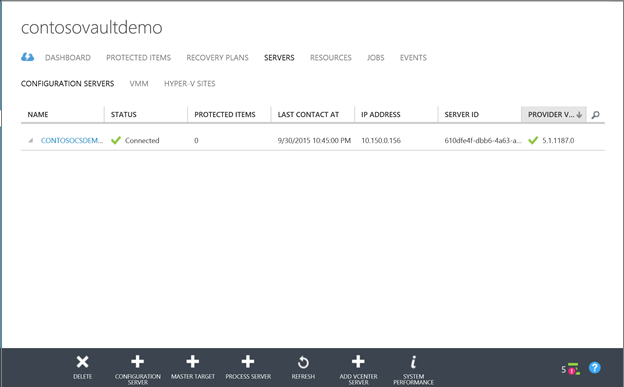

2. Add the vCenter server or ESXi host details, the name of the account you specified to access the vCenter server in the previous step, and the process server that will be used to discover VMware VMs that are managed by the vCenter server. Note that the vCenter server or ESXi host should be located in the same network as the server on which the process server is installed.

	>[AZURE.NOTE] If you're adding the vCenter server or ESXi host with an account that doesn't have administrator privileges on the vCenter or host server, then make sure the vCenter or ESXi accounts have these privileges enabled: Datacenter, Datastore, Folder, Jost, Network, Resource, Virtual machine, vSphere Distributed Switch. In addition the vCenter server needs the Storage views privilege.

	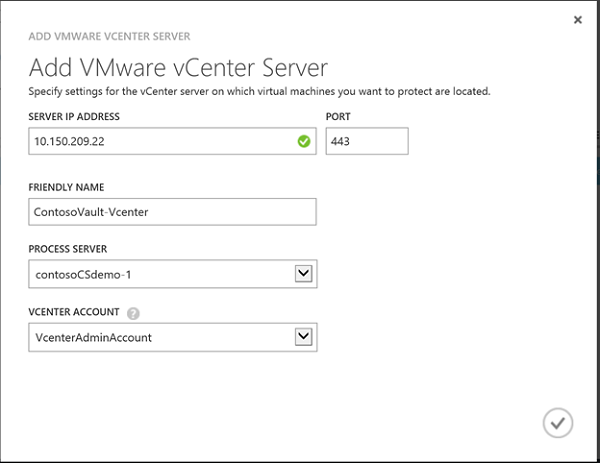

3. After discovery is complete the vCenter server will be listed in the **Configuration Servers** tab.

	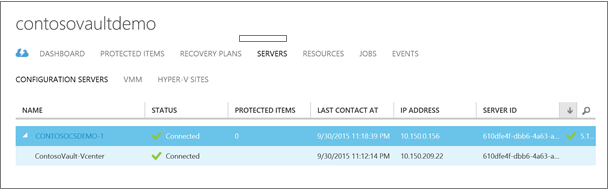

## Step 8: Create a protection group

> [AZURE.VIDEO enhanced-vmware-to-azure-protection]

Protection groups are logical groupings of virtual machines or physical servers that you want to protect using the same protection settings. You apply protection settings to a protection group, and those settings are applied to all virtual machines/physical machines that you add to the group.

1. Open **Protected Items** > **Protection Group** and click to add a protection group.

	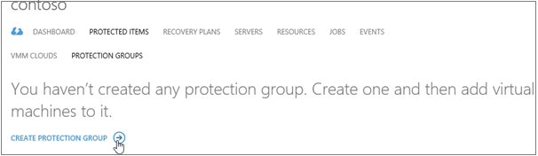

2. On the **Specify Protection Group Settings** page specify a name for the group and in **From** select the configuration server on which you want to create the group. **Target** is Azure.

	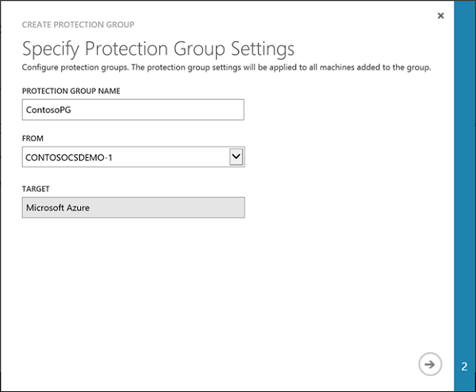

3. On the **Specify Replication Settings** page configure the replication settings that will be used for all the machines in the group.

	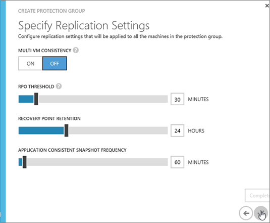

	- **Multi VM consistency**: If you turn this on it creates shared application-consistent recovery points across the machines in the protection group. This setting is most relevant when all of the machines in the protection group are running the same workload. All machines will be recovered to the same data point. This is available whether you're replicating VMware VMs, or Windows/Linux physical servers.
	- **RPO threshold**: Sets the RPO. Alerts will be generated when the continuous data protection replication  exceeds the configured RPO threshold value.
	- **Recovery point retention**: Specifies the retention window. Protected machines can be recovered to any point within this window.
	- **Application-consistent snapshot frequency**: Specifies how frequently recovery points containing application-consistent snapshots will be created.

When you click on the checkmark a protection group will be created with the name you specified. In addition a second protection group is created with the name <protection-group-name-Failback). This protection group is used if you fail back to the on-premises site after failover to Azure. You can monitor the protection groups as they're created on the **Protected Items** page.

## Step 9: Install the Mobility service

The first step in enabling protection for virtual machines and physical servers is to install the Mobility service. You can do this in two ways:

- Automatically push and install the service on each machine from the process server. Note that when you add machines to a protection group and they're already running an appropriate version of the Mobility service push installation won't occur.
- Automatically install the service using your enterprise push method such as WSUS or System Center Configuration Manager. Make sure you've set up the management server before you do this.
- Install manually on each machine you want to protect. ake sure you've set up the management server before you do this.

### Install the Mobility service with push installation

When you add machines to a protection group the Mobility service is automatically pushed and installed on each machine by the process server.

#### Prepare for automatic push on Windows machines

Here's how to prepare Windows machines so that the Mobility service can be automatically installed by the process server.

1.  Create an account that can be used by the process server to access the machine. The account should have administrator privileges (local or domain). Note that these credentials are only used for push installation of the Mobility service.

	>[AZURE.NOTE] If you're not using a domain account you'll need to disable Remote User Access control on the local machine. To do this, in the register under HKEY_LOCAL_MACHINE\SOFTWARE\Microsoft\Windows\CurrentVersion\Policies\System add the DWORD entry LocalAccountTokenFilterPolicy with a value of 1 under . To add the registry entry from a CLI open command or using PowerShell enter **`REG ADD HKEY_LOCAL_MACHINE\SOFTWARE\Microsoft\Windows\CurrentVersion\Policies\System /v LocalAccountTokenFilterPolicy /t REG_DWORD /d 1`**.

2.  On the Windows Firewall of the machine you want to protect, select **Allow an app or feature through Firewall** and enable **File and Printer Sharing** and **Windows Management Instrumentation**. For machines that belong to a domain you can configure the firewall policy with a GPO.

	

2. Add the account you created:

	- Open **cspsconfigtool**. It's available as a shortcut on the desktop and located in the [INSTALL LOCATION]\home\svsystems\bin folder.
	- In the **Manage Accounts** tab, click **Add Account**.
	- Add the account you created. After adding the account you'll need to provide the credentials when you add a machine to a protection group.

#### Prepare for automatic push on Linux servers

1.	Make sure that the Linux machine you want to protect is supported as described in [On-premises prerequisites](#on-premises-prerequisites). Ensure there’s network connectivity between the machine you want to protect and the management server that runs the process server.

2.	Create an account that can be used by the process server to access the machine. The account should be a root user on the source Linux server. Note that these credentials are only used for push installation of the Mobility service.

	- Open **cspsconfigtool**. It's available as a shortcut on the desktop and located in the [INSTALL LOCATION]\home\svsystems\bin folder.
	- In the **Manage Accounts** tab, click **Add Account**.
	- Add the account you created. After adding the account you'll need to provide the credentials when you add a machine to a protection group.

3.	Check that the /etc/hosts file on the source Linux server contains entries that map the local hostname to IP addresses associated with all network adapters.
4.	Install the latest openssh, openssh-server, openssl packages on the machine you want to protect.
5.	Ensure SSH is enabled and running on port 22.
6.	Enable SFTP subsystem and password authentication in the sshd_config file as follows:

	- Log in as root.
	- In the file /etc/ssh/sshd_config file, find the line that begins with PasswordAuthentication.
	- Uncomment the line and change the value from **no** to **yes**.
	- Find the line that begins with **Subsystem** and uncomment the line.

		

### Install the Mobility service manually

The installers are available in C:\Program Files (x86)\Microsoft Azure Site Recovery\home\svsystems\pushinstallsvc\repository.

Source operating system | Mobility service installation file
--- | ---
Windows Server (64 bit only) | Microsoft-ASR_UA_9.*.0.0_Windows_* release.exe
CentOS 6.4, 6.5, 6.6 (64 bit only) | Microsoft-ASR_UA_9.*.0.0_RHEL6-64_*release.tar.gz
SUSE Linux Enterprise Server 11 SP3 (64 bit only) | Microsoft-ASR_UA_9.*.0.0_SLES11-SP3-64_*release.tar.gz
Oracle Enterprise Linux 6.4, 6.5 (64 bit only) | Microsoft-ASR_UA_9.*.0.0_OL6-64_*release.tar.gz

#### Install manually on a Windows server

1. Download and run the relevant installer.
2. In **Before you begin **select **Mobility service**.

	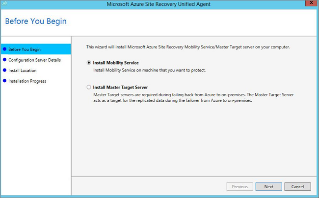

3. In **Configuration Server Details** specify the IP address of the management server and the passphrase that was generated when you installed the management server components. You can retrieve the passphrase  by running: **<SiteRecoveryInstallationFolder>\home\sysystems\bin\genpassphrase.exe –n** on the management server.

	

4. In **Install Location** leave the default location and click **Next** to begin installation.
5. In **Installation Progress** monitor installation and restart the machine if prompted.

You can also install from the command line:

UnifiedAgent.exe [/Role <Agent/MasterTarget>] [/InstallLocation <Installation Directory>] [/CSIP <IP address of CS to be registered with>] [/PassphraseFilePath <Passphrase file path>] [/LogFilePath <Log File Path>]

Where:

- /Role: Mandatory. Specifies whether the Mobility service should be installed.
- /InstallLocation: Mandatory. Specifies where to install the service.
- /PassphraseFilePath: Mandatory. Specifies the configuration server passphrase.
- /LogFilePath: Mandatory. Specifies log setup files location

#### Modify the IP address of the management server

After running the wizard you can modify the IP address of the management server as follows:

1. Open the file hostconfig.exe (located on the desktop).
2. On the **Global** tab you can change the IP address of the management server.

	>[AZURE.NOTE] You should only change the IP address of the management server. The port number for management server communications must be 443 and Use HTTPS should be left enabled. The passphrase shouldn't be modified.

	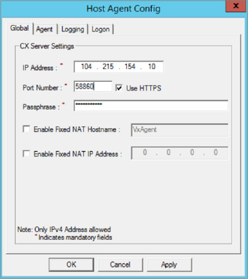

#### Install manually on a Linux server:

1. Copy the appropriate tar archive based on the table above to the Linux machine you want to protect.
2. Open a shell program and extract the zipped tar archive to a local path by running: `tar -xvzf Microsoft-ASR_UA_8.5.0.0*`
3. Create a passphrase.txt file in the local directory to which you extracted the contents of the tar archive. To do this copy the passphrase from C:\ProgramData\Microsoft Azure Site Recovery\private\connection.passphrase on the management server, and save it in passphrase.txt by running *`echo <passphrase> >passphrase.txt`* in shell.
4. Install the Mobility service by entering *`sudo ./install -t both -a host -R Agent -d /usr/local/ASR -i <IP address> -p <port> -s y -c https -P passphrase.txt`*.
5. Specify the internal IP address of the management server and make sure port 443 is selected.

**You can also install from the command line**:

1. Copy the passphrase from C:\Program Files (x86)\InMage Systems\private\connection on the management server, and save it as "passphrase.txt" on the management server. Then run these commands. In our example the management server IP address is 104.40.75.37 and the HTTPS port should be 443:

To install on a production server:

    ./install -t both -a host -R Agent -d /usr/local/ASR -i 104.40.75.37 -p 443 -s y -c https -P passphrase.txt

To install on the master target server:

    ./install -t both -a host -R MasterTarget -d /usr/local/ASR -i 104.40.75.37 -p 443 -s y -c https -P passphrase.txt

## Step 10: Enable protection for a machine

To enable protection you add virtual machines and physical servers to a protection group. Before you start,note the following if you're protecting VMware virtual machines:

- VMware VMs are discovered every 15 minutes and it could take more than 15 minutes for them to appear in the Site Recovery portal after discovery.
- Environment changes on the virtual machine (such as VMware tools installation) might also take more than 15 minutes to be updated in Site Recovery.
- You can check the last discovered time for VMware VMs in the **Last Contact At** field for the vCenter server/ESXi host on the **Configuration Servers** tab.
- If you have a protection group already created and add a vCenter Server or ESXi host after that, it might take more than 15 minutes for the Azure Site Recovery portal to refresh and for virtual machines to be listed in the **Add machines to a protection group** dialog.
- If you would like to proceed immediately with adding machines to protection group without waiting for the scheduled discovery, highlight the configuration server (don’t click it) and click the **Refresh** button.

In addition note that:

- We recommend that you architect your protection groups so that they mirror your workloads. For example add machines running a specific application to the same group.
- When you add machines to a protection group, the process server automatically pushes and installs the Mobility service if it isn't already installed. Note that you'll need to have the push mechanism prepare as described in the previous step.

Add machines to a protection group:

1. Click **Protected Items** > **Protection Group** > **Machines** > Add Machines. \As a best practice
2. In **Select Virtual Machines** if you're protecting VMware virtual machines, select a vCenter server that's managing your virtual machines (or the EXSi host on which they're running), and then select the machines.

	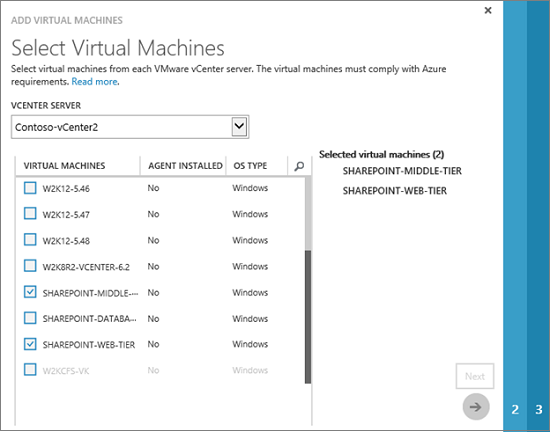

3.  In **Select Virtual Machines** if you're protecting physical servers, in the **Add Physical Machines** wizard provide the IP address and friendly name. Then select the operating system family.

	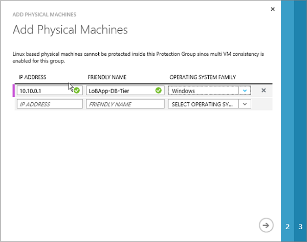

4. In **Specify Target Resources** select the storage account you're using for replication and select whether the settings should be used for all workloads. Note that premium storage accounts aren't currently supported.

	>[AZURE.NOTE] We do not support the move of Storage accounts created using the [new Azure portal](../storage/storage-create-storage-account.md) across resource groups.

	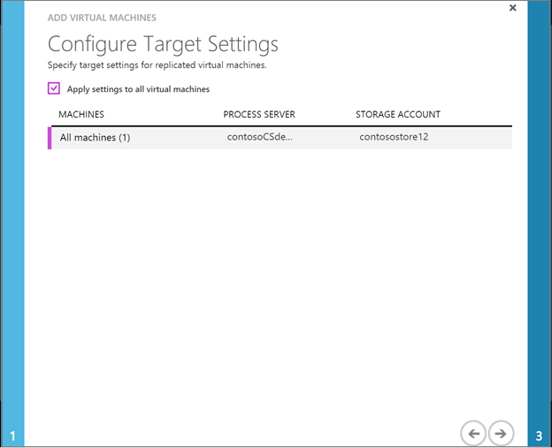

5. In **Specify Accounts** select the account you [configured](#install-the-mobility-service-with-push-installation) to use for automatic installation of the Mobility service.

	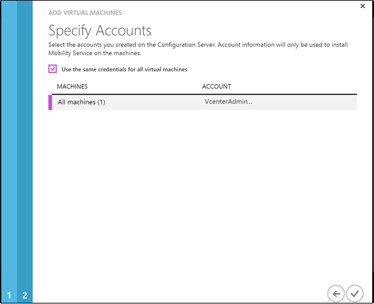

6. Click the check mark to finish adding machines to the protection group and to start initial replication for each machine.

	>[AZURE.NOTE] If push installation has been prepared the Mobility service is automatically installed on machines that don't have it as they're added to the protection group. After the service is installation a protection job starts and fails. After the failure you'll need to manually restart each machine that's had the Mobility service installed. After the restart the protection job begins again and initial replication occurs.

You can monitor status on the **Jobs** page.

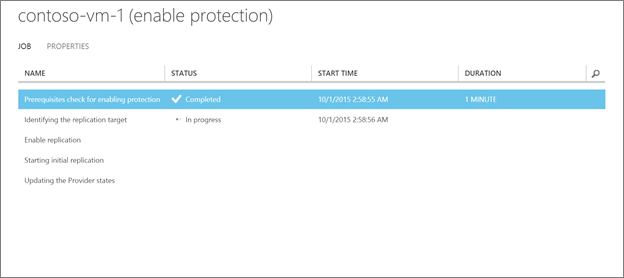

In addition, protection status can be monitored in **Protected Items** > <protection group name> > **Virtual Machines**. After initial replication completes, and data is synchronized, machine status changes to** Protected**.

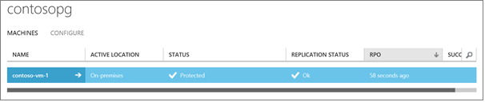

## Step 11: Set protected machine properties

1. After a machine has a **Protected** status you can configure its failover properties. In the protection group details select the machine and open the **Configure** tab.
2. Site Recovery automatically suggests properties for the Azure VM and detects the on-premises network settings.

	

3. You can modify these settings:

	-  **Azure VM name**: This is the name that will be given to the machine in Azure after failover. The name must comply with Azure requirements.

	-  **Azure VM size**: The number of network adapters is dictated by the size you specify for the target virtual machine. [Read more](../virtual-machines/virtual-machines-linux-sizes.md/#size-tables) about sizes and adapters. Note that:

		- When you modify the size for a virtual machine and save the settings, the number of network adapter will change when you open the **Configure** tab next time. The number of network adapters of target virtual machines is minimum of the number of network adapters on source virtual machine and maximum number of network adapters supported by the size of the virtual machine chosen.
			- If the number of network adapters on the source machine is less than or equal to the number of adapters allowed for the target machine size, then the target will have the same number of adapters as the source.
			- If the number of adapters for the source virtual machine exceeds the number allowed for the target size then the target size maximum will be used.
			- For example if a source machine has two network adapters and the target machine size supports four, the target machine will have two adapters. If the source machine has two adapters but the supported target size only supports one then the target machine will have only one adapter.
		- If the virtual machine has multiple network adapters all adapters should connected to the same Azure network.
	- **Azure network**: You must specify an Azure network that Azure VMs will be connected to after failover. If you don't specify one then the Azure VMs won't be connected to any network. In addition you'll need to specify an Azure network if you want to failback from Azure to the on-premises site. Failback requires a VPN connection between an Azure network and an on-premises network.
	- **Azure IP address/subnet**: For each network adapter you select the subnet to which the Azure VM should connect. Note that:
		- If the network adapter of the source machine is configured to use a static IP address then you can specify a static IP address for the Azure VM. If you don't provide a static IP address then any available IP address will be allocated. If the target IP address is specified but it's already in use by another VM in Azure then failover will fail. If the network adapter of the source machine is configured to use DHCP then you'll have DHCP as the setting for Azure.

## Step 12: Create a recovery plan and run a failover

> [AZURE.VIDEO enhanced-vmware-to-azure-failover]

You can run a failover for a single machine, or fail over multiple virtual machines that perform the same task or run the same workload. To fail over multiple machines at the same time you add them to a recovery plan.

### Create a recovery plan

1. On the **Recovery Plans** page click **Add Recovery Plan** and add a recovery plan. Specify details for the plan and select **Azure** as the target.

	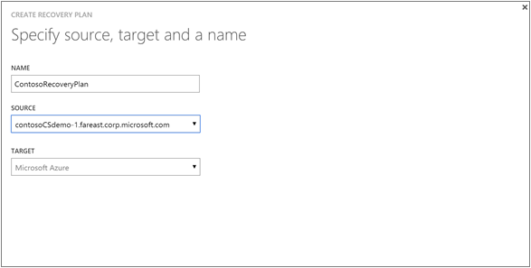

2. In **Select Virtual Machine** select a protection group and then select machines in the group to add to the recovery plan.

	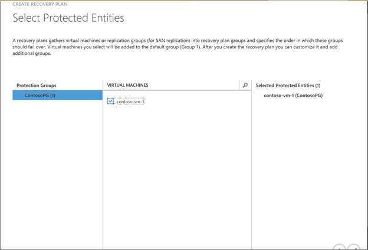

You can customize the plan to create groups and sequence the order in which machines in the recovery plan are failed over. You can also add scripts and prompts for manual actions. Scripts can be created manually or by using by [Azure Automation Runbooks](site-recovery-runbook-automation.md). [Learn more](site-recovery-create-recovery-plans.md) about customizing recovery plans.

## Run a failover

Before you run a failover note that:

- Make sure that the management server is running and available - otherwise failover will fail.
- If you run an unplanned failover note that:

	- If possible you should shut down primary machines before you run an unplanned failover. This ensures that you don't have both the source and replica machines running at the same time. If you're replicating VMware VMs then when you run an unplanned failover you can specify that Site Recovery should make best effort to shut down the source machines. Depending on the state of the primary site this might or might not work. If you're replicating physical servers Site Recovery doesn't offer this option.
	- When you perform an unplanned failover it stops data replication from primary machines so any data delta won't be transferred after an unplanned failover begins.

- If you want to connect to the replica virtual machine in Azure after failover, enable Remote Desktop Connection on the source machine before you run the failover, and allow RDP connection through the firewall. You'll also need to allow RDP on the public endpoint of the Azure virtual machine after failover. Follow these [best practices](http://social.technet.microsoft.com/wiki/contents/articles/31666.troubleshooting-remote-desktop-connection-after-failover-using-asr.aspx) to ensure that RDP works after a failover.

>[AZURE.NOTE] To get the best performance when you do a failover to Azure, ensure that you have installed the Azure Agent in the protected machine. This helps in booting faster and also helps in diagnosis in case of issues. Linux agent can be found [here](https://github.com/Azure/WALinuxAgent) - and Windows agent can be found [here](http://go.microsoft.com/fwlink/?LinkID=394789)

### Run a test failover

Run a test failover to simulate your failover and recovery processes in an isolated network that doesn't affect your production environment and regular replication continues as normal. Test failover initiates on the source and you can run it in a couple of ways:

- **Don't specify an Azure network**: If you run a test failover without a network the test will simply check that virtual machines start and appear correctly in Azure. Virtual machines won’t be connected to a Azure network after failover.
- **Specify an Azure network**: This type of failover checks that the entire replication environment comes up as expected and that Azure virtual machines are connected to the specified network.

1. In the **Recovery Plans** page select the plan and click **Test Failover**.

	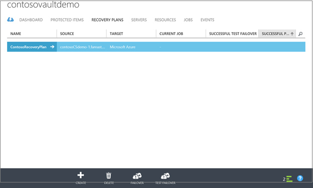

2. In **Confirm Test Failover** select **None** to indicate you don't want to use an Azure network for the test failover, or select the network to which the test VMs will be connected after failover. Click the check mark to start the failover.

	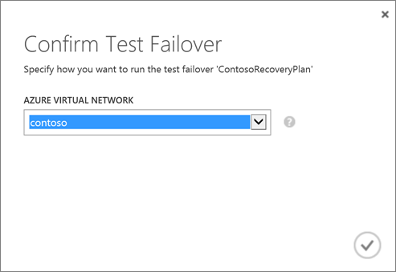

3. Monitor failover progress on the **Jobs** tab.

	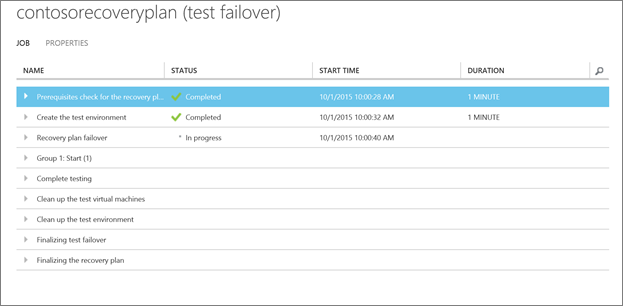

4. After the failover completes you should also be able to see the replica Azure machine appear in  Azure portal > **Virtual Machines**. If you want to initiate an RDP connection to the Azure VM you’ll need to open port 3389 on the VM endpoint.

5. After you’ve finished, when failover reaches the Complete testing phase, click Complete Test to finish. In Notes record and save any observations associated with the test failover.

6. Click **The test failover is complete** to automatically clean up the test environment. After this is done the test failover will show a **Complete** status. Any elements or VMs created automatically during the test failover are deleted. Note that if a test failover continues longer than two weeks it’s completed by force.

### Run an unplanned failover

Unplanned failover is initiated from Azure and can be performed even if the primary site isn't available.

1. In the **Recovery Plans** page select the plan and click **Failover** > **Unplanned Failover**.

	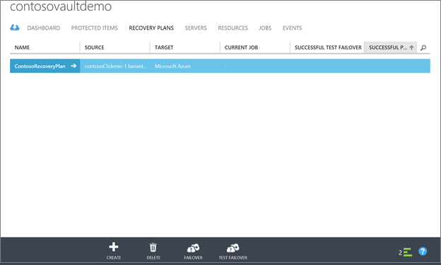

2. If you're replicating VMware virtual machines you can select to try and shut down on-premises VMs. This is best-effort and failover will continue whether the effort succeeds or not. If it doesn't succeed error details will appear on the **Jobs **tab > **Unplanned Failover Jobs**.

	

	>[AZURE.NOTE] This option isn't available if you're replicating physical servers. You'll need to try and shut those down manually if possible.

3. In **Confirm Failover** verify the failover direction (to Azure) and select the recovery point you want to use for the failover. If you enabled multi-VM when you configured replication properties you can recover to the latest application or crash-consistent recovery point. You can also select **Custom recovery point** to recover to an earlier point in time. Click the check mark to start the failover.

	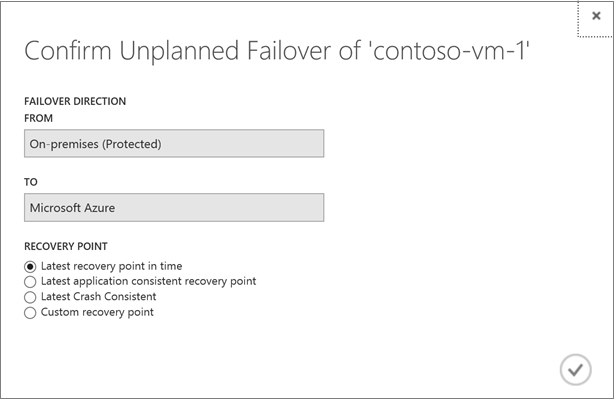

3. Wait for the unplanned failover job to complete. You can monitor failover progress on the **Jobs** tab. Note that even if errors occur during unplanned failover the recovery plan runs until it's complete. You should also be able to see the replica Azure machine appear in Virtual Machines in the Azure portal.

### Connect to replicated Azure virtual machines after failover

In order to connect to replicated virtual machines in Azure after failover here's what you'll need:

1. A Remote Desktop connection should be enabled on the primary machine.
2. The Windows Firewall on the primary machine to allow RDP.
3. After failover you'll need to add RDP to the public endpoint for Azure virtual machine.

[Read more](http://social.technet.microsoft.com/wiki/contents/articles/31666.troubleshooting-remote-desktop-connection-after-failover-using-asr.aspx) about setting this up.

## Deploy additional process servers

If you have to scale out your deployment beyond 200 source machines or your total daily churn rate exceeds 2 TB, you’ll need additional process servers to handle the traffic volume. To set up an additional process server check the requirements in [Additional process servers](#additional-process-servers) and then follow the instructions here to set up the process server. After setting up the server you can configure source machines to use it.

### Set up an additional process server

You set up an additional process server as follows:

- Run the unified wizard to configure a management server as a process server only.
- If you want to manage data replication using only the new process server you'll need to migrate your protected machines to do this.

### Install the process server

1. On the Quick Start page download the unified installation file for the Site Recovery component installation. Run setup.
2. In **Before you begin** select **Add additional process servers to scale out deployment**.

	

3. Complete the wizard in the same way you did when you [set up](#step-5-install-the-management-server) the first management server.

4. In **Configuration Server Details** specify the IP address of the original management server on which you installed the configuration server, and the passphrase. On the original management server run **<SiteRecoveryInstallationFolder>\home\sysystems\bin\genpassphrase.exe –n** to obtain the passphrase.

	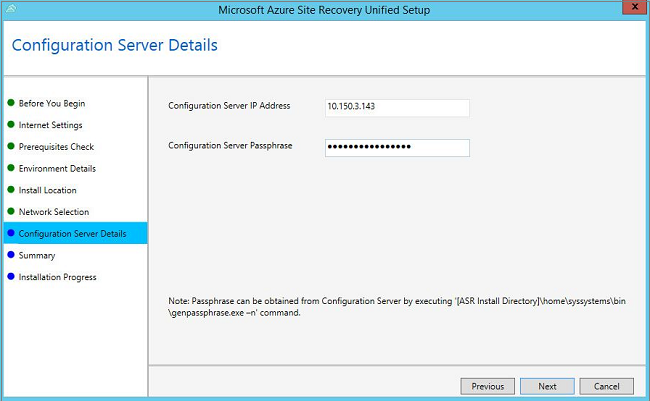

### Migrate machines to use the new process server

1. Open **Configuration Servers** > **Server** > name of the original management server > **Server Details**.

	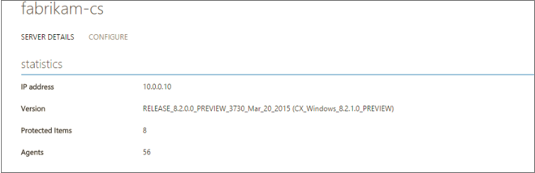

2. In the **Process Servers** list click **Change Process Server** next to the server you want to modify.

	

3. In **Change Process Server** > **Target Process Server** select the new management server, and then select the virtual machines that the new process server will handle. Click the information icon to get information about the server. The average space that's needed to replicate each selected virtual machine to the new process server is displayed to help you make load decisions. Click the check mark to start replicating to the new process server.

	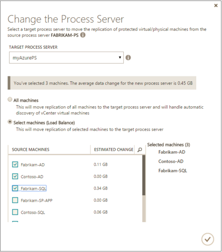

## VMware permissions for vCenter access

The process server can automatically discover VMs on a vCenter server. To perform automatic discovery you'll need to define a role (Azure_Site_Recovery) at the vCenter level to allow Site Recovery to access the vCenter server. Note that if you only need to migrate VMware machines to Azure and don't need to failback from Azure, you can define a read-only role that's sufficient. You set up the permissions as described in [Step 6: Set up credentials for the vCenter server](#step-6-set-up-credentials-for-the-vcenter-server) The role permissions are summarized in the following table.

**Role** | **Details** | **Permissions**
--- | --- | ---
Azure_Site_Recovery role | VMware VM discovery |Assign these privileges for the v-Center server:  Datastore->Allocate space, Browse datastore, Low level file operations., Remove file, Update virtual machine files  Network-> Network assign  Resource -> Assign virtual machine to resource pool, Migrate powered off virtual machine, Migrate powered on virtual machine  Tasks -> Create task, update task  Virtual machine ->  Configuration  Virtual machine -> Interact -> Answer question , Device connection., Configure CD media, Configure floppy media, Power off, Power on, VMware tools install  Virtual machine -> Inventory -> Create, Register, Unregister  Virtual machine -> Provisioning -> Allow virtual machine download, Allow virtual machine files upload  Virtual machine -> Snapshots -> Remove snapshots
vCenter user role | VMware VM discovery/Failover without shutdown of source VM | Assign these privileges for the v-Center server:  Data Center object –> Propagate to Child Object, role=Read-only   The user is assigned at datacenter level and thus has access to all the objects in the datacenter.  If you want to restrict the access, assign the **No access** role with the **Propagate to child** object to the child objects (ESX hosts, datastores, VMs and networks).
vCenter user role | Failover and failback | Assign these privileges for the v-Center server:  Datacenter object – Propagate to child object, role=Azure_Site_Recovery  The user is assigned at datacenter level and thus has access to all the objects in the datacenter.  If you want to restrict the access, assign  the **No access **role with  the **Propagate to child object** to the child object (ESX hosts, datastores, VMs and networks).  

## Third-party software notices and information

Do Not Translate or Localize

The software and firmware running in the Microsoft product or service is based on or incorporates material from the projects listed below (collectively, “Third Party Code”).  Microsoft is the not original author of the Third Party Code.  The original copyright notice and license, under which Microsoft received such Third Party Code, are set forth below.

The information in Section A is regarding Third Party Code components from the projects listed below. Such licenses and information are provided for informational purposes only.  This Third Party Code is being relicensed to you by Microsoft under Microsoft's software licensing terms for the Microsoft product or service.  

The information in Section B is regarding Third Party Code components that are being made available to you by Microsoft under the original licensing terms.

The complete file may be found on the [Microsoft Download Center](http://go.microsoft.com/fwlink/?LinkId=529428). Microsoft reserves all rights not expressly granted herein, whether by implication, estoppel or otherwise.

## Next steps

[Learn more about failback](site-recovery-failback-azure-to-vmware-classic.md) to bring your failed over machines running in Azure back to your on-premises environment.
