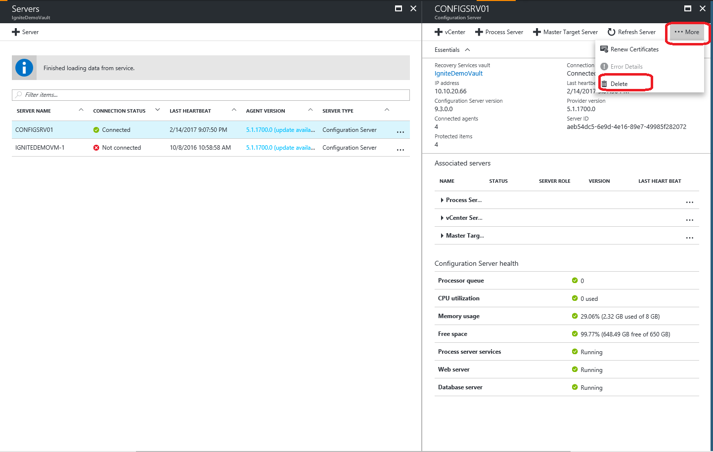

# Manage the configuration server

You set up an on-premises configuration server when you use the [Azure Site Recovery](site-recovery-overview.md) service for disaster recovery of VMware VMs and physical servers to Azure. The configuration server coordinates communications between on-premises VMware and Azure, and manages data replication. This article summarizes common tasks for managing the configuration server after it's been deployed.

## Modify VMware settings

Modify settings for the VMware server to which the configuration server connects.

1. Log onto the machine running the configuration server.
2. Launch Azure Site Recovery Configuration Manager from the desktop shortcut. Or, open **https://configuration-server-name/IP:44315**.
3. Click **Manage vCenter Server/vSPhere ESXi server**:
    - To associate a different VMware server with the configuration server, click **Add vCenter Server/vSphere ESXi server**, and specify the server details.
    - To update the credentials used to connect to the VMware server for automatic discovery of VMware VMs, click **Edit**. Specify the new credentials, and then click **OK**.

        

## Modify credentials for Mobility service installation

Modify the credentials used to automatically install the Mobility service on VMware VMs you enable for replication.

1. Log onto the machine running the configuration server.
2. Launch Azure Site Recovery Configuration Manager from the desktop shortcut. Or, open **https://configuration-server-name/IP:44315**.
3. Click **Manage virtual machine credentials**, and specify the new credentials. Then click **OK** to update the settings.

    

## Modify proxy settings

Modify the proxy settings used by the configuration server machine for internet access to Azure. If you have an additional process server machine, in addition to the default process server running on the configuration server machine, modify the settings on both machines.

1. Log onto the machine running the configuration server.
2. Launch Azure Site Recovery Configuration Manager from the desktop shortcut. Or, open **https://configuration-server-name/IP:44315**.
3. Click **Manage connectivity**, and update the proxy values. Then click **Save** to update the settings.

## Add a network adapter

The OVF template deploys the configuration server VM with a single network adapter. You can [add an additional adapter to the VM)](how-to-deploy-configuration-server.md#add-an-additional-adapter), but you need to do this before you register the configuration server in the vault.

If you need to add an adapter after you've registered the configuration server in the vault, you need to add the adapter in the VM properties, and then reregister the server in the vault.


## Reregister a configuration server in the same vault

You can reregister the configuration server in the same vault if you need to. f you have an additional process server machine, in addition to the default process server running on the configuration server machine, reregister both machines.

  1. In the vault, open **Manage** > **Site Recovery Infrastructure** > **Configuration Servers**.
  2. In **Servers**, click **Download registration key**. This downloads the vault credentials file.
  3. Log onto the configuration server machine.
  4. In **%ProgramData%\ASR\home\svagent\bin**, open **cspsconfigtool.exe**.
  5. On the **Vault Registration** tab, click browse and located the vault credentials file you downloaded.
  6. If needed, provide proxy server details. Then click **Register**.
  7. Open an Admin PowerShell command window, and run the following command:

      ```
      $pwd = ConvertTo-SecureString -String MyProxyUserPassword
      Set-OBMachineSetting -ProxyServer http://myproxyserver.domain.com -ProxyPort PortNumber – ProxyUserName domain\username -ProxyPassword $pwd
      net stop obengine
      net start obengine
      ```
## Upgrade the configuration server

You run update rollups to update the configuration server. Updates can be applied for up to N-4 versions. For example:

- If you're running 9.7, 9.8, 9.9, or 9.10 - you can upgrade directly to 9.11.
- If you're running 9.6 or earlier, and you want to upgrade to 9.11, you must first upgrade to version 9.7. before  9.11.

Links to update rollups for upgrading to all versions of the configuration server are available in the [wiki updates page](https://social.technet.microsoft.com/wiki/contents/articles/38544.azure-site-recovery-service-updates.aspx).

Upgrade the server as follows:

1. Download the update installer file to the configuration server.
2. Double-click to run the installer.
3. The installer detects the current version running on the machine.
4. Click **OK** to confirm, and run the upgrade. 


## Delete or unregister a configuration server

1. Disable [Disable protection](site-recovery-manage-registration-and-protection.md#disable-protection-for-a-vmware-vm-or-physical-server-vmware-to-azure) for all VMs under the configuration server.
2. [Disassociate](site-recovery-setup-replication-settings-vmware.md#dissociate-a-configuration-server-from-a-replication-policy) and [delete](site-recovery-setup-replication-settings-vmware.md#delete-a-replication-policy) all replication policies from the configuration server.
3. [Delete](site-recovery-vmware-to-azure-manage-vCenter.md#delete-a-vcenter-in-azure-site-recovery) all vCenters servers/vSphere hosts that are associated with the configuration server.
4. In vault, open **Site Recovery Infrastructure** > **Configuration Servers**
5. Click the configuration server that you want to remove. Then, on the **Details** page, click **Delete**.

    
   

### Delete with PowerShell

You can optionally delete the configuration server using PowerShell:

1. [Install](https://docs.microsoft.com/powershell/azure/install-azurerm-ps?view=azurermps-4.4.0) Azure PowerShell module
2. Log into to your Azure account using the command:
    
    `Login-AzureRmAccount`
3. Select the vault subscription:

     `Get-AzureRmSubscription –SubscriptionName <your subscription name> | Select-AzureRmSubscription`
3.  Set the vault context:
    
    ```
    $vault = Get-AzureRmRecoveryServicesVault -Name <name of your vault>
    Set-AzureRmSiteRecoveryVaultSettings -ARSVault $vault
    ```
4. Retrieve the configuration server:

    `$fabric = Get-AzureRmSiteRecoveryFabric -FriendlyName <name of your configuration server>`
6. Delete the configuration server:

    `Remove-AzureRmSiteRecoveryFabric -Fabric $fabric [-Force] `

> [!NOTE]
> You can use the **-Force** option in Remove-AzureRmSiteRecoveryFabric for forced deletion of the configuration server.
 


## Renew SSL certificates

The configuration server has an inbuilt web server, which orchestrates activities of the Mobility service, process servers, and master target servers connected to it. The web server uses an SSL certificate to authenticate clients. The certificate expires after three years, and can be renewed at any time.

### Check expiry

For configuration server deployments before May 2016, certificate expiry was set to one year. If you have a certificate is going to expire, the following occurs:

- When the expiry date is two months or less, the service starts sending notifications in the portal, and by email (if you subscribed to Azure Site Recovery notifications).
- A notification banner appears on the vault resource page. Click the banner for more details.
- If you see an **Upgrade Now** button, this indicates that there are some components in your environment that haven't been upgraded to 9.4.xxxx.x or higher versions. Upgrade components before you renew the certificate. You can't renew on older versions.

### Renew the certificate

1. In the vault, open **Site Recovery Infrastructure** > **Configuration Server**, and click the required configuration server.
2. The expiry date appears under **Configuration Server health**
3. Click **Renew Certificates**. 


## Next steps

Review the tutorials for setting up disaster recovery of [VMware VMs](tutorial-vmware-to-azure.md) and physical servers(tutorial-physical-to-azure.md) to Azure.
