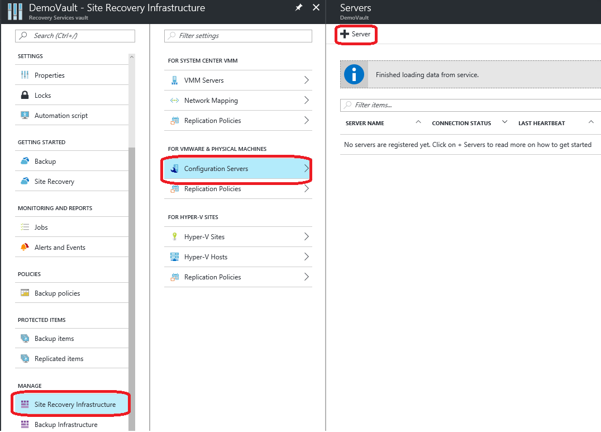
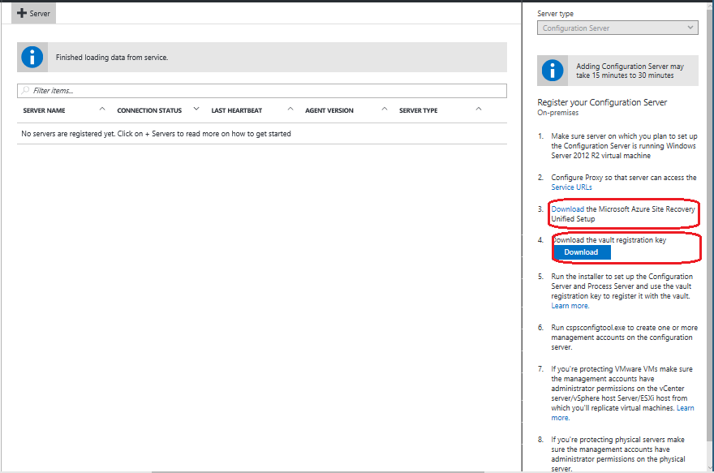
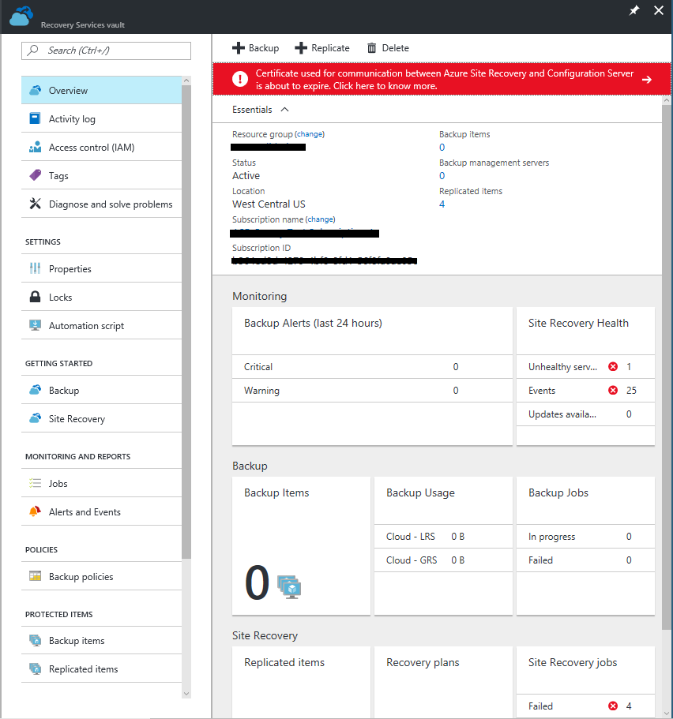
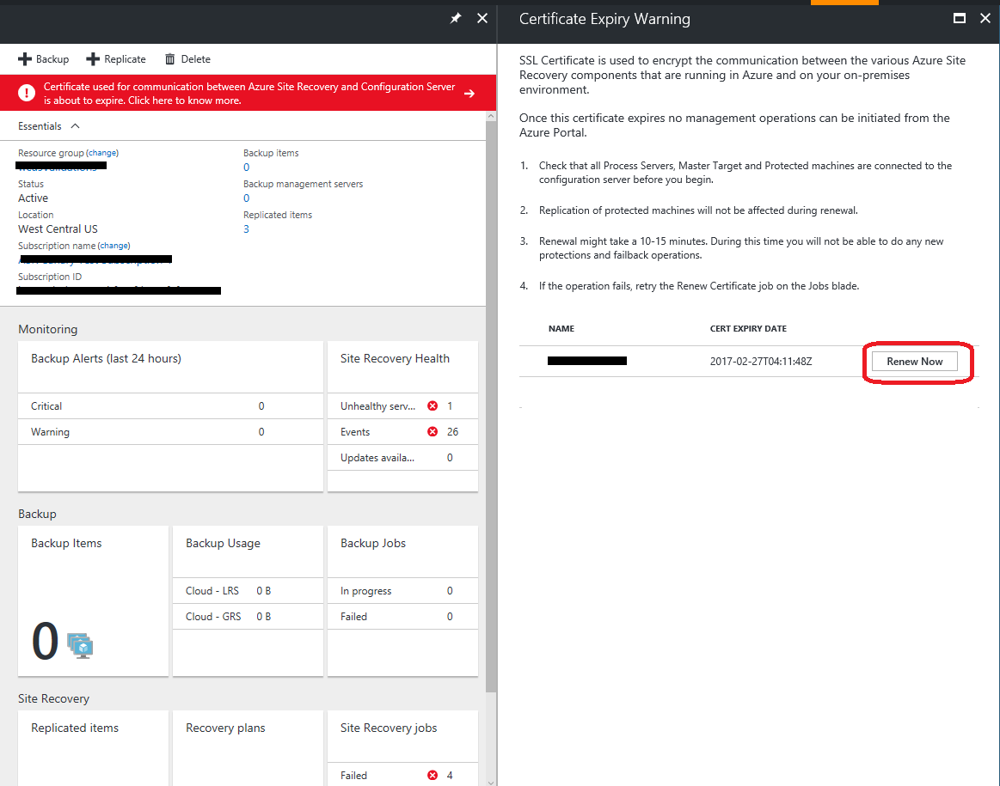

# Manage a Configuration Server

Configuration Server acts as a coordinator between the Site Recovery services and your on-premises infrastructure. This article describes how you can set up, configure, and manage the Configuration Server.

> [!NOTE]
> [Capacity planning](site-recovery-capacity-planner.md) is an important step to ensure that you deploy the Configuration Server with a configuration that suites your load requirements. Read more about [Sizing requirements for a Configuration Server](#sizing-requirements-for-a-configuration-server).


## Prerequisites
The following are the minimum hardware, software, and network configuration required to set up a Configuration Server.
> [!IMPORTANT]
> When deploying a Configuration Server for protecting VMware virtual machines, we recommend that you deploy it as a **Highly Available (HA)** virtual machine.

[!INCLUDE [site-recovery-configuration-server-requirements](../../includes/site-recovery-configuration-and-scaleout-process-server-requirements.md)]

## Downloading the Configuration Server software

1. Log on to the Azure portal and browse to your Recovery Services Vault.
2. Browse to **Site Recovery Infrastructure** > **Configuration Servers** (under For VMware & Physical Machines).

  
3. Click the **+Servers** button.
4. On the **Add Server** page, click the Download button to download the Registration key. You need this key during the Configuration Server installation to register it with Azure Site Recovery service.
5. Click the **Download the Microsoft Azure Site Recovery Unified Setup** link to download the latest version of the Configuration Server.

  

  > [!TIP]
  Latest version of the Configuration Server can be downloaded directly from [Microsoft Download Center download page](http://aka.ms/unifiedsetup)

## Installing and Registering a Configuration Server from GUI
[!INCLUDE [site-recovery-add-configuration-server](../../includes/site-recovery-add-configuration-server.md)]

## Installing and registering a Configuration Server using Command line

  ```
  UnifiedSetup.exe [/ServerMode <CS/PS>] [/InstallDrive <DriveLetter>] [/MySQLCredsFilePath <MySQL credentials file path>] [/VaultCredsFilePath <Vault credentials file path>] [/EnvType <VMWare/NonVMWare>] [/PSIP <IP address to be used for data transfer] [/CSIP <IP address of CS to be registered with>] [/PassphraseFilePath <Passphrase file path>]
  ```

### Sample usage
  ```
  MicrosoftAzureSiteRecoveryUnifiedSetup.exe /q /xC:\Temp\Extracted
  cd C:\Temp\Extracted
  UNIFIEDSETUP.EXE /AcceptThirdpartyEULA /servermode "CS" /InstallLocation "D:\" /MySQLCredsFilePath "C:\Temp\MySQLCredentialsfile.txt" /VaultCredsFilePath "C:\Temp\MyVault.vaultcredentials" /EnvType "VMWare"
  ```


### Configuration Server installer command-line arguments.
[!INCLUDE [site-recovery-unified-setup-parameters](../../includes/site-recovery-unified-installer-command-parameters.md)]


### Create a MySql credentials file
MySQLCredsFilePath parameter takes a file as input. Create the file using the following format and pass it as input MySQLCredsFilePath parameter.
```
[MySQLCredentials]
MySQLRootPassword = "Password>"
MySQLUserPassword = "Password"
```
### Create a proxy settings configuration file
ProxySettingsFilePath parameter takes a file as input. Create the file using the following format and pass it as input ProxySettingsFilePath parameter.

```
[ProxySettings]
ProxyAuthentication = "Yes/No"
Proxy IP = "IP Address"
ProxyPort = "Port"
ProxyUserName="UserName"
ProxyPassword="Password"
```
## Modifying proxy settings for Configuration Server
1. Log in to your Configuration Server.
2. Launch the cspsconfigtool.exe using the shortcut on your.
3. Click the **Vault Registration** tab.
4. Download a new Vault Registration file from the portal and provide it as input to the tool.

  
5. Provide the new Proxy Server details and click the **Register** button.
6. Open an Admin PowerShell command window.
7. Run the following command
  ```
  $pwd = ConvertTo-SecureString -String MyProxyUserPassword
  Set-OBMachineSetting -ProxyServer http://myproxyserver.domain.com -ProxyPort PortNumber – ProxyUserName domain\username -ProxyPassword $pwd
  net stop obengine
  net start obengine
  ```

  >[!WARNING]
  If you have Scale-out Process servers attached to this Configuration Server, you need to [fix the proxy settings on all the scale-out process servers](site-recovery-vmware-to-azure-manage-scaleout-process-server.md#modifying-proxy-settings-for-scale-out-process-server) in your deployment.

## Modify user accounts and passwords

The CSPSConfigTool.exe is used to manage the user accounts used for **Automatic discovery of VMware virtual machines** and to perform **Push install  of Mobility Service on protected machines. 

1. Log in to your Configuration server.
2. Launch the CSPSConfigtool.exe by clicking on the shortcut available on the desktop.
3. Click on the **Manage Accounts** tab.
4. Select the account for which the password needs to be modified and click on the **Edit** button.
5. Enter the new password and click **OK**


## Re-register a Configuration Server with the same Recovery Services Vault
  1. Log in to your Configuration Server.
  2. Launch the cspsconfigtool.exe using the shortcut on your desktop.
  3. Click the **Vault Registration** tab.
  4. Download a new Registration file from the portal and provide it as input to the tool.
        
  5. Provide the Proxy Server details and click the **Register** button.  
  6. Open an Admin PowerShell command window.
  7. Run the following command

      ```
      $pwd = ConvertTo-SecureString -String MyProxyUserPassword
      Set-OBMachineSetting -ProxyServer http://myproxyserver.domain.com -ProxyPort PortNumber – ProxyUserName domain\username -ProxyPassword $pwd
      net stop obengine
      net start obengine
      ```

  >[!WARNING]
  If you have Scale-out Process servers attached to this Configuration Server, you need to [re-register all the scale-out process servers](site-recovery-vmware-to-azure-manage-scaleout-process-server.md#re-registering-a-scale-out-process-server) in your deployment.

## Registering a Configuration Server with a different Recovery Services Vault.

> [!WARNING]
> The following step disassociates the Configuration from the current vault, and the replication of all protected virtual machines under the Configuration server is stopped.

1. Log in to your Configuration Server.
2. from an admin command prompt, run the command

    ```
    reg delete HKLM\Software\Microsoft\Azure Site Recovery\Registration
    net stop dra
    ```
3. Launch the cspsconfigtool.exe using the shortcut on your.
4. Click the **Vault Registration** tab.
5. Download a new Registration file from the portal and provide it as input to the tool.

    
6. Provide the Proxy Server details and click the **Register** button.  
7. Open an Admin PowerShell command window.
8. Run the following command
    ```
    $pwd = ConvertTo-SecureString -String MyProxyUserPassword
    Set-OBMachineSetting -ProxyServer http://myproxyserver.domain.com -ProxyPort PortNumber – ProxyUserName domain\username -ProxyPassword $pwd
    net stop obengine
    net start obengine
    ```

## Upgrading a Configuration Server

> [!WARNING]
> Updates are supported only up to the N-4th version. For example, if the latest version in the market is 9.11, then you can update from version 9.10, 9.9, 9.8, or 9.7 directly to 9.11. But if you are on any version less than or equal to 9.6 then you need to update to at least 9.7 before you can apply the latest updates on to your Configuration Server. Download links for previous version can be found under [Azure Site Recovery service updates](https://social.technet.microsoft.com/wiki/contents/articles/38544.azure-site-recovery-service-updates.aspx)

1. Download the update installer on your Configuration Server.
2. Launch the installer by double-clicking the installer.
3. The installer detects the version of the Site Recovery components present on the machine and prompt for a confirmation. 
4. Click on the OK button to provide the confirmation & continue with the upgrade.


## Delete or Unregister a Configuration Server

> [!WARNING]
> Ensure the following before you start decommissioning your Configuration Server.
> 1. [Disable protection](site-recovery-manage-registration-and-protection.md#disable-protection-for-a-vmware-vm-or-physical-server-vmware-to-azure) for all virtual machines under this Configuration Server.
> 2. [Disassociate](site-recovery-setup-replication-settings-vmware.md#dissociate-a-configuration-server-from-a-replication-policy) and [Delete](site-recovery-setup-replication-settings-vmware.md#delete-a-replication-policy) all Replication policies from the Configuration Server.
> 3. [Delete](site-recovery-vmware-to-azure-manage-vCenter.md#delete-a-vcenter-in-azure-site-recovery) all vCenters servers/vSphere hosts that are associated to the Configuration Server.


### Delete the Configuration Server from Azure portal
1. In Azure portal, browse to **Site Recovery Infrastructure** > **Configuration Servers** from the Vault menu.
2. Click the Configuration Server that you want to decommission.
3. On the Configuration Server's details page, click the Delete button.

  
4. Click **Yes** to confirm the deletion of the server.

### Uninstall the Configuration Server software and its dependencies
  > [!TIP]
  If you plan to reuse the Configuration Server with Azure Site Recovery again, then you can skip to step 4 directly

1. Log on to the Configuration Server as an Administrator.
2. Open up Control Panel > Program > Uninstall Programs
3. Uninstall the programs in the following sequence:
  * Microsoft Azure Recovery Services Agent
  * Microsoft Azure Site Recovery Mobility Service/Master Target server
  * Microsoft Azure Site Recovery Provider
  * Microsoft Azure Site Recovery Configuration Server/Process Server
  * Microsoft Azure Site Recovery Configuration Server Dependencies
  * MySQL Server 5.5
4. Run the following command from and admin command prompt.
  ```
  reg delete HKLM\Software\Microsoft\Azure Site Recovery\Registration
  ```

## Delete or Unregister a Configuration Server (PowerShell)

1. [Install](https://docs.microsoft.com/powershell/azure/install-azurerm-ps?view=azurermps-4.4.0) Azure PowerShell module
2. Login into to your Azure account using the command
    
    `Login-AzureRmAccount`
3. Select the subscription under which the vault is present

     `Get-AzureRmSubscription –SubscriptionName <your subscription name> | Select-AzureRmSubscription`
3.  Now set up your vault context
    
    ```
    $vault = Get-AzureRmRecoveryServicesVault -Name <name of your vault>
    Set-AzureRmSiteRecoveryVaultSettings -ARSVault $vault
    ```
4. Get select your configuration server

    `$fabric = Get-AzureRmSiteRecoveryFabric -FriendlyName <name of your configuration server>`
6. Delete the Configuration Server

    `Remove-AzureRmSiteRecoveryFabric -Fabric $fabric [-Force] `

> [!NOTE]
> The **-Force** option in the Remove-AzureRmSiteRecoveryFabric can be used to force the removal/deletion of the Configuration server.

## Renew Configuration Server Secure Socket Layer(SSL) Certificates
The Configuration Server has an inbuilt webserver, which orchestrates the activities of the Mobility Service, Process Servers, and Master Target servers connected to the Configuration Server. The Configuration Server's webserver uses an SSL certificate to authenticate its clients. This certificate has an expiry of three years and can be renewed at any time using the following method:

> [!WARNING]
Certificate expiry can be performed only on version 9.4.XXXX.X or higher. Upgrade all the Azure Site Recovery components (Configuration Server, Process Server, Master Target Server, Mobility Service) before you start the Renew Certificates workflow.

1. On the Azure portal, browse to your Vault > Site Recovery Infrastructure > Configuration Server.
2. Click the Configuration Server for which you need to renew the SSL Certificate for.
3. Under the Configuration Server health, you can see the expiry date for the SSL Certificate.
4. Renew the certificate by clicking the **Renew Certificates** action as shown in the following image:

  

### Secure Socket Layer certificate expiry warning

> [!NOTE]
The SSL Certificate's validity for all installations that happened before May 2016 was set to one year. you have started seeing certificate expiry notifications showing up in the Azure portal.

1. If the Configuration Server's SSL certificate is going to expire in the next two months, the service starts notifying users via the Azure portal & email (you need to be subscribed to Azure Site Recovery notifications). You start seeing a notification banner on the Vault's resource page.

  
2. Click the banner to get additional details on the Certificate expiry.

  

  >[!TIP]
  If instead of a **Renew Now** button you see an **Upgrade Now** button. The Upgrade Now button indicates that there are some components in your environment that have not yet been upgraded to 9.4.xxxx.x or higher versions.

## Revive a Configuration server if the Secure Socket Layer (SSL) certificate expired

1. Update your Configuration Server to the [latest version](http://aka.ms/unifiedinstaller)
2. If you have any Scale-out Process servers, Failback Master Target servers, Failback Process Servers update them to the latest version
3. Update the Mobility Service on all the protected virtual machines to the latest version.
4. Log in to the Configuration server and open a command prompt with administrator privileges.
5. Browse to the folder %ProgramData%\ASR\home\svsystems\bin
6. Run RenewCerts.exe to renew the SSL certificate on the Configuration Server.
7. If the process succeeds, you should see the message "Certificate  renewal is Success"


## Sizing requirements for a Configuration Server

| **CPU** | **Memory** | **Cache disk size** | **Data change rate** | **Protected machines** |
| --- | --- | --- | --- | --- |
| 8 vCPUs (2 sockets * 4 cores @ 2.5 GHz) |16 GB |300 GB |500 GB or less |Replicate fewer than 100 machines. |
| 12 vCPUs (2 sockets * 6 cores @ 2.5 GHz) |18 GB |600 GB |500 GB to 1 TB |Replicate between 100-150 machines. |
| 16 vCPUs (2 sockets * 8 cores @ 2.5 GHz) |32 GB |1 TB |1 TB to 2 TB |Replicate between 150-200 machines. |

  >[!TIP]
  If your daily data churn exceeds 2 TB, or you plan to replicate more than 200 virtual machines, it is recommended to deploy additional process servers to load balance the replication traffic. Learn more about How to deploy Scale-out Process severs.


## Common issues
[!INCLUDE [site-recovery-vmware-to-azure-install-register-issues](../../includes/site-recovery-vmware-to-azure-install-register-issues.md)]
