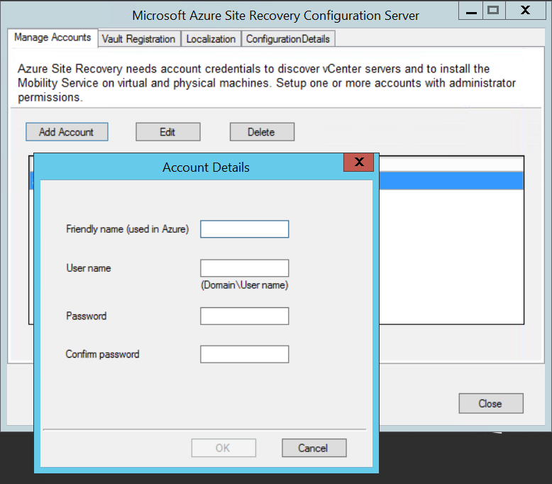
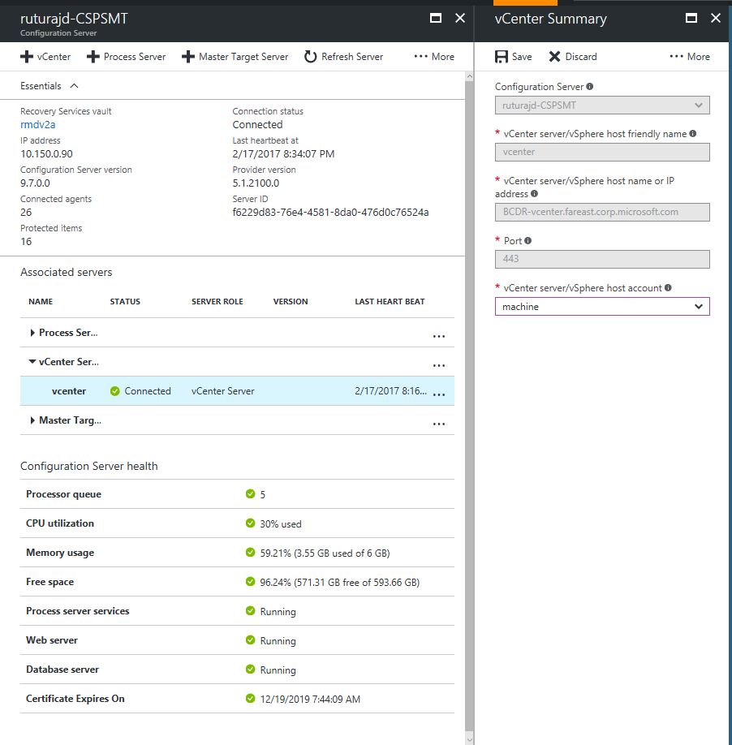
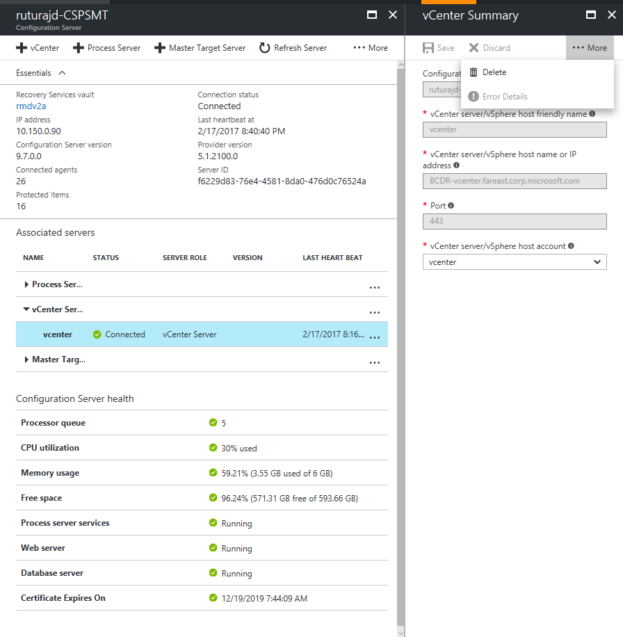

# Manage VMware vCenter Server in Azure Site Recovery
This article discusses the various Site Recovery operations that can be performed on a VMware vCenter.

## Prerequisites

**Support VMware vCenter and VMware vSphere ESX Host** | **Details**
--- | ---
**On-premises VMware servers** | One or more VMware vSphere servers, running 6.0, 5.5, 5.1 with latest updates. Servers should be located in the same network as the configuration server (or separate process server).   We recommend a vCenter server to manage hosts, running 6.0 or 5.5 with the latest updates. Only features that are available in 5.5 are supported when you deploy version 6.0.

## Prepare an account for automatic discovery
Site Recovery needs access to VMware for the process server to automatically discover virtual machines, and for failover and failback of virtual machines.

* **Migrate**: If you only want to migrate VMware virtual machines to Azure, without ever failing them back, you can use a VMware account with a read-only role. Such a role can run failover, but can't shut down protected source machines. This is not necessary for migration.
* **Replicate/Recover**: If you want to deploy full replication (replicate, failover, failback) the account must be able to run operations such as creating and removing disks, powering on virtual machine.
* **Automatic discovery**: At least a read-only account is required.

|**Tasks** | **Required account/role** | **Permissions** | **Details**|
|--- | --- | --- | ---|
|**Process server automatically discovers VMware virtual machines** | You need at least a read-only user | Data Center object –> Propagate to Child Object, role=Read-only | User assigned at datacenter level, and has access to all the objects in the datacenter.   To restrict access, assign the **No access** role with the **Propagate to child** object, to the child objects (vSphere hosts, datastores, virtual machines, and networks).|
|**Failover** | You need at least a read-only user | Data Center object –> Propagate to Child Object, role=Read-only | User assigned at datacenter level, and has access to all the objects in the datacenter.   To restrict access, assign the **No access** role with the **Propagate to child** object to the child objects (vSphere hosts, datastores, virtual machines, and networks).   Useful for migration purposes, but not full replication, failover, failback.|
|**Failover and failback** | We suggest you create a role (AzureSiteRecoveryRole) with the required permissions, and then assign the role to a VMware user or group | Data Center object –> Propagate to Child Object, role=AzureSiteRecoveryRole   Datastore -> Allocate space, browse datastore, low-level file operations, remove file, update virtual machine files   Network -> Network assign   Resource -> Assign VM to resource pool, migrate powered off VM, migrate powered on VM   Tasks -> Create task, update task   Virtual machine -> Configuration   Virtual machine -> Interact -> answer question, device connection, configure CD media, configure floppy media, power off, power on, VMware tools install   Virtual machine -> Inventory -> Create, register, unregister   Virtual machine -> Provisioning -> Allow virtual machine download, allow virtual machine files upload   Virtual machine -> Snapshots -> Remove snapshots | User assigned at datacenter level, and has access to all the objects in the datacenter.   To restrict access, assign the **No access** role with the **Propagate to child** object, to the child objects (vSphere hosts, datastores, virtual machines, and networks).|

## Create an account to connect to VMware vCenter Server/ VMware vSphere EXSi host
1. Login into the Configuration server and launch the cspsconfigtool.exe using the shortcut placed on the Desktop.
2. Click **Add Account** on the **Manage Account** tab.

  
3. Provide the account details and click OK to add the account. The account should have the privileges listed in the [Prepare an account for automatic discovery](#prepare-an-account-for-automatic-discovery) section.

  >[!NOTE]
  It takes about 15 minutes for the account information to be synced up with the Site Recovery service.

## Associate a VMware vCenter/ VMware vSphere ESX host (Add vCenter)
* On the Azure portal, browse to *YourRecoveryServicesVault* > **Site Recovery Infrastructure** > **Configuration Severs** > *ConfigurationServer*
* In the Configuration server's details page click the +vCenter button.

[!INCLUDE [site-recovery-add-vcenter](../../includes/site-recovery-add-vcenter.md)]

## Modify credentials used to connect to the vCenter server/ vSphere ESXi host

1. Login into the Configuration server and launch the cspsconfigtool.exe
2. Click **Add Account** on the **Manage Account** tab.

  
3. Provide the new account details and click OK to add the account. The account should have the privileges listed in the [Prepare an account for automatic discovery](#prepare-an-account-for-automatic-discovery) section.
4. On the Azure portal, browse to *YourRecoveryServicesVault* > **Site Recovery Infrastructure** > **Configuration Severs** > *ConfigurationServer*
5. In the Configuration server's details page click the **Refresh Server** button.
6. Once the refresh server job completes, select the vCenter Server to open the vCenter Summary page.
7. Select the newly added account in the **vCenter server/vSphere host account** field and click the **Save** button.

  

## Delete a vCenter in Azure Site Recovery
1. On the Azure portal, browse to *YourRecoveryServicesVault* > **Site Recovery Infrastructure** > **Configuration Severs** > *ConfigurationServer*
2. In the Configuration server's details page select the vCenter Server to open the vCenter Summary page.
3. Click on the **Delete** button to delete the vCenter

  

> [!NOTE]
If you need to modify the vCenters IP Address/FQDN, Port details then you need to delete the vCenter Server and add it back again.
