# Troubleshoot Mobility Service push installation issues

This article describes common problems you might face when you try to install the Azure Site Recovery Mobility Service on the source server to enable protection.

## (Error code 95107) Protection could not be enabled
**Error code** | **Possible causes** | **Error-specific recommendations**
--- | --- | ---
95107  **Message:** Push installation of the Mobility Service to the source machine failed with error code **EP0858**.   Either the credentials provided to install the Mobility Service are incorrect or the user account has insufficient privileges. | User credentials provided to install the Mobility Service on the source machine are incorrect. | Ensure the user credentials provided for the source machine on the configuration server are correct.   To add/edit user credentials, go to the configuration server, and select **Cspsconfigtool** > **Manage account**.   In addition, check the following prerequisites to successfully finish the push installation.

## (Error code 95015) Protection could not be enabled
**Error code** | **Possible causes** | **Error-specific recommendations**
--- | --- | ---
95105  **Message:** Push installation of the Mobility Service to the source machine failed with error code **EP0856**.   Either **File and Printer Sharing** isn't allowed on the source machine or there are network connectivity problems between the process server and the source machine.| **File and Printer Sharing** isn't enabled. | Allow **File and Printer Sharing** on the source machine in Windows Firewall. On the source machine, under **Windows Firewall** > **Allow an app or feature through Firewall**, select **File and Printer Sharing for all profiles**.   In addition, check the following prerequisites to successfully finish the push installation.

## (Error code 95117) Protection could not be enabled
**Error code** | **Possible causes** | **Error-specific recommendations**
--- | --- | ---
95117  **Message:** Push installation of the Mobility Service to the source machine failed with error code **EP0865**.   Either the source machine isn't running or there are network connectivity problems between the process server and the source machine. | Network connectivity problems between the process server and the source server. | Check connectivity between the process server and the source server.   In addition, check the following prerequisites to successfully finish the push installation.

## (Error code 95103) Protection could not be enabled
**Error code** | **Possible causes** | **Error-specific recommendations**
--- | --- | ---
95103  **Message:** Push installation of the Mobility Service to the source machine failed with error code **EP0854**.   Either Windows Management Instrumentation (WMI) isn't allowed on the source machine or there are network connectivity problems between the process server and the source machine.| WMI is blocked in Windows Firewall. | Allow WMI in Windows Firewall. Under **Windows Firewall** > **Allow an app or feature through Firewall**, select **WMI for all profiles**.   In addition, check the following prerequisites to successfully finish the push installation.

## Check push installation logs for errors

On the configuration/process server, go to the file PushinstallService located at <Microsoft Azure Site Recovery Install Location>\home\svsystems\pushinstallsvc\ to understand the source of the problem. Use the following troubleshooting steps to resolve the problem. 

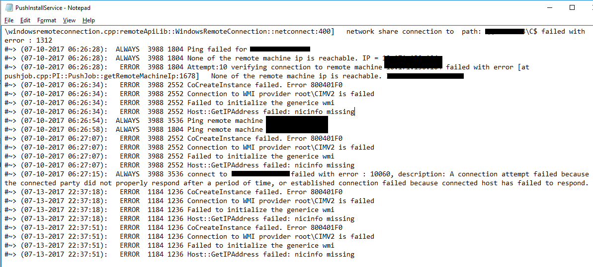

## Push installation prerequisites for Windows
### Ensure that **File and Printer Sharing** is enabled
Allow **File and Printer Sharing** and **Windows Management Instrumentation** on the source machine in Windows Firewall.  
#### If the source machine is domain joined  
Configure firewall settings by using the Group Policy Management Console.

1. Sign in to the Azure Active Directory domain machine as an administrator. Open the Group Policy Management Console (GPMC.MSC, run from **Start** > **Run**). 

2. If the Group Policy Management Console isn't installed, see [Install the Group Policy Management Console](https://technet.microsoft.com/library/cc725932.aspx).  

3. In the Group Policy Management Console tree, double-click **Group Policy Objects** in the forest and domain. Go to **Default Domain Policy**.  

    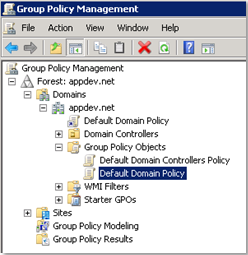  
 
4. Right-click **Default Domain Policy** > **Edit**. A new **Group Policy Management Editor** window opens.  

    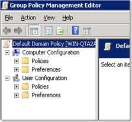  
 
5. In the **Group Policy Management Editor**, go to **Computer Configuration** > **Policies** > **Administrative Templates** > **Network** > **Network Connections** > **Windows Firewall**.  

    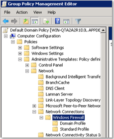  
 
6. Enable the following settings for **Domain Profile** and **Standard Profile**:  

    a. Double-click **Windows Firewall: Allow inbound file and printer sharing exception**. Select **Enabled**, and select **OK**.  

    b. Double-click **Windows Firewall: Allow inbound remote administration exception**. Select **Enabled**, and select **OK**.  

    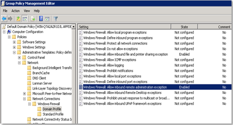  
 

#### If the source machine isn't domain joined and part of a workgroup  
Configure firewall settings on a remote machine (for a workgroup).

1. Go to the source machine. 

2. Under **Windows Firewall** > **Allow an app or feature through Firewall**, select **File and Printer Sharing** for all profiles.  

3. Under **Windows Firewall** > **Allow an app or feature through Firewall**, select **WMI** for all profiles.  

#### Disable remote User Account Control
Disable User Account Control by using the registry key to push the Mobility Service.

1. Select **Start** > **Run**, type *regedit*, and select **Enter**.

2. Locate and then select the following registry subkey: HKEY_LOCAL_MACHINE\SOFTWARE\Microsoft\Windows\CurrentVersion\Policies\System

3. If the LocalAccountTokenFilterPolicy registry entry doesn't exist, follow these steps:

    a. On the **Edit** menu, select **New**, and then select **DWORD Value**.

    b. Type *LocalAccountTokenFilterPolicy*, and then select **Enter**.

    c. Right-click **LocalAccountTokenFilterPolicy**, and then select **Modify**.

    d. In the **Value** data box, type *1*, and then select **OK**.

4. Close the Registry Editor.

## Push installation prerequisites for Linux

1. Create a root user on the source Linux server. (Use this account only for the push installation and updates.) 

2. Check that the /etc/hosts file on the source Linux server has entries that map the local hostname to IP addresses associated with all network adapters.  

3. Make sure the latest openssh, openssh-server, and openssl packages are installed on the source Linux server. Check if ssh port 22 is enabled and running.  

4. Check if stale entries of agents are already present on the source server, uninstall the older agents, and reboot the server. Reinstall the agent.  

#### Enable SFTP subsystem and password authentication in the sshd_config file
1. On the source server, sign in as root.  

2. In the /etc/ssh/sshd_config file, find the line that begins with "PasswordAuthentication."  

3. Uncomment the line, and change the value from "no" to "yes."  

    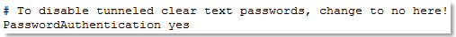

4. Find the line that begins with "Subsystem," and uncomment the line.  

    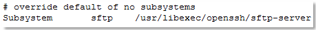

5. Save the changes, and restart the sshd service.  

## Push installation checks on the configuration/process server
#### Validate credentials for discovery and installation

1. From the configuration server, start Cspsconfigtool. 

      

2. Make sure that the account used for protection has administrator rights on the source machine.  

#### Check connectivity between the process server and the source server
1. Ensure that the process server has internet connection.

2. Verify the WMI connection by using wbemtest.exe.  

    a. On the process server, select **Start** > **Run** > **wbemtest.exe**. The **Windows Management Instrumentation Tester** window opens as shown: 

      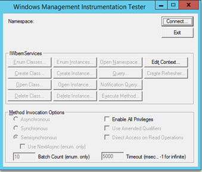  
    
    b. Select **Connect**, and enter the source server IP in the **Namespace**.

    c. Enter the **User** name and **Password**. (If the source machine is domain joined, provide the domain name along with the user name as *domainName\username*. If the source machine is in a workgroup, provide only the user name.)

    d. Select the **Authentication** level as **Packet privacy**.  

      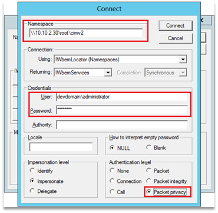  
    
    e. Select **Connect**. Now the WMI connection displays the provided data, and the **Windows Management Instrumentation Tester** window displays as shown:  

      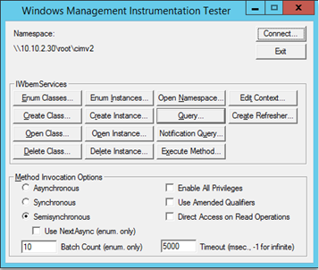  
    
      If the WMI connection isn't successful, an error message appears. The following screenshot shows an unsuccessful attempt if **WMI/Remote Administration** isn't enabled in the app allowed by Windows Firewall:  

    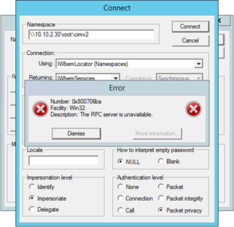  
    

3. Check for the WMI status and connectivity. 

    a. On the configuration/process server, select **Start** > **Run** > **wmimgmt.msc** > **Actions** > **More Actions** > **Connect to another computer (source machine)**.  

    b. Enter the credentials of the account used for protection, and check if connectivity is fine.  

#### Verify that network shared folders of the source machine are accessible from the process server remotely by using specified credentials

  1. Sign in to the process server machine, and open File Explorer. In the address bar, type *"\\\source-machine-ip\C$"*. Select **Enter**.  

      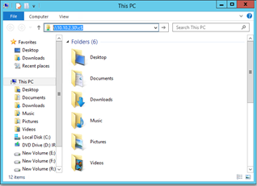  

  2. File Explorer prompts you for credentials. Enter the user name and password, and select **OK**. 

      * If the source machine is domain joined, enter the domain name along with the user name as *domainName\username*. 

      * If the source machine is in a workgroup, enter only the user name.  

      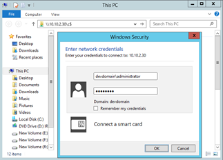  

  3. If the connection is successful, you can view the folders of the source machine remotely from the process server.  

      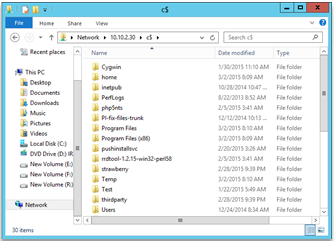  

> [!NOTE] 
> If the connection is unsuccessful, check whether all prerequisites are met.
>

If you don’t want to open **Windows Management Instrumentation**, you can also install the Mobility Service manually on the source machine.  

For more information, see [Install the Mobility Service manually through GUI](site-recovery-vmware-to-azure-install-mob-svc.md#install-mobility-service-manually-by-using-the-gui) and 
[Installation through configuration manager guidance](site-recovery-install-mobility-service-using-sccm.md).  

## Next steps
- [Enable replication for VMware virtual machines](vmware-walkthrough-enable-replication.md)
