<properties
	pageTitle="Replicate VMware virtual machines and physical servers to Azure with Azure Site Recovery in the Azure portal | Microsoft Azure"
	description="Describes how to deploy Azure Site Recovery to orchestrate replication, failover and recovery of on-premises VMware virtual machines and Windows/Linux physical servers to Azure using the Azure portal"
	services="site-recovery"
	documentationCenter=""
	authors="rayne-wiselman"
	manager="jwhit"
	editor=""/>

<tags
	ms.service="site-recovery"
	ms.workload="backup-recovery"
	ms.tgt_pltfrm="na"
	ms.devlang="na"
	ms.topic="article"
	ms.date="05/09/2016"
	ms.author="raynew"/>

# Replicate VMware virtual machines and physical machines to Azure with Azure Site Recovery using the Azure portal

> [AZURE.SELECTOR]
- [Azure Portal](site-recovery-vmware-to-azure.md)
- [Azure Classic](site-recovery-vmware-to-azure-classic.md)
- [Azure Classic (legacy)](site-recovery-vmware-to-azure-classic-legacy.md)

Welcome to Azure Site Recovery! Use this article if you want to replicate on-premises VMware virtual machines or Windows/Linux physical servers to Azure using Azure Site Recovery in the Azure portal.

> [AZURE.NOTE] Azure has two different [deployment models](../resource-manager-deployment-model.md) for creating and working with resources: Azure Resource Manager (ARM) and classic. Azure also has two portals – the Azure classic portal that supports the classic deployment model, and the Azure portal with support for both deployment models.

Site Recovery in the Azure portal provides a number of new features:

- The Azure Backup and Azure Site Recovery services are combined into a single Recovery Services vault so that you can set up and manage business continuity and disaster recovery (BCDR) from a single location. In the unified dashboard you can monitor and manage operations across your on-premises sites and the Azure public cloud.
- Users with Azure subscriptions provisioned with the Cloud Solution Provider (CSP) program can now manage Site Recovery operations in the Azure portal.
- Site Recovery in the Azure portal can replicate machines to ARM storage accounts. At failover, Site Recovery creates ARM-based VMs in Azure.
- Site Recovery continues to support replication to classic storage accounts. At failover, Site Recovery creates VMs using the classic model.

After reading this article post any comments at the bottom in the Disqus comments. Ask technical questions on the [Azure Recovery Services Forum](https://social.msdn.microsoft.com/forums/azure/home?forum=hypervrecovmgr).

## Overview

Organizations need a BCDR strategy that determines how apps, workloads, and data stay running and available during planned and unplanned downtime, and recover to normal working conditions as soon as possible. Your BCDR strategy should keep business data safe and recoverable, and ensure that workloads remain continuously available when disaster occurs.

Site Recovery is an Azure service that contributes to your BCDR strategy by orchestrating replication of on-premises physical servers and virtual machines to the cloud (Azure) or to a secondary datacenter. When outages occur in your primary location, you fail over to the secondary location to keep apps and workloads available. You fail back to your primary location when it returns to normal operations. Learn more in [What is Azure Site Recovery?](site-recovery-overview.md)

This article provides all the information you need to replicate on-premises VMware VMs and Windows/Linux physical servers to Azure. It includes an architectural overview, planning information, and deployment steps for configuring Azure, on-premises servers, replication settings, and capacity planning. After you've set up the infrastructure you can enable replication on machines you want to protect, and check that failover works.

## Business advantages

- Site Recovery provides off-site protection for business workloads and applications running on VMware VMs and physical servers.
- The Recovery Services portal provides a single location to set up, manage, and monitor replication, failover, and recovery.
- Site Recovery can automatically discover VMware VMs added to vSphere hosts.
- You can easily run failovers from your on-premises infrastructure to Azure, and failback (restore) from Azure to VMware VM servers in your on-premises site.
- You can enable multi-VM and create replication groups so that application workloads tiered across multiple machines replicate at the same time. All the machines in a replication group have crash-consistent and app-consistent recovery points when they fail over. For failover, you can gather multiple machines in recovery plans so that tiered application workloads fail over together.

## Scenario architecture

These are the scenario components:

- **Configuration server**: An on-premises machine that coordinates communication and manages data replication and recovery processes. On this machine you'll run a single setup file to install the configuration server and these additional components:
	- **Process server**: Acts as a replication gateway. It receives replication data from protected source machines, optimizes it with caching, compression, and encryption, and sends it to Azure storage. It also handles push installation of the Mobility service to protected machines, and performs automatic discovery of VMware VMs. The default process server is installed on the configuration server. You can deploy additional standalone process servers to scale your deployment.
	- **Master target server**: Handles replication data during failback from Azure.

- **Mobility service**: This component is deployed on every machine (VMware VM or physical server) that you want to replicate to Azure. It captures data writes on the machine and forwards them to the process server.
- **Azure**: You don't need to create any Azure VMs to handle replication and failover to Azure.  You do need an Azure subscription, an Azure storage account to store replicated data, and an Azure virtual network so that Azure VMs are connected to a network after failover. The storage account and network must be in the same region as the Recovery Services vault.
- **Failback**: When you're ready to fail back from Azure to your on-premises site after a failover, you’ll need to create an Azure VM as a temporary process server. You can delete it after failback is complete. For failback, you'll also need a VPN (or Azure ExpressRoute) connection between your on-premises site and the Azure network in which your Azure VMs are located. If failback traffic is heavy you might also need to set up a dedicated master target server machine on-premises. For lighter traffic the default master target server running on the configuration server can be used.

The graphic shows how these components interact.

**Figure 1: VMware/physical to Azure** 

## Azure prerequisites

Here's what you'll need in Azure to deploy this scenario.

**Prerequisite** | **Details**
--- | ---
**Azure account**| You'll need a [Microsoft Azure](http://azure.microsoft.com/) account. You can start with a [free trial](https://azure.microsoft.com/pricing/free-trial/). [Learn more](https://azure.microsoft.com/pricing/details/site-recovery/) about Site Recovery pricing.
**Azure storage** | Replicated data is stored in Azure storage and Azure VMs are created when failover occurs.   To store data you'll need a standard or premium storage account in the same region as the Recovery Services vault.  You can use an LRS or GRS storage account. We recommend GRS so that data is resilient if a regional outage occurs, or if the primary region can't be recovered. [Learn more](../storage/storage-redundancy.md).   [Premium storage](../storage/storage-premium-storage.md) is typically used for virtual machines that need a consistently high IO performance and low latency to host IO intensive workloads.   If you want to use a premium account to store replicated data, you'll also need a standard storage account to store replication logs that capture ongoing changes to on-premises data.   Note that storage accounts created in the Azure portal can't be moved across resource groups.   [Read about](../storage/storage-introduction.md) Azure storage.

> [AZURE.NOTE] Protection to premium storage accounts in Central India and South India is currently not supported.
**Azure network** | You'll need an Azure virtual network that Azure VMs will connect to when failover occurs. The Azure virtual network must be in the same region as the Recovery Services vault.
**Failback from Azure** | You’ll need a temporary process server set up as an Azure VM. You can create this when you’re ready to fail back and delete it after fail back is complete.   To fail back you’ll need a VPN connection (or Azure ExpressRoute) from the Azure network to the on-premises site.

## Configuration server prerequisites

You'll set up an on-premises machine as the configuration server.

**Prerequisite** | **Details**
--- | ---
**Configuration server**| You need an on-premises physical or virtual machine running Windows Server 2012 R2. All of the on-premises Site Recovery components are installed on this machine.  For VMware VM replication, we recommend you deploy the server as a highly available VMware VM. If you're replicating physical machines then the machine can be a physical server.   Failback to the on-premises site from Azure is always to VMware VMs regardless of whether you failed over VMs or physical servers. If you don't deploy the configuration server as a VMware VM you'll need to set up a separate master target server as a VMware VM to receive failback traffic.  If the server is a VMware VM, the network adapter type should be VMXNET3. If you use a different type of network adapter you'll need to install a [VMware update](https://kb.vmware.com/selfservice/microsites/search.do?cmd=displayKC&docType=kc&externalId=2110245&sliceId=1&docTypeID=DT_KB_1_1&dialogID=26228401&stateId=1) on the vSphere 5.5 server.  The server should have a static IP address.  The server should not be a Domain Controller.  The host name of the server should be 15 characters or less.  The operating system should be English only.   You’ll need to install VMware vSphere PowerCLI 6.0. on the configuration server.  The configuration server needs internet access. Outbound access is required as follows:  Temporary access on HTTP 80 during setup of the Site Recovery components (to download MySQL)  Ongoing outbound access on HTTPS 443 for replication management  Ongoing outbound access on HTTPS 9443 for replication traffic (this port can be modified)  The server will also need access to the following URLs so that it can connect to Azure: *.hypervrecoverymanager.windowsazure.com; *.accesscontrol.windows.net; *.backup.windowsazure.com; *.blob.core.windows.net; *.store.core.windows.net  If you have IP address-based firewall rules on the server, check that the rules allow communication to Azure. You'll need to allow the [Azure Datacenter IP Ranges](https://www.microsoft.com/download/confirmation.aspx?id=41653) and the HTTPS (443) protocol.  Allow IP address ranges for the Azure region of your subscription, and for West US.  Allow this URL for the MySQL download: .http://cdn.mysql.com/archives/mysql-5.5/mysql-5.5.37-win32.msi

## VMware vCenter/vSphere host prerequisites

**Prerequisite** | **Details**
--- | ---
**vSphere**| You need one or more VMware vSphere hypervisors.  Hypervisors should be running vSphere version 6.0, 5.5 or 5.1 with the latest updates.  We recommend that your vSphere hosts and vCenter servers are located in the same network as the process server (this will be the network in which the configuration server is located unless you’ve set up a dedicated process server).
**vCenter** | We recommend that you deploy a VMware vCenter server to manage your vSphere hosts. It should be running vCenter version 6.0 or 5.5 with the latest updates.  Note that Site Recovery doesn't support new vCenter and vSphere 6.0 features such as cross vCenter vMotion, virtual volumes, and storage DRS. Site Recovery support is limited to features that were also available in version 5.5.

## Protected machine prerequisites

**Prerequisite** | **Details**
--- | ---
**On-premises VMware VMs)** | VMware VMs you want to protect should have VMware tools installed and running.   Machines you want to protect should conform with [Azure prerequisites](site-recovery-best-practices.md#azure-virtual-machine-requirements) for creating Azure VMs.  Individual disk capacity on protected machines shouldn’t be more than 1023 GB. A VM can have up to 64 disks (thus up to 64 TB).   Shared disk guest clusters aren't supported.  Unified Extensible Firmware Interface (UEFI)/Extensible Firmware Interface(EFI) boot isn't supported.  Machine names should contain between 1 and 63 characters (letters, numbers and hyphens). The name must start with a letter or number and end with a letter or number. After you've enabled replication for a machine you can modify the Azure name.  If the source VM has NIC teaming it’s converted to a single NIC after failover to Azure.  If protected VMs have an iSCSI disk then Site Recovery converts the protected VM iSCSI disk into a VHD file when the VM fails over to Azure. If the iSCSI target can be reached by the Azure VM then it will connect to it and essentially see two disks – the VHD disk on the Azure VM, and the source iSCSI disk. In this case you’ll need to disconnect the iSCSI target that appears on the Azure VM.
**Windows machines (physical or VMware)** | The machine should be running a supported 64-bit operating system: Windows Server 2012 R2, Windows Server 2012, or Windows Server 2008 R2 with at least SP1.   The operating system should be installed on the C:\ drive. The OS disk should be a Windows basic disk and not dynamic. The data disk can be dynamic.  Site Recovery supports VMs with an RDM disk. During failback, Site Recovery will reuse the RDM disk if the original source VM and RDM disk is available. If they aren’t available, during failback Site Recovery will create a new VMDK file for each disk.
**Linux machines** | You’ll need a supported 64-bit operating system: Red Hat Enterprise Linux 6.7; Centos 6.5, 6.6,6.7; Oracle Enterprise Linux 6.4, 6.5 running either the Red Hat compatible kernel or Unbreakable Enterprise Kernel Release 3 (UEK3), SUSE Linux Enterprise Server 11 SP3.  /etc/hosts files on protected machines should contain entries that map the local host name to IP addresses associated with all network adapters.  If you want to connect to an Azure virtual machine running Linux after failover using a Secure Shell client (ssh), ensure that the Secure Shell service on the protected machine is set to start automatically on system boot, and that firewall rules allow an ssh connection to it.  The host name, mount points, device names, and Linux system paths and file names (eg /etc/; /usr) should be in English only.  Protection can only be enabled for Linux machines with the following storage: File system (EXT3, ETX4, ReiserFS, XFS); Multipath software-Device Mapper (multipath)); Volume manager: (LVM2). Physical servers with HP CCISS controller storage are not supported. The ReiserFS filesystem is supported only on SUSE Linux Enterprise Server 11 SP3.  Site Recovery supports VMs with an RDM disk.  During failback for Linux, Site Recovery doesn’t reuse the RDM disk. Instead it creates a new VMDK file for each corresponding RDM disk.  Ensure that you set the disk.enableUUID=true setting in the configuration parameters of the VM in VMware. Create the entry if it doesn't exist. It's needed to provide a consistent UUID to the VMDK so that it mounts correctly. Adding this setting also ensures that only delta changes are transferred back to on-premises during failback, and not a full replication.
**Mobility service** | **Windows**: To automatically push the Mobility service to VMs running Windows you'll need to provide an administrator account (local administrator on the Windows machine) so that the process server can do a push installation.   **Linux**: To automatically push the Mobility service to VMs running Linux you’ll need to create an account that can be used by the process server to do a push installation.   By default all the disks on a machine are replicated. To [exclude a disk from replication](#exclude-disks-from-replication), the Mobility service must be installed manually on the machine before you enable replication.

## Prepare for deployment

To prepare for deployment you'll need to:

1. [Set up an Azure network](#set-up-an-azure-network) in which Azure VMs will be located when they're spun up after failover. In addition, for failback you'll need to set up a VPN connection (or Azure ExpressRoute) from the Azure network to your on-premises site.
2. [Set up an Azure storage account](#set-up-an-azure-storage-account) for replicated data.
3. [Prepare an account](#prepare-an-account-for-automatic-discovery) on the vCenter server or vSphere hosts so that Site Recovery can automatically detect VMware VMs that are added.
4. [Prepare the configuration server](#prepare-the-configuration-server) to ensure it can access required URLs and install vSphere PowerCLI 6.0.

### Set up an Azure network

- The network should be in the same Azure region as that in which you'll deploy the Recovery Services vault.
- Depending on the resource model you want to use for failed over Azure VMs, you’ll set up the Azure network in [ARM mode](../virtual-network/virtual-networks-create-vnet-arm-pportal.md) or [classic mode](../virtual-network/virtual-networks-create-vnet-classic-pportal.md).
- In order to fail back from Azure to your on-premises VMware site you need a VPN connection (or an Azure ExpressRoute connection) from the Azure network in which the replicated Azure VMs are located, to the on-premises network in which the configuration server is located.
- [Learn about](../vpn-gateway/vpn-gateway-site-to-site-create.md) the supported deployment models for VPN site-to-site connections, and how to [set up a connection](../vpn-gateway/vpn-gateway-site-to-site-create.md#create-your-virtual-network).
- Alternatively you can set up [Azure ExpressRoute](../expressroute/expressroute-introduction.md). [Learn more](../expressroute/expressroute-howto-vnet-portal-classic.md) about setting up an Azure network with ExpressRoute.

### Set up an Azure storage account

- You’ll need a standard or a premium Azure storage account to hold data replicated to Azure. The account must be in the same region as the Recovery Services vault. Depending on the resource model you want to use for failed over Azure VMs, you'll set up an account in [ARM mode](../storage/storage-create-storage-account.md) or [classic mode](../storage/storage-create-storage-account-classic-portal.md).
- If you're using a premium account for replicated data you need to create an additional standard account to store replication logs that capture ongoing changes to on-premises data.  

### Prepare an account for automatic discovery

The Site Recovery process server can automatically discover VMware VMs on vSphere hosts or on a vCenter server that manages hosts. To perform automatic discovery Site Recovery credentials that can access the VMware server. This isn't relevant if you're replicating physical machines only.

1. To use a dedicated account for automatic discovery create a role (for example Azure_Site_Recovery) at the vCenter level with the [required permissions](#vmware-account-permissions).
2. Create a new user on the vSphere host or vCenter server and assign the role to the user. Later you'll let Site Recovery know about these credentials so that it can perform automatic discovery.

	>[AZURE.NOTE] A vCenter user account with a read-only role can run failover but can't shut down protected source machines. If you want to shut down those machines you'll need the [Azure_Site_Recovery](#vmware-account-permissions) role. If you're only migrating VMs from VMware to Azure and don't need to failback then the read-only role is sufficient.

### Prepare the configuration server

1.	Make sure that the machine you’re using for the configuration server complies with the [prerequisites](#configuration-server-prerequisites). In particular make sure that the machine is connected to the internet with these settings:

	- Allow access to these URLs: *.hypervrecoverymanager.windowsazure.com; *.accesscontrol.windows.net; *.backup.windowsazure.com; *.blob.core.windows.net; *.store.core.windows.net
	- Allow access to [http://cdn.mysql.com/archives/mysql-5.5/mysql-5.5.37-win32.msi](http://cdn.mysql.com/archives/mysql-5.5/mysql-5.5.37-win32.msi) to download MySQL.
	- Allow firewall communication to Azure with the [Azure datacenter IP ranges](https://www.microsoft.com/download/confirmation.aspx?id=41653) and the HTTPS (443) protocol.

2.	Download and install [VMware vSphere PowerCLI 6.0](https://developercenter.vmware.com/tool/vsphere_powercli/6.0) on the configuration server. (Currently other versions of PowerCLI aren't supported, including R releases of version 6.0.)

## Create a Recovery Services vault

1. Sign in to the [Azure portal](https://portal.azure.com).
2. Click **New** > **Management** > **Backup and Site Recovery (OMS)**. Alternatively you can click **Browse** > **Recovery Services Vault** > **Add**.

	

3. In **Name** specify a friendly name to identify the vault. If you have more than one subscription, select one of them.
4. [Create a new resource group](../resource-group-template-deploy-portal.md) or select an existing one. Specify an Azure region. Machines will be replicated to this region. Note that Azure storage and networks used for Site Recovery will need to be in the same region. To check supported regions see Geographic Availability in [Azure Site Recovery Pricing Details](https://azure.microsoft.com/pricing/details/site-recovery/)
4. If you want to quickly access the vault from the Dashboard click **Pin to dashboard** and then click **Create**.

	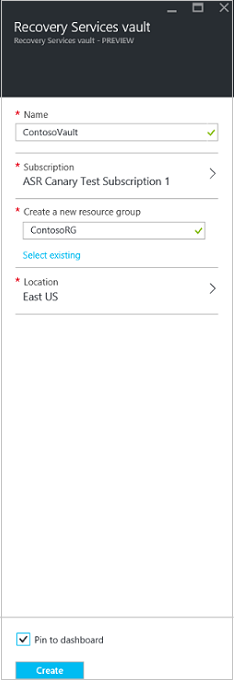

The new vault will appear on the **Dashboard** > **All resources**, and on the main **Recovery Services vaults** blade.

## Getting started

Site Recovery provides a Getting Started experience designed to get you up and running as quickly as possible. It checks prerequisites and walks you through the steps you need to get Site Recovery deployed.

You'll select the type of machines you want to replicate, and where you want to replicate to. You set up the infrastructure, including on-premises servers, Azure settings, replication policies, and capacity planning. After your infrastructure is in place you enable replication for VMs and physical servers. You can then run failovers for specific machines, or create recovery plans to fail over multiple machines.

Begin Getting Started by choosing how you want to deploy Site Recovery. The Getting Started flow changes slightly depending on your replication requirements.

## Step 1: Choose your protection goals

Select what you want to replicate and where you want to replicate to.

1. In the **Recovery Services vaults** blade select your vault and click **Settings**.
2. In **Settings** > **Getting Started** click **Site Recovery** > **Step 1: Prepare Infrastructure** > **Protection goal**.

	

3. In **Protection goal** select **To Azure**, and select **Yes, with VMware vSphere Hypervisor**. Then click **OK**.

	

## Step 2: Set up the source environment

Set up the configuration server and register it in the Recovery Services vault. If you're replicating VMware VMs specify the VMware account you're using for automatic discovery.

1. Click **Step 1: Prepare Infrastructure** > **Source**. In **Prepare source** if you don’t have a configuration server click **+Configuration server** to add one.

	

2. In the **Add Server** blade check that **Configuration Server** appears in **Server type**.
3. Before you set up the configuration server verify [prerequisites](#configuration-server-prerequisites). In particular check that the machine can access the required URLs.
4.	Download the Site Recovery Unified Setup installation file.
5.	Download the vault registration key. You'll need this when you run Unified Setup. The key is valid for 5 days after you generate it.

	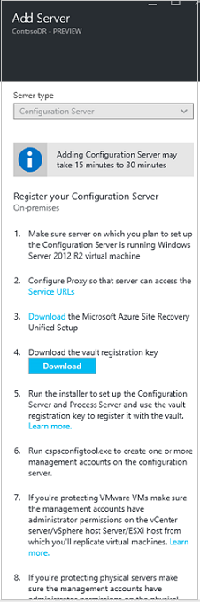

6.	On the machine you’re using as the configuration server, run Unified Setup to install the configuration server, the process server, and the master target server.

### Run Site Recovery Unified Setup

1.	Run the Unified Setup installation file.
2.	In **Before you begin** select **Install the configuration server and process server**.

	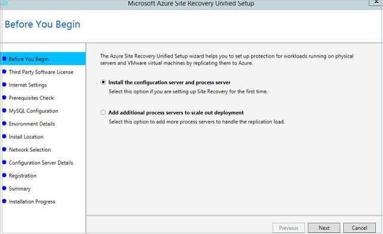

3. In **Third-Party Software License** click **I Accept** to download and install MySQL. 

	

4. In **Registration** browse and select the registration key you downloaded from the vault.

	

5. In **Internet Settings** specify how the Provider running on the configuration server will connect to Azure Site Recovery over the internet.

	- If you want to connect with the proxy that's currently set up on the machine select **Connect with existing proxy settings**.
	- If you want the Provider to connect directly select **Connect directly without a proxy**.
	- If the existing proxy requires authentication, or you want to use a custom proxy for the Provider connection, select **Connect with custom proxy settings**.
		- If you use a custom proxy you'll need to specify the address, port, and credentials
		- If you're using a proxy you should have already allowed the URLs described in [prerequisites](#configuration-server-prerequisites).

	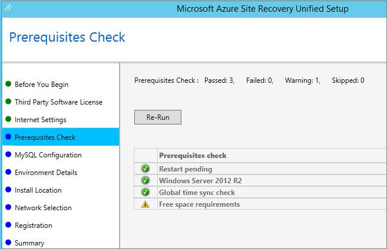

6. In **Prerequisites Check** setup runs a check to make sure that installation can run. If a warning appears about the **Global time sync check** verify that the time on the system clock (**Date and Time** settings) is the same as the time zone.

	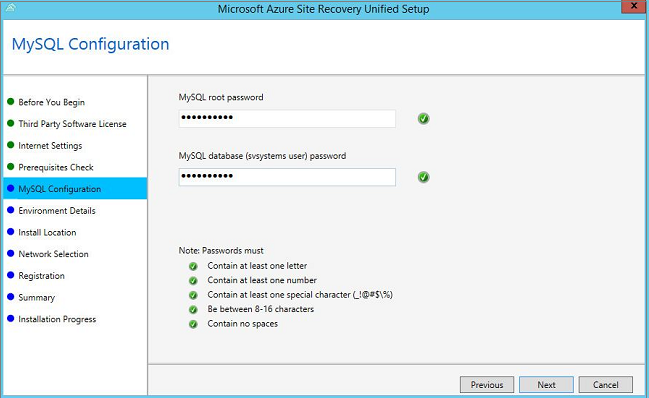

7. In **MySQL Configuration** create credentials for logging onto the MySQL server instance that will be installed.

	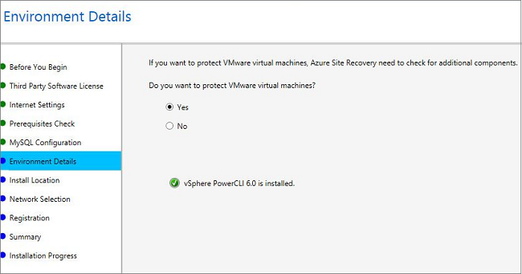

8. In **Environment Details** select whether you're going to replicate VMware VMs. If you are, then setup checks that PowerCLI 6.0 is installed.

	

9. In **Install Location** select where you want to install the binaries and store the cache. You can select a drive that has at least 5 GB of storage available but we recommend a cache drive with at least 600 GB of free space.

	

10. In **Network Selection** specify the listener (network adapter and SSL port) on which the configuration server will send and receive replication data. You can modify the default port (9443). In addition to this port, port 443 will be used by a web server which orchestrates replication operations. 443 shouldn't be used for receiving replication traffic.

	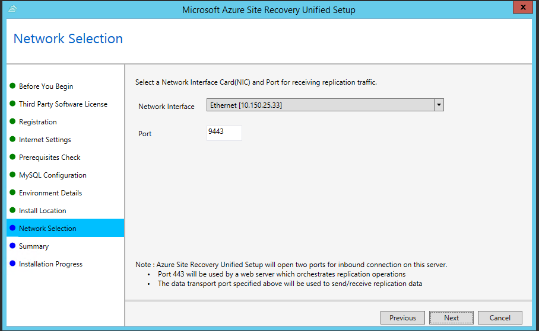

11.  In **Summary** review the information and click **Install**. When installation finishes a passphrase is generated. You'll need it when you enable replication so copy it and keep it in a secure location.

	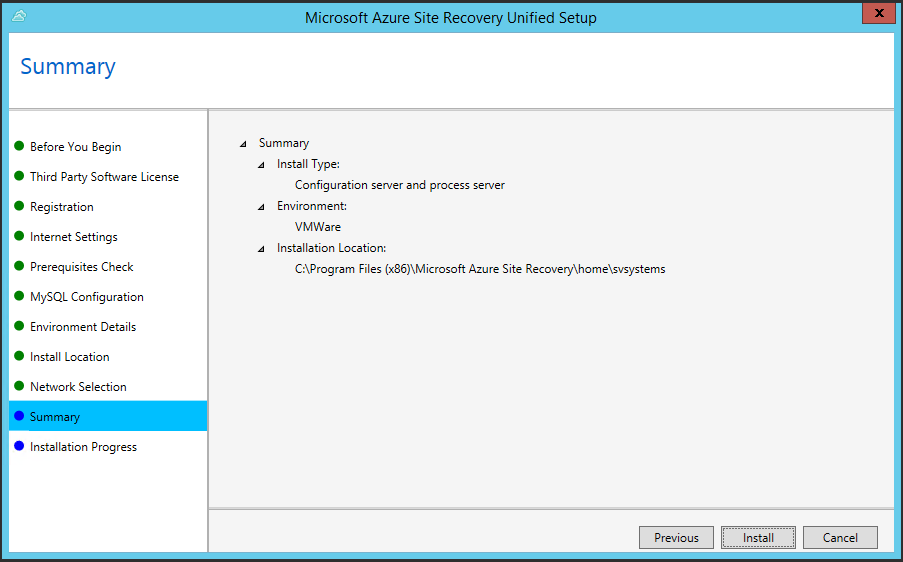

12.  After registration finishes the server is displayed in the **Settings** > **Servers** blade in the vault.

#### Run setup from the command line

You can set up the configuration server from the command line:

    UnifiedSetup.exe [/ServerMode <CS/PS>] [/InstallDrive <DriveLetter>] [/MySQLCredsFilePath <MySQL credentials file path>] [/VaultCredsFilePath <Vault credentials file path>] [/EnvType <VMWare/NonVMWare>] [/PSIP <IP address to be used for data transfer] [/CSIP <IP address of CS to be registered with>] [/PassphraseFilePath <Passphrase file path>]

When the installation finishes, to complete registration:

1. Launch an application named "Microsoft Azure Recovery Services Shell" from the Windows Start menu.
2. In the command window that opens, run the following set of commands to configure the proxy server settings.

		PS C:\Windows\System32\> $pwd = ConvertTo-SecureString -String ProxyUserPassword
		PS C:\Windows\System32\> Set-OBMachineSetting -ProxyServer http://myproxyserver.domain.com -ProxyPort PortNumb – ProxyUserName domain\username -ProxyPassword $pwd
		PS C:\Windows\System32\> net stop obengine.exe

Parameters:

- /ServerMode: Mandatory. Specifies whether both the configuration and process servers should be installed, or the process server only. Input values: CS, PS.
- InstallLocation: Mandatory. The folder in which the components are installed.
- /MySQLCredsFilePath. Mandatory. The file path in which the MySQL server credentials are stored. The file should be in this format:
	- [MySQLCredentials]
	- MySQLRootPassword = "<Password>"
	- MySQLUserPassword = "<Password>"
- /VaultCredsFilePath. Mandatory. The location of the vault credentials file
- /EnvType. Mandatory. The type of installation. Values: VMware, NonVMware
- /PSIP and /CSIP. Mandatory. The IP address of the process server and configuration server.
- /PassphraseFilePath. Mandatory. The location of the passphrase file.
- /BypassProxy. Optional. Specifies that the configuration server connects to Azure without a proxy.
- /ProxySettingsFilePath. Optional. Proxy settings (The default proxy requires authentication, or a custom proxy). The file should be in this format:
	- [ProxySettings]
	- ProxyAuthentication = "Yes/No"
	- Proxy IP = "IP Address>"
	- ProxyPort = "<Port>"
	- ProxyUserName="<User Name>"
	- ProxyPassword="<Password>"
- DataTransferSecurePort. Optional. Port number to be used for replication data.
- SkipSpaceCheck. Optional. Skip space check for cache.
- AcceptThirdpartyEULA. Mandatory. Flag implies acceptance of third party EULA.
- ShowThirdpartyEULA. Mandatory. Displays third-party EULA. If provided as input all other parameters are ignored.

### Add the VMware account used for automatic discovery

 When you prepared for deployment you should have [created a VMware account](#prepare-an-account-for-automatic-discovery) that Site Recovery can use for automatic discovery. Add this account as follows:

1. Open **CSPSConfigtool.exe**. It's available as a shortcut on the desktop and located in the [INSTALL LOCATION]\home\svsystems\bin folder.
2. Click **Manage Accounts** > **Add Account**.

	

3. In **Account Details** add the account that will be used for automatic discovery. Note that it can take 15 minutes or more for the account name to appear in the portal. To update immediately, click **Configuration Servers** > server name > **Refresh Server**.

	

### Connect to vSphere hosts and vCenter servers

If you're replicating VMware VMs connect to the vSphere hosts and vCenter servers.

1. Verify that the configuration server has network access to the vSphere hosts and vCenter servers.
2. Click **Prepare infrastructure** > **Source**. In **Prepare source** select the configuration server, and click **+vCenter** to add a vSphere host or vCenter server.
3. In **Add vCenter** specify a friendly name for the vSphere host or vCenter server, and specify the IP address or FQDN of the server. Leave the port as 443 unless your VMware servers are configured to listen for requests on a different port. Then select the account that will be used to connect to the VMware server. Click **OK**.

	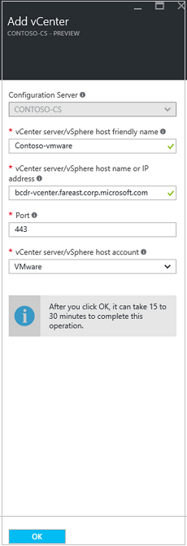

	>[AZURE.NOTE] If you're adding the vCenter server or vSphere host with an account that doesn't have administrator privileges on the vCenter or host server, then make sure that the account has these privileges enabled: Datacenter, Datastore, Folder, Host, Network, Resource, Virtual machine, vSphere Distributed Switch. In addition the vCenter server needs the Storage views privilege.

Site Recovery connects to VMware servers using the settings you specified and discovers VMs.

## Step 3: Set up the target environment

Verify you have a storage account for replication, and an Azure network to which Azure VMs will connect after failover.

1.	Click **Prepare infrastructure** > **Target** and select the Azure subscription you want to use.
2.	Specify the deployment model you want to use for VMs after failover.
3.	Site Recovery checks that you have one or more compatible Azure storage accounts and networks.

	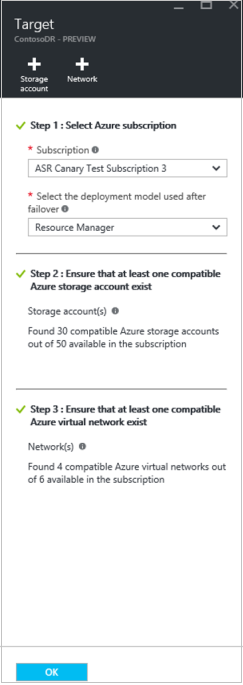

4.	If you haven't created a storage account and you want to create one using ARM click **+Storage account** to do that inline.  On the **Create storage account** blade specify an account name, type, subscription, and location. The account should be in the same region as the Recovery Services vault.

	

	Note that:

	- If you want to create a storage account using the classic model you'll do that in the Azure portal. [Learn more](../storage/storage-create-storage-account-classic-portal.md)
	- If you’re using a premium storage account for replicated data you'll need to set up an additional standard storage account to store replication logs that capture ongoing changes to on-premises data.
	
	> [AZURE.NOTE] Protection to premium storage accounts in Central India and South India is currently not supported.

4.	Select an Azure network. If you haven't created a network and you want to do that using ARM click **+Network** to do that inline. On the **Create virtual network** blade specify a network name, address range, subnet details, subscription, and location. The network should be in the same location as the Recovery Services vault.

	

	If you want to create a network using the classic model you’ll do that in the Azure portal. [Learn more](../virtual-network/virtual-networks-create-vnet-classic-pportal.md).

## Step 4: Set up replication settings

1. To create a new replication policy click **Prepare infrastructure** > **Replication Settings** > **+Create and Associate**.
2. In **Create and associate policy** specify a policy name.
3. In **RPO threshold**: specify the RPO limit. Alerts will be generated when continuous replication exceeds this limit.
5. In **Recovery point retention**, specify in hours how long the retention window will be for each recovery point. Protected machines can be recovered to any point within a window. Up to 24 hours retention is supported for machines replicated to premium storage.
6. In **App-consistent snapshot frequency**, specify how often (in minutes) recovery points containing application-consistent snapshots will be created.
7. When you create a replication policy, by default a matching policy is automatically created for failback. For example if the replication policy is **rep-policy** then the failback policy will be **rep-policy-failback**. This policy isn't used until you initiate a failback.  
8. Click **OK** to create the policy.

	

9. When you create a new policy it's automatically associated with the configuration server. Click **OK**.

	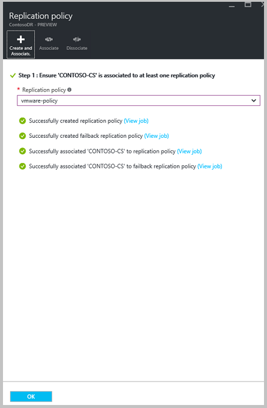

## Step 5: Capacity planning

Now that you have your basic infrastructure set up you can think about capacity planning and figure out whether you need additional resources.

Site Recovery provides a capacity planner to help you allocate the right resources for your source environment, the site recovery components, networking and storage. You can run the planner in quick mode for estimations based on an average number of VMs, disks, and storage, or in detailed mode in which you’ll input figures at the workload level. Before you start you’ll need to:

- Gather information about your replication environment, including VMs, disks per VMs, and storage per disk.
- Estimate the daily change (churn) rate you’ll have for replicated data. You can use the [vSphere capacity planning appliance](https://labs.vmware.com/flings/vsphere-replication-capacity-planning-appliance) to help you do this.

1.	Click **Download** to download the tool and then run it. [Read the article](site-recovery-capacity-planner.md) that accompanies the tool.
2.	When you’re done select **Yes** in **Have you completed capacity planning?**

	

The table below captures a number of points to help you with capacity planning for this scenario.

**Component** | **Details**
--- | --- | ---
**Replication** | **Maximum daily change rate**—A protected machine can only use one process server, and a single process server can handle a daily change rate up to 2 TB. Thus 2 TB is the maximum daily data change rate that’s supported for a protected machine.   **Maximum throughput**—A replicated machine can belong to one storage account in Azure. A standard storage account can handle a maximum of 20,000 requests per second, and we recommend that you keep the number of IOPS across a source machine to 20,000. For example if you have a source machine with 5 disks and each disk generates 120 IOPS (8K size) on the source then it will be within the Azure per disk IOPS limit of 500. The number of storage accounts required = total source IOPs/20000.
**Configuration server** | The configuration server should be able to handle the daily change rate capacity across all workloads running on protected machines, and needs sufficient bandwidth to continuously replicate data to Azure storage.   As a best practice we recommend that the configuration server be located on the same network and LAN segment as the machines you want to protect. It can be located on a different network but machines you want to protect should have L3 network visibility to it.   Size recommendations for the configuration server are summarized in the table below.
**Process server** | The first process server is installed by default on the configuration server. You can deploy additional process servers to scale your environment. Note that:   The process server receives replication data from protected machines and optimizes it with caching, compression, and encryption before sending to Azure. The process server machine should have sufficient resources to perform these tasks.   The process server uses disk based cache. We recommend a separate cache disk of 600 GB or more to handle data changes stored in the event of network bottleneck or outage.

### Size recommendations for the configuration server

**CPU** | **Memory** | **Cache disk size** | **Data change rate** | **Protected machines**
--- | --- | --- | --- | ---
8 vCPUs (2 sockets * 4 cores @ 2.5GHz) | 16 GB | 300 GB | 500 GB or less | Replicate less than 100 machines.
12 vCPUs (2 sockets * 6 cores @ 2.5GHz) | 18 GB | 600 GB | 500 GB to 1 TB | Replicate between 100-150 machines.
16 vCPUs (2 sockets * 8 cores @ 2.5GHz) | 32 GB | 1 TB | 1 TB to 2 TB | Replicate between 150-200 machines.
Deploy another process server | | | > 2 TB | Deploy additional process servers if you're replicating more than 200 machines, or if the daily data change rate exceeds 2 TB.

Where:

- Each source machine is configured with 3 disks of 100 GB each.
- We used benchmarking storage of 8 SAS drives of 10 K RPM with RAID 10 for cache disk measurements.

### Size recommendations for the process server

If you need to protect more than 200 machines or daily change rate is greater than 2 TB you can add additional process servers to handle the replication load. To scale out you can:

- Increase the number of configuration servers. For example you can protect up to 400 machines with two configuration servers.
- Add additional process servers and use these to handle traffic instead of (or in addition to) the configuration server.

This table describes a scenario in which:

- You're not planning to use the configuration server as a process server.
- You've set up an additional process server.
- You've configure protected virtual machines to use the additional process server.
- Each protected source machine is configured with three disks of 100 GB each.

**Configuration server** | **Additional process server**| **Cache disk size** | **Data change rate** | **Protected machines**
--- | --- | --- | --- | ---
8 vCPUs (2 sockets * 4 cores @ 2.5GHz), 16 GB memory | 4 vCPUs (2 sockets * 2 cores @ 2.5GHz), 8 GB memory | 300 GB | 250 GB or less | Replicate 85 or less machines.
8 vCPUs (2 sockets * 4 cores @ 2.5GHz), 16 GB memory | 8 vCPUs (2 sockets * 4 cores @ 2.5GHz), 12 GB memory | 600 GB | 250 GB to 1 TB | Replicate between 85-150 machines.
12 vCPUs (2 sockets * 6 cores @ 2.5GHz), 18 GB memory | 12 vCPUs (2 sockets * 6 cores @ 2.5GHz) 24 GB memory | 1 TB | 1 TB to 2 TB | Replicate between 150-225 machines.

The way in which you scale your servers will depend on your preference for a scale up or scale out model.  You scale up by deploying a few high-end configuration and process servers, or scale out by deploying more servers with less resources. For example: if you need to protect 220 machines you could do either of the following:

- Set up the configuration server with 12vCPU, 18 GB of memory, an additional process server with 12vCPU, 24 GB of memory, and configure protected machines to use the additional process server only.
- Alternatively you could configure two configuration servers (2 x 8vCPU, 16 GB RAM) and two additional process servers (1 x 8vCPU and 4vCPU x 1 to handle 135 + 85 (220) machines), and configure protected machines to use the additional process servers only.

[Follow these instructions](#deploy-additional-process-servers) to set up an additional process server.

### Network bandwidth considerations

You can use the capacity planner tool to calculate the bandwidth you need for replication (initial replication and then delta). To control the amount of bandwidth use for replication you have a few options:

- **Throttle bandwidth**: VMware traffic that replicates to Azure goes through a specific process server. You can throttle bandwidth on the machines running as process servers.
- **Influence bandwidth**: You can influence the bandwidth used for replication using a couple of registry keys:
	- The **HKEY_LOCAL_MACHINE\SOFTWARE\Microsoft\Windows Azure Backup\UploadThreadsPerVM** registry value specifies the number of threads that are used for data transfer (initial or delta replication) of a disk. A higher value increases the network bandwidth used for replication.
	- The **HKEY_LOCAL_MACHINE\SOFTWARE\Microsoft\Windows Azure Backup\DownloadThreadsPerVM** specifies the number of threads used for data transfer during failback.

#### Throttle bandwidth

1. Open the Microsoft Azure Backup MMC snap-in on the machine acting as the process server. By default a shortcut for Microsoft Azure Backup is available on the desktop or in C:\Program Files\Microsoft Azure Recovery Services Agent\bin\wabadmin.
2. In the snap-in click **Change Properties**.

	

3. On the **Throttling** tab select **Enable internet bandwidth usage throttling for backup operations**, and set the limits for work and non-work hours. Valid ranges are from 512 Kbps to 102 Mbps per second.

	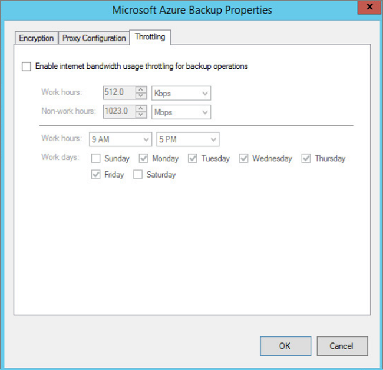

You can also use the [Set-OBMachineSetting](https://technet.microsoft.com/library/hh770409.aspx) cmdlet to set throttling. Here's a sample:

    $mon = [System.DayOfWeek]::Monday
    $tue = [System.DayOfWeek]::Tuesday
    Set-OBMachineSetting -WorkDay $mon, $tue -StartWorkHour "9:00:00" -EndWorkHour "18:00:00" -WorkHourBandwidth  (512*1024) -NonWorkHourBandwidth (2048*1024)

**Set-OBMachineSetting -NoThrottle** indicates that no throttling is required.

#### Influence network bandwidth

1. In the registry navigate to **HKEY_LOCAL_MACHINE\SOFTWARE\Microsoft\Windows Azure Backup\Replication**.
	- To influence the bandwidth traffic on a replicating disk, modify the value the **UploadThreadsPerVM**, or create the key if it doesn't exist.
	- To influence the bandwidth for failback traffic from Azure, modify the value **DownloadThreadsPerVM**.
2. The default value is 4. In an “overprovisioned” network, these registry keys should be changed from the default values. The maximum is 32. Monitor traffic to optimize the value.

## Step 6: Replicate applications

Make sure that machines you want to replicate are prepared for Mobility service installation, and then enable replication.

### Install the Mobility service

The first step in enabling protection for virtual machines and physical servers is to install the Mobility service. You can do this in a couple of ways:

- **Process server push**: When you enable replication on a machine, push and install the Mobility service component from the process server. Note that push installation won't occur if machines are already running an up-todate version of the component.
- **Enterprise push**: Automatically install the component using your enterprise push process such as WSUS or System Center Configuration Manager. Set up the configuration server before you do this.
- **Manual installation**: Install the component manually on each machine that you want to replicate. Set up the configuration server before you do this.

#### Prepare for automatic push on Windows machines

Here's how to prepare Windows machines so that the Mobility service can be automatically installed by the process server.

1.  Create an account that can be used by the process server to access the machine. The account should have administrator privileges (local or domain) and it's only used for the push installation.

	>[AZURE.NOTE] If you're not using a domain account you'll need to disable Remote User Access control on the local machine. To do this, in the register under HKEY_LOCAL_MACHINE\SOFTWARE\Microsoft\Windows\CurrentVersion\Policies\System add the DWORD entry LocalAccountTokenFilterPolicy with a value of 1. To add the registry entry from a CLI type **`REG ADD HKEY_LOCAL_MACHINE\SOFTWARE\Microsoft\Windows\CurrentVersion\Policies\System /v LocalAccountTokenFilterPolicy /t REG_DWORD /d 1`**.

2.  On the Windows Firewall of the machine you want to protect, select **Allow an app or feature through Firewall**. Enable **File and Printer Sharing** and **Windows Management Instrumentation**. For machines that belong to a domain you can configure the firewall settings with a GPO.

	

2. Add the account you created:

	- Open **cspsconfigtool**. It's available as a shortcut on the desktop and located in the [INSTALL LOCATION]\home\svsystems\bin folder.
	- In the **Manage Accounts** tab, click **Add Account**.
	- Add the account you created. After adding the account you'll need to provide the credentials when you enable replication for a machine.

#### Prepare for automatic push on Linux servers

1.	Make sure that the Linux machine you want to protect is supported as described in [protected machine prerequisites](#protected-machine-prerequisites). Ensure there’s network connectivity between the Linux machine and the process server.

2.	Create an account that can be used by the process server to access the machine. The account should be a root user on the source Linux server and it's only used for the push installation.

	- Open **cspsconfigtool**. It's available as a shortcut on the desktop and located in the [INSTALL LOCATION]\home\svsystems\bin folder.
	- In the **Manage Accounts** tab, click **Add Account**.
	- Add the account you created. After adding the account you'll need to provide the credentials when you enable replication for a machine.

3.	Check that the /etc/hosts file on the source Linux server contains entries that map the local hostname to IP addresses associated with all network adapters.
4.	Install the latest openssh, openssh-server, openssl packages on the machine you want to replicate.
5.	Ensure SSH is enabled and running on port 22.
6.	Enable SFTP subsystem and password authentication in the sshd_config file as follows:

	- Log in as root.
	- In the file /etc/ssh/sshd_config file, find the line that begins with **PasswordAuthentication**.
	- Uncomment the line and change the value from **no** to **yes**.
	- Find the line that begins with **Subsystem** and uncomment the line.

		

#### Install the Mobility service manually

The installers are available on the process server in **C:\Program Files (x86)\Microsoft Azure Site Recovery\home\svsystems\pushinstallsvc\repository**.

Source operating system | Mobility service installation file
--- | ---
Windows Server (64 bit only) | Microsoft-ASR_UA_9.*.0.0_Windows_* release.exe
CentOS 6.4, 6.5, 6.6 (64 bit only) | Microsoft-ASR_UA_9.*.0.0_RHEL6-64_*release.tar.gz
SUSE Linux Enterprise Server 11 SP3 (64 bit only) | Microsoft-ASR_UA_9.*.0.0_SLES11-SP3-64_*release.tar.gz
Oracle Enterprise Linux 6.4, 6.5 (64 bit only) | Microsoft-ASR_UA_9.*.0.0_OL6-64_*release.tar.gz

#### Install manually on a Windows server

1. Download and run the relevant installer.
2. In **Before you begin** select **Mobility service**.

	

3. In **Configuration Server Details** specify the IP address of the configuration server and the passphrase that was generated when you ran Unified Setup. You can retrieve the passphrase  by running: **<SiteRecoveryInstallationFolder>\home\sysystems\bin\genpassphrase.exe –n** on the configuration server.

	

4. In **Install Location** leave the default setting and click **Next** to begin installation.
5. In **Installation Progress** monitor installation and restart the machine if prompted. After installing the service it can take around 15 minutes for status to update in the portal.

You can also install from the command line:

UnifiedAgent.exe [/Role <Agent/MasterTarget>] [/InstallLocation <Installation Directory>] [/CSIP <IP address of CS to be registered with>] [/PassphraseFilePath <Passphrase file path>] [/LogFilePath <Log File Path>]

Where:

- /Role: Mandatory. Specifies whether the Mobility service should be installed.
- /InstallLocation: Mandatory. Specifies where to install the service.
- /PassphraseFilePath: Mandatory. The configuration server passphrase.
- /LogFilePath: Mandatory. The log setup files location.

#### Install manually on a Linux server:

1. Copy the appropriate tar archive based on the table above to the Linux machine you want to replicate.
2. Open a shell program and extract the zipped tar archive to a local path by running: `tar -xvzf Microsoft-ASR_UA_8.5.0.0*`
3. Create a passphrase.txt file in the local directory to which you extracted the contents of the tar archive. To do this copy the passphrase from C:\ProgramData\Microsoft Azure Site Recovery\private\connection.passphrase on the configuration server, and save it in passphrase.txt by running *`echo <passphrase> >passphrase.txt`* in shell.
4. Install the Mobility service by running *`sudo ./install -t both -a host -R Agent -d /usr/local/ASR -i <IP address> -p <port> -s y -c https -P passphrase.txt`*.
5. Specify the internal IP address of the configuration server and make sure port 443 is selected. After installing the service it can take around 15 minutes for status to update in the portal.

**You can also install from the command line**:

1. Copy the passphrase from C:\Program Files (x86)\InMage Systems\private\connection on the configuration server, and save it as "passphrase.txt" on the configuration server. Then run these commands. In our example the configuration server IP address is 104.40.75.37 and the HTTPS port should be 443:

To install on a production server:

    ./install -t both -a host -R Agent -d /usr/local/ASR -i 104.40.75.37 -p 443 -s y -c https -P passphrase.txt

To install on the master target server:

    ./install -t both -a host -R MasterTarget -d /usr/local/ASR -i 104.40.75.37 -p 443 -s y -c https -P passphrase.txt

### Enable replication

#### Before you start

If you're replicating VMware virtual machines note the following:

- VMware VMs are discovered every 15 minutes and it might take 15 minutes or longer for them to appear in the portal after discovery. Likewise discovery can take 15 minutes or more when you add a new vCenter server or vSphere host.
- Environment changes on the virtual machine (such as VMware tools installation) might also take 15 minutes or more to be updated in the portal.
- You can check the last discovered time for VMware VMs in the **Last Contact At** field for the vCenter server/vSphere host on the **Configuration Servers** blade.
- To add machines for replication without waiting for the scheduled discovery, highlight the configuration server (don’t click it) and click the **Refresh** button.
- When you enable replication, if the machine is prepared the process server automatically installs the Mobility service on it.

#### Exclude disks from replication

When you enable replication, by default all disks on a machine are replicated. You can exclude disks from replication. For example you might not want to replicate disks with temporary data, or data that's refreshed each time a machine or application restarts (for example pagefile.sys or SQL Server tempdb). If you want to exclude disks note that:

- You can only exclude disks that already have the Mobility service installed. You'll need to [manually install the Mobility service](#install-the-mobility-service-manually) because the Mobility service is only installed using the push mechanism after replication is enabled.
- Only basic disks can be excluded from replication. You can't exclude OS or dynamic disks.
- After replication is enabled you can't add or remove disks for replication. If you want to add or exclude a disk you'll need to disable protection for the machine and then reenable it.
- If you exclude a disk that's needed for an application to operate, after failover to Azure you’ll need to create it manually in Azure so that the replicated application can run. Alternatively you could integrate Azure automation into a recovery plan to create the disk during failover of the machine.
- Disks you create manually in Azure will be failed back. For example if you fail over three disks and create two directly in Azure, all five will be failed back. You can't exclude disks created manually from failback.

**Now enable replication as follows**:

1. Click **Step 2: Replicate application** > **Source**. After you've enabled replication for the first time you'll click **+Replicate** in the vault to enable replication for additional machines.
2. In the **Source** blade > **Source** select the configuration server.
3. In **Machine type** select **Virtual Machines** or **Physical Machines**.
4. In **vCenter/vSphere Hypervisor** select the vCenter server that manages the vSphere host, or select the host. This setting isn't relevant if you're replicating physical machines.
5. Select the process server. If you haven't created any additional process servers this will be the name of the configuration server. Then click **OK**.

	

6. In **Target** select the vault subscription, and in **Post-failover deployment model** select the model (classic or resource management) that you want to use in Azure after failover.
7. Select the Azure storage account you'll use for replicating data. Note that:

	- You can select a premium or standard storage account. If you select a premium account you'll need to specify an additional standard storage account for ongoing replication logs. Accounts must be in the same region as the Recovery Services vault.
	- If you want to use a different storage account than those you have you can [create one](#set-up-an-azure-storage-account). To create a storage account using the ARM model click **Create new**. If you want to create a storage account using the classic model you'll do that [in the Azure portal](../storage/storage-create-storage-account-classic-portal.md).

8. Select the Azure network and subnet to which Azure VMs will connect when they're spun up after failover. The network must be in the same region as the Recovery Services vault. Select **Configure now for selected machines** to apply the network setting to all machines you select for protection. Select **Configure later** to select the Azure network per machine. If you don't have a network you'll need to [create one](#set-up-an-azure-network). To create a network using the ARM model click **Create new**.If you want to create a network using the classic model you’ll do that [in the Azure portal](../virtual-network/virtual-networks-create-vnet-classic-pportal.md). Select a subnet if applicable. Then click **OK**.

	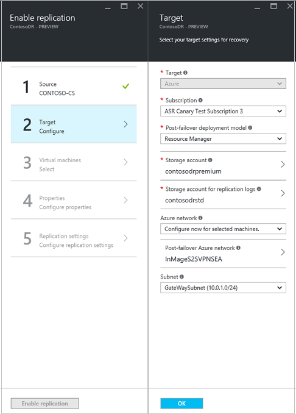

9. In **Virtual Machines** > **Select virtual machines** click and select each machine you want to replicate. You can only select machines for which replication can be enabled. Then click **OK**.

	

10. In **Properties** > **Configure properties**, select the account that will be used by the process server to automatically install the Mobility service on the machine. By default all disks are replicated. Click **All Disks** and clear any disks you don't want to replicate. Then click **OK**. You can set additional properties later.

	

11. In **Replication settings** > **Configure replication settings** verify that the correct replication policy is selected. You can modify replication policy settings in **Settings** > **Replication policies** > policy name > **Edit Settings**. Changes you apply to a policy will be applied to replicating and new machines.

12. Enable **Multi-VM consistency** if you want to gather machines into a replication group, and specify a name for the group. Then click **OK**. Note that:

	- Machines in replication group replicate together and have shared crash-consistent and app-consistent recovery points when they fail over.
	- We recommend that you gather VMs and physical servers together so that they mirror your workloads. Enabling multi-VM consistency can impact workload performance and should only be used if machines are running the same workload and you need consistency.

	

13. Click **Enable Replication**. You can track progress of the **Enable Protection** job in **Settings** > **Jobs** > **Site Recovery Jobs**. After the **Finalize Protection** job runs the machine is ready for failover.

> [AZURE.NOTE] If the machine is prepared for push installation the Mobility service component will be installed when protection is enabled. After the component is installed on the machine a protection job starts and fails. After the failure you need to manually restart each machine. After the restart the protection job begins again and initial replication occurs.

### View and manage VM properties

We recommend that you verify the properties of the source machine. Remember that the Azure VM name should conform with [Azure virtual machine requirements](site-recovery-best-practices.md#azure-virtual-machine-requirements).

1. Click **Settings** > **Replicated items** > and select the machine. The **Essentials** blade shows information about machines settings and status.

2. In **Properties** you can view replication and failover information for the VM.

	

3. In **Compute and Network** > **Compute properties** you can specify the Azure VM name and target size. Modify the name to comply with Azure requirements if you need to.
You can also view and add information about the target network, subnet, and IP address that will be assigned to the Azure VM. Note the following:

	- You can set the target IP address. If you don't provide an address, the failed over machine will use DHCP. If you set an address that isn't available at failover, the failover won't work. The same target IP address can be used for test failover if the address is available in the test failover network.
	- The number of network adapters is dictated by the size you specify for the target virtual machine, as follows:

		- If the number of network adapters on the source machine is less than or equal to the number of adapters allowed for the target machine size, then the target will have the same number of adapters as the source.
		- If the number of adapters for the source virtual machine exceeds the number allowed for the target size then the target size maximum will be used.
		- For example if a source machine has two network adapters and the target machine size supports four, the target machine will have two adapters. If the source machine has two adapters but the supported target size only supports one then the target machine will have only one adapter. 	
	- If the VM has multiple network adapters they will all connect to the same network.

	

4. In **Disks** you can see the operating system and data disks on the VM that will be replicated.

## Step 7: Test the deployment

In order to test the deployment you can run a test failover for a single virtual machine or a recovery plan that contains one or more virtual machines.

### Prepare for failover

- To run a test failover we recommend that you create a new Azure network that’s isolated from your Azure production network (this is default behavior when you create a new network in Azure). [Learn more](site-recovery-failover.md#run-a-test-failover) about running test failovers.
- To get the best performance when you fail over to Azure, install the Azure Agent on the protected machine. It makes booting faster and helps with troubleshooting. Install the [Linux](https://github.com/Azure/WALinuxAgent) or [Windows](http://go.microsoft.com/fwlink/?LinkID=394789) agent.
- To fully test your deployment you'll need an infrastructure for the replicated machine to work as expected. If you want to test Active Directory and DNS you can create a virtual machine as a domain controller with DNS and replicate this to Azure using Azure Site Recovery. Read more in [test failover considerations for Active Directory](site-recovery-active-directory.md#considerations-for-test-failover).
- Make sure that the configuration server is running. Otherwise failover will fail.
- If you've excluded disks from replication you might need to create those disks manually in Azure after failover so that the application runs as expected.
- If you want to run an unplanned failover instead of a test failover note the following:

	- If possible you should shut down primary machines before you run an unplanned failover. This ensures that you don't have both the source and replica machines running at the same time. If you're replicating VMware VMs then you can specify that Site Recovery should make a best effort to shut down the source machines. Depending on the state of the primary site this might or might not work. If you're replicating physical servers Site Recovery doesn't offer this option.
	- When you run an unplanned failover it stops data replication from primary machines so any data delta won't be transferred after an unplanned failover begins. In addition if you run an unplanned failover on a recovery plan it will run until complete, even if an error occurs.

### Prepare to connect to Azure VMs after failover

If you want to connect to Azure VMs using RDP after failover, make sure you do the following:

**On the on-premises machine before failover**:

- For access over the internet enable RDP, ensure that TCP and UDP rules are added for the **Public**, and ensure that RDP is allowed in the **Windows Firewall** -> **Allowed apps and features** for all profiles.
- For access over a site-to-site connection enable RDP on the machine, and ensure that RDP is allowed in the **Windows Firewall** -> **Allowed apps and features** for **Domain** and **Private** networks.
- Install the [Azure VM agent](http://go.microsoft.com/fwlink/?LinkID=394789&clcid=0x409) on the on-premises machine.
- [Manually install the Mobility service](#install-the-mobility-service-manually) on machines instead of using the process server to push the service automatically. This is because the push installation only happens after the machine is enabled for replication.
- Ensure that the operating system's SAN policy is set to OnlineAll. [Learn more]( https://support.microsoft.com/kb/3031135)
- Turn off the IPSec service before you run the failover.

**On the Azure VM after failover**:

- Add a public endpoint for the RDP protocol (port 3389) and specify credentials for login.
- Ensure you don't have any domain policies that prevent you from connecting to a virtual machine using a public address.
- Try to connect. If you can't connect verify that the VM is running. For more troubleshooting tips read this [article](http://social.technet.microsoft.com/wiki/contents/articles/31666.troubleshooting-remote-desktop-connection-after-failover-using-asr.aspx).

If you want to access an Azure VM running Linux after failover using a Secure Shell client (ssh), do the following:

**On the on-premises machine before failover**:

- Ensure that the Secure Shell service on the Azure VM is set to start automatically on system boot.
- Check that firewall rules allow an SSH connection to it.

**On the Azure VM after failover**:

- The network security group rules on the failed over VM and the Azure subnet to which it is connected need to allow incoming connections to the SSH port.
- A public endpoint should be created to allow incoming connections on the SSH port (TCP port 22 by default).
- If the VM is accessed over a VPN connection (Express Route or site to site VPN) then the client can be used to directly connect to the VM over SSH.

**On the Azure Windows/Linux VM after failover**:

If you have a Network Security Group associated with the Virtual Machine or the subnet to which the machine belongs to, make sure that the Network Security Group has an outbound rule to allow HTTP/HTTPS. Also make sure that the DNS of the network to which virtual machine is getting failed over to is correctly configured. Else the failover could time out with error -'PreFailoverWorkflow task WaitForScriptExecutionTask timed out'. To understand this in detail, refer to section on Recovery in the [Monitoring and troubleshooting guide](site-recovery-monitoring-and-troubleshooting.md#recovery).

## Run a test failover

1. To fail over a single machine, in **Settings** > **Replicated Items**, click the VM > **+Test Failover** icon.

	

2. To fail over a recovery plan, in **Settings** > **Recovery Plans**, right-click the plan > **Test Failover**. To create a recovery plan [follow these instructions](site-recovery-create-recovery-plans.md).

3. In **Test Failover** select the Azure network to which Azure VMs will be connected after failover occurs.
4. Click **OK** to begin the failover. You can track progress by clicking on the VM to open its properties, or on the **Test Failover** job in vault name > **Settings** > **Jobs** > **Site Recovery jobs**.
5. When the failover reaches the **Complete testing** status, do the following:

	1. View the replica virtual machine in the Azure portal. Verify that the virtual machine starts successfully.
	2. If you’re set up to access virtual machines from your on-premises network you can initiate a Remote Desktop connection to the virtual machine.
	3. Click **Complete test** to finish it.

		

	4. Click **Notes** to record and save any observations associated with the test failover.
	5. Click **The test failover is complete** to automatically clean up the test environment. After this is done the test failover will show a **Complete** status.
	6.  At this stage any elements or VMs created automatically by Site Recovery during the test failover are deleted. Any additional elements you've created for test failover aren't deleted.

	> [AZURE.NOTE] If a test failover continues longer than two weeks it’s completed by force.

6. After the failover completes you should also be able to see the replica Azure machine appear in the Azure portal > **Virtual Machines**. You should make sure that the VM is the appropriate size, that it's connected to the appropriate network, and that it's running.
7. If you [prepared for connections after failover](#prepare-to-connect-to-azure-vms-after-failover) you should be able to connect to the Azure VM.

## Monitor your deployment

Here's how you can monitor the configuration settings, status, and health for your Site Recovery deployment:

1. Click on the vault name to access the **Essentials** dashboard. In this dashboard you can Site Recovery jobs, replication status, recovery plans, server health, and events.  You can customize Essentials to show the tiles and layouts that are most useful to you, including the status of other Site Recovery and Backup vaults.

2. In the **Health** tile you can monitor site servers (VMM or configuration servers) that are experiencing issue, and the events raised by Site Recovery in the last 24 hours.
3. You can manage and monitor replication in the **Replicated Items**, **Recovery Plans**, and **Site Recovery Jobs** tiles. You can drill down into jobs in **Settings** -> **Jobs** -> **Site Recovery Jobs**.

## Deploy additional process servers

If you have to scale out your deployment beyond 200 source machines or a total daily churn rate of more than 2 TB, you’ll need additional process servers to handle the traffic volume.

Check the [size recommendations for process servers](#size-recommendations-for-the-process-server) and then follow these instructions to set up the process server. After setting up the server you'll migrate source machines to use it.

### Install an additional process server

1. In  **Settings** > **Site Recovery servers** click the configuration server > **Process server**.

	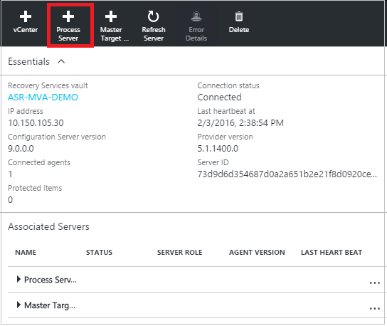

2. In **Server Type** click **Process server (on-premises)**.

	

3. Download the Site Recovery Unified Setup file and run it to install the process server and register it in the vault.
4. In **Before you begin** select **Add additional process servers to scale out deployment**.
5. Complete the wizard in the same way you did when you [set up](#step-2-set-up-the-source-environment) the configuration server.

	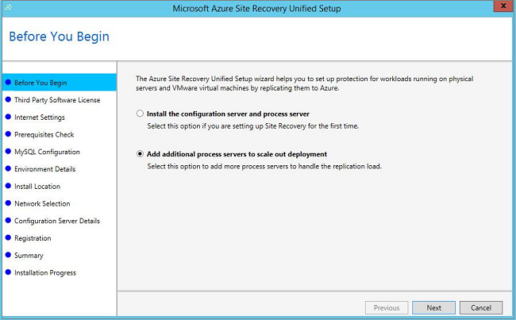

6. In **Configuration Server Details** specify the IP address of the configuration server, and the passphrase. To obtain the passphrase run **<SiteRecoveryInstallationFolder>\home\sysystems\bin\genpassphrase.exe –n** on the configuration server.

	

### Migrate machines to use the new process server

1. In  **Settings** > **Site Recovery servers** click the configuration server and then expand **Process servers**.

	

2. Right-click the process server currently in use and click **Switch**.

	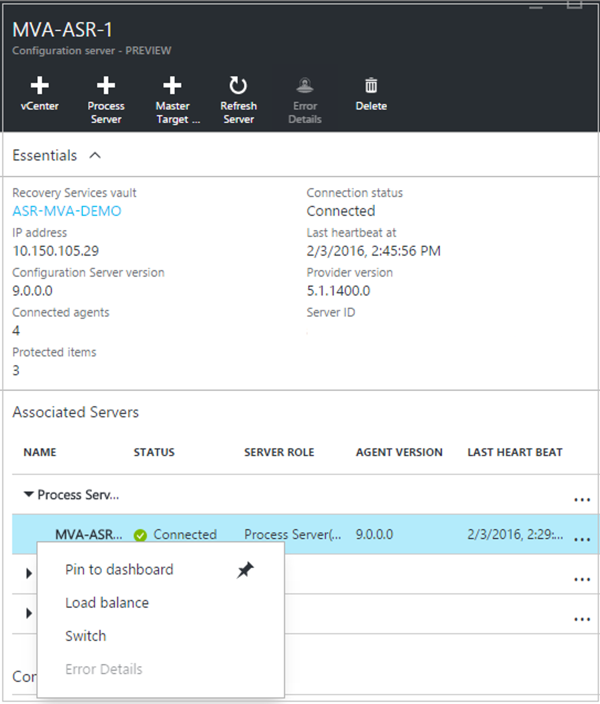

3. In **Select target process server**,  select the new process server you want to use and then select the virtual machines that the new process server will handle. Click the information icon to get information about the server. To help you make load decisions, the average space that's needed to replicate each selected virtual machine to the new process server is displayed. Click the check mark to start replicating to the new process server.

## VMware account permissions

The process server can automatically discover VMs on a vCenter server. To perform automatic discovery you'll need to [define a role (Azure_Site_Recovery)](#prepare-an-account-for-automatic-discovery) to allow Site Recovery to access the VMware server. Note that if you only need to migrate VMware machines to Azure and don't need to failback from Azure, you can define a read-only role that's sufficient. The required role permissions are summarized in the following table.

**Role** | **Details** | **Permissions**
--- | --- | ---
Azure_Site_Recovery role | VMware VM discovery |Assign these privileges for the v-Center server:  Datastore->Allocate space, Browse datastore, Low level file operations., Remove file, Update virtual machine files  Network-> Network assign  Resource -> Assign virtual machine to resource pool, Migrate powered off virtual machine, Migrate powered on virtual machine  Tasks -> Create task, update task  Virtual machine ->  Configuration  Virtual machine -> Interact -> Answer question , Device connection., Configure CD media, Configure floppy media, Power off, Power on, VMware tools install  Virtual machine -> Inventory -> Create, Register, Unregister  Virtual machine -> Provisioning -> Allow virtual machine download, Allow virtual machine files upload  Virtual machine -> Snapshots -> Remove snapshots
vCenter user role | VMware VM discovery/Failover without shutdown of source VM | Assign these privileges for the v-Center server:  Data Center object –> Propagate to Child Object, role=Read-only   The user is assigned at datacenter level and thus has access to all the objects in the datacenter.  If you want to restrict the access, assign the **No access** role with the **Propagate to child** object to the child objects (vSphere hosts, datastores, VMs and networks).
vCenter user role | Failover and failback | Assign these privileges for the v-Center server:  Datacenter object – Propagate to child object, role=Azure_Site_Recovery  The user is assigned at datacenter level and thus has access to all the objects in the datacenter.  If you want to restrict the access, assign  the **No access **role with  the **Propagate to child object** to the child object (vSphere hosts, datastores, VMs and networks).  
## Next steps

- [Learn more](site-recovery-failover.md) about different types of failover.
- [Learn more about failback](site-recovery-failback-azure-to-vmware.md) to bring your failed over machines running in Azure back to your on-premises environment.

## Third-party software notices and information

Do Not Translate or Localize

The software and firmware running in the Microsoft product or service is based on or incorporates material from the projects listed below (collectively, “Third Party Code”).  Microsoft is the not original author of the Third Party Code.  The original copyright notice and license, under which Microsoft received such Third Party Code, are set forth below.

The information in Section A is regarding Third Party Code components from the projects listed below. Such licenses and information are provided for informational purposes only.  This Third Party Code is being relicensed to you by Microsoft under Microsoft's software licensing terms for the Microsoft product or service.  

The information in Section B is regarding Third Party Code components that are being made available to you by Microsoft under the original licensing terms.

The complete file may be found on the [Microsoft Download Center](http://go.microsoft.com/fwlink/?LinkId=529428). Microsoft reserves all rights not expressly granted herein, whether by implication, estoppel or otherwise.
