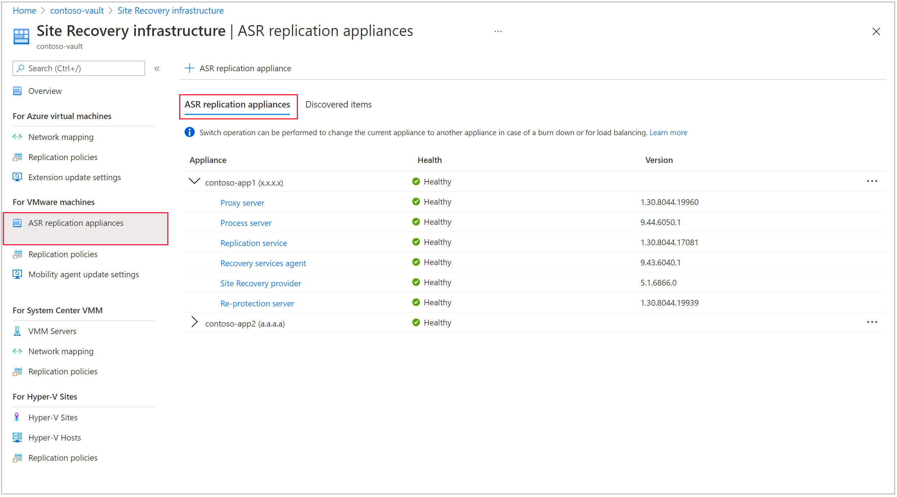
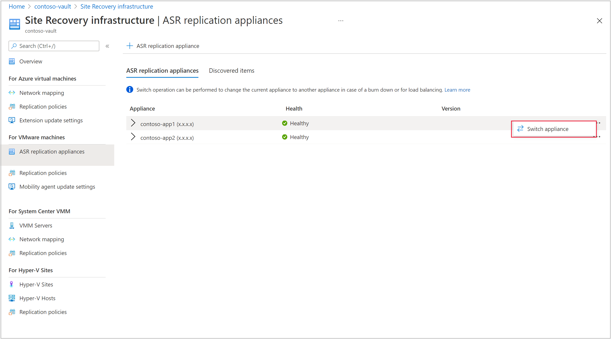
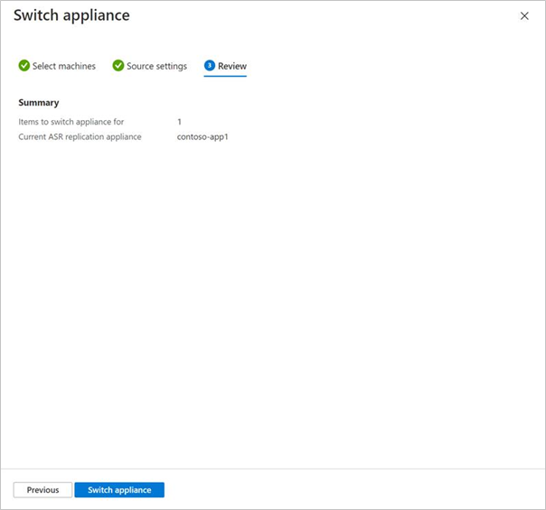

# Switch Azure Site Recovery replication appliance

>[!NOTE]
> The information in this article applies to Azure Site Recovery - Modernized.

You need to [create and deploy an on-premises Azure Site Recovery replication appliance](deploy-vmware-azure-replication-appliance-modernized.md) when you use [Azure Site Recovery](site-recovery-overview.md) for disaster recovery of VMware VMs and physical servers to Azure. For detailed information about replication appliance, see [the architecture](vmware-azure-architecture-modernized.md). You can create and use multiple replication appliances based on the capacity requirements of your organization.

This article provides information about how you can switch between replication appliances.

## Appliance resiliency

Typically, in the classic architecture, if you need to maintain the resiliency of your configuration server then the recommended action is to take regular manual backups of the machine. It's a highly cumbersome process, also prone to errors and misses.  

This modernized application resilience introduces a better way to make your appliances more resilient. If your replication appliance burns down or you need to balance the machines running on an appliance, just spin up another replication appliance and switch all your machines to the new appliance.

## Consideration for switching replication appliance

You can switch replication appliance in the following scenarios:

- You need to perform a switch operation in case your current Azure Site Recovery replication appliance has burnt down, that is, all its components have no heartbeat.
  - An appliance is considered burnt down only if all its components have no heartbeat. Even if one of the components has a heartbeat, then the switch operation will be blocked.
  - If your current appliance has burnt down, then you need to again provide credentials to access the machines that you're trying to switch. If you're load-balancing and your current appliance is still in a noncritical state, then credentials are autoselected and you need not reenter these while switching to a different appliance.
- You might need to perform the switch operation in case you need to load balance your replication appliance.
- If you're trying to perform a switch with an intent of balancing load on an appliance, then all the components of your current appliance should be either in healthy or warning state. Missing heartbeat of even one component will block the switch operation.
-  Ensure that the appliance that you're switching to is either in healthy or warning state, for the operation to succeed.
-  Only those machines that are replicating from on-premises to Azure, can be selected when performing the switch operation to another appliance.  
-  Switching the appliance of a protected machine isn't supported if it has moved to a different vCenter server. 

## Switch a replication appliance

As an example, here's the scenario where replication appliance 1 (RA1) has become critical and you want to move the protected workloads to replication appliance 2 (RA2), which is in healthy state. Or, you want to switch the workloads under RA1  to RA2 for any load balancing or organization level changes.

**Follow these steps to switch an appliance**:

1. Go to **Site Recovery infrastructure** section and select **ASR replication appliance**.

   The list of available appliances and their health is displayed. For example, RA2 is healthy here.

   

2. Select the replication appliance (RA1) and select  **Switch appliance**.

   

3. Under  **Select machines**, select the machines that you want to failover to another replication appliance (RA2). Select **Next**.

   >[!NOTE]
   > Only those machine which have been protected by the current appliance will be visible in the list. Failed over machines will not be present here  

    

4. Under **Source settings**  page, for each of the selected machines, select a different replication appliance.

   

   >[!NOTE]
   > If your current appliance has burnt down, then you will be required to select the credentials to access the machines. Otherwise, the field will be disabled.

5. Review the selection and then select **Switch appliance**.

   

   Once the resync is complete, the replication status turns healthy for the VMs that are moved to a new appliance.

## Next steps
Set up disaster recovery of [VMware VMs](vmware-azure-set-up-replication-tutorial-modernized.md) to Azure.
