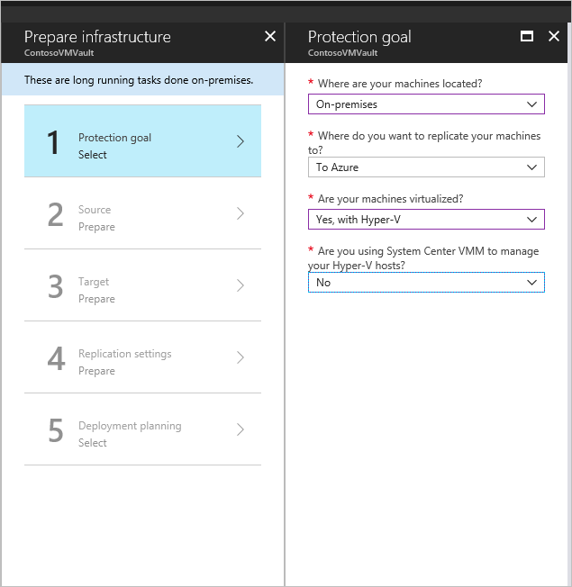

# Set up disaster recovery of on-premises Hyper-V VMs to Azure

The [Azure Site Recovery](site-recovery-overview.md) service contributes to your disaster recovery strategy by managing and orchestrating replication, failover, and failback of on-premises machines, and Azure virtual machines (VMs).

This tutorial shows you how to set up disaster recovery of on-premises Hyper-V VMs to Azure. The tutorial is relevant for Hyper-V VMs that are not managed by System Center Virtual Machine Manager (VMM). In this tutorial, you learn how to:

> [!div class="checklist"]
> * Select your replication source and target.
> * Set up the source replication environment, including on-premises Site Recovery components, and the target replication environment.
> * Create a replication policy.
> * Enable replication for a VM.

This is the third tutorial in a series. This tutorial assumes that you have already completed the tasks in the previous tutorials:

1. [Prepare Azure](tutorial-prepare-azure.md)
2. [Prepare on-premises Hyper-V](tutorial-prepare-on-premises-hyper-v.md)

Before you start, it's helpful to [review the architecture](concepts-hyper-v-to-azure-architecture.md) for this disaster recovery scenario.

## Select a replication goal

1. In **All Services** > **Recovery Services vaults**, click the name of the vault we prepared in the previous tutorial, **ContosoVMVault**.
2. In **Getting Started**, click **Site Recovery**. Then click **Prepare Infrastructure**
3. In **Protection goal** > **Where are your machines located**, select **On-premises**.
4. In **Where do you want to replicate your machines**, select **To Azure**.
5. In **Are your machines virtualized**, select **Yes, with Hyper-V**.
6. In **Are you using System Center VMM**, select **No**. Then click **OK**.

    

## Set up the source environment

To set up the source environment, you add Hyper-V hosts to a Hyper-V site, download and install the Azure Site Recovery Provider and the Azure Recovery Services agent, and register the Hyper-V site in the vault. 

1. In **Prepare Infrastructure**, click **Source**.
2. Click **+Hyper-V Site**, and specify the name of the site we created in the previous tutorial, **ContosoHyperVSite**.
3. Click **+Hyper-V Server**.
4. Download the Provider setup file.
5. Download the vault registration key. You need this when you run Provider setup. The key is valid for five days after you generate it.

    
    

### Install the Provider

Run the Provider setup file (AzureSiteRecoveryProvider.exe) on each Hyper-V host you added to the **ContosoHyperVSite** site. Setup installs the Azure Site Recovery Provider and Recovery Services agent, on each Hyper-V host.

1. In the Azure Site Recovery Provider Setup wizard > **Microsoft Update**, opt in to use Microsoft Update to check for Provider updates.
2. In **Installation**, accept the default installation location for the Provider and agent, and click **Install**.
3. After installation, in the Microsoft Azure Site Recovery Registration Wizard > **Vault Settings**, click **Browse**, and in **Key File**, select the vault key file that you downloaded. 
4. Specify the Azure Site Recovery subscription, the vault name (**ContosoVMVault**), and the Hyper-V site (**ContosoHyperVSite**) to which the Hyper-V server belongs.
5. In **Proxy Settings**, select **Connect directly to Azure Site Recovery without a proxy**.
6. In **Registration**, After the server is registered in the vault, click **Finish**.

Metadata from the Hyper-V server is retrieved by Azure Site Recovery, and the server is displayed in **Site Recovery Infrastructure** > **Hyper-V Hosts**. This can take up to 30 minutes.

## Set up the target environment

Select and verify target resources. 

1. Click **Prepare infrastructure** > **Target**.
2. Select the subscription and the resource group **ContosoRG**, in which the Azure VMs will be created after failover.
3. Select the **Resource Manager"** deployment model.

Site Recovery checks that you have one or more compatible Azure storage accounts and networks.

## Set up a replication policy

1. Click **Prepare infrastructure** > **Replication Settings** > **+Create and associate**.
2. In **Create and associate policy**, specify a policy name, **ContosoReplicationPolicy**.
3. Leave the default settings and click **OK**.
    - **Copy frequency** indicates that delta data (after initial replication) will replicate every five minutes.
    - **Recovery point retention** indicates that the retention windows for each recovery point will be two two hours.
    - **App-consistent snapshot frequency** indicates that recovery points containing app-consistent snapshots will be created every hour.
    - **Initial replication start time**, indicates that initial replication will start immediately.
4. After the policy is created, click **OK**. When you create a new policy it's automatically associated with the specified Hyper-V site (**ContosoHyperVSite**)

    

## Enable replication

1. In **Replicate application**, click **Source**. 
2. In **Source**, select the **ContosoHyperVSite** site. Then click **OK**.
3. In **Target**, verify Azure as the target, the vault subscription, and the **Resource Manager** deployment model.
4. Select the **contosovmsacct1910171607** storage account we created in the previous tutorial for replicated data, and the **ContosoASRnet** network, in which Azure VMs will be located after failover.
5. In **Virtual machines** > **Select**, select the VM you want to replicate. Then click **OK**.

 You can track progress of the **Enable Protection** action in **Jobs** > **Site Recovery jobs**. After the **Finalize Protection** job completes, the initial replication is complete, and the virtual machine is ready for failover.

## Next steps
[Run a disaster recovery drill](tutorial-dr-drill-azure.md)
