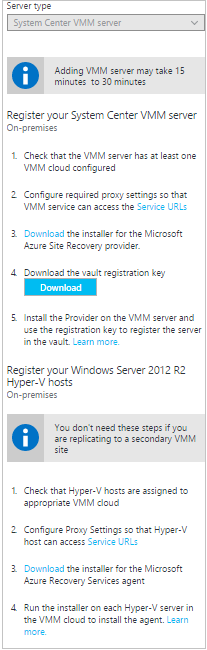
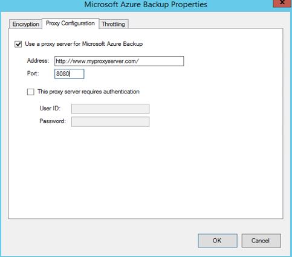
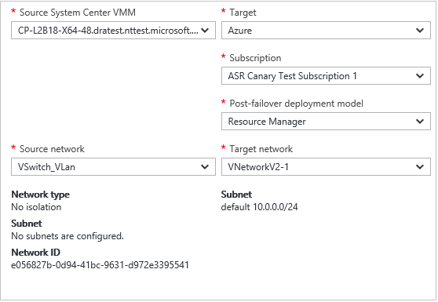
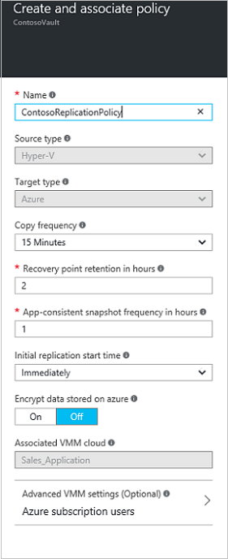

# Set up disaster recovery to Azure for on-premises Hyper-V VMs

The [Azure Site Recovery](site-recovery-overview.md) service manages and orchestrates replication, failover, and failback of on-premises machines, and Azure virtual machines (VMs).

This tutorial shows you how to set up disaster recovery of on-premises Hyper-V VMs to Azure. The tutorial is relevant for Hyper-V VMs that are managed in System Center Virtual Machine Manager (VMM) clouds, and those that aren't. In this tutorial, you learn how to:

> [!div class="checklist"]
> * Set up Azure and on-premises prerequisites
> * Create a Recovery Services vault for Site Recovery 
> * Set up the source and target replication environments 
> * Set up network mapping (if Hyper-V is managed by System Center VMM)
> * Create a replication policy
> * Enable replication for a VM

## Prerequisites

To complete this tutorial:

- [Review](concepts-hyper-v-to-azure-architecture.md) the scenario architecture and components for Hyper-V disaster recovery.
- [Review](site-recovery-support-matrix-to-azure.md) the support requirements for all components.
- Check that VMs you want to replicate comply with [Azure VM requirements](site-recovery-support-matrix-to-azure.md#failed-over-azure-vm-requirements).
- Prepare Azure by creating an Azure subscription, an Azure virtual network, and a storage account.
- Prepare on-premises Hyper-V hosts, and VMM servers if relevant.

### Set up an Azure account

Get a Microsoft [Azure account](http://azure.microsoft.com/).

- You can start with a [free trial](https://azure.microsoft.com/pricing/free-trial/).
- Find out about supported regions under Geographic Availability, in [Azure Site Recovery Pricing Details]((https://azure.microsoft.com/pricing/details/site-recovery/).
- Learn about [Site Recovery pricing](site-recovery-faq.md#pricing), and get [pricing details](https://azure.microsoft.com/pricing/details/site-recovery/).

### Verify Azure account permissions

Make sure your Azure account has permissions for replication of VMs to Azure.

- Review the [permissions](site-recovery-role-based-linked-access-control.md) you need.
- Verify/add permissions for [role-based access](../active-directory/role-based-access-control-configure.md).

### Set up an Azure network

Set up an [Azure network](../virtual-network/virtual-network-get-started-vnet-subnet.md).

- Azure VMs are placed in this network when they're created after failover.
- The network should be in the same region as the Recovery Services vault.

## Set up an Azure storage account

Set up an [Azure storage account](../storage/common/storage-create-storage-account.md#create-a-storage-account).

- Site Recovery replicates on-premises machines to Azure storage. Azure VMs are created from the storage after failover occurs.
- The storage account must be in the same region as the Recovery Services vault.
- The storage account can be standard or [premium](../storage/common/storage-premium-storage.md).
- If you set up a premium account, you need an additional standard account for log data.
- You can't replicate to premium accounts in Central and South India.

### Prepare Hyper-V hosts

1. Verify that Hyper-V hosts meet [support requirements](site-recovery-support-matrix-to-azure.md#support-for-datacenter-management-servers).
2. Make sure that hosts can access these URLs:

    [!INCLUDE [site-recovery-URLS](../../includes/site-recovery-URLS.md)]
    
    - Any IP address-based firewall rules should allow communication to Azure.
    - Allow the [Azure Datacenter IP Ranges](https://www.microsoft.com/download/confirmation.aspx?id=41653), and the HTTPS (443) port.
    - Allow IP address ranges for the Azure region of your subscription, and for West US (used for access control and identity management).

### Prepare VMM servers

If Hyper-V hosts are managed by VMM, you need to prepare the on-premises VMM server. 

- Verify that the VMM server meets [support requirements](site-recovery-support-matrix-to-azure.md#support-for-datacenter-management-servers).
- Make sure the VMM server has a least one cloud, with one or more host groups. The Hyper-V host on which VMs are running should be located in the cloud.
- The VMM server needs internet access, with access to the following URLs:

    [!INCLUDE [site-recovery-URLS](../../includes/site-recovery-URLS.md)]
    
    - Any IP address-based firewall rules should allow communication to Azure.
    - Allow the [Azure Datacenter IP Ranges](https://www.microsoft.com/download/confirmation.aspx?id=41653), and the HTTPS (443) port.
    - Allow IP address ranges for the Azure region of your subscription, and for West US (used for Access Control and Identity Management).
- Prepare the VMM server for network mapping.

#### Prepare VMM for network mapping

If you're using VMM, [network mapping](site-recovery-network-mapping.md) maps between on-premises VMM VM networks and Azure virtual networks. Mapping ensures that Azure VMs are connected to the right network when they're created after failover.

Prepare VMM for network mapping as follows:

1. Make sure you have a [VMM logical network](https://docs.microsoft.com/system-center/vmm/network-logical) that's associated with the cloud in which the Hyper-V hosts are located.
2. Ensure you have a [VM network](https://docs.microsoft.com/system-center/vmm/network-virtual) linked to the logical network.
3. Connect the VMs to the VM network.

## Create a Recovery Services vault

[!INCLUDE [site-recovery-create-vault](../../includes/site-recovery-create-vault.md)]

## Select a protection goal

Select what to replicate, and where to replicate it to.

1. In the vault, click **Site Recovery** > **Prepare Infrastructure** > **Protection goal**.
2. In **Protection goal**, select **To Azure**> **Yes, with Hyper-V**. 
    - If Hyper-V hosts aren't managed by VMM, select **No** to confirm you're not using VMM.
    - If hosts are managed in VMM clouds, select **Yes**.

## Set up the source environment

Install the Azure Site Recovery Provider and the Azure Recovery Services agent, and register on-premises servers in the vault.

1. In **Prepare Infrastructure**, click **Source**. 
    - If you're not using VMM, click **+Hyper-V Site**, and specify a site name. Then click **+Hyper-V Server**, to add a host or cluster to the site.
    - If you are using VMM, in **Prepare source**, click **+ VMM** to add a VMM server. In **Add Server**, check that **System Center VMM server** appears in **Server type**.
2. Download the Provider and agent:
    - **Without VMM**: If you're not using VMM, download the Recovery Service Provider installation file. Running this file installs the Provider, and the Recovery Services agent.
     
        

    - **With VMM**: If you're using VMM, download the Provider and the agent installation files separately. The Provider is installed on the VMM server. The agent is installed on each Hyper-V host.
    - 
        
3. Download the vault registration key. You need this when you run Provider setup. The key is valid for five days after you generate it.

### Run Provider setup

1. Run the Provider setup file:
    - **Without VMM**: If you're not using VMM, run setup on each Hyper-V host you added to the Hyper-V site. For a cluster, run setup on each cluster node to register and install it.
    - **With VMM**: If you're using VMM, run setup on the VMM server
2. In **Microsoft Update**, you can opt in for updates. If you do, Provider updates are installed in accordance with your Microsoft Update policy.
3. In **Installation**, accept or modify the default Provider installation location, and click **Install**.
4. In **Vault Settings**, click **Browse** to select the vault key file that you downloaded. Specify the Azure Site Recovery subscription, the vault name, and the Hyper-V site to which the Hyper-V server belongs.

    

5. In **Proxy Settings**, specify how the Provider running on the VMM server or Hyper-V host connects to Site Recovery over the internet.

	* For a direct connection, select **Connect directly to Azure Site Recovery without a proxy**.
	* For a proxy, select **Connect to Azure Site Recovery using a proxy server**. Specify the proxy address, port, and credentials if needed.
6. After installation finishes, click **Register** to register the server in the vault.

After registration finishes, metadata from the server is retrieved by Azure Site Recovery, and the server is displayed in **Site Recovery Infrastructure**.

## Install the agent on Hyper-V host (with VMM)

If you're using VMM in your deployment, run the Recovery Services agent setup file on each Hyper-V host.

1. In The Setup Wizard > **Prerequisites Check**, click **Next**. Any missing prerequisites will be automatically installed.

    
3. In **Installation Settings**, accept or modify the installation location, and the cache location. The cache drive needs at least 5 GB of storage. We recommend a drive with 600 GB or more of free space. Then click **Install**.
4. After installation is complete, click **Close** to finish the wizard.

#### Set up internet proxy access to Site Recovery from Hyper-V hosts (with VMM)

The Recovery Services agent running on Hyper-V hosts needs internet access to Azure for VM replication. If you're accessing the internet through a proxy, set it up as follows:

1. Open the Microsoft Azure Backup MMC snap-in on the Hyper-V host. By default, a shortcut for Microsoft Azure Backup is available on the desktop or in C:\Program Files\Microsoft Azure Recovery Services Agent\bin\wabadmin.
2. In the snap-in, click **Change Properties**.
3. On the **Proxy Configuration** tab, specify proxy server information.

    
4. Check that the agent can reach the URLs described in the [prerequisites](#prepare-hyper-v-hosts).

## Set up the target environment

Select and verify target resources. 

1. Click **Prepare infrastructure** > **Target**.
2. Select the subscription and the resource group in which the Azure VMs will be created after failover. Choose the deployment model that you want to use in Azure for the VMs.

3. Site Recovery checks that you have one or more compatible Azure storage accounts and networks.

## Configure network mapping (with VMM)

If you're using VMM, set up network mapping.

1. In **Site Recovery Infrastructure** > **Network mappings** > **Network Mapping**, click the **+Network Mapping** icon.
2. In **Add network mapping**, select the source VMM server. Select **Azure** as the target.
3. Verify the subscription and the deployment model after failover.
4. In **Source network**, select the source on-premises VM network.
5. In **Target network**, select the Azure network in which replica Azure VMs will be located when they're created after failover. Then click **OK**.

    

## Create a replication policy

1. Click **Prepare infrastructure** > **Replication Settings** > **+Create and associate**.
2. In **Create and associate policy**, specify a policy name.
3. In **Copy frequency**, specify how often you want to replicate delta data after the initial replication (every 30 seconds, 5 or 15 minutes).

	> [!NOTE]
	>  A 30 second frequency isn't supported when replicating to premium storage. The limitation is determined by the number of snapshots per blob (100) supported by premium storage. [Learn more](../storage/common/storage-premium-storage.md#snapshots-and-copy-blob)

4. In **Recovery point retention**, specify how long the retention window will be (in hours) for each recovery point. Protected machines can be recovered to any point within a window.
5. In **App-consistent snapshot frequency**, specify how frequently (1-12 hours) recovery points containing application-consistent snapshots will be created. Hyper-V uses two types of snapshots:
    - **Standard snapshot**: Provides an incremental snapshot of the entire virtual machine.
    - **App-consistent snapshot**: Takes a point-in-time snapshot of the application data inside the VM. Volume Shadow Copy Service (VSS) ensures that apps are in a consistent state when the snapshot is taken. Enabling application-consistent snapshots, affects app performance on source VMs. Set a value that's less than the number of additional recovery points you configure.
6. In **Initial replication start time**, indicate when to start the initial replication. Replication occurs over your internet bandwidth so you might want to schedule it outside peak hours.
7. In **Encrypt data stored on Azure**, specify whether to encrypt at rest data in Azure storage. Then click **OK**.

    

When you create a new policy it's automatically associated with the VMM cloud, or Hyper-V site.

## Enable replication

1. Click **Replicate application** > **Source**. 
2. In **Source**, select the Hyper-V site/VMM server/cloud. Then click **OK**.
3. In **Target**, verify Azure as the target, the vault subscription, and the model you want to use in Azure after failover.
4. Select the storage account for replicated data, and the Azure network in which Azure VMs will be located after failover.
5. In **Virtual machines** > **Select**, select the VMs you want to replicate. Then click **OK**.

 You can track progress of the **Enable Protection** action in **Jobs** > **Site Recovery jobs**. After the **Finalize Protection** job completes, the initial replication is complete, and the virtual machine is ready for failover.

## Next steps
[Run a disaster recovery drill](site-recovery-test-failover-to-azure.md)
