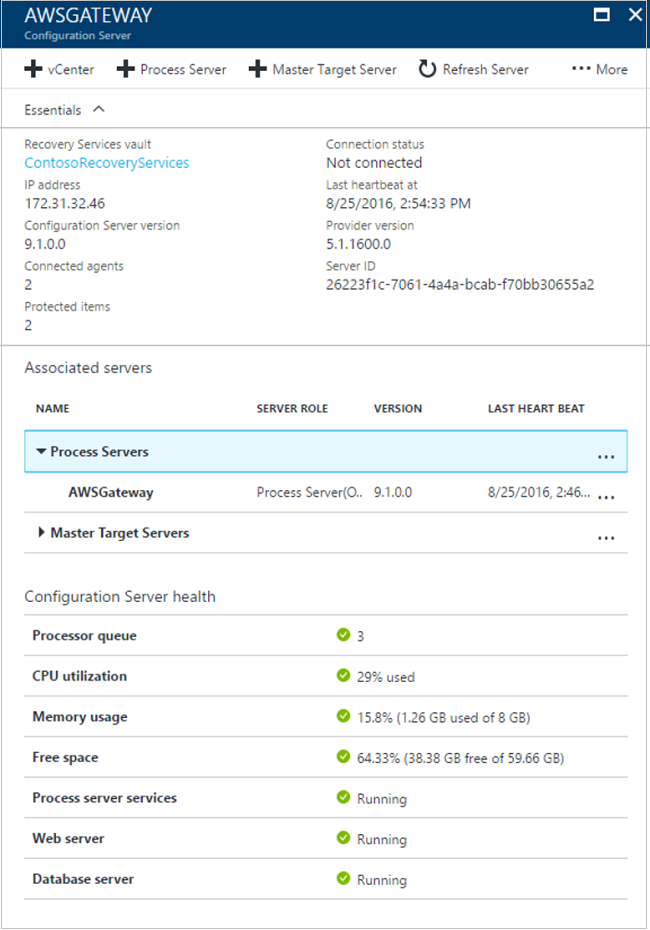

# Migrate Amazon Web Services (AWS) VMs to Azure

The [Azure Site Recovery](site-recovery-overview.md) service manages and orchestrates replication, failover, and failback of on-premises machines, and Azure virtual machines (VMs).

This tutorial shows you how to migrate Amazon Web Services (AWS) virtual machines (VMs), to Azure with Site Recovery. In this tutorial, you learn how to:

> [!div class="checklist"]
> * Set up prerequisites for the deployment
> * Create a Recovery Services vault for Site Recovery 
> * Deploy a configuration server in AWS
> * Enable replication for VMs
> * Run a disaster recovery drill to make sure everything's working
> * Run a one-time failover to Azure

## Overview

You migrate a VM by enabling replication for it, and running a failover from AWS to Azure. Migration doesn't include ongoing replication, or failback of machines from Azure. 

## Prerequisites

Here's what you need to do for this tutorial.

- Prepare Azure, including an Azure subscription, an Azure virtual network, and a storage account.
- Prepare for installation of the Mobility service on each server you want to replicate.
- Make sure your account has permissions to create VMs.
- Make sure the EC2 instances you want to migrate are running one of these operating systems:
    - Windows (64-bit only)
        - Windows Server 2008 R2 from SP1 onwards. (The server must have only Citrix PV or AWS PV drivers. Instances running RedHat PV drivers aren't supported)
        - Windows Server 2012
        - Windows Server 2012 R2
    - Linux (64-bit only)
        - Red Hat Enterprise Linux 6.7 (HVM virtualized instances only).
- Prepare for installation of the Mobility service on AWS instance that you want to replicate.
- As part of the deployment you need to set up a Site Recovery configuration server on an EC2 VM. Make sure you have a VM ready, and check that the security group on EC2 instances that you want to migrate allow communication between them and the VM you'll use as the configuration server.
- [Check](site-recovery-support-matrix-to-azure.md#failed-over-azure-vm-requirements) that your EC2 instances match Azure requirements for disk size, VM name etc.

### Set up an Azure account

Get a Microsoft [Azure account](http://azure.microsoft.com/).

- You can start with a [free trial](https://azure.microsoft.com/pricing/free-trial/).
- Learn about supported regions for Site Recovery, under Geographic Availability in [Azure Site Recovery Pricing Details](https://azure.microsoft.com/pricing/details/site-recovery/).
- Learn about [Site Recovery pricing](site-recovery-faq.md#pricing), and get [pricing details](https://azure.microsoft.com/pricing/details/site-recovery/).

### Verify Azure account permissions

Make sure your Azure account has permissions for replication of VMs to Azure.

- Review the [permissions](site-recovery-role-based-linked-access-control.md#permissions-required-to-enable-replication-for-new-virtual-machines) you need.
- Verify/add permissions for [role-based access](../active-directory/role-based-access-control-configure.md).

### Set up an Azure network

Set up an [Azure network](../virtual-network/virtual-network-get-started-vnet-subnet.md).

- Azure VMs are placed in this network when they're created after failover.
- The network should be in the same region as the Recovery Services vault.

### Set up an Azure storage account

Set up an [Azure storage account](../storage/common/storage-create-storage-account.md#create-a-storage-account).

- Site Recovery replicates the AWS VMs to Azure storage. Azure VMs are created from the storage after failover occurs.
- The storage account must be in the same region as the Recovery Services vault.
- The storage account can be standard or [premium](../storage/common/storage-premium-storage.md).
- If you set up a premium account, you will also need an additional standard account for log data.
- You can't replicate to premium accounts in Central and South India.

### Prepare an account for Mobility service installation

The Mobility service must be installed on each AWS instance that you want to replicate. Site Recovery installs this service automatically when you enable replication for the VM. To install automatically, you need to prepare an account that Site Recovery will use to access the VM.

- You can use a domain or local account.
- For Windows VMs, if you're not using a domain account, disable Remote User Access control on the local machine. To do this, in the register under **HKEY_LOCAL_MACHINE\SOFTWARE\Microsoft\Windows\CurrentVersion\Policies\System**, add the DWORD entry **LocalAccountTokenFilterPolicy**, with a value of 1.
- To add the registry entry to disable the setting from a CLI, type:
        ``REG ADD HKEY_LOCAL_MACHINE\SOFTWARE\Microsoft\Windows\CurrentVersion\Policies\System /v LocalAccountTokenFilterPolicy /t REG_DWORD /d 1.``
- For Linux, the account should be root on the source Linux server.

## Create a Recovery Services vault

[!INCLUDE [site-recovery-create-vault](../../includes/site-recovery-create-vault.md)]

## Select a protection goal

Select what you want to replicate, and where you want to replicate to.

1. Click **Recovery Services vaults** > vault.
2. In the Resource Menu, click **Site Recovery** > **Prepare Infrastructure** > **Protection goal**.
3. In **Protection goal**, select **To Azure** > **Not virtualized/Other**.

## Set up the source environment

Set up the configuration server, register it in the vault, and discover VMs.

1. Click **Site Recovery** > **Prepare Infrastructure** > **Source**.
2. If you don’t have a configuration server, click **+Configuration server**.
3. In **Add Server**, check that **Configuration Server** appears in **Server type**.
4. Download the Site Recovery Unified Setup installation file to the EC2 VM you want to use.
5. Download the vault registration key. You need this when you run Unified Setup. The key is valid for five days after you generate it.

### Register the configuration server in the vault

Do the following before you start: 

- On the configuration server VM, make sure that the system clock is synchronized with a [Time Server](https://technet.microsoft.com/windows-server-docs/identity/ad-ds/get-started/windows-time-service/windows-time-service). It should match. If it's 15 minutes in front or behind, setup might fail.
- Make sure TLS 1.0 is enabled on the machine.
- Make sure the machine can access these URLs:
    [!INCLUDE [site-recovery-URLS](../../includes/site-recovery-URLS.md)]
- Any IP address-based firewall rules should allow communication to Azure.
- Allow the [Azure Datacenter IP Ranges](https://www.microsoft.com/download/confirmation.aspx?id=41653), and the HTTPS (443) port.
- Allow IP address ranges for the Azure region of your subscription, and for West US (used for Access Control and Identity Management).

Run Unified Setup as a Local Administrator, to install the configuration server, the process server, and the master target server.

[!INCLUDE [site-recovery-add-configuration-server](../../includes/site-recovery-add-configuration-server.md)]

After registration finishes, the configuration server is displayed on the **Settings** > **Servers** page in the vault. It might take up to 15 minutes for it to appear. After it appears, check that it can communicate with the instances you want to migrate.

## Set up the target environment

Select and verify target resources.

1. Click **Prepare infrastructure** > **Target**, and select the Azure subscription you want to use.
2. Specify the target deployment model.
3. Site Recovery checks that you have one or more compatible Azure storage accounts and networks.

## Create a replication policy

You need to create a replication policy, before you can enable replication

1. To create a new replication policy, click **Site Recovery infrastructure** > **Replication Policies** > **+Replication Policy**.
2. In **Create replication policy**, specify a policy name.
3. Leave the default settings, and click **OK** to create the policy. The new policy is automatically associated with the configuration server. 

## Enable replication

Enable replication for each VM you want to migrate.

- Site Recovery will install the Mobility service when replication is enabled.
- When you enable replication for a VM, it can take 15 minutes or longer for changes to take effect and appear in the portal.

1. Click **Replicate application** > **Source**.
2. In **Source**, select the configuration server.
3. In **Machine type**, select **Physical machines**.
4. Select the process server (the configuration server). Then click **OK**.
5. In **Target**, select the subscription and the resource group in which you want to create the Azure VMs after failover. Choose the deployment model that you want to use in Azure (classic or resource management).
6. Select the Azure storage account you want to use for replicating data. 
7. Select the Azure network and subnet to which Azure VMs will connect, when they're created after failover.
8. Select **Configure now for selected machines**, to apply the network setting to all machines you select for protection. Select **Configure later** to select the Azure network per machine. 
9. In **Physical Machines**, and click **+Physical machine**. Specify the name and IP address. Select the operating system of the machine you want to replicate. It takes a few minutes for the servers to be discovered and listed. 
10. In **Properties** > **Configure properties**, select the account that will be used by the process server to automatically install the Mobility service on the machine.
11. In **Replication settings** > **Configure replication settings**, verify that the correct replication policy is selected. 
12. Click **Enable Replication**. You can track progress of the **Enable Protection** job in **Settings** > **Jobs** > **Site Recovery Jobs**. After the **Finalize Protection** job runs the machine is ready for failover.

To monitor VMs you add, you can check the last discovered time for them in **Configuration Servers** > **Last Contact At**. To add machines without waiting for a scheduled discovery time, highlight the configuration server (don’t click it), and click **Refresh**.

## Run a disaster recovery drill

Run a [test failover](tutorial-dr-drill-azure.md) to make sure everything's working as expected.

## Fail over to Azure

Run a fail over for EC2 instances. 

R1. In **Settings** > **Replicated items** click the AWS instances > **Failover**.
2. In **Failover** select a **Recovery Point** to fail over to. Select the latest recovery point.
3. Select **Shut down machine before beginning failover** if you want Site Recovery to attempt to do a shutdown of source virtual machines before triggering the failover. Failover continues even if shutdown fails. You can follow the failover progress on the **Jobs** page.
4. Check that the VM appears in **Replicated items**. 
5. Right-click each VM > **Complete Migration**. This finishes the migration process, stops replication for the AWS VM, and stops Site Recovery billing for the VM.

    

> [!WARNING]
> **Don't cancel a failover in progress**: Before failover is started, VM replication is stopped. If you cancel a failover in progress, failover stops, but the VM won't replicate again.  

    

## Next steps

[Learn about](site-recovery-azure-to-azure-after-migration.md) replicating Azure VMs to another region after migration to Azure.
