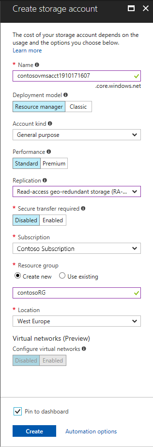

# Prepare Azure resources for disaster recovery of on-premises machines

 [Azure Site Recovery](site-recovery-overview.md) helps business continuity and disaster recovery (BCDR) by keeping business apps running during planned and unplanned outages. Site Recovery manages and orchestrates disaster recovery of on-premises machines and Azure virtual machines (VMs), including replication, failover, and recovery.

This tutorial is the first in a series that describes how to set up disaster recovery for on-premises Hyper-V VMs.

> [!NOTE]
> We design tutorials to show the simplest deployment path for a scenario. These tutorials use default options when possible, and don't show all possible settings and paths. For more information, see the "How To" section for each corresponding scenario.

This tutorial shows you how to prepare Azure components when you want to replicate on-premises VMs (Hyper-V) to Azure. You'll learn how to:

> [!div class="checklist"]
> * Verify that your Azure account has replication permissions.
> * Create an Azure storage account, which stores images of replicated machines.
> * Create a Recovery Services vault, which stores metadata and configuration information for VMs and other replication components.
> * Set up an Azure network. When Azure VMs are created after failover, they're joined to this network.

If you don't have an Azure subscription, create a [free account](https://azure.microsoft.com/pricing/free-trial/) before you begin.

## Sign in

Sign in to the [Azure portal](https://portal.azure.com).

## Verify account permissions

If you just created a free Azure account, you're the administrator for that subscription. If you're not the administrator, work with the administrator to assign the permissions you need. To enable replication for a new virtual machine, you must have permission to:

- Create a VM in the selected resource group.
- Create a VM in the selected virtual network.
- Write to the selected storage account.

To complete these tasks, your account should be assigned the Virtual Machine Contributor built-in role. To manage Site Recovery operations in a vault, your account should be assigned the Site Recovery Contributor built-in role.

## Create a storage account

Images of replicated machines are held in Azure storage. Azure VMs are created from the storage when you fail over from on-premises to Azure. The storage account must be in the same region as the Recovery Services vault.

1. In the [Azure portal](https://portal.azure.com) menu, select **Create a resource** > **Storage** > **Storage account - blob, file, table, queue**.
2. In **Create storage account**, enter a name for the account.  The name you choose must be unique within Azure, be from 3 to 24 characters long, and only use lowercase letters and numbers. For this tutorial, use **contosovmsacct1910171607**.
3. In **Deployment model**, select **Resource Manager**.
4. In **Account kind**, select **Storage (general-purpose v1)**. Don't select blob storage.
5. In **Replication**, select the default **Read-access geo-redundant storage** for storage redundancy. Leave the Secure transfer required setting as Disabled.
6. In **Performance**, select **Standard**. Next, in **Access tier**, select the default option of **Hot**.
7. In **Subscription**, choose the subscription in which you want to create the new storage account.
8. In **Resource group**, enter a new resource group. An Azure resource group is a logical container in which Azure resources are deployed and managed. For this tutorial, use **ContosoRG**.
9. In **Location**, choose the geographic location for your storage account. For this tutorial, use **West Europe**.
10. Select **Create** to create the storage account.

   

## Create a recovery services vault

1. In the Azure portal, select **+Create a resource**, and then search the Azure Marketplace for Recovery Services.
2. Select **Backup and Site Recovery (OMS)**. Next, on the **Backup and Site Recovery** page, select **Create**.
1. In **Recovery services vault > Name**, enter a friendly name to identify the vault. For this tutorial, use **ContosoVMVault**.
2. In **Resource group**, select an existing resource group or create a new one. For this tutorial, use **contosoRG**.
3. In **Location**, select the region where the vault should be located. For this tutorial, use **West Europe**.
4. To quickly access the vault from the dashboard, select **Pin to dashboard** > **Create**.

The new vault appears on **Dashboard** > **All resources**, and on the main **Recovery Services vaults** page.

## Set up an Azure network

When Azure VMs are created from storage after failover, they're joined to this network.

1. In the [Azure portal](https://portal.azure.com), select **Create a resource** > **Networking** > **Virtual network**. Leave Resource Manager selected as the deployment model.
2. In **Name**, enter a network name. The name must be unique within the Azure resource group. For this tutorial, use **ContosoASRnet**.
3. Specify the resource group in which to create the network. For this tutorial, use the existing resource group **contosoRG**.
4. In **Address range**, enter **10.0.0.0/24** as the range for the network. There's no subnet for this network.
5. In **Subscription**, select the subscription in which to create the network.
6. In **Location**, choose **West Europe**. The network must be in the same region as the Recovery Services vault.
7. Leave the default options of basic DDoS protection, with no service endpoint on the network.
8. Select **Create**.

The virtual network takes a few seconds to create. After it's created, you'll see it in the Azure portal dashboard.

## Useful links

Learn about:
- [Azure networks](https://docs.microsoft.com/azure/virtual-network/virtual-networks-overview)
- [Managed disks](https://docs.microsoft.com/azure/virtual-machines/windows/managed-disks-overview)

## Next steps

> [!div class="nextstepaction"]
> [Prepare the on-premises Hyper-V infrastructure for disaster recovery to Azure](hyper-v-prepare-on-premises-tutorial.md)
