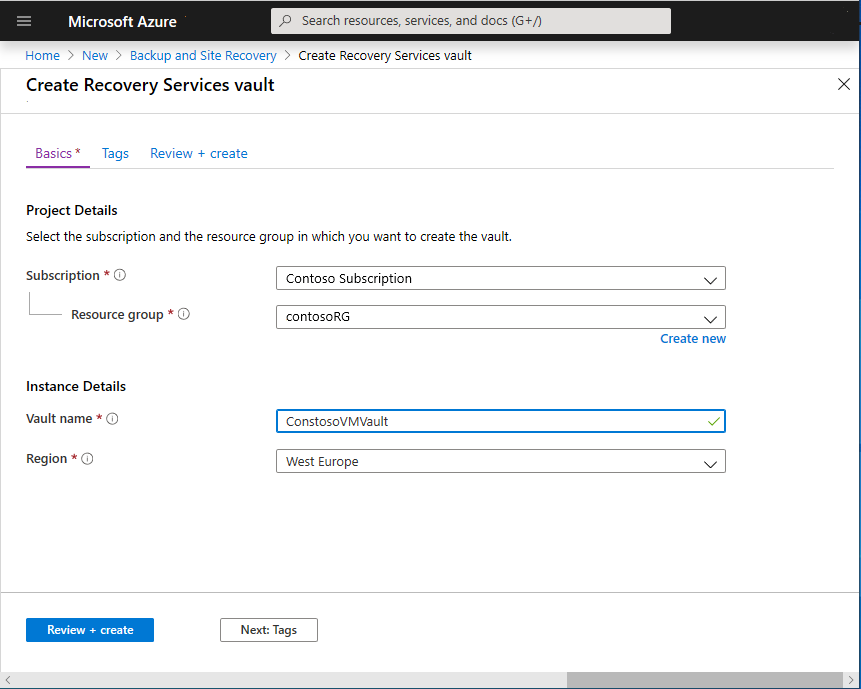
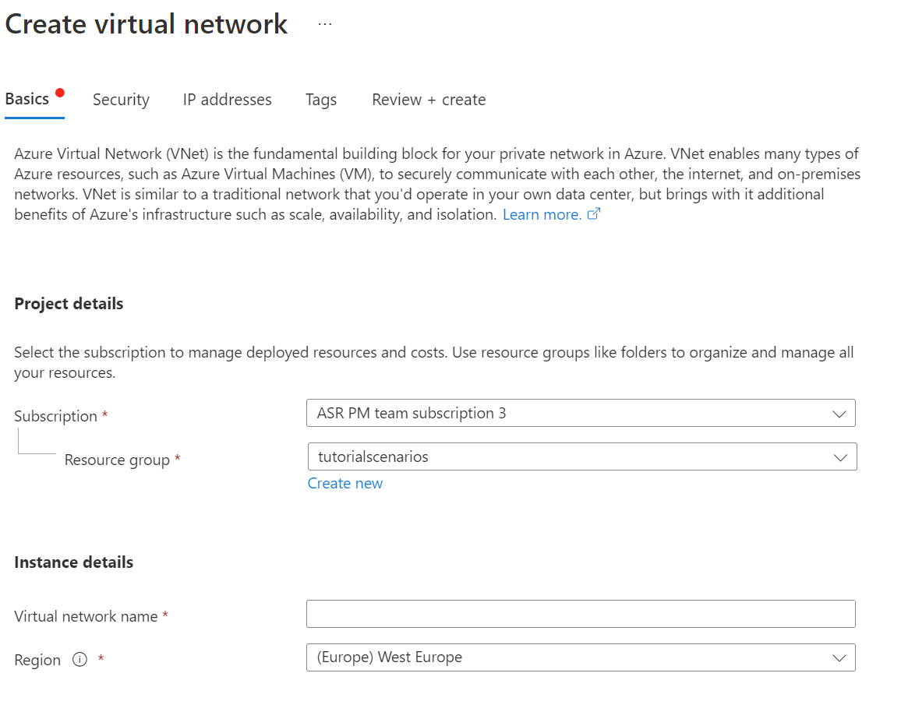

# Prepare Azure resources for disaster recovery of on-premises machines

This article describes how to prepare Azure resources and components so that you can set up disaster recovery of on-premises VMware VMs, Hyper-V VMs, or Windows/Linux physical servers to Azure, using the [Azure Site Recovery](site-recovery-overview.md) service.

This article is the first tutorial in a series that shows you how to set up disaster recovery for on-premises VMs. 

In this tutorial, you learn how to:

> [!div class="checklist"]
> * Verify that the Azure account has replication permissions.
> * Create a Recovery Services vault. A vault holds metadata and configuration information for VMs, and other replication components.
> * Set up an Azure virtual network (VNet). When Azure VMs are created after failover, they're joined to this network.

> [!NOTE]
> Tutorials show you the simplest deployment path for a scenario. They use default options where possible, and don't show all possible settings and paths. For detailed instructions, review the article in the How To section of the Site Recovery Table of Contents.

## Before you start

- Review the architecture for [VMware](vmware-azure-architecture.md), [Hyper-V](hyper-v-azure-architecture.md), and [physical server](physical-azure-architecture.md) disaster recovery.
- Read common questions for [VMware](vmware-azure-common-questions.md) and [Hyper-V](hyper-v-azure-common-questions.md)

If you don't have an Azure subscription, create a [free account](https://azure.microsoft.com/pricing/free-trial/) before you begin. Then sign in to the [Azure portal](https://portal.azure.com).

## Verify account permissions

If you just created your free Azure account, you're the administrator of your subscription and you have the permissions you need. If you're not the subscription administrator, work with the administrator to assign the permissions you need. To enable replication for a new virtual machine, you must have permission to:

- Create a VM in the selected resource group.
- Create a VM in the selected virtual network.
- Write to an Azure storage account.
- Write to an Azure managed disk.

To complete these tasks your account should be assigned the Virtual Machine Contributor built-in role. In addition, to manage Site Recovery operations in a vault, your account should be assigned the Site Recovery Contributor build-in role.

## Create a Recovery Services vault

1. In the Azure portal, click **+Create a resource**, and search the Marketplace for **Recovery**.
2. Click **Backup and Site Recovery (OMS)**, and in the Backup and Site Recovery page, click **Create**. 
1. In **Recovery Services vault** > **Name**, enter a friendly name to identify the vault. For this set of tutorials we're using **ContosoVMVault**.
2. In **Resource group**, select an existing resource group or create a new one. For this tutorial we're using **contosoRG**.
3. In **Location**, select the region in which the vault should be located. We're using **West Europe**.
4. To quickly access the vault from the dashboard, select **Pin to dashboard** > **Create**.

   

   The new vault appears on **Dashboard** > **All resources**, and on the main **Recovery Services vaults** page.

## Set up an Azure network

On-premises machines are replicated to Azure managed disks. When failover occurs,  Azure VMs are created from these managed disks, and joined to the Azure network you specify in this procedure.

1. In the [Azure portal](https://portal.azure.com), select **Create a resource** > **Networking** > **Virtual network**.
2. Keep **Resource Manager** selected as the deployment model.
3. In **Name**, enter a network name. The name must be unique within the Azure resource group. We're using **ContosoASRnet** in this tutorial.
4. Specify the resource group in which the network will be created. We're using the existing resource group **contosoRG**.
5. In **Address range**, enter the range for the network. We're using **10.1.0.0/24**, and not using a subnet.
6. In **Subscription**, select the subscription in which to create the network.
7. In **Location**, select the same region as that in which the Recovery Services vault was created. In our tutorial it's **West Europe**. The network must be in the same region as the vault.
8. We're leaving the default options of basic DDoS protection, with no service endpoint on the network.
9. Click **Create**.

   

The virtual network takes a few seconds to create. After it's created, you see it in the Azure portal dashboard.

## Next steps

- For VMware disaster recovery, [prepare the on-premises VMware infrastructure](tutorial-prepare-on-premises-vmware.md).
- For Hyper-V disaster recovery, [prepare the on-premises Hyper-V servers](hyper-v-prepare-on-premises-tutorial.md).
- For physical server disaster recovery, [set up the configuration server and source environment](physical-azure-disaster-recovery.md)
- [Learn about](https://docs.microsoft.com/azure/virtual-network/virtual-networks-overview) Azure networks.
- [Learn about](https://docs.microsoft.com/azure/virtual-machines/windows/managed-disks-overview) managed disks.
