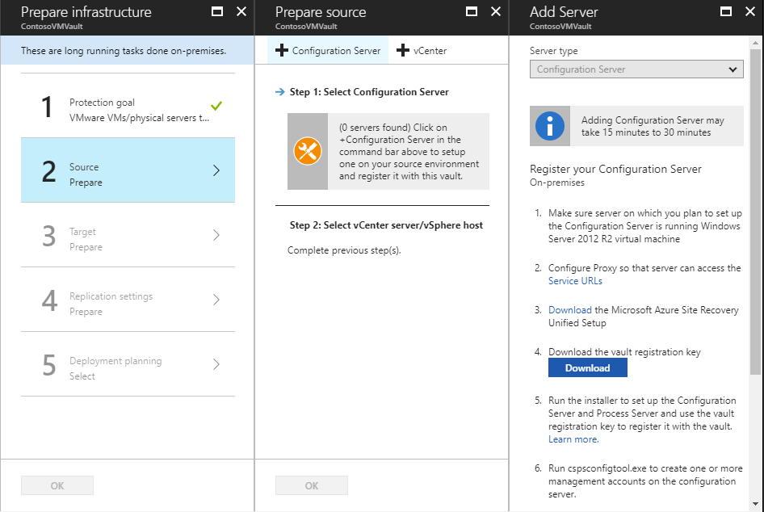
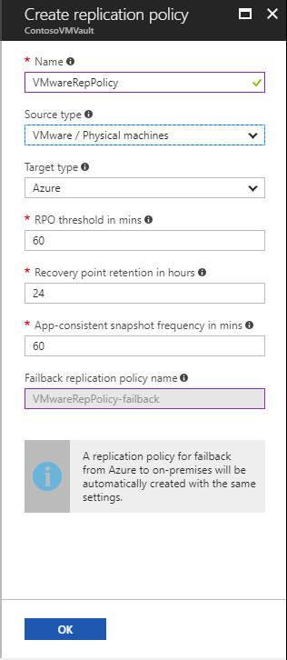

# Set up disaster recovery to Azure for on-premises VMware VMs

The [Azure Site Recovery](site-recovery-overview.md) service contributes to your disaster recovery strategy by managing and orchestrating replication, failover, and failback of on-premises machines, and Azure virtual machines (VMs).

This tutorial shows you how to set up disaster recovery to Azure for on-premises VMware VMs. In this tutorial, you learn how to:

> [!div class="checklist"]
> * Prepare the tutorial prerequisites
> * Create a Recovery Services vault for Site Recovery 
> * Set up the source and target replication environments 
> * Create a replication policy
> * Enable replication for a VM


## Prerequisites

To complete this tutorial:

- Make sure that you understand the [scenario architecture and components](concepts-vmware-to-azure-architecture.md).
- Review the [support requirements](site-recovery-support-matrix-to-azure.md) for all components.
- Make sure that VMs you want to replicate comply with [Azure VM requirements](site-recovery-support-matrix-to-azure.md#failed-over-azure-vm-requirements).
- Prepare Azure. You need an Azure subscription, an Azure virtual network, and a storage account.
- Prepare accounts for Site Recovery to work with on-premises VMware servers and VMs.
- Plan capacity. Figure out your capacity requirement with the VMware to Azure Deployment Planner Tool.


### Set up an Azure account

Get a Microsoft [Azure account](http://azure.microsoft.com/).

- You can start with a [free trial](https://azure.microsoft.com/pricing/free-trial/).
- Learn about [Site Recovery pricing](site-recovery-faq.md#pricing), and get [pricing details](https://azure.microsoft.com/pricing/details/site-recovery/).
- Find out which [regions are supported](https://azure.microsoft.com/pricing/details/site-recovery/) for Site Recovery.


### Verify Azure account permissions

Make sure your Azure account has the permissions it needs to replicate VMs.

- Review the [permissions](site-recovery-role-based-linked-access-control.md#permissions-required-to-enable-replication-for-new-virtual-machines) you need to replicate machines to Azure.
- Verify and modify [role-based access](../active-directory/role-based-access-control-configure.md) permissions. 


### Set up an Azure network

Set up an [Azure network](../virtual-network/virtual-network-get-started-vnet-subnet.md).
- Azure VMs are placed in this network when they're created after failover.
- The network should be in the same region as the Recovery Services vault.


### Set up an Azure storage account

Set up an [Azure storage account](../storage/common/storage-create-storage-account.md#create-a-storage-account).

- Site Recovery replicates on-premises machines to Azure storage. Azure VMs are created from the storage after failover occurs.
- The storage account must be in the same region as the Recovery Services vault.
- The storage account can be standard or [premium](../storage/common/storage-premium-storage.md).
- If you set up a premium account, you will also need an additional standard account for log data.


### Prepare an account for automatic discovery

Site Recovery needs access to VMware servers to:

- Automatically discover VMs.
- Orchestrate replication, failover, and failback. This includes operations such as creating and removing disks, and powering on VMs.

Create the account as follows:

1. To use a dedicated account, create a role at the vCenter level. Give the role a name. For example, **Azure__Site_Recovery**.
2. Assign the permissions summarized in the table below to the role. 
3. Create a user on the vCenter server if you have one, or on the vSphere host. Assign the role to the user. 


#### VMware account permissions

**Task** | **Role/Permissions** | **Details** 
--- | --- | --- 
**VM discovery** | Data Center object –> Propagate to Child Object, role=Read-only | At least a read-only user.<br/><br/> User assigned at datacenter level, and has access to all the objects in the datacenter.<br/><br/> To restrict access, assign the **No access** role with the **Propagate to child** object, to the child objects (vSphere hosts, datastores, VMs and networks).
**Full replication, failover, failback** |  Data Center object –> Propagate to Child Object, role=Azure_Site_Recovery<br/><br/> Datastore -> Allocate space, browse datastore, low-level file operations, remove file, update virtual machine files<br/><br/> Network -> Network assign<br/><br/> Resource -> Assign VM to resource pool, migrate powered off VM, migrate powered on VM<br/><br/> Tasks -> Create task, update task<br/><br/> Virtual machine -> Configuration<br/><br/> Virtual machine -> Interact -> answer question, device connection, configure CD media, configure floppy media, power off, power on, VMware tools install<br/><br/> Virtual machine -> Inventory -> Create, register, unregister<br/><br/> Virtual machine -> Provisioning -> Allow virtual machine download, allow virtual machine files upload<br/><br/> Virtual machine -> Snapshots -> Remove snapshots | User assigned at datacenter level, and has access to all the objects in the datacenter.<br/><br/> To restrict access, assign the **No access** role with the **Propagate to child** object, to the child objects (vSphere hosts, datastores, VMs and networks).


### Prepare an account for Mobility service installation

The Mobility service must be installed on each VM you want to replicate. Site Recovery installs this service automatically when you enable replication for the VM. For automatic installation, you need to prepare an account that Site Recovery will use to access the VM.

- You can use a domain or local account.
- For Windows VMs, if you're not using a domain account, disable Remote User Access control on the local machine:
    -  In the registery, under **HKEY_LOCAL_MACHINE\SOFTWARE\Microsoft\Windows\CurrentVersion\Policies\System**, add the DWORD entry **LocalAccountTokenFilterPolicy**, with a value of 1.
    - From a CLI, type:
        ``REG ADD HKEY_LOCAL_MACHINE\SOFTWARE\Microsoft\Windows\CurrentVersion\Policies\System /v LocalAccountTokenFilterPolicy /t REG_DWORD /d 1.``
- For Linux, the account should be root on the source Linux server.

### Figure out capacity requirements

1. Download the [Deployment Planner tool](https://aka.ms/asr-deployment-planner) for VMware replication. [Learn more](site-recovery-deployment-planner.md) about running the tool.
2. You can use the tool you gather information about compatible and incompatible VMs, disks per VM, and data churn per disk. The tool also covers network bandwidth requirements, and the Azure infrastructure needed for successful replication and test failover.

#### Example

1. Use a command like this example to collect profile information about your source environment.

    ```Example: Profile VMs for 30 days, and find the throughput from on-premises to Azure 
ASRDeploymentPlanner.exe -Operation StartProfiling -Directory “E:\vCenter1_ProfiledData” -Server vCenter1.contoso.com -VMListFile “E:\vCenter1_ProfiledData\ProfileVMList1.txt”  -NoOfDaysToProfile  30  -User vCenterUser1 -StorageAccountName  asrspfarm1 -StorageAccountKey Eby8vdM02xNOcqFlqUwJPLlmEtlCDXJ1OUzFT50uSRZ6IFsuFq2UVErCz4I6tq/K1SZFPTOtr/KBHBeksoGMGw==
    ```
2. use a command like this to generate a profile report:

    ``` ASRDeploymentPlanner.exe -Operation GenerateReport -Server vCenter1.contoso.com -Directory “\\PS1-W2K12R2\vCenter1_ProfiledData” -VMListFile \\PS1-W2K12R2\vCenter1_ProfiledData\ProfileVMList1.txt ```


## Create a vault

[!INCLUDE [site-recovery-create-vault](../../includes/site-recovery-create-vault.md)]

## Select a protection goal

Select what you want to replicate, and where you want to replicate to.

1. Click **Recovery Services vaults** > vault.
2. In the Resource Menu, click **Site Recovery** > **Prepare Infrastructure** > **Protection goal**.
3. In **Protection goal**, select **To Azure** > **Yes, with VMware vSphere Hypervisor**.

## Set up the source environment

Set up the configuration server, register it in the vault, and discover VMs.

1. Click **Site Recovery** > **Step 1: Prepare Infrastructure** > **Source**.
2. If you don’t have a configuration server, click **+Configuration server**.
3. In **Add Server**, check that **Configuration Server** appears in **Server type**.
4. Download the Site Recovery Unified Setup installation file.
5. Download the vault registration key. You need this when you run Unified Setup. The key is valid for five days after you generate it.

   


### Register the configuration server in the vault

Befre you start:

- On the configuration server VM, make sure that the system clock is synchronized with a [Time Server](https://technet.microsoft.com/windows-server-docs/identity/ad-ds/get-started/windows-time-service/windows-time-service). It should match. If it's more than 15 minutes in front or behind, setup might fail.
- Make sure TLS 1.0 is enabled on the VM.
- Make sure the VM can access these URLs:
        
    [!INCLUDE [site-recovery-URLS](../../includes/site-recovery-URLS.md)]

- IP address-based firewall rules should allow communication to Azure.
- Allow the [Azure Datacenter IP Ranges](https://www.microsoft.com/download/confirmation.aspx?id=41653), and the HTTPS (443) port.
- Allow IP address ranges for the Azure region of your subscription, and for West US (used for Access Control and Identity Management).

Run Unified Setup as a Local Administrator, to install the configuration server. The process server and the master target server are also installed by default on the configuration server.

[!INCLUDE [site-recovery-add-configuration-server](../../includes/site-recovery-add-configuration-server.md)]


### Connect to VMware servers

For automatic VM discovery, you need to connect to VMware servers.

- If you access the vCenter server or vSphere hosts using an account that doesn't have administrator privileges, the account must have these permissions:
    - Datacenter, Datastore, Folder, Host, Network, Resource, Virtual machine, vSphere Distributed Switch.
    - The vCenter server needs Storage Views permissions.
- VMware servers you add can take 15 minutes or longer to appear in the portal.

### Add the account for automatic discovery

[!INCLUDE [site-recovery-add-vcenter-account](../../includes/site-recovery-add-vcenter-account.md)]

### Add a server


1. Select **+vCenter** to connect to a vCenter server or  vSphere ESXi host.
2. In **Add vCenter**, specify a friendly name for the server. Then, add the IP address or FQDN.
3. Leave the port set to 443, unless VMware servers listen for requests on a different port.
4. Select the account for connecting to the server, and click **OK**.

Site Recovery connects to VMware servers using the specified settings, and discovers VMs.


## Set up the target environment

Select and verify target resources. 

1. Click **Prepare infrastructure** > **Target**, and select the Azure subscription you want to use.
2. Specify whether your target deployment model is Resource Manager-based, or classic.
3. Site Recovery checks that you have one or more compatible Azure storage accounts and networks.

   


## Create a replication policy

1. Click **Site Recovery infrastructure** > **Replication Policies** > **+Replication Policy**.
2. In **Create replication policy**, specify a policy name.
3. In **RPO threshold**, specify the recovery point objective (RPO) limit. This value defines how often recovery points are created. An alert is generated if continuous replication exceeds this limit.
4. In **Recovery point retention**, specify (in hours) how long the retention window is for each recovery point. Replicated VMs can be recovered to any point in a window.
    - 24 hours retention is supported for machines replicated to premium storage.
    - 72 hours is supported for standard storage.
5. In **App-consistent snapshot frequency**, specify how often (in minutes) recovery points containing application-consistent snapshots will be created. An app-consistent snapshot takes a point-in-time snapshot of the application data inside the VM. Volume Shadow Copy Service (VSS) ensures that apps are in a consistent state when the snapshot is taken. Enabling application-consistent snapshots, affects app performance on source VMs. Set a value that's less than the number of additional recovery points you configure. Click **OK** to create the policy.

    

The policy is automatically associated with the configuration server. By default, a matching policy is automatically created for failback. For example, if the replication policy is **rep-policy** then a failback policy **rep-policy-failback** is created. This policy isn't used until you initiate a failback from Azure.


## Enable replication

- Site Recovery install the Mobility service on the VM when replication is enabled.
- When you enable replication for a VM, it can take 15 minutes or longer for changes to take effect, and appear in the portal.

Enable replication as follows:

1. Click **Replicate application** > **Source**.
2. In **Source**, select the configuration server.
3. In **Machine type**, select **Virtual Machines**.
4. In **vCenter/vSphere Hypervisor**, select the vCenter server that manages the vSphere host, or select the host.
5. Select the process server (configuration server). IThen click **OK**.
6. In **Target**, select the subscription and the resource group in which you want to create the failed over VMs. Choose the deployment model that you want to use in Azure (classic or resource management), for the failed over VMs.
7. Select the Azure storage account you want to use for replicating data. 
8. Select the Azure network and subnet to which Azure VMs will connect, when they're created after failover.
9. Select **Configure now for selected machines**, to apply the network setting to all machines you select for protection. Select **Configure later** to select the Azure network per machine. 
10. In **Virtual Machines** > **Select virtual machines**, click and select each machine you want to replicate. You can only select machines for which replication can be enabled. Then click **OK**.
11. In **Properties** > **Configure properties**, select the account that will be used by the process server to automatically install the Mobility service on the machine.
12. In **Replication settings** > **Configure replication settings**, verify that the correct replication policy is selected. 
13. Click **Enable Replication**.


You can track progress of the **Enable Protection** job in **Settings** > **Jobs** > **Site Recovery Jobs**. After the **Finalize Protection** job runs the machine is ready for failover.


To monitor VMs you add, you can check the last discovered time for VMs in **Configuration Servers** > **Last Contact At**. To add VMs without waiting for the scheduled discovery, highlight the configuration server (don’t click it), and click **Refresh**.

## Next steps
[Run a disaster recovery drill](tutorial-dr-drill-azure.md)


