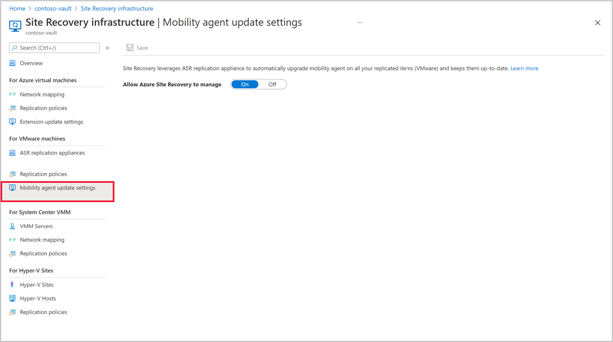
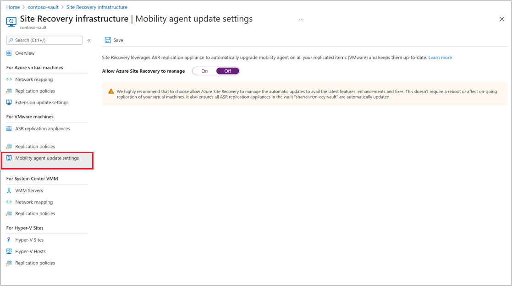
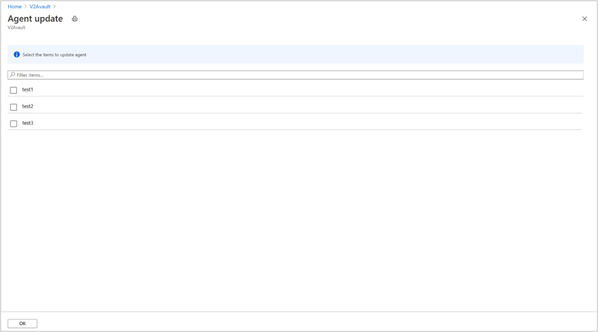
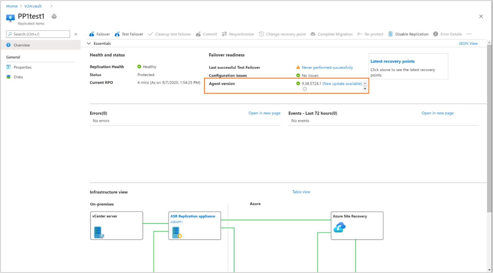
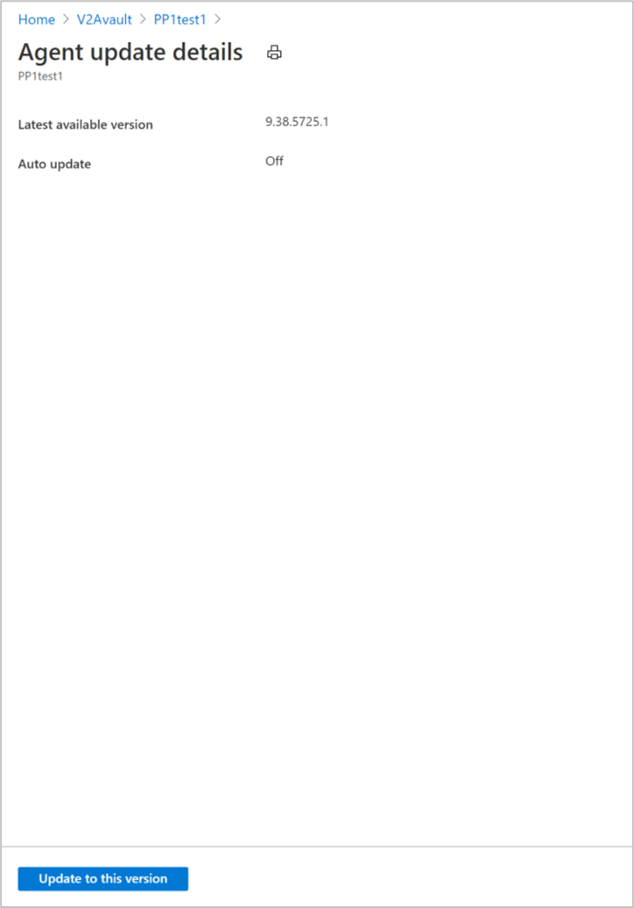

# Upgrade Mobility Service and Appliance components (Modernized)

From this modernized mobility service and appliance components, you do not need to maintain source machine's Root/Admin credentials for performing upgrades. The credentials are required only for the initial installation of the agent on source machines. Once done, you can remove the credentials and the upgrades will occur automatically.

## Update mobility agent automatically

By default, automatic updates are enabled on a vault. Automatic updates will be triggered at 12:00 AM local time every day, if a new version is available.

> [!NOTE]
> If you are using private preview bits, automatic updates are blocked for the protected machines. Ensure that you setup Site Recovery on your machine again, using a fresh Azure Site Recovery replication appliance.

To avail the latest features, enhancements, and fixes, we recommend you choose **Allow Site Recovery to manage** option on the **Mobility agent upgrade settings**. Automatic updates do not require a reboot or affect on-going replication of your virtual machines. Automatic updates also ensure that all the replication appliances in the vault are automatically updated.

To turn off the automatic updates, toggle the **Allow Site Recovery to manage** button.

## Update mobility agent manually

If you have turned off automatic updates for your mobility agent, you can update the agent manually using the following procedures:

### Upgrade mobility agent on multiple protected items

To manually update mobility agent on multiple protected items, follow these steps:

1. Navigate to **Recovery services vault** > **Replicated items**, click *New Site Recovery mobility agent update is available*. Click to install.

   

2. Choose the source machines to update and then click **OK**.

   >[!NOTE]
   >If prerequisites to upgrade Mobility service are not met, then the VM cannot be selected. See information on [how to resolve](#resolve-blocking-issues-for-agent-upgrade).

4. After initiating the upgrade, a Site Recovery job is created in the vault for each upgrade operation, and can be tracked by navigating to **Monitoring** > **Site Recovery jobs**.

### Update mobility agent for a single protected machine

To update mobility agent of a protected item, follow these steps:
1. Navigate to **recovery services vault** > **Replicated items**, select a VM.
2. In VM's **Overview** blade, against **Agent version**, view the current version of the mobility agent. If a new update is available, the status is updated as **New update available**.

   

3. Click **New update available**, latest available version is displayed. Click **Update to this version** to initiate the update job.

   

   > [!NOTE]
   > If upgrade is blocked, check and resolve the errors as detailed [here](#resolve-blocking-issues-for-agent-upgrade).

### Update mobility agent when private endpoint is enabled 

When you enable private endpoints, automatic updates will not be available. To update mobility agent of a protected item, follow these steps:  

1. Navigate to **Recovery services vault** > **Replicated items**, and select a VM. 

2. In VM's **Overview** blade, under **Agent version**, you can view the current version of the mobility agent. If a new update is available, the status is updated as **New update available**. 

3. Confirm the availability of new version, download the latest agent version’s package from [here](./site-recovery-whats-new.md#supported-updates) on the source machine and update the agent version. 

### Update mobility agent on Windows machines

To update mobility agent on Windows machines, follow these steps:

1.	Open command prompt and navigate to the folder where the update package has been placed.

    `cd C:\Azure Site Recovery\Agent`

2.	To extract the update package, run the below command:

    `.\Microsoft-ASR_UA*Windows*release.exe /q /x:C:\Azure Site Recovery\Agent`

3.	To proceed with the update, run the below command:

    `.\UnifiedAgent.exe /Role "MS" /Platform VmWare /Silent  /InstallationType Upgrade /CSType CSPrime  /InstallLocation "C:\Program Files (x86)\Microsoft Azure Site Recovery"`

4.	Registration will be triggered automatically after the agent has been updated. To manually check the status of registration, run the below command:

    `"C:\Azure Site Recovery\Agent\agent\UnifiedAgentConfigurator.exe" /SourceConfigFilePath "config.json" /CSType CSPrime`

#### Upgrade settings

|Setting|Details|
|---|---|
|Syntax|	`.\UnifiedAgent.exe /Role "MS" /Platform vmware /Silent  /InstallationType Upgrade /CSType CSPrime  /InstallLocation "C:\Azure Site Recovery\Agent"`|
|`/Role`|Mandatory update parameter.  Specifies that the Mobility service (MS) will be updated.|
|`/InstallLocation`|Optional.  Specifies the Mobility service installation location.|
|`/Platform`|Mandatory.  Specifies the platform on which the Mobility service is updated: VmWare for VMware VMs/physical servers.  Azure for Azure VMs.   If you're treating Azure VMs as physical machines, specify VmWare.|
|`/Silent`|Optional.  Specifies whether to run the installer in silent mode.|
|`/CSType`|Mandatory.  Defines modernized or legacy architecture. (Use CSPrime)|

#### Registration settings

|Setting|Details|
|---|---|
|Syntax|`"<InstallLocation>\UnifiedAgentConfigurator.exe" /SourceConfigFilePath "config.json" /CSType CSPrime >`|
|`/SourceConfigFilePath`|Mandatory.  Full file path of the Mobility Service configuration file. Use any valid folder.|
|`/CSType`|Mandatory.  Defines modernized or legacy architecture. (CSPrime or CSLegacy).|

### Update mobility agent on Linux machines

To update mobility agent on Linux machines, follow these steps:

1.	From a terminal session, copy the update package to a local folder such as `/tmp` on the server for which the agent is being updated and run the below command:

    `cd /tmp ;`
    `tar -xvf Microsoft-ASR_UA_version_LinuxVersion_GA_date_release.tar.gz`

2.	To update, run the below command:

    `./install -q -r MS -v VmWare -a Upgrade -c CSPrime`

3.	Registration will be triggered automatically after the agent has been updated. To manually check the status of registration, run the below command:

    `<InstallLocation>/Vx/bin/UnifiedAgentConfigurator.sh -c CSPrime -S config.json -q`

#### Installation settings

|Setting|Details|
|---|---|
|Syntax|`./install -q -r MS -v VmWare -a Upgrade -c CSPrime`|
|`-r`|Mandatory.  Installation parameter.  Specifies whether the Mobility service (MS) should be installed.|
|`-d`|Optional.  Specifies the Mobility service installation location: `/usr/local/ASR`.|
|`-v`|Mandatory.  Specifies the platform on which Mobility service is installed.  VMware for VMware VMs/physical servers.  Azure for Azure VMs.|
|`-q`|Optional.  Specifies whether to run the installer in silent mode.|
|`-c`|Mandatory.  Defines modernized or legacy architecture. (CSPrime or CSLegacy).|
|`-a`|Mandatory.  Specifies that the mobility agent needs to be upgraded and not installed.|

#### Registration settings

|Setting|Details|
|---|---|
|Syntax|`<InstallLocation>/Vx/bin/UnifiedAgentConfigurator.sh -c CSPrime -S config.json -q`|
|`-S`|Mandatory.  Full file path of the Mobility Service configuration file. Use any valid folder.|
|`-c`|Mandatory.  Defines modernized or legacy architecture. (CSPrime or CSLegacy).|
|`-q`|Optional.  Specifies whether to run the installer in silent mode.|

## Mobility agent on latest version

After Mobility agent is updated to the latest version or has been updated automatically to the latest version,  the status displays as **Up to date**.

### Resolve blocking issues for agent upgrade

If prerequisites to upgrade the mobility agent are not met, then VM cannot be updated. Resolve these to proceed with the upgrade.

The prerequisite includes, but not limited to:

- A pending mandatory reboot on the protected machine.

- If the replication appliance is on an incompatible version.

- If the replication appliance components –  Proxy server or Process server is unable to communicate with Azure services.

- If mobility agent on the protected machine is not able to communicate with the replication appliance.

In case any of the above issues are applicable, the status is updated as **Cannot update to latest version**. Click the status to view the reasons blocking the update and recommended actions to fix the issue.

>[!NOTE]
>After resolving the blocking reasons, wait for 30 minutes to retry the operations. It takes time for the latest information to be updated in the Site Recovery services.

### Mobility agent upgrade job failure

In case mobility agent upgrade operation fails (manually triggered or automatic upgrade operation), the job is updated with the reason for failure. Resolve the errors and then retry the operation.

To view the failure errors, you can either navigate to Site Recovery jobs, click a specific job to fetch the resolution of errors or you can use the steps below:

1. Navigate to replicated items section, select a specific VM.

2. In the **Overview** blade, against **Agent version**, the current version of the mobility agent displayed.

3. Next to the current version, the status is updated with the message **Update failed**. Click the status to retry the update operation.

4.  A link to the previous upgrade job is available. Click the job to navigate to the specific job.

5. Resolve the previous job errors.

Trigger the update operation after resolving the errors from previous failed job.

## Upgrade appliance

By default, automatic updates are enabled on the appliance. Automatic updates are triggered at 12:00 AM local time every day, if a new version is available for any of the components.

To check the update status of any of the components, navigate to appliance server and open **Microsoft Azure Appliance Configuration Manager**. Navigate to  **Appliance components**  and expand it to view the list of all the components and their version.

If any of these need to be updated, then the **Status** reflects the same. Select the status message to upgrade the component.

  

### Turn off auto-update

1. On the server running the appliance, open the Registry Editor.
2. Navigate to **HKEY_LOCAL_MACHINE\SOFTWARE\Microsoft\AzureAppliance**.
3. To turn off auto-update, create a registry key **AutoUpdate** key with DWORD value of 0.

    

### Turn on auto-update

You can turn on auto-update by deleting the AutoUpdate registry key from HKEY_LOCAL_MACHINE\SOFTWARE\Microsoft\AzureAppliance.

To delete the registry key:

1. On the server running the appliance, open the Registry Editor.
2. Navigate to **HKEY_LOCAL_MACHINE\SOFTWARE\Microsoft\AzureAppliance**.
3. Delete the registry key **AutoUpdate** that was previously created to turn off auto-update.

### Update appliance components when private endpoint is enabled

When you enable private endpoints, automatic updates will not be available. To update all the components of Azure Site Recovery replication appliance, follow these steps: 

1.	Navigate to this page and check if a new version for the components has been released for a particular version.  
2.	Download packages of all the versions for which an update is available on the appliance and update all the components. 

#### Update Process server

1.	To update the process server, download the latest version [here](./site-recovery-whats-new.md#supported-updates). 
2.	Download the update package to the Azure Site Recovery replication appliance. 
3.	Open command prompt and navigate to the folder where the update package has been placed.
    
    `cd C:\Downloads`

4.	To update the process server, run the below command: 
    
    `msiexec.exe /i ProcessServer.msi ALLUSERS=1 REINSTALL=ALL REINSTALLMODE=vomus /l*v msi.log`

#### Update Recovery Services agent

To update the Recovery Service agent, download the latest version [here](./site-recovery-whats-new.md#supported-updates).

1.	Download the update package to the Azure Site Recovery replication appliance. 
2.	Open command prompt and navigate to the folder where the update package has been placed.
    
    `cd C:\Downloads`

3.	To update the Recovery Service agent, run the below command: 
    
    `MARSAgentInstaller.exe /q /nu - for mars agent`

#### Update remaining components of appliance

1.	To update the remaining components of the Azure Site Recovery replication appliance, download the latest version  [here](./site-recovery-whats-new.md#supported-updates).
2.	Open the downloaded `.msi` file which triggers the update automatically.
3.	Check the latest version in Windows settings > **Add or remove program**.

### Resolve issues with component upgrade

If prerequisites to upgrade any of the components are not met, then it cannot be updated. The reasons/prerequisites include, but not limited to,

- If one of the components of the replication appliance is on an incompatible version.

- If replication appliance is unable to communicate with Azure services.

In case any of the above issues are applicable, the status is updated as **Cannot update to latest version**. Select the status to view the reasons blocking the update and recommended actions to fix the issue. After resolving the blocking reasons, try the update manually.